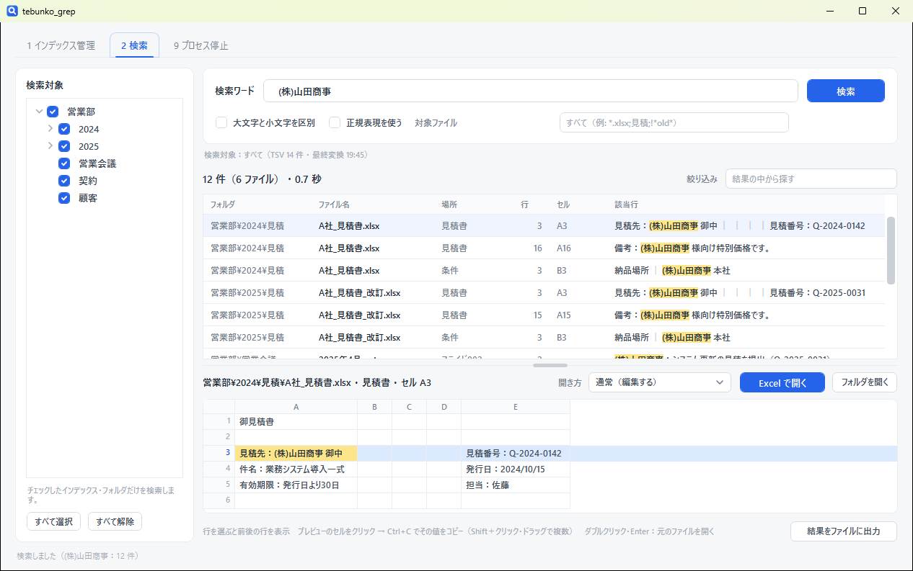
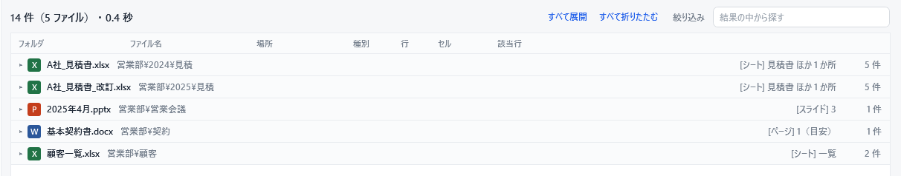
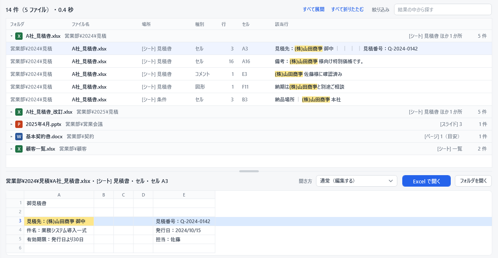
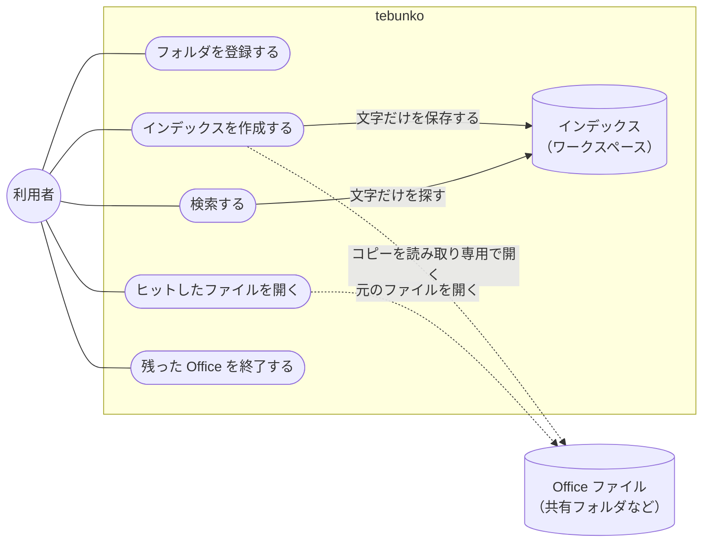

<div align="center">


# tebunko

**フォルダに溜まった Excel・Word・PowerPoint を、中身の文字ですばやく検索。**

Office があれば、すぐに使えます。インストール不要・管理者権限不要・通信なし。

[](https://github.com/hsgwa/tebunko/releases/latest)
[](https://github.com/hsgwa/tebunko/actions/workflows/test.yml)
[](https://codecov.io/gh/hsgwa/tebunko)
[](https://scorecard.dev/viewer/?uri=github.com/hsgwa/tebunko)
[](#動作環境)
[](LICENSE)

[**ダウンロード**](https://github.com/hsgwa/tebunko/releases/latest) ・ [使い方](#使い方) ・ [ドキュメント](https://hsgwa.github.io/tebunko/) ・ [サポート](.github/SUPPORT.ja.md)



</div>

## こんなときに

「(株)山田商事の名前が入った見積書、どこにあったっけ……」

共有フォルダに Excel や Word のファイルが何千もあると、1 つずつ開いて探すのはひと苦労です。エクスプローラーで検索しても、どのシートのどのセルに書いてあるかまでは分かりません。

tebunko は、フォルダの中の Office ファイルから文字を取り出して、検索用の索引（**インデックス**）を作っておきます。検索はこのインデックスを使うので、ファイルを 1 つも開かずに、一致した箇所が数秒で一覧になります。ヒットしたファイルはダブルクリックで開き、そのまま編集できます。Excel なら、該当のセルを選んだ状態で開きます。

## 目次

- [特長](#特長)
- [動作環境](#動作環境)
- [インストール](#インストール)
- [使い方](#使い方)
- [制限事項](#制限事項)
- [安全性](#安全性)
- [仕組み](#仕組み)
- [開発に参加する](#開発に参加する)
- [開発状況](#開発状況)
- [ライセンス](#ライセンス)

## 特長

- **Office があれば、すぐに使える。** 必要なのは Windows と Microsoft Office だけです。管理者権限も、追加のソフトも要りません。zip を展開するだけでも、インストーラーで入れても使えます。
- **すばやく探せる。** 100 万行（約 70MB）のインデックスでも、1〜2 秒で結果が出ます。大きなインデックスでは、Windows Search で探す範囲を先に絞ります（高速検索。下の「高速検索」）。
- **どこに書いてあるかが一目で分かる。** ファイルごとに、シート・ページ・スライドと行まで表示します。一致した文字は黄色で目立たせます。
- **図形やコメントの中も探せる。** セルや段落の文字だけでなく、図形・テキストボックス・コメントの文字も検索できます。Word・PowerPoint では SmartArt やグラフの文字も対象です。
- **インデックスの更新は変更分だけ。** 2 回目からのインデックス作成では、前回から変更・追加されたファイルだけを読み込みます。途中で止めても、次は続きから再開します。
- **共有フォルダにも使える。** ネットワークドライブや `\\server\share` の形のフォルダも登録できます。
- **元のファイルを書き換えない。** インデックスの作成では、ファイルのコピーを読み取り専用・マクロ無効で開きます。

| 種類 | 拡張子 | 結果に表示する場所 |
|---|---|---|
| Excel | .xlsx / .xlsm / .xls / .xlsb | シート（行・セル） |
| Word | .docx / .docm / .doc | ページ（目安）・ヘッダー/フッター・脚注 |
| PowerPoint | .pptx / .pptm / .ppt | スライド・ノート・フッター |

## 動作環境

tebunko は、**Windows と Microsoft Office が入っている PC なら、どこでも動く**ように作っています。必要なものは次だけです。

| 必要なもの | 用途 |
|---|---|
| Windows | Windows PowerShell 5.1 で動きます。Windows 10・11 には最初から入っています |
| Microsoft Excel | Excel ファイルからの文字の取り出し |
| Microsoft Word・PowerPoint | 旧形式（.doc・.ppt）のファイルを読み込むときだけ使います |

これ以外に依存するものはありません。

- **インストール不要** … zip を展開するだけ。レジストリも書き換えません（手軽に入れたいときはインストーラーも使えます。下の「インストール」）
- **管理者権限不要** … 一般のユーザーのまま使えます
- **設定の変更不要** … PowerShell の実行ポリシーを変える必要はありません
- **ネットワーク不要** … 通信をしないので、インターネットにつながらない PC でも使えます
- **追加のライブラリなし** … 他者が作ったライブラリを含みません。zip 版は実行ファイル（.exe・.dll）も含みません

ソフトを自由に入れられない会社の PC でも、そのまま使えます。

## インストール

[Releases](https://github.com/hsgwa/tebunko/releases/latest) に 2 つの形で置いています。中身（ツールの本体）は同じです。

| 形 | 向いている場合 |
|---|---|
| インストーラー（`tebunko-setup-<バージョン>.exe`） | 手軽にインストール・アンインストールしたい |
| zip（`tebunko-<バージョン>.zip`） | 実行ファイル（.exe）を入れたくない・入れられない。共有フォルダに置いて使いたい |

**インストーラーで入れる**

1. `tebunko-setup-<バージョン>.exe` をダウンロードして実行し、画面に沿って進めます。管理者権限は要りません（管理者なら「すべてのユーザー」を選んで `C:\Program Files` に入れることもできます）。
2. スタートメニューの「tebunko」から起動します。

インストーラーにはまだコード署名が無いため、「Windows によって PC が保護されました」と表示されます。［詳細情報］→［実行］を押してください。新しい版に更新するときは、新しい版のインストーラーを実行するだけです（設定は引き継ぎます）。アンインストールは「設定」→「アプリ」から行います。インデックス（ワークスペース）は消さないので、不要なら手で削除してください（文書の文字がそのまま入っています）。

**zip を展開して使う**

1. `tebunko-<バージョン>.zip` をダウンロードし、好きな場所に展開します。共有フォルダに置いてもかまいません。
2. 展開したフォルダの `tebunko.bat` をダブルクリックすると、画面が開きます。フォルダには、ほかにツールの本体（`scripts`）・この説明（`README.md`）・ライセンス（`LICENSE`）・版の記録（`VERSION.txt`）が入っています。

初回は「セキュリティの警告」が表示されます。［実行］を押してください。表示させたくない場合は、先に `tebunko.bat` のプロパティを開き、［ブロックの解除］にチェックを入れておきます。

## 使い方

使い方は 3 ステップです。

### 1. フォルダを登録して、インデックスを作成する

［1 インデックス管理］タブで［追加…］を押し、Office ファイルのあるフォルダを選びます。［作成］にチェックを入れて［インデックス作成を開始］を押すと、フォルダの中のファイルを読み込み始めます。進み具合と残り時間は画面に表示されます。


かかる時間の目安は、Office ファイル 300 件（ほとんどが Excel）で約 3 分です。2 回目からは変更・追加されたファイルだけを読み込むので、変更が無ければ数秒で終わります。大きなファイルが多いと、そのぶん時間がかかります。インデックスの作成中も検索できます。

### 2. 検索する

［2 検索］タブで検索ワードを入れ、Enter を押します。300 件のファイルでも 1〜2 秒で、ヒットしたファイルが見出しとして並びます。



ファイル名をクリックすると、そのファイルの一致した行が開きます。行を選ぶと、その前後が下のプレビューに表示されます。



### 3. ファイルを開いて編集する

行をダブルクリックすると、元のファイルが開きます。そのまま編集して保存できます。Excel なら、該当のセルを選んだ状態で開きます。

**よく使うオプション**

| オプション | 内容 |
|---|---|
| ［正規表現を使う］ | オフのときは、`(株)` や `1.5` もそのままの文字として探します |
| ［大文字と小文字を区別］ | 英字の大文字と小文字を区別します |
| ［図形も検索］［コメントも検索］ | 最初はオンです。本文だけを探したいときはオフにします |
| 対象ファイル | ファイル名で絞り込みます（例: `*.xlsx;見積;!*old*`） |
| ［結果をファイルに出力］ | 検索結果をワークスペースの `検索結果.txt` に書き出します |

元のフォルダを移動したときは、［編集…］で新しい場所を指定するだけで済みます。インデックスを作り直す必要はありません。

### 高速検索とワークスペース

インデックス作成は、検索用の集約ファイル（ワークスペースの `index`）とは別に、Windows Search に索引させる txt（`system_index`）を作ります。検索するときは、Windows Search で検索語を含みうるフォルダを先に絞り、その中だけを探します。結果は、すべてを探したときと同じです。検索ワードの下に `高速検索：使用可` / `使用不可` を表示します（正規表現・1 文字のワード・Windows Search が使えないときは使用不可で、すべてを探します）。

高速検索を早く効かせるには、ワークスペースの `index` を Windows Search の対象から外してください（外さなくても結果は同じですが、Windows Search が集約ファイルの処理に時間を取られ、効くまで 1 日以上かかることがあります）。

1. ［スタート］で「インデックスのオプション」を開く
2. ［変更］を押し、ワークスペース（既定は `ドキュメント\tebunko_ws`）の下の `index` のチェックを外す
3. `system_index` にはチェックが付いたままにする

インデックス・取り込み一覧・ログを置くフォルダ（**ワークスペース**）は、既定では `%USERPROFILE%\Documents\tebunko_ws` です（Windows Search の対象になる場所）。そこにほかのファイルが置いてあるときは使わず、別の空のフォルダを選んでもらいます。［8 設定］の［変更…］で、アクセス権を絞ったフォルダや容量のあるドライブの空のフォルダに変えられます。tebunko を書き込めない場所（`C:\Program Files` など）に置いたときは、設定とインデックスを利用者ごとの `%LOCALAPPDATA%\tebunko\` の下に置きます。

画面ごとの詳しい使い方は [ドキュメントの「使い方」](https://hsgwa.github.io/tebunko/guide/) をご覧ください。

## 制限事項

- **検索できない文字：** 画像の中の文字、埋め込みオブジェクト、Excel の非表示シート・ヘッダー/フッター・グラフ・SmartArt、PowerPoint のスライドマスター
- **読み込めないファイル：** パスワード付きのファイル、1 ファイルの読み込みに 10 分以上かかるファイル
- **検索：** 一度に探せるのは 1 ワードです。結果は 10,000 件までです
- **Excel の数値：** セルに表示されている形で検索します。表示形式が「標準」で 12 桁以上の数値は指数表記（`4.90123E+12`）になるため、元の番号では見つかりません
- **反映のタイミング：** 元のファイルを変更した内容は、次にインデックスを作成したときに反映されます

制限事項の一覧は [設計書](docs/design/indexer/known-issues.md) にあります。

## 安全性

会社の PC にも安心して入れられるよう、tebunko が何をして何をしないかを公開し、毎回テストで確かめています。

- **中身は PowerShell のスクリプトと画面の定義だけです。** 他者が作ったライブラリは含みません（[部品表](sbom.cdx.json)）。zip 版は実行ファイルも含みません。インストーラー版は、起動用の小さな `tebunko.exe`（ソースは `installer/tebunko.cs`）と、Inno Setup のインストーラー・アンインストーラーが加わります。
- **通信はしません。** 管理者権限の要求、レジストリの変更、常駐もしません（インストーラー版は、Windows の「アプリ」の一覧に出すためのアンインストールの情報だけを書きます）。
- **テストで確かめています。** これらは `tests/meta/safety.Tests.ps1` と静的解析（PSScriptAnalyzer・CodeQL）が、変更のたびに CI で確かめます。

> [!IMPORTANT]
> インデックス（ワークスペースの `index`）には文書の文字がそのまま入っており、元のファイルのアクセス権は引き継がれません。インデックスを置くフォルダ（ワークスペース。既定は `%USERPROFILE%\Documents\tebunko_ws`）のアクセス権は、検索するフォルダと同じか、それより厳しくしてください。

根拠やご自身で確かめる手順、配布ファイルの検証方法は [安全性の説明](docs/safety/index.md) に、脆弱性の報告先は [SECURITY.md](.github/SECURITY.ja.md) にあります。

## 仕組み

利用者が tebunko でできることと、その裏で何が起きているかを図にしました。



| できること | 裏で起きていること |
|---|---|
| フォルダを登録する | 検索したい Office ファイルのあるフォルダを覚えます。フォルダの中身には、まだ触れません |
| インデックスを作成する | 登録したフォルダの Office ファイルを 1 つずつ、コピーを読み取り専用で開き、シート・ページ・スライドごとに文字だけを取り出してインデックスに保存します。2 回目からは、前回から更新日時が変わったファイルと、新しく増えたファイルだけを読み込みます |
| 検索する | Office ファイルは開かず、インデックスの文字だけを探します。そのため、ファイルが何千あっても数秒で結果が出ます |
| ヒットしたファイルを開く | 元のファイルを Excel・Word・PowerPoint で開きます。そのまま編集して保存できます |
| 残った Office を終了する | インデックスの作成を途中で止めたときなどに残った Excel・Word・PowerPoint を、［9 プロセス停止］タブで終了します |

設計の詳細は [設計書](https://hsgwa.github.io/tebunko/)（[docs/](docs/design/index.md)）にあります。

## 開発に参加する

不具合の報告や要望、改善の提案をお待ちしています。参加する際は [行動規範](.github/CODE_OF_CONDUCT.ja.md) をお守りください。

| したいこと | 場所 |
|---|---|
| 不具合の報告・機能の要望 | [Issue](https://github.com/hsgwa/tebunko/issues/new/choose) |
| 使い方の質問 | [SUPPORT.md](.github/SUPPORT.ja.md) |
| 脆弱性の報告（非公開） | [SECURITY.md](.github/SECURITY.ja.md) |
| 変更の提案 | [CONTRIBUTING.md](.github/CONTRIBUTING.ja.md) |

テストは次のコマンドで実行できます（Pester 5.9.0。入れ方は [CONTRIBUTING](.github/CONTRIBUTING.ja.md)）。Pull Request を出すと、CI がテスト・カバレッジ・静的解析・個人情報の有無を自動で確かめます。

```powershell
.\tests\run.ps1
```

## 開発状況

tebunko は積極的に開発しています。機能や画面は、これからも変わります。変更点は [Releases](https://github.com/hsgwa/tebunko/releases) でご覧いただけます。

## ライセンス

[MIT](LICENSE)

Microsoft、Excel、Word、PowerPoint、Windows、PowerShell は、米国 Microsoft Corporation の米国およびその他の国における登録商標または商標です。tebunko は Microsoft Corporation とは関係のない個人のプロジェクトであり、Microsoft Corporation が承認・支援したものではありません。
