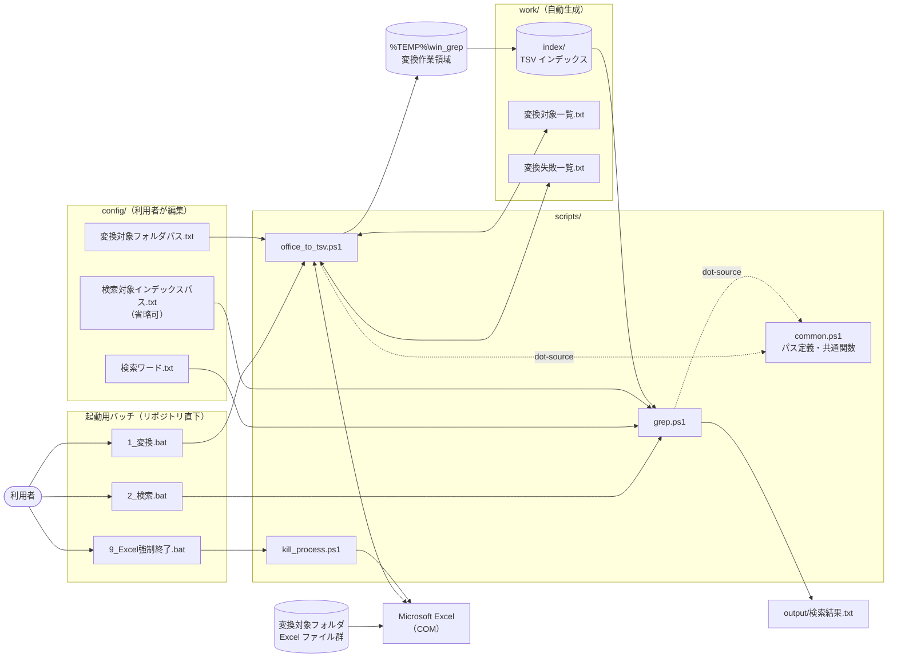
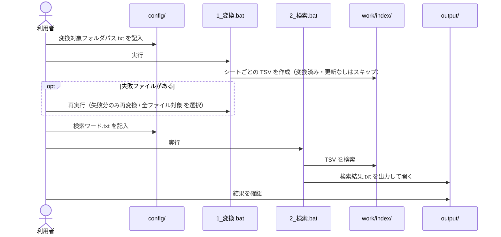
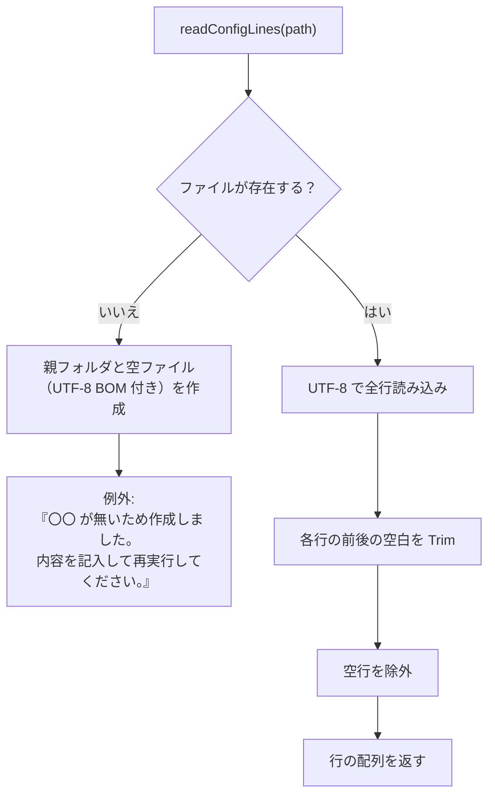
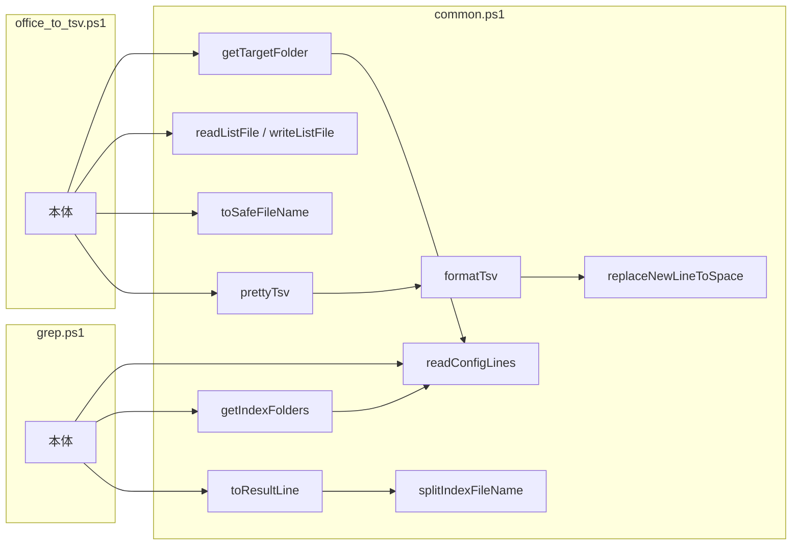

# win_grep 設計書（インデックス）

本設計書は `scripts/*.ps1` および起動用 `.bat` の実装から仕様を書き起こしたものである。記載内容は**現行実装の挙動**を正とする。

本書（インデックス）には全体構成と、複数のツールにまたがる共通事項をまとめる。ツールごとの仕様は下表の各設計書を参照。

## ドキュメント構成

| 設計書 | 起動用バッチ | スクリプト | 内容 |
|---|---|---|---|
| [00_index.md](00_index.md)（本書） | – | `common.ps1` | 概要・全体構成・動作環境・フォルダ構成・共通モジュール・テスト |
| [01_変換.md](01_変換.md) | `1_変換.bat` | `office_to_tsv.ps1` | Excel → TSV 変換（インデックス作成） |
| [02_検索.md](02_検索.md) | `2_検索.bat` | `grep.ps1` | TSV インデックスの検索 |
| [09_Excel強制終了.md](09_Excel強制終了.md) | `9_Excel強制終了.bat` | `kill_process.ps1` | 残った Excel プロセスの強制終了 |

図はすべて Mermaid で記述している（GitHub / VS Code の Markdown プレビュー等で描画される）。

---

## 1. 概要

### 1.1 目的

フォルダ配下に大量に存在する Excel ファイル（`.xlsx` / `.xlsm` / `.xls` / `.xlsb`）に対し、**Excel を開かずに全文検索**できるようにする。

### 1.2 方式

2 段階方式を採る。

1. **インデックス作成**（[01_変換.md](01_変換.md)）
   Excel を COM で操作し、各ブックの各シートを「1 シート = 1 ファイル」の TSV（UTF-8）に変換して `work/index/` に蓄積する。2 回目以降は、変換済みで更新の無いブックをスキップする（差分変換）。
2. **検索**（[02_検索.md](02_検索.md)）
   インデックスの TSV を `Select-String` で検索し、ヒットした「ファイル名（相対フォルダ付き）・シート名・該当行」を `output/検索結果.txt` に出力する。

補助ツールとして、変換を異常終了させた際に残る Excel プロセスを強制終了するツール（[09_Excel強制終了.md](09_Excel強制終了.md)）を持つ。

### 1.3 全体構成

### 1.4 処理の流れ（利用者視点）

---

## 2. 動作環境・前提条件

| 項目 | 内容 |
|---|---|
| OS | Windows |
| 実行環境 | Windows PowerShell 5.1（`powershell.exe`） |
| 必須ソフトウェア | Microsoft Excel（`Excel.Application` COM オブジェクトを使用） |
| 起動方法 | `.bat` をダブルクリック。`.bat` は `powershell -NoProfile -ExecutionPolicy Bypass -File "%~dp0scripts\<スクリプト>.ps1"` を実行するため、実行ポリシーの設定変更は不要 |
| スクリプトの文字コード | `scripts/*.ps1`・`tests/*.ps1` は **UTF-8（BOM 付き）**、改行 CRLF。PowerShell 5.1 は BOM なしファイルをシステム既定コードページ（CP932）で読むため、BOM を外すと日本語リテラルが化ける |
| テスト | Pester 3.4（Windows PowerShell 5.1 標準）。`Invoke-Pester .\tests` |

---

## 3. フォルダ・ファイル構成

### 3.1 フォルダ構成

| パス | 種別 | 説明 |
|---|---|---|
| `1_変換.bat` | 起動用バッチ | Excel → TSV 変換（インデックス作成） |
| `2_検索.bat` | 起動用バッチ | インデックスを検索 |
| `9_Excel強制終了.bat` | 起動用バッチ | 変換中断時に残った Excel プロセスを終了 |
| `config/` | 設定 | 利用者が編集する設定（`*.txt` は git 管理外） |
| `scripts/common.ps1` | スクリプト | パス定義・共通関数（[5 章](#5-共通モジュール-scriptscommonps1)） |
| `scripts/office_to_tsv.ps1` | スクリプト | 変換（[01_変換.md](01_変換.md)） |
| `scripts/grep.ps1` | スクリプト | 検索（[02_検索.md](02_検索.md)） |
| `scripts/kill_process.ps1` | スクリプト | Excel 強制終了（[09_Excel強制終了.md](09_Excel強制終了.md)） |
| `tests/` | テスト | Pester テスト |
| `docs/` | ドキュメント | 設計書 |
| `work/` | 自動生成 | git 管理外。削除すると全件再変換になる |
| `work/index/` | 自動生成 | 変換済み TSV |
| `work/変換対象一覧.txt` | 自動生成 | 変換の途中状態 |
| `work/変換失敗一覧.txt` | 自動生成 | 変換に失敗したファイル |
| `output/検索結果.txt` | 自動生成 | 検索結果（git 管理外） |

変換作業領域は `%TEMP%\win_grep` に置く（Excel は `[` `]` を含むパスに保存できないため、ツールの配置場所に依存させない）。

すべてのパスは `common.ps1` で `$rootDir = Split-Path $PSScriptRoot -Parent`（= リポジトリ直下）を基準に決まる。**カレントディレクトリには依存しない。**
ファイル操作は `-LiteralPath` または .NET の `System.IO` を使い、`[` `]` を含むファイル名・フォルダ名を扱える。

### 3.2 入出力ファイル一覧

| パス | 種別 | 作成 | 使用 | 文字コード | 内容 |
|---|---|---|---|---|---|
| `config/変換対象フォルダパス.txt` | 設定 | 利用者 | 変換 | UTF-8 | 変換対象 Excel のルートフォルダ（1 行） |
| `config/検索ワード.txt` | 設定 | 利用者 | 検索 | UTF-8 | 検索ワード（1 行 1 ワード、正規表現） |
| `config/検索対象インデックスパス.txt` | 設定（省略可） | 利用者 | 検索 | UTF-8 | 検索対象インデックスフォルダ（1 行 1 フォルダ） |
| `work/変換対象一覧.txt` | 途中状態 | 変換 | 変換 | UTF-8（BOM 付き） | 未処理の Excel（変換対象フォルダからの相対パス、1 行 1 件） |
| `work/変換失敗一覧.txt` | 途中状態 | 変換 | 変換 | UTF-8（BOM 付き） | 変換に失敗した Excel の相対パス |
| `%TEMP%\win_grep\` | 作業領域 | 変換 | 変換 | – | 変換途中の `sheet<N>.tmp`（UTF-16LE）/ `*.tsv` |
| `work/index/` | インデックス | 変換 | 検索 | UTF-8（BOM 付き）、CRLF | シートごとの TSV |
| `output/検索結果.txt` | 出力 | 検索 | 利用者 | UTF-8（BOM 付き）、CRLF | 検索結果 |

各設定ファイルの内容の仕様は、使用するツールの設計書に記載する（変換対象フォルダパス → [01_変換.md](01_変換.md)、検索ワード・検索対象インデックスパス → [02_検索.md](02_検索.md)）。

---

## 4. 設定ファイルの共通読み込み規則（`readConfigLines`）

- 前後の空白・末尾の改行・空行は無視される。
- ファイルが無ければ空ファイルを作成し、例外で処理を中断する（初回実行時に設定ファイルのひな形が作られる）。
- 例外は各スクリプトの `trap` で「＜エラー＞」＋赤字メッセージとして表示され、`pause` の後に終了する。

---

## 5. 共通モジュール `scripts/common.ps1`

各スクリプト・テストから dot-source（`. "$PSScriptRoot\common.ps1"`）して使う。

### 5.1 パス定義

| 変数 | 値 |
|---|---|
| `$rootDir` | `scripts/` の親（リポジトリ直下） |
| `$configDir` | `$rootDir\config` |
| `$workDir` | `$rootDir\work` |
| `$indexDir` | `$workDir\index` |
| `$tmpDir` | `%TEMP%\win_grep` |
| `$outputDir` | `$rootDir\output` |
| `$targetFolderFile` | `$configDir\変換対象フォルダパス.txt` |
| `$searchWordFile` | `$configDir\検索ワード.txt` |
| `$indexPathFile` | `$configDir\検索対象インデックスパス.txt` |
| `$listFile` | `$workDir\変換対象一覧.txt` |
| `$errorFile` | `$workDir\変換失敗一覧.txt` |
| `$resultFile` | `$outputDir\検索結果.txt` |
| `$utf8Bom` | BOM 付き UTF-8 の `System.Text.Encoding` |

### 5.2 関数一覧

| 関数 | 入力 | 出力 | 概要 | 詳細 | 使用元 |
|---|---|---|---|---|---|
| `readConfigLines` | path | string[] | 設定ファイルの有効行 | [4 章](#4-設定ファイルの共通読み込み規則readconfiglines) | getTargetFolder, getIndexFolders, 検索 |
| `readListFile` | path | string[] | 一覧ファイルの空行以外の行（Trim しない）。無ければ空配列 | – | 変換 |
| `writeListFile` | path, lines | – | 一覧ファイルを UTF-8（BOM 付き）で保存 | – | 変換 |
| `getTargetFolder` | path（既定 `$targetFolderFile`） | string | 有効行 1 行（前後の `"` を除去）を返す。それ以外は例外 | [01_変換.md](01_変換.md) | 変換 |
| `getIndexFolders` | path（既定 `$indexPathFile`） | string[] | 検索対象インデックスフォルダ | [02_検索.md](02_検索.md) | 検索 |
| `toSafeFileName` | name | string | ファイル名禁止文字を全角に置換 | [01_変換.md](01_変換.md) | 変換 |
| `replaceNewLineToSpace` | inputString | string | `"` で囲まれた範囲の CR/LF を**削除**する | [01_変換.md](01_変換.md) | formatTsv |
| `formatTsv` | content | string | TSV 整形 | [01_変換.md](01_変換.md) | prettyTsv |
| `prettyTsv` | 入力パス, 出力パス | bool | 入力（UTF-16）を読み、`formatTsv` して UTF-8（BOM 付き）で保存。内容が空なら保存せず `$false` | [01_変換.md](01_変換.md) | 変換 |
| `splitIndexFileName` | fileName | `@{book; sheet}` | インデックスファイル名をブック名・シート名に分解 | [02_検索.md](02_検索.md) | toResultLine |
| `toResultLine` | fileName, line | string | `ブック名<TAB>シート名<TAB>該当行` を返す | [02_検索.md](02_検索.md) | 検索 |

`kill_process.ps1` は `common.ps1` を使わない。

---

## 6. テスト

### 6.1 単体テスト

`tests/common.Tests.ps1`（Pester 3.4）で `common.ps1` の関数とパス定義、全スクリプトの構文を検証する。

| 対象 | 主な確認内容 |
|---|---|
| `toSafeFileName` | 禁止文字の全角化、`/` → `／`、`"` → `”`、使用可能文字は不変 |
| `replaceNewLineToSpace` | `"` 内の改行は除去、`"` 外の改行は保持 |
| `formatTsv` | 空行・行末空白の除去、セル内改行を含む行を 1 行にまとめる |
| `prettyTsv` | UTF-16 → UTF-8（BOM 付き）、`[` `]` を含む出力パス、空なら出力しない |
| `readListFile` / `writeListFile` | `[` `]`・先頭の空白を含むパスの往復、ファイル無しは空配列 |
| `splitIndexFileName` | ブック名・シート名の分解（`_` を含むシート名、`.xlsm`、形式外） |
| `toResultLine` | タブ区切り 3 項目 |
| `readConfigLines` | ファイル無しで空ファイル作成＋例外、Trim・空行除外 |
| `getTargetFolder` | 1 行なら値を返す、0 行・2 行以上は例外 |
| `getIndexFolders` | 無い・空なら `work\index`、あれば各行 |
| パス定義 | `$rootDir` がリポジトリ直下、`$indexDir`・`$resultFile` の位置 |
| 構文 | `scripts/*.ps1` に構文エラーが無いこと |

### 6.2 結合テスト（手動）

Excel COM を使う変換処理と `kill_process.ps1` は自動テストの対象外。以下のテストデータで手動の結合テストを行い、動作を確認済み。

| テストデータ | 確認内容 | 関連 |
|---|---|---|
| `[確定]` を含むブック名、`[1]` を含むツール配置フォルダ | 変換・検索できる | 変換・検索 |
| 表示 / 非表示 / 完全に非表示 / 空 のシート | 表示かつ内容のあるシートのみ TSV になる | 変換 |
| セル内改行・`"`・`:` を含むセル、離れた位置のセル | 1 行にまとまる。検索結果で行が途切れない | 変換・検索 |
| サブフォルダ（空白を含む）内の `.xls` | 相対フォルダ付きで検索結果に出る | 検索 |
| パスワード付きブック | ダイアログを出さずに失敗として記録される | 変換 |
| `~$` で始まるロックファイル | 変換対象にならない | 変換 |
| 2 回目の実行 / 元ファイルの更新 | 変換済みはスキップ、更新したファイルのみ再変換 | 変換 |
| 変換後の Excel プロセス | 残らない | 変換 |
