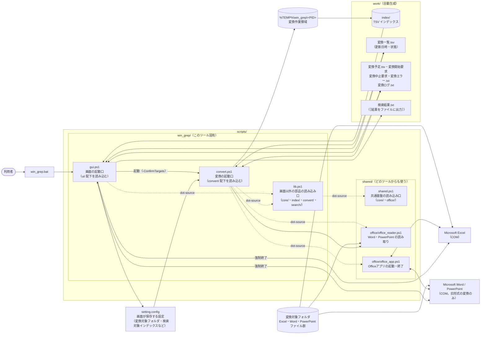
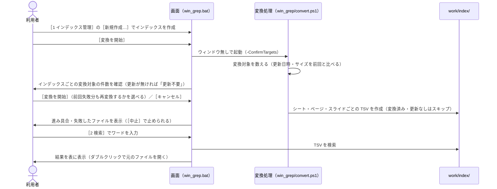

# win_grep 設計書（インデックス）

本設計書は `scripts/*.ps1` および起動用 `win_grep.bat` の実装から仕様を書き起こしたものである。記載内容は**現行実装の挙動**を正とする。

本ツールは画面（`win_grep.bat`）から使う。変換・検索・プロセス停止はすべて画面から行い、コンソールでの操作（`.bat` の実行・設定ファイルの手編集・キー入力）は前提としない。

本書（インデックス）には全体構成と、複数のツールにまたがる共通事項をまとめる。ツールごとの仕様は下表の各設計書を参照。

## ドキュメント構成

| 設計書 | 起動 | スクリプト | 内容 |
|---|---|---|---|
| [00_index.md](00_index.md)（本書） | – | – | ドキュメント構成、1. 概要・全体構成、2. 動作環境 |
| └ [00_共通_1_フォルダ構成と設定ファイル.md](00_共通_1_フォルダ構成と設定ファイル.md) | – | – | 3. フォルダ・ファイル構成、4. 設定ファイル（`setting.config`） |
| └ [00_共通_2_共通モジュール.md](00_共通_2_共通モジュール.md) | – | `win_grep/lib.ps1` | 5. 共通モジュール（パス定義・関数一覧） |
| └ [00_共通_2_共通モジュール_1_TSV・検索・画面の関数.md](00_共通_2_共通モジュール_1_TSV・検索・画面の関数.md) | – | `win_grep/lib.ps1` | 5.2.2 TSV の作成・検索・5.2.3 元のファイルの特定・画面の関数 |
| └ [00_共通_3_テスト.md](00_共通_3_テスト.md) | – | – | 6. テスト（単体テスト・結合テスト） |
| [01_変換.md](01_変換.md) | 画面の［変換を開始］（ウィンドウ無しで起動） | `win_grep/convert.ps1` / `shared/office/office_reader.ps1` | Office（Excel・Word・PowerPoint）→ TSV 変換（インデックス作成） |
| └ [01_変換_1_Excel.md](01_変換_1_Excel.md) | | | 4.3 Excel の変換処理、6.3 TSV 整形仕様 |
| └ [01_変換_2_Word.md](01_変換_2_Word.md) | | | 4.5 Word の旧形式の変換、6.5 テキスト読み取りと TSV の場所、7.2 注意点・既知の問題 |
| └ [01_変換_3_PowerPoint.md](01_変換_3_PowerPoint.md) | | | 4.6 PowerPoint の旧形式の変換、6.6 テキスト読み取りと TSV の場所、7.3 注意点・既知の問題 |
| └ [01_変換_4_メインフローと変換一覧.md](01_変換_4_メインフローと変換一覧.md) | | | 4.1 メインフロー、4.2 変換一覧・強制終了からの再開 |
| └ [01_変換_5_変換対象の決定.md](01_変換_5_変換対象の決定.md) | | | 4.2（続き）変換対象フォルダとインデックス名・変換対象の決定 |
| └ [01_変換_6_共通処理とアプリ管理.md](01_変換_6_共通処理とアプリ管理.md) | | | 4.4 Word・PowerPoint の変換処理、4.7 失敗の原因、5. Office アプリの管理 |
| └ [01_変換_7_出力TSVと既知の問題.md](01_変換_7_出力TSVと既知の問題.md) | | | 6.1・6.2・6.4 出力 TSV の仕様、7.1 注意点・既知の問題（共通） |
| └ [01_変換_8_エラーメッセージ一覧.md](01_変換_8_エラーメッセージ一覧.md) | | | 4.8 エラーメッセージ一覧（続けられないエラー・ファイルごとの失敗・警告） |
| [02_検索.md](02_検索.md) | 画面の［2 検索］タブ | `win_grep/lib.ps1` | TSV インデックスの検索処理と検索結果ファイルの形式 |
| [03_画面.md](03_画面.md) | `win_grep.bat` | `win_grep/gui.ps1` / `win_grep/xaml/win_grep.xaml` | インデックス作成・検索（結果を画面に表示）・プロセス停止を行う画面（GUI） |
| └ [03_画面_1_インデックス管理タブ.md](03_画面_1_インデックス管理タブ.md) | | | 3. ［1 インデックス管理］タブ |
| └ [03_画面_2_検索タブ.md](03_画面_2_検索タブ.md) | | | 4. ［2 検索］タブ |
| └ [03_画面_2_検索タブ_1_元のファイルを開く.md](03_画面_2_検索タブ_1_元のファイルを開く.md) | | | 4.5 元のファイルを開く |
| └ [03_画面_3_プロセス停止タブ.md](03_画面_3_プロセス停止タブ.md) | | | 5. ［9 プロセス停止］タブ |
| └ [03_画面_4_状態と操作の流れ.md](03_画面_4_状態と操作の流れ.md) | | | 6. 状態の判定と表示、7. 操作の流れ |
| └ [03_画面_5_共通仕様.md](03_画面_5_共通仕様.md) | | | 8. 設定ファイル、9. キーボード操作、10. 表示、11. メッセージ一覧 |
| └ [03_画面_6_実装とテスト.md](03_画面_6_実装とテスト.md) | | | 12. 実装構成、13. 既存スクリプトへの影響と段階、14. 未決事項、15. 既知の制約 |
| └ [03_画面_6_実装とテスト_1_テスト.md](03_画面_6_実装とテスト_1_テスト.md) | | | 16. テスト |
| [04_安全性.md](04_安全性.md) | – | – | 導入審査向けの安全性説明（危険な処理・ライブラリを使っていないことの根拠と確認手順、書き込み範囲、開示事項、第三者のツールによる検査結果、供給網とライセンス） |

Office プロセスの強制終了は画面の［9 プロセス停止］タブ（[03_画面_3_プロセス停止タブ.md](03_画面_3_プロセス停止タブ.md)）で行う。以前のコンソール用のツール（`1_変換.bat`、`2_検索.bat` / `grep.ps1`、`9_Office強制終了.bat` / `kill_process.ps1`、`config/検索ワード.txt`）は廃止した。変換処理 `win_grep/convert.ps1` は画面から起動される処理として残している。

長い設計書は章単位で複数のファイルに分けている（└ の行）。章・節の番号は、同じ番号の設計書の中で通し番号とし、分割前と同じ番号のまま使っている。

図は Mermaid で記述している（GitHub / VS Code の Markdown プレビュー等で描画される）。画面レイアウトなど Mermaid で表しにくい図は、draw.io で再編集できる PNG（`images/*.drawio.png`）として置いている。

---

## 1. 概要

### 1.1 目的

フォルダ配下に大量に存在する Office ファイルに対し、**ファイルを開かずに全文検索**できるようにする。

| 種類 | 拡張子 |
|---|---|
| Excel | `.xlsx` / `.xlsm` / `.xls` / `.xlsb` |
| Word | `.docx` / `.docm` / `.doc` |
| PowerPoint | `.pptx` / `.pptm` / `.ppt` |

### 1.2 方式

2 段階方式を採る。

1. **インデックス作成**（[01_変換.md](01_変換.md)）
   各ファイルを「場所」（Excel のシート、Word のページ、PowerPoint のスライド等）ごとの TSV（UTF-8）に変換して `work/index/` に蓄積する。Excel は COM で操作して変換し、Word・PowerPoint はファイル（ZIP 内の XML）を直接読む（旧形式のみ Word・PowerPoint で新形式に変換してから読む）。2 回目以降は、変換済みで更新の無いファイルをスキップする（差分変換）。
2. **検索**（[02_検索.md](02_検索.md)）
   インデックスの TSV を検索し（大文字と小文字の区別・正規表現・対象ファイルの条件はサクラエディタの Grep にならう）、ヒットした「ファイル名（相対フォルダ付き）・場所・該当行」を画面の表に表示する。必要なときは `work/検索結果.txt` に出力する。

どちらも画面（[03_画面.md](03_画面.md)）から行う。変換は画面がウィンドウ無しで起動し、進み具合を画面に表示する。画面には、変換を異常終了させた際に残る Excel・Word・PowerPoint のプロセスを強制終了する機能もある。

### 1.3 全体構成

### 1.4 ソースの分け方

ソースは**文脈**（どの機能か）と**層**（何をするか）で分ける。今後ツール（`win_diff` など）を増やしても、共通部分を作り直さずに済むようにするため。

| 分け方 | 内容 |
|---|---|
| 文脈（上位） | `scripts/shared/`（どのツールからも使う）と `scripts/win_grep/`（このツール固有）。その下はドメイン（`core`・`office`・`index`・`convert`・`search`・`ui`） |
| 層（下位） | 判断層（入力は素の値、出力は素の値）・状態層（ファイル・COM を読み書き）・画面層（`$ui` を触る） |

決まりごとは 3 つ。いずれも `tests/meta/` で機械的に確かめる（[6.3](00_共通_3_テスト.md#63-テストの構成と実行)）。

1. `shared/` はツールを知らない（依存は一方向）。ツール同士も互いを読み込まない。
2. 判断層は画面に触らない。触らないからテストが書ける。
3. 足したファイルは、必ずどこかの読み込み口から読み込む。

詳細は [5 章](00_共通_2_共通モジュール.md#5-共通モジュール)。
### 1.5 処理の流れ（利用者視点）

---

## 2. 動作環境・前提条件

| 項目 | 内容 |
|---|---|
| OS | Windows |
| 実行環境 | Windows PowerShell 5.1（`powershell.exe`） |
| 必須ソフトウェア | Microsoft Excel（`Excel.Application` COM オブジェクトを使用。Excel ファイルの変換に必要） |
| 任意のソフトウェア | Microsoft Word・PowerPoint（旧形式 `.doc` `.ppt`、パスワード付き、拡張子と中身が異なる Word・PowerPoint ファイルの変換にのみ使用。新形式の `.docx` `.pptx` 等は無くても変換できる） |
| 起動方法 | `win_grep.bat` をダブルクリック。`-ExecutionPolicy RemoteSigned` で画面を開く（`Bypass` は使わない）。zip 展開で付く Mark-of-the-Web は、`win_grep.bat` が起動前に消す（`Unblock-File`）ため、RemoteSigned のままスクリプトを実行できる。変換処理も画面が同じ方法（`-WindowStyle Hidden`）で起動する。詳細は [03_画面_5_共通仕様.md 10.1](03_画面_5_共通仕様.md#101-配布と実行ポリシーmark-of-the-web) |
| スクリプトの文字コード | `scripts/*.ps1`・`tests/*.ps1` は **UTF-8（BOM 付き）**、改行 CRLF。PowerShell 5.1 は BOM なしファイルをシステム既定コードページ（CP932）で読むため、BOM を外すと日本語リテラルが化ける |
| テスト | Pester 3.4（Windows PowerShell 5.1 標準）。`Invoke-Pester .\tests` |

---
