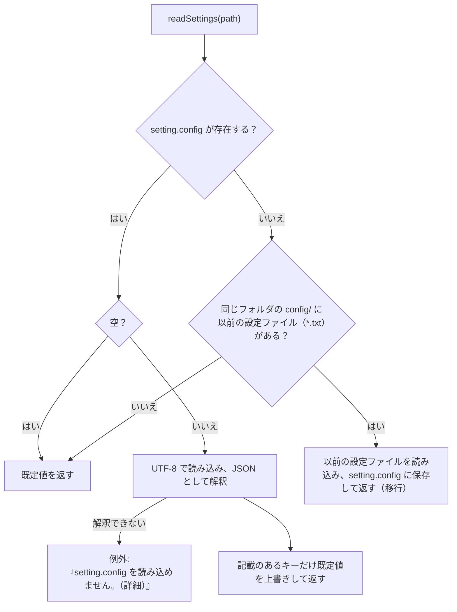

# tebunko_grep 設計書（フォルダ・ファイル構成と設定ファイル）

本書は [00_index.md](00_index.md) の一部である。章・節の番号は 00_index.md と分割した各ファイルで通し番号とし、各章がどのファイルにあるかは [00_index.md](00_index.md#ドキュメント構成) の表のとおり。

---

## 3. フォルダ・ファイル構成

### 3.1 フォルダ構成

| パス | 種別 | 説明 |
|---|---|---|
| `tebunko_grep.bat` | 起動用バッチ | 画面を開く（インデックス作成・検索・プロセス停止）。利用者が起動するのはこれだけ |
| `setting.config` | 設定 | 画面が保存する設定（JSON。無ければ既定値で動き、画面で設定を保存したときに作成する。git 管理外。4 章） |
| `scripts/shared/` | スクリプト | どのツールからも使う部品（[5 章](00_共通_2_共通モジュール.md#5-共通モジュール)） |
| `scripts/tebunko_grep/` | スクリプト | tebunko_grep 固有の処理と画面（同上） |
| `scripts/tebunko_grep/gui.ps1` | スクリプト | 画面の起動口（[03_画面.md](03_画面.md)）。検索・プロセス停止は画面の中で行う |
| `scripts/tebunko_grep/convert.ps1` | スクリプト | 変換の起動口（[01_変換.md](01_変換.md)）。画面がウィンドウ無しで起動する |
| `scripts/tebunko_grep/lib.ps1` | スクリプト | 画面以外の部品の読み込み口（[5 章](00_共通_2_共通モジュール.md#5-共通モジュール)） |
| `scripts/shared/shared.ps1` | スクリプト | 共通基盤の読み込み口（同上） |
| `scripts/shared/office/office_reader.ps1` | スクリプト | Word・PowerPoint のテキスト読み取り（[01_変換.md](01_変換.md) の 6.4、Word は [01_変換_2_Word.md](01_変換_2_Word.md) の 6.5、PowerPoint は [01_変換_3_PowerPoint.md](01_変換_3_PowerPoint.md) の 6.6） |
| `scripts/shared/xaml/` | 画面定義 | 共通の画面定義（`theme.xaml`・確認ダイアログ・フォルダ選択） |
| `scripts/tebunko_grep/xaml/` | 画面定義 | tebunko_grep の画面定義（`tebunko_grep.xaml` ほか） |
| `scripts/tebunko_grep/tebunko_grep.ico` | 画像 | 画面のアイコン（[03_画面_5_共通仕様.md 10 章](03_画面_5_共通仕様.md#10-表示アクセシビリティ)）。元データは `docs/images/logo.svg`（リポジトリの管理者が作成）で、`tools/new_icon.ps1` で作る。手で編集しない |
| `tests/` | テスト | Pester テスト（`scripts/` と同じ構成。[6 章](00_共通_3_テスト.md#6-テスト)） |
| `tools/new_release_files.ps1` | 配布用 | 配布物のカタログ（`tebunko_grep.cat`）とハッシュ一覧（`SHA256SUMS.txt`）を `work/release/` に作る。受け取った側が改ざんの有無を確認できる（[04_安全性.md](04_安全性.md) の 5.1） |
| `tools/new_release_package.ps1` | 配布用 | 配布する zip（`tebunko_grep-<バージョン>.zip`。本体・LICENSE・README・SECURITY・SBOM・カタログ・ハッシュ一覧）を `work/release/` に作る。`v` で始まるタグを push すると `.github/workflows/release.yml` が実行し、GitHub Release に載せる（[6 章](00_共通_3_テスト.md#ci)） |
| `tools/check_commit.ps1` | 開発用 | 公開してはいけない内容（利用者名を含むパス・メールアドレス・Office ファイルの作成者名など）と `.ps1`・`.xaml` の文字コードを検査する。pre-commit フックと CI が使う（[6 章](00_共通_3_テスト.md#ci)） |
| `tools/new_icon.ps1` | 開発用 | 画面のアイコン（`tebunko_grep.ico`）を元データの `docs/images/logo.svg` から作る。Windows に入っている Microsoft Edge（ヘッドレス）で SVG を描き、.NET の `System.Drawing` で 16〜256 px の 8 サイズに縮小して、PNG 形式の `.ico` にまとめる。第三者のツールは使わない。図柄を変えたら実行し、SVG と `.ico` を同じコミットに入れる |
| `tools/hooks/pre-commit`・`tools/install_hooks.ps1` | 開発用 | コミット前の検査。clone 後に `install_hooks.ps1` を 1 回実行して有効にする（[6 章](00_共通_3_テスト.md#ci)） |
| `.github/workflows/` | 開発用 | CI（`test.yml`）と配布物の公開（`release.yml`） |
| `sbom.cdx.json` | 配布用 | 部品表（CycloneDX 1.6）。第三者の部品を 1 件も含まないことを示す（[04_安全性.md](04_安全性.md) の 6 章） |
| `SECURITY.md` | ドキュメント | 安全性の説明の入口と、脆弱性の連絡先・対応方針 |
| `docs/` | ドキュメント | 設計書 |
| `work/` | 自動生成 | git 管理外。削除すると全件再変換になる |
| `work/index/` | 自動生成 | 変換済み TSV。変換対象フォルダごとに `work/index/<インデックス名>/` に分かれ、その下は元のファイル 1 つにつき 1 フォルダ（`<ファイル名.xlsx>/<場所>.tsv`） |
| `work/index/<インデックス名>/元のフォルダ.txt` | 自動生成 | インデックス名と元のフォルダ（変換対象フォルダ）の対応。インデックス 1 件につき 1 ファイル。`work/index` ごとでも `<インデックス名>` のフォルダだけでも、別の PC・場所へコピーすれば検索結果から元のファイルを開ける |
| `work/変換一覧.tsv` | 自動生成 | 変換対象ファイルごとの更新日時・サイズ・状態（未変換・済・失敗） |
| `work/変換中.txt` | 自動生成 | 変換中のファイル。変換中に強制終了したときだけ残る |
| `work/変換進捗.txt` | 自動生成 | 変換の進み具合（1 行）。画面が 1 秒ごとに読んで表示する。変換の開始時に前回の分を消す |
| `work/変換出力/<PID>/` | 自動生成 | 1 ファイル分の TSV を、インデックスに入れる直前に集めるフォルダ。集め終わってからフォルダごと入れ替えるため、途中で強制終了しても作りかけのインデックスが残らない（変換の終了時に削除する） |
| `work/変換予定.tsv` | 自動生成 | 変換対象を数えた結果（インデックスごとの件数）。画面が確認のダイアログに出す。返事を受け取ると削除する |
| `work/変換開始要求` | 自動生成 | 確認のダイアログで［変換を開始］を押すと作成する。変換処理が見つけて削除し、変換を始める |
| `work/変換中止要求` | 自動生成 | 画面の［中止］・確認のダイアログの［キャンセル］で作成する。変換処理がファイルの切れ目で見つけて削除し、中止する |
| `work/変換エラー.txt` | 自動生成 | 変換処理を続けられないエラーのメッセージ。画面が表示する（正常に終わったときは無い） |
| `work/変換ログ.txt` | 自動生成 | 変換処理の表示内容の記録（実行ごとに上書き） |
| `work/検索結果.txt` | 自動生成 | 画面の［結果をファイルに出力］で書き出す検索結果 |

変換作業領域は `%TEMP%\tebunko_grep\<PID>` に置く（Excel は `[` `]` を含むパスに保存できないため、ツールの配置場所に依存させない）。変換を同時に複数実行しても互いの作業ファイルを削除・移動しないよう、プロセス ID ごとのフォルダにする。
できた TSV をインデックスに入れるときは、`work/変換出力/<PID>` にいったん集めてからフォルダごと入れ替える（`publishIndexFiles`）。フォルダごと移すには同じドライブである必要があるため、作業領域（`%TEMP%`）とは別に `work` の中に置く。どちらのフォルダも、終了時と次回の開始時（終了済みのプロセスの分）に削除する。

すべてのパスは `scripts/shared/core/paths.ps1` の `$rootDir`（= リポジトリ直下。このファイルから 3 つ上）を基準に決まる。**カレントディレクトリには依存しない。**
ファイル操作は `-LiteralPath` または .NET の `System.IO` を使い、`[` `]` を含むファイル名・フォルダ名を扱える。

### 3.2 入出力ファイル一覧

| パス | 種別 | 作成 | 使用 | 文字コード | 内容 |
|---|---|---|---|---|---|
| `setting.config` | 設定 | 画面 | 画面・変換 | UTF-8（BOM なし）、JSON | 変換対象フォルダ・検索対象インデックス・検索対象のツリーでチェックを外したフォルダ・元のフォルダの置き換え・正規表現の使用（4 章）。PC ごとの設定 |
| `work/変換一覧.tsv` | 変換の状態 | 変換 | 変換 | UTF-8（BOM 付き）、タブ区切り | 1 行目に変換対象フォルダ、以降 1 ファイル 1 行で相対パス・更新日時・サイズ・状態・TSV 数・変換日時・エラー（[01_変換.md 4.2 節](01_変換_4_メインフローと変換一覧.md#42-変換一覧と変換対象の決定差分中断再試行)） |
| `work/変換中.txt` | 変換の状態 | 変換 | 変換 | UTF-8（BOM 付き） | 変換中のファイルの `<回数><TAB><相対パス>` の 1 行。変換が終われば削除する。残っていれば、そのファイルの変換中に強制終了した（[01_変換.md 4.2 節](01_変換_4_メインフローと変換一覧.md#強制終了時間切れからの再開)） |
| `work/変換出力/<PID>/` | 作業領域 | 変換 | 変換 | – | 1 ファイル分の TSV（`<元のファイル名>/<場所>.tsv`）。集め終わったら `work/index` の中へフォルダごと移す（`publishIndexFiles`） |
| `%TEMP%\tebunko_grep\<PID>\` | 作業領域 | 変換 | 変換 | – | 変換中の元ファイルのコピー（Excel は元と同じファイル名、長すぎれば `source.<拡張子>`。Word・PowerPoint は `source.<拡張子>`。元のファイルを占有しないため）、変換途中の `sheet<N>.tmp`（UTF-16LE）/ `*.tsv`、旧形式の変換用の `source.doc` `source.ppt` / `converted.docx` `converted.pptx` |
| `work/変換進捗.txt` | 画面と変換の受け渡し | 変換 | 画面 | UTF-8（BOM 付き）、タブ区切り | 変換の進み具合の 1 行 `<段階（準備/確認/変換/仕上げ）><TAB><処理済み><TAB><残り><TAB><失敗><TAB><いま行っていること>`（`writeConvertProgress` / `readConvertProgress`）。画面は 1 秒ごとにこの 1 行だけを読む（変換一覧は数万行になり、毎秒読み直すと画面が固まるため。[03_画面_1](03_画面_1_インデックス管理タブ.md)） |
| `work/変換予定.tsv` | 画面と変換の受け渡し | 変換 | 画面 | UTF-8（BOM 付き）、タブ区切り | 1 行目に列名、以降インデックス 1 件 1 行で `インデックス名` `元のフォルダ` `区分` `ファイル数` `変換対象` `新規` `更新あり` `前回未完了` `変換結果なし` `前回失敗`（`writeConvertPlan` / `readConvertPlan`。[01_変換_5](01_変換_5_変換対象の決定.md#変換予定-work変換予定tsv画面の確認に出す件数)） |
| `work/変換開始要求` | 画面と変換の受け渡し | 画面 | 変換 | UTF-8（BOM 付き） | 確認のダイアログの［変換を開始］。中身が `失敗分も再変換` なら、前回失敗したファイルも変換する（`writeConvertStartRequest` / `readConvertStartRequest`） |
| `work/変換中止要求` | 画面と変換の受け渡し | 画面 | 変換 | –（内容は使わない） | 変換の中止・確認の取りやめの要求（[01_変換.md 4.1 節](01_変換_4_メインフローと変換一覧.md#41-メインフロー)） |
| `work/変換エラー.txt` | 画面と変換の受け渡し | 変換 | 画面 | UTF-8（BOM 付き） | 変換処理を続けられないエラーのメッセージ（終了コード 1 のとき） |
| `work/変換ログ.txt` | 記録 | 変換 | 利用者 | PowerShell のトランスクリプト | 変換処理の表示内容 |
| `work/index/` | インデックス | 変換 | 検索 | UTF-8（BOM 付き）、CRLF | シート・ページ・スライドごとの TSV |
| `work/index/<インデックス名>/元のフォルダ.txt` | インデックス | 変換 | 画面 | UTF-8（BOM 付き）、タブ区切り | 1 行目は説明、2 行目は `<インデックス名><TAB><元のフォルダ>`（[01_変換.md 4.2 節](01_変換_5_変換対象の決定.md#変換対象フォルダとインデックス名)）。`.tsv` にすると検索対象になるため `.txt` |
| `work/検索結果.txt` | 出力 | 画面 | 利用者 | UTF-8（BOM 付き）、CRLF | 検索結果（[02_検索.md 5 章](02_検索.md#5-出力仕様)） |

設定は `setting.config` の 1 ファイルにまとめ、画面が読み書きする（利用者が直接編集する前提にしない）。各設定の意味は、使用する処理の設計書に記載する（変換対象フォルダ → [01_変換.md](01_変換.md)、検索対象インデックス → [02_検索.md](02_検索.md)、画面での扱い → [03_画面_5_共通仕様.md 8 章](03_画面_5_共通仕様.md#8-設定ファイルの読み書き)）。以前のコンソール用の `config/検索ワード.txt` は使わない（残っていても無視する）。

---

## 4. 設定ファイル `setting.config`（`readSettings`）

画面から使うアプリのため、設定は画面が読み書きする 1 つのファイル（ツール直下の `setting.config`。内容は JSON）にまとめる。利用者が手で編集する前提にはしない（以前の `config/*.txt` は、利用者がメモ帳で編集するコンソール用の形式だった）。変換処理（別プロセス）は、画面が保存した変換対象フォルダをこのファイルから読む。

### 4.1 形式

```json
{
    "targetFolders": [
        { "name": "見積", "path": "C:\\データ\\見積", "enabled": true },
        { "name": "報告書", "path": "D:\\old\\報告書", "enabled": false }
    ],
    "indexSources": [
        { "name": "営業", "path": "\\\\server\\営業" }
    ],
    "searchExcludes": [],
    "useRegex": false,
    "caseSensitive": false,
    "fileFilter": "",
    "openMode": "normal"
}
```

| キー | 型 | 既定値 | 内容 | 読み書きする関数 |
|---|---|---|---|---|
| `targetFolders` | `{name, path, enabled}` の配列 | 空 | 変換対象フォルダ（記載順）。`name` は**インデックス名**（`work\index` 直下のフォルダ名）、`path` は**そのフォルダが今置かれている場所**。名前と置き場所を分けて持つため、フォルダを移したときは `path` の値を書き換えるだけでよい（インデックスは作り直さない。[01_変換_5](01_変換_5_変換対象の決定.md#変換対象フォルダとインデックス名)）。`name` が空なら変換時に割り当てて保存する。`enabled` が `false` はチェックなし（登録のみで変換しない）。`enabled` が無ければチェックあり（[01_変換.md 3 章](01_変換.md#3-変換対象フォルダgettargetfolders)） | `getTargetFolders` / `writeTargetFolders` |
| `indexSources` | `{name, path}` の配列 | 空 | 変換しないインデックスの元のフォルダ（インデックス名 → 今の置き場所）。別の PC・場所で作ったインデックスを検索するとき、元のファイルを開くために使う（[03_画面_2_検索タブ_1 4.5.2](03_画面_2_検索タブ_1_元のファイルを開く.md#452-元のファイルが見つからないとき元のフォルダを設定する)） | `readIndexSources` / `writeIndexSources` / `setIndexSourceFolder` |
| `searchExcludes` | `{path, subfolders}` の配列 | 空 | 画面の検索対象のツリーでチェックを外したフォルダ（フルパス）。`subfolders` が `false` はフォルダ直下のファイルだけを外す。空ならすべてを検索する（[02_検索.md 3 章](02_検索.md#3-インデックスの一覧getsearchindexes)） | `readSearchExcludes` / `writeSearchExcludes` |
| `useRegex` | true / false | false | ［正規表現を使う］の状態 | `readSearchOption` / `writeSearchOption` |
| `caseSensitive` | true / false | false | ［大文字と小文字を区別］の状態（[02_検索.md 4.2](02_検索.md#42-検索条件サクラエディタの-grep-にならう)） | `readSearchOption` / `writeSearchOption` |
| `fileFilter` | 文字列 | 空 | 「対象ファイル」の指定（例: `*.xlsx;見積;!*old*`）。空ならすべて（同上） | `readSearchOption` / `writeSearchOption` |
| `openMode` | `normal` / `readOnly` / `new` | `normal` | ［開き方］の状態。検索結果の元のファイルを、通常（編集する）・読み取り専用・新規（元のファイルを基にした無題の文書。占有しない）のどれで開くか（[03_画面_2_検索タブ_1 4.5](03_画面_2_検索タブ_1_元のファイルを開く.md#45-元のファイルを開く)）。知らない値は `normal` とする | `readOpenMode` / `writeOpenMode` |

### 4.2 読み込み・保存



- ファイルが無くても作成しない（既定値で動く）。ファイルを作るのは画面が設定を保存したときと、以前の設定ファイルから移したときだけ。
- 記載の無いキー・未知のキーは無視する（キーが増えても以前の設定ファイルをそのまま読める）。
- 保存（`updateSettings`）は、保存のたびにファイルを読み直し、変えたキーだけを書き換える。ほかのキーは、ほかの画面・処理が保存した内容を保つ。UTF-8（BOM なし）。
- JSON として解釈できないときは例外にする。変換処理では、例外は `trap` で `work/変換エラー.txt` に書き出され、画面が表示する（終了コード 1）。

### 4.3 以前の設定ファイルからの移行

`setting.config` が無く、同じフォルダの `config/` に以前の設定ファイルがあれば、最初に読むときに内容を `setting.config` へ移す（`readLegacySettings`）。以前のファイルは削除しないが、移した後は読まない（`config/` フォルダは不要になるため、移した後は削除してよい）。

| 以前の設定ファイル | 形式 | 移す先 |
|---|---|---|
| `変換対象フォルダパス.txt` | 1 行 1 フォルダ。行頭 `#` はチェックなし | `targetFolders` |
| `検索オプション.txt` | `正規表現=オン` / `正規表現=オフ` | `useRegex` |

いずれも空行・前後の空白は無視する。`変換対象フォルダパス.txt` にはインデックス名が無いため、`name` は空にする（変換時に割り当てて保存する）。

以前の版の `sourceReplacements`（元のフォルダの置き換え。`{from, to}` の配列）は使わない（記載があっても無視する）。フォルダを移したことは、置き換えの一覧ではなく `targetFolders` の `path`・`indexSources` の `path` を書き換えて表す。
