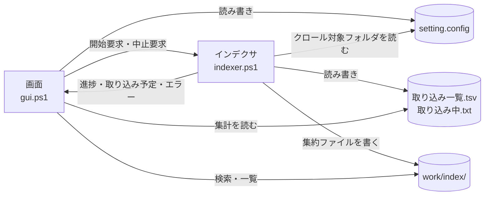

# tebunko 設計書（フォルダ・ファイル構成と設定ファイル）

本書は [00_index.md](00_index.md) の一部である。章・節の番号は 00_index.md と分割した各ファイルで通し番号とし、各章がどのファイルにあるかは [00_index.md](00_index.md#ドキュメント構成) の表のとおり。

本書で分かること:

- **3 章** リポジトリ（配布物）のどこに何があるか、ツールが実行中にどのファイルを作り、読み書きするか
- **4 章** 設定ファイル `setting.config` の形式・既定値・読み書きの決まり

---

## 3. フォルダ・ファイル構成

### 3.1 フォルダ構成

スクリプトの場所は `scripts/shared/core/paths.ps1` の `$rootDir`（= リポジトリ直下。このファイルから 3 つ上）を基準に決まる。`setting.config` と `work/` は、ふつうは `$rootDir` の直下に置くが、ツールのフォルダに書き込めないときや、利用者が画面で置き場所を変えたときは別の場所になる（3.3）。**カレントディレクトリには依存しない。**
ファイル操作は `-LiteralPath` または .NET の `System.IO` を使い、`[` `]` を含むファイル名・フォルダ名を扱える。

#### 利用者が使うもの

| パス | 種別 | 説明 |
|---|---|---|
| `tebunko.bat` | 起動用バッチ | 画面を開く（インデックス作成・検索・プロセス停止）。利用者が起動するのはこれだけ。`scripts` の中のファイルから Mark-of-the-Web を外し（`Unblock-File`。[04_安全性.md](04_安全性.md) の 4.2）、`conhost.exe` 経由で PowerShell を `-ExecutionPolicy RemoteSigned -WindowStyle Hidden` で起動して `gui.ps1` を開く。既定のターミナルが Windows Terminal だと `-WindowStyle Hidden` が効かず、PowerShell の窓が残るため `conhost.exe` を通す |
| `setting.config` | 設定 | 画面が保存する設定（JSON。無ければ既定値で動き、画面で設定を保存したときに作成する。git 管理外。4 章）。ツールのフォルダに書き込めないときは利用者ごとの場所に置く（3.3） |
| `work/` | 自動生成 | インデックス・状態ファイル・ログ（3.2）。git 管理外。削除すると全件取り込み直しになる。置き場所は画面で変えられる（3.3） |

#### スクリプト（`scripts/`）

ソースは**文脈**（`shared/` = どのツールからも使う、`tebunko/` = このツール固有）と**層**で分ける。フォルダごとの中身と読み込み口は [5 章](00_共通_2_共通モジュール.md#5-共通モジュール)。

| パス | 種別 | 説明 |
|---|---|---|
| `scripts/shared/` | スクリプト | どのツールからも使う部品（`core/`・`office/`・`ui/`・`xaml/`） |
| `scripts/shared/shared.ps1` | スクリプト | 共通基盤の読み込み口 |
| `scripts/shared/office/office_reader.ps1` | スクリプト | Office ファイルを ZIP として直接読み、Word・PowerPoint の本文・図形・コメント・SmartArt・グラフと、Excel の図形・コメントの文字を取り出す（[01_インデックス作成_7](01_インデックス作成_7_出力TSVと既知の問題.md) の 6.4、Word は [01_インデックス作成_2_Word.md](01_インデックス作成_2_Word.md)、PowerPoint は [01_インデックス作成_3_PowerPoint.md](01_インデックス作成_3_PowerPoint.md)） |
| `scripts/shared/xaml/` | 画面定義 | 共通の画面定義（`theme.xaml`・確認ダイアログ） |
| `scripts/tebunko/` | スクリプト | tebunko 固有の処理と画面（`core/`・`index/`・`indexer/`・`search/`・`ui/`・`xaml/`） |
| `scripts/tebunko/gui.ps1` | スクリプト | 画面の起動口（[03_画面.md](03_画面.md)）。検索・プロセス停止は画面の中で行う |
| `scripts/tebunko/indexer.ps1` | スクリプト | インデックス作成の起動口（[01_インデックス作成.md](01_インデックス作成.md)）。画面がウィンドウ無しで起動する |
| `scripts/tebunko/lib.ps1` | スクリプト | 画面以外の部品の読み込み口 |
| `scripts/tebunko/xaml/` | 画面定義 | tebunko の画面定義（`tebunko.xaml`・タブ・ダイアログ） |
| `scripts/tebunko/tebunko.ico` | 画像 | 画面のアイコン（[03_画面_5_共通仕様.md 10 章](03_画面_5_共通仕様.md#10-表示アクセシビリティ)）。元データは `docs/images/logo.svg`（リポジトリの管理者が作成）で、`tools/new_icon.ps1` で作る。手で編集しない |

#### ドキュメント・配布物

| パス | 種別 | 説明 |
|---|---|---|
| `README.md` | ドキュメント | 使い方の入口。配布 zip に同梱する（相対リンクと画像は、その版の GitHub の URL に書き換える） |
| `LICENSE` | ドキュメント | ライセンス（MIT）。配布 zip に同梱する |
| `.github/SECURITY.md`・`.github/SECURITY.ja.md` | ドキュメント | 安全性の説明の入口と、脆弱性の連絡先・対応方針（英語版が正、`.ja.md` が日本語版）。配布 zip には入れず、リリースの説明からリンクする |
| `sbom.cdx.json` | 配布用 | 部品表（CycloneDX 1.6）。第三者の部品を 1 件も含まないことを示す（[04_安全性.md](04_安全性.md) の 6 章）。配布 zip と並べてリリースに載せる |
| `docs/` | ドキュメント | 設計書（本書を含む）。`docs/images/` に図・画面の画像・ロゴ（`logo.svg`）を置く。配布 zip には入れない |
| `.github/CONTRIBUTING.md`・`.github/SUPPORT.md`・`.github/CODE_OF_CONDUCT.md`（と、それぞれの `.ja.md`） | ドキュメント | 開発に参加する手順・使い方の質問の窓口・行動規範。英語版が正で、`.ja.md` が日本語版。GitHub は `.github/` に置いた英語版の名前のファイルを認識する |

#### 開発用（配布しない）

| パス | 種別 | 説明 |
|---|---|---|
| `tests/` | テスト | Pester テスト（`scripts/` と同じ構成。[6 章](00_共通_3_テスト.md#6-テスト)） |
| `tools/check_commit.ps1` | 開発用 | 公開してはいけない内容（利用者名を含むパス・メールアドレス・Office ファイルの作成者名など）・`.ps1` と `.xaml` の文字コード・長すぎるファイル名を検査する。pre-commit フックと CI が使う（[6 章](00_共通_3_テスト.md#ci)） |
| `tools/check_commit_message.ps1` | 開発用 | コミットメッセージの 1 行目・PR と Issue のタイトルが Conventional Commits の形かを確かめる。commit-msg フックと CI（`title.yml`）が使う |
| `tools/check_signoff.ps1` | 開発用 | コミットに作者の `Signed-off-by` があるかを確かめる。commit-msg フックと CI（`test.yml`）が使う |
| `tools/check_markdown_links.ps1` | 開発用 | git で管理している `.md` の相対リンクの先（ファイル・見出し）があるかを確かめる。`tests/meta/links.Tests.ps1` が使う（[00_共通_3_テスト.md 6.3](00_共通_3_テスト.md#63-テストの構成と実行)） |
| `tools/hooks/pre-commit`・`tools/hooks/commit-msg`・`tools/install_hooks.ps1` | 開発用 | コミット時の検査。clone 後に `install_hooks.ps1` を 1 回実行して有効にする（[6 章](00_共通_3_テスト.md#ci)） |
| `tools/new_release_files.ps1` | 配布用 | 配布物のカタログ（`tebunko.cat`）とハッシュ一覧（`SHA256SUMS.txt`）を作る（既定の出力先は `work/release/`）。受け取った側が改ざんの有無を確認できる（[04_安全性.md](04_安全性.md) の 5.1） |
| `tools/new_release_package.ps1` | 配布用 | 配布する zip（`tebunko-<バージョン>.zip`。本体・README・LICENSE）と、zip と並べてリリースに載せるカタログ・ハッシュ一覧・SBOM を `work/release/` に作る。`v` で始まるタグを push すると `.github/workflows/release.yml` が実行し、GitHub Release に載せる（[6 章](00_共通_3_テスト.md#ci)） |
| `tools/new_icon.ps1` | 開発用 | 画面のアイコン（`tebunko.ico`）を元データの `docs/images/logo.svg` から作る。Windows に入っている Microsoft Edge（ヘッドレス）で SVG を描き、.NET の `System.Drawing` で 16〜256 px の 8 サイズに縮小して、PNG 形式の `.ico` にまとめる。第三者のツールは使わない。図柄を変えたら実行し、SVG と `.ico` を同じコミットに入れる |
| `tools/make_social_preview.ps1` | 開発用 | GitHub の social preview 用の画像（`docs/images/social_preview.png`）を作る。登録はリポジトリの設定から手で行う |
| `tools/mkdocs/` | 開発用 | 設計書の Web サイトを作る設定（`mkdocs.yml`）・フック（`hooks.py`）・使うパッケージ（`requirements.txt`）（[6 章](00_共通_3_テスト.md#ci)） |
| `.github/workflows/` | 開発用 | CI（`test.yml`・`title.yml`・`docs.yml`・`codeql.yml`・`scorecard.yml`）と配布物の公開（`release.yml`）（[6 章](00_共通_3_テスト.md#ci)） |
| `.github/codecov.yml` | 開発用 | Codecov の設定。ASCII の文字だけで書く（[6 章](00_共通_3_テスト.md#ci)） |
| `.github/dependabot.yml`・`.github/release.yml` | 開発用 | 依存（GitHub Actions・MkDocs のパッケージ）の更新 PR の設定と、リリースノートを PR のラベルで分ける設定 |
| `.github/ISSUE_TEMPLATE/`・`.github/pull_request_template.md`・`.github/title_comment.md` | 開発用 | Issue・PR のテンプレートと、形の違う Issue のタイトルに付けるコメント |
| `.gitattributes` | 開発用 | `.ps1`・`.xaml`・`.bat` を CRLF、`tools/hooks/*` を LF に固定する |
| `AGENTS.md`・`.claude/CLAUDE.md` | 開発用 | コーディングエージェント向けの決まり。`CLAUDE.md` は `AGENTS.md` を読み込む |

#### 自動生成（`work/`）

| パス | 説明 |
|---|---|
| `work/index/` | インデックス。クロール対象フォルダごとに `work/index/<インデックス名>/` に分かれ、その下はクロール対象フォルダと同じフォルダ構成で、各フォルダに元のファイルの拡張子ごとの集約ファイル（`content.xlsx.001.tsv` など）を置く。取り込み中だけ、元のファイル 1 つにつき 1 フォルダの TSV（`<ファイル名.xlsx>/<場所>.tsv`）ができ、フォルダの取り込みが終わると集約ファイルに入れて消す（[01_インデックス作成_7](01_インデックス作成_7_出力TSVと既知の問題.md#61-配置命名規則) 6.1） |
| `work/index/<インデックス名>/元のフォルダ.txt` | インデックス名と元のフォルダ（クロール対象フォルダ）の対応。インデックス 1 件につき 1 ファイル。`work/index` ごとでも `<インデックス名>` のフォルダだけでも、別の PC・場所へコピーすれば検索結果から元のファイルを開ける |
| `work/system_index/` | システムインデックス（高速検索用。`work/index` の中のフォルダごとの 2-gram の txt。[01_インデックス作成_7](01_インデックス作成_7_出力TSVと既知の問題.md#68-システムインデックスsystem_index) 6.8）。Windows Search に索引させる |
| `work/システムインデックスの状態.tsv` | システムインデックスの状態（対応済み・反映待ち・対象外。同 6.8） |
| `work/取り込み一覧.tsv` | 取り込み対象のファイルごとの更新日時・サイズ・状態（未取り込み・済・失敗） |
| `work/取り込み中.txt` | 取り込み中のファイル。取り込み中に強制終了したときだけ残る |
| `work/インデックス作成進捗.txt` | インデックス作成の進み具合（1 行）。画面が 1 秒ごとに読んで表示する。インデックス作成の開始時に前回の分を消す |
| `work/取り込み出力/<PID>/` | 1 ファイル分の TSV を、インデックスに入れる直前に集めるフォルダ（インデックス作成の終了時に削除する） |
| `work/取り込み予定.tsv` | 取り込み対象を数えた結果（インデックスごとの件数）。画面が確認のダイアログに出す。返事を受け取ると削除する |
| `work/インデックス作成開始要求` | 確認のダイアログで［インデックス作成を開始］を押すと作成する。インデクサが見つけて削除し、インデックス作成を始める |
| `work/インデックス作成中止要求` | 画面の［中止］・確認のダイアログの［キャンセル］で作成する。インデクサがファイルの切れ目で見つけて削除し、中止する |
| `work/インデックス作成エラー.txt` | インデックス作成を続けられないエラーのメッセージ。画面が表示する（正常に終わったときは無い） |
| `work/インデックス作成ログ.txt` | インデクサの表示内容の記録（実行ごとに上書き） |
| `work/画面エラー.txt` | 画面で起きた予期しないエラーの記録（追記） |
| `work/検索結果.txt` | 画面の［結果をファイルに出力］で書き出す検索結果 |
| `work/test/`・`work/release/`・`work/site/`・`work/cache/` | 開発用の出力（テスト結果とカバレッジ・配布物・設計書のサイト・サイトを作るときのキャッシュ） |

取り込みの作業領域は `%TEMP%\tebunko\<PID>` に置く。Excel は `[` `]` を含むパスに保存できないため、ツールの配置場所に依存させない。インデックス作成を同時に複数実行しても互いの作業ファイルを削除・移動しないよう、プロセス ID ごとのフォルダにする。

できた TSV をインデックス（集約ファイルに入れる前の置き場所）に入れるときは、`work/取り込み出力/<PID>` にいったん集めてからフォルダごと入れ替える（`publishIndexFiles`）。途中で強制終了しても作りかけのインデックスが残らない。フォルダごと移すには同じドライブである必要があるため、作業領域（`%TEMP%`）とは別に `work` の中に置く。どちらのフォルダも、終了時と次回の開始時（終了済みのプロセスの分）に削除する。

### 3.2 入出力ファイル一覧

画面（`gui.ps1`）とインデクサ（`indexer.ps1`）は別のプロセスで動き、`work/` のファイルで状態を受け渡す。



| パス | 種別 | 作成 | 使用 | 文字コード | 内容 |
|---|---|---|---|---|---|
| `setting.config` | 設定 | 画面 | 画面・インデックス作成 | UTF-8（BOM なし）、JSON | クロール対象フォルダ・検索対象のツリーでチェックを外したフォルダ・元のフォルダ・検索条件・開き方（4 章）。PC ごとの設定 |
| `work/取り込み一覧.tsv` | インデックス作成の状態 | インデックス作成 | インデックス作成・画面 | UTF-8（BOM 付き）、タブ区切り | 先頭にクロール対象フォルダの行、以降 1 ファイル 1 行で相対パス・更新日時・サイズ・状態・TSV 数・取り込み日時・エラー・抽出版（[01_インデックス作成_4 の 4.2 節](01_インデックス作成_4_メインフローと取り込み一覧.md#42-取り込み一覧と取り込み対象の決定差分中断再試行)） |
| `work/取り込み中.txt` | インデックス作成の状態 | インデックス作成 | インデックス作成 | UTF-8（BOM 付き） | 取り込み中のファイルの `<回数><TAB><相対パス>` の 1 行。そのファイルの取り込みが終われば削除する。残っていれば、そのファイルの取り込み中に強制終了した（[01_インデックス作成_4 の 4.2 節](01_インデックス作成_4_メインフローと取り込み一覧.md#強制終了時間切れからの再開)） |
| `work/取り込み出力/<PID>/` | 作業領域 | インデックス作成 | インデックス作成 | – | 1 ファイル分の TSV（`<元のファイル名>/<場所>.tsv`）。集め終わったら `work/index` の中へフォルダごと移す（`publishIndexFiles`） |
| `%TEMP%\tebunko\<PID>\` | 作業領域 | インデックス作成 | インデックス作成 | – | 取り込み中の元ファイルのコピー（Excel は元と同じファイル名、長すぎれば `source.<拡張子>`。Word・PowerPoint は `source.<拡張子>`。元のファイルを占有しないため）、抽出途中の `sheet<N>.tmp`（UTF-16LE）/ `*.tsv`、旧形式の変換用の `source.doc` `source.ppt` / `converted.docx` `converted.pptx` |
| `work/インデックス作成進捗.txt` | 画面とインデックス作成の受け渡し | インデックス作成 | 画面 | UTF-8（BOM 付き）、タブ区切り | インデックス作成の進み具合の 1 行 `<段階（クロール/確認/取り込み/仕上げ）><TAB><処理済み><TAB><残り><TAB><失敗><TAB><いま行っていること>`（`writeIndexingProgress` / `readIndexingProgress`）。画面は 1 秒ごとにこの 1 行だけを読む（取り込み一覧は数万行になり、毎秒読み直すと画面が固まるため。[03_画面_1](03_画面_1_インデックス管理タブ.md#36-インデックス作成の進み具合)） |
| `work/取り込み予定.tsv` | 画面とインデックス作成の受け渡し | インデックス作成 | 画面 | UTF-8（BOM 付き）、タブ区切り | 1 行目に列名、以降インデックス 1 件 1 行で `インデックス名` `元のフォルダ` `区分` `ファイル数` `取り込み対象` `新規` `更新あり` `前回未完了` `インデックスなし` `前回失敗`（`writeIngestPlan` / `readIngestPlan`。[01_インデックス作成_5](01_インデックス作成_5_クロール.md#取り込み予定-work取り込み予定tsv画面の確認に出す件数)） |
| `work/インデックス作成開始要求` | 画面とインデックス作成の受け渡し | 画面 | インデックス作成 | UTF-8（BOM 付き） | 確認のダイアログの［インデックス作成を開始］。中身が `失敗分も再取り込み` なら、前回失敗したファイルも取り込む（`writeIndexingStartRequest` / `readIndexingStartRequest`） |
| `work/インデックス作成中止要求` | 画面とインデックス作成の受け渡し | 画面 | インデックス作成 | –（内容は使わない） | インデックス作成の中止・確認の取りやめの要求（[01_インデックス作成_4 の 4.1 節](01_インデックス作成_4_メインフローと取り込み一覧.md#41-メインフロー)） |
| `work/インデックス作成エラー.txt` | 画面とインデックス作成の受け渡し | インデックス作成 | 画面 | UTF-8（BOM 付き） | インデックス作成を続けられないエラーのメッセージ（終了コード 1 のとき） |
| `work/インデックス作成ログ.txt` | 記録 | インデックス作成 | 利用者 | PowerShell のトランスクリプト | インデクサの表示内容 |
| `work/画面エラー.txt` | 記録 | 画面 | 利用者 | UTF-8（BOM 付き） | 画面で起きた予期しないエラーの内容（`writeErrorLog`。追記） |
| `work/index/` | インデックス | インデックス作成 | 検索 | 集約ファイルは UTF-16LE（BOM 付き）、LF。取り込み中の TSV は UTF-8（BOM 付き）、CRLF | フォルダ・拡張子ごとの集約ファイル（`content.<拡張子>.<番号>.tsv`。元のファイルごと・場所（シート・ページ・スライド、図形・コメント）ごとに、メタ情報の行と TSV の中身を並べる）。取り込み中だけ、シート・ページ・スライドごとの TSV と図形・コメントの TSV（`<元の場所>[図形]`・`<元の場所>[コメント]`） |
| `work/index/<インデックス名>/元のフォルダ.txt` | インデックス | インデックス作成 | 画面 | UTF-8（BOM 付き）、タブ区切り | 1 行目は説明、2 行目は `<インデックス名><TAB><元のフォルダ>`（[01_インデックス作成_5](01_インデックス作成_5_クロール.md#クロール対象フォルダとインデックス名)）。`.tsv` にすると検索対象になるため `.txt` |
| `work/検索結果.txt` | 出力 | 画面 | 利用者 | UTF-8（BOM 付き）、CRLF | 検索結果（[02_検索.md 5 章](02_検索.md#5-出力仕様)） |

各設定の意味は、使用する処理の設計書に記載する（クロール対象フォルダ → [01_インデックス作成.md](01_インデックス作成.md)、検索対象インデックス → [02_検索.md](02_検索.md)、画面での扱い → [03_画面_5_共通仕様.md 8 章](03_画面_5_共通仕様.md#8-設定ファイルの読み書き)）。

### 3.3 データの置き場所（`setting.config`・`work/`）

ツールを書き込めない場所（`C:\Program Files`、読み取り専用の共有フォルダ）に置いても動くよう、また、インデックス（元の文書の本文を持つ。[04_安全性.md](04_安全性.md) の 4.3）をアクセス権を絞ったフォルダや容量のあるドライブに置けるよう、データの置き場所をツールのフォルダと分けられるようにしている。

| 変数 | 決め方 | 定義 |
|---|---|---|
| `$dataDir` | ツールのフォルダ（`$rootDir`）にファイルを作れればそこ（以前の版と同じ）。作れなければ `%LOCALAPPDATA%\tebunko\<鍵>`。鍵は `getFolderKey $rootDir` の先頭 16 文字で、ツールのフォルダごとに分かれる | `scripts/shared/core/data_dir.ps1` の `getDataDir`（書き込めるかは `testWritableFolder`。試しに作ったファイルは閉じると消える） |
| `$settingsFile` | `$dataDir\setting.config` | `scripts/tebunko/core/settings.ps1` |
| `$workDir` | `setting.config` の `workspaceFolder`（4.1）。空なら既定の `%USERPROFILE%\Documents\tebunko`（`getDefaultWorkDir`。OneDrive にリダイレクトされた「ドキュメント」ではなく、プロファイルの直下の Documents） | `scripts/tebunko/core/paths.ps1`（`getWorkDir`） |

- 既定の場所をドキュメントにするのは、高速検索（[02_検索.md](02_検索.md) 4.4）で Windows Search に システムインデックスを索引させるため（ドキュメントは既定で索引の対象）。既定の場所にほかのファイルが置いてあると、インデックスのファイルと混ざるため使わせない（`testDefaultWorkspace`・`getWorkspaceBlockMessage`。起動時・インデックス作成の開始・［既定に戻す］・インデクサで確かめ、`「…」は空のフォルダではありません。…` と出す）。無い・空・前から使っているワークスペース（`index` か `取り込み一覧.tsv` がある）なら使える。以前の既定（設定ファイルと同じフォルダの `work`）からは移さない（使い続けるときは［8 設定］の［変更…］で選ぶ）。
- `$workDir` のフォルダを画面では**ワークスペース**と呼ぶ。［8 設定］で表示し、［変更…］で空のフォルダに変えられる（[03_画面_5 8.1](03_画面_5_共通仕様.md#81-8-設定タブ)）。
- `work/` の中身（インデックス・取り込み一覧・ログ・取り込みの出力）はまとめて動く。取り込みの出力（`work/取り込み出力/<PID>`）はインデックスとフォルダごと入れ替えるため、インデックスと同じ `work` の中に置く。
- 置き場所を変えても、今の `work/` の中身は移さない。移すときは利用者がエクスプローラーで移してから、移した先を選ぶ。
- 同じ `work` を複数の PC・利用者から同時に使うことは考えない（取り込み一覧・インデックスが食い違う）。同じ PC の中では、インデックス作成の二重起動の鍵を `$workDir` から作るため、別のツールのフォルダから同じ `work` を指しても二重には動かない。
- `$rootDir` が書き込めるかは読み込むたびに調べる。書き込めない場所から書き込める場所に戻すと、設定は `$rootDir` 直下のものに戻る。

---

## 4. 設定ファイル `setting.config`（`readSettings`）

設定は、ツール直下（書き込めなければ利用者ごとの場所。3.3）の `setting.config`（内容は JSON）の 1 ファイルにまとめ、画面が読み書きする。利用者が手で編集する前提にはしない。インデクサ（別プロセス）は、画面が保存したクロール対象フォルダと `work` の置き場所をこのファイルから読む。読み書きの関数は `scripts/tebunko/core/settings.ps1` にある。

### 4.1 形式

```json
{
    "targetFolders": [
        { "name": "見積", "path": "C:\\データ\\見積", "enabled": true },
        { "name": "報告書", "path": "D:\\old\\報告書", "enabled": false }
    ],
    "indexSources": [
        { "name": "営業", "path": "\\\\server\\営業" }
    ],
    "searchExcludes": [],
    "useRegex": false,
    "caseSensitive": false,
    "fileFilter": "",
    "includeShapes": true,
    "includeComments": true,
    "openMode": "normal",
    "workspaceFolder": ""
}
```

| キー | 型 | 既定値 | 内容 | 読み書きする関数 |
|---|---|---|---|---|
| `targetFolders` | `{name, path, enabled}` の配列 | 空 | クロール対象フォルダ（記載順）。`name` は**インデックス名**（`work\index` 直下のフォルダ名）、`path` は**そのフォルダが今置かれている場所**。名前と置き場所を分けて持つため、フォルダを移したときは `path` の値を書き換えるだけでよい（インデックスは作り直さない。[01_インデックス作成_5](01_インデックス作成_5_クロール.md#クロール対象フォルダとインデックス名)）。`name` が空ならインデックス作成時に割り当てて保存する。`enabled` が `false` はチェックなし（登録のみで取り込まない）。`enabled` が無ければチェックあり（[01_インデックス作成.md 3 章](01_インデックス作成.md#3-クロール対象フォルダgettargetfolders)） | `getTargetFolders` / `writeTargetFolders` |
| `indexSources` | `{name, path}` の配列 | 空 | インデックス作成の対象にしないインデックスの元のフォルダ（インデックス名 → 今の置き場所）。別の PC・場所で作ったインデックスを検索するとき、元のファイルを開くために使う（[03_画面_2_検索タブ_1 4.5.2](03_画面_2_検索タブ_1_元のファイルを開く.md#452-元のファイルが見つからないとき元のフォルダを設定する)） | `readIndexSources` / `writeIndexSources` / `setIndexSourceFolder` |
| `searchExcludes` | `{path, subfolders}` の配列 | 空 | 画面の検索対象のツリーでチェックを外したフォルダ（フルパス）。`subfolders` が `false` はフォルダ直下のファイルだけを外す。空ならすべてを検索する（[02_検索.md 3 章](02_検索.md#3-インデックスの一覧getsearchindexes)） | `readSearchExcludes` / `writeSearchExcludes` |
| `useRegex` | true / false | false | ［正規表現を使う］の状態 | `readSearchOption` / `writeSearchOption` |
| `caseSensitive` | true / false | false | ［大文字と小文字を区別］の状態（[02_検索.md 4.2](02_検索.md#42-検索条件サクラエディタの-grep-にならう)） | `readSearchOption` / `writeSearchOption` |
| `fileFilter` | 文字列 | 空 | 「対象ファイル」の指定（例: `*.xlsx;見積;!*old*`）。空ならすべて（同上） | `readSearchOption` / `writeSearchOption` |
| `includeShapes` | true / false | true | ［図形も検索］の状態。オフなら図形の場所（`<元の場所>[図形]`）を検索しない（同上） | `readSearchOption` / `writeSearchOption` |
| `includeComments` | true / false | true | ［コメントも検索］の状態。オフならコメントの場所（`<元の場所>[コメント]`）を検索しない（同上） | `readSearchOption` / `writeSearchOption` |
| `openMode` | `normal` / `readOnly` / `new` | `normal` | ［開き方］の状態。検索結果の元のファイルを、通常（編集する）・読み取り専用・新規（元のファイルを基にした無題の文書。占有しない）のどれで開くか（[03_画面_2_検索タブ_1 4.5](03_画面_2_検索タブ_1_元のファイルを開く.md#45-元のファイルを開く)）。知らない値は `normal` とする | `readOpenMode` / `writeOpenMode` |
| `workspaceFolder` | 文字列 | 空 | `work`（インデックス・取り込み一覧・ログ）を置くフォルダ（3.3）。空なら既定の `%USERPROFILE%\Documents\tebunko`（3.3）。既定の場所を選んだときも空で保存する。手で書いた相対パスは設定ファイルのフォルダから、`%変数%` は展開して読む | `getWorkDir` / `writeWorkspaceFolder` |

### 4.2 読み込み・保存


- ファイルが無くても作成しない（既定値で動く）。ファイルを作るのは画面が設定を保存したときと、以前の設定ファイルから移したときだけ。
- 記載の無いキー・未知のキー・値が `null` のキーは無視する（キーが増えても古い設定ファイルをそのまま読める）。
- 真偽値のキーは、手で `"false"` のような文字列に書き換えても `true` / `false` として読む（`toSettingBool`）。読めない値は既定値にする。
- 保存（`updateSettings`）は、保存のたびにファイルを読み直し、変えたキーだけを書き換える。ほかのキーは、ほかの画面・処理が保存した内容を保つ。UTF-8（BOM なし）。
- JSON として解釈できないときは例外にする。インデクサでは、例外は `trap` で `work/インデックス作成エラー.txt` に書き出され、画面が表示する（終了コード 1）。

### 4.3 以前の設定ファイルからの移行

`setting.config` が無く、同じフォルダの `config/` に以前の版の設定ファイルがあれば、最初に読むときに内容を `setting.config` へ移す（`readLegacySettings`）。以前のファイルは削除しないが、移した後は読まない（`config/` フォルダは移した後に削除してよい）。

| 以前の設定ファイル | 形式 | 移す先 |
|---|---|---|
| `変換対象フォルダパス.txt` | 1 行 1 フォルダ。行頭 `#` はチェックなし | `targetFolders` |
| `検索オプション.txt` | `正規表現=オン` / `正規表現=オフ` | `useRegex` |

いずれも空行・前後の空白は無視する。`変換対象フォルダパス.txt` にはインデックス名が無いため、`name` は空にする（インデックス作成時に割り当てて保存する）。`config/` のほかのファイルは読まない。
