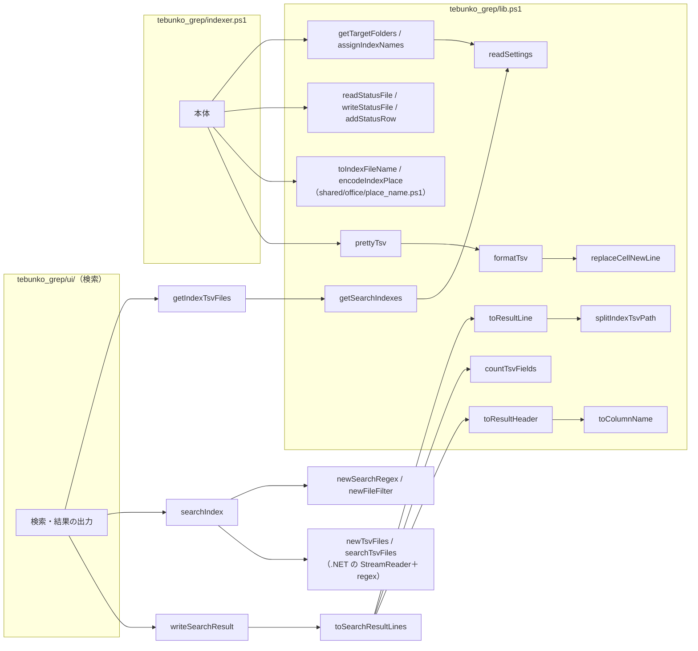
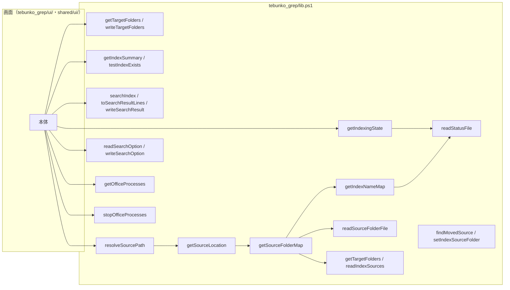

# tebunko 設計書（共通モジュール）

本書は [00_index.md](00_index.md) の一部である。章・節の番号は 00_index.md と分割した各ファイルで通し番号とし、各章がどのファイルにあるかは [00_index.md](00_index.md#ドキュメント構成) の表のとおり。

---

## 5. 共通モジュール

処理は**文脈**（どの機能のものか）と**層**（何をするものか）で分けて置く。

### 5.0 フォルダの分け方と読み込み口

| フォルダ | 置くもの |
|---|---|
| `scripts/shared/core/` | パス定義（`paths.ps1`）・ファイルの読み書き（`fs.ps1`）・TSV とセルの文字列（`text.ps1`）・フォルダのパスと一覧（`folder.ps1`）・設定ファイルの読み書き（`settings.ps1`） |
| `scripts/shared/office/` | Office ファイルの判定・列挙・開き方・失敗の原因（`office_files.ps1`）・場所の名前と TSV のファイル名（`place_name.ps1`）・プロセスの一覧と強制終了（`office_process.ps1`）・Word / PowerPoint の読み取り（`office_reader.ps1`）・Office アプリの起動と終了（`office_app.ps1`）・1 ファイルの抽出（`office_extract.ps1`） |
| `scripts/shared/ui/` | 画面の土台と共通部品（`types.ps1`・`app_host.ps1`・`shell.ps1`・`folder_dialog.ps1`・元のファイルを開く `open_file.ps1`・［9 プロセス停止］タブの `process_tab.ps1`） |
| `scripts/shared/xaml/` | 共通の画面定義（`theme.xaml`・ダイアログ・［9 プロセス停止］タブの `tab_kill.xaml`） |
| `scripts/tebunko_grep/core/` | 検索のパス定義（`paths_grep.ps1`）・設定のキーと既定値（`settings_grep.ps1`） |
| `scripts/tebunko_grep/index/` | インデックス名の決め方（`index_name.ps1`）・インデックスの作成と集計（`index_store.ps1`） |
| `scripts/tebunko_grep/indexer/` | 取り込み対象の決定（`indexer_plan.ps1`）・インデックス作成の状態ファイル（`indexer_state.ps1`）・取り込むかの判定（`indexer_decide.ps1`）・後始末（`index_migrate.ps1`） |
| `scripts/tebunko_grep/search/` | 検索条件（`search_query.ps1`）・検索の実行（`search_run.ps1`）・元のファイルの場所（`source_map.ps1`） |
| `scripts/tebunko_grep/ui/` | ［1 検索］のウィンドウ全体にかかわる処理（`grep_page.ps1`）・タブごとの画面（`*_tab.ps1` ほか）と、その判断層（`*_view.ps1`） |
| `scripts/tebunko_diff/` | 比較（[05_比較.md](05_比較.md)）。パス定義と設定（`core/`）・差分の判断層（`diff/`）・作業フォルダの読み書き（`job/`）・画面（`ui/`）・画面定義（`xaml/`）・抽出プロセス（`differ.ps1`） |
| `scripts/tebunko/` | 検索と比較を 1 つのウィンドウに組み立てる起動口（`gui.ps1`）・ウィンドウの枠（`xaml/tebunko.xaml`）・アイコン（`tebunko.ico`） |

層は次の 3 つに分ける。**判断層は画面に触らないため、そのままテストできる**（[6 章](00_共通_3_テスト.md#6-テスト)）。

| 層 | 例 | テスト |
|---|---|---|
| 判断層（入力は素の値、出力は素の値） | `text.ps1`・`index_name.ps1`・`search_query.ps1`・`*_view.ps1`・`tebunko_diff/diff/*.ps1` | できる（タグ `Unit`） |
| 状態層（ファイル・COM を読み書きする） | `settings.ps1`・`indexer_state.ps1`・`index_store.ps1`・`search_run.ps1`・`diff_job.ps1` | できる（タグ `Io`。`$TestDrive` を使う） |
| 画面層（`$ui` を触る） | `tebunko/gui.ps1`・`grep_page.ps1`・`*_tab.ps1`・`shell.ps1` | しない（手で確かめる） |

依存の向きは一方向にする。**`shared/` はツール（`tebunko_grep/`・`tebunko_diff/`）を知らない。** ツール同士も互いを読み込まない。両方のツールを読み込んでよいのは、組み立てるだけの `tebunko/` だけで、ツールから `tebunko/` も読み込まない。この決まりは `tests/meta/layers.Tests.ps1` で機械的に確かめる。

読み込み口は次のとおり。ファイルを足したら、どれかから読み込む（読み込み漏れもメタテストで検出する）。

| 読み込み口 | 読み込むもの | 使う側 |
|---|---|---|
| `scripts/shared/shared.ps1` | 共通基盤（`core/`・`office/` のうち COM を使わないもの） | `tebunko_grep/lib.ps1`・`tebunko_diff/lib.ps1` |
| `scripts/tebunko_grep/lib.ps1` | 上記＋ tebunko_grep の `core/`・`index/`・`indexer/`・`search/` | 画面・インデクサ・テスト・画面が起こす別スレッド |
| `scripts/tebunko_diff/lib.ps1` | 上記＋ tebunko_diff の `core/`・`diff/`・`job/` | 画面・比較の抽出プロセス・テスト・画面が起こす別スレッド |
| `scripts/tebunko/gui.ps1` | 両方の `lib.ps1` と、`shared/ui/`・`tebunko_grep/ui/`・`tebunko_diff/ui/` | 起動用バッチ（`tebunko.bat`・`tebunko_grep.bat`） |

画面の部品（`shared/ui/`・`tebunko_grep/ui/`・`tebunko_diff/ui/`）は画面の起動口（`tebunko/gui.ps1`）が、COM を使うもの（`office_app.ps1`・`office_reader.ps1`・`office_extract.ps1`）は抽出する起動口（`indexer.ps1`・`differ.ps1`）が読み込む。

各スクリプト・テストからは dot-source（`. "$PSScriptRoot\lib.ps1"`）して使う。

### 5.1 パス定義

パス定義は、どのツールからも使うもの（`shared/core/paths.ps1`・`shared/core/settings.ps1`）と tebunko_grep 固有のもの（`tebunko_grep/core/paths_grep.ps1`）に分かれる。比較（tebunko_diff）のパス定義（`tebunko_diff/core/paths_diff.ps1`。作業フォルダ `%TEMP%\tebunko\diff`・比較結果ファイル `work\tebunko_diff\比較結果.txt` など）は [05_比較.md](05_比較.md) を参照。

| 変数 | 値 |
|---|---|
| `$rootDir` | リポジトリ直下（`shared/core/paths.ps1`） |
| `$workDir` | `$rootDir\work` |
| `$indexDir` | `$workDir\index` |
| `$tmpDir` | `%TEMP%\tebunko_grep\<PID>`（プロセスごと） |
| `$settingsFile` | `$rootDir\setting.config`（`shared/core/settings.ps1`。画面が保存する設定。検索と比較で共通。内容は JSON。[4 章](00_共通_1_フォルダ構成と設定ファイル.md#4-設定ファイル-settingconfigreadsettings)） |
| `$legacyConfigDirName` / `$legacyTargetFolderFileName` ほか | 以前の設定ファイルのフォルダ名 `config` と、ファイル名 `変換対象フォルダパス.txt`・`元のフォルダの置き換え.txt`・`検索オプション.txt`（`setting.config` が無いとき、同じフォルダの `config\` から移すときだけ読む） |
| `$statusFile` | `$workDir\取り込み一覧.tsv` |
| `$ingestingFile` | `$workDir\取り込み中.txt` |
| `$resultFile` | `$workDir\検索結果.txt` |
| `$stopRequestFile` | `$workDir\インデックス作成中止要求`（画面が作成すると、インデクサはファイルの切れ目で中止する。確認の取りやめにも使う） |
| `$ingestPlanFile` | `$workDir\取り込み予定.tsv`（取り込み対象を数えた結果。画面が確認のダイアログに出す） |
| `$indexingStartRequestFile` | `$workDir\インデックス作成開始要求`（画面が作成すると、インデクサは確認待ちから先へ進む） |
| `$indexingErrorFile` | `$workDir\インデックス作成エラー.txt`（インデックス作成を続けられないエラーのメッセージ。正常終了時は無い） |
| `$indexingLogFile` | `$workDir\インデックス作成ログ.txt`（インデクサの表示内容の記録。実行ごとに上書き） |
| `$utf8Bom` | BOM 付き UTF-8 の `System.Text.Encoding` |
| `$cellNewLine` | インデックス TSV でセル内改行の代わりに使う文字（U+2028 LINE SEPARATOR） |
| `$statusColumns` | 取り込み一覧の列名（`相対パス` `更新日時` `サイズ` `状態` `TSV数` `取り込み日時` `エラー`） |
| `$statusFolderKey` | 取り込み一覧の先頭のクロール対象フォルダの行の見出し（`クロール対象フォルダ`） |
| `$stateNew` / `$stateDone` / `$stateFailed` | 取り込み一覧の状態（`未取り込み` / `済` / `失敗`） |
| `$indexingPhaseCrawl` / `$indexingPhaseConfirm` / `$indexingPhaseIngest` / `$indexingPhaseFinish` | インデックス作成の進み具合の段階（`クロール` / `確認` / `取り込み` / `仕上げ`） |
| `$ingestPlanColumns` | 取り込み予定の列名（`インデックス名` `元のフォルダ` `区分` `ファイル数` `取り込み対象` `新規` `更新あり` `前回未完了` `インデックスなし` `前回失敗`） |
| `$planKindIngest` / `$planKindUnchecked` / `$planKindMissing` | 取り込み予定の区分（`取り込み` / `チェックなし` / `フォルダなし`） |
| `$retryFailedMark` | インデックス作成開始要求の中身（`失敗分も再取り込み`。前回失敗したファイルも取り込むときだけ書く） |
| `$officeProcessNames` | 強制終了の対象のプロセス名 → 表示名（`EXCEL` → `Excel`、`WINWORD` → `Word`、`POWERPNT` → `PowerPoint`） |

### 5.2 関数一覧

関数は用途ごとに次の 3 つに分けて記載する。

| 節 | 内容 | ファイル |
|---|---|---|
| 5.2.1 | 設定ファイル・取り込み一覧・クロール対象フォルダ・インデックス名 | 本書 |
| 5.2.2 | TSV の作成・検索 | [00_共通_2_共通モジュール_1_TSV・検索・画面の関数.md](00_共通_2_共通モジュール_1_TSV・検索・画面の関数.md) |
| 5.2.3 | 元のファイルの特定・画面 | [00_共通_2_共通モジュール_1_TSV・検索・画面の関数.md](00_共通_2_共通モジュール_1_TSV・検索・画面の関数.md) |

#### 5.2.1 設定ファイル・取り込み一覧・クロール対象フォルダ・インデックス名

| 関数 | 入力 | 出力 | 概要 | 詳細 | 使用元 |
|---|---|---|---|---|---|
| `readSettingsData` | path（既定 `$settingsFile`） | PSCustomObject / `$null` | 設定ファイルを読み、JSON の中身を返す（`shared/core/settings.ps1`）。無い・空・中身が null なら `$null`。JSON として読めなければファイル名入りのメッセージで例外 | [4 章](00_共通_1_フォルダ構成と設定ファイル.md#4-設定ファイル-settingconfigreadsettings) | readSettings, readDiffSettings |
| `mergeSettingValues` / `toSettingValue` / `toSettingBool` | settings, data / value, default / value, default | ordered hashtable / 値 / bool | 既定値（キーの一覧でもある）に、読んだ値を既定値と同じ型にして入れる。記載の無い・null のキーは既定値のまま。入れ子（`diffOptions`）も同じ規則。真偽値は文字列の `"false"` なども読む（読めなければ既定値）（`shared/core/settings.ps1`） | 同上 | readSettings, readDiffSettings |
| `writeSettingsFile` | settings, path（既定 `$settingsFile`） | – | 設定を JSON（UTF-8 BOM なし）で保存する。ファイルにあって settings に無いキー（ほかのツールの設定）はそのまま残す。今のファイルが JSON として読めなければ settings だけで書き直す（`shared/core/settings.ps1`） | 同上 | writeSettings, updateDiffSettings |
| `newSettings` | – | ordered hashtable | 検索の設定の既定値（`targetFolders` `indexSources` `searchExcludes` `useRegex` `caseSensitive` `fileFilter` `includeShapes` `includeComments` `openMode`）。比較の設定（`newDiffSettings` / `readDiffSettings` / `updateDiffSettings`）は [05_比較.md](05_比較.md) | [4 章](00_共通_1_フォルダ構成と設定ファイル.md#4-設定ファイル-settingconfigreadsettings) | readSettings |
| `readSettings` | path（既定 `$settingsFile`） | ordered hashtable | 設定を読む。記載の無いキーは既定値。ファイルが無ければ以前の設定ファイルから移して保存する（それも無ければ既定値。ファイルは作らない）。JSON として読めなければ例外 | 同上 | 設定の各関数 |
| `writeSettings` | settings, path（既定 `$settingsFile`） | – | 設定を保存する（`writeSettingsFile`。比較の設定のキーは残す） | 同上 | updateSettings |
| `updateSettings` | key, value, path（既定 `$settingsFile`） | – | ファイルを読み直し、key の値だけ変えて保存する | 同上 | 設定の各関数 |
| `readLegacySettings` | settings, dir | bool | dir の以前の設定ファイル（`*.txt`）を settings に読み込む。1 つも無ければ `$false` | [4.3](00_共通_1_フォルダ構成と設定ファイル.md#43-以前の設定ファイルからの移行) | readSettings |
| `readListFile` | path | string[] | 行ファイルの空行以外の行（Trim しない）。無ければ空配列 | – | – |
| `writeListFile` | path, lines | – | 行ファイルを UTF-8（BOM 付き）で保存 | – | 取り込み中のファイルなど |
| `formatFileTime` | time | string | 取り込み一覧に記録する日時（`yyyy/MM/dd HH:mm:ss`）。更新の有無はこの文字列で比べる | [01_インデックス作成.md](01_インデックス作成_4_メインフローと取り込み一覧.md#42-取り込み一覧と取り込み対象の決定差分中断再試行) | インデックス作成 |
| `newStatusRow` | 相対パス, 更新日時, サイズ, 状態, TSV数, 取り込み日時, エラー（2 番目以降は省略可） | 行オブジェクト | 取り込み一覧の 1 行を作る | 同上 | インデックス作成 |
| `describeIngestError` | exception | string | 取り込み・抽出の例外から、取り込み一覧のエラー列・画面に表示する失敗の原因を作る（`shared/office/office_files.ps1`） | [01_インデックス作成.md](01_インデックス作成_6_共通処理とアプリ管理.md#47-失敗の原因describeingesterror) | インデックス作成・比較の抽出プロセス |
| `readStatusFile` | path（既定 `$statusFile`） | `@{Folders; Rows}` | 取り込み一覧を読む。Folders はクロール対象フォルダ `@{Path; Name}`（Name = インデックス名。以前の形式は空）、Rows は相対パス（`インデックス名\フォルダからの相対パス`。大文字・小文字を区別しない）→ 行。同じ相対パスは後の行を優先し、列数の合わない行は無視。インデックス作成中に読んでも書き込みを妨げない共有モードで開く。無ければ空 | [01_インデックス作成.md](01_インデックス作成_4_メインフローと取り込み一覧.md#42-取り込み一覧と取り込み対象の決定差分中断再試行) | インデックス作成・画面 |
| `writeStatusFile` | folders（`@{Path; Name}` の配列）, rows, path（既定 `$statusFile`） | – | 取り込み一覧を書き出す（先頭にクロール対象フォルダの行、1 ファイル 1 行。一時ファイルに書いてから置き換える） | 同上 | インデックス作成 |
| `addStatusRow` | row, path（既定 `$statusFile`） | – | 取り込み一覧の末尾に 1 行追記する | 同上 | インデックス作成 |
| `readIngestingFile` | path（既定 `$ingestingFile`） | `@{RelPath; Count}` / `$null` | 取り込み中のファイルの記録（相対パスと、続けて取り込みを始めて終わらなかった回数）を読む。無い・壊れていれば `$null` | [01_インデックス作成.md](01_インデックス作成_4_メインフローと取り込み一覧.md#強制終了時間切れからの再開) | インデックス作成 |
| `writeIngestingFile` | relPath, count, path（既定 `$ingestingFile`） | – | 取り込みを始めるファイルを `<回数><TAB><相対パス>` で記録する | 同上 | インデックス作成 |
| `removeIngestingFile` | path（既定 `$ingestingFile`） | – | 取り込み中のファイルの記録を削除する（無くてもエラーにしない） | 同上 | インデックス作成 |
| `writeIndexingProgress` | phase, processed, remaining, failed, detail, path（既定 `$indexingProgressFile`） | – | インデックス作成の進み具合を 1 行（`<段階><TAB><処理済み><TAB><残り><TAB><失敗><TAB><いま行っていること>`）で書く。段階は `$indexingPhaseCrawl`（クロール）/ `$indexingPhaseConfirm`（確認）/ `$indexingPhaseIngest`（取り込み）/ `$indexingPhaseFinish`（仕上げ）。画面が読んでいる間も書けるよう共有して開き、書けなくてもインデックス作成は続ける | [01_インデックス作成_4](01_インデックス作成_4_メインフローと取り込み一覧.md#41-メインフロー) | インデックス作成（1 ファイルにつき 1 回） |
| `readIndexingProgress` | path（既定 `$indexingProgressFile`） | `@{Phase; Processed; Remaining; Failed; Detail}` / `$null` | インデックス作成の進み具合を読む（無い・書き込みの途中なら `$null`）。画面が 1 秒ごとに呼ぶため 1 行だけ読む（数万行の取り込み一覧を読み直さない） | [03_画面_1](03_画面_1_インデックス管理タブ.md) | 画面 |
| `removeIndexingProgress` | path（既定 `$indexingProgressFile`） | – | インデックス作成の進み具合の記録を削除する（無くてもエラーにしない） | 同上 | インデックス作成・画面 |
| `newIngestPlanRow` | name, path, kind, total, targets, new, updated, pending, lost, failed | 取り込み予定の 1 行（`[pscustomobject]`） | インデックス 1 件分の取り込み対象の件数を作る（`$ingestPlanColumns` と同じ列） | [01_インデックス作成_5](01_インデックス作成_5_クロール.md#取り込み予定-work取り込み予定tsv画面の確認に出す件数) | インデックス作成 |
| `writeIngestPlan` | rows, path（既定 `$ingestPlanFile`） | – | 取り込み予定を書き出す（インデックス 1 件 1 行）。画面に途中の状態を読ませないよう、一時ファイルに書いてから置き換える | 同上 | インデックス作成 |
| `readIngestPlan` | path（既定 `$ingestPlanFile`） | 取り込み予定の行の配列 / `$null` | 取り込み予定を読む（無い・列が合わなければ `$null`。件数の列は数値にする）。置き換えと重なっても読めるよう共有して開く | [03_画面_1 の 3.4](03_画面_1_インデックス管理タブ.md#34-インデックス作成の確認ダイアログ) | 画面 |
| `removeIngestPlan` | path（既定 `$ingestPlanFile`） | – | 取り込み予定を削除する（無くてもエラーにしない） | 同上 | インデックス作成 |
| `writeIndexingStartRequest` | retryFailed, path（既定 `$indexingStartRequestFile`） | – | 確認のダイアログの［インデックス作成を開始］をインデクサに伝える。前回失敗したファイルも再取り込みするなら `$retryFailedMark` を書く | 同上 | 画面 |
| `readIndexingStartRequest` | path（既定 `$indexingStartRequestFile`） | `@{RetryFailed}` / `$null` | 画面からの返事を読む（まだ無ければ `$null`。インデクサは返事があるまで待つ） | [01_インデックス作成_4](01_インデックス作成_4_メインフローと取り込み一覧.md#41-メインフロー) | インデックス作成 |
| `removeIndexingStartRequest` | path（既定 `$indexingStartRequestFile`） | – | インデックス作成開始要求を削除する（無くてもエラーにしない） | 同上 | インデックス作成 |
| `normalizeFolderPath` | path | string | フォルダパスを 1 つの書き方にそろえる（前後の空白・`"` の除去、環境変数の展開、`/` → `\`、`\\?\` の除去、重なった `\` ・ `.` ・ `..` の解決、相対パスは `$rootDir` から、末尾の `\` の除去。ドライブ直下は `D:\` のまま）。解釈できない場合は書かれたとおり | [01_インデックス作成.md](01_インデックス作成.md#3-クロール対象フォルダgettargetfolders) | getTargetFolders, 画面 |
| `getPathUnderFolder` | path, folder | string / `$null` | path が folder 自身か下なら folder からの相対パス（folder 自身は空）、下でなければ `$null`（大文字・小文字と末尾の `\` を無視）。パスの文字数で切り出さないために使う | 同上 | インデックス作成・検索 |
| `getDriveTargets` | – | Dictionary（`Z:` → 割り当て先） | ネットワークドライブの割り当てを CIM（`Win32_LogicalDisk` の DriveType=4）で調べる（同じプロセスで 1 回だけ。`subst` は解決しない） | 同上 | getFolderPathAliases |
| `getFolderPathAliases` | path, drives（既定 `getDriveTargets`） | string[] | 同じ場所を指す別の書き方を path 自身を先頭にして返す（`Z:\見積` ⇔ `\\server\share\見積`） | 同上 | testSameFolder, 画面 |
| `testSameFolder` | a, b, drives（既定 `getDriveTargets`） | bool | 2 つのパスが同じフォルダを指すか（書き方の違い・ドライブの割り当てをたどる） | 同上 | getTargetFolders, getSourceFolderMap, 画面 |
| `testFolderUnder` | path, folder, drives（既定 `getDriveTargets`） | bool | path が folder 自身か folder の下のフォルダか（`testSameFolder` と同じく書き方の違いをたどる）。クロール対象フォルダが入れ子にならないかの確認に使う | 同上 | 画面（インデックスの追加・編集） |
| `getTargetFolders` | path（既定 `$settingsFile`） | `@{Name; Path; Enabled}` の配列 | クロール対象フォルダ（`targetFolders`。記載順）。Name はインデックス名、Path は今の置き場所（分けて持つ）。`enabled` が `false` はチェックなし（Enabled = `$false`）。同じフォルダ・同じ名前は最初のものだけ（書き方が違うだけで同じフォルダも `testSameFolder` で同一とみなす） | [01_インデックス作成.md](01_インデックス作成.md#3-クロール対象フォルダgettargetfolders) | インデックス作成・画面 |
| `writeTargetFolders` | folders（`@{Name; Path; Enabled}` の配列）, path（既定 `$settingsFile`） | – | クロール対象フォルダを `targetFolders` に保存（名前も保存する） | 同上 | インデックス作成・画面 |
| `readIndexSources` / `writeIndexSources` | path（既定 `$settingsFile`） / sources, path | `@{Name; Path}` の配列 / – | インデックス作成の対象にしないインデックスの元のフォルダ（`indexSources`）を読み書きする | [00_共通_1 4 章](00_共通_1_フォルダ構成と設定ファイル.md#4-設定ファイル-settingconfigreadsettings) | getSourceFolderMap, 画面 |
| `setIndexSourceFolder` | name, folder, path（既定 `$settingsFile`） | – | インデックス名に対する元のフォルダを記録する。クロール対象フォルダにある名前ならそのフォルダの Path を書き換え、無ければ `indexSources` に記録する | [03_画面_2_検索タブ_1 4.5.2](03_画面_2_検索タブ_1_元のファイルを開く.md#452-元のファイルが見つからないとき元のフォルダを設定する) | 画面 |
| `newIndexName` | folderPath, usedNames（HashSet） | string | インデックス名（フォルダ名・ドライブ名・共有名。重複すれば `名前(2)`…） | [01_インデックス作成.md](01_インデックス作成_4_メインフローと取り込み一覧.md#42-取り込み一覧と取り込み対象の決定差分中断再試行) | assignIndexNames |
| `assignIndexNames` | targetFolders, previousFolders（readStatusFile の Folders） | `@{Path; Enabled; Name}` の配列 | 設定の名前（getTargetFolders の Name）をそのまま使う。名前が無ければ、前回の取り込み一覧の同じフォルダの名前、それも無ければフォルダ名から重複しない名前を作る | 同上 | インデックス作成 |
| `getFolderLeafName` | folderPath | string | フォルダ名（ドライブ直下はドライブ名、UNC は共有名） | 同上 | newIndexName |
| `splitIndexRelPath` | relPath | `@{Name; Rest}` | `work\index` からの相対パスを、先頭のインデックス名と残りに分ける | [01_インデックス作成.md](01_インデックス作成_4_メインフローと取り込み一覧.md#42-取り込み一覧と取り込み対象の決定差分中断再試行) | インデックス作成, resolveSourcePath |
| `testIndexName` | name, usedNames | string（使えれば空） | インデックス名として使えるか調べ、使えない理由を返す（空・前後の空白・255 文字超・使えない文字・末尾の `.`・Windows の予約語・ほかと重複） | [03_画面_1](03_画面_1_インデックス管理タブ.md#32-追加編集のダイアログ) | 画面 |
| `getIndexStats` | rows（readStatusFile の Rows） | 名前 → `@{Total; Done; Pending; Failed; LastIngested}` | 取り込み一覧の行をインデックス名ごとに集計する（一覧の「ファイル」「最終取り込み」） | [03_画面_1](03_画面_1_インデックス管理タブ.md#31-一覧の列) | 画面（getIndexingState 経由） |
| `renameIndex` | oldName, newName, dir（既定 `$indexDir`）, statusPath | – | インデックス名を変える。`work\index\<旧名>` を改名し、取り込み一覧の記録（`renameStatusIndexName`）も書き換えるため、**インデックスは作り直さない**。移動先が既にあれば例外 | 同上 | 画面（［編集…］） |
| `removeIndex` | name, dir（既定 `$indexDir`）, statusPath | – | インデックスを削除する。`work\index\<名前>` を中身ごと削除し、取り込み一覧からもその記録を取り除く（`removeStatusIndexName`） | 同上 | 画面（［削除］） |
| `renameStatusIndexName` / `removeStatusIndexName` | oldName, newName / name, path | – | 取り込み一覧のインデックス名を書き換える / その記録を取り除く。行の順序と内容はそのまま保つ（`readStatusLines` で読み、`writeTextLinesAtomic` で置き換える） | 同上 | renameIndex, removeIndex |
| `readStatusLines` / `writeTextLinesAtomic` | path / path, lines | 行の配列 / – | 取り込み一覧を共有を許して1行ずつ読む / 一時ファイルに書いてから置き換える（`writeStatusFile` も使う） | – | 上記 |
| `newAppMutex` | name（`indexer`）, dir（既定 `$rootDir`） | `@{Mutex; Acquired}` | 同じツール（配置フォルダ）の処理を二重に動かさないための名前付きミューテックス（`Local\tebunko_grep_<name>_<配置フォルダの MD5>`）。`Acquired` が `$false` なら、ほかで実行中。プロセスが終われば解放されるため、強制終了しても残らない | [01_インデックス作成_4](01_インデックス作成_4_メインフローと取り込み一覧.md#41-メインフロー) | インデックス作成（起動時）。画面（`tebunko/gui.ps1`）は自前で `Local\tebunko_gui_<配置フォルダの MD5>` を作る（ウィンドウを前面に出すイベントの名前と共通の鍵を使うため）。以前の版の画面の `Local\tebunko_grep_gui_<MD5>` が開いていれば開かない |
| `getIndexNameMap` | path（既定 `$statusFile`） | Dictionary（インデックス名 → フォルダパス） | 取り込み一覧のインデックス名からクロール対象フォルダを引く表。クロール対象フォルダの行は先頭にあるため、見出し行まで読んで打ち切る | 同上 | resolveSourcePath, 画面 |
| `getSearchIndexes` | dir（既定 `$indexDir`）, statusPath, settingsPath | `@{Name; Path; SourcePath}` の配列 | インデックスの一覧（`work\index` 直下のフォルダ 1 つがインデックス 1 つ）。並びは［インデックス管理］の一覧と同じで、一覧に無いもの（コピーしたインデックスなど）は名前順で後ろ。`SourcePath` は元のフォルダ（分からなければ空） | [02_検索.md](02_検索.md#3-インデックスの一覧getsearchindexes) | 画面（検索対象のツリー） |
| `readSearchExcludes` / `writeSearchExcludes` | path（既定 ``） / excludes, path | `@{Path; Subfolders}` の配列 / – | 画面の検索対象のツリーでチェックを外したフォルダ（`searchExcludes`）を読み書きする。無ければ空（すべて検索） | 同上 | 画面（検索対象のツリー） |

> **5.2.2 TSV の作成・検索** → [00_共通_2_共通モジュール_1_TSV・検索・画面の関数.md](00_共通_2_共通モジュール_1_TSV・検索・画面の関数.md#522-tsv-の作成検索)

> **5.2.3 元のファイルの特定・画面** → [00_共通_2_共通モジュール_1_TSV・検索・画面の関数.md](00_共通_2_共通モジュール_1_TSV・検索・画面の関数.md#523-元のファイルの特定画面)

インデクサ（`tebunko_grep/indexer.ps1`）と、画面の検索（`tebunko_grep/ui/`）は次の関数を使う。

画面（`tebunko/gui.ps1` から読み込む `tebunko_grep/ui/`・`shared/ui/process_tab.ps1`）は、ほかに次の関数を使う。

Word・PowerPoint の読み取り関数（`isZipFile` / `readDocxUnits` / `readPptxUnits` / `readXmlLines` / `writeUnits` 等）は `scripts/shared/office/office_reader.ps1` にあり、1 ファイルの抽出（`extractOfficeFile` ほか）は `scripts/shared/office/office_extract.ps1` にある。どちらも `tebunko_grep/indexer.ps1`・`tebunko_diff/differ.ps1` とテストから dot-source する。`writeUnits` が使う場所の名前の関数（`encodeIndexPlace` / `decodeIndexPlace` / `toIndexFileName`）は `scripts/shared/office/place_name.ps1` にあり、`shared.ps1` から読み込む（shared がツールの関数を呼ばないようにするため）（仕様は [01_インデックス作成.md](01_インデックス作成.md) の 4.4・6.4、[01_インデックス作成_2_Word.md](01_インデックス作成_2_Word.md)、[01_インデックス作成_3_PowerPoint.md](01_インデックス作成_3_PowerPoint.md)）。
