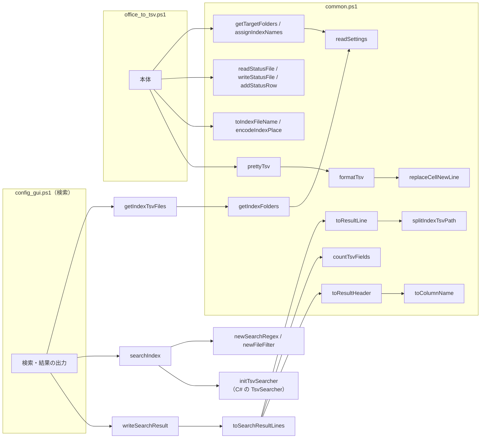
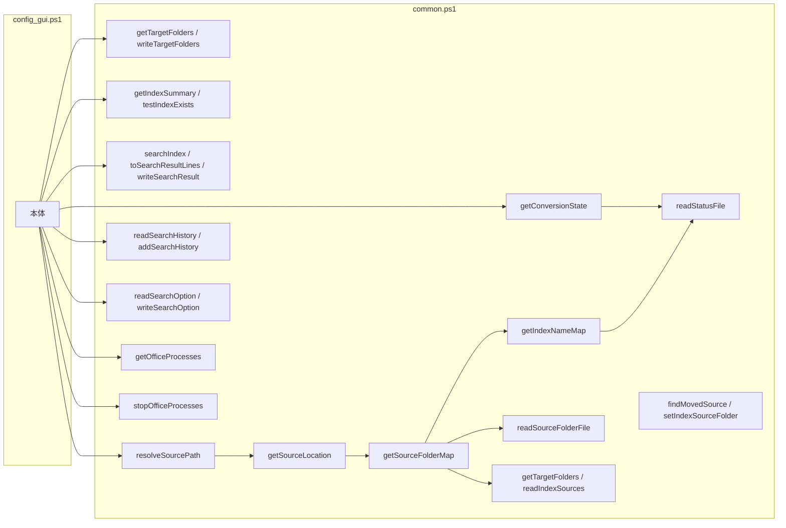

# win_grep 設計書（共通モジュール）

本書は [00_index.md](00_index.md) の一部である。章・節の番号は 00_index.md と分割した各ファイルで通し番号とし、各章がどのファイルにあるかは [00_index.md](00_index.md#ドキュメント構成) の表のとおり。

---

## 5. 共通モジュール `scripts/common.ps1`

各スクリプト・テストから dot-source（`. "$PSScriptRoot\common.ps1"`）して使う。

### 5.1 パス定義

| 変数 | 値 |
|---|---|
| `$rootDir` | `scripts/` の親（リポジトリ直下） |
| `$workDir` | `$rootDir\work` |
| `$indexDir` | `$workDir\index` |
| `$tmpDir` | `%TEMP%\win_grep\<PID>`（プロセスごと） |
| `$outputDir` | `$rootDir\output` |
| `$settingsFile` | `$rootDir\setting.config`（画面が保存する設定。内容は JSON。[4 章](00_共通_1_フォルダ構成と設定ファイル.md#4-設定ファイル-settingconfigreadsettings)） |
| `$legacyConfigDirName` / `$legacyTargetFolderFileName` ほか | 以前の設定ファイルのフォルダ名 `config` と、ファイル名 `変換対象フォルダパス.txt`・`検索対象インデックスパス.txt`・`元のフォルダの置き換え.txt`・`検索オプション.txt`（`setting.config` が無いとき、同じフォルダの `config\` から移すときだけ読む） |
| `$statusFile` | `$workDir\変換一覧.tsv` |
| `$convertingFile` | `$workDir\変換中.txt` |
| `$resultFile` | `$outputDir\検索結果.txt` |
| `$stopRequestFile` | `$workDir\変換中止要求`（画面が作成すると、変換処理はファイルの切れ目で中止する） |
| `$convertErrorFile` | `$workDir\変換エラー.txt`（変換処理を続けられないエラーのメッセージ。正常終了時は無い） |
| `$convertLogFile` | `$workDir\変換ログ.txt`（変換処理の表示内容の記録。実行ごとに上書き） |
| `$utf8Bom` | BOM 付き UTF-8 の `System.Text.Encoding` |
| `$cellNewLine` | インデックス TSV でセル内改行の代わりに使う文字（U+2028 LINE SEPARATOR） |
| `$statusColumns` | 変換一覧の列名（`相対パス` `更新日時` `サイズ` `状態` `TSV数` `変換日時` `エラー`） |
| `$statusFolderKey` | 変換一覧の先頭の変換対象フォルダの行の見出し（`変換対象フォルダ`） |
| `$stateNew` / `$stateDone` / `$stateFailed` | 変換一覧の状態（`未変換` / `済` / `失敗`） |
| `$historyFile` / `$historyMax` | `$workDir\検索履歴.txt`（画面の検索履歴。新しい順） / 履歴の最大件数（20） |
| `$officeProcessNames` | 強制終了の対象のプロセス名 → 表示名（`EXCEL` → `Excel`、`WINWORD` → `Word`、`POWERPNT` → `PowerPoint`） |

### 5.2 関数一覧

関数は用途ごとに次の 3 つに分けて記載する。

| 節 | 内容 | ファイル |
|---|---|---|
| 5.2.1 | 設定ファイル・変換一覧・変換対象フォルダ・インデックス名 | 本書 |
| 5.2.2 | TSV の作成・検索 | [00_共通_2_共通モジュール_1_TSV・検索・画面の関数.md](00_共通_2_共通モジュール_1_TSV・検索・画面の関数.md) |
| 5.2.3 | 元のファイルの特定・画面 | [00_共通_2_共通モジュール_1_TSV・検索・画面の関数.md](00_共通_2_共通モジュール_1_TSV・検索・画面の関数.md) |

#### 5.2.1 設定ファイル・変換一覧・変換対象フォルダ・インデックス名

| 関数 | 入力 | 出力 | 概要 | 詳細 | 使用元 |
|---|---|---|---|---|---|
| `newSettings` | – | ordered hashtable | 設定の既定値（`targetFolders` `indexSources` `indexFolders` `searchExcludes` `useRegex` `caseSensitive` `fileFilter` など） | [4 章](00_共通_1_フォルダ構成と設定ファイル.md#4-設定ファイル-settingconfigreadsettings) | readSettings |
| `readSettings` | path（既定 `$settingsFile`） | ordered hashtable | 設定を読む。記載の無いキーは既定値。ファイルが無ければ以前の設定ファイルから移して保存する（それも無ければ既定値。ファイルは作らない）。JSON として読めなければ例外 | 同上 | 設定の各関数 |
| `writeSettings` | settings, path（既定 `$settingsFile`） | – | 設定を JSON（UTF-8 BOM なし）で保存 | 同上 | updateSettings |
| `updateSettings` | key, value, path（既定 `$settingsFile`） | – | ファイルを読み直し、key の値だけ変えて保存する | 同上 | 設定の各関数 |
| `readLegacySettings` | settings, dir | bool | dir の以前の設定ファイル（`*.txt`）を settings に読み込む。1 つも無ければ `$false` | [4.3](00_共通_1_フォルダ構成と設定ファイル.md#43-以前の設定ファイルからの移行) | readSettings |
| `readListFile` | path | string[] | 行ファイルの空行以外の行（Trim しない）。無ければ空配列 | – | – |
| `writeListFile` | path, lines | – | 行ファイルを UTF-8（BOM 付き）で保存 | – | 検索履歴・変換中のファイルなど |
| `formatFileTime` | time | string | 変換一覧に記録する日時（`yyyy/MM/dd HH:mm:ss`）。更新の有無はこの文字列で比べる | [01_変換.md](01_変換_4_メインフローと変換一覧.md#42-変換一覧と変換対象の決定差分中断再試行) | 変換 |
| `newStatusRow` | 相対パス, 更新日時, サイズ, 状態, TSV数, 変換日時, エラー（2 番目以降は省略可） | 行オブジェクト | 変換一覧の 1 行を作る | 同上 | 変換 |
| `describeConvertError` | exception | string | 変換の例外から、変換一覧のエラー列・画面に表示する失敗の原因を作る | [01_変換.md](01_変換_6_共通処理とアプリ管理.md#47-失敗の原因describeconverterror) | 変換 |
| `readStatusFile` | path（既定 `$statusFile`） | `@{Folders; Rows}` | 変換一覧を読む。Folders は変換対象フォルダ `@{Path; Name}`（Name = インデックス名。以前の形式は空）、Rows は相対パス（`インデックス名\フォルダからの相対パス`。大文字・小文字を区別しない）→ 行。同じ相対パスは後の行を優先し、列数の合わない行は無視。変換中に読んでも書き込みを妨げない共有モードで開く。無ければ空 | [01_変換.md](01_変換_4_メインフローと変換一覧.md#42-変換一覧と変換対象の決定差分中断再試行) | 変換・画面 |
| `writeStatusFile` | folders（`@{Path; Name}` の配列）, rows, path（既定 `$statusFile`） | – | 変換一覧を書き出す（先頭に変換対象フォルダの行、1 ファイル 1 行。一時ファイルに書いてから置き換える） | 同上 | 変換 |
| `addStatusRow` | row, path（既定 `$statusFile`） | – | 変換一覧の末尾に 1 行追記する | 同上 | 変換 |
| `readConvertingFile` | path（既定 `$convertingFile`） | `@{RelPath; Count}` / `$null` | 変換中のファイルの記録（相対パスと、続けて変換を始めて終わらなかった回数）を読む。無い・壊れていれば `$null` | [01_変換.md](01_変換_4_メインフローと変換一覧.md#強制終了時間切れからの再開) | 変換 |
| `writeConvertingFile` | relPath, count, path（既定 `$convertingFile`） | – | 変換を始めるファイルを `<回数><TAB><相対パス>` で記録する | 同上 | 変換 |
| `removeConvertingFile` | path（既定 `$convertingFile`） | – | 変換中のファイルの記録を削除する（無くてもエラーにしない） | 同上 | 変換 |
| `normalizeFolderPath` | path | string | フォルダパスを 1 つの書き方にそろえる（前後の空白・`"` の除去、環境変数の展開、`/` → `\`、`\\?\` の除去、重なった `\` ・ `.` ・ `..` の解決、相対パスは `$rootDir` から、末尾の `\` の除去。ドライブ直下は `D:\` のまま）。解釈できない場合は書かれたとおり | [01_変換.md](01_変換.md#3-変換対象フォルダgettargetfolders) | getTargetFolders, 画面 |
| `getPathUnderFolder` | path, folder | string / `$null` | path が folder 自身か下なら folder からの相対パス（folder 自身は空）、下でなければ `$null`（大文字・小文字と末尾の `\` を無視）。パスの文字数で切り出さないために使う | 同上 | 変換・検索 |
| `parseDosDeviceTarget` | target | string | `QueryDosDevice` の結果を通常のパスにする（`\??\C:\data` → `C:\data`、`\Device\LanmanRedirector\;Z:…\server\share` → `\\server\share`）。実際のディスクは空 | 同上 | getDriveTargets |
| `getDriveTargets` | – | Dictionary（`Z:` → 割り当て先） | ネットワークドライブ・`subst` のドライブの割り当てを `QueryDosDevice` で調べる（同じプロセスで 1 回だけ） | 同上 | getFolderPathAliases |
| `getFolderPathAliases` | path, drives（既定 `getDriveTargets`） | string[] | 同じ場所を指す別の書き方を path 自身を先頭にして返す（`Z:\見積` ⇔ `\\server\share\見積`） | 同上 | testSameFolder, 画面 |
| `testSameFolder` | a, b, drives（既定 `getDriveTargets`） | bool | 2 つのパスが同じフォルダを指すか（書き方の違い・ドライブの割り当てをたどる） | 同上 | getTargetFolders, getSourceFolderMap, 画面 |
| `getTargetFolders` | path（既定 `$settingsFile`） | `@{Name; Path; Enabled}` の配列 | 変換対象フォルダ（`targetFolders`。記載順）。Name はインデックス名、Path は今の置き場所（分けて持つ）。`enabled` が `false` はチェックなし（Enabled = `$false`）。同じフォルダ・同じ名前は最初のものだけ（書き方が違うだけで同じフォルダも `testSameFolder` で同一とみなす） | [01_変換.md](01_変換.md#3-変換対象フォルダgettargetfolders) | 変換・画面 |
| `writeTargetFolders` | folders（`@{Name; Path; Enabled}` の配列）, path（既定 `$settingsFile`） | – | 変換対象フォルダを `targetFolders` に保存（名前も保存する） | 同上 | 変換・画面 |
| `readIndexSources` / `writeIndexSources` | path（既定 `$settingsFile`） / sources, path | `@{Name; Path}` の配列 / – | 変換しないインデックスの元のフォルダ（`indexSources`）を読み書きする | [00_共通_1 4 章](00_共通_1_フォルダ構成と設定ファイル.md#4-設定ファイル-settingconfigreadsettings) | getSourceFolderMap, 画面 |
| `setIndexSourceFolder` | name, folder, path（既定 `$settingsFile`） | – | インデックス名に対する元のフォルダを記録する。変換対象フォルダにある名前ならそのフォルダの Path を書き換え、無ければ `indexSources` に記録する | [03_画面_2_検索タブ_1 4.5.2](03_画面_2_検索タブ_1_元のファイルを開く.md#452-元のファイルが見つからないとき元のフォルダを設定する) | 画面 |
| `newIndexName` | folderPath, usedNames（HashSet） | string | インデックス名（フォルダ名・ドライブ名・共有名。重複すれば `名前(2)`…） | [01_変換.md](01_変換_4_メインフローと変換一覧.md#42-変換一覧と変換対象の決定差分中断再試行) | assignIndexNames |
| `assignIndexNames` | targetFolders, previousFolders（readStatusFile の Folders） | `@{Path; Enabled; Name}` の配列 | 設定の名前（getTargetFolders の Name）をそのまま使う。名前が無ければ、前回の変換一覧の同じフォルダの名前、それも無ければフォルダ名から重複しない名前を作る | 同上 | 変換 |
| `getFolderLeafName` | folderPath | string | フォルダ名（ドライブ直下はドライブ名、UNC は共有名） | 同上 | newIndexName |
| `splitIndexRelPath` | relPath | `@{Name; Rest}` | `work\index` からの相対パスを、先頭のインデックス名と残りに分ける | [01_変換.md](01_変換_4_メインフローと変換一覧.md#42-変換一覧と変換対象の決定差分中断再試行) | 変換, resolveSourcePath |
| `getIndexNameMap` | path（既定 `$statusFile`） | Dictionary（インデックス名 → フォルダパス） | 変換一覧のインデックス名から変換対象フォルダを引く表。変換対象フォルダの行は先頭にあるため、見出し行まで読んで打ち切る | 同上 | resolveSourcePath, 画面 |
| `readIndexFolders` / `writeIndexFolders` | path（既定 `$settingsFile`） / folders, path | string[] / – | 設定した検索対象インデックスフォルダ（`indexFolders`）を記載のまま読み書きする（空は `work\index` の意味） | [02_検索.md](02_検索.md#3-検索対象インデックスgetindexfolders) | 画面（［場所の設定…］のダイアログ） |
| `getIndexFolders` | path（既定 ``） | string[] | 検索対象インデックスフォルダ。設定が無い・空なら `work\index` | 同上 | 検索 |
| `readSearchExcludes` / `writeSearchExcludes` | path（既定 ``） / excludes, path | `@{Path; Subfolders}` の配列 / – | 画面の検索対象のツリーでチェックを外したフォルダ（`searchExcludes`）を読み書きする。無ければ空（すべて検索） | 同上 | 画面（検索対象のツリー） |

> **5.2.2 TSV の作成・検索** → [00_共通_2_共通モジュール_1_TSV・検索・画面の関数.md](00_共通_2_共通モジュール_1_TSV・検索・画面の関数.md#522-tsv-の作成検索)

> **5.2.3 元のファイルの特定・画面** → [00_共通_2_共通モジュール_1_TSV・検索・画面の関数.md](00_共通_2_共通モジュール_1_TSV・検索・画面の関数.md#523-元のファイルの特定画面)

変換処理（`office_to_tsv.ps1`）と、画面の検索（`config_gui.ps1`）は次の関数を使う。

画面（`config_gui.ps1`）は、ほかに次の関数を使う。

Word・PowerPoint の読み取り関数（`isZipFile` / `readDocxUnits` / `readPptxUnits` / `readXmlLines` / `writeUnits` 等）は `scripts/office_reader.ps1` にあり、`office_to_tsv.ps1` とテストから dot-source する（仕様は [01_変換.md](01_変換.md) の 4.4・6.4、[01_変換_2_Word.md](01_変換_2_Word.md)、[01_変換_3_PowerPoint.md](01_変換_3_PowerPoint.md)）。
