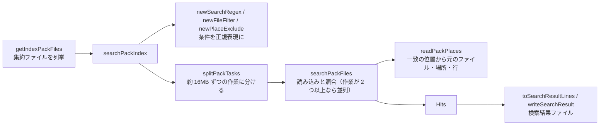

# tebunko 設計書（共通モジュール ― TSV・検索・画面の関数）

本書は [00_index.md](00_index.md) の一部である。章・節の番号は 00_index.md と分割した各ファイルで通し番号とし、各章がどのファイルにあるかは [00_index.md](00_index.md#ドキュメント構成) の表のとおり。

本書は [00_共通_2_共通モジュール.md](00_共通_2_共通モジュール.md#5-共通モジュール) の関数一覧の続きで、`tebunko/lib.ps1` から使える関数のうち次のものを載せる。

- **5.2.2** インデックスの TSV の名前・作成・配置、集約ファイルの形式・読み書きと、検索（`shared/core/fs.ps1`・`text.ps1`、`tebunko/index/`・`search/`）
- **5.2.3** 検索結果から元のファイルを特定する処理と、画面が使う集計・設定・Office プロセスの関数

---

## 5. 共通モジュール（続き）

### 5.2 関数一覧（続き）

5.2.1 設定ファイル・取り込み一覧・クロール対象フォルダ・インデックス名は [00_共通_2_共通モジュール.md](00_共通_2_共通モジュール.md#521-設定ファイル取り込み一覧クロール対象フォルダインデックス名) を参照。

#### 5.2.2 TSV の作成・検索

**TSV の名前と場所（`shared/core/fs.ps1`・`tebunko/index/index_name.ps1`）**

| 関数 | 入力 | 出力 | 概要 | 詳細 | 使用元 |
|---|---|---|---|---|---|
| `toSafeFileName` | name | string | ファイル名禁止文字を全角に置換 | [01_インデックス作成.md](01_インデックス作成.md) | インデックス名（newIndexName・getTargetFolders）、以前の版のインデックスのシート名の照合（画面） |
| `encodeIndexPlace` | place | string | TSV のファイル名に入れる場所を符号化する（ファイル名禁止文字・制御文字・`_`・`%` を `%XX` に） | [01_インデックス作成_7 6.2 節](01_インデックス作成_7_出力TSVと既知の問題.md#62-場所の符号化encodeindexplace--decodeindexplace) | toIndexFileName |
| `decodeIndexPlace` | place | string | `encodeIndexPlace` の `%XX` を元に戻す（それ以外の `%` はそのまま） | 同上 | splitIndexFileName, getIndexFolderBooks |
| `toIndexFileName` | place | string | インデックスの TSV のファイル名 `<場所>.tsv`（場所は `encodeIndexPlace`）。元のファイル名はフォルダ名にするため入れない。`$maxFileNameLength`（255）文字を超えれば例外 | [01_インデックス作成_7 6.1 節](01_インデックス作成_7_出力TSVと既知の問題.md#61-配置命名規則) | インデックス作成（Excel・Word・PowerPoint） |
| `splitIndexFileName` | fileName | `@{book; sheet}` | 以前の形式（フラット）のインデックスファイル名を元のファイル名・場所に分解し、場所を `decodeIndexPlace` で元に戻す（正規表現は `$indexFileNamePattern`） | 同上 | インデックス作成（migrateFlatIndex） |
| `splitObjectPlace` | place | `@{Base; Kind}` | 図形・コメントの場所（`<元の場所>[図形]` 等）を、元の場所と種類に分ける。ふつうの場所は Kind が空 | [01_インデックス作成_7](01_インデックス作成_7_出力TSVと既知の問題.md#61-配置命名規則) 6.1「図形・コメントの場所」 | 元のファイルを開く、convertPlaceToPackMeta |
| `describePlace` | book, place | `@{Place; Kind}` | 画面の「場所」「種別」と検索結果ファイルに出す文字（`[シート] 売上`・図形、`[ページ] 3（目安）`・本文 など） | [02_検索.md](02_検索.md#51-出力フォーマットwork検索結果txt) 5.1 | 画面・`toResultLine` |
| `toLongPath` | path | string | ファイル操作に渡すパスの先頭に `\\?\`（ネットワークのパスは `\\?\UNC\`）を付け、260 文字を超えるパスも扱えるようにする。付いていればそのまま | [01_インデックス作成_7 6.1 節](01_インデックス作成_7_出力TSVと既知の問題.md#長いパス260-文字超の扱い) | インデックス作成・検索 |
| `fromLongPath` | path | string | `toLongPath` で付けた `\\?\` を外す（`Get-ChildItem` の `FullName` から相対パスを求めるため） | 同上 | インデックス作成・検索 |
| `removeDirectoryRetry` | path, tries（既定 3）, waitMilliseconds（既定 200） | – | フォルダを中身ごと削除する。ほかのアプリが一時的に掴んでいることがあるため、少し待って数回試す | – | インデックス作成（インデックス・作業フォルダの削除） |

**TSV の整形（`shared/core/text.ps1`）**

| 関数 | 入力 | 出力 | 概要 | 詳細 | 使用元 |
|---|---|---|---|---|---|
| `replaceCellNewLine` | inputString | string | `"` で囲まれた範囲の改行（CRLF・CR・LF）を `$cellNewLine` に置き換える | [01_インデックス作成_1_Excel.md](01_インデックス作成_1_Excel.md) | formatTsv |
| `formatTsv` | content, firstRow（既定 1）, firstColumn（既定 1） | string | TSV 整形。N 行目・k 列目をシートの N 行目・k 列目にそろえる | 同上 | prettyTsv |
| `prettyTsv` | 入力パス, 出力パス, firstRow（既定 1）, firstColumn（既定 1） | bool | 入力（UTF-16）を読み、`formatTsv` して UTF-8（BOM 付き）で保存。内容が空なら保存せず `$false` | 同上 | インデックス作成 |
| `countTsvFields` | line | int | Excel に貼り付けたときのセル数（`"` で始まるセルは閉じる `"` までを 1 セルとする。先頭のセルが空でも数え落とさない） | [02_検索.md](02_検索.md#52-1-行の組み立て) | 検索 |
| `toColumnName` | number | string | 列番号を列名に変換（1 → `A`、27 → `AA`） | 同上 | toResultHeader |
| `splitTsvCells` | line | string[] | TSV の 1 行をセルに分ける（`"` で囲まれたセルは 1 セルとし、囲みを外す。`countTsvFields` と同じ区切り方。画面のプレビューは同じ区切り方を型 `HitRow`（`types.ps1`）の中に持つ） | – | テストだけ |

**インデックスへの配置（`tebunko/index/index_store.ps1`）**

| 関数 | 入力 | 出力 | 概要 | 詳細 | 使用元 |
|---|---|---|---|---|---|
| `getIndexTsvCounts` | dir（既定 `$indexDir`） | 相対パス → 数の辞書 / `$null` | インデックスの中のファイルを 1 回列挙して数える。集約ファイルはそのファイルの相対パス → 1（0 バイトなら -1）、集約する前の TSV は元のファイルのフォルダの相対パス（取り込み一覧の相対パスと同じ）→ TSV の数（0 バイトの TSV があれば -1。TSV の無いフォルダは 0）。列挙できなければ `$null` | [01_インデックス作成_5](01_インデックス作成_5_クロール.md#取り込み対象の決定createtargetlist) | インデックス作成（取り込み対象の決定） |
| `testIndexComplete` | row, relPath, counts | bool | 取り込み一覧の「済」の行に対して、インデックスがそろっているかを返す。そのフォルダ・その拡張子の集約ファイルがあれば（0 バイトでなければ）`$true`。無ければ集約する前の TSV を見て、行の TSV 数より少ない・0 バイトなら `$false`（取り込み直す）。TSV 数が空・counts が `$null` のときは確認しない | 同上 | インデックス作成（取り込み対象の決定） |
| `publishIndexFiles` | fromDir, bookDir, stagingDir | – | 書き出した TSV を stagingDir に集めてから、`bookDir` をフォルダごと入れ替える（作りかけのインデックスを残さない）。別ドライブでフォルダごと移せない場合は 1 件ずつ移す | [01_インデックス作成_7 6.1 節](01_インデックス作成_7_出力TSVと既知の問題.md#インデックスへの入れ替えpublishtsv--publishindexfiles) | インデックス作成（publishTsv） |

**集約ファイルの形式（`tebunko/index/pack_format.ps1`）**

形式は [01_インデックス作成_7](01_インデックス作成_7_出力TSVと既知の問題.md#61-配置命名規則) 6.1「集約ファイルの形式」。判断層のため、ファイルを読み書きしない。

| 関数 | 入力 | 出力 | 概要 | 使用元 |
|---|---|---|---|---|
| `getPackFileKind` | book | string | 元のファイル名から種類（`Excel` / `Word` / `PowerPoint`。分からなければ空） | convertToPackText, convertPlaceToPackMeta |
| `getPackExtension` / `getPackFileName` / `readPackFileName` | book / extension, part / name | string / `@{Extension; Part}` | 集約ファイルを分ける拡張子（小文字・`.` なし） / 集約ファイルの名前（`content.<拡張子>.<番号>.tsv`） / 名前から拡張子と番号を取り出す | convertIndexFolderToPack, getIndexTsvCounts |
| `splitPackBooksByExtension` | books | [ordered] 拡張子 → 並び | 元のファイルの並びを拡張子ごとに分ける（各並びの中の順は変えない） | convertIndexFolderToPack |
| `encodePackValue` / `decodePackValue` | value | string | メタ情報の値の制御文字（タブを除く）と `%` を `%XX` にする / 戻す | convertToPackText, readPackPlaces |
| `convertPlaceToPackMeta` | book, place | [ordered] キー → 値 | 場所の名前（TSV のファイル名。`見積[図形]`・`ページ001` など）を場所のメタ情報にする。組み立て直して同じ名前にならないものは `部分=<名前>`・`対象=本文` | convertToPackText |
| `convertPackMetaToPlace` | meta | string | 場所のメタ情報から場所の名前を組み立てる（画面の表示・図形とコメントの除外・元のファイルを開く処理が使う形） | readPackPlaces |
| `convertToPackBody` | text | string | TSV の中身を集約ファイルに入れる形にする（改行を LF に、末尾に LF、U+001C〜U+001F を除く） | convertToPackText |
| `convertToPackText` | books | string | 元のファイルの並び（TSV から新しく作るもの、または前の集約ファイルから写すまとまり）から、集約ファイルの文字列を作る | convertIndexFolderToPack |
| `readPackPlaces` | text | `@{Book; Location; Start; End}` の並び | 集約ファイルの文字列から、場所ごとの元のファイル名・場所の名前・中身の範囲を先頭から順に返す。版が違えば例外 | 検索（searchPackFiles）、readPackContext |
| `splitPackTextByBook` | text | `@{Name; Block}` の並び | 集約ファイルの文字列を元のファイルごとのまとまりに分ける（入れ替えない元のファイルをそのまま写すため）。版が違えば例外 | convertIndexFolderToPack |
| `getPackContentText` | text | string | メタ情報の行を除いた中身（システムインデックスの語を作るため） | writeSystemIndexFolder |

**集約ファイルの読み書き（`tebunko/index/pack_store.ps1`）**

| 関数 | 入力 | 出力 | 概要 | 詳細 | 使用元 |
|---|---|---|---|---|---|
| `writePackFile` / `readPackText` | path, text / path | – / string | 集約ファイルを UTF-16LE（BOM 付き）で書く（`<名前>.tmp` に書いてから `File.Replace` で置き換える） / 読む（置き換え・削除を妨げない共有モード） | [01_インデックス作成_7 6.1 節](01_インデックス作成_7_出力TSVと既知の問題.md#61-配置命名規則) | convertIndexFolderToPack, readPackContext |
| `getIndexFolderBooks` | folder | `@{Name; Places}` の並び | フォルダ直下の元のファイルごとのフォルダ（`<ファイル名.xlsx>\<場所>.tsv`）から、集約ファイルに入れる元のファイルと場所の並びを作る | 同上 | convertIndexFolderToPack |
| `convertIndexFolderToPack` | folder, destFolder, removeBooks, removeTsv | `@{Books; Tsv; Chars; Files; Texts}` | フォルダ 1 つの TSV から拡張子ごとの集約ファイルを書く。前の集約ファイルとまぜ（TSV のある元のファイルは入れ替え、removeBooks は外し、ほかは写す）、元のファイルが無くなった拡張子の集約ファイルは消す。removeTsv なら書き終えた後に TSV のフォルダを消す。Texts は書いた中身 | 同上 | updateIndexFolderPack |
| `updateIndexFolderPack` | folder, removeBooks | 同上 | `convertIndexFolderToPack` を同じフォルダに書き、TSV を消す形で呼ぶ | 同上 | publishIndexFolders |
| `getPackFiles` | root, relPath, recurse | `@{Path; Root; RelDir; RelPath; Ticks; Size}` の配列 | フォルダ以下の集約ファイルを列挙し、フォルダの順・フォルダの中は名前の順に並べる（Path は `\\?\` 付き。Ticks・Size は読んだ内容を使い回してよいかの判定に使う） | [02_検索.md 4.3](02_検索.md#43-検索の実装速度) | getIndexPackFiles |
| `findIndexFoldersWithBooks` | root | string[] | 元のファイルごとのフォルダ（集約ファイルに入れる前の TSV）が直下にあるフォルダを返す（インデックス作成が途中で止まった・以前の版のインデックス） | [01_インデックス作成_7 6.1 節](01_インデックス作成_7_出力TSVと既知の問題.md#61-配置命名規則) | インデックス作成（開始時） |
| `publishIndexFolders` | pending（フォルダ → 無くなった元のファイル名）, indexRoot, systemRoot, statePath | 書き出したフォルダの数 | フォルダごとに、集約ファイルを書き（`updateIndexFolderPack`）、TSV を消し、書いた中身からシステムインデックスの txt を作る（`writeSystemIndexFolder`）。txt の「反映待ち」はまとめて状態ファイルに書く | 同上 | インデックス作成（flushPendingPublish） |
| `readPackContext` | path, book, location, lineNumber, before（既定 3）, after（既定 3）, cache | `@{LineNumber; Line}` の配列 | 集約ファイルの中の元のファイル book・場所 location の lineNumber 行目と前後の行を返す（行の数え方は検索と同じ）。cache（`newTsvTextCache`）に同じ集約ファイルの内容があれば読み直さない。読めない・見つからなければ空 | [03_画面_2_検索タブ.md](03_画面_2_検索タブ.md) 4.7 | 画面 |

**検索（`tebunko/search/search_query.ps1`・`pack_search.ps1`・`search_run.ps1`）**

| 関数 | 入力 | 出力 | 概要 | 詳細 | 使用元 |
|---|---|---|---|---|---|
| `isValidRegex` | pattern | bool | 正規表現として正しいか | – | 検索・画面 |
| `newSearchRegex` | word, simpleMatch, caseSensitive | `@{Regex; SimpleMatch; TextRegex; ScanMode}` | 検索条件から照合用の正規表現を作る（文字どおりならエスケープ、大文字と小文字を区別しないなら IgnoreCase、正規表現として不正なら文字どおりにする）。1 行の照合は 5 秒で時間切れ。TextRegex は集約ファイルの全文にかける正規表現（Multiline）、ScanMode はそれを全文にかけてよいか（`getRegexScanMode`） | [02_検索.md 4.2](02_検索.md#42-検索条件サクラエディタの-grep-にならう) | 検索・画面（一致箇所の強調） |
| `getRegexScanMode` | pattern | string（`lines` / `filter` / `scan`） | 正規表現を全文にかけて、1 行ずつの照合と同じ結果になるかを判定する。`lines` は全文での一致の位置から行が分かる、`filter` は全文で一致しない集約ファイルを読み飛ばせる、`scan` は 1 行ずつ照合する。分からない書き方は安全側（`filter` か `scan`）に倒す | [02_検索.md 4.3](02_検索.md#43-検索の実装速度) | newSearchRegex |
| `newFileFilter` | filter | `@{Include; Exclude}` | 対象ファイルの指定（`*.xlsx;見積;!*old*`）を、元のファイル名に対する正規表現にする（無い側は `$null`） | [02_検索.md 4.2](02_検索.md#42-検索条件サクラエディタの-grep-にならう) | `searchPackIndex` |
| `newPlaceExclude` | includeShapes, includeComments | regex / `$null` | 検索から外す図形・コメントの場所（名前の末尾 `[図形]` `[コメント]`）の正規表現。どちらも検索するなら `$null` | 同上 | `searchPackIndex` |
| `getIndexPackFiles` | folders（既定 `$indexDir`。フォルダの文字列、または `@{Root; RelPath; Recurse}`（画面のツリーで選んだ範囲。`Recurse` が `$false` なら直下だけ）の配列）, onProgress（フォルダを 1 つ数えるたびに `{ param($count) }` を呼ぶ） | `@{Folders; Packs}` | 検索対象の集約ファイルを列挙する（`getPackFiles`）。結果の相対パスは `Root` から求める。Folders はフォルダごとの `@{Path; Root; Exists; Count}`、Packs は `getPackFiles` の要素をつないだもの（フォルダの順・名前の順、重複なし） | [02_検索.md 4.3](02_検索.md#43-検索の実装速度) | 検索・画面、getFastSearchPackFiles |
| `testIndexExists` | folders | bool | 集約ファイルが 1 件でもあるか（最初の 1 件で打ち切る） | – | 画面 |
| `getIndexSummary` | folders | `@{Count; LastWrite; Missing}` | 集約ファイルの件数・最新の更新日時・存在しないフォルダ | – | 画面 |
| `splitPackTasks` | packs, taskBytes（既定 16MB） | `@{Start; Count}` の並び | 集約ファイルの並びを、大きさの合計がおよそ taskBytes になるまでまとめて、1 つのスレッドに渡す作業に分ける | 同上 | searchPackIndex |
| `searchPackFiles` | packs, start, count, regex, max, textRegex, scanMode, cache, include, exclude, excludePlace | ヒットの一覧 | packs の start から count 件を読み、regex に一致する行を返す（1 行に複数一致しても 1 件）。`ScanMode` に応じて全文に 1 回照合し、一致しない集約ファイルは飛ばす。一致の位置から場所・行を求める（`readPackPlaces`）。インデックス作成中の集約ファイルも読めるよう共有して開き、読めないものは飛ばす | 同上 | searchPackIndex（並列検索のスレッドでも動く） |
| `searchPackIndex` | word, packs, simpleMatch, limit, shouldStop, caseSensitive, fileFilter, workerCount（並列のスレッド数。0 は自動で最大 4）, cache（`newTsvTextCache`）, includeShapes, includeComments（図形・コメントの場所も検索するか。`newPlaceExclude`）, taskBytes, onProgress（`{ param($done, $total, $newHits) }`。done・total は集約ファイルの数）, pool（照合のプール `newPackWorkerPool`。`$null` なら並列にするときだけ作って最後に閉じる） | `@{Hits; SimpleMatch; Total; Truncated; Cancelled}` | 集約ファイルを検索する（照合は `searchPackFiles`＝.NET の `StreamReader`＋`[regex]`）。Hits は PSCustomObject（Root・RelPath（集約ファイル）・RelDir・FileName・Book・Location・LineNumber・Line）。Total は集約ファイルの数。作業（約 16MB）ごとに進捗を知らせ、上限・中止に対応する。作業が 2 つ以上なら複数スレッドで並行して検索する（結果の順は変わらない）。照合が時間切れになれば例外にする | [02_検索.md](02_検索.md#4-検索処理) | 検索・画面 |
| `newTsvTextCache` | maxChars（既定 6,400 万文字） | `@{Texts; Chars; MaxChars; Generation}` | 検索で読んだ集約ファイルの内容と場所の一覧を次の検索・プレビューで使い回す入れ物（パス → 更新日時・サイズ・内容・場所の一覧・最後に使った世代）。更新日時・サイズが変わった集約ファイルは読み直す。追い出しは `trimTsvTextCache` | [02_検索.md 4.3](02_検索.md#43-検索の実装速度) | 画面 |
| `newPackWorkerPool` | workers（既定 `getWorkerCount`） | `WorkerPool` | 集約ファイルの照合のプールを作る（各スレッドには照合に要る関数と値だけを読み込む。優先度は Normal） | [7.3](00_共通_4_プロセスとスレッド.md#73-寿命) | 検索の司令（`SearchService`）、searchPackIndex |
| `trimTsvTextCache` | cache, keepRatio（既定 0.9） | 追い出した数 | 検索 1 回の後に呼ぶ。上限の keepRatio を超えていたら、今の世代で使わなかったものを古い世代から追い出し、世代を 1 つ進める | [7.7](00_共通_4_プロセスとスレッド.md#77-gc-とメモリ) | 検索の司令 |
| `newSearchRequest` | word, simpleMatch, folders, limit, option, useFast | 検索の要求（`[hashtable]::Synchronized`） | 検索 1 回分の要求を作る。画面が条件と `Stop`（取り消し）を書き、検索の司令がヒット（`Queue`）・進み具合・`Finished` を書く | [7.3](00_共通_4_プロセスとスレッド.md#73-寿命) | 画面 |
| `invokeSearchRequest` | request, pool, cache | – | 検索の要求を実行し、ヒットと進み具合を要求に少しずつ入れる。例外は投げずに `Error` に入れる。始める前に取り消されていたら何もせずに `Cancelled` にする | 同上 | 検索の司令 |
| `toResultLine` | book, location, lineNumber, line | string | `ファイル名<TAB>場所<TAB>種別<TAB>行番号<TAB>該当行` を返す（場所・種別は `describePlace` の表示）。Excel はセル内改行を LF に戻し、Word・PowerPoint は `"` で始まるセルを `"` で囲む。場所のタブ・改行（Excel のシート名に付けられる）はスペースにする | [02_検索.md 5.2](02_検索.md#52-1-行の組み立て) | 検索 |
| `toResultHeader` | columnCount | string | 見出し行 `ファイル名<TAB>場所<TAB>種別<TAB>行<TAB>A<TAB>B…` を返す | [02_検索.md 5.1](02_検索.md#51-出力フォーマットwork検索結果txt) | 検索 |
| `toSearchResultLines` | hits | `@{Header; Lines}` | 検索結果ファイルの見出し行と各行（相対フォルダ付き `toResultLine`、最大セル数の `toResultHeader`） | 同上 | 検索・画面 |
| `writeSearchResult` | writer, word, hits | – | 1 ワード分の `【検索文字列　X】 N 件`・見出し行・各行・空行を書き出す | 同上 | 検索・画面 |

**スレッドとプール（`shared/core/worker_pool.ps1`・`tebunko/search/search_service.ps1`・`tebunko/indexer/indexing_session.ps1`）**

設計は [7 章](00_共通_4_プロセスとスレッド.md#7-プロセスとスレッド)。クラスは画面のスレッド（作ったランスペースのスレッド）だけから呼ぶ（[7.8](00_共通_4_プロセスとスレッド.md#78-クラスと関数の使い分け)）。

| 関数・クラス | 入力 | 出力 | 概要 | 使用元 |
|---|---|---|---|---|
| `newWorkerState` | functions, variables | `InitialSessionState` | プールの各スレッドに読み込む関数・値だけを入れた状態を作る（lib.ps1 全体を読み込むと、スレッドを用意するだけで時間がかかるため） | newPackWorkerPool, writeSystemIndexFolders |
| `getWorkerCount` | max（既定 4）, processors | int | プールのスレッドの数の既定（コア数 − 1。1〜max） | 検索・インデックス作成 |
| `WorkerPool` | size, state, host, priority | – | ランスペースと PowerShell のインスタンスを使い回すプール。`Submit`（仕事を始める）・`Receive`（終わりを待って出力を返す）・`Cancel`・`Close`。`Priority` は仕事を始めるたびにスレッドに設定する。`Prelude` は各スレッドで最初の仕事の前に 1 回だけ実行する | 照合のプール・システムインデックスのプール・BackgroundQueue |
| `BackgroundQueue` | size, prelude, host | – | 画面から頼まれる短い仕事のスレッド（画面は 2 つで作る）。`Post`（仕事を始める）・`Poll`（終わった仕事の onDone を画面のスレッドで呼び、残りの数を返す）・`Close` | startJob（`shell.ps1`） |
| `newSearchService` / `SearchService` | libPath, cache, workers | `SearchService` | 検索の司令のスレッド（画面を開いている間 1 つ）。`Request`（前の要求を取り消して新しい要求を渡す。スレッドが止まっていれば作り直す）・`Cancel`・`IsRunning`・`GetFailure`・`Close`（5 秒待って止まらなければスレッドを止める） | 画面 |
| `newIndexingSession` / `IndexingSession` | indexerPath, channel | `IndexingSession` | インデックス作成 1 回分のスレッド（MTA・BelowNormal）を作り、`indexer.ps1 -Channel <channel>` を実行する。`IsRunning`・`Stop`・`Wait`・`GetExitCode`（終了コードが無ければ 1）・`GetError`・`KillOffice`（`OfficePids` に記録した Office だけを、プロセス名を確かめて止める）・`Close` | 画面 |

#### 5.2.3 元のファイルの特定・画面

**元のファイルの特定（`tebunko/search/source_map.ps1`）**

| 関数 | 入力 | 出力 | 概要 | 詳細 | 使用元 |
|---|---|---|---|---|---|
| `writeSourceFolderFile` | folders（`@{Path; Name}` の配列）, dir（既定 `$indexDir`） | – | 各インデックスのフォルダ（`dir\<インデックス名>`）に `元のフォルダ.txt`（`インデックス名<TAB>クロール対象フォルダ`）を書き出す。以前の版が `dir` 直下に書いた全インデックス分のファイルがあれば、各フォルダへ移してから消す | [01_インデックス作成_4](01_インデックス作成_4_メインフローと取り込み一覧.md#42-取り込み一覧と取り込み対象の決定差分中断再試行) | インデックス作成 |
| `readSourceFolderFile` | dir | Dictionary（インデックス名 → フォルダパス） | `dir` 直下の `元のフォルダ.txt` を読む。無ければ空（`dir` の下は探さない。インデックスのフォルダの下は元のファイル 1 つにつき 1 フォルダになるため） | 同上 | getSourceFolderMap |
| `getSourceFolderMap` | dir, statusPath（既定 `$statusFile`）, settingsPath（既定 `$settingsFile`） | Dictionary（インデックス名 → 元のフォルダ） | インデックス名に対する元のフォルダ。`dir` 直下の `元のフォルダ.txt` → （既定のインデックスなら）取り込み一覧 → **設定（`targetFolders` / `indexSources`）** の順に上書きするため、設定の「今の置き場所」が最も優先される | [03_画面_2_検索タブ_1](03_画面_2_検索タブ_1_元のファイルを開く.md#451-元のフォルダの特定インデックスを別の-pc場所で使う場合) | getSourceLocation |
| `getSourceLocation` | hit, maps（フォルダ → 対応 のキャッシュ） | `@{Name; Folder; Rest; Known}` | 検索結果のインデックス名・元のフォルダ・その下の相対フォルダ。検索対象フォルダの対応 → その下の `<インデックス名>` のフォルダのもの → 検索対象フォルダ自身・その親のもの（インデックス名のフォルダを直接指定した場合）の順に使う。分からなければ Known = `$false`・Folder = 空（Name は返すため、フォルダを選んでもらえば設定に記録できる） | 同上 | resolveSourcePath, 画面 |
| `joinSourcePath` | folder, rest, name | string | フォルダ・相対フォルダ・ファイル名をつなぐ（ドライブ直下でも `\` を重ねない） | – | 画面 |
| `findMovedSource` | picked, rest, book | `@{Path; Root}` / `$null` | 選んだフォルダの中から元のファイルを探す。選んだフォルダを元のフォルダ、その下のフォルダ…の順に当てはめて試し、見つかったファイルと、元のフォルダに当たるフォルダ（Root）を返す | [03_画面_2_検索タブ_1 4.5.2](03_画面_2_検索タブ_1_元のファイルを開く.md#452-元のファイルが見つからないとき元のフォルダを設定する) | 画面 |
| `resolveSourcePath` | hit, maps | string / `$null` | 検索結果の元のファイルのパス（ファイルがあるかは確かめない）。元のフォルダが分からなければ `$null` | [03_画面_2_検索タブ_1](03_画面_2_検索タブ_1_元のファイルを開く.md#451-元のフォルダの特定インデックスを別の-pc場所で使う場合) | 画面 |

**画面が使う集計・設定・Office プロセス**

| 関数 | 入力 | 出力 | 概要 | 詳細 | 使用元 |
|---|---|---|---|---|---|
| `readSearchOption` / `writeSearchOption` | path（既定 `$settingsFile`） / option（`@{UseRegex; CaseSensitive; FileFilter; IncludeShapes; IncludeComments}` のうち変える項目）, path | `@{UseRegex; CaseSensitive; FileFilter; IncludeShapes; IncludeComments}` / – | 画面の検索条件（`setting.config` の `useRegex` / `caseSensitive` / `fileFilter` / `includeShapes` / `includeComments`。無ければオフ・空、図形とコメントはオン）。保存は option にある項目だけを変える | [4 章](00_共通_1_フォルダ構成と設定ファイル.md#4-設定ファイル-settingconfigreadsettings) | 画面 |
| `getIndexingState` | since, path | `@{Exists; Folders; Total; Pending; Failed; Done; IngestedSince; Updated; FailedRows; IndexStats}` | 取り込み一覧の状態ごとの件数、since 以降に取り込んだ件数、失敗したファイルの行（FailedRows。取り込み日時の新しい順）、インデックス名ごとの集計（IndexStats。`getIndexStats`。取り込み一覧を読み直さずに済むよう同じ読み込みから作る） | [03_画面_4_状態と操作の流れ.md](03_画面_4_状態と操作の流れ.md) | 画面 |
| `getOfficeProcesses` | – | プロセス情報の配列 | 実行中の Excel・Word・PowerPoint（Id・ProcessName・AppName・Background・StartTime・MemoryMB・Title）。`MainWindowHandle` が 0 ならバックグラウンド | [03_画面_3_プロセス停止タブ.md](03_画面_3_プロセス停止タブ.md) | 画面 |
| `stopOfficeProcesses` | ids | `@{Id; Stopped; Message}` の配列 | `Stop-Process -Force` で終了し、成否と理由を返す | 同上 | 画面 |
