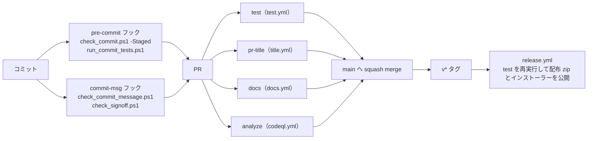

# tebunko 設計書（テスト）

本書は [00_index.md](00_index.md) の一部である。章・節の番号は 00_index.md と分割した各ファイルで通し番号とし、各章がどのファイルにあるかは [00_index.md](00_index.md#ドキュメント構成) の表のとおり。

本書は、tebunko の品質をどう確かめているかをまとめる。コードを変えたときに何が自動で確かめられ、何を手で確かめるかが分かる。

| 知りたいこと | 節 |
|---|---|
| 品質の関門（どこで何を止めるか）の一覧 | [6.0](#60-品質の関門の一覧) |
| 関数ごとに何をテストしているか | [6.1](#61-単体テスト) |
| Office の実機で確かめたこと | [6.2](#62-結合テスト手動) |
| テストの置き場所・タグ・実行のしかた・カバレッジ | [6.3](#63-テストの構成と実行)、[タグと実行](#タグと実行) |
| CI のワークフローとマージの必須チェック | [CI](#ci) |
| コミット時のフック | [コミット前の検査（pre-commit フック）](#コミット前の検査pre-commit-フック) |
| 個人情報・文字コードの検査 | [公開してはいけない内容の検査](#公開してはいけない内容の検査toolscheck_commitps1) |

---

## 6. テスト

### 6.0 品質の関門の一覧

変更は、手元のコミット → PR → main → リリースの順に、次の関門を通る。main へは PR 経由でしか入れられず（ブランチ保護）、必須チェックが通らないとマージできない。



| 関門 | 何を止めるか | 仕組み | 必須 |
|---|---|---|---|
| 単体テスト（Unit・Io・Meta） | 関数の動きの誤り、構成の決まりの違反 | `tests/run.ps1`（Pester 5.9.0）。[6.1](#61-単体テスト)・[6.3](#63-テストの構成と実行) | CI の `test` |
| カバレッジの下限 | テストされない処理が増えること | `tests/coverage.baseline`（90.0%）を下回ると `-Ci` が失敗する。[タグと実行](#タグと実行) | CI の `test` |
| 構成・安全性のメタテスト | 層の決まり・文字コード・危険な処理（`Invoke-Expression`・通信・実行時コンパイルなど）の混入 | `tests/meta/`。[6.3](#63-テストの構成と実行) | CI の `test` |
| 静的解析 | PSScriptAnalyzer の `Error` と、安全性にかかわる 14 ルールの指摘 | `test.yml`（版は 1.25.0 に固定）と `tests/meta/safety.Tests.ps1` | CI の `test` |
| 個人情報・文字コード | 利用者名入りのパス・メールアドレス・Office ファイルの作成者名、BOM・CRLF でないスクリプト | `tools/check_commit.ps1`。[公開してはいけない内容の検査](#公開してはいけない内容の検査toolscheck_commitps1) | フックと CI の `test` |
| DCO（`Signed-off-by`） | 作者の署名の無いコミット | `tools/check_signoff.ps1` | フックと CI の `test` |
| コミット・PR のタイトル | Conventional Commits の形でないもの | `tools/check_commit_message.ps1` | フックと CI の `pr-title` |
| 設計書のリンク | リンク先のファイル・見出しが無いこと | `mkdocs build --strict`（`docs/` の中）、メタテスト `links`（git で管理する全 `.md`） | CI の `docs`・`test` |
| ワークフローの静的解析 | 信頼できない入力を `run` に埋め込む書き方など | CodeQL | CI の `analyze` |
| サプライチェーンの採点 | ―（採点だけでマージは止めない） | OpenSSF Scorecard | ― |
| Office の実機での確認 | COM を使うインデックス作成の不具合 | 手動の結合テスト。[6.2](#62-結合テスト手動) | ― |

### 6.1 単体テスト

`tests/`（Pester 5.9.0）で各モジュールの関数とパス定義、全スクリプトの構文、実行時コンパイル（`Add-Type -TypeDefinition`）を使わないことを検証する。テストは `scripts/` と同じ構成に並べる（[6.3](#63-テストの構成と実行)）。検索・画面の部品のテストの内容は [03_画面_6_実装とテスト_1_テスト.md](03_画面_6_実装とテスト_1_テスト.md#16-テスト) の 16.1 にある。

**共通基盤（`tests/shared/core/`）**

| 対象 | 主な確認内容 |
|---|---|
| `toSafeFileName` | 禁止文字の全角化、`/` → `／`、`"` → `”`、使用可能文字は不変 |
| `toLongPath` / `fromLongPath`・長いパス | `\\?\`・`\\?\UNC\` の付け外し、260 文字を超えるパスの読み書き |
| `copyFileShared` | ほかのアプリが書き込み用に開いているファイルもコピーでき、コピー中もほかのアプリの書き込みを妨げない |
| `readListFile` / `writeListFile` | `[` `]`・先頭の空白を含むパスの往復、ファイル無しは空配列、読めないファイルは例外、行が無ければ空のファイル |
| `writeTextLinesAtomic` | 新しいファイルを作り、一時ファイルを残さない |
| `formatFileTime` | 秒までの日時（`yyyy/MM/dd HH:mm:ss`） |
| `removeDirectoryRetry` | 中身ごと削除、フォルダが無ければ何もしない |
| `newAppMutex` | 同じ処理・同じ配置フォルダでは 2 つ目を取得できない、処理の種類・配置フォルダが違えば同時に取得できる |
| `replaceCellNewLine` | `"` 内の改行（LF・CR・CRLF）は U+2028 に置き換え、`"` 外の改行は保持 |
| `formatTsv` | 行末の空セル・末尾の空行の除去（途中の空行は保持）、セル内改行を含む行を 1 行にまとめる、使用範囲の左上に合わせた先頭の空行・空セルの補完、空白だけなら空 |
| `prettyTsv` | UTF-16 → UTF-8（BOM 付き）、`[` `]` を含む出力パス、使用範囲の左上の指定、空なら出力しない |
| `countTsvFields` | タブ区切りのセル数、先頭のセルが空の行、`"` で始まるセル内のタブ・改行は区切りとしない、途中の `"` は囲みとしない |
| `toColumnName` | 列名（`A` `Z` `AA` `ZZ` `AAA` `XFD`） |
| `normalizeFolderPath` | 前後の空白・引用符・末尾の `\` の除去、ドライブ直下は `D:\` のまま、UNC パス、`/` → `\`、`\\?\` ・ `\\?\UNC\` の除去、重なった `\` ・ `.` ・ `..` の解決、環境変数の展開、相対パスは `$rootDir` から、解釈できないパス（`*` を含む・`\\server` ・ `\` ひとつで始まる）は書かれたとおり |
| `getPathUnderFolder` | フォルダからの相対パス（フォルダ自身は空、末尾の `\` ・大文字と小文字の違い、ドライブ直下、UNC の共有直下）、フォルダの下でなければ `$null`（フォルダ名の途中では一致しない） |
| `getFolderPathAliases` / `testSameFolder` / `testFolderUnder` | ネットワークドライブ ⇔ UNC パス、`subst` のドライブ ⇔ 割り当て元のフォルダ、ドライブ直下・共有直下、割り当ての無いパスは自身だけ、同じフォルダの判定（割り当ては差し替えてテストする）、この PC の割り当てでも例外にならない、入れ子のフォルダの判定（自身も「中」・名前の先頭が同じだけのフォルダは別・別の書き方でも分かる） |
| `getFolderLeafName` | ドライブ直下・UNC・末尾の `\` |
| フォルダ選択を開く場所（`getExistingAncestorFolder`） | [03_画面_6_実装とテスト_1_テスト.md](03_画面_6_実装とテスト_1_テスト.md#16-テスト) の 16.1 |

**設定ファイル（`tests/tebunko/core/settings`）**

| 対象 | 主な確認内容 |
|---|---|
| `readSettings` / `writeSettings` / `updateSettings` | ファイル無しは既定値でファイルを作らない、保存と読み込みの往復（1 件だけの一覧も配列のまま）、1 つのキーだけ変えてもほかのキーを保つ、記載の無いキー・空のファイルは既定値、JSON として読めなければ例外 |
| `getTargetFolders` / `writeTargetFolders` | 記載順、`enabled` が `false` はチェックなし・記載が無ければチェックあり、引用符・末尾の `\` の除去、空のパスは除く、重複（大文字・小文字・末尾の `\` の違い）は最初のものだけ、設定が無ければ空、保存と読み込みの往復（ほかの設定を保つ） |
| `readIndexSources` / `setIndexSourceFolder` | インデックス名に対する元のフォルダの記録と読み込み、同じ名前は 1 か所（上書き）、クロール対象フォルダにある名前ならその `path` を書き換える（`indexSources` には入れない）、名前・フォルダが空なら何もしない |
| `readSearchExcludes` / `writeSearchExcludes` | 無ければ空、保存したフォルダと直下だけの区別を読み戻す（末尾の `\` を除く、空のパスは除く）、ほかの設定を変えない、空で保存すると空 |

**インデックス名と TSV の名前（`tests/tebunko/index/index_name`）**

| 対象 | 主な確認内容 |
|---|---|
| `encodeIndexPlace` / `decodeIndexPlace` | 禁止文字・`_`・`%`・制御文字の `%XX` 化と往復、`衝突"` と `衝突”` が別の名前になる、使用可能文字（全角記号・空白・`&'#()`）は不変、符号化で作らない `%XX`（`100%` 等）は戻さない |
| `splitObjectPlace` / `describePlace` | 図形・コメントの場所の分解、画面と検索結果ファイルに出す場所・種別の文字 |
| `toIndexFileName` | 場所の符号化、255 文字の上限 |
| `newIndexName` / `assignIndexNames` | フォルダ名・ドライブ名・共有名、重複時の `(2)` `(3)`、設定の名前をそのまま使う（フォルダの場所が変わっても同じ名前）、名前が無ければ前回の取り込み一覧の名前・フォルダ名から作る、設定にある名前はほかのフォルダに使わない、名前にできない・長いフォルダ名 |
| `splitIndexRelPath` | 先頭のインデックス名と残り（深い階層、数字を含む名前）、`\` が無い場合 |
| `testIndexName` | 使える名前は空文字列、空・前後の空白・255 文字超・使えない文字・末尾の `.`・Windows の予約語（大文字小文字を区別しない）・ほかのインデックスと重複、それぞれの理由を返す |

**インデックスの管理（`tests/tebunko/index/index_store`）**

| 対象 | 主な確認内容 |
|---|---|
| `getIndexStats` | インデックス名ごとの件数（合計・済・未取り込み・失敗）と最終取り込み日時を集計する |
| `renameIndex` | `work\index\<旧名>` を改名して中身をそのまま残し、取り込み一覧のクロール対象フォルダの行と各行の相対パスの先頭を書き換える。ほかのインデックスの記録は変えない。フォルダがまだ無くても記録は書き換える。同じ名前のフォルダが既にあれば例外 |
| `removeIndex` | `work\index\<名前>` と取り込み一覧の記録を削除し、ほかのインデックスは残す。名前が空なら何もしない |
| `getSearchIndexes` | `work\index` 直下のフォルダをインデックス 1 件として返す。［1 インデックス管理］の一覧と同じ並びで、一覧に無いものは名前順で後ろ。元のフォルダも返す（一覧にも取り込み一覧にも無ければ、そのフォルダの `元のフォルダ.txt` から読む。分からなければ空）。フォルダが無ければ空 |
| `getIndexNameMap` | クロール対象フォルダの行だけを読み、見出し行の後の行・インデックス名の無い行は使わない。取り込み一覧が無ければ空 |
| `getIndexTsvCounts` / `testIndexComplete` | 集約ファイルはそのファイルの相対パスで数える（0 バイトは壊れているとする）、集約ファイルがあれば元のファイルごとのフォルダが無くても「済」のまま、フォルダごとの TSV の数（TSV の無いフォルダは 0 件、大文字・小文字を区別しない、インデックス直下の TSV は数えない）、TSV がそろっていれば「済」のまま、フォルダごと削除・TSV が足りない場合は取り込み直す、0 バイトの TSV があるフォルダは壊れているとして作り直す（ほかのファイルは巻き込まない・後の TSV で数え直さない）、TSV 数が空の行・数えられなかった場合は確認しない |
| `publishIndexFiles` | 作業フォルダの TSV をインデックスのフォルダへまとめて入れる、以前のインデックスを残さず入れ替える、TSV が 1 件も無ければ空のフォルダ、前回の出力用フォルダが残っていても入れ替えられる |

**集約ファイル（`tests/tebunko/index/pack_format`・`tests/tebunko/search/pack_search`）**

| 対象 | 主な確認内容 |
|---|---|
| `convertPlaceToPackMeta` / `convertPackMetaToPlace` | 場所の名前（シート・ページ・スライド・非表示・ノート・図形・コメント・それ以外の部分）とメタ情報の往復、組み立て直して同じにならない名前はそのまま持つ |
| `getPackFileName` / `readPackFileName` / `planPackParts` / `splitPackBooksByExtension` / `encodePackValue` / `decodePackValue` / `convertToPackBody` | 集約ファイルの名前、拡張子ごとの分け方、値の `%XX` の往復、中身の改行を LF にそろえ U+001C〜U+001F を除く |
| `convertToPackText` / `readPackPlaces` | 文字列にしてから読み戻すと、元のファイル・場所・中身の範囲が同じになる、版の無い・違う集約ファイルは例外 |
| `convertIndexFolderToPack` / `updateIndexFolderPack` / `findIndexFoldersWithBooks` / `publishIndexFolders` | フォルダごと・拡張子ごとに作る、元のファイルが無くなった拡張子の集約ファイルは消す、UTF-16LE（BOM 付き）で一時ファイルを残さない、置かれた TSV を入れて TSV を消し変わらない元のファイルは写す、TSV の残ったフォルダを見つけて集約ファイルとシステムインデックスに入れる |
| `searchPackIndex` / `getIndexPackFiles` / `readPackContext` | 結果が TSV を 1 行ずつ照合したときと同じ（改行の種類・照合のしかた・検索語ごと）、大文字・小文字・図形とコメントの除外・対象ファイル、上限・中止・並列・キャッシュ（書き直したら読み直す）、全文への照合の時間切れは 1 行ずつに切り替える、列挙（フォルダの一部・直下だけ・無いフォルダ）、プレビューの前後の行 |

**インデックス作成（`tests/tebunko/indexer/`）**

| 対象 | 主な確認内容 |
|---|---|
| `readStatusFile` / `writeStatusFile` / `addStatusRow` | クロール対象フォルダと各列の往復（`[` `]`・先頭の空白を含むパス）、1 行目・見出し行の書式、追記した行の優先（大文字・小文字を区別しない）、エラーのタブ・改行をスペースに、列数の合わない行の無視、書き直し時の置き換え、ファイル無しは空、まとめて書き出した行と `toStatusLine`（1 件ずつの追記）の整形が同じ（速さのため別々に書いているため）、ほかから共有せずに開かれているときの読み込み |
| `readStatusLines` / `renameStatusIndexName` / `removeStatusIndexName` | 名前の変更（クロール対象フォルダの行と各行の相対パス）、インデックスの記録の削除 |
| `readIngestingFiles` / `writeIngestingFiles` / `removeIngestingFile` | 取り込み中の複数のファイルの回数と相対パスの往復、取り込み中が無ければ記録を消す、壊れた行は読み飛ばす |
| `describeIngestError` | 取り込みの例外から失敗の原因を作る（パスが長すぎる場合を含む） |
| `getIndexingState` | 状態ごとの件数、失敗したファイルの行の並び、指定した時刻以降に取り込んだ件数 |
| `newIndexerChannel` / `writeIndexingProgress` / `readIndexingProgress` | 画面が決めた条件を入れスレッドをまたいで使える形にする、段階・件数・内容の往復（タブ・改行はスペース）、受け渡しの口が無ければ何もしない |
| `requestIndexingStop` / `answerIndexingPlan` | 中止を求めると確認を待っていても待つのをやめる、取り込む返事は中止にしない、取りやめの返事（`$null`）は中止にする |
| `testIndexerRunning` | インデックス作成の鍵をほかが持っていれば `$true`、調べた後は鍵を持たない |
| `writeIndexerLog` | ログを開いていればログに書く、コンソールに出すときは色を付ける、ログに書けなくても止めない |
| `getExtractVersion` / `getIngestDecision` | 形式ごとの抽出版、取り込むかどうかと理由（新規・更新あり・前回未完了・インデックスなし・前回失敗・前の抽出版） |
| `getIngestLane` / `getOfficeLane` | Excel はすべて Excel のレーン、旧形式の Word・PowerPoint は Office のレーン、新形式は読み取りのレーン。読み取りのレーンから回し直すときは、PowerPoint のファイルは PowerPoint、それ以外は Word のレーン |
| `createTargetList` / `findOfficeFiles` / `waitForIndexingApproval` | 新規・更新あり・前回未完了・インデックスなし・前の抽出版は取り込み対象、更新の無い取り込み済み・前回失敗は対象外、元のファイルが無くなったらインデックスと行を消す（集約ファイルから外すよう `Removed` で返す）、アクセスできないフォルダがあったときは行とインデックスを残す、画面の返事を受け渡しの口で待つ（返事は別のスレッドから渡す。中止・前に残った返事・制限時間を含む） |
| `publishTsv` / `removeStaleTmpDirs` / `removeDroppedFolders` | 作業フォルダの TSV をインデックスへ移す（`[` `]`・260 文字超のパス）、終了したプロセスの作業フォルダだけを削除する、クロール対象から削除したフォルダのインデックスだけを削除する |
| `indexer.ps1`（起動口） | 設定とインデックスを `$TestDrive` に差し替え、`indexer.ps1 -Channel` で通しで動かす（受け渡しの口の `Workers` を 0 にし、取り込みは司令のスレッドで行う。Excel は使わず、`.docx`・`.pptx` を取り込む）。代表的な場面だけを確かめる（関数の単位で確かめられることは各モジュールのテストで確かめる）。続けられないエラーと終了コード、ほかのインデックス作成が実行中なら触らない、基本の流れ（取り込み・集約ファイル・システムインデックス）、2 回目は更新の無いファイルを取り込まない、フォルダが見つからないときは前回の結果を残す、強制終了したファイルを最後に回す・続けて強制終了したら失敗にする、画面の確認での取りやめと失敗分の取り込み直し、中止（終了コード 2。元のファイルごとのフォルダを残さず、対応済みにしない）、制限時間、取り込み中に元のファイル・フォルダが無くなった場合、前回残った TSV を次の作成の始めに集約ファイルへ入れる、既定のワークスペースが空でなければ何も書かない |
| `indexer.ps1`（取り込みのスレッド） | 取り込みのスレッドで取り込んでも、取り込み一覧・集約ファイルがスレッドを使わないときと同じになる、取り込みのスレッドが始められなければ続けられないエラーで 1 を返す |
| `getIngestWorkerCount` | 読み取りのスレッドの数。指定があればその数、無ければ設定（`ingestThreads`）、設定が 0 ならコア数から決める、ファイルの数より多くしない |
| `getIngestLaneCapacity` | Office のレーンは取り込み中と次の 1 件、読み取りのレーンはスレッドの数の 2 倍まで渡す |
| `runIngestWorker` / `invokeIngestTask`（レーン） | 列の順に取り込み、結果を 1 件に 1 つ返して、列が閉じられたら終わる、読み取りのスレッドは Office を起動し直さない。「Office が要る」の例外なら、失敗にせず回し直し（`Reroute`）として返し、Office も終了しない |
| `IndexingSession`（`indexing_session`） | インデクサを別のスレッド（MTA・優先度を下げる）で動かし終了コードを返す、中止を求めると受け渡しの口の `Stop` を立てて返事を待つのをやめさせる、終了コードを入れずに止まったら 1 と止まった理由、インデクサが入れたエラーの内容、`Close` は動いていれば中止を求めて待つ（何度呼んでもよい）、`KillOffice` は記録した PID のうちプロセス名が同じものだけを止める |

**スレッドとプール（`tests/shared/core/worker_pool`・`tests/tebunko/search/search_service`）**

| 対象 | 主な確認内容 |
|---|---|
| `getWorkerCount` / `newWorkerState` | 画面のために 1 コアを残し 1〜上限に収める、指定した関数と値だけを各スレッドに読み込む |
| `WorkerPool` | 仕事の出力と引数の受け渡し、指定した優先度、PowerShell のインスタンスの使い回し、同時に複数の仕事、仕事の例外を投げても次の仕事を続けられる、止めた仕事は使い回さない、閉じた後は受け付けない（`Close` は何度呼んでもよい）、`Prelude` は各スレッドで 1 回だけ実行する |
| `BackgroundQueue` | 終わった仕事の出力を onDone に渡す、失敗は errorText で渡す、終わっていない仕事の数、閉じると終わっていない仕事を止める |
| `newSearchRequest` / `invokeSearchRequest` | ヒットを列に入れて件数と終わったことを伝える、照合のプールを渡しても同じ結果、始める前に取り消されていたら検索しない、検索できなかった理由を `Error` に入れる（例外は投げない） |
| `SearchService` | 要求を順に実行し同じスレッドを使い続ける、次の要求を渡すと前の要求を取り消す、閉じるとスレッドを止める、司令のスレッドが止まっていたら理由を返し次の要求で作り直す |
| `trimTsvTextCache` | 上限の 9 割以下なら追い出さずに世代だけ進める、超えていたら今の世代で使わなかったものを古い世代から追い出す、今の世代で使ったものは残す、入れたとき・使ったときの世代を残す |

**元のファイルの特定（`tests/tebunko/search/source_map`）**

| 対象 | 主な確認内容 |
|---|---|
| `getIndexNameMap` / `resolveSourcePath` | インデックス名から元のフォルダを引いた元のファイルのパス、ドライブ直下、元のフォルダが分からない結果は `$null`、**設定（`targetFolders` / `indexSources`）を `元のフォルダ.txt`・取り込み一覧より優先**、既定のインデックスは取り込み一覧を `元のフォルダ.txt` より優先 |
| `writeSourceFolderFile` / `readSourceFolderFile` / `getSourceLocation` | 各インデックスのフォルダへの書き出しと読み込み（説明の行は無視）、別の場所にコピーしたインデックス、インデックス名のフォルダを検索対象にした場合（そのフォルダの記録）、分からない場合は Known = `$false`・Folder は空でインデックス名を返す、キャッシュ |
| `joinSourcePath` | ドライブ直下・相対フォルダが空の場合・共有フォルダ・空の名前 |
| `findMovedSource` | 元のフォルダ・ファイルのあるフォルダ・途中のフォルダを選んだ場合も同じ `Root` を返す、相対フォルダが無い場合、見つからない場合 |

**開発用の道具（`tests/tools/`）**

| 対象 | 主な確認内容 |
|---|---|
| `check_commit_message.ps1` | 形が合うタイトルを通し、違うものを止める、git が自動で作るメッセージは調べない、コメント行と空行を飛ばして最初の行を調べる、CRLF のファイル、空のメッセージは通す |
| `check_signoff.ps1` | 作者の `Signed-off-by` があれば通す、無い・作者と違うメールアドレスなら止める、コメント行と `git commit -v` の差分の中は数えない、マージコミット・bot は調べない |
| `check_markdown_links.ps1` | あるファイル・フォルダ・見出しへのリンクを通し、切れたリンクを止める、コードの中のリンクは調べない、1 行に複数あるリンクをそれぞれ調べる |
| `measure_perf.ps1` | 統計値（最小・中央値・平均・最大）と最小二乗の傾きの計算、点の間引き、グラフの行の書き方。小さなインデックスで最後まで動かし、フォルダ・ブック・TSV・pack の数、語ごとのヒット件数と検索時間の統計値、検索の流れ（`SearchMode`）、`result.json` の形式の版と実行の情報、`metrics.csv` の列と行、`summary.md` の表とグラフ（パスを含まないこと）を確かめる。pack しか無いインデックスでは、作成を測らずに検索だけを測る |

**Office ファイルの読み取り（`tests/shared/office/office_reader`）**

Word・PowerPoint・Excel は使わず、最小限の `.docx` `.pptx` `.xlsx`（ZIP）をテスト内で作成する。

| 対象 | 主な確認内容 |
|---|---|
| `isZipFile` / `isCompoundFile` | ZIP / 複合ドキュメント形式（旧形式・パスワード付き）/ 空ファイル・テキスト |
| `resolveZipPath` | リレーションシップの相対パス・`/` 始まりのパス |
| `readDocxUnits` | 段落・表の行（タブ区切り、セル内の複数段落、末尾の空セル、入れ子の表）、変更履歴の削除・フィールドコードを読まない、保存時のページ区切り・手動の改ページ（直後の保存時のページ区切りの有無）・セクション区切り・段落前で改ページ、ヘッダー/フッターの重複除去、脚注、テキストボックスは本文から分けてそのページの図形にする、SmartArt・グラフの文字は図形にする、コメントと返信は付けた所のページに入れる |
| `readPptxUnits` | 表示順（`sldIdLst`）、非表示スライド、グループ内の図形・表、スライド番号・日付のプレースホルダーを読まない、ノートとスライドの対応、SmartArt・グラフの文字はスライドの図形にする、旧形式・新形式のコメントと返信 |
| `readXlsxObjectUnits` / `getCellPosition` | 表示シートの図形・コメントだけをシートごとの場所にする、図形は左上のセル番地の順、グループ化した図形は 1 つ、互換用の代替表示は読まない、スレッド形式のコメント（返信を含む）、ふりがなは読まない、Excel のブックでない ZIP は何も返さない |
| `readObjectText` / `readChartText` | 参照先が無ければ空、グラフはタイトル・系列名・項目名（多段を含む）を読み、数値は読まない |
| `readDocxUnits` / `readPptxUnits`（壊れた ZIP） | 本文・プレゼンテーション情報が無ければ、分かるメッセージで例外にする |
| `writeUnits` | 場所ごとの TSV 出力、空の場所は出力しない、`[` `]` を含むパス |

**COM を使う処理（`tests/tebunko/indexer/extract_office`・`tests/shared/office/office_app`）**

Excel・Word・PowerPoint の COM を呼ぶ処理は、Office を使わずに流れを検証する。COM の入口は `getApp`（アプリの取得）と `New-Object -ComObject` だけなので、ここを Pester の `Mock` で差し替え、本物と同じ呼び方ができる偽のオブジェクト（呼ばれたメソッドと引数を記録し、保存では本物と同じ形式のファイルを書く）を返す。実機での動作は 6.2 の手動の結合テストで確かめる。

| テスト | 主な確認内容 |
|---|---|
| `tests/tebunko/indexer/extract_office.Tests.ps1` | 表示しているシートだけを書き出す、作業フォルダのコピーを読み取り専用・ダミーのパスワードで開いて保存せずに閉じる、使用範囲の左上を A1 からの位置に戻す、使用範囲が膨らんだシートは一時シートにコピーして書き出して消す（構成が保護されていれば元のシートのまま）、新形式のブックの図形・コメントを別の場所の TSV にする（読めなくてもセルの値は取り込む）、新形式の Word は Word を使わずに読む、旧形式の Word・PowerPoint を新形式に保存してから読む、壊れた `.pptx` を PowerPoint に渡さない、読み取りのスレッドでは中身が旧形式の `.docx` を Office を使わずに「Office が要る」の例外にし（`getApp` を呼ばない）、壊れた `.pptx` は回し直さずに失敗にする、失敗しても文書を閉じて作業ファイルを消す |
| `tests/shared/office/office_app.Tests.ps1` | 起動時の設定（非表示・警告なし・イベントなし・リンクを更新しない・マクロ無効。PowerPoint は `Visible` を変えない）、起動済みのアプリを使い回す、自分で起動したアプリだけを制限時間の強制終了の対象にする、Quit して終わらなければ強制終了する（Excel は 1 秒、Word・PowerPoint は 5 秒待つ）、利用者のアプリ・利用者が文書を開いたアプリは終了させない、制限時間の監視、起動した Office の優先度は変えない |

**画面の部品（`tests/tebunko/ui/`・`tests/shared/ui/`）**

判断層（`*_view.ps1`）はそのままテストする。`result_list.ps1`・`open_source.ps1`・`preview.ps1`・`index_tree.ps1` は `$ui`・`$window` を偽物にし、Excel・エクスプローラーの起動は `Mock` して実際には開かない。クリップボードは利用者の PC のものを書き換えるため、「コピーしない場合」（`preview.ps1` の `copyPreviewSelection`）だけを確かめる。型（`shared/ui/types.ps1`・`tebunko/ui/types.ps1`）はプロパティの変更通知と各メソッドを確かめる。内容は [03_画面_6_実装とテスト_1_テスト.md](03_画面_6_実装とテスト_1_テスト.md#16-テスト) の 16.1。

**テストデータの個人情報の除去（`tests/testdata/scrub_personal`）**

タグ `Io` で、テストデータから個人情報を取り除く `tests/testdata/scrub_personal.ps1` を検証する（OOXML・ODF・`.xlsb` の中のバイナリ・旧形式・Shift_JIS のテキスト、壊れた ZIP、隠し属性・読み取り専用属性）。

**安全性の検査（`tests/meta/safety.Tests.ps1`）**

タグ `Meta` で、[04_安全性.md](04_安全性.md) の主張を機械的に検証する。導入審査で「危険な処理・ライブラリを使っていないこと」を示すための検査であり、将来の変更でこの前提が崩れた場合に失敗する。スクリプトを読むだけで動作するため、Office もテストデータも要らない（36 件）。

| 対象 | 主な確認内容 |
|---|---|
| 禁止する処理 | 動的なコード実行（`Invoke-Expression` 等）・難読化（Base64）・ネットワーク通信・P/Invoke・実行時コンパイル・レジストリ・権限やサービスの変更・`Set-ExecutionPolicy` と `Bypass`・資格情報・リモート実行が 0 件 |
| 許す処理の限定 | `Add-Type` は `-AssemblyName` だけ、`Start-Process` は `explorer.exe` と `powershell.exe` だけ、`Stop-Process` は `shared/office/office_process.ps1` の 1 か所だけ |
| Office の開き方 | マクロ無効（`AutomationSecurity = 3`）・`EnableEvents = $false`・外部リンクを更新しない・インデクサでは不可視・Excel / Word / PowerPoint いずれも読み取り専用で開く |
| 原本の保護 | 原本のパスを書き込み・削除の API に渡さない、`SaveAs` の保存先は作業フォルダのパスだけ、原本を読むのは `copyFileShared`（`FileAccess::Read`）だけ |
| 書き込み先 | `$workspace`（`Workspace` の `IndexDir`・`PublishDir`）・`${tmpDir}`・`${settingsFile}` の定義が `work` 配下・`%TEMP%` 配下・`setting.config` だけ、ドライブ直下やシステムフォルダを直接指す書き込み先が無い、異常終了で残った作業フォルダを次回起動時に回収する（`removeStaleTmpDirs`） |
| 静的解析（PSScriptAnalyzer） | 安全性にかかわるルール（`tests/meta/PSScriptAnalyzer.security.psd1` の 14 件）・`Error` 重大度・制限言語モード（`PSUseConstrainedLanguageMode`）の指摘が 0 件、設定ファイルから当該ルールが削られていないこと |
| 審査用の資料 | `docs/04_安全性.md`・`.github/SECURITY.md`・`tools/new_release_files.ps1`・`sbom.cdx.json` がそろっており、SBOM が第三者の部品（`purl` を持つ部品）を含まないこと |

PSScriptAnalyzer は Windows PowerShell 5.1 に標準では入っていないため、未導入の環境では静的解析の 3 件を自動的に飛ばす（`It -Skip`）。導入は `Install-Module PSScriptAnalyzer -Scope CurrentUser`。CI では必ず入れて実行する。安全性にかかわるルールの選定と、全ルールで出る指摘の内訳は [04_安全性.md](04_安全性.md) の 5.2 に記載している。

`TypeNotFound`（継承元の型が別ファイルにあるための指摘）は、1 ファイルだけでは解決できないため除く。読み込む順で解決できることは `tests/meta/structure.Tests.ps1` で確かめる。

**インストーラーの検査（`tests/meta/installer.Tests.ps1`）**

タグ `Meta` で、インストーラー（`installer/`）が [04_安全性.md](04_安全性.md) の 4.6 のとおりであることを確かめる。インストーラーそのもののビルド（Inno Setup）は `release.yml` だけで行い、ここではスクリプトを読んで確かめる。

| 対象 | 主な確認内容 |
|---|---|
| 起動口 `tebunko.exe`（`tebunko.cs`） | Windows 標準の `csc.exe` で警告なしにビルドできる、起動するのは Windows の PowerShell 5.1 だけで `-ExecutionPolicy RemoteSigned`（`Bypass` を使わない）、P/Invoke とレジストリを使わない、ミューテックスの名前がインストーラーの `AppMutex` と同じ |
| インストーラー（`tebunko.iss`） | 既定は管理者権限なし、`[Registry]` を使わず PATH・関連付けも変えない、入れるのは `tebunko.exe`・`LICENSE`・`scripts\` だけ、更新では前の版の `scripts\` を消してから入れる、インストール後に起動するのは `tebunko.exe` だけ |
| 文字コード | 2 つとも BOM 付き UTF-8・CRLF（Inno Setup は BOM の無いスクリプトを ANSI として読む） |

### 6.2 結合テスト（手動）

Excel・Word・PowerPoint の COM を使うインデックス作成と、画面のプロセス停止は、実機の Office を要するため自動テストの対象外。以下のテストデータで手動の結合テストを行い、動作を確認済み。

| テストデータ | 確認内容 | 関連 |
|---|---|---|
| `[確定]` を含むブック名、`[1]` を含むツール配置フォルダ | インデックス作成・検索できる | インデックス作成・検索 |
| 表示 / 非表示 / 完全に非表示 / 空 のシート | 表示かつ内容のあるシートのみ TSV になる | インデックス作成 |
| セル内改行・`"`・`:` を含むセル、離れた位置のセル | 1 行にまとまる。検索結果で行が途切れない | インデックス作成・検索 |
| `セル内容.xlsx`（D5 から始まる表・空行・300 列の行・セル内改行を含む 5 シート）を `TC10` で検索し、結果を Excel に貼り付け | 71 行 × 300 列の各セルが、元のシートの「行番号・列」のセルの表示値と一致する（位置のずれ 0 件。表示形式の和暦の順序と、CR だけの改行が LF になる点のみ値が異なる） | インデックス作成・検索 |
| Word の行（`"` で始まるセル、途中に `"` を含むセル、表の行）を含む検索結果を Excel に貼り付け | 各セルが元のまま貼り付けられ、後続の行がずれない | 検索 |
| サブフォルダ（空白を含む）内の `.xls` | 相対フォルダ付きで検索結果に出る | 検索 |
| パスワード付きブック | ダイアログを出さずに失敗として記録される | インデックス作成 |
| `~$` で始まるロックファイル | 取り込み対象にならない | インデックス作成 |
| 2 回目の実行 / 元ファイルの更新 | 取り込み済みはスキップ、更新したファイルのみ再取り込み | インデックス作成 |
| インデックス作成後の Excel プロセス | 残らない | インデックス作成 |
| 複数ページ・表・テキストボックス・ヘッダー/フッター・脚注・変更履歴（削除）を含む `.docx`（`[確定]` を含むファイル名） | ページごとに分かれ、表は行ごと、削除した文字は出ない | インデックス作成・検索 |
| 旧形式 `.doc`、中身が `.doc` の `.docx` | Word で変換して同じ内容を読める | インデックス作成 |
| 並べ替えたスライド・非表示スライド・表・グループ・ノートを含む `.pptx`、旧形式 `.ppt` | 表示順のスライド番号、非表示・ノートが分かれる | インデックス作成・検索 |
| パスワード付きの `.docx` / `.doc` / `.pptx` | ダイアログを出さずに失敗として記録される | インデックス作成 |
| テンプレート `.dotx`、`~$` で始まる `.docx` | 取り込み対象にならない | インデックス作成 |
| インデックス作成後の Word・PowerPoint プロセス | 残らない（利用者が使用中の Word には触れない） | インデックス作成 |

テストデータの作り方と、各ファイルで確かめる内容は [tests/testdata/README.md](../tests/testdata/README.md) にある。

### 6.3 テストの構成と実行

テストは `scripts/` と同じ構成に並べる。どのモジュールのテストがどこにあるか、たどらなくても分かるようにするため。

| フォルダ | 内容 |
|---|---|
| `tests/helpers/` | 共通の準備（`load.ps1`。`$here`・`${scriptsDir}`・`${testDataDir}` を決めて `tebunko/lib.ps1` を読み込む）とテスト用の TSV 作成（`tsv.ps1`） |
| `tests/shared/core/` | `fs`・`text`・`folder`・`worker_pool` |
| `tests/shared/office/` | `office_process`・`office_reader`・`office_app` |
| `tests/shared/ui/` | 画面の型（`types`） |
| `tests/tebunko/core/` | `settings`（`setting.config`） |
| `tests/tebunko/index/` | `index_name`・`index_store`・`pack_format` |
| `tests/tebunko/indexer/` | `indexer_state`・`indexer_decide`・`indexer_plan`・`extract_office`・`index_migrate`・`indexing_session`、起動口の通しのテスト（`indexer`） |
| `tests/tebunko/search/` | `search_query`・`search_run`・`pack_search`・`search_service`・`source_map` |
| `tests/tebunko/ui/` | 画面の判断層（`index_view`・`indexing_view`・`search_view`・`preview_view`・`settings_view`）と、`$ui` を偽物にした画面の部品（`result_list`・`open_source`・`preview`・`index_tree`）・型（`types`） |
| `tests/tools/` | 開発用の道具（`check_commit_message`・`check_signoff`・`check_markdown_links`・`measure_perf`） |
| `tests/meta/` | 構成を守るテスト（`structure`・`encoding`・`layers`・`links`・`runner`）と安全性の検査（`safety`） |
| `tests/testdata/` | 手動の結合テスト用のデータ（6.2）と、その生成（`make_testdata.ps1`）・個人情報の除去（`scrub_personal`） |

入力と期待値だけが違うテストは、`-TestCases` の 1 つの `It` にまとめる（例: `tests/tebunko/ui/types.Tests.ps1` の `HitRow.Contains`）。表は `It` の中にそのまま書き、計算で作らない。キーには `input`・`args`・`_`・`Matches` など PowerShell の自動変数の名前を使わない。各行に `name` を持たせ、`It "<name>"` で失敗した行が分かるようにする。表の中で変数（`$stateDone` など）を使うときは、`BeforeDiscovery` で用意する（表はテストを探す段階で作られ、`BeforeAll` より先に評価されるため）。

Pester 5 はテストを「探す段階」と「流す段階」に分けて動かす。探す段階では `Describe` の中身がそのまま実行され、`BeforeAll` の中身は流す段階まで実行されない。そのため次のように書く。

- ファイルの先頭の読み込み（`. "$PSScriptRoot\..\helpers\load.ps1"`・`Add-Type`）と、テスト用の関数・偽物のオブジェクトは、いちばん外の `BeforeAll { }` に書く。
- `Describe` の準備（`$TestDrive` へのファイル作成・変数・`Mock`）は、その `Describe` の `BeforeAll` / `BeforeEach` に書く。探す段階では `$TestDrive` が空のため、`Describe` の中に直接書くとドライブ直下を指してしまう。
- `Mock` はそれを書いたブロック（`It`・`Describe`）の中だけで効く。呼ばれたかは `Should -Invoke` で確かめる。

`tests/meta/` は、直し忘れると気づきにくい決まりごとを機械的に確かめる。

| テスト | 確かめること |
|---|---|
| `structure` | `$rootDir` などのパス定義、全 `.ps1` の構文、`ui/` のスクリプトで `$PSScriptRoot` を使わない、`gui.ps1` が指すインデクサのファイルがある、XAML が XML として読める・`gui.ps1` が使う `x:Name` がある、型を読み込む順で継承が解決できる |
| `encoding` | 全 `.ps1`・`.xaml` が BOM 付き UTF-8 で、改行が CRLF。`.github/codecov.yml` が ASCII の文字だけ |
| `layers` | `shared/` にツールの名前が出てこない、ツール同士が互いを読み込まない、起動口からたどれない `.ps1` が無い、判断層（`text.ps1`・`index_name.ps1`・`search_query.ps1`・`indexer_decide.ps1`・`*_view.ps1`）に画面への依存が無い |
| `links` | git で管理している全 `.md` の相対リンク（画像・参照リンクの定義・HTML の `href`/`src` を含む）の先のファイルがあり（大文字・小文字も区別する）、`.md` のアンカーの見出しがある（`tools/check_markdown_links.ps1`。外部の URL は調べない） |
| `runner` | `tests/run.ps1` が、実行したテストが 0 件なら失敗にすること、`powershell.exe -File` で渡したカンマ区切りのタグを分けて受け取ること |
| `safety` | 危険な処理を使っていない、Office をマクロ無効・読み取り専用で開く、原本を書き換えない、書き込み先が `work`・`%TEMP%` だけ、PSScriptAnalyzer の指摘が 0 件、審査用の資料がそろっている（6.1、[04_安全性.md](04_安全性.md)） |

#### タグと実行

`Describe` にタグを付け、実行するものを選べるようにする。

| タグ | 内容 | 外部ソフト | 既定で実行 |
|---|---|---|---|
| `Unit` | ファイルに触らないもの（判断層、画面の部品を偽物にしたもの） | 不要 | する |
| `Io` | ファイルの読み書き（`$TestDrive` の中で完結する） | 不要 | する |
| `Meta` | 構成を守るテスト・安全性の検査 | 不要（PSScriptAnalyzer があれば静的解析も行う） | する |
| `Office` | Excel・Word・PowerPoint の COM を実際に動かすもの（今は該当するテストが無い。COM は `Mock` で確かめる） | 必要 | しない（`-All` で実行） |
| `Slow` | 時間のかかるもの（今は該当するテストが無い） | 不要 | しない（`-All` で実行） |
| `Manual` | 手で確かめるもの（今は該当するテストが無い） | – | しない（`-All` でも実行しない） |

実行は `tests/run.ps1` から行う。

```
.\tests\run.ps1              既定（Unit・Io・Meta。Office・Slow・Manual は外す）
.\tests\run.ps1 -Tag Unit    速い確認だけ
.\tests\run.ps1 -All         Office・Slow も含める（Office が必要）
.\tests\run.ps1 -Ci          結果の XML（work\test\results.xml）とカバレッジ（work\test\coverage.xml）を出し、カバレッジの下限を確かめる
.\tests\run.ps1 -Path .\tests\shared\core   指定したフォルダ・ファイルのテストだけ
.\tests\run.ps1 -Quiet       失敗したテストだけを表示する
```

いずれも失敗したテストの数を終了コードにする（フックと CI が見る）。1 件も実行しなかったときも失敗にする（終了コード 1）。タグの打ち間違いで、何も確かめないまま通るのを防ぐため。

`-Tag`・`-ExcludeTag` はカンマ区切りの文字列でも受け取る。`powershell.exe -File` で呼ぶと `-Tag Unit,Meta` は配列にならず 1 つの文字列で渡るため（pre-commit フックがこの呼び方）。

**カバレッジ**

- 対象は `scripts/` の `.ps1` のうち、画面層の `gui.ps1`・`*_tab.ps1`・`shell.ps1`・`app_host.ps1`・`*_dialog.ps1` を除いたもの（`tests/run.ps1` の `CodeCoverage` の条件）。除いたものは自動テストの対象外で、手で確かめる。画面層のファイルを足したら、この条件から外れているか（分母に入っていないか）を確かめる。
- 値は Pester のコマンド単位（実行されたコマンドの数 ÷ 全コマンドの数。小数点以下 1 桁）。
- **下限は `tests/coverage.baseline`（90.0）。** `-Ci` はこれを下回ると失敗し、CI の必須チェック `test` が通らない。下回ったらテストを足して戻し、下限は下げない。実測が上がっても下限は上げない（変えるのはメンテナだけ）。
- 全体の目標値は決めない。判断層は 95% 以上を保ち、数字を上げるためだけのテスト（結果を確かめないもの）は書かない（AGENTS.md「テストカバレッジの方針」）。
- カバレッジはブレークポイントを使わない計測（Pester の Profiler。`CodeCoverage.UseBreakpoints = $false`）で取る。ブレークポイントを使う計測より速い。
- `-Ci` はカバレッジを Cobertura 形式の XML（`work\test\coverage.xml`）にも書き出す。Pester が書き出す XML には利用者名を含む絶対パスが入るため使わず、`tests/run.ps1` が結果（コマンド単位）から行単位に組み立てる。1 行に実行されたコマンドが 1 つでもあれば、その行は通ったものとする。そのため、行単位の値（Codecov の表示）はコマンド単位の値と少し違う。ファイル名はリポジトリからの相対パスで書き、利用者名を含む絶対パスは入れない。

#### CI

GitHub Actions のワークフローは次のとおり。使うアクションは、どのワークフローでもコミットのハッシュで固定する（版はハッシュの後ろのコメントに書き、Dependabot が更新する）。

| ワークフロー | ジョブ（チェック名） | 動く時 | 内容 | main の必須チェック |
|---|---|---|---|---|
| `test.yml` | `test` | PR、main への push、`release.yml` からの呼び出し | 個人情報・文字コードの検査、`Signed-off-by` の検査（PR のみ）、テスト（`run.ps1 -Ci`）、Codecov への送信、PSScriptAnalyzer | ○ |
| `title.yml` | `pr-title`・`issue-title` | PR・Issue の作成と編集（PR は push でも） | タイトルが Conventional Commits の形か | ○（`pr-title`） |
| `docs.yml` | `docs`（ほかに `changes`・`publish`） | PR、main で設計書が変わったとき | 設計書のサイトを作り、GitHub Pages に公開する | ○ |
| `codeql.yml` | `analyze` | PR、main への push、毎週 1 回 | ワークフローの静的解析 | ○ |
| `scorecard.yml` | `analysis` | main への push、ブランチ保護の変更、毎週 1 回 | OpenSSF Scorecard の採点 | – |
| `release.yml` | `test`・`release` | `v` で始まるタグの push | テストのうえ、配布 zip とインストーラーを GitHub Release に載せる | – |
| `perf.yml` | `perf` | 手動（`workflow_dispatch`） | pack の作成・検索の速さとリソースの推移を測る | – |

**`test.yml`**

pull request と main への push のたびに windows ランナーで実行する。作業ブランチへの push だけでは動かない（PR のブランチで同じテストが 2 回走らないようにするため）。PR を出す前に CI で確かめたいときは、下書き（draft）の PR を出す。

- Windows PowerShell 5.1 はランナーに最初から入っている（`shell: powershell` を明示する。`pwsh`（PowerShell 7）では COM と文字コードの扱いが変わる）
- ランナーには Windows に最初から入っている Pester 3.4 もある。`tests/run.ps1` は `Import-Module Pester -RequiredVersion 5.9.0` で版を指定し、CI は 5.9.0 が無ければ入れる（版は `test.yml` の `PESTER_VERSION` と `tests/run.ps1` の 2 か所で同じにする）
- スクリプトの改行はランナーの `core.autocrlf` に左右されないよう、`.gitattributes` で `.ps1`・`.xaml`・`.bat` を CRLF に固定している
- ランナーに Office は入っていないため、タグ `Office` のテストは既定で外れる。COM を使うインデックス作成の確認は手元で行う（6.2）
- あわせて PSScriptAnalyzer の `Error` を 0 件に保つ（`TypeNotFound` は除く）。PSScriptAnalyzer の版は `test.yml` で固定する（新しい版でルールが増えて、コードを変えずに CI が落ちるのを防ぐ。Dependabot の対象外のため、上げるときは版を書き換えた PR で指摘が 0 件のままか確かめる）。安全性の検査（`tests/meta/safety.Tests.ps1`）はタグ `Meta` のため既定で実行される
- テストの前に `tools/check_commit.ps1` で、追跡している全ファイルと全コミットの作者を検査する（下の「公開してはいけない内容の検査」）。作者を全履歴で調べるため `fetch-depth: 0` で取得する
- PR では、PR のコミットに作者の `Signed-off-by` があるかを `tools/check_signoff.ps1 -Range HEAD^1..HEAD^2` で確かめる。pull_request では PR をマージした形のコミットを取り出すため、1 つ目の親が main、2 つ目の親が PR の先頭になる。その間だけを調べるので、main から取り込んだコミットと、決まりを作る前の履歴（`Signed-off-by` が無い）は調べない。マージコミットと bot（作者が `...[bot]@users.noreply.github.com`）のコミットも調べない
- 同じブランチに続けて push したときは、古い実行を取り消す（`concurrency`）
- テスト結果（`work/test/`）は成否にかかわらず成果物として保存する
- テストのあと、`work\test\coverage.xml` を [Codecov](https://codecov.io/gh/hsgwa/tebunko) に送る（`codecov/codecov-action`）。README のバッジ、PR へのコメント（ファイルごとの増減）、行ごとの表示は Codecov が出す
  - 送るのは相対パスと行ごとの実行回数だけで、ソースは送らない（Codecov はソースを GitHub から読む）
  - トークンはリポジトリの Secrets の `CODECOV_TOKEN` に置く。fork からの PR ではトークンが無くても送れる
  - 送れなくても CI は失敗にしない。Codecov の判定（`.github/codecov.yml`）も参考表示だけにする。下限の確認は `tests/coverage.baseline` が受け持つ
  - `.github/codecov.yml` には ASCII の文字だけを書き、コメントも書かない。Windows で動く Codecov の CLI がこのファイルを cp1252 として読み、日本語があると `UnicodeDecodeError` で止まるため。`tests/meta/encoding.Tests.ps1` が確かめる
  - タグの push（`release.yml` から呼ばれたとき）では送らない

**`title.yml`**

PR と Issue のタイトルを `tools/check_commit_message.ps1 -Title` で確かめる。squash merge では PR のタイトルが main のコミットのタイトルになるため、main の履歴の形はここで決まる。

- PR（ジョブ `pr-title`）… 形が違えば失敗にする。ブランチ保護の必須のチェックにしてあり、失敗するとマージできない。必須のチェックは head のコミットごとに要るため、タイトルの編集だけでなく push でも動かす
- Issue（ジョブ `issue-title`）… 作成は止められないため、形が違えば `.github/title_comment.md` の直し方を 1 回だけコメントする（1 行目の目印が付いたコメントが既にあれば書かない）
- タイトルは誰でも書ける信頼できない入力のため、式で `run` に埋め込まず環境変数で渡す
- 起動の速い ubuntu のランナーで `pwsh`（PowerShell 7）を使う。そのため `tools/check_commit_message.ps1` は 5.1 と 7 の両方で動くように書く
- Dependabot の PR も同じ形にする（`.github/dependabot.yml` の `commit-message`。`ci(deps): bump ...` `build(deps): bump ...`）

**`codeql.yml`・`scorecard.yml`（サプライチェーンの安全性）**

CodeQL（`analyze`）は main の必須チェックで、指摘があるとマージできない。Scorecard は採点するだけで、マージは止めない。

- `codeql.yml` … GitHub Actions のワークフローを CodeQL で解析し、Security タブ（Code scanning）に載せる。信頼できない入力を `run` に埋め込む書き方などを見つける。PowerShell は CodeQL の対象外のため、スクリプトは上の PSScriptAnalyzer が受け持つ
- `scorecard.yml` … [OpenSSF Scorecard](https://scorecard.dev/viewer/?uri=github.com/hsgwa/tebunko) で採点し、結果を Code scanning と README のバッジに載せる
  - Scorecard はリポジトリを Linux で展開する。名前が UTF-8 で 255 バイト（日本語で 85 字）を超えるファイルがあると展開できず、ほとんどの項目が採点できなくなる。そのため `tools/check_commit.ps1` がこの長さを超える名前を止める

**`release.yml`（配布物の公開）**

`v` で始まるタグを push すると動き、`test.yml` と同じ検査・テストを通したうえで、`tools/new_release_package.ps1` で配布 zip（`tebunko-<タグ>.zip`）を、`tools/new_installer.ps1` でインストーラー（`tebunko-setup-<タグ>.exe`）を作って GitHub Release に載せる。

- zip にはツール本体（`tebunko.bat`・`scripts/`）と `README.md`・`LICENSE` だけを入れる。README の相対リンクと画像は、その版の GitHub の URL に書き換える。カタログ（`tebunko.cat`）・ハッシュ一覧（`SHA256SUMS.txt`）・部品表（`sbom.cdx.json`）は zip と並べてリリースに載せ（[04_安全性.md](04_安全性.md) の 5.1）、SECURITY は README とリリースの説明からリンクする。zip 自体の SHA256 はリリースの説明に書く（同 5.6 の VirusTotal での照会用）
- インストーラーは Inno Setup 7 で作る（6.7.1 は、Program Files に入れたものを消すとアンインストーラーが残ったため 7.1.0 にした）。Inno Setup は版を固定して公式のリリースから取り、SHA256 を確かめてから、持ち運び版（レジストリに書かない）でランナーの一時フォルダに入れる。版を上げるときは `release.yml` の URL と SHA256 を一緒に直す（Dependabot の対象外）。インストーラーの SHA256 もリリースの説明に書く
- zip とインストーラーのビルドの来歴を Sigstore で署名して GitHub に登録し、署名の bundle（`tebunko-<タグ>.zip.sigstore.json`・`tebunko-setup-<タグ>.exe.sigstore.json`）もリリースに載せる（同 5.1）
- リリースノートは GitHub が PR から作り、`.github/release.yml` で PR のラベルごとに分ける
- 版の付け方とリリースの時機は AGENTS.md の「リリース」に従う。タグは main のコミットに付ける

```
git tag v0.1.0 origin/main
git push origin v0.1.0
```

**`docs.yml`（設計書のサイト）**

設計書（`docs/`）は [MkDocs](https://www.mkdocs.org/)（テーマは Material for MkDocs）で Web サイトにし、main で `docs/`・`tools/mkdocs/` が変わるたびに [GitHub Pages](https://hsgwa.github.io/tebunko/) に公開する。

- 設定は `tools/mkdocs/mkdocs.yml`。サイトはどれもリポジトリの直下で `mkdocs build --strict -f tools/mkdocs/mkdocs.yml` を実行して作る。リンク先のファイルや見出し（アンカー）が無いと失敗する。`docs/` の外の Markdown と、`docs/` から外へのリンクはここでは調べないため、`tests/meta/` の `links`（6.3）が調べる
- サイトを作るジョブ（チェックの名前は `docs`）は main の必須チェックにしている。必須のチェックはワークフローが動かないと待ったままになるため、PR では変えたファイルで絞らず、どの PR でもサイトを作る
- GitHub Pages は `gh-pages` ブランチの内容をそのまま公開する。main のサイトはその直下に置く
- `docs/`・`tools/mkdocs/` を変えた PR では（変えたかどうかは `changes` のジョブが PR のファイルの一覧で調べる）、サイトのプレビューを `gh-pages` の `pr-preview/pr-<PR の番号>/` に置き、URL を PR にコメントする（`rossjrw/pr-preview-action`）。push のたびに更新し、PR を閉じたら消す。fork からの PR ではプレビューを作らず、サイトを作れることだけを確かめる
- サイトを作るジョブは PR のコード（`tools/mkdocs/hooks.py`）を動かすため、読み取りの権限だけで動かす。`gh-pages` への書き込みと PR へのコメントは、作ったサイトを受け取るだけの別のジョブ（`publish`）で行う
- アンカーは GitHub と同じ形（日本語を残し、記号を除き、英字を小文字にする）で作る（`tools/mkdocs/mkdocs.yml` の `toc.slugify`）。`docs/` の中のリンクは GitHub で読めるように書けば、サイトでもそのまま飛べる
- GitHub で読むときとの違いは `tools/mkdocs/hooks.py` で埋める。`00_index.md` をサイトの先頭ページにし、`docs/` の外（`../.github/SECURITY.md` など）へのリンクは GitHub 上のファイルへのリンクに書き換える
- 使うパッケージは `tools/mkdocs/requirements.txt` に版とハッシュで固定し、`pip install --require-hashes` で入れる。更新は Dependabot が PR を出す。サイトを作るときだけに使い、配布物には含めない
- サイトを見る人のブラウザーが第三者のサーバーへ通信しないようにする。フォントは Google Fonts を使わず OS のもので表示する（`theme.font: false`）。Mermaid は Material テーマが既定では unpkg から読み込むため、`extra_javascript` で版を固定して先に読み込ませ、`privacy` プラグインがビルドのときに取り込んでサイトに同梱する（取り込んだファイルは `work/cache/privacy/` に置く）。Mermaid の版は、Material テーマが読み込む版（`mermaid@11`）に合わせる
- 手元で見るときは次のとおり（生成物は `work/site/`）

```
pip install --require-hashes -r tools/mkdocs/requirements.txt
mkdocs serve -f tools/mkdocs/mkdocs.yml
```

**`perf.yml`（性能とリソースの計測）**

手動で起動し、決まった量のデータで、インデックス作成と検索の速さ、およびその間のリソース（メモリ・CPU・スレッド・ハンドル・GC）を測る。大きな変更の前後で数字を比べるときなどに使う。必須のチェックではない。

```
gh workflow run perf.yml -f ref=<測る ref> -f scale=0.1
```

- 入力: `ref`（測る ref。作業中のブランチも測れる）、`scale`（データの量。`1` でブック 5.4 万・TSV 16 万・約 1GB）、`count`（語ごとに続けて検索する回数。既定 20）
- 計測スクリプト（`tools/measure_perf.ps1` と `tools/perf/`）はワークフローの ref から、計測対象のコードは入力の ref からチェックアウトする。計測スクリプトが呼ぶ関数（`publishIndexFolders`・`getIndexPackFiles`・`searchPackIndex`）が無い ref（pack 形式より前の版）では、エラーメッセージを出して止まる
- データは [tebunko-perfdata](https://github.com/hsgwa/tebunko-perfdata) の `new_index.ps1` で毎回生成する（取り込みの一時置き場と同じ形の TSV）。使う版は `perf.yml` の `PERFDATA_SHA` でコミットに固定する。検索する語は同じリポジトリの `words.tsv`（0 件・まれ（3 件）・大量・正規表現）
- 測るもの（それぞれ別のプロセスで動かし、リソースが混ざらないようにする）
  - インデックス作成 … インデクサと同じ `publishIndexFolders`（pack を書く・TSV を消す・システムインデックスを作る）。Office からの取り込みは、ランナーに Office が無いので測らない。画面ではインデックス作成のスレッドの優先度を下げている（BelowNormal）が、計測ではほかに動くものが無いので、優先度は下げずに測る
  - 検索 … 語ごとに新しいプロセスを起動し、同じプロセスで `count` 回続けて検索する（上限 1 万件）。画面と同じく、検索の司令のスレッド（`newSearchService`）を 1 つ作り、要求（`newSearchRequest`）を順に送る。`lib.ps1` の読み込みと照合のスレッドの用意は司令のスレッドが始めに 1 回だけ行うので、1 回目の時間に含まれる。検索のキャッシュも画面と同じくプロセスで 1 つを持ち続ける。語ごとに、検索時間の最小・中央値・平均・最大と、その内訳（列挙・照合）を出す。1 回目は画面を開き直した直後の検索に当たり、たいてい最大の値になる。高速検索は、ランナーに Windows Search が無いので使わない
    - 司令のスレッドが無い版（#102 より前）は、その版の画面と同じく、検索のたびに新しい Runspace で `lib.ps1` を読み込んで測る（内訳に読み込みの時間も出す）。どちらで測ったかは結果の `SearchMode`（`service` / `runspace`）に出るので、#102 の前後を同じワークフローで比べられる
  - リソース … 別のスレッドで 0.2 秒ごと（および段階の切り替わり）に、プロセスのワーキングセット・プライベート・マネージドヒープ、CPU 時間、スレッド・ハンドルの数、GC の回数と、PC 全体の CPU・空きメモリを記録する。検索では、検索 1 回ごとのメモリも記録し、10 回あたりの増え方（最小二乗の傾き）を出す（検索を続けたときにメモリが増え続けないかを見るため）
- OS のファイルキャッシュは空にしない。pack は作成の直後なので OS のキャッシュに載っており、PC を起動した直後の検索（ディスクから読む）とは違う
- 結果は、ジョブの Summary（表と Mermaid のグラフ）と、artifact `perf-<実行の番号>`（保存期間は 90 日）に出力する。パスやファイル名は出力しない
  - `summary.md` … Summary と同じ内容
  - `result.json` … すべての数字。形式の版（`Schema`）と実行の情報（実行の番号・ref・コミット・scale・日時・ランナーの CPU）を含む
  - `metrics.csv` … 1 行 1 指標の縦長の形（`run_id, date, ref, sha, scale, metric, word, stat, value, unit`）。実行をまたいで数字を貯め、Grafana などで見るときに使う（貯める仕組みはまだ無い）
  - `searches.csv`（検索 1 回ごと）・`resource-index.csv`・`resource-search.csv`（リソースの記録）
- ランナー（4 コア）は手元の PC と条件が違う。Defender のリアルタイム保護の状態は、結果の「環境」に出力する。比べるときは、同じワークフローで測った数字どうしで比べる。同じ条件でも、pack の作成の時間は 5 割ほどぶれることがある
- 手元でも同じ計測スクリプトで測れる（`.\tools\measure_perf.ps1 -Index <TSV のフォルダ> -Work <作業フォルダ> -Words <words.tsv>`）。渡した TSV は pack に変換され、元の TSV は削除される

#### コミット前の検査（pre-commit フック）

clone したら 1 回だけ次を実行する。`core.hooksPath` を `tools/hooks` にし、コミットのたびに `tools/hooks/pre-commit` と `tools/hooks/commit-msg` が動く（git worktree で作ったツリーでも、そのツリーのフックが動く）。

```
.\tools\install_hooks.ps1              有効にする
.\tools\install_hooks.ps1 -Uninstall   やめる
```

| フック | 順 | 内容 | 所要時間の目安 |
|---|---|---|---|
| `pre-commit` | 1 | `tools/check_commit.ps1 -Staged`：ステージした内容と、これから作るコミットの作者を検査する | 数秒 |
| `pre-commit` | 2 | `tools/run_commit_tests.ps1`：ステージした変更に対応するテストだけを、既定のタグ（`Unit`・`Io`・`Meta`）で流す。失敗したテストだけを表示する。選び方は下の表。全テストと静的解析は CI で行う | 変更による（文書だけなら 20 秒ほど、全部流すと 1 分半ほど） |
| `commit-msg` | 1 | `tools/check_commit_message.ps1 -Path <メッセージのファイル>`：1 行目が Conventional Commits の形（`feat: ...` など。AGENTS.md「GitHub の運用」）か。`#` で始まる行と空行は飛ばし、git が自動で作るメッセージ（`Merge ...` `Revert "..."` `fixup! ...` など）は調べない | – |
| `commit-msg` | 2 | `tools/check_signoff.ps1 -Path <メッセージのファイル>`：作者（`git var GIT_AUTHOR_IDENT`）のメールアドレスの `Signed-off-by:` 行があるか（`git commit -s` で付く。大文字・小文字は区別しない）。`#` で始まる行と、`git commit -v` の切り取り線より後ろ（差分）は数えない。マージコミット（1 行目が `Merge `）と bot の作者は調べない | – |

`run_commit_tests.ps1` は、ステージした変更（名前の変更は、消したファイルと足したファイルに分ける）から流すテストを選ぶ。`-List -Files <パス>` で、選んだテストを流さずに出せる。

| 変更したファイル | 流すテスト |
|---|---|
| `scripts/<パス>.ps1` | `tests/<パス>.Tests.ps1` と `meta/structure`・`meta/layers`（`scripts/tebunko/indexer.ps1` は `tests/tebunko/indexer/indexer.Tests.ps1`） |
| `scripts/` の `.xaml` | `meta/structure` |
| `tests/` の `*.Tests.ps1` | そのテスト |
| `tools/<名前>.ps1` | `tests/tools/<名前>.Tests.ps1`（無ければ流さない）。`check_markdown_links.ps1` は `meta/links` も |
| `tests/testdata/scrub_personal.ps1` | `tests/testdata/scrub_personal.Tests.ps1` |
| `.md`・`docs/` の中 | `meta/links` |
| 対応するテストが無い・消した `scripts/` の `.ps1`、`tests/` のほかのファイル（`run.ps1`・`helpers/`・`testdata/` など） | 速いテスト（`Unit`・`Meta`）を全部 |
| それ以外（`.github/`・画像・設定など） | 流さない |

文字コードは `check_commit.ps1 -Staged` が確かめるため、`meta/encoding` はフックでは流さない。

引っかかったら内容を直す。`git commit --no-verify` で飛ばしても、CI で同じ検査が走る（コミットメッセージは、squash merge で main のコミットになる PR のタイトルを CI が確かめる）。フックは git for Windows の sh が読むため LF で保存する（`.gitattributes` で固定）。

#### 公開してはいけない内容の検査（`tools/check_commit.ps1`）

リポジトリは公開しているため、履歴に一度でも入れたら公開されたのと同じになる（AGENTS.md「個人情報を書かない」）。これを機械的に止める。手元では `-Staged` でステージした内容を、CI では追跡している全ファイルと全コミットを調べる。

| 対象 | 見つけたら失敗にするもの | 例示用として通すもの |
|---|---|---|
| 絶対パス | `C:\Users\<名前>`（`/` 区切り・`\\` のエスケープも） | `test`（`test_` のように長さを揃えたものも）・`a`・`Public`・`Default`・`%USERNAME%` `<利用者名>` のような置き換え用の表記 |
| メールアドレス | すべて | `example.com` などの例示用のドメイン、GitHub の noreply |
| Office ファイル | 作成者・最終更新者（`docProps/core.xml`・ODF の `meta.xml`・PDF の `/Author`）、コメント・変更履歴の作成者に付くアカウント ID（`userId`） | `test`、空、`0` だけの ID |
| 手元で実行したとき | Windows のユーザー名そのもの（CI では調べない） | — |
| `.ps1`・`.xaml` | BOM 付き UTF-8 でない、改行が CRLF でない | — |
| ファイル名・フォルダ名 | UTF-8 で 255 バイトを超えるもの（上の Scorecard の制約） | — |
| コミットの作者・コミッター | GitHub の noreply 以外のメールアドレス | `noreply@github.com`（GitHub 上でマージしたときのコミッター） |

Office ファイル（ZIP）は展開して中の XML・バイナリを 1 つずつ調べる。旧形式（`.doc` `.xls` `.ppt`）・PDF などはバイト列を UTF-8 と UTF-16LE の両方で読んで調べる。中身は作業ツリーではなく git に記録される内容を読む（改行だけは、git が LF にして記録するため作業ツリーのファイルで調べる）。例示用として通す名前・ドメインを増やすときは `tools/check_commit.ps1` の先頭で行う。
