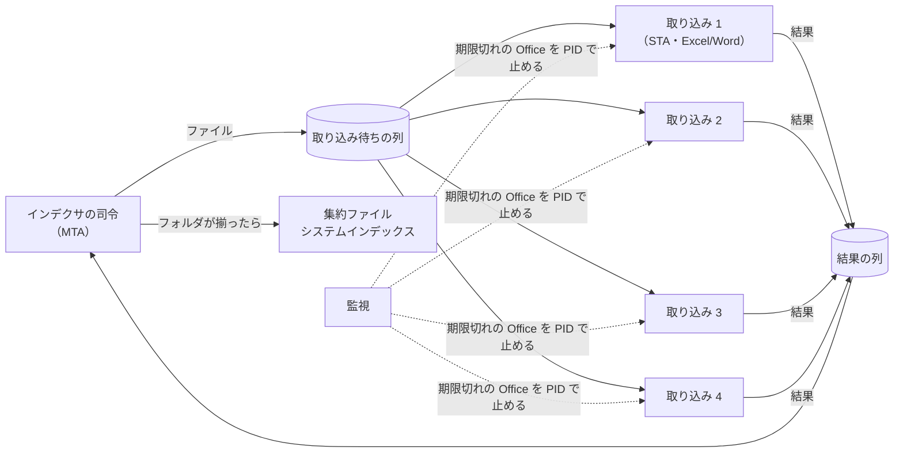
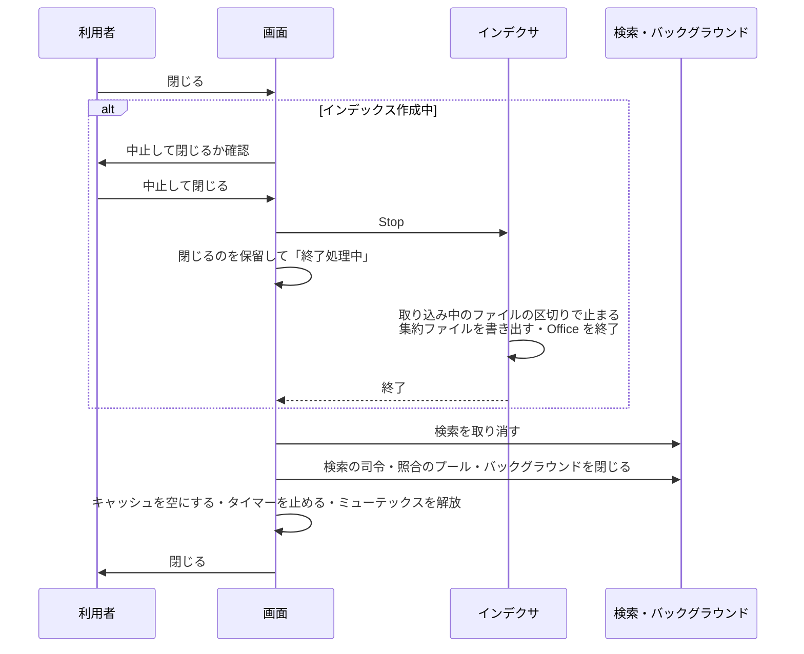

# tebunko_grep 設計書（プロセスとスレッド）

本書は [00_index.md](00_index.md) の一部である。章・節の番号は 00_index.md と分割した各ファイルで通し番号とし、各章がどのファイルにあるかは [00_index.md](00_index.md#ドキュメント構成) の表のとおり。

本書は、tebunko_grep がどのプロセス・スレッドで動き、それぞれをいつ作っていつ片づけるかをまとめる。検索・インデックス作成・画面の処理を足すときは、ここの決まりに合わせる。

| 知りたいこと | 節 |
|---|---|
| プロセスをどう分けているか | [7.1](#71-プロセス) |
| どのスレッドが何をするか・優先度・STA と MTA | [7.2](#72-スレッドの一覧) |
| いつ作っていつ片づけるか | [7.3](#73-寿命) |
| インデックス作成の並列化 | [7.4](#74-インデックス作成の並列化) |
| 画面とインデクサの受け渡し | [7.5](#75-画面とインデクサの受け渡し) |
| 閉じるときの順番 | [7.6](#76-閉じるときの順番) |
| GC で画面を止めないための決まり | [7.7](#77-gc-とメモリ) |
| クラスを使ってよいところ | [7.8](#78-クラスと関数の使い分け) |

---

## 7. プロセスとスレッド

### 7.1 プロセス

- **画面のプロセス 1 つで動く。** 検索・インデックス作成・画面の裏の読み込みは、どれも画面のプロセスの中のスレッドで行う。
- **別のプロセスになるのは Office（Excel・Word・PowerPoint）だけ。** COM で操作するアプリは、COM の仕組みで別のプロセスとして動く。
- **画面を閉じたら何も残さない。** インデックス作成中に閉じるときは、作成を中止してから閉じる（[7.6](#76-閉じるときの順番)）。作成を続けたまま画面だけを閉じることはできない。
- `indexer.ps1` は、画面を使わずにインデックスを作る入口として残す（`-RetryFailed`）。中身は画面から使うものと同じ関数（`invokeIndexer`）で、コンソールのプロセスの中で同じスレッドの構成で動く。

分けない理由は、閉じるときに後始末を確実にするためと、受け渡しをファイルで行わずに済ませるためである。スレッドにすると GC で画面が止まるおそれがあるが、実測では画面の止まりが増えなかった（[7.7](#77-gc-とメモリ)）。

### 7.2 スレッドの一覧

| スレッド | 数 | 寿命 | アパートメント | 優先度 | 役目 |
|---|---|---|---|---|---|
| 画面 | 1 | アプリ | STA | Normal | 表示と操作の受け付けだけ。ファイルの読み込みなどの重い処理はしない |
| 検索の司令 | 1 | アプリ | MTA | Normal | 検索の要求を待ち、候補を集め、照合を照合のプールに配り、結果を画面へ渡す |
| 照合のプール | コア数 − 1（1〜4） | アプリ | MTA | Normal | 集約ファイルを読み、正規表現で照合する |
| バックグラウンド | 1 | アプリ | MTA | Normal | 画面から頼まれる短い仕事（プレビューの読み込み・状態の読み直し・プロセスの一覧など） |
| インデクサの司令 | 1 | インデックス作成 1 回 | MTA | BelowNormal | クロール・確認・取り込みの振り分け・取り込み一覧・集約ファイルとシステムインデックスの書き出し |
| 取り込み | コア数 − 1（1〜4。設定で変えられる） | インデックス作成 1 回 | STA | BelowNormal | 1 ファイルずつ Office から TSV に取り込む。スレッドごとに自分の Office を持つ |
| 監視 | 1 | インデックス作成 1 回 | MTA | Normal | 取り込みスレッドごとの制限時間を見て、過ぎたスレッドの Office だけを PID で止める |
| システムインデックスのプール | 最大 4 | インデックス作成 1 回 | MTA | BelowNormal | フォルダごとのシステムインデックスを作る |

**優先度の決まり。** 利用者が結果を待つもの（画面・検索・バックグラウンド）は Normal にする。インデックス作成のものは BelowNormal にし、インデックス作成中も検索を先に動かす。監視は、固まった Office を止める役目のため Normal のままにする。

- 優先度は、プロセス全体（`PriorityClass`）ではなくスレッドごと（`Thread.Priority`）に下げる。プロセス全体を下げると画面も下がるため。
- 取り込みスレッドが起動した Office のプロセスも BelowNormal にする。COM の処理は Office のプロセスの中で動くため、スレッドの優先度だけでは下がらない。

**STA と MTA の使い分け。**

- STA（シングルスレッド アパートメント）では、そのスレッドで作った COM の部品を、そのスレッドだけで呼ぶ。Office の COM と WPF の画面はこれが前提になっている。
- MTA（マルチスレッド アパートメント）は、どのスレッドからでも呼べる。PowerShell のランスペースの既定である。
- Office の COM に触るスレッド（画面・取り込み）だけを STA にし、それ以外は MTA にする。STA のスレッドが長く待つと、そのスレッドの COM の部品への呼び出しが止まるため、必要なところに絞る。
- COM の部品はスレッドの間で渡さない。作ったスレッドで使い、同じスレッドで片づける。
- 画面のスレッドで COM を使うのは、利用者の Excel に「開いて」と頼む短い呼び出し（[元のファイルを開く](03_画面_2_検索タブ_1_元のファイルを開く.md)）だけにする。

### 7.3 寿命

スレッドやランスペースは、作っては捨てるのをやめ、次の 4 つの寿命のどれかに属させる。

| 寿命 | 始まり | 終わり | 属するもの |
|---|---|---|---|
| アプリ | 画面を開く | 画面を閉じる | 検索の司令・照合のプール・バックグラウンド・読んだ内容のキャッシュ |
| インデックス作成 1 回 | ［インデックス作成を開始］ | 完了・中止・エラー | インデクサの司令・取り込み・監視・システムインデックスのプール・Office |
| 検索の要求 1 回 | 検索の開始 | 結果の受け渡しの完了・取り消し | 要求（語・条件・取り消しの札）と結果の列だけ。スレッドは作らない |
| 読んだ内容 | 集約ファイルを読む | キャッシュの予算を超えて追い出される・ファイルが変わる | 集約ファイルの内容（[7.7](#77-gc-とメモリ)） |

- アプリの寿命のスレッドは、最初に使うときに作る。ランスペースには、はじめに一度だけ関数を読み込む。検索のたびに lib.ps1 を読み込み直さない。
- 照合のプールでは、ランスペースに加えて PowerShell のインスタンスも使い回す。
- 検索の要求には取り消しの札（`CancellationTokenSource`）を付ける。新しい要求を出すと、前の要求は取り消される。

### 7.4 インデックス作成の並列化

インデクサの司令が取り込み対象を並べ、取り込みスレッドに 1 ファイルずつ渡す。取り込みスレッドは結果（成功・失敗・TSV の場所）を返し、書き出しは司令がまとめて行う。

- **Office はスレッドごとに持つ。** Excel と Word は、取り込みスレッドごとに別のプロセスを起動する。
- **PowerPoint は同時に 1 スレッドだけ。** PowerPoint は 1 つのプロセスしか持てない。旧形式（`.ppt`）を COM で変換するスレッドは、ロックで 1 つに絞る。
- **COM を使わない形式は同時に動いてよい。** `.docx`・`.pptx` は COM を使わずに読む。
- **Office の起動は 1 つずつ行う。** 起動した Office の PID は、起動の前後のプロセスの一覧の差で調べる。同時に起動すると取り違えるため、起動をプロセス全体のロックで 1 つずつにする。
- **Office の起動し直しと制限時間は、スレッドごとに数える。** 100 ファイルごとに起動し直す。1 ファイルの制限時間は 10 分。
- **一時フォルダはスレッドごとに分ける。**
- **集約ファイルはフォルダが揃ってから書く。** 取り込み対象はフォルダの順に渡す。司令は、フォルダの中の全ファイルの結果が揃ったところで、そのフォルダの集約ファイルとシステムインデックスを書き出す。
- **取り込み一覧と進み具合は司令だけが書く。**
- **取り込み中のファイルは、スレッドの数だけ記録する**（`取り込み中.txt`）。強制終了の後は、記録にあるファイルすべてを「前回止まったファイル」として扱う。
- **中止。** 司令は振り分けをやめ、取り込み中のファイルが終わるのを待ってから、書き出しと Office の片づけを行う。

取り込みスレッドの数は、コア数 − 1（1〜4）を既定とし、設定で 1〜4 に変えられる。Excel を 4 つ同時に動かすとメモリを多く使う。メモリの少ない PC では数を減らす。

### 7.5 画面とインデクサの受け渡し

画面とインデクサは、同じプロセスのメモリ上の受け渡しの口（`[hashtable]::Synchronized`）でやり取りする。ファイルでの受け渡しとポーリングは行わない。

| 項目 | 書く側 | 読む側 | 内容 |
|---|---|---|---|
| Progress | インデクサの司令 | 画面 | 段階・処理済み・残り・失敗・詳細 |
| Stop | 画面 | インデクサ | 中止の要求 |
| Plan・Approval | インデクサ → 画面 → インデクサ | 両方 | 取り込み予定と、利用者の返事（`ManualResetEvent` で待つ） |
| Error・ExitCode | インデクサ | 画面 | 続けられないエラーの内容と、終了コード（0 完了・1 エラー・2 中止） |

ファイルに残すのは次のものだけである。

- `取り込み一覧.tsv`
- `取り込み中.txt`（強制終了からの再開）
- `インデックス作成ログ.txt`（ログの関数で書く）

インデクサのミューテックス（画面と `indexer.ps1` が同時に作らないため）は、インデクサの司令のスレッドで取得し、同じスレッドで解放する。

### 7.6 閉じるときの順番

- Office が固まってインデクサが戻らないときは、監視が制限時間で Office を止める。画面は 60 秒待っても終わらなければ、インデクサが起動した Office を PID で止めて閉じる。
- 止めるのは、インデクサが起動して PID を記録した Office だけである。利用者が開いていた Office は止めない。

### 7.7 GC とメモリ

スレッドは同じプロセスのヒープを使うため、インデクサや検索が大量にメモリを使うと、GC で画面のスレッドも止まる。

実測（画面の代わりに 5ms ごとに起きるスレッドを動かし、遅れを測った。ヒープ 300MB、20 秒）では、次のとおりだった。

| 負荷 | 遅れの最大 | 50ms を超えた回数 |
|---|---|---|
| なし | 27.0ms | 0 |
| 同じプロセスのスレッドで集約ファイルの読み書き | 45.0ms | 0 |
| 別のプロセスで同じ負荷 | 18.8ms | 0 |
| 同じプロセス＋`SustainedLowLatency` | 33.2ms | 0 |

Windows のタイマーの刻み（約 15.6ms）を考えると、どれも画面の操作で気づく止まりではない。そのうえで、次を守る。

- 起動時に `GCSettings.LatencyMode` を `SustainedLowLatency` にする（重い全体の GC を後回しにする）。
- 読んだ内容のキャッシュに予算（文字数）を決め、超えたら使われていないものから追い出す。追い出しは検索の司令のスレッドで、検索の後に行う。
- 画面のスレッドで大きな文字列を作らない。プレビューの読み込みはバックグラウンドのスレッドで行い、表示する分だけを受け取る。
- 検索の結果は、時間で区切って少しずつ画面に移す（今の `pumpSearch`）。

実装を変えたときは、画面の心拍（画面のスレッドの `DispatcherTimer` の遅れ）を、インデックス作成と検索を同時に動かして測る。100ms を超える止まりが出るようなら、インデクサだけを別のプロセスに戻すことを検討する。

### 7.8 クラスと関数の使い分け

PowerShell 5.1 のクラスのメソッドは、クラスを定義したランスペースで動く（別のスレッドから呼んでも、定義したランスペースに戻って実行される）。このため次のように使い分ける。

- **クラスにしてよいもの**: 画面のスレッドだけから呼ぶ持ち主のオブジェクト。スレッドやプールの寿命を持つ。
  - `WorkerPool`: ランスペースのプールと PowerShell のインスタンスを貸し借りする
  - `SearchService`: 検索の司令のスレッドと、要求・結果の列を持つ
  - `BackgroundQueue`: バックグラウンドのスレッドに仕事を渡し、結果を画面に返す
  - `IndexingSession`: インデックス作成 1 回分のスレッドと受け渡しの口を持つ
- **クラスにしないもの**: スレッドをまたいで使うもの（受け渡しの口・キャッシュ・結果）。.NET のコレクション（`ConcurrentQueue`・`ConcurrentDictionary`・`[hashtable]::Synchronized` など）と関数で作る。
- 持ち主のクラスは `Open`（または最初の使用）でスレッドを作り、`Close` で止めて片づける。`Close` は何度呼んでもよい。
