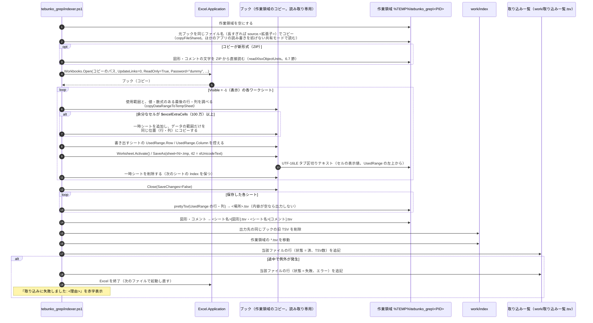
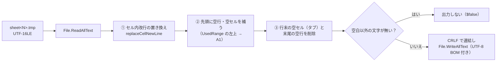

# インデックス作成（インデクサ）設計書 ― Excel

本書は [01_インデックス作成.md](01_インデックス作成.md) の一部である。章・節の番号は 01_インデックス作成.md と分割した各ファイルで通し番号とし、各章がどのファイルにあるかは [01_インデックス作成.md](01_インデックス作成.md#ファイル構成) の表のとおり。

---

## 4.3 Excel の抽出処理（`extractWorkbook`）



補足:

- Excel は `Visible` / `DisplayAlerts` / `EnableEvents` / `ScreenUpdating` / `AskToUpdateLinks` を無効にし、`AutomationSecurity = 3`（マクロ無効）で起動する。
- パスワード付きブックはダミーのパスワードを渡して開くため、ダイアログを出さずに例外となり、取り込み一覧に「失敗」と記録される。
- **元のファイルを占有しない**: 元のブックは開かず、常に作業領域へコピーしてからコピーを開く。Excel で開いている間（大きなブックでは数分）、元のファイルを利用者が上書き保存・移動・削除できなくなるのを防ぐため。コピーは `copyFileShared`（`tebunko_grep/lib.ps1`）で行い、元のファイルを読み取りだけ・共有モード `ReadWrite | Delete` で開く。`File.Copy` と違い、コピー中もほかのアプリ・利用者の書き込みを妨げず、利用者が編集中（書き込みで開いている）のファイルもコピーできる。コピーは通常の属性（読み取り専用を付けない）で作り、ブックを閉じた後に削除する。
- コピーのファイル名は、ファイル名を参照する数式（`CELL("filename")` 等）の表示値が変わらないよう元のブック名と同じにする。Excel は長いパスのファイルを開けない（Microsoft 365 で約 256 文字以上、古い版は 218 文字以上。`\\?\` 付きのパスも不可。いずれも実測では「Workbooks クラスの Open プロパティを取得できません」）ため、作業領域＋ブック名が `$excelMaxPath`（218）文字以上になるときだけ `source.<拡張子>` とする。元のパスが長いファイルも、コピーは短いパスになるため開ける。TSV のファイル名は元のブック名で作る。
- 取り込み中に元のファイルが更新された場合も、抽出はコピー時点の内容で行う。取り込み一覧の更新日時はクロール時点の値を記録するため、次回の取り込みで更新ありとして取り込み直す。
- 対象は `Worksheets`（グラフシートは含まない）のうち `Visible = -1`（`xlSheetVisible`）のシート。`0`（非表示）と `2`（完全に非表示）は除外する。
- Excel は `[` `]` を含むパスに保存できないため、いったん `sheet<シート番号>.tmp` で保存し、`prettyTsv` で最終的なファイル名に書き出す。保存したファイルはブックを閉じるまで Excel がロックするため、整形はブックを閉じた後に行う。
- Excel のテキスト保存は、セルの値そのものではなく **画面に表示されている形（表示値）** を出力する。文字列のセルは入力した文字がそのまま出る（1 セルの上限 32,767 文字まで欠けない。セル内改行・`"` を含むセルも保持される）が、**数値のセルは表示形式に従った文字になる**。列幅が狭く `####` と表示されるセルは、`####` ではなく値が出る。
  - 表示形式が「標準」の数値は 11 文字までで表され、12 桁以上の数値は指数表記になる（`4901234567894` → `4.90123E+12`、`123456789.123` → `123456789.1`）。JAN コード・伝票番号などを数値として入力したセルは、**その番号では検索できない**（[02_検索.md 4.1 節](02_検索.md#41-検索仕様)、7.1 節 No.13）。
  - 「0」「#,##0」などの表示形式を設定したセルや、文字列として入力したセルは、見たとおりの文字で出る（`#,##0` なら桁区切り付きで `1,234,568`）。
- **使用範囲が膨らんだシートは、データの範囲だけを一時シートへコピーしてから書き出す**（`copyDataRangeToTempSheet`）。最終行（1,048,576 行目）や右端（XFD 列）のセルに書式だけが残っていると使用範囲がシート全体になり、Excel のテキスト保存が空セルのタブだけを延々と書き出す（実測: 10 分で 6GB を書き出し、終わらない → 制限時間で「失敗」）。
  - 値・数式のある最後の行・列を `Cells.Find("*", A1, xlFormulas, , xlByRows/xlByColumns, xlPrevious)` で調べ、使用範囲がそれより `$excelExtraCells`（100 万）セル以上広いときだけ縮める（普通のシートは今までどおり、そのまま書き出す）。
  - **元のシートの行・列は削除しない**。削除すると、その範囲だけを参照する数式が `#REF!` になり、ほかのシートの表示値まで変わるため。同じブックに一時シートを追加し、**同じ位置（行・列）に**コピーするので、数式の参照先はずれない（実測: `=COUNTA(A200:A300)` は `0` のまま、別シート参照・表示形式も保たれる）。
  - ブックの構成が保護されているなど、一時シートを作れない場合は元のシートをそのまま書き出し、`    <シート名> の使用範囲を縮められませんでした: <メッセージ>` をインデックス作成ログに記録する（[01_インデックス作成_8_エラーメッセージ一覧.md](01_インデックス作成_8_エラーメッセージ一覧.md) 4.8.3）。
  - 一時シートは書き出した直後に削除する（次のシートの `Index` がずれないようにするため。ブックは保存せずに閉じる）。
  - 実測: データ 50 行 × 4 列＋右端と最終行に書式のあるシートが、6GB・終わらない → **2.2KB・1 秒未満**で取り込めるようになった。
- Excel のテキスト保存は A1 からではなく **使用範囲（`UsedRange`）の左上のセルから** 出力する（例: 使用範囲が C3 から始まるシートは、1 行目の 1 列目が C3 になる）。TSV の行・列をシートの行・列と一致させるため、保存前に `UsedRange.Row` / `UsedRange.Column` を控えて `prettyTsv` に渡す（6.3 節）。
- 出力先の旧 TSV を削除してから移動するため、シートの削除・名前変更がインデックスに反映される（Word・PowerPoint も同じ）。
- テキスト保存はセルの値しか出さないため、**図形・コメントの文字は、コピーを ZIP として直接読む**（6.7 節）。Excel で開く前に読む。旧形式（`.xls`）・パスワード付き・`.xlsb` は読まない（セルの値だけになる）。読み取りに失敗しても（ZIP が壊れている等）セルの値は取り込み、`    図形・コメントを読み取れませんでした: <メッセージ>` をインデックス作成ログに記録する。

---

## 6.3 TSV 整形仕様（`prettyTsv` / `formatTsv`）



1. **セル内改行の置き換え**: Excel はセル内改行・`"` を含むセルを `"` で囲んで出力する。正規表現 `"[^"]*"` にマッチする範囲の改行（CRLF・CR・LF。いずれも 1 つの改行として扱う）を **U+2028（LINE SEPARATOR。`$cellNewLine`）** に置き換え、1 セルを 1 行に収める。`Select-String` は U+2028 を行区切りとしないため、1 行 = Excel の 1 行が保たれる。検索結果の出力時に LF へ戻す（[02_検索.md](02_検索.md) 5.1 節）。
2. **先頭の空行・空セルの補完**: 引数 `firstRow` / `firstColumn`（使用範囲の左上の行・列番号。既定 1）に合わせて、先頭に `firstRow - 1` 行の空行を加え、各行の先頭に `firstColumn - 1` 個のタブを加える。
3. **行末の空セル・末尾の空行の削除**: 各行の末尾のタブ（空セル）だけを削除する（セル値の末尾の空白は残す）。途中の空行・空白だけの行は、行番号を保つため**残す**。末尾の空白だけの行は削除する。

整形後の TSV は「**N 行目 = シートの N 行目、k 列目 = シートの k 列目**、セルはタブ区切り、セル内改行は U+2028、改行 CRLF」となる。検索では `Select-String` の行番号がそのままシートの行番号になる。

入出力例（`\t` = タブ、`\r\n` = CRLF、`<LS>` = U+2028。使用範囲の左上が B2 の場合）:

```
入力:  a\tb\t\t\r\n\t\t\r\n\r\n"x\ny"\tz\r\n\t\r\n
出力:  \r\n\ta\tb\r\n\r\n\r\n\t"x<LS>y"\tz\r\n
```

---

## 6.7 Excel の図形・コメントの読み取り（`readXlsxObjectUnits`）

`.xlsx` `.xlsm` を ZIP として開き（`scripts/shared/office/office_reader.ps1`）、表示シートの図形とコメントの文字を、シートとは別の場所（TSV）にする。Excel は使わない。

| 場所 | 読み取り元 | 1 行 |
|---|---|---|
| `<シート名>[図形]` | シートのリレーションシップ（種類 `drawing`）が指す `xl/drawings/drawingN.xml` の図形（`xdr:twoCellAnchor` `oneCellAnchor` `absoluteAnchor`）ごとのテキスト（`a:p`。6.4 節の `readXmlLines`） | 図形 1 つ。`<左上のセル番地><TAB><文字>` |
| `<シート名>[コメント]` | 種類 `comments` の `xl/commentsN.xml`（メモ）と、種類 `threadedComment` の `xl/threadedComments/*.xml`（スレッド形式のコメント） | セル 1 つ。`<セル番地><TAB><文字>` |

- **場所の名前**: シート名には `[` `]` を使えないため、`売上[図形]` は実在のシートと必ず区別できる（`売上（図形）` のような名前だと、同じ名前のシートとぶつかる）。
- **文字の形**: 段落・改行はセル内改行（U+2028）にし、改行・`"`・タブを含むときは `"` で囲む（中の `"` は `""`）。Excel のテキスト保存のセルと同じ形なので、検索結果の出力・画面のセルの分け方はセルと同じ処理で扱える。
- **並び順**: 上の行から（同じ行は左から）。図形は左上のセル、コメントはそのセルの位置で並べる。
- **セル番地**: 検索結果の「セル」に出し、元のファイルを開くときにそのセルを選ぶ（[03_画面_2_検索タブ_1_元のファイルを開く.md](03_画面_2_検索タブ_1_元のファイルを開く.md) 4.5）。位置をセルで持たない図形（`absoluteAnchor`）は `A1` とする。
- グループ化した図形は、まとめて 1 つの図形（1 行）とする。互換用の代替表示（`mc:Fallback`）は読まない。文字の無い図形（画像・グラフの枠）は出さない。
- スレッド形式のコメントがあるセルは、その文字（返信を含む）を使い、同じセルのメモは読まない（古い版の Excel 向けの案内文とコメントが重複して入っているため）。
- コメントのふりがな（`rPh`）と作成者名（`authors`）は読まない（メモに Excel が付けた「作成者名:」は本文の一部として読む）。
- 非表示・完全に非表示のシート（`state` が `hidden` `veryHidden`）とグラフシートは、セルと同じく読まない。
- 読まないもの: グラフ内の文字、SmartArt、フォームコントロール・ActiveX コントロールの文字、ヘッダー・フッター、ハイパーリンクの URL、入力規則のメッセージ。

TSV の例（シート `見積` の F2 に左上があるテキストボックスと、C2 のコメント）:

```
work/index/営業/見積.xlsx/見積.tsv            … セルの値（4.3 節）
work/index/営業/見積.xlsx/見積[図形].tsv      … F2<TAB>納期は別途ご相談
work/index/営業/見積.xlsx/見積[コメント].tsv  … C2<TAB>"test:<U+2028>税抜の金額"
```

- 読み取る内容を増やしたため、前の版で取り込んだブックは、更新が無くても次のインデックス作成で取り込み直す（取り込み一覧の「抽出版」。[01_インデックス作成_4_メインフローと取り込み一覧.md](01_インデックス作成_4_メインフローと取り込み一覧.md) 4.2）。
