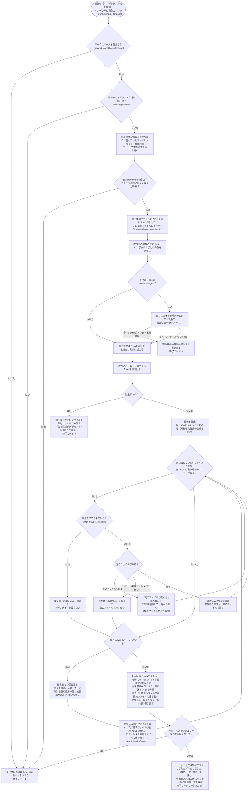
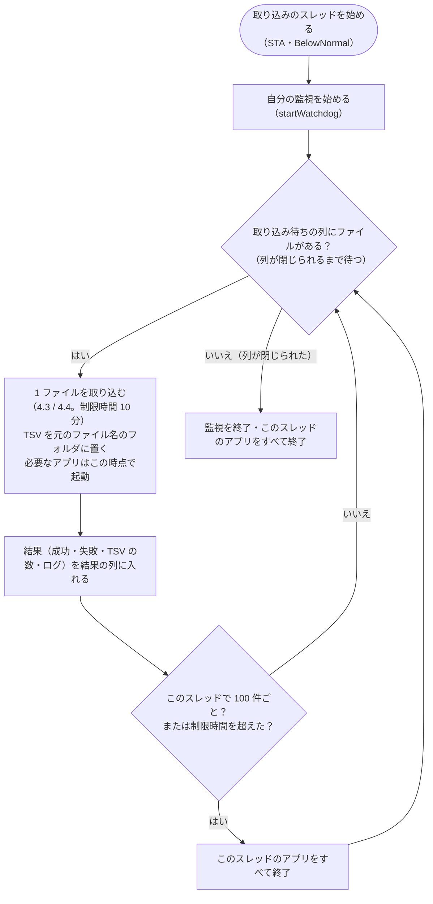

# インデックス作成（インデクサ）設計書 ― メインフローと取り込み一覧

本書は [01_インデックス作成.md](01_インデックス作成.md) の一部である。章・節の番号は 01_インデックス作成.md と分割した各ファイルで通し番号とし、各章がどのファイルにあるかは [01_インデックス作成.md](01_インデックス作成.md#ファイル構成) の表のとおり。

インデクサの起動から終了までの流れ（4.1）と、差分取り込み・中止・強制終了からの再開を支える取り込み一覧（4.2）を扱う。

---

## 4. 処理フロー

### 4.1 メインフロー

インデックス作成の本体は `invokeIndexer`（`indexer/indexer_run.ps1`）である。画面は自分のプロセスのスレッド（インデクサの司令。`IndexingSession`）で `indexer.ps1 -Channel` を実行し、`indexer.ps1` は `invokeIndexer` を呼ぶだけである。1 ファイルの取り込みは、取り込みのスレッドが並べて行う（[7.4](00_共通_4_プロセスとスレッド.md#74-インデックス作成の並列化)）。



取り込みのスレッドの中では、1 ファイルずつ次を行う。



- 利用者の入力を待つ処理（`pause`・`Read-Host`）は無い。画面は受け渡しの口（`newIndexerChannel`）から進み具合を読んで表示する（[03_画面_1_インデックス管理タブ.md](03_画面_1_インデックス管理タブ.md)）。
- インデクサは `exit` を使わず、終了コードを返す（`invokeIndexer`。画面のプロセスの中で動くため）。終了コードは受け渡しの口の `ExitCode` にも最後に入れる。画面は `ExitCode` が入ったら終わったとみなす。
- Excel・Word は取り込みのスレッドごとに必要になったときに起動し、そのスレッドで使い回す。スレッドごとに 100 ファイルで、および取り込み失敗時（失敗したファイルのアプリのみ）に終了し、次に必要になったときに起動し直す（メモリ肥大化・不安定化の対策）。PowerPoint は 1 つのプロセスしか持てないため、取り込みのスレッドの間で共有し、一度起動したら最後まで使い回す。使用中なら後回しにしてほかのファイルを先に取り込む（[5 章](01_インデックス作成_6_共通処理とアプリ管理.md#5-office-アプリexcelwordpowerpointの管理)）。
- 取り込み一覧・進み具合・ログ・集約ファイルとシステムインデックスは、司令だけが書く。取り込みのスレッドは結果を返すだけである。
- **中止**: 画面の［中止］で受け渡しの口の `Stop` が立つと、司令は次のファイルを渡さず、取り込み中のファイルが終わるのを待つ。取り込み中のファイルは最後まで取り込んでから止まる。その後 `finally` で取り込みのスレッドの終了（アプリの終了）・作業領域の削除・集約ファイルへの書き出し・取り込み一覧の書き直しを行って終了コード 2 で終わる。残りのファイルは取り込み一覧で「未取り込み」のまま残り、次回取り込まれる。
- **強制終了**: PC の停止・プロセスの強制終了などで止まった場合は `finally` が実行されないが、取り込み一覧には 1 件ごとに結果を追記しているため、次回は未取り込みのファイルから再開する。強制終了したときに取り込んでいたファイル（取り込みのスレッドの数だけ）は `work/取り込み中.txt` に残り、次回は最後に回す（4.2）。取り込んでいたファイルのインデックスは、TSV を `work/取り込み出力/<PID>/w<番号>` に集めてからフォルダごと入れ替えるため（`publishIndexFiles`）、「前回のインデックスがそのまま」か「今回の分がそろった状態」のどちらかになり、一部のシートだけが入ったインデックスは残らない。集約ファイルに書き出していない TSV は、次回のインデックス作成の始めに書き出す（[01_インデックス作成_7](01_インデックス作成_7_出力TSVと既知の問題.md#61-配置命名規則) 6.1「集約ファイルへの書き出し」）。
- **二重に動かさない**: 同じ `work` のインデックス作成は 1 つだけ動かす（`newAppMutex "indexer"`。鍵は `work` のパスから作る）。ミューテックスは司令のスレッドで取り、同じスレッドで放す。ログはミューテックスを取ってから開く（動いているインデックス作成のログを消さないため）。画面は自分が始めたインデックス作成の間は［インデックス作成を開始］を押せないため、ここで止まるのは画面を使わずに起動したものと重なった場合である。既に動いていれば `ほかのインデックス作成が実行中です。インデックス作成が終わってから実行してください。` として終了コード 1 で終わる。取り込み一覧・インデックスを 2 つが同時に書き換えると、状態が食い違うため。ミューテックスはプロセスが終われば解放されるため、強制終了しても残らない。
- **取り込みの直前に元のファイルが無くなった**: 取り込み対象を調べてから実際に取り込むまでの間に、元のファイルが移動・削除されることがある。「失敗」として記録すると、利用者が再取り込みを選ぶまで残ってしまうため、取り込まずに TSV を削除して取り込み一覧から除き、集約ファイルからも外す（`元のファイルが無くなったため、取り込まずに一覧から除きます。`）。次回のクロールでも見つからないため、結果は同じになる。
- **インデックス作成中にクロール対象フォルダごと見えなくなった**: ネットワークの切断・USB メモリの取り外しなどでクロール対象フォルダにアクセスできなくなった場合、そのまま続けると残りのファイルがすべて「失敗」になり、次に再取り込みを選ぶまでインデックスに入らない。そのため、次のファイルを渡すのをやめ、取り込み中のファイルが終わるのを待ってから、残りを「未取り込み」のまま中止し、受け渡しの口の `Error` にメッセージを入れて終了コード 1 で終わる（`finally` は通るため、アプリの終了・取り込み一覧の書き直しは行う）。フォルダを使えるようにしてからインデックス作成を始めると、続きから取り込む。
- **続けられないエラー**: 捕まえていない例外（クロール対象フォルダが無い・チェックの付いたフォルダが無い・設定ファイルを読み込めない・取り込みのスレッドが止まった等）は `invokeIndexer` が受け、メッセージをログと受け渡しの口の `Error` に入れて終了コード 1 で終わる。画面がこのメッセージを表示する。
- **進み具合の受け渡し**: 司令は進み具合（段階・処理済み・残り・失敗・いま行っていること）を受け渡しの口の `Progress` に入れ（`writeIndexingProgress`）、画面は 1 秒ごとに読む（`readIndexingProgress`。[03_画面_1](03_画面_1_インデックス管理タブ.md)）。書くのは「ファイルを取り込みのスレッドに渡すとき」「結果を受け取ったとき」「段階が変わるとき」である。
  - 取り込み一覧（数万行になる）を画面が毎秒読み直すと、1 回に数秒かかって画面が固まる（5 万行で約 5.8 秒）ため、進み具合は取り込み一覧と分けている。
  - 段階は `クロール`（取り込み対象を探している。件数はまだ分からない）・`確認`（数え終えて、画面で取り込むかどうかを選ぶのを待っている）・`取り込み`（ファイルを取り込んでいる）・`仕上げ`（Office アプリの終了・集約ファイルへの書き出し・取り込み一覧の書き直し）。**待ち時間が長くなりがちな「クロール」「仕上げ」でも、何をしているか**（どのフォルダをクロールしているか・取り込み一覧を書き直しているか）**を書く**。
  - インデックス作成が終わっても消さない（画面が終わり方（成功・失敗の件数）を読むため）。
- **取り込み前の確認**（受け渡しの口の `ConfirmTargets`。画面から実行したとき）: 取り込み対象を数え終えたところで、インデックスごとの件数を受け渡しの口の `Plan` に入れ、段階を `確認` にして画面の返事を待つ（`waitForIndexingApproval`。`Answered` で待つ）。画面が取り込む返事（`answerIndexingPlan`。`@{RetryFailed}`）を渡せばインデックス作成を始め（`RetryFailed` なら、前回失敗したファイルも対象に加える）、取りやめ（`$null`）か中止（`Stop`）なら 1 件も取り込まずに終了コード 2 で終わる。60 分待っても返事が無ければ取りやめる（画面が返事をしないまま待ち続けないため）。待ち終えたら `Plan` を外す。
  - 取りやめたときは、**取り込み一覧を前回の内容のまま書き直す**（今回の取り込み対象は記録しない）。「未取り込み」で記録すると、画面の表示が［続きから再開］になり、インデックス作成を中断したように見えるため。一方で、以前の形式からの移行・元ファイルが無くなった分の削除は済んでいるため、取り込み一覧そのものは書き直す。
- **ログ**: 表示内容は `writeIndexerLog` で `work/インデックス作成ログ.txt`（UTF-8 BOM 付き）に書く（実行ごとに上書き）。取り込みのスレッドは 1 ファイル分のログを貯めて結果と一緒に返し、司令が書く（ファイルの順に並ぶ）。画面を使わずに実行したときはコンソールにも出す。問題が起きたときはこのログで確認する。
- **以前の版のファイル**: 以前の版は画面とのやり取りをファイル（`インデックス作成中止要求`・`インデックス作成エラー.txt`・`インデックス作成進捗.txt`・`取り込み予定.tsv`・`インデックス作成開始要求`）で行っていた。残っていれば、始めるときに消す。

### 4.2 取り込み一覧と取り込み対象の決定（差分・中断・再試行）

#### 取り込み一覧 `work/取り込み一覧.tsv`

クロール対象フォルダ配下の Office ファイルを 1 ファイル 1 行で記録する。UTF-8（BOM 付き）・タブ区切りで、Excel でそのまま開ける。

```
クロール対象フォルダ	C:\data\営業	営業
クロール対象フォルダ	D:\old\2019年度	2019年度
相対パス	更新日時	サイズ	状態	TSV数	取り込み日時	エラー	抽出版
営業\2024\見積\A社.xlsx	2025/01/10 12:34:56	10420	済	3	2026/09/19 10:00:35		2
営業\空ブック.xlsx	2025/01/10 12:34:56	8578	済	0	2026/09/19 10:00:35		2
営業\秘密.xlsx	2025/01/10 12:34:56	15360	失敗		2026/09/19 10:00:40	読み取りパスワードが設定されているため開けません（パスワード付きのファイルは取り込めません）	
2019年度\新規.docx	2026/09/18 09:00:00	20480	未取り込み				
```

| 列 | 内容 |
|---|---|
| 先頭の行 | `クロール対象フォルダ<TAB><パス><TAB><インデックス名>`。クロール対象フォルダ（チェックなしを含む）ごとに 1 行。以前の形式（`クロール対象フォルダ<TAB><パス>` の 1 行だけ）も読める |
| 相対パス | `<インデックス名>\<クロール対象フォルダからの相対パス>`（= `work/index` からの相対パス）。大文字・小文字は区別しない |
| 更新日時・サイズ | クロール時の元ファイルの更新日時（`yyyy/MM/dd HH:mm:ss`、`formatFileTime`）とバイト数。次回、これと比べて更新の有無を判定する |
| 状態 | `未取り込み`（取り込み待ち・中断）/ `済` / `失敗` |
| TSV数 | 作成した TSV の数（= 場所の数。`済` のとき）。内容が空のファイルは `0`。集約ファイルに入れた後も値はそのまま（集約する前の TSV が残っているときの確認に使う。[01_インデックス作成_5](01_インデックス作成_5_クロール.md#取り込み対象の決定createtargetlist)） |
| 取り込み日時 | 取り込んだ（または失敗した）日時 |
| エラー | 失敗の原因（`describeIngestError` で例外から作る。4.7。タブ・改行はスペースにする） |
| 抽出版 | 取り込んだ（`済`）ときの、その形式の読み取る内容の版（`getExtractVersion`。`indexer_decide.ps1` の `$extractVersions`）。今は `.xlsx` `.xlsm` `.docx` `.docm` `.doc` `.pptx` `.pptm` `.ppt` が 2（図形・コメント等を読む）、`.xls` `.xlsb` は 1。今の版より小さければ、更新が無くても取り込み直す（[01_インデックス作成_5](01_インデックス作成_5_クロール.md)）。空は 1 とみなす（この列が無い以前の形式の一覧も同じ） |

書き込み方（`writeStatusFile` / `addStatusRow` / `readStatusFile`）:

- クロールの後に全ファイルを書き出す（一時ファイル `取り込み一覧.tsv.tmp` に書いてから置き換える）。
- 見出しの行の列数で形式を見分ける。見出しが以前の形式（抽出版の列が無い 7 列）なら、その後の行を 7 列として読む。インデックス作成中の追記は、見出しを今の形式で書き直した後に行うため、1 つのファイルで形式が混ざることは無い。
- インデックス作成中は 1 件ごとに結果の行を**末尾に追記**する。読み込み時は同じ相対パスの後の行を優先するため、途中で中断しても取り込み済みの結果は失われない。列数の合わない行（書き込み途中で強制終了した行）は無視する。
- 終了時（`finally`）に 1 ファイル 1 行に書き直す。インデクサが強制終了された場合は追記した行が重複して残るが、次回のクロール時に書き直される。

#### 強制終了・時間切れからの再開

大量のファイルを取り込むと、Office アプリが応答しなくなるファイル（壊れたファイル・非常に大きいファイル・表示されないダイアログで止まる等）で止まることがある。COM の呼び出しは応答が無いと戻らず、画面の［中止］（ファイルの切れ目で止まる）も効かないため、次の 2 つで同じファイルで止まり続けないようにする。

| 仕組み | 内容 |
|---|---|
| 1 ファイルの制限時間（`$fileTimeoutMinutes` = 10 分） | 取り込みのスレッドごとに、別のスレッド（監視。`startWatchdog`）で制限時刻を監視する。制限時間を過ぎたら、そのスレッドが自分で起動した Office アプリ（`getApp` で PID を控えたもの。利用者のアプリ・ほかの取り込みのスレッドのアプリは除く）を強制終了する。COM の呼び出しが例外で戻るため、そのファイルは `失敗`（エラー: `10 分以内に取り込みが終わらなかったため中止しました（Officeアプリを強制終了しました）`）とし、次のファイルへ進む。強制終了したアプリはすべて終了扱いにし、次に必要になったときに起動し直す |
| 取り込み中のファイルの記録（`work/取り込み中.txt`） | 取り込み中のファイルを 1 行に 1 つ `<回数><TAB><相対パス>` で書く（`writeIngestingFiles`。取り込みを複数のスレッドで行うため、取り込み中のものすべて）。ファイルを取り込みのスレッドに渡す前に加え、結果を取り込み一覧に追記した後に除く。インデックス作成の終わりには、中止・続けられないエラーの場合も `finally` で削除する（`removeIngestingFile`。回数に数えない）。PC が停止した・プロセスが強制終了された等の場合だけ残る |

次回の実行時（取り込み対象の決定の後、`readIngestingFiles`）:

- `work/取り込み中.txt` のファイルは、**すべて**「前回止まったファイル」として扱う（どのファイルで止まったかは分からないため）。取り込み対象にあれば、取り込み対象の**最後に回す**（`前回、取り込み中に強制終了したファイルは最後に取り込みます: <相対パス>`）。他のファイルの取り込みが先に進む。最後に回したファイルは、取り込みを始めるまで記録を残す（その前にまた止まっても、回数が分かるように）。
- そのファイルの取り込みを始めるときは、回数を 1 増やして記録する。続けて `$interruptLimit`（2）回強制終了したファイルは、応答しなくなるファイルとみなして `失敗`（エラー: `取り込み中に 2 回続けて強制終了されたため、取り込みを中止しました（…）`）とし、取り込み対象から除く。以降は他の失敗と同じく、画面で「失敗分も再取り込みする」を選ぶ（`-RetryFailed`）か元ファイルが更新されたときに取り込み直す。
- 記録のファイルが取り込み対象に無い（取り込み済み・削除された等）場合は、記録を削除する。
