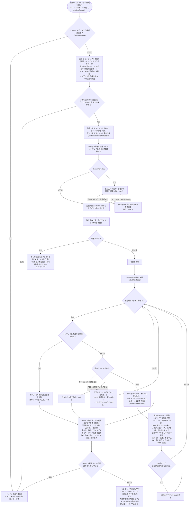

# インデックス作成（インデクサ）設計書 ― メインフローと取り込み一覧

本書は [01_インデックス作成.md](01_インデックス作成.md) の一部である。章・節の番号は 01_インデックス作成.md と分割した各ファイルで通し番号とし、各章がどのファイルにあるかは [01_インデックス作成.md](01_インデックス作成.md#ファイル構成) の表のとおり。

インデクサの起動から終了までの流れ（4.1）と、差分取り込み・中止・強制終了からの再開を支える取り込み一覧（4.2）を扱う。

---

## 4. 処理フロー

### 4.1 メインフロー



- 利用者の入力を待つ処理（`pause`・`Read-Host`）は無い。画面がウィンドウ無し（`-WindowStyle Hidden`）で起動し、下の「進み具合の受け渡し」のファイルを読んで進み具合を表示する（[03_画面_1_インデックス管理タブ.md](03_画面_1_インデックス管理タブ.md)）。
- Excel・Word・PowerPoint は必要になったときに起動し、1 プロセスを使い回す。100 ファイルごと、および取り込み失敗時（失敗したファイルのアプリのみ）に終了し、次に必要になったときに起動し直す（メモリ肥大化・不安定化の対策）。
- **中止**: 画面の［中止］で `work/インデックス作成中止要求` が作成されると、次のファイルに進む前にそれを見つけて削除し、`finally` でアプリの終了・作業領域の削除・まとめファイルへの書き出し・取り込み一覧の書き直しを行って終了コード 2 で終わる。取り込み中のファイルは最後まで取り込んでから止まる。残りのファイルは取り込み一覧で「未取り込み」のまま残り、次回取り込まれる。前回の実行で残った中止要求は開始時に削除する（開始直後に中止されないため）。
- **強制終了**: PC の停止・プロセスの強制終了などで止まった場合は `finally` が実行されないが、取り込み一覧には 1 件ごとに結果を追記しているため、次回は未取り込みのファイルから再開する。強制終了したときに取り込んでいたファイルは `work/取り込み中.txt` に残り、次回は最後に回す（4.2）。取り込んでいたファイルのインデックスは、TSV を `work/取り込み出力/<PID>` に集めてからフォルダごと入れ替えるため（`publishIndexFiles`）、「前回のインデックスがそのまま」か「今回の分がそろった状態」のどちらかになり、一部のシートだけが入ったインデックスは残らない。まとめファイルに書き出していない TSV は、次回のインデックス作成の始めに書き出す（[01_インデックス作成_7](01_インデックス作成_7_出力TSVと既知の問題.md#61-配置命名規則) 6.1「まとめファイルへの書き出し」）。
- **二重に動かさない**: 同じツール（配置フォルダ）のインデックス作成は 1 つだけ動かす（`newAppMutex "indexer"`）。画面は実行中のインデックス作成を見つけて進み具合を表示するため（[03_画面_1](03_画面_1_インデックス管理タブ.md)）、ここに来るのは画面を使わずに起動した場合。既に動いていれば `ほかのインデックス作成が実行中です。インデックス作成が終わってから実行してください。` として終了コード 1 で終わる。取り込み一覧・インデックスを 2 つのプロセスが同時に書き換えると、状態が食い違うため。ミューテックスはプロセスが終われば解放されるため、強制終了しても残らない。
- **取り込みの直前に元のファイルが無くなった**: 取り込み対象を調べてから実際に取り込むまでの間に、元のファイルが移動・削除されることがある。「失敗」として記録すると、利用者が再取り込みを選ぶまで残ってしまうため、取り込まずに TSV を削除して取り込み一覧から除き、まとめファイルからも外す（`元のファイルが無くなったため、取り込まずに一覧から除きます。`）。次回のクロールでも見つからないため、結果は同じになる。
- **インデックス作成中にクロール対象フォルダごと見えなくなった**: ネットワークの切断・USB メモリの取り外しなどでクロール対象フォルダにアクセスできなくなった場合、そのまま続けると残りのファイルがすべて「失敗」になり、次に再取り込みを選ぶまでインデックスに入らない。そのため、残りを「未取り込み」のまま中止し、`work/インデックス作成エラー.txt` にメッセージを書いて終了コード 1 で終わる（`finally` は通るため、アプリの終了・取り込み一覧の書き直しは行う）。フォルダを使えるようにしてからインデックス作成を始めると、続きから取り込む。
- **続けられないエラー**: 未捕捉の例外（クロール対象フォルダが無い・チェックの付いたフォルダが無い・設定ファイルを読み込めない等）は `trap` でメッセージを `work/インデックス作成エラー.txt`（UTF-8 BOM 付き）に書き、終了コード 1 で終わる。画面がこのメッセージを表示する。開始時に前回の `work/インデックス作成エラー.txt` を削除するため、正常に終わったときは残らない。
- **進み具合の受け渡し**: インデクサは進み具合を `work/インデックス作成進捗.txt` の 1 行（`<段階><TAB><処理済み><TAB><残り><TAB><失敗><TAB><いま行っていること>`。`writeIndexingProgress`）に書き、画面はこの 1 行だけを 1 秒ごとに読む（[03_画面_1](03_画面_1_インデックス管理タブ.md)）。書くのは「1 ファイルの取り込みを始めるとき」と「段階が変わるとき」だけで、インデックス作成の速さには影響しない（実測: 読み取り 1 件あたり約 1 ミリ秒）。
  - 取り込み一覧（数万行になる）を画面が毎秒読み直すと、1 回に数秒かかって画面が固まる（5 万行で約 5.8 秒）ため、進み具合を 1 行のファイルに分けている。
  - 段階は `クロール`（取り込み対象を探している。件数はまだ分からない）・`確認`（数え終えて、画面で取り込むかどうかを選ぶのを待っている）・`取り込み`（1 ファイルずつ取り込んでいる）・`仕上げ`（Office アプリの終了・まとめファイルへの書き出し・取り込み一覧の書き直し）。**待ち時間が長くなりがちな「クロール」「仕上げ」でも、何をしているか**（どのフォルダをクロールしているか・取り込み一覧を書き直しているか）**を書く**。
  - インデックス作成が終わっても消さない（画面が終わり方（成功・失敗の件数）を読むため）。次のインデックス作成の開始時に上書きする。
- **取り込み前の確認**（`-ConfirmTargets`。画面から起動したとき）: 取り込み対象を数え終えたところで、インデックスごとの件数を `work/取り込み予定.tsv` に書き、段階を `確認` にして画面の返事を待つ（`waitForIndexingApproval`）。画面が `work/インデックス作成開始要求` を作ればインデックス作成を始め（中身に `失敗分も再取り込み` があれば、前回失敗したファイルも対象に加える）、`work/インデックス作成中止要求` を作れば 1 件も取り込まずに終了コード 2 で終わる。60 分待っても返事が無ければ取りやめる（画面を閉じた・落ちた場合に待ち続けないため）。返事を受け取ったら `work/取り込み予定.tsv`・`work/インデックス作成開始要求` を削除する。
  - 取りやめたときは、**取り込み一覧を前回の内容のまま書き直す**（今回の取り込み対象は記録しない）。「未取り込み」で記録すると、画面の表示が［続きから再開］になり、インデックス作成を中断したように見えるため。一方で、以前の形式からの移行・元ファイルが無くなった分の削除は済んでいるため、取り込み一覧そのものは書き直す。
- **ログ**: 表示内容は `Start-Transcript` で `work/インデックス作成ログ.txt` に記録する（実行ごとに上書き）。ウィンドウ無しで動くため、問題が起きたときはこのログで確認する。

### 4.2 取り込み一覧と取り込み対象の決定（差分・中断・再試行）

#### 取り込み一覧 `work/取り込み一覧.tsv`

クロール対象フォルダ配下の Office ファイルを 1 ファイル 1 行で記録する。UTF-8（BOM 付き）・タブ区切りで、Excel でそのまま開ける。

```
クロール対象フォルダ	C:\data\営業	営業
クロール対象フォルダ	D:\old\2019年度	2019年度
相対パス	更新日時	サイズ	状態	TSV数	取り込み日時	エラー	抽出版
営業\2024\見積\A社.xlsx	2025/01/10 12:34:56	10420	済	3	2026/09/19 10:00:35		2
営業\空ブック.xlsx	2025/01/10 12:34:56	8578	済	0	2026/09/19 10:00:35		2
営業\秘密.xlsx	2025/01/10 12:34:56	15360	失敗		2026/09/19 10:00:40	読み取りパスワードが設定されているため開けません（パスワード付きのファイルは取り込めません）	
2019年度\新規.docx	2026/09/18 09:00:00	20480	未取り込み				
```

| 列 | 内容 |
|---|---|
| 先頭の行 | `クロール対象フォルダ<TAB><パス><TAB><インデックス名>`。クロール対象フォルダ（チェックなしを含む）ごとに 1 行。以前の形式（`クロール対象フォルダ<TAB><パス>` の 1 行だけ）も読める |
| 相対パス | `<インデックス名>\<クロール対象フォルダからの相対パス>`（= `work/index` からの相対パス）。大文字・小文字は区別しない |
| 更新日時・サイズ | クロール時の元ファイルの更新日時（`yyyy/MM/dd HH:mm:ss`、`formatFileTime`）とバイト数。次回、これと比べて更新の有無を判定する |
| 状態 | `未取り込み`（取り込み待ち・中断）/ `済` / `失敗` |
| TSV数 | 作成した TSV の数（= 場所の数。`済` のとき）。内容が空のファイルは `0`。まとめファイルに入れた後も値はそのまま（まとめる前の TSV が残っているときの確認に使う。[01_インデックス作成_5](01_インデックス作成_5_クロール.md#取り込み対象の決定createtargetlist)） |
| 取り込み日時 | 取り込んだ（または失敗した）日時 |
| エラー | 失敗の原因（`describeIngestError` で例外から作る。4.7。タブ・改行はスペースにする） |
| 抽出版 | 取り込んだ（`済`）ときの、その形式の読み取る内容の版（`getExtractVersion`。`indexer_decide.ps1` の `$extractVersions`）。今は `.xlsx` `.xlsm` `.docx` `.docm` `.doc` `.pptx` `.pptm` `.ppt` が 2（図形・コメント等を読む）、`.xls` `.xlsb` は 1。今の版より小さければ、更新が無くても取り込み直す（[01_インデックス作成_5](01_インデックス作成_5_クロール.md)）。空は 1 とみなす（この列が無い以前の形式の一覧も同じ） |

書き込み方（`writeStatusFile` / `addStatusRow` / `readStatusFile`）:

- クロールの後に全ファイルを書き出す（一時ファイル `取り込み一覧.tsv.tmp` に書いてから置き換える）。
- 見出しの行の列数で形式を見分ける。見出しが以前の形式（抽出版の列が無い 7 列）なら、その後の行を 7 列として読む。インデックス作成中の追記は、見出しを今の形式で書き直した後に行うため、1 つのファイルで形式が混ざることは無い。
- インデックス作成中は 1 件ごとに結果の行を**末尾に追記**する。読み込み時は同じ相対パスの後の行を優先するため、途中で中断しても取り込み済みの結果は失われない。列数の合わない行（書き込み途中で強制終了した行）は無視する。
- 終了時（`finally`）に 1 ファイル 1 行に書き直す。インデクサが強制終了された場合は追記した行が重複して残るが、次回のクロール時に書き直される。

#### 強制終了・時間切れからの再開

大量のファイルを取り込むと、Office アプリが応答しなくなるファイル（壊れたファイル・非常に大きいファイル・表示されないダイアログで止まる等）で止まることがある。COM の呼び出しは応答が無いと戻らず、画面の［中止］（ファイルの切れ目で止まる）も効かないため、次の 2 つで同じファイルで止まり続けないようにする。

| 仕組み | 内容 |
|---|---|
| 1 ファイルの制限時間（`$fileTimeoutMinutes` = 10 分） | 別スレッド（Runspace。`startWatchdog`）で制限時刻を監視する。制限時間を過ぎたら、自分で起動した Office アプリ（`getApp` で PID を控えたもの。利用者のアプリは除く）を強制終了する。COM の呼び出しが例外で戻るため、そのファイルは `失敗`（エラー: `10 分以内に取り込みが終わらなかったため中止しました（Officeアプリを強制終了しました）`）とし、次のファイルへ進む。強制終了したアプリはすべて終了扱いにし、次に必要になったときに起動し直す |
| 取り込み中のファイルの記録（`work/取り込み中.txt`） | 1 ファイルの取り込みを始める前に `<回数><TAB><相対パス>` を書き（`writeIngestingFile`）、結果を取り込み一覧に追記した後に削除する（`removeIngestingFile`）。中止・続けられないエラーの場合も `finally` で削除する（回数に数えない）。PC が停止した・プロセスが強制終了された等の場合だけ残る |

次回の実行時（取り込み対象の決定の後、`readIngestingFile`）:

- `work/取り込み中.txt` のファイルが取り込み対象にあれば、取り込み対象の**最後に回す**（`前回、取り込み中に強制終了したファイルは最後に取り込みます: <相対パス>`）。他のファイルの取り込みが先に進む。
- そのファイルの取り込みを始めるときは、回数を 1 増やして記録する。続けて `$interruptLimit`（2）回強制終了したファイルは、応答しなくなるファイルとみなして `失敗`（エラー: `取り込み中に 2 回続けて強制終了されたため、取り込みを中止しました（…）`）とし、取り込み対象から除く。以降は他の失敗と同じく、画面で「失敗分も再取り込みする」を選ぶ（`-RetryFailed`）か元ファイルが更新されたときに取り込み直す。
- 記録のファイルが取り込み対象に無い（取り込み済み・削除された等）場合は、記録を削除する。
