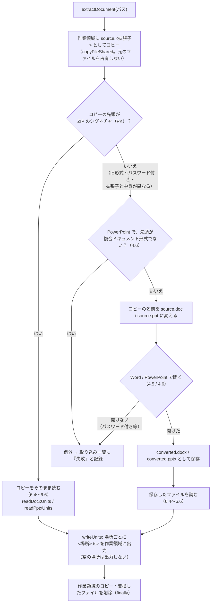
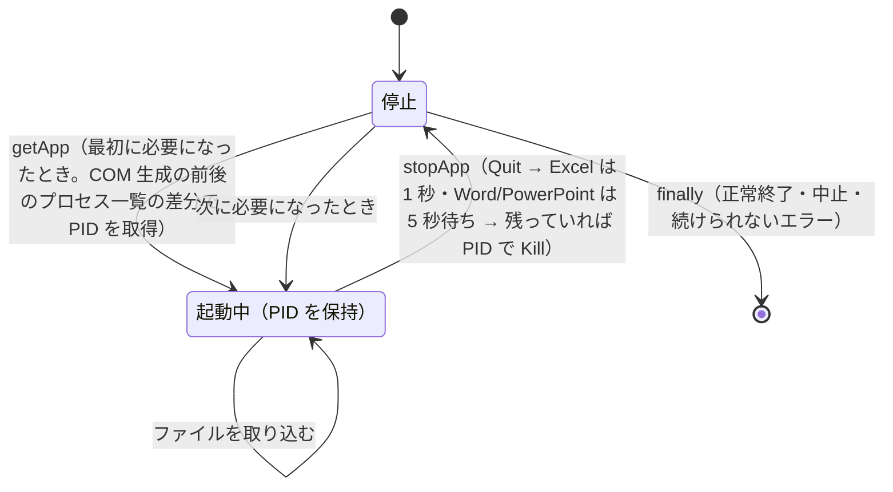

# インデックス作成（インデクサ）設計書 ― 共通処理と Office アプリの管理

本書は [01_インデックス作成.md](01_インデックス作成.md) の一部である。章・節の番号は 01_インデックス作成.md と分割した各ファイルで通し番号とし、各章がどのファイルにあるかは [01_インデックス作成.md](01_インデックス作成.md#ファイル構成) の表のとおり。

Word・PowerPoint で共通の抽出処理（4.4）、失敗の原因の言い換え（4.7）、Office アプリの起動・終了と制限時間の監視（5 章）を扱う。

---

## 4. 処理フロー（続き）

### 4.4 Word・PowerPoint の抽出処理（`extractDocument`）

Word・PowerPoint で共通の処理。旧形式などをアプリで変換する処理は 4.5 節（Word）・4.6 節（PowerPoint）、ファイルの読み取りは 6.4 節（共通）・6.5 節（Word）・6.6 節（PowerPoint）。

- 元のファイルは直接読まず、先に作業領域へコピーする（Excel と同じく `copyFileShared`。[01_インデックス作成_1_Excel.md](01_インデックス作成_1_Excel.md) の補足）。ZIP を直接開くと、読んでいる間ほかのアプリの書き込みを拒否するうえ、利用者が編集中（書き込みで開いている）のファイルは共有違反で読めないため。
- コピーに旧形式の拡張子を付けてから開くのは、Word・PowerPoint が拡張子と中身が異なるファイル（中身が `.doc` の `.docx` 等）を開けないため。
- パスワード付きの `.docx` `.pptx` は暗号化されて ZIP ではなくなるため、この経路で Word・PowerPoint に開かせ、例外として取り込み一覧に「失敗」と記録する。

> **4.5 Word の旧形式の変換（`extractWithWord`）** → [01_インデックス作成_2_Word.md](01_インデックス作成_2_Word.md#45-word-の旧形式の変換extractwithword)

> **4.6 PowerPoint の旧形式の変換（`extractWithPowerPoint`）** → [01_インデックス作成_3_PowerPoint.md](01_インデックス作成_3_PowerPoint.md#46-powerpoint-の旧形式の変換extractwithpowerpoint)

### 4.7 失敗の原因（`describeIngestError`）

`describeIngestError` は `scripts/shared/office/office_files.ps1` にあり、比較の抽出プロセス（`tebunko_diff/differ.ps1`）も同じ言い換えで失敗の原因を画面に出す。

取り込みに失敗したファイルは、取り込み一覧のエラー列に**失敗の原因**を記録する。画面の［インデックス管理］タブには、失敗したファイルと原因を一覧で表示する（[03_画面_1_インデックス管理タブ.md](03_画面_1_インデックス管理タブ.md) No.8）。

Office アプリの例外メッセージはそのままでは分かりにくい（パスワード付きのファイルでも「入力したパスワードが間違っています」と出る、作業領域のコピーのパスが出る、等）。そのため `describeIngestError` で、よくある原因を言い換えて `原因（詳細: 元のメッセージ）` の形にする。

- メソッド呼び出しの例外（`"7" 個の引数を指定して "Open" を呼び出し中に例外が発生しました` 等）は、中の例外（`GetBaseException()`）のメッセージを使う。
- スクリプト自身が `throw` したメッセージは、利用者向けに書いてあるためそのまま使う。
- 判定できない例外は、元のメッセージをそのまま使う（空ならエラーコードを表示する）。

| 判定 | 記録する原因 |
|---|---|
| メッセージに `パスワード` / `password` を含む | `読み取りパスワードが設定されているため開けません（パスワード付きのファイルは取り込めません）`（元のメッセージは誤解を招くため付けない） |
| `FileNotFoundException` / `DirectoryNotFoundException` | `ファイルが見つかりません（取り込み中に移動・削除・名前変更された可能性があります）` |
| `UnauthorizedAccessException`、`0x80070005` | `ファイルを読むアクセス権がありません` |
| `PathTooLongException` | `パスが長すぎるため読めません` |
| `OutOfMemoryException` | `シート・文書が大きすぎて取り込めません（メモリが不足しました）`（整形（6.3 節）はシート 1 枚分を一度に読み込むため、テキストにして約 1GB を超えるシートで発生する） |
| `0x80070020` / `0x80070021`（共有違反・ロック違反） | `ほかのアプリ・利用者がファイルを使用中のため読めません（ファイルを閉じてから再取り込みしてください）` |
| `0x80040154` / `0x80080005` / `0x800401F3` | `Officeアプリ（Excel・Word・PowerPoint）を起動できませんでした（インストール・ライセンス認証の状態を確認してください）` |
| `0x800706BA` / `0x800706BE` / `0x80010105` / `0x80010108` | `Officeアプリが異常終了したか、内部でエラーが発生しました（ファイルが壊れている、または大きすぎる可能性があります）` |
| `0x80010001` / `0x8001010A` | `Officeアプリが応答しませんでした（Officeアプリでダイアログを表示中などの可能性があります）` |
| `InvalidDataException` / `XmlException`、メッセージに `ファイル形式` `破損` `壊れ` 等を含む | `ファイルが壊れているか、拡張子と中身の形式が一致していません` |

制限時間を超えた場合（4.1）と、取り込み中に続けて強制終了した場合（4.2）は、それぞれ専用のメッセージを記録する。

記録・表示するメッセージの全文と対処は、[01_インデックス作成_8_エラーメッセージ一覧.md](01_インデックス作成_8_エラーメッセージ一覧.md)（4.8）にまとめる。

---

## 5. Office アプリ（Excel・Word・PowerPoint）の管理

| 項目 | 仕様 |
|---|---|
| 起動 | `getApp <名前>` がアプリごとに 1 つの COM オブジェクトを保持し、最初に必要になったときに起動する |
| PID の取得 | COM 生成の前後でプロセス一覧（`EXCEL` / `WINWORD` / `POWERPNT`）を比べ、新しく増えた 1 つを自分が起動したプロセスとする |
| 利用者のアプリとの共用 | 新しいプロセスが増えなかった場合は利用者のアプリとみなし、`Quit()` も強制終了もしない |
| 終了 | `Quit()` と `ReleaseComObject` の後、待ち時間（Excel は 1 秒、Word・PowerPoint は 5 秒）以内にプロセスが終了しなければ PID で強制終了する。Excel の待ち時間が短いのは、抽出で取り出した COM オブジェクトが解放されきらず、インデクサが動いている間は Quit しても終わらない（長く待っても無駄になる）ため。`GC.Collect()` で解放を促して自分で終わらせる方法は、インデクサの終了が COM の解放待ちで約 60 秒止まることがある（実測 25 回中 1〜2 回）ため採らない。`GC.WaitForPendingFinalizers()` も同じ理由で使わない |
| 終了の失敗 | 終了処理中のプロセスへの `Kill()` は「アクセス拒否」になることがあるため無視する。1 つのアプリの終了に失敗しても残りのアプリは終了させる（`stopAllApps`） |
| 制限時間の監視 | `getApp` / `stopApp` のたびに、自分で起動したアプリの PID を監視スレッドに渡す（`updateWatchedPids`）。1 ファイルの制限時間を過ぎたら、監視スレッドがそれらを強制終了する（4.2「強制終了・時間切れからの再開」）。PID が別のプロセスに再利用されている場合に備え、プロセス名が `EXCEL` / `WINWORD` / `POWERPNT` のときだけ終了させる |

### 5.1 Word・PowerPoint の起動・終了

Word・PowerPoint では、利用者が同じアプリで作業していることがあるため、次の場合は終了させない。

| 場合 | 仕様 |
|---|---|
| 起動中のアプリに接続された | COM 生成の前後で新しいプロセスが増えなかった場合（PowerPoint は起動中のアプリに接続することがある）は利用者のアプリとみなし、`Quit()` も強制終了もしない |
| インデックス作成中に利用者がファイルを開いた | 終了時に Word の `Documents.Count` / PowerPoint の `Presentations.Count` が 1 以上なら、利用者が使用中とみなして終了させない |
