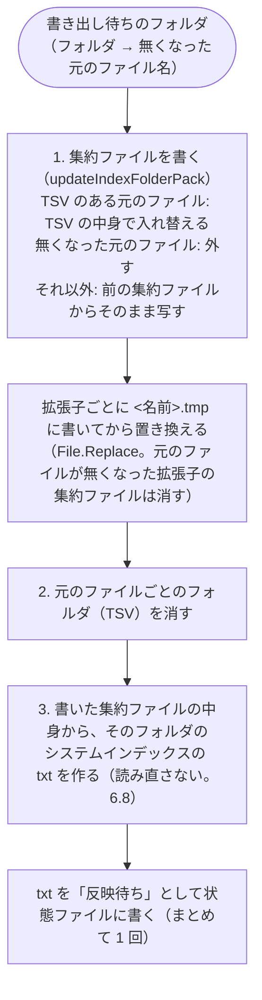

# インデックス作成（インデクサ）設計書 ― 出力 TSV の仕様と既知の問題

本書は [01_インデックス作成.md](01_インデックス作成.md) の一部である。章・節の番号は 01_インデックス作成.md と分割した各ファイルで通し番号とし、各章がどのファイルにあるかは [01_インデックス作成.md](01_インデックス作成.md#ファイル構成) の表のとおり。

インデックス（集約ファイル・TSV）の置き場所・名前・中身の形式（6 章）と、実装上の注意点・既知の問題（7 章）を扱う。

---

## 6. 出力 TSV の仕様

### 6.1 配置・命名規則

インデックスは、クロール対象フォルダの中のフォルダ 1 つ・元のファイルの拡張子 1 つにつき 1 つの**集約ファイル**にする。検索は集約ファイルだけを読む（[02_検索.md](02_検索.md#43-検索の実装速度) 4.3）。

```
work/index/<インデックス名>/<相対フォルダ>/content.<拡張子（小文字）>.<番号>.tsv                        … 集約ファイル（検索に使う）
work/index/<インデックス名>/<相対フォルダ>/<ファイル名（拡張子あり）>/<encodeIndexPlace(場所)>.tsv … 取り込み中だけの TSV
```

- **集約ファイル**（`content.xlsx.001.tsv` `content.docx.001.tsv` など）には、そのフォルダ**直下**にある、その拡張子の元のファイルすべての中身を入れる。サブフォルダのファイルは、サブフォルダの集約ファイルに入る。形式は下の「集約ファイルの形式」。
- **TSV**（元のファイル 1 つ・場所 1 つにつき 1 つ）は、取り込んでから集約ファイルに入れるまでの**一時的な置き場所**。フォルダの取り込みが終わると集約ファイルに入れ、TSV のフォルダは消す（下の「集約ファイルへの書き出し」。残すとインデックスの容量が倍になるため）。インデックス作成が途中で止まったときだけ残り、次のインデックス作成の始めに集約ファイルへ入れる。

TSV は**元のファイル名をフォルダ名**にし、その中に場所ごとの TSV を置く。クロール対象フォルダが `C:\data\営業`（インデックス名 `営業`）の場合:

| 元ファイル（クロール対象フォルダからの相対パス） | 場所 | 取り込み中の TSV | 集約ファイル |
|---|---|---|---|
| `2024/見積/A社.xlsx` | シート `明細` | `work/index/営業/2024/見積/A社.xlsx/明細.tsv` | `work/index/営業/2024/見積/content.xlsx.001.tsv` |
| `売上.xls` | シート `2024_上期` | `work/index/営業/売上.xls/2024%5F上期.tsv` | `work/index/営業/content.xls.001.tsv` |
| `[確定]見積.xlsx` | シート `記号<>` | `work/index/営業/[確定]見積.xlsx/記号%3C%3E.tsv` | `work/index/営業/content.xlsx.001.tsv` |
| `コピー.xls_old.xlsx` | シート `Sheet1` | `work/index/営業/コピー.xls_old.xlsx/Sheet1.tsv` | `work/index/営業/content.xlsx.001.tsv` |
| `報告書.DOCX` | `ページ001` | `work/index/営業/報告書.DOCX/ページ001.tsv` | `work/index/営業/content.docx.001.tsv` |

- クロール対象フォルダのフォルダ構成が `work/index/<インデックス名>/` 配下にそのまま再現され、各フォルダに**拡張子ごとの集約ファイル**ができる。検索結果の先頭の相対フォルダにもインデックス名が付くため、どのクロール対象フォルダのファイルかが分かる。
- 集約ファイルの名前には `_` を使わない（以前の形式 `<ファイル名>_<場所>.tsv` と見分けるため。下の「以前の形式（フラット）からの移行」）。拡張子は小文字にそろえる（`報告書.DOCX` は `content.docx.001.tsv` に入る）。
- 「場所」は Excel ではシート名と、図形・コメントの `<シート名>[図形]` `<シート名>[コメント]`（下の「図形・コメントの場所」、6.7 節、[01_インデックス作成_1_Excel.md](01_インデックス作成_1_Excel.md#67-excel-の図形コメントの読み取りreadxlsxobjectunits)）、Word ではページ・ヘッダー/フッター・脚注（6.5 節、[01_インデックス作成_2_Word.md](01_インデックス作成_2_Word.md#65-word-のテキスト読み取りと-tsv-の場所readdocxunits)）、PowerPoint ではスライド・ノート（6.6 節、[01_インデックス作成_3_PowerPoint.md](01_インデックス作成_3_PowerPoint.md#66-powerpoint-のテキスト読み取りと-tsv-の場所readpptxunits)）。
- TSV のファイル名は場所だけ（`toIndexFileName`）。場所は Excel のシート名で最長 31 文字のため、Windows のファイル名の上限（255 文字）は超えない。元のファイル名は Windows 上のファイル名そのものなので、フォルダ名にしても上限を超えない。
- **TSV でファイル名をフォルダ名にする理由**（`<ファイル名>_<場所>.tsv` のように 1 つの名前にしない理由）:
  - ファイル名と場所の区切りが `\` になり、名前の中の文字と衝突しない（`_` の符号化に頼らずに分けられる）。
  - 取り込み直すときは**フォルダごと入れ替え**ればよく、別のファイルの TSV を巻き込まない（`<ファイル名>_*.tsv` で消すと、`a.xls` の取り込みで `a.xls_b.xlsx` の TSV まで消える）。
  - `<ファイル名>＋<場所>` が 255 文字を超えて保存できない、ということが起きない。
- **集約ファイルにする理由**: 検索の時間は、読むファイルの数でほぼ決まる。ウイルス対策ソフト（Microsoft Defender）は、ファイルを初めて開くたびに検査し（実測で 1 ファイル約 11 ミリ秒）、検査済みとして覚えておけるのはおよそ 2 万ファイルまで。元のファイル 1 つ・場所 1 つにつき TSV 1 つだと、TSV が数万件になり、初回の検索が数分〜10 分以上かかった。フォルダ・拡張子ごとにまとめると、読むファイルの数が数百分の 1 になる（実測は [02_検索.md](02_検索.md#43-検索の実装速度) 4.3）。

#### 集約ファイルの形式（`pack_format.ps1`）

集約ファイルは、元のファイルごと・場所（シート・ページ・スライドなど）ごとに、**メタ情報の行**と、その場所の TSV の中身（6.3 など。1 行 = Excel の 1 行・段落 1 つ）を並べたもの。例（`␞` は RS（U+001E）、`→` はタブ）:

```
␞ 版=1
␞ ファイル名=(株)山田商事_見積書.xlsx
␞ 種類=Excel
␞ シート=見積
␞ 対象=本文
品名→数量→単価
りんご→10→100
␞ シート=見積
␞ 対象=図形
B2→確定版
␞ ファイル名=(株)山田商事_請求書.xlsx
␞ 種類=Excel
␞ シート=請求
␞ 対象=本文
品名→金額
```

| 項目 | 仕様 |
|---|---|
| 文字コード・改行 | UTF-16LE（BOM 付き）。改行は LF にそろえる（TSV の CRLF・CR も LF にする。行の分け方は `StreamReader.ReadLine` と同じにし、行番号を変えない）。UTF-16 にするのは、読んだ後の文字列への変換が UTF-8 より速く、日本語が多いと大きさがほとんど変わらないため |
| メタ情報の行 | 先頭が RS（U+001E）、半角スペース、`キー=値`。1 行に 1 項目。中身の行には U+001C〜U+001F を入れない（書くときに取り除く）ため、先頭が RS の行はメタ情報の行と分かる |
| 値の符号化 | 値に改行などの制御文字（タブを除く U+0000〜U+001F）と `%` があれば `%XX`（16 進 2 桁）にする（`encodePackValue` / `decodePackValue`） |
| 中身の行 | 場所の TSV の行そのまま（セルはタブ区切り、セル内改行は U+2028）。場所のメタ情報の後の最初の行が 1 行目（Excel ではシートの 1 行目） |
| 並び | 元のファイルは名前の順（現在のカルチャ・大文字と小文字を区別しない）。場所は TSV のファイル名の順 |
| 名前 | `content.<元のファイルの拡張子（小文字）>.<番号（3 桁）>.tsv`（`getPackFileName`。例 `content.xlsx.001.tsv`）。分けていないときも `001` を付ける |
| 分け方 | 1 つの集約ファイルが 4MB（`$packFileMaxBytes`）以上になったら、それ以上元のファイルを足さず、次の番号の集約ファイルに足す（`planPackParts`）。更新した元のファイルは今入っている集約ファイルの中で入れ替え、無くなった元のファイルは外す。変わらない集約ファイルは書き直さない。元のファイルが無くなった集約ファイルは消す（番号は詰めない）。1 つの元のファイルは 2 つの集約ファイルにまたがらない |

| キー | 値 | 意味 |
|---|---|---|
| `版` | `1` | 形式の版。ファイルの 1 行目。今の版と違えば例外にする（`readPackPlaces`） |
| `ファイル名` | 元のファイル名（例 `見積書.xlsx`） | ここから新しい元のファイルが始まる |
| `種類` | `Excel` / `Word` / `PowerPoint` | 元のファイルの種類（拡張子から決める） |
| `シート` / `ページ` / `スライド` / `部分` | シート名 / ページ番号 / スライド番号 / それ以外の場所の名前（`ヘッダー・フッター` など） | ここから新しい場所が始まる |
| `対象` | `本文` / `図形` / `コメント` / `ノート` | 場所の中身の種類（上の「図形・コメントの場所」） |
| `非表示` | `はい` | 非表示のスライド（PowerPoint）だけに付ける |

- 知らないキーは読み飛ばし、無いキーは既定の値とみなす（後の版でキーを足しても、前の版の読み方で読める）。
- 画面・検索結果に出す場所の名前は、メタ情報から TSV のときと同じ形に組み立て直す（`convertPackMetaToPlace`。`見積[図形]`・`ページ001`・`スライド002（非表示）`・`スライド001_ノート` など）。TSV のファイル名（場所の名前）からメタ情報へは `convertPlaceToPackMeta` で分け、組み立て直して同じ名前にならないもの（番号の桁が違う等）は `部分=<名前そのまま>` にする。
- メタ情報の行は検索しない（ファイル名・シート名の語には一致しない。[02_検索.md](02_検索.md#43-検索の実装速度) 4.3）。

#### 図形・コメントの場所（Excel・Word・PowerPoint で共通の決まり）

本文（セル・段落）以外の文字は、**`<元の場所>[<種類>]`** という場所（TSV）に分けて出力する。種類ごとに、検索に含めるかを画面で選べる（［図形も検索］［コメントも検索］。[02_検索.md](02_検索.md) 4.1）。

| 種類 | Excel | Word | PowerPoint |
|---|---|---|---|
| `図形` | 図形・テキストボックス・WordArt（`売上[図形]`） | 本文のテキストボックス・図形内の文字、SmartArt、グラフ（`ページ003[図形]`） | SmartArt、グラフ（`スライド002[図形]`）。テキストボックス・図形の文字はスライドの本文 |
| `コメント` | メモ・スレッド形式のコメントと返信（`売上[コメント]`） | コメントと返信（`ページ003[コメント]`。本文に参照の無いものは `文書[コメント]`） | 旧形式・新形式のコメントと返信（`スライド002[コメント]`） |

- PowerPoint のテキストボックス・図形を本文のままにする理由は 6.6 節。Word の本文のテキストボックスは Excel とそろえて図形にするため、［図形も検索］をオフにすると検索されない。
- Excel の SmartArt・グラフ、埋め込みオブジェクト、スライドマスター・レイアウトは読まない。

- **重ならない理由**: Excel のシート名には `[` `]` を使えない。Word・PowerPoint の場所（`ページNNN` `スライドNNN` `ヘッダー・フッター` 等）には `[` が付かない。このため、ふつうの場所と図形・コメントの場所は必ず見分けられる。
- **定義の場所**: 種類の名前は `index_name.ps1` の `$placeKindShape` / `$placeKindComment` と `objectPlacePattern`（分けるのは `splitObjectPlace`）。書き出す側（`office_reader.ps1`）と画面（`types.ps1` の `HitRow`）は変数を使えないため同じ名前を直接書いており、そろっていることをテスト（`index_name.Tests.ps1`）で確かめる。種類を足すときは 3 か所と画面のチェックをそろえる。
- **1 行の形**: Excel は `<セル番地><TAB><文字>`（検索結果の「セル」と、開くときに選ぶセルに使う）。Word・PowerPoint は図形・コメント 1 つを 1 行（文字だけ。段落はスペースでつなぐ）にする。元の場所（ページ・スライド）は場所の名前で分かる。
- **読み取る内容を増やしたとき**: `indexer_decide.ps1` の `$extractVersions` で、その形式（拡張子）の抽出版を上げる。前の版で取り込んだファイルは、更新が無くても次のインデックス作成で取り込み直す（[01_インデックス作成_5](01_インデックス作成_5_クロール.md)）。今は `.xlsx` `.xlsm` と Word・PowerPoint のすべての形式が 2。

#### インデックスへの入れ替え（`publishTsv` / `publishIndexFiles`）

1 ファイルの抽出が終わったら、作業領域（`%TEMP%\tebunko\<PID>`）にできた TSV をインデックスの一時的な置き場所（元のファイル名のフォルダ）へ入れる。このとき、TSV をいったん `work/取り込み出力/<PID>/<元のファイル名>` に集め、**集め終わってから**古い `work/index/…/<元のファイル名>` を削除してフォルダごと入れ替える。集約ファイルへは、そのフォルダの取り込みが終わってから入れる（下の「集約ファイルへの書き出し」）。

- 1 件ずつインデックスへ移すと、途中で強制終了されたときに**一部のシートだけが入ったインデックス**が残り、検索しても欠けていることに気付けない。まとめて入れ替えれば、「前回のインデックスがそのまま」か「今回の分がそろった状態」のどちらかになる。
- フォルダごと移す（`Directory.Move`）には同じドライブである必要があるため、集める場所は `work` の中に置く（作業領域は `%TEMP%`）。別のドライブで移せない場合は、1 件ずつ移す方法に切り替える。
- 削除は、ウイルス対策ソフト・エクスプローラーが一時的に掴んでいることがあるため、少し待って数回試す（`removeDirectoryRetry`）。

#### 集約ファイルへの書き出し（`publishIndexFolders`）

取り込んだファイルのフォルダは「書き出し待ち」として覚えておき（`indexer.ps1` の `addPendingPublish`）、**取り込みが別のフォルダに移ったとき**と、**インデックス作成の終わり**（中止したときも。`finally`）に、それまでのフォルダをまとめて書き出す（`flushPendingPublish` → `publishIndexFolders`）。元のファイル 1 つごとに書き出すと、フォルダの大きさ × ファイルの数だけ集約ファイルを書き直すことになるため。フォルダごとに次を続けて行う。



- **途中で止まったとき**: 集約ファイルは一時ファイルに書き終えてから置き換えるため、書き終える前に止まっても、前の集約ファイルか TSV のどちらかに中身が残る。TSV のフォルダが残ったフォルダは、次のインデックス作成の始めに（取り込み対象を調べる前に）書き出す（`findIndexFoldersWithBooks`。進み具合は `集約ファイルに入れていないインデックスをまとめています…`）。書き出しに失敗したときも、同じく次のインデックス作成でまとめ直す（`インデックスをまとめられませんでした（次のインデックス作成でまとめ直します）`）。
- **元のファイルが無くなったとき**: クロールで無くなったと分かったファイル（`createTargetList` の `Removed`。[01_インデックス作成_5](01_インデックス作成_5_クロール.md#取り込み対象の決定createtargetlist)）と、取り込みの直前に無くなっていたファイル（[01_インデックス作成_4](01_インデックス作成_4_メインフローと取り込み一覧.md#41-メインフロー)）は、そのフォルダを書き出し待ちにして、集約ファイルから外す。取り込むファイルが 0 件のときも書き出す。
- **検索との同時実行**: 集約ファイルは置き換えで書くため、検索は置き換えの前か後のどちらかの中身を読む（読み込みは共有モードで開き、置き換えを妨げない）。
- 以前の版のインデックスは変換しない。この版で作り直す（`work/index` に以前の版の TSV のフォルダが残っていれば、上の「途中で止まったとき」と同じく、次のインデックス作成の始めに集約ファイルへ入れる）。

#### 以前の形式（フラット）からの移行（`migrateFlatIndex`）

インデックス作成の最初に、`work/index` 配下の以前の形式の TSV（`<ファイル名>_<場所>.tsv`）を、今の形式（`<ファイル名>/<場所>.tsv`）へ**名前を変えるだけ**で移す（取り込み直さない。更新日時もそのまま）。移した TSV は、続けて集約ファイルに入れる（上の「途中で止まったとき」と同じ `findIndexFoldersWithBooks`）。

- 今の形式の TSV 名・集約ファイルの名前には `_` が無い（場所の `_` は符号化されている。6.2）ため、**名前に `_` があるものが以前の形式**と分かる。
- ファイル名と場所への分解は `splitIndexFileName`（以前の形式の規則）で行い、移した数を `以前の形式のTSV N 件を、元のファイル名のフォルダへ移しました。（取り込み直しません）` と表示する。移せなかったものは次のインデックス作成で作り直す。
- 検索は集約ファイルだけを読むため、別の PC へコピーした以前の版のインデックス（`work/index` の外に置いたもの・インデックス作成をしていないもの）は、そのままでは検索できない。

#### 長いパス（260 文字超）の扱い

出力 TSV のパスは、元ファイルのパスより `<tebunko の場所>\work\index\<インデックス名>\` と `\<場所>.tsv` の分だけ長くなるため（集約ファイルも `<tebunko の場所>\work\index\<インデックス名>\` の分だけ長くなる）、元ファイルが開けても TSV のパスが 260 文字を超えることがある。Windows PowerShell 5.1（.NET Framework 4.6.2 以降）では、パスの先頭に `\\?\` を付けると、OS の設定（LongPathsEnabled）や管理者権限なしで 260 文字を超えるパスを扱えるため、ファイル操作に渡すパスには `toLongPath` で `\\?\` を付ける。

| 場面 | `\\?\` を付けない場合（実測） | 対応 |
|---|---|---|
| クロール（`findOfficeFiles`） | パスが約 248 文字を超えるフォルダの中を検索できず、アクセスできないフォルダ扱いになる（そのファイルは取り込まれない） | `\\?\` 付きで検索し、`FullName` から相対パスを求めるときは `fromLongPath` で外す |
| TSV・集約ファイルの保存・移動・削除（`prettyTsv` / `writeUnits` / `publishTsv` / `getIndexFiles` / `writePackFile` / `updateIndexFolderPack`） | 260 文字を超えるパスは「パスの一部が見つかりません」で失敗する。`Test-Path` は `$false` を返す | `\\?\` 付きで操作する |
| 設定から削除したフォルダのインデックスの削除（`removeDroppedFolders`） | 中に長いパスがあると `Remove-Item -Recurse` が失敗する | `\\?\` 付きで削除する |
| Excel で開く | 約 256 文字以上（古い版は 218 文字以上）のパスは開けない。`\\?\` 付きのパスも開けない | 4.3 節（常に作業フォルダにコピーしてから開く。コピーは短いパスになる） |

- `Join-Path` は `\\?\` 付きのパスを扱えない（`drive` が null の例外）ため、パスは通常の形のまま組み立て、ファイル操作に渡す直前に `toLongPath` を付ける。
- ネットワークのパス（`\\server\share\…`）は `\\?\UNC\server\share\…` にする。
- ファイル名・フォルダ名 1 つの上限（255 文字）は `\\?\` でも超えられない。

### 6.2 場所の符号化（`encodeIndexPlace` / `decodeIndexPlace`）

TSV のファイル名に入れる場所（シート名など）は、次の文字を `%` と 16 進数 2 桁にする。集約ファイルに入れるとき（`getIndexFolderBooks`）と以前の形式からの移行（`splitIndexFileName`）で `decodeIndexPlace` で元に戻す。集約ファイルのメタ情報には元のシート名を書き（値の符号化は 6.1「集約ファイルの形式」）、検索結果の「場所」には元のシート名を表示する。

| 元 | `"` | `%` | `*` | `/` | `:` | `<` | `>` | `?` | `\` | `_` | `\|` | 制御文字（U+0000〜U+001F） |
|---|---|---|---|---|---|---|---|---|---|---|---|---|
| 符号化後 | `%22` | `%25` | `%2A` | `%2F` | `%3A` | `%3C` | `%3E` | `%3F` | `%5C` | `%5F` | `%7C` | `%00`〜`%1F` |

- 全角に置き換える方式にしないのは、`衝突"` と `衝突”` のように別のシートが同じ TSV 名になり、後のシートで上書きされるため。元に戻せる形にすれば、シート名が違えば TSV 名も必ず違う。
- 場所の `_` も符号化するため、今の形式の TSV 名には `_` が残らない。これにより、**名前に `_` があれば以前の形式（フラット）**と分かり、1 つのインデックスに両方があっても見分けられる（6.1 の移行）。
- 以前の版で作ったフラットの TSV（場所を全角に置き換え、`_` はそのまま）も移行できる（`splitIndexFileName` は、最後の `_` の前が拡張子にならなければ、最初の「拡張子_」で分ける。[02_検索.md 5.3 節](02_検索.md#53-ファイル名場所の求め方readpackplaces)）。
- ファイル名は符号化しない（元ファイルの名前がそのまま TSV のフォルダ名になる。Windows のファイル名なので使えない文字は含まない）。
- Excel のシート名はタブ・改行を含められる（VBA などで付けた場合）。制御文字も符号化するため、そのようなシートも保存できる（検索結果に出すときは、列・行が分かれないようスペースにする。[02_検索.md](02_検索.md#51-出力フォーマットwork検索結果txt) 5.1）。
- インデックス名（`work/index` 直下のフォルダ名）は符号化せず、`toSafeFileName`（ファイル名に使えない文字を全角に置き換える）で作る。

| 元 | `>` | `<` | `\` | `*` | `"` | `:` | `?` | `\|` | `/` |
|---|---|---|---|---|---|---|---|---|---|
| `toSafeFileName` の置換後 | `＞` | `＜` | `￥` | `＊` | `”` | `：` | `？` | `｜` | `／` |

> **6.3 TSV 整形仕様（`prettyTsv` / `formatTsv`）** → [01_インデックス作成_1_Excel.md](01_インデックス作成_1_Excel.md#63-tsv-整形仕様prettytsv--formattsv)

### 6.4 Word・PowerPoint のテキスト読み取り（`scripts/shared/office/office_reader.ps1`）

`.docx` `.pptx` を ZIP として開き（`System.IO.Compression`）、XML を `XmlReader` で先頭から順に読む（`readXmlLines`）。Word（WordprocessingML、`w:`）と PowerPoint（DrawingML、`a:`）で同じ処理を使い、名前空間だけを切り替える。

| 要素 | 扱い |
|---|---|
| 段落（`p`） | 1 行。文字（`t`）を連結する。タブ・改行（`tab` `br` `cr`）はスペース、`noBreakHyphen` は `-` |
| 表の行（`tr`） | 1 行。セル（`tc`）をタブ区切りにし、行末の空セルは除く。セル内の複数段落はスペース区切り。入れ子の表は外側のセルの中でスペース区切り |
| テキストボックス | Word の本文（`$objects` を渡したとき）: 本文の行には入れず、段落をスペースでつないで図形 1 つとして集める（6.5 節の `ページNNN[図形]`）。ヘッダー・フッター・脚注: 中の段落をそれぞれ 1 行とする（アンカーの段落の前に出力される） |
| SmartArt・グラフ・コメントの参照 | `$objects` を渡したとき、`dgm:relIds` の `r:dm`・`c:chart` の `r:id`・`w:commentReference` の `w:id` をページ付きで集める（中身は呼び出し元がリレーションシップの先から読む） |
| 互換用の代替表示（`mc:Fallback`） | 読まない（`mc:Choice` と同じ内容が重複するため） |
| 変更履歴 | 削除された文字（`w:delText`）と移動元（`w:moveFrom`）は読まない。挿入された文字は読む |
| フィールドコード（`w:instrText`） | 読まない（表示される結果の文字は読む） |

- Word・PowerPoint の TSV は、空行を除いて 1 行 = 段落 1 つ、または表の 1 行（セルをタブ区切り）。
- どの XML をどの場所（TSV）として読むかは、6.5 節（Word）・6.6 節（PowerPoint）を参照。

> **6.5 Word のテキスト読み取りと TSV の場所（`readDocxUnits`）** → [01_インデックス作成_2_Word.md](01_インデックス作成_2_Word.md#65-word-のテキスト読み取りと-tsv-の場所readdocxunits)

> **6.6 PowerPoint のテキスト読み取りと TSV の場所（`readPptxUnits`）** → [01_インデックス作成_3_PowerPoint.md](01_インデックス作成_3_PowerPoint.md#66-powerpoint-のテキスト読み取りと-tsv-の場所readpptxunits)

> **6.7 Excel の図形・コメントの読み取り（`readXlsxObjectUnits`）** → [01_インデックス作成_1_Excel.md](01_インデックス作成_1_Excel.md#67-excel-の図形コメントの読み取りreadxlsxobjectunits)

### 6.8 システムインデックス（system_index）

高速検索（[02_検索.md](02_検索.md) 4.4）のため、インデックス作成は集約ファイルとは別に、Windows Search に索引させる txt（システムインデックス）を作る（`tebunko/index/system_index.ps1`。語の決まりは `tebunko/search/search_gram.ps1`）。

```
work/index/<インデックス名>/<相対フォルダ>/content.<拡張子>.<番号>.tsv              … 集約ファイル（6.1）
work/system_index/<インデックス名>/<相対フォルダ>/システムインデックス.txt … システムインデックス
work/システムインデックスの状態.tsv                                         … その状態
```

| 項目 | 仕様 |
|---|---|
| 単位 | `work/index` の中のフォルダ 1 つにつき 1 つ。中身は、そのフォルダ直下の集約ファイル（拡張子ごとのものすべて）から作る。集約ファイルのメタ情報の行（ファイル名・シート名など）は除く（`getPackContentText`。入れると、その語で探したときにどのフォルダも候補になるため）。集約する前の TSV（直下のブックのフォルダ `<ファイル名.xlsx>` の中の TSV）が残っていれば、それも入れる。サブフォルダのブックは、サブフォルダの txt に入る |
| 中身 | 本文を小文字にし、隣り合う 2 文字（UTF-16 の単位）を、UTF-16LE の 4 バイトの 16 進にした語（`x` ＋ 8 桁。例: `ニタ` → `xcb30bf30`）にして、重複を除いて空白区切りの ASCII で書く。空白を含む 2-gram も入るが、問い合わせには使わない |
| 作り方の速さ | `char[]` を `uint32[]` に写して .NET の `HashSet` で重複を除く（1 文字ずつ PowerShell で回さない）。合成データの実測で MB あたり約 0.7 秒（4 スレッド） |
| 大きいとき | 8MB を超える（語 1 つ 10 バイトで約 84 万語）と、語の値の範囲で `システムインデックス_1.txt`・`_2.txt` … に分ける（実測で 16MB までは末尾まで索引された） |
| パスが長いとき | txt のパスが 240 文字以上になるフォルダは作らず、状態ファイルに「対象外」と書く（検索のたびにそのフォルダを照合する） |
| 作る時機 | 集約ファイルを書き出したフォルダは、書き出した直後に、書いた中身から作る（ファイルを読み直さない。6.1「集約ファイルへの書き出し」）。さらにインデックス作成の終わりに、作り直しが要るフォルダ（txt が無い・txt より新しい集約ファイル・TSV がある・反映待ちの日時が txt と合わない・集約ファイルが無くなった）をまとめて作る（`updateSystemIndexes`）。取り込む対象が 0 件のときも作る。中止したとき・クロール対象フォルダが見えなくなったときは、終わりの作り直しは行わない |
| 負荷 | 最大 4 スレッド（物理メモリ 8GB の PC で 4 スレッドのときにメモリが足りなくなったことがあるため）。作っている間はプロセスの優先度を BelowNormal に下げる。中止要求があれば、始めていないフォルダは作らない |
| 取り込みのとき | 1 ファイルを取り込んで TSV を入れ替えたら、そのフォルダを「反映待ち（日時 0）」にする。txt を作り直すまで、検索はそのフォルダを必ず照合する（日時 0 は txt の更新日時とも Windows Search の値とも一致しない）。集約ファイルを書き出して txt を作ったら、その txt の日時で「反映待ち」にする |
| 削除・名前変更 | 画面でインデックスを削除・名前変更したら、`work/system_index/<名前>` と状態の行を消す（名前を変えたときは、次のインデックス作成で作り直す）。設定から外したインデックスも、インデックス作成の終わりに消す |

**状態ファイル**（`システムインデックスの状態.tsv`。BOM 付き UTF-8・CRLF。1 行 `種別<TAB>対象<TAB>値`、パスは `work/system_index` からの相対パス）:

| 種別 | 対象 | 値 | 意味 |
|---|---|---|---|
| `対応済み` | インデックス名 | ― | すべてのフォルダの txt がある（または対象外として記録した）。無いインデックスは、高速検索でもすべてを照合する |
| `反映待ち` | txt | 書いた日時（UTC の Ticks） | Windows Search の `DateModified` がこの日時（秒で切り捨て）と同じで、`GatherTime` が空でなくなれば反映済み（検索がこの行を消す） |
| `対象外` | フォルダ | ― | txt を作らなかった（パスが長い） |

インデクサ（追記・作り直し）と画面（検索のたびの整理）が同時に書かないよう、状態ファイルは排他で開く。開けなければ少し待って数回試し、それでも開けなければ書き換えを次の機会に回す（検索は、読めなければすべてを照合する）。
---

## 7. 実装上の注意点・既知の問題

確度: ◎ = 動作確認済み、○ = コード上明らか、△ = 推定。

Word に固有のものは 7.2 節（[01_インデックス作成_2_Word.md](01_インデックス作成_2_Word.md#72-word-の注意点既知の問題)）、PowerPoint に固有のものは 7.3 節（[01_インデックス作成_3_PowerPoint.md](01_インデックス作成_3_PowerPoint.md#73-powerpoint-の注意点既知の問題)）にまとめる。

### 7.1 共通

| # | 内容 | 確度 |
|---|---|---|
| 1 | ブック名に `.xls_` などを含む別ブックがあっても（例: `a.xls` と `a.xls_b.xlsx`）、取り込み中の TSV はファイル名ごとのフォルダに分かれ、集約ファイルの中でもファイル名（`ファイル名=` の行）で分かれるため、旧 TSV の削除・差分判定・元ファイルが無くなったときの削除で他方を巻き込まない（6.1 節） | ◎ |
| 2 | インデクサが強制終了された（PC の停止・タスクマネージャーでの終了等）場合は `finally` が実行されず、Excel・Word・PowerPoint が残る（画面の［9 プロセス停止］タブで終了する）。取り込み一覧には追記した行が重複して残るが、次回のクロール時に書き直される。作りかけのインデックス（一部のシートだけの TSV）は残らない（`publishIndexFiles`。6.1 節）。集約ファイルに入れる前の TSV のフォルダは残るが、次回のインデックス作成開始時に集約ファイルへ入れる（`findIndexFoldersWithBooks`。6.1 節）。`work/取り込み出力/<PID>`・`%TEMP%\tebunko\<PID>` も残るが、次回のインデックス作成開始時に削除する | △ |
| 3 | 長いパス（260 文字超）は `\\?\` を付けて扱う（6.1 節）。ファイル名の上限（255 文字）は、元のファイル名をフォルダ名、場所を TSV 名にするため超えない（名前の長いファイルも取り込める） | ◎ |
| 4 | 更新の判定は更新日時（秒まで）とサイズで行う。1 秒以内に同じサイズのまま内容だけ変わった場合や、更新日時を保ったまま内容を書き換えるツール（展開・複写・バックアップからの復元など）で変更した場合は検出できない。中身をすべて読んで比べると、インデックス作成と変わらない時間がかかるため行わない。その場合は、そのインデックスを画面で［削除］してから作成し直す（`work/` を削除する必要は無い。ほかのインデックスは残る） | ○ |
| 5 | クロール対象フォルダのパスの書き方を変えても（ドライブ文字と UNC パス、`/` 区切り、`.` `..` を含む形、`\\?\` 付き、環境変数）同じフォルダとみなし、取り込み直さない（`normalizeFolderPath` ・ `testSameFolder`）。ただし、ドライブ文字で書いたパスの割り当て（ネットワークドライブ・`subst`）が既に無い場合は、同じフォルダとは分からない | ○ |
| 6 | クロール時にアクセスできないフォルダがあると、元ファイルが無くなったファイルはインデックス（集約ファイル）から除かれない（次回、全フォルダにアクセスできたときに除かれる） | ○ |
| 7 | インデックス（`work/index` の集約ファイル・フォルダ）を直接削除した場合・0 バイトの集約ファイルや TSV が残っている場合（書き込みの途中で電源が落ちた等）は、次のインデックス作成でそのファイルを取り込み直す（取り込み一覧の「済」と、そのフォルダ・その拡張子の集約ファイルの有無・大きさ、集約する前の TSV の数・大きさを照らす。[01_インデックス作成_5](01_インデックス作成_5_クロール.md#取り込み対象の決定createtargetlist)）。ただし集約ファイルの**中身の書き換え・一部の欠け**（手で編集した等、0 バイトでないもの）は分からない（集約ファイルの中の元のファイルごとの場所の数は、中身を読まないと数えられないため確かめない）。その場合は画面で［削除］してから作成し直す | ◎ |
| 8 | 取り込み一覧・インデックスの食い違いを避けるため、同じ配置フォルダのインデックス作成は同時に 1 つだけ動かす（`newAppMutex`）。別の場所にコピーしたツール（別の `work`）は、同時に動かしても互いに影響しない | ◎ |
| 9 | インデックス作成中にクロール対象フォルダにアクセスできなくなった場合は、残りのファイルを「未取り込み」のまま中止する（すべて「失敗」になるのを避けるため。[01_インデックス作成_4](01_インデックス作成_4_メインフローと取り込み一覧.md#41-メインフロー)）。個々のファイルが移動・削除された場合は、そのファイルだけを一覧から除いて続ける | ◎ |
| 10 | ファイルサーバーに到達できない・ネットワークドライブが切断されている場合、Windows の応答待ちでフォルダの有無の確認に時間がかかることがある。確認できなければ存在しないフォルダとして扱い、そのフォルダだけ取り込まずに続行する（既存のインデックスは消さない） | △ |
| 11 | チェックを外したフォルダのインデックスは検索対象に残る。検索から外すには設定から行を削除する（インデックスも削除される） | ○ |
| 12 | クロール対象フォルダを移した・名前を変えた場合、画面の［編集…］で「元のフォルダ」を書き換えれば、インデックス名が同じため取り込み直さない。一覧から削除して新しいパスで追加し直すと、別のインデックス（新しい名前）になり全件取り込み直す（[01_インデックス作成_5](01_インデックス作成_5_クロール.md#クロール対象フォルダとインデックス名)） | ○ |
| 13 | 取り込み一覧が無い状態で `work/index` 直下に TSV などがあると、以前の形式とみなして設定の 1 行目のフォルダのインデックスとして移す。以前の形式でない場合（手で置いたファイルなど）も移される | ○ |
| 14 | インデックスのファイルの数は、元のフォルダの数 × 拡張子の種類の数まで（集約ファイル）。取り込み中だけは元のファイル 1 つにつきフォルダ 1 つができるが、フォルダの取り込みが終わると消す。検索の速度は読むファイルの数で決まるため、集約ファイルにして速くなる（[02_検索.md](02_検索.md#43-検索の実装速度) 4.3） | ○ |
| 15 | 元のファイル名が `.xlsx` などで終わるフォルダ（例: `拡張子付きフォルダ.xlsx`）がクロール対象フォルダの中にあると、インデックスでは「ファイル名のフォルダ」（集約する前の TSV の置き場所）と同じ形になる。画面の検索対象ツリーには出ない | ○ |
| 16 | 制限時間（10 分）で強制終了できるのは自分で起動した Office アプリだけ。利用者の PowerPoint に接続して変換している場合や、`.docx` `.pptx` を直接読む処理（Office を使わない）が長引いた場合は止められない。画面の［中止］もファイルの切れ目まで効かない。その場合もインデクサ（`powershell.exe`）を強制終了すれば、次回はそのファイルを最後に回し、続けて 2 回なら失敗にする | ○ |
| 17 | 正常でも 10 分以上かかる巨大なファイルは失敗になる。取り込みたい場合は `tebunko/indexer.ps1` の `$fileTimeoutMinutes` を大きくする | ○ |
| 18 | 制限時間を過ぎたときは、取り込み中のファイルに使っていないアプリ（Excel ファイルの取り込み中の Word など）も自分で起動したものは強制終了する（次に必要になったときに起動し直すため、結果には影響しない） | ○ |
| 19 | Excel は**表示されている形**で出力するため、表示形式が「標準」の 12 桁以上の数値は指数表記（`4901234567894` → `4.90123E+12`）、「#,##0」などのセルは桁区切り付きになる。数値として入力した JAN コード・伝票番号は、その番号で検索してもヒットしない（[01_インデックス作成_1_Excel.md](01_インデックス作成_1_Excel.md#43-excel-の抽出処理extractworkbook) 4.3）。表示形式を「文字列」にするか、セルの先頭に `'` を付けて入力すれば検索できる | ◎ |
| 20 | 整形（`prettyTsv`）はシート 1 枚分を一度に読み込むため、大きなシートほどメモリを使う（実測: 100 万行 × 10 列 = 書き出し 440MB で約 2.8GB、書き出し 800MB で約 3GB・60 秒）。書き出しが約 1GB を超えるシートはメモリ不足で「失敗」になる（4.7 の `シート・文書が大きすぎて取り込めません`） | ◎ |
| 21 | 使用範囲（`UsedRange`）が実際のデータよりずっと広いシート（最終行・右端に書式だけが残っている等）は、データの範囲だけを一時シートにコピーしてから書き出す（[01_インデックス作成_1_Excel.md](01_インデックス作成_1_Excel.md#43-excel-の抽出処理extractworkbook) 4.3）。ブックの構成が保護されていて一時シートを作れない場合は、そのまま書き出すため制限時間で失敗することがある（その場合はインデックス作成ログに記録する） | ◎ |
