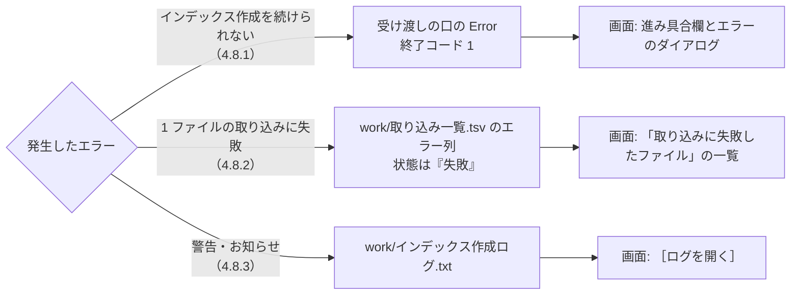

# インデックス作成（インデクサ）設計書 ― エラーメッセージ一覧

本書は [01_インデックス作成.md](01_インデックス作成.md) の一部である。章・節の番号は 01_インデックス作成.md と分割した各ファイルで通し番号とし、各章がどのファイルにあるかは [01_インデックス作成.md](01_インデックス作成.md#ファイル構成) の表のとおり。

---

## 4. 処理フロー（続き）

### 4.8 エラーメッセージ一覧

インデクサ（`tebunko/indexer.ps1`・`indexer/indexer_run.ps1`）が利用者に示すエラー・警告の一覧。メッセージは種類によって記録先と画面での表示が異なる。



| 種類 | 記録先 | 画面での表示 | インデックス作成の続行 |
|---|---|---|---|
| 続けられないエラー（4.8.1） | 受け渡しの口の `Error`（終了コード `1`）と `work/インデックス作成ログ.txt` | 進み具合欄に `インデックスを作成できませんでした` とメッセージ。エラーのダイアログ `インデックスを作成できませんでした。`＋メッセージ | 中止する |
| ファイルごとの失敗（4.8.2） | `work/取り込み一覧.tsv` のエラー列（状態は `失敗`） | ［1 インデックス管理］タブの「取り込みに失敗したファイル」の一覧（[03_画面_1_インデックス管理タブ.md](03_画面_1_インデックス管理タブ.md) No.8） | 次のファイルへ進む |
| 警告・お知らせ（4.8.3） | `work/インデックス作成ログ.txt` | ［ログを開く］で確認する | 続ける |

メッセージ中の `<…>` は実行時に埋め込む値。

#### 4.8.1 続けられないエラー

`invokeIndexer` が例外を受け、例外のメッセージをそのままログと受け渡しの口の `Error` に入れて終了コード `1` で終える（[01_インデックス作成_4_メインフローと取り込み一覧.md](01_インデックス作成_4_メインフローと取り込み一覧.md) 4.1）。`describeIngestError`（4.7）は通さない。画面は終わったインデックス作成の `Error` を読んで表示する（`IndexingSession.GetError`）。
インデックス作成中にクロール対象フォルダが見つからなくなった場合だけは、`finally`（アプリの終了・取り込み一覧の書き直し）を確実に通すため、例外にせずに `Error` にメッセージを入れて終了コード `1` で終わる。

| メッセージ | 発生条件 | 対処 |
|---|---|---|
| `クロール対象フォルダがありません。画面でクロール対象フォルダを追加してください。` | 設定にクロール対象フォルダが 1 つも無い | 画面でクロール対象フォルダを追加する |
| `チェックの付いたクロール対象フォルダがありません。画面で取り込むフォルダにチェックを付けてください。` | クロール対象フォルダはあるが、すべてチェックなし | 取り込むフォルダにチェックを付ける |
| `setting.config を読み込めません。（<JSON の解析エラー>）` | `setting.config` が JSON として読めない（手で編集して壊した等） | `setting.config` を直すか削除して、画面で設定し直す |
| `ほかのインデックス作成が実行中です。インデックス作成が終わってから実行してください。` | 同じ `work` のインデックス作成が既に動いている（`newAppMutex`。画面を使わずに起動したものと重なった場合） | 実行中のインデックス作成が終わるのを待つ。進み具合は画面で確認できる |
| `クロール対象フォルダが見つからなくなったため、インデックス作成を中止しました: <パス>（残り <N> 件は未取り込みのまま残しました。フォルダを使えるようにしてから、もう一度取り込んでください）` | インデックス作成中にクロール対象フォルダにアクセスできなくなった（ネットワークの切断・USB メモリの取り外し等）。残りのファイルをすべて失敗にしないよう中止する（[01_インデックス作成_4](01_インデックス作成_4_メインフローと取り込み一覧.md#41-メインフロー)） | フォルダを使えるようにしてから、もう一度インデックス作成を始める（続きから取り込む） |
| `取り込みのスレッドが止まりました：<理由>` | 取り込みのスレッドが途中で止まった（部品を読み込めない等。[7.4](00_共通_4_プロセスとスレッド.md#74-インデックス作成の並列化)）。理由が分からなければ `取り込みのスレッドが止まりました。` | メッセージと［ログを開く］の内容から原因を取り除き、もう一度インデックス作成を始める |
| （例外のメッセージそのまま） | 上記以外の予期しない例外。例: `work/取り込み一覧.tsv` をほかのアプリが開いていて書き込めない | メッセージと［ログを開く］の内容から原因を取り除き、もう一度インデックス作成を始める |

- `Error` が空の場合（インデクサが入れずにスレッドが止まった等）、画面はスレッドが止まった理由を表示し、それも無ければ `詳しくはログを確認してください。` と表示する。
- 受け渡しの口はインデックス作成 1 回ごとに作るため、前回のエラーは残らない。

#### 4.8.2 ファイルごとの失敗（取り込み一覧のエラー列）

1 ファイルの取り込みで例外が起きたら、そのファイルの状態を `失敗` にし、エラー列にメッセージを記録して次のファイルへ進む。更新されない限り次回以降はスキップする（再取り込みは画面で「失敗分も再取り込みする」を選ぶ。`-RetryFailed`）。

**(1) インデクサが決まった文面で記録するもの**

| メッセージ | 発生条件 | 対処 |
|---|---|---|
| `10 分以内に取り込みが終わらなかったため中止しました（Officeアプリを強制終了しました）` | 1 ファイルの取り込みが制限時間（`$fileTimeoutMinutes` = 10 分）を超え、Office アプリを強制終了した | ファイルを Office で開いて確認する（大きすぎる・ダイアログが出る等） |
| `取り込み中に <N> 回続けて強制終了されたため、取り込みを中止しました（Officeアプリが応答しなくなる可能性があります）` | 同じファイルの取り込み中に `$interruptLimit`（2）回続けてインデクサが強制終了した（4.2） | 同上 |
| `ファイルが壊れているか、PowerPointのファイルではありません（新形式（ZIP）でも旧形式でもない内容です）。` | PowerPoint の拡張子で、中身が ZIP でも複合ドキュメント形式でもない（テキスト・0 バイト等）（[01_インデックス作成_3_PowerPoint.md](01_インデックス作成_3_PowerPoint.md)） | 正しいファイルに差し替える。不要なら削除する |
| `Word文書の本文（word/document.xml）がありません。` | `.docx` 等の ZIP の中に本文が無い（壊れている） | 同上 |
| `PowerPointのプレゼンテーション情報（ppt/presentation.xml）がありません。` | `.pptx` 等の ZIP の中にプレゼンテーション情報が無い（壊れている） | 同上 |
| `インデックスのファイル名が長すぎるため保存できません（<N> 文字。上限 255 文字）: <ファイル名>` | インデックスのファイル名 `<場所>.tsv`（場所は符号化する）が 255 文字を超える（`toIndexFileName`） | シート名・スライド名を短くする |

**(2) 例外から `describeIngestError` が言い換えるもの**（判定条件は 4.7）

| メッセージ | 主な発生例（◎ はテストデータで確認済み） | 対処 |
|---|---|---|
| `読み取りパスワードが設定されているため開けません（パスワード付きのファイルは取り込めません）` | ◎ 読み取りパスワード付きの `.xlsx` `.docx` `.doc` `.pptx` `.ppt` | 取り込めない。パスワードを外したコピーを置けば取り込める |
| `ファイルが壊れているか、拡張子と中身の形式が一致していません（詳細: <元のメッセージ>）` | ◎ 中身がテキスト・0 バイトの `.xlsx`、中身が `.xls` の `.xlsx` | 正しい拡張子に直すか、正しいファイルに差し替える |
| `ほかのアプリ・利用者がファイルを使用中のため読めません（ファイルを閉じてから再取り込みしてください）（詳細: <元のメッセージ>）` | ほかのアプリが読み取りも拒否してファイルを開いている（排他で開いている）ためコピーできない。利用者が Office で通常どおり開いて編集しているだけなら、コピーできるため発生しない | ファイルを閉じてから再取り込みする |
| `ファイルを読むアクセス権がありません（詳細: <元のメッセージ>）` | 読み取り権限の無いファイル | 権限を付けてもらう |
| `ファイルが見つかりません（取り込み中に移動・削除・名前変更された可能性があります）（詳細: <元のメッセージ>）` | クロールしてから取り込むまでの間にファイルが移動・削除された | 次のインデックス作成で自動的に一覧から除かれる |
| `パスが長すぎるため読めません（詳細: <元のメッセージ>）` | 長いパスに対応していない経路でファイルを扱った | クロール対象フォルダを浅い場所にする |
| `シート・文書が大きすぎて取り込めません（メモリが不足しました）（詳細: <元のメッセージ>）` | ◎ 1 枚のシートがテキストにして約 1GB を超える（100 万行 × 30 列など）。整形（`prettyTsv`）でシート 1 枚分を一度に読み込めない | シートを分ける。PC のメモリを増やす |
| `Officeアプリ（Excel・Word・PowerPoint）を起動できませんでした（インストール・ライセンス認証の状態を確認してください）（詳細: <元のメッセージ>）` | Office が入っていない・壊れている・ライセンス認証が必要 | Office の状態を確認する |
| `Officeアプリが異常終了したか、内部でエラーが発生しました（ファイルが壊れている、または大きすぎる可能性があります）（詳細: <元のメッセージ>）` | 取り込み中に Office アプリが落ちた・強制終了された | ファイルを Office で開いて確認する。［9 プロセス停止］で残ったアプリを終了する |
| `Officeアプリが応答しませんでした（Officeアプリでダイアログを表示中などの可能性があります）（詳細: <元のメッセージ>）` | Office アプリがダイアログを表示中・処理中 | 残った Office アプリを終了してから再取り込みする |

**(3) その他**

- 上記に当たらない例外は、Office・.NET の例外メッセージをそのまま記録する（改行・連続する空白は 1 つの空白にする）。メッセージが空なら `エラーコード 0x<8 桁の 16 進>` とする。
- エラー列が空の `失敗` の行（以前の版で記録した行など）は、画面の一覧では `（原因は記録されていません）` と表示する。

#### 4.8.3 警告・お知らせ（インデックス作成ログ）

インデックス作成は続けるが、利用者が知っておくべき内容。`work/インデックス作成ログ.txt` に記録する（画面の［ログを開く］で開く）。

| メッセージ | 発生条件 |
|---|---|
| `  [<インデックス名>] <パス> … フォルダが見つからないため取り込みません` | チェックの付いたクロール対象フォルダが存在しない。そのフォルダのインデックスは残す |
| `    アクセスできないフォルダがあったため、元ファイルが無くなったかどうかの確認は行いませんでした。` | クロール対象フォルダの中にアクセスできないフォルダがあった。元ファイルが無くなったインデックスの削除を行わない（4.2） |
| `    インデックス（TSV）が無くなった・壊れている <N> 件は取り込み直します。（インデックスを直接削除した・0 バイトのTSVが残っている）` | 取り込み一覧が `済` なのに、インデックスの TSV が無い・足りない・0 バイトのものがある（`testIndexComplete`。[01_インデックス作成_5](01_インデックス作成_5_クロール.md#取り込み対象の決定createtargetlist)） |
| `  インデックスのフォルダを調べられないため、インデックスが残っているかの確認は行いません。` | `work/index` を列挙できなかった（アクセス権が無い等）。取り込み一覧の `済` をそのまま信じる |
| `    元のファイルが無くなったため、取り込まずに一覧から除きます。（移動・削除・名前変更された）` | 取り込み対象を調べてから取り込むまでの間に、元のファイルが無くなった。失敗にはせず、TSV を削除して一覧から除く |
| `取り込みの直前に元のファイルが無くなった <N> 件は、取り込まずに一覧から除きました。` | 同上（インデックス作成の最後にまとめて表示する） |
| `前回取り込みに失敗し、その後更新されていないファイル <N> 件はスキップします。（パスワード付きなど）` | 前回失敗したファイルがあり、「失敗分も再取り込みする」を選ばなかった |
| `前回、取り込み中に強制終了したファイルは最後に取り込みます: <相対パス>` | 前回、このファイルの取り込み中にインデクサが強制終了した（4.2） |
| `取り込み中に <N> 回続けて強制終了したファイルは、失敗としてスキップします: <相対パス>` | 同じファイルで続けて強制終了した。4.8.2 のメッセージで失敗にする |
| `    <シート名> の使用範囲を縮められませんでした: <メッセージ>` | 使用範囲がデータよりずっと広いシートで、一時シートを作れなかった（ブックの構成が保護されている等。[01_インデックス作成_1_Excel.md](01_インデックス作成_1_Excel.md#43-excel-の抽出処理extractworkbook) 4.3）。そのシートはそのまま書き出す（時間切れで失敗することがある） |
| `    図形・コメントを読み取れませんでした: <メッセージ>` | 新形式（ZIP）のブックの図形・コメントを読めなかった（ZIP・XML が壊れている等。[01_インデックス作成_1_Excel.md](01_インデックス作成_1_Excel.md#67-excel-の図形コメントの読み取りreadxlsxobjectunits) 6.7）。セルの値は取り込む（図形・コメントの文字は検索できない） |
| `    取り込みに失敗しました: <原因>` | 1 ファイルの取り込みに失敗した（原因は 4.8.2 のメッセージ） |
| `中止の要求を受けたため、インデックス作成を中止します。（残り <N> 件は次回取り込みします）` | 画面の［中止］が押された（終了コード `2`） |
| `    <アプリ名> の終了に失敗しました: <メッセージ>` | Excel・Word・PowerPoint を終了できなかった。［9 プロセス停止］で終了する |
| `    作業フォルダを削除できませんでした: <パス>` | 終了時に `%TEMP%\tebunko\<PID>` または `work/取り込み出力/<PID>` を削除できなかった。次回のインデックス作成時に削除する |
| `work\index 直下に、クロール対象から外したフォルダ（<パス>）の以前の形式のインデックスがあります。不要なら削除してください。` | 以前の版のインデックスが残っているが、そのフォルダがクロール対象に無い |
| `以前の形式のTSV <N> 件は移せませんでした。該当のファイルは次のインデックス作成で作り直します。` | 以前の形式の TSV 名（`<ファイル名>_<場所>.tsv`）を今の形式へ移せなかった（`migrateFlatIndex`。[01_インデックス作成_7](01_インデックス作成_7_出力TSVと既知の問題.md#以前の形式フラットからの移行migrateflatindex)） |
| `画面からの返事が 60 分ありませんでした。インデックス作成を取りやめます。` | 取り込み前の確認（受け渡しの口の `ConfirmTargets`）で取り込み対象を画面に出した後、60 分待っても返事が無かった。1 件も取り込まずに終了コード `2` で終わる |
| `画面で取りやめたため、取り込みません。（取り込み一覧は前回のままです）` | 確認で［キャンセル］が押された、または上の返事の待ち時間を過ぎた（終了コード `2`） |

インデックス作成の最後には、失敗したファイルと原因をまとめて記録する（最大 `$failureListLimit` = 50 件。残りは件数だけ）。

```
＜取り込みに失敗したファイルと原因＞
  営業\秘密\顧客リスト.xlsx
    → 読み取りパスワードが設定されているため開けません（パスワード付きのファイルは取り込めません）
  ほか 12 件（一覧の「状態」が「失敗」の行。原因は「エラー」列）

失敗したファイルは、画面で「失敗分も再取り込みする」を選んで取り込むと再取り込みします。
```
