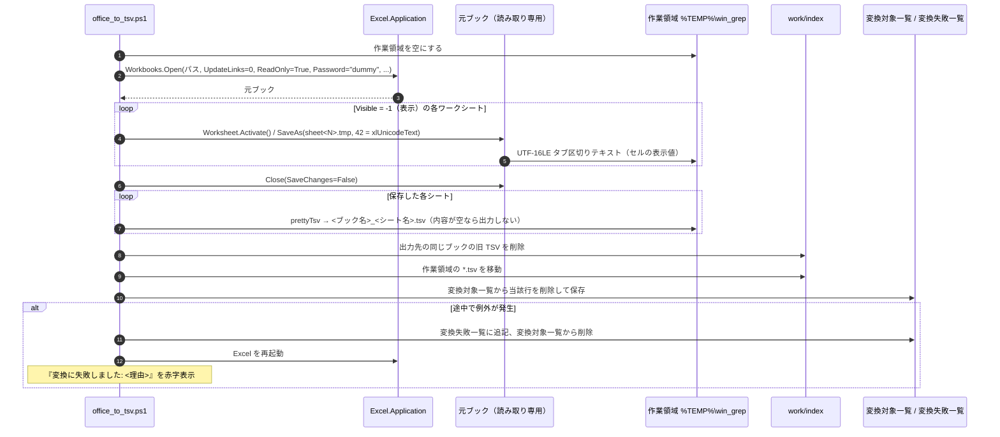
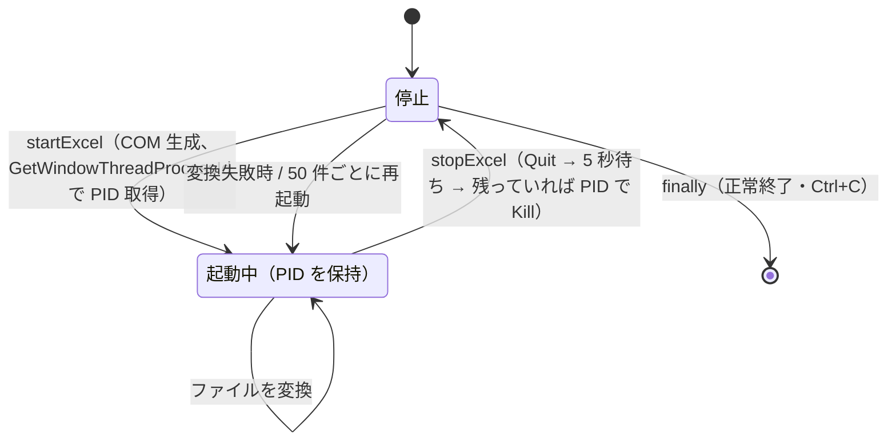
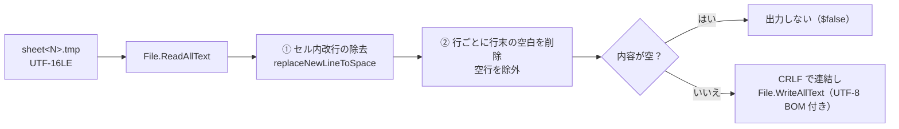

# 変換（インデックス作成）設計書

| 項目 | 内容 |
|---|---|
| 起動用バッチ | `1_変換.bat` |
| スクリプト | `scripts/office_to_tsv.ps1` |
| 使用する共通関数 | `getTargetFolder` / `readListFile` / `writeListFile` / `toSafeFileName` / `prettyTsv`（[00_index.md](00_index.md#5-共通モジュール-scriptscommonps1)） |

全体構成・動作環境・フォルダ構成は [00_index.md](00_index.md) を参照。

---

## 1. 概要

`config/変換対象フォルダパス.txt` に記載したフォルダ配下の Excel ファイルを、Excel の COM 操作でシートごとに TSV へ変換し、`work/index/` に保存する。

- 変換済みで更新の無いブックはスキップする（差分変換）。
- Ctrl+C で中断した場合、次回実行時は未処理のファイルから再開する。
- 変換に失敗したファイルは `work/変換失敗一覧.txt` に記録し、次回実行時に失敗分のみ再変換できる。

## 2. 入出力

| 区分 | パス | 内容 |
|---|---|---|
| 入力 | `config/変換対象フォルダパス.txt` | 変換対象フォルダ（3 章） |
| 入力 | 変換対象フォルダ配下の Excel | `.xlsx` `.xlsm` `.xls` `.xlsb` |
| 入出力 | `work/変換対象一覧.txt` | 未処理ファイルの相対パス（途中状態） |
| 入出力 | `work/変換失敗一覧.txt` | 変換に失敗したファイルの相対パス |
| 作業領域 | `%TEMP%\win_grep\` | 変換途中のファイル。終了時に空にする |
| 出力 | `work/index/<相対フォルダ>/*.tsv` | シートごとの TSV（6 章） |

---

## 3. 設定ファイル `config/変換対象フォルダパス.txt`（`getTargetFolder`）

- 変換対象 Excel のルートフォルダを **1 行だけ** 記載する（空行・前後の空白は無視。読み込み規則は [00_index.md](00_index.md#4-設定ファイルの共通読み込み規則readconfiglines) を参照）。
- 前後の `"` も取り除く（エクスプローラーの「パスのコピー」をそのまま貼り付けられる）。
- 有効行が 1 行でない場合は例外: `変換対象フォルダパス.txt は１行だけ記載してください。（現在 N 行）`
- フォルダが存在しない場合は例外: `変換対象フォルダが見つかりません: <パス>`

---

## 4. 処理フロー

### 4.1 メインフロー


- Excel は 1 プロセスを使い回し、50 ファイルごと・変換失敗時に再起動する（メモリ肥大化・不安定化の対策）。
- Ctrl+C で中断した場合も `finally` で Excel の終了と作業領域の削除が行われる。中断したファイルは変換対象一覧に残り、次回再変換される。
- 未捕捉の例外は `trap` で「＜エラー＞」として表示し、`pause` してから終了する。

表示する注意事項:

```
＜＜注意＞＞
・変換を中断する場合は Ctrl+C を押してください。（次回実行時に続きから再開します）
・ウィンドウの×ボタンで閉じると、Excelプロセスが残る場合があります。
  その場合は 9_Excel強制終了.bat を実行してください。
```

### 4.2 変換対象一覧の決定（中断・再開・再試行）


一時ファイルの状態遷移:


変換対象フォルダの検索条件（`createTargetList`）:

- 拡張子が `.xlsx` `.xlsm` `.xls` `.xlsb`（大文字・小文字を区別しない）
- ファイル名が `~$` で始まるもの（Excel のロックファイル）は除外
- アクセスできないサブフォルダは無視して続行
- **差分変換**: 出力先に `<ブック名>_*.tsv` があり、その最新の更新日時が元ファイルの更新日時以降なら「変換済み」としてスキップ
- 検索後に `Excelファイル N 件中、変換済み M 件をスキップします。` を表示

### 4.3 ファイル単位の変換処理



補足:

- 進捗は `[i/N] <相対パス>`、成功時は `N シートを変換しました。` を表示する。
- Excel は `Visible` / `DisplayAlerts` / `EnableEvents` / `ScreenUpdating` / `AskToUpdateLinks` を無効にし、`AutomationSecurity = 3`（マクロ無効）で起動する。
- パスワード付きブックはダミーのパスワードを渡して開くため、ダイアログを出さずに例外となり、変換失敗一覧に記録される。
- 対象は `Worksheets`（グラフシートは含まない）のうち `Visible = -1`（`xlSheetVisible`）のシート。`0`（非表示）と `2`（完全に非表示）は除外する。
- Excel は `[` `]` を含むパスに保存できないため、いったん `sheet<シート番号>.tmp` で保存し、`prettyTsv` で最終的なファイル名に書き出す。保存したファイルはブックを閉じるまで Excel がロックするため、整形はブックを閉じた後に行う。
- 出力先の旧 TSV を削除してから移動するため、シートの削除・名前変更がインデックスに反映される。
- Excel の終了（`stopExcel`）は `Quit()` と `ReleaseComObject` の後、5 秒以内にプロセスが終了しなければ、起動時に控えたプロセス ID で強制終了する。`GC.WaitForPendingFinalizers()` は COM の解放待ちで約 60 秒止まることがあるため使わない。

---

## 5. Excel プロセスの管理



---

## 6. 出力 TSV の仕様

### 6.1 配置・命名規則

```
work/index/<相対フォルダ>/<ブック名（拡張子あり）>_<toSafeFileName(シート名)>.tsv
```

| 元ファイル（変換対象フォルダからの相対パス） | シート名 | 出力 TSV |
|---|---|---|
| `2024/見積/A社.xlsx` | `明細` | `work/index/2024/見積/A社.xlsx_明細.tsv` |
| `売上.xls` | `2024_上期` | `work/index/売上.xls_2024_上期.tsv` |
| `[確定]見積.xlsx` | `記号<>` | `work/index/[確定]見積.xlsx_記号＜＞.tsv` |

変換対象フォルダのフォルダ構成が `work/index/` 配下にそのまま再現される。

### 6.2 ファイル名禁止文字の置換（`toSafeFileName`）

| 元 | `>` | `<` | `\` | `*` | `"` | `:` | `?` | `\|` | `/` |
|---|---|---|---|---|---|---|---|---|---|
| 置換後 | `＞` | `＜` | `￥` | `＊` | `”` | `：` | `？` | `｜` | `／` |

### 6.3 TSV 整形仕様（`prettyTsv` / `formatTsv`）



1. **セル内改行の除去**: Excel はセル内改行・`"` を含むセルを `"` で囲んで出力する。正規表現 `"[^"]*"` にマッチする範囲の CR/LF を**削除**し（スペースには置き換えない）、1 セルを 1 行に収める。
2. **行末の空白の削除・空行の除外**: 各行の末尾の空白・タブ（全角スペースを含む）を削除し、空になった行を除外する。行頭のタブ（先頭の空セル）は保持する。

整形後の TSV は「1 行 = Excel の 1 行（空行を除く）、セルはタブ区切り、改行 CRLF」となる。

入出力例（`\t` = タブ、`\r\n` = CRLF）:

```
入力:  a\tb\t\t\r\n\t\t\r\n\r\n"x\ny"\tz\r\n\t\r\nlast\t\r\n
出力:  a\tb\r\n"xy"\tz\r\nlast\r\n
```

---

## 7. 実装上の注意点・既知の問題

確度: ◎ = 動作確認済み、○ = コード上明らか、△ = 推定。

| # | 内容 | 確度 |
|---|---|---|
| 1 | 元ファイルの削除・リネームは `work/index` に反映されず、古い TSV が検索され続ける（再作成時は `work/` を削除する） | ○ |
| 2 | 変換対象一覧が残っている状態で `変換対象フォルダパス.txt` を変更しても、古い一覧（旧フォルダ基準の相対パス）のまま新フォルダに対して処理される | ○ |
| 3 | 可視シートが空のブックは TSV が作られないため、差分変換で毎回「未変換」と判定されて再変換される | ○ |
| 4 | パスワード付きブックは変換できない（変換失敗一覧に記録される）。「全ファイルを対象に変換」を選ぶと毎回再試行される | ◎ |
| 5 | ブック名に `.xls_` などを含む別ブックがあると（例: `a.xls` と `a.xls_b.xlsx`）、旧 TSV の削除・差分判定で `a.xls_*.tsv` が他方の TSV にもマッチする | ○ |
| 6 | ウィンドウの×ボタンで閉じた場合は `finally` が実行されず、Excel が残る（`9_Excel強制終了.bat` で終了する） | △ |
| 7 | 出力 TSV のフルパスが 260 文字を超えると .NET の制限で失敗し、変換失敗一覧に記録される | △ |
