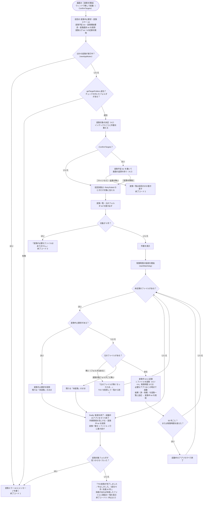

# 変換（インデックス作成）設計書 ― メインフローと変換一覧

本書は [01_変換.md](01_変換.md) の一部である。章・節の番号は 01_変換.md と分割した各ファイルで通し番号とし、各章がどのファイルにあるかは [01_変換.md](01_変換.md#ファイル構成) の表のとおり。

---

## 4. 処理フロー

### 4.1 メインフロー



- 利用者の入力を待つ処理（`pause`・`Read-Host`）は無い。画面がウィンドウ無し（`-WindowStyle Hidden`）で起動し、変換一覧・`work/変換中.txt` を読んで進み具合を表示する（[03_画面_1_インデックス管理タブ.md](03_画面_1_インデックス管理タブ.md)）。
- Excel・Word・PowerPoint は必要になったときに起動し、1 プロセスを使い回す。50 ファイルごと、および変換失敗時（失敗したファイルのアプリのみ）に終了し、次に必要になったときに起動し直す（メモリ肥大化・不安定化の対策）。
- **中止**: 画面の［中止］で `work/変換中止要求` が作成されると、次のファイルに進む前にそれを見つけて削除し、`finally` でアプリの終了・作業領域の削除・変換一覧の書き直しを行って終了コード 2 で終わる。変換中のファイルは最後まで変換してから止まる。残りのファイルは変換一覧で「未変換」のまま残り、次回変換される。前回の実行で残った中止要求は開始時に削除する（開始直後に中止されないため）。
- **強制終了**: PC の停止・プロセスの強制終了などで止まった場合は `finally` が実行されないが、変換一覧には 1 件ごとに結果を追記しているため、次回は未変換のファイルから再開する。強制終了したときに変換していたファイルは `work/変換中.txt` に残り、次回は最後に回す（4.2）。変換していたファイルのインデックスは、TSV を `work/変換出力/<PID>` に集めてからフォルダごと入れ替えるため（`publishIndexFiles`）、「前回のインデックスがそのまま」か「今回の分がそろった状態」のどちらかになり、一部のシートだけが入ったインデックスは残らない。
- **二重に動かさない**: 同じツール（配置フォルダ）の変換は 1 つだけ動かす（`newAppMutex "convert"`）。画面は実行中の変換を見つけて進み具合を表示するため（[03_画面_1](03_画面_1_インデックス管理タブ.md)）、ここに来るのは画面を使わずに起動した場合。既に動いていれば `ほかの変換が実行中です。変換が終わってから実行してください。` として終了コード 1 で終わる。変換一覧・インデックスを 2 つのプロセスが同時に書き換えると、状態が食い違うため。ミューテックスはプロセスが終われば解放されるため、強制終了しても残らない。
- **変換の直前に元のファイルが無くなった**: 変換対象を調べてから実際に変換するまでの間に、元のファイルが移動・削除されることがある。「失敗」として記録すると、利用者が再変換を選ぶまで残ってしまうため、変換せずに TSV を削除して変換一覧から除く（`元のファイルが無くなったため、変換せずに一覧から除きます。`）。次回の検索でも見つからないため、結果は同じになる。
- **変換中に変換対象フォルダごと見えなくなった**: ネットワークの切断・USB メモリの取り外しなどで変換対象フォルダにアクセスできなくなった場合、そのまま続けると残りのファイルがすべて「失敗」になり、次に再変換を選ぶまでインデックスに入らない。そのため、残りを「未変換」のまま中止し、`work/変換エラー.txt` にメッセージを書いて終了コード 1 で終わる（`finally` は通るため、アプリの終了・変換一覧の書き直しは行う）。フォルダを使えるようにしてから変換すると、続きから変換する。
- **続けられないエラー**: 未捕捉の例外（変換対象フォルダが無い・チェックの付いたフォルダが無い・設定ファイルを読み込めない等）は `trap` でメッセージを `work/変換エラー.txt`（UTF-8 BOM 付き）に書き、終了コード 1 で終わる。画面がこのメッセージを表示する。開始時に前回の `work/変換エラー.txt` を削除するため、正常に終わったときは残らない。
- **進み具合の受け渡し**: 変換は進み具合を `work/変換進捗.txt` の 1 行（`<段階><TAB><処理済み><TAB><残り><TAB><失敗><TAB><いま行っていること>`。`writeConvertProgress`）に書き、画面はこの 1 行だけを 1 秒ごとに読む（[03_画面_1](03_画面_1_インデックス管理タブ.md)）。書くのは「1 ファイルの変換を始めるとき」と「段階が変わるとき」だけで、変換の速さには影響しない（実測: 読み取り 1 件あたり約 1 ミリ秒）。
  - 変換一覧（数万行になる）から画面が数え直す作り方では、1 回の読み直しに数秒かかり、毎秒読むと画面が固まる（5 万行で 1 回約 5.8 秒）。進み具合を 1 行にすると、この待ちが無くなる。
  - 段階は `準備`（変換対象を探している。件数はまだ分からない）・`確認`（数え終えて、画面で変換するかどうかを選ぶのを待っている）・`変換`（1 ファイルずつ変換中）・`仕上げ`（Office アプリの終了・変換一覧の書き直し）。**待ち時間が長くなりがちな「準備」「仕上げ」でも、何をしているか**（どのフォルダを探しているか・変換一覧を書き直しているか）**を書く**。
  - 変換が終わっても消さない（画面が終わり方（成功・失敗の件数）を読むため）。次の変換の開始時に上書きする。
- **変換前の確認**（`-ConfirmTargets`。画面から起動したとき）: 変換対象を数え終えたところで、インデックスごとの件数を `work/変換予定.tsv` に書き、段階を `確認` にして画面の返事を待つ（`waitForConvertApproval`）。画面が `work/変換開始要求` を作れば変換を始め（中身に `失敗分も再変換` があれば、前回失敗したファイルも対象に加える）、`work/変換中止要求` を作れば 1 件も変換せずに終了コード 2 で終わる。60 分待っても返事が無ければ取りやめる（画面を閉じた・落ちた場合に待ち続けないため）。返事を受け取ったら `work/変換予定.tsv`・`work/変換開始要求` を削除する。
  - 取りやめたときは、**変換一覧を前回の内容のまま書き直す**（今回の変換対象は記録しない）。「未変換」で記録すると、画面の表示が［続きから再開］になり、変換を中断したように見えるため。一方で、以前の形式からの移行・元ファイルが無くなった分の削除は済んでいるため、変換一覧そのものは書き直す。
- **ログ**: 表示内容は `Start-Transcript` で `work/変換ログ.txt` に記録する（実行ごとに上書き）。ウィンドウ無しで動くため、問題が起きたときはこのログで確認する。

### 4.2 変換一覧と変換対象の決定（差分・中断・再試行）

#### 変換一覧 `work/変換一覧.tsv`

変換対象フォルダ配下の Office ファイルを 1 ファイル 1 行で記録する。UTF-8（BOM 付き）・タブ区切りで、Excel でそのまま開ける。

```
変換対象フォルダ	C:\data\営業	営業
変換対象フォルダ	D:\old\2019年度	2019年度
相対パス	更新日時	サイズ	状態	TSV数	変換日時	エラー
営業\2024\見積\A社.xlsx	2025/01/10 12:34:56	10420	済	3	2026/09/19 10:00:35	
営業\空ブック.xlsx	2025/01/10 12:34:56	8578	済	0	2026/09/19 10:00:35	
営業\秘密.xlsx	2025/01/10 12:34:56	15360	失敗		2026/09/19 10:00:40	読み取りパスワードが設定されているため開けません（パスワード付きのファイルは変換できません）
2019年度\新規.docx	2026/09/18 09:00:00	20480	未変換			
```

| 列 | 内容 |
|---|---|
| 先頭の行 | `変換対象フォルダ<TAB><パス><TAB><インデックス名>`。変換対象フォルダ（チェックなしを含む）ごとに 1 行。以前の形式（`変換対象フォルダ<TAB><パス>` の 1 行だけ）も読める |
| 相対パス | `<インデックス名>\<変換対象フォルダからの相対パス>`（= `work/index` からの相対パス）。大文字・小文字は区別しない |
| 更新日時・サイズ | 検索時の元ファイルの更新日時（`yyyy/MM/dd HH:mm:ss`、`formatFileTime`）とバイト数。次回、これと比べて更新の有無を判定する |
| 状態 | `未変換`（変換待ち・中断）/ `済` / `失敗` |
| TSV数 | 作成した TSV の数（`済` のとき）。内容が空のファイルは `0` |
| 変換日時 | 変換（または失敗）した日時 |
| エラー | 失敗の原因（`describeConvertError` で例外から作る。4.7。タブ・改行はスペースにする） |

書き込み方（`writeStatusFile` / `addStatusRow` / `readStatusFile`）:

- 検索の後に全ファイルを書き出す（一時ファイル `変換一覧.tsv.tmp` に書いてから置き換える）。
- 変換中は 1 件ごとに結果の行を**末尾に追記**する。読み込み時は同じ相対パスの後の行を優先するため、途中で中断しても変換済みの結果は失われない。列数の合わない行（書き込み途中で強制終了した行）は無視する。
- 終了時（`finally`）に 1 ファイル 1 行に書き直す。変換処理が強制終了された場合は追記した行が重複して残るが、次回の検索時に書き直される。

#### 強制終了・時間切れからの再開

大量のファイルを変換すると、Office アプリが応答しなくなるファイル（壊れたファイル・非常に大きいファイル・表示されないダイアログで止まる等）で止まることがある。COM の呼び出しは応答が無いと戻らず、画面の［中止］（ファイルの切れ目で止まる）も効かないため、次の 2 つで同じファイルで止まり続けないようにする。

| 仕組み | 内容 |
|---|---|
| 1 ファイルの制限時間（`$fileTimeoutMinutes` = 10 分） | 別スレッド（Runspace。`startWatchdog`）で制限時刻を監視する。制限時間を過ぎたら、自分で起動した Office アプリ（`getApp` で PID を控えたもの。利用者のアプリは除く）を強制終了する。COM の呼び出しが例外で戻るため、そのファイルは `失敗`（エラー: `10 分以内に変換が終わらなかったため中止しました（Officeアプリを強制終了しました）`）とし、次のファイルへ進む。強制終了したアプリはすべて終了扱いにし、次に必要になったときに起動し直す |
| 変換中のファイルの記録（`work/変換中.txt`） | 1 ファイルの変換を始める前に `<回数><TAB><相対パス>` を書き（`writeConvertingFile`）、結果を変換一覧に追記した後に削除する（`removeConvertingFile`）。中止・続けられないエラーの場合も `finally` で削除する（回数に数えない）。PC が停止した・プロセスが強制終了された等の場合だけ残る |

次回の実行時（変換対象の決定の後、`readConvertingFile`）:

- `work/変換中.txt` のファイルが変換対象にあれば、変換対象の**最後に回す**（`前回、変換中に強制終了したファイルは最後に変換します: <相対パス>`）。他のファイルの変換が先に進む。
- そのファイルの変換を始めるときは、回数を 1 増やして記録する。続けて `$interruptLimit`（2）回強制終了したファイルは、応答しなくなるファイルとみなして `失敗`（エラー: `変換中に 2 回続けて強制終了されたため、変換を中止しました（…）`）とし、変換対象から除く。以降は他の失敗と同じく、画面で「失敗分も再変換する」を選ぶ（`-RetryFailed`）か元ファイルが更新されたときに変換し直す。
- 記録のファイルが変換対象に無い（変換済み・削除された等）場合は、記録を削除する。
