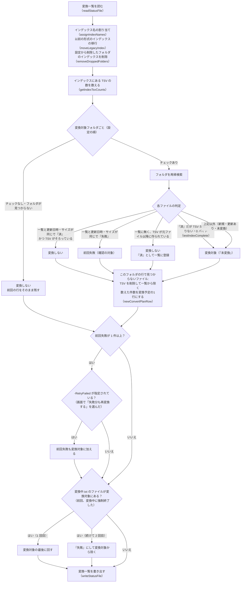
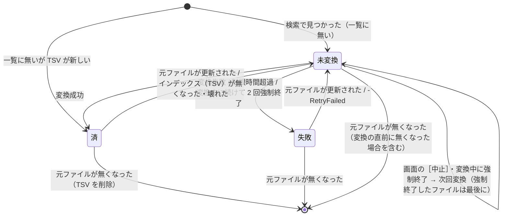

# 変換（インデックス作成）設計書 ― 変換対象の決定

本書は [01_変換.md](01_変換.md) の一部である。章・節の番号は 01_変換.md と分割した各ファイルで通し番号とし、各章がどのファイルにあるかは [01_変換.md](01_変換.md#ファイル構成) の表のとおり。

---

## 4. 処理フロー（続き）

### 4.2 変換一覧と変換対象の決定（続き）

変換一覧・強制終了からの再開は [01_変換_4_メインフローと変換一覧.md](01_変換_4_メインフローと変換一覧.md) を参照。

#### 変換対象フォルダとインデックス名

- **インデックス名**（`assignIndexNames` / `newIndexName`）: 変換対象フォルダごとの `work/index` 直下のフォルダ名。**設定（`setting.config` の `targetFolders[].name`）に持ち、フォルダの置き場所（`path`）とは分けて管理する**。
  - 設定に名前があればそれを使う。**フォルダの場所（`path`）を書き換えても名前は変わらないため、同じインデックスとして扱える**（インデックスも変換一覧の行もそのまま使うので、フォルダを移しただけなら再変換は起きない）。
  - 名前が無い場合（画面で新しく追加したフォルダ・以前の版の設定から移行した直後）は、前回の変換一覧に同じパスがあればその名前を使い、無ければフォルダ名（ドライブ直下はドライブ名、UNC の共有直下は共有名）を `toSafeFileName` したものにする。設定にある名前・前回使われた名前（削除したフォルダの名前を含む）と重なる場合は `名前(2)` `名前(3)` … とする。
  - 割り当てた名前は、変換の最初に設定へ保存する（`writeTargetFolders`。`インデックス名を設定に保存しました: …` と表示する）。以後は設定の名前が使われる。
- **以前の形式からの移行**（`moveLegacyIndex`）: 1 フォルダだけ扱っていた版のインデックスは `work/index` 直下にある。次のどちらかに当てはまれば、`work/index` を丸ごと `work/index/<インデックス名>` に移し（`以前の形式のインデックスを work\index\<インデックス名> に移しました。`）、変換一覧の相対パスの先頭にインデックス名を付ける。移したインデックスは下の「一覧に無いファイル」の規則で `済` として登録されるため、変換し直さない。
  - 変換一覧が以前の形式（インデックス名の無いフォルダの行）: そのフォルダのインデックスとみなす。そのフォルダが設定から削除されていれば移さず、`work\index 直下に、変換対象から外したフォルダ（<パス>）の以前の形式のインデックスがあります。不要なら削除してください。` と表示する。
  - 変換一覧が無く、`work/index` 直下にインデックス名のフォルダ以外（TSV など。`元のフォルダ.txt` は除く）がある: 変換対象フォルダの 1 件目のフォルダのインデックスとみなす。
- **フォルダごと移動した場合**: 変換対象フォルダを別のドライブ・共有フォルダへ移した場合は、**画面の［編集…］でそのインデックスの「元のフォルダ」を書き換えるだけでよい**（[03_画面_1_インデックス管理タブ.md](03_画面_1_インデックス管理タブ.md)）。インデックス名は変わらないため、インデックス（TSV）と変換一覧の行をそのまま使い、**移動しただけで全件再変換にならない**（次の変換では、更新されたファイルだけを変換する）。フォルダ名を変えて移した場合も同じで、名前はインデックス名として保たれる。
  - インデックスを削除して新しいパスで作り直すと、別のインデックス（新しい名前）になり、全件変換になる。移した場合は［編集…］を使う。
  - 検索結果から元のファイルを開くときにフォルダを選んだ場合も、同じ設定（インデックス名に対する場所）が書き換わるため、次の変換ではそのフォルダを変換する（[03_画面_2_検索タブ_1_元のファイルを開く.md 4.5.2](03_画面_2_検索タブ_1_元のファイルを開く.md#452-元のファイルが見つからないとき元のフォルダを設定する)）。
- **設定から削除したフォルダ**（`removeDroppedFolders`）: 前回の変換一覧にあって、今回どのフォルダにも使われていない**インデックス名**のインデックス（`work/index/<インデックス名>`）を削除する。名前で比べるため、移動を引き継いだインデックスは削除しない。
- **元のフォルダ.txt**（`writeSourceFolderFile`）: 変換一覧を書き出した直後（変換するファイルが無い場合も）、`work/index/<インデックス名>/元のフォルダ.txt`（そのインデックス 1 件分。フォルダがまだ無ければ書かない）に、インデックス名と変換対象フォルダの対応を書き出す。変換一覧は `work/` にあるため、インデックスのフォルダ（`work/index`）だけを別の PC・場所へコピーすると元のフォルダが分からなくなる。これを避けるため、インデックスのフォルダの中にも対応を置く。インデックス 1 件につき 1 ファイルのため、`work/index` ごとでも `<インデックス名>` のフォルダだけでもコピーできる。拡張子を `.tsv` にすると検索対象になるため `.txt` にする。以前の版は `work/index` 直下にも全インデックス分の 1 ファイルを書いていた。同じ内容が 2 か所にあるだけのため書くのをやめ、残っていれば各インデックスのフォルダへ移してから消す。画面での使い方は [03_画面_2_検索タブ.md](03_画面_2_検索タブ_1_元のファイルを開く.md#451-元のフォルダの特定インデックスを別の-pc場所で使う場合) を参照。
  ```
  # 検索結果から元のファイルを開くときに使う、インデックス名と変換対象フォルダの対応です（変換のたびに作り直します）
  営業<TAB>C:\data\営業
  D<TAB>D:\
  ```

#### 変換対象の決定（`createTargetList`）



- **更新の判定**: 更新日時（秒まで）とサイズのどちらかが変換一覧と異なれば「更新あり」。古い版に戻した場合も再変換される。
- **前の抽出版で変換したファイル**: 更新が無く `済` でも、変換一覧の「抽出版」がその形式の今の版（`getExtractVersion`）より小さければ変換し直す（`getConvertDecision` の `outdated`）。ツールの版を上げて読み取る内容が増えたとき（例: Excel の図形・コメント）、既存のインデックスにも反映するため。件数は「更新あり」に数える。前回 `失敗` のファイルは、抽出版によらず「前回失敗」のまま。
- **一覧に無いファイル**（初回・旧版からの移行後・変換一覧を削除した後）は、出力先の `<ファイル名>_*.tsv` の最新の更新日時が元ファイルの更新日時以降なら、変換せずに `済` として登録する（既存のインデックスを作り直さない）。
- **インデックスが無くなった・壊れているファイル**: 変換一覧が `済` でも、次のどちらかに当てはまれば変換し直す（`testIndexComplete`）。一覧だけを見ると `済` のままになり、検索しても出てこない状態が続くため。
  - インデックス（`work/index/<相対パス>/*.tsv`）が無い・記録した TSV 数より少ない（`work/index` のフォルダ・TSV を直接削除した場合）。
  - 0 バイトの TSV がある（書き込みの途中で電源が落ちた場合など）。空のシート・ページは保存しない（`prettyTsv` / `writeUnits`）ため、0 バイトの TSV は正常には作られない。
  - 1 ファイルずつ調べると件数の分だけ時間がかかるため、変換対象を調べる前に、インデックスのフォルダと TSV をそれぞれ 1 回ずつ列挙して数える（`getIndexTsvCounts`。大きさは列挙のときに分かる）。列挙できない場合（アクセス権が無い等）は確認しない。TSV 数を記録していない行（以前の形式）も確認しない。
  - TSV の**中身の書き換え**（手で編集した等、0 バイトでないもの）までは分からない。その場合は画面でインデックスを［削除］してから作成し直す（[03_画面_1](03_画面_1_インデックス管理タブ.md)）。
- **元ファイルが無くなったファイル**（削除・名前変更・移動）は、出力先の `<ファイル名>_*.tsv` を削除して一覧から除き、`元ファイルが無くなった N 件の変換結果（TSV）を削除しました。` を表示する。ただし、検索中にアクセスできないフォルダがあった場合は、見つからないだけの可能性があるため削除せず一覧に残し、その旨を表示する。
- 以前の版の途中状態ファイル（`work/変換対象一覧.txt`・`work/変換失敗一覧.txt`）が残っていれば削除する。
- フォルダごとに `  [<インデックス名>] <パス>` と、検索後に `  [<インデックス名>] Officeファイル N 件（変換済み A 件 / 新規 B 件 / 更新あり C 件 / 前回未完了 D 件 / 前回失敗 E 件）` を表示する。インデックスが無くなった・壊れているファイルがあるときだけ `/ 変換結果が無い・壊れている F 件` を付け、続けて `変換結果（TSV）が無くなった・壊れている F 件は変換し直します。（インデックスを直接削除した・0 バイトのTSVが残っている）` を表示する。チェックなしのフォルダは `… チェックなしのため変換しません（インデックスはそのまま残します）` と表示する。
- 変換中は `[i/N] <インデックス名>\<相対パス>` を表示する。元ファイルのパスは、相対パスの先頭のインデックス名から変換対象フォルダを引いて求める。

#### 変換予定 `work/変換予定.tsv`（画面の確認に出す件数）

`-ConfirmTargets`（画面から起動したとき）は、変換対象を決めた後、インデックスごとの件数を 1 行で書き出す（`newConvertPlanRow` / `writeConvertPlan`）。
画面はこれを読んで確認のダイアログを出す（[03_画面_1 の 3.4](03_画面_1_インデックス管理タブ.md#34-変換の確認ダイアログ)）。返事を受け取ったら削除する。

```
インデックス名	元のフォルダ	区分	ファイル数	変換対象	新規	更新あり	前回未完了	変換結果なし	前回失敗
営業	C:\data\営業	変換	1234	12	5	7	0	0	3
2019年度	D:\old\2019年度	チェックなし	0	0	0	0	0	0	0
```

- **区分**: `変換`（チェックが付いていて元のフォルダもある。数えた結果を書く）/ `チェックなし` / `フォルダなし`。後の 2 つは数えないため、件数はすべて 0。
- **変換対象** = 新規 ＋ 更新あり ＋ 前回未完了 ＋ 変換結果なし。**前回失敗**は含めない（画面の確認で「失敗分も再変換する」を選んだときだけ対象になる）。
- 書き込みの途中を画面に読ませないよう、一時ファイルに書いてから置き換える（`writeTextLinesAtomic`）。画面は読めなければ次の機会に読み直す。

変換一覧の各ファイルの状態遷移:



変換対象フォルダの検索条件（`findOfficeFiles`）:

- 拡張子が `.xlsx` `.xlsm` `.xls` `.xlsb` `.docx` `.docm` `.doc` `.pptx` `.pptm` `.ppt`（大文字・小文字を区別しない）。テンプレート（`.xltx` `.dotx` `.potx` 等）は対象外
- ファイル名が `~$` で始まるもの（Office のロックファイル）は除外
- アクセスできないサブフォルダは無視して続行（元ファイルが無くなったかどうかの確認は行わない）
- 相対パスは、実際に列挙したフォルダ（`Resolve-Path` で解決した `Root`。`findOfficeFiles` が返す）から `getPathUnderFolder` で求める。
  設定に書かれたパスとは書き方が違うことがあるため（末尾の `\`、`\\?\` 付き、`.` ・ `..` を含む、`/` 区切り）、パスの文字数では切り出さない

各ファイルは拡張子で変換方法を振り分ける（`convertFile`）。`.xls*` は 4.3（Excel、[01_変換_1_Excel.md](01_変換_1_Excel.md)）、`.doc*` `.ppt*` は 4.4（Word・PowerPoint 共通、本書）と 4.5（Word、[01_変換_2_Word.md](01_変換_2_Word.md)）・4.6（PowerPoint、[01_変換_3_PowerPoint.md](01_変換_3_PowerPoint.md)）。
進捗は `[i/N] <相対パス>`、成功時は `TSV N 件を作成しました。` を表示する。

> **4.3 Excel の変換処理（`convertWorkbook`）** → [01_変換_1_Excel.md](01_変換_1_Excel.md#43-excel-の変換処理convertworkbook)
