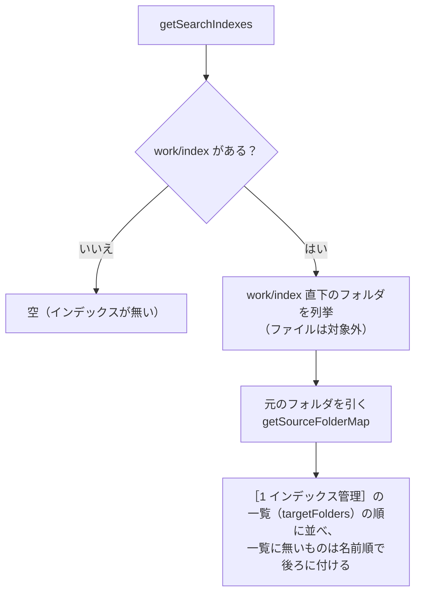
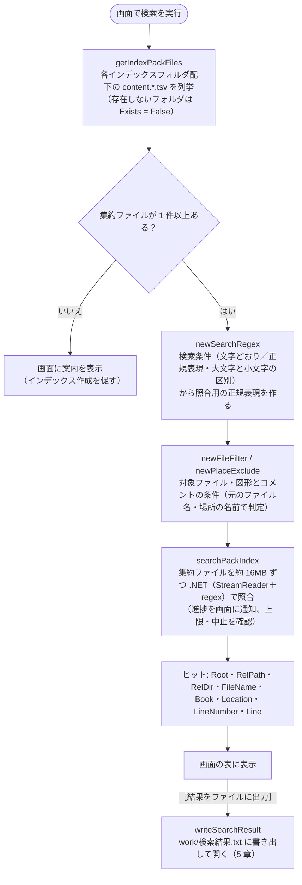
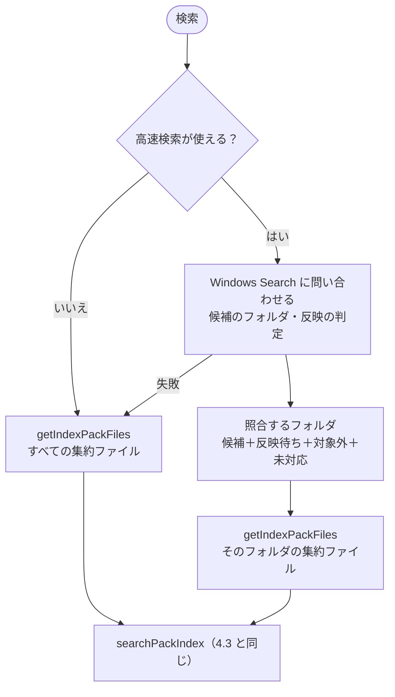
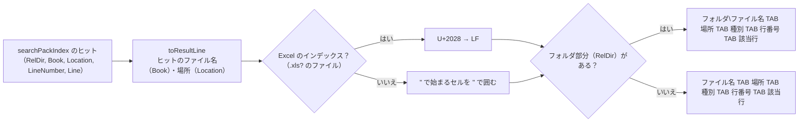
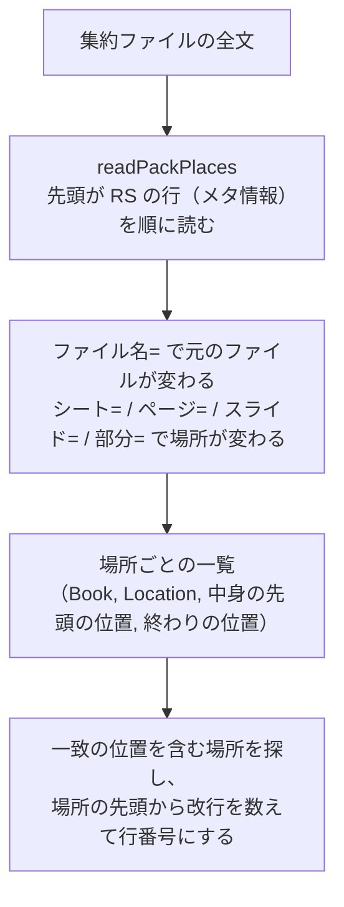

# 検索 設計書（検索処理・検索結果ファイル）

| 項目 | 内容 |
|---|---|
| 画面 | ［2 検索］タブ（[03_画面_2_検索タブ.md](03_画面_2_検索タブ.md)） |
| スクリプト | `scripts/tebunko_grep/search/search_query.ps1`（検索条件）・`pack_search.ps1`（集約ファイルの列挙と検索）・`search_run.ps1`（結果の組み立て）。`scripts/tebunko_grep/lib.ps1` から読み込み、画面 `scripts/tebunko_grep/gui.ps1` から呼ぶ |
| 使用する共通関数 | `getFastSearchPackFiles`（高速検索。4.4）/ `getIndexPackFiles` / `getSearchIndexes` / `searchPackIndex` / `writeSearchResult`（→ `toSearchResultLines` → `toResultLine` / `toResultHeader`）（[00_共通_2_共通モジュール.md](00_共通_2_共通モジュール.md#5-共通モジュール)） |

全体構成・動作環境・フォルダ構成は [00_index.md](00_index.md) を参照。インデックス（集約ファイル）の作り方は [01_インデックス作成.md](01_インデックス作成.md) を参照。画面の操作・表示は [03_画面_2_検索タブ.md](03_画面_2_検索タブ.md) を参照。

---

## 1. 概要

画面の［2 検索］タブで入力したワードで、`work/index/` 配下のうち、画面の検索対象のツリーでチェックしたインデックス・フォルダの集約ファイル（[01_インデックス作成_7](01_インデックス作成_7_出力TSVと既知の問題.md#61-配置命名規則) 6.1）を検索する処理と、［結果をファイルに出力］で書き出す `work/検索結果.txt` の形式を定める。

## 2. 入出力

| 区分 | パス | 内容 |
|---|---|---|
| 入力 | 画面で入力したワード | 1 回の検索で 1 ワード |
| 入力 | `setting.config` の `searchExcludes` | 画面の検索対象のツリーでチェックを外したフォルダ（3 章、省略可） |
| 入力 | `work/index/**/content.*.tsv` | インデックス作成で書き出した集約ファイル（フォルダ・元のファイルの拡張子ごとに 1 つ） |
| 入力 | `work/system_index/**/システムインデックス*.txt`・`work/システムインデックスの状態.tsv` | 高速検索に使う システムインデックスとその状態（4.4。Windows Search に問い合わせる） |
| 出力 | `work/検索結果.txt` | 画面の［結果をファイルに出力］で書き出す検索結果（5 章）。出力ごとに上書き |

---

## 3. インデックスの一覧（`getSearchIndexes`）

検索対象は `work/index` に固定し、その直下のフォルダ 1 つをインデックス 1 つとして扱う。設定で場所を指定することはしない（［1 インデックス管理］で作ったインデックスは、すべてこの一覧に並ぶ）。



- 1 件を `@{ Name（インデックス名）; Path（インデックスのフォルダ）; SourcePath（元のフォルダ。分からなければ空） }` で返す。
- 別の場所・PC で作ったインデックスは、そのフォルダを `work/index` 直下に置けば一覧に並ぶ（[01_インデックス作成_5_クロール.md](01_インデックス作成_5_クロール.md)）。
- `work/index` が無ければ空を返す。`setting.config` は作成しない。
- 画面では、インデックス 1 件を一番上にしたツリーで、検索するインデックス・フォルダを選ぶ（[03_画面_2_検索タブ.md](03_画面_2_検索タブ.md) 4.8）。選んだ範囲は `getIndexPackFiles` に `@{ Root（インデックスのフォルダ `work/index`）; RelPath（`<インデックス名>` またはその下のフォルダ）; Recurse }` の配列で渡す。`Recurse` が `$false` なら、そのフォルダ直下の集約ファイルだけを列挙する。結果の相対パス（`RelPath`・`RelDir`）は `Root` から求めるため、フォルダを絞っても結果の形は変わらない。
- チェックを外したフォルダは `searchExcludes`（`@{ path（フルパス）; subfolders（$false は直下のファイルだけ） }` の配列）に保存する（`readSearchExcludes` / `writeSearchExcludes`）。無ければすべてを検索する。

---

## 4. 検索処理



- 集約ファイルはフルパスをキーにまとめるため、入れ子のフォルダを指定しても同じ集約ファイルを二重に検索しない。
- 検索は画面の別スレッドで行い、1 つの作業（集約ファイル約 16MB 分。4.3）を照合するたびに進捗を通知する。画面の中止ボタン（`shouldStop`）で中止でき、件数の上限（`limit`）に達したら打ち切る（上限・表示は [03_画面_2_検索タブ.md](03_画面_2_検索タブ.md)）。

### 4.1 検索仕様

| 項目 | 仕様 |
|---|---|
| 検索対象 | 各インデックスフォルダ配下（再帰）のうち、画面のツリーでチェックしたフォルダの集約ファイル `content.*.tsv`（3 章）。フォルダの順、フォルダの中は集約ファイルの名前（拡張子・番号）の順、集約ファイルの中は入れた順に検索する |
| 対象ファイル | 画面の「対象ファイル」（`setting.config` の `fileFilter`）を指定すると、**元のファイル名**（5.3 の Book。集約ファイルの `ファイル名=` の値）が一致する元のファイルだけを検索する（4.2）。空ならすべて |
| 図形・コメント | 既定は検索する。画面の［図形も検索］［コメントも検索］（`setting.config` の `includeShapes` / `includeComments`）をオフにすると、場所が `<元の場所>[図形]` / `<元の場所>[コメント]`（集約ファイルのメタ情報 `対象=図形` / `対象=コメント`）の中を検索しない（`newPlaceExclude`。Excel・Word・PowerPoint で共通の決まり。[01_インデックス作成_7](01_インデックス作成_7_出力TSVと既知の問題.md) 6.1「図形・コメントの場所」） |
| 長いパス | 列挙と検索（.NET の `DirectoryInfo`・`StreamReader`）には `\\?\` を付けたパスを渡す（`toLongPath`）。付けないと、約 248 文字を超えるフォルダの中を列挙できず、260 文字を超える集約ファイルを読めない。結果の相対パスは `\\?\` の無い形で扱う（[01_インデックス作成.md 6.1 節](01_インデックス作成_7_出力TSVと既知の問題.md#長いパス260-文字超の扱い)） |
| 読み込み文字コード | UTF-16LE（BOM があれば BOM に従う） |
| 読めない集約ファイル | 列挙した後に読めなくなった集約ファイル（インデックス作成中に削除された等）は飛ばして、検索を続ける。読み込み中の集約ファイルは、インデクサの置き換え・削除を妨げないよう共有モードで開く |
| 検索単位 | 集約ファイルの中身の 1 行（= 元の TSV の 1 行 = Excel の 1 行）。1 行に複数ヒットしても 1 件。メタ情報の行（先頭が RS）は検索しない。行番号は場所ごとに数え、Excel では場所のメタ情報の後の N 行目がシートの N 行目になる。行の区切りは LF（集約ファイルを書くときに CRLF・CR を LF にそろえる） |
| 数値のセル | Excel の数値は、シートで**表示されている形**でインデックスに入る。表示形式が「標準」の 12 桁以上の数値は指数表記（`4.90123E+12`）、「#,##0」のセルは桁区切り付き（`1,234,568`）のため、元の番号（`4901234567894`・`1234568`）では見つからない（[01_インデックス作成_1_Excel.md](01_インデックス作成_1_Excel.md#43-excel-の抽出処理extractworkbook) 4.3） |
| セル内改行 | インデックスでは U+2028 になっているため、正規表現の `.` や `\s` にマッチする（例: `1行目.2行目`）。改行をはさんだ文字列をそのまま連結したワード（`1行目2行目`）はヒットしない |
| マッチ方式 | 画面の［正規表現を使う］がオフなら文字どおり、オンなら正規表現として検索する。どちらも `newSearchRegex` で 1 つの正規表現にして照合し、画面の一致箇所の強調にも同じ正規表現を使う（4.2） |
| 大文字と小文字 | 既定は区別しない。画面の［大文字と小文字を区別］がオンなら区別する（全角の英字も同じ） |
| 不正な正規表現 | ［正規表現を使う］がオンでも、正規表現として不正なワード（`(` 単独など）は文字どおりの検索に切り替える（`searchPackIndex` の戻り値 `SimpleMatch` が `$true` になる） |
| 照合の時間切れ | 1 行の照合に 5 秒を超えた（正規表現によっては終わらなくなる）場合は、`正規表現の照合に時間がかかりすぎるため、検索を中止しました。正規表現を見直してください。` として検索を止める。集約ファイルの全文への照合が時間切れになったときは、その集約ファイルを 1 行ずつ照合し直す（4.3） |
| 複数フォルダ | 全フォルダの集約ファイルをまとめて検索する |

### 4.2 検索条件（サクラエディタの Grep にならう）

条件の考え方はサクラエディタの Grep（「英大文字と小文字を区別する」「正規表現」「ファイル」）にならう。インデックスは Office ファイルから作った集約ファイルなので、「ファイル」は集約ファイルの名前ではなく**元のファイル名**で判定する。

| 条件 | 実装（`newSearchRegex` / `newFileFilter`） | 例 |
|---|---|---|
| 文字どおり（既定） | ワードを `[regex]::Escape` して照合する | `(株)` は「(株)」だけに一致 |
| 正規表現 | ワードをそのまま正規表現として照合する | `見積.*確定` |
| 大文字と小文字を区別 | オフのときは `RegexOptions.IgnoreCase` を付ける。`CultureInvariant` も付ける（区別しないときの照合が 2 倍程度速くなる。日本語の照合結果は変わらない） | オンなら `ID` は `id` `Id` に一致しない |
| 対象ファイル | `;`（全角の `；` も可）で区切ったワイルドカード。`!`（全角の `！` も可）で始まるものは除外。`*` は任意の文字列、`?` は任意の 1 文字。`*` も `?` も無いものは部分一致。大文字と小文字は区別しない | `*.xlsx;見積;!*old*` は、.xlsx か名前に「見積」を含むファイルのうち、「old」を含まないもの |

### 4.3 検索の実装（速度）

集約ファイル（[01_インデックス作成_7](01_インデックス作成_7_出力TSVと既知の問題.md#61-配置命名規則) 6.1）の読み込みと照合、結果 1 件の作成は PowerShell から .NET を直接呼ぶ（`tebunko_grep/search/pack_search.ps1` の `searchPackIndex`／`searchPackFiles`。`FileStream`＋`StreamReader`＋`[regex]`。`Select-String` で 1 件ずつ結果を作ると件数が多いときに遅いため）。資産管理・EDR に注目されやすい実行時コンパイル（`Add-Type`／csc.exe）は使わない（[03_画面_6_実装とテスト.md 12.2](03_画面_6_実装とテスト.md#122-実行時コンパイルcscexeを使わない)。実測: 50 万行で約 0.6 秒）。

1 行ずつ PowerShell で照合すると、行数に比例して時間がかかる（1 行あたり十数マイクロ秒）。このため集約ファイルを丸ごと読み（改行は書くときに LF にそろえてある）、正規表現を全文に 1 回かける（.NET の中で走る）。**全文で一致しない集約ファイルは、そのまま飛ばす。** 一致したときだけ、メタ情報の行から場所ごとの範囲（元のファイル名・場所の名前・中身の先頭と終わりの位置）の一覧を作り（`readPackPlaces`）、一致の位置から元のファイル・場所・行番号を求める（5.3）。全文にかけてよいかは `getRegexScanMode` が正規表現の書き方から判定する。

| 判定 | 正規表現の例 | 照合のしかた |
|---|---|---|
| `lines` | 文字どおりのワード、`見積.*確定`、`^顧客`、`\d+-\w+` | 一致は必ず 1 行に収まるため、全文での一致の位置から行を切り出す（1 行ずつの照合はしない）。メタ情報の行の中の一致は捨てる |
| `filter` | `見積\s確定`、`[^,]+`、`a(?=b)`（改行に一致しうる・行の外を見る） | 全文で一致しない集約ファイルは読み飛ばし、一致したものだけ場所ごとに 1 行ずつ照合する |
| `scan` | `\Aabc`、`a(?!b)`、`(?i)abc`（全文では 1 行と結果が変わりうる） | 場所ごとに 1 行ずつ照合する |

- `^` `$` は全文用の正規表現に `Multiline` を付けて行の先頭・末尾に一致させる。判定は安全側に倒し、どの照合でも検索結果（行・行番号）は、元の TSV を 1 行ずつ照合したときと同じになる（`pack_search.Tests.ps1` で改行の種類・照合のしかたごとに突き合わせている）。
- 全文への照合が時間切れになった集約ファイルは、1 行ずつ照合し直す。
- 対象ファイル（`newFileFilter`）・図形とコメント（`newPlaceExclude`）の条件は、場所ごとに元のファイル名・場所の名前で判定し、当てはまらない場所の一致は結果に入れない（1 行ずつ照合するときは、その場所を照合しない）。

さらに、次の 4 つで待ち時間を減らしている。

| しくみ | 内容 |
|---|---|
| 並列検索 | 集約ファイルを、大きさの合計がおよそ 16MB になるまでまとめて 1 つの作業にし（`splitPackTasks`）、作業が 2 つ以上なら照合のプール（`WorkerPool`。コア数 − 1、1〜4）で並行して照合する。各スレッドには照合に要る関数（`searchPackFiles`・`readPackPlaces` など）と値だけを読み込む。結果は作業の順に取り込み、上限・中止・進み具合（1 つの作業を照合するたびに通知。件数は集約ファイルの数）の扱いは 1 スレッドのときと同じ |
| スレッドの使い回し | 画面は、検索の司令のスレッド（`SearchService`）を画面を開いている間 1 つだけ動かす。lib.ps1 の読み込みと照合のプールの用意（`newPackWorkerPool`）は、司令のスレッドを始めたときに 1 回だけ行い、検索のたびに行わない。検索 1 回は要求（`newSearchRequest`）として渡し、`invokeSearchRequest` が実行する。新しい要求を渡すと、前の要求の `Stop` を立てて取り消す（[7.3](00_共通_4_プロセスとスレッド.md#73-寿命)） |
| 列挙 | 集約ファイルの列挙（`getIndexPackFiles` → `getPackFiles`）は、.NET（`DirectoryInfo.GetFiles`）で `content.*.tsv` を 1 回で集め、更新日時・サイズも列挙のときに得る |
| 読んだ内容の使い回し | 画面は `newTsvTextCache` を 1 つ持ち、検索で読んだ集約ファイルの内容と場所の一覧を残す（上限 6,400 万文字＝約 128MB）。次の検索では、更新日時・サイズが列挙したときと同じ集約ファイルはファイルを開かない。書き直した集約ファイルは更新日時・サイズが変わるため読み直す。選択行のプレビュー（`readPackContext`）も同じ内容を使う。検索 1 回が終わるたびに、上限の 9 割を超えていれば、その検索で使わなかった内容を古いものから追い出す（`trimTsvTextCache`。[7.7](00_共通_4_プロセスとスレッド.md#77-gc-とメモリ)） |

**集約ファイルにする理由**: 検索の時間は、読むファイルの数でほぼ決まる。Microsoft Defender は、ファイルを初めて開くたびに検査し（実測で 1 ファイル約 11 ミリ秒）、検査済みとして覚えておけるのはおよそ 2 万ファイルまで。元のファイルの場所ごとの TSV を読んでいた前の版では、TSV が数万件になると初回の検索に数分〜10 分以上かかった。

実測（Windows PowerShell 5.1、4 コア・物理メモリ 8GB、Microsoft Defender は有効。画面と同じく、列挙から検索の終わりまで）:

| インデックス | 検索 | TSV（前の版） | 集約ファイル |
|---|---|---|---|
| 7,000 ファイル規模（TSV 6,412 件 → 集約ファイル 20 件・46MB） | 初回 | 30.0 秒 | 2.1 秒 |
| 同上 | 2 回目以降 | 1.3 秒 | 0.29 秒 |
| TSV 16 万件・1GB（→ 集約ファイル 502 件・1.1GB） | 初回 | 10 分超 | 38 秒 |
| 同上 | 2 回目以降 | – | 16〜18 秒 |

- 1GB の 2 回目以降は、読んだ内容の使い回しの上限（約 128MB）を超え、物理メモリ 8GB では OS のファイルキャッシュにも収まりきらないため、ディスクの読み込みの速さで決まる。

### 4.4 高速検索（Windows Search で先に絞る）

インデックスが大きいと、すべての集約ファイルを読んで照合するのに時間がかかる（1GB で初回 38 秒・2 回目以降 16〜18 秒。4.3）。そこで、Windows Search に「検索語を含みうるフォルダ」を先に絞らせ、その中の集約ファイルだけを 4.3 の方式で照合する（`tebunko_grep/search/fast_search.ps1` の `getFastSearchPackFiles`）。照合と結果の組み立ては 4.3 と同じため、**結果（行・行番号・順番・上限で切る位置）は、すべての集約ファイルを照合したときと同じ**になる。

**システムインデックス**: インデックス作成が、`work/index` の中のフォルダごとに、直下の集約ファイルの中身（メタ情報の行を除く）から、文字の 2-gram を英数字の語にした txt を `work/system_index` の同じ相対パスに作る（[01_インデックス作成_7](01_インデックス作成_7_出力TSVと既知の問題.md#68-システムインデックスsystem_index) 6.8）。Windows Search は語単位でしか一致を取らないため、本文をそのまま索引させると語の途中からの一致（`ニター` など）を落とす。2-gram の語なら、ワードを含む本文の txt には、ワードのすべての 2-gram が必ず入っている。

| 項目 | 仕様 |
|---|---|
| 使える条件（画面の「高速検索：使用可」） | Windows Search を開けて `work/system_index` が索引の対象であり、［正規表現を使う］がオフで、ワードに 2 文字以上の部分がある（`testFastSearchUsable`・`getFastSearchView`）。使えないときは 4.3 のとおりすべてを照合する |
| 語の作り方 | ワードを空白で区切り、2 文字以上の部分の隣り合う 2 文字を小文字にし、UTF-16LE の 4 バイトを 16 進にした語（`x` ＋ 8 桁）にする（`getSearchGrams`）。最大 16 個（多いときは均等に間引く。間引いても候補が増えるだけ） |
| 候補 | `CONTAINS(System.Search.Contents, '"x…" AND "x…"')` で、検索対象のフォルダの中の txt を探す。語の範囲で分けた txt（`システムインデックス_1.txt` …）は語ごとに問い合わせ、すべての語がどれかで見つかったフォルダを候補にする |
| 反映の判定 | txt が Windows Search に反映済み ⇔ `System.Search.GatherTime` が空でない（本文を読み終えた）かつ `System.DateModified` が txt の更新日時（UTC）を秒で切り捨てた値と同じ（Windows Search は秒未満を切り捨てて持つ。`testSystemIndexReflected`） |
| 照合するフォルダ | 候補、反映されていないフォルダ（状態ファイルの「反映待ち」）、対象外のフォルダ、対応済みでないインデックスの全体。これらのフォルダの集約ファイルを `getIndexPackFiles` で集め、`searchPackIndex` で照合する |
| すべてを照合する場合 | 使える条件を満たさない、状態ファイルを読めない、Windows Search への問い合わせに失敗した（時間切れ 10 秒を含む）、インデックス全体（ツリーの一番上より上）・別の場所のインデックス・無いフォルダを検索対象にした |
| 状態の整理 | 反映済みになった「反映待ち」の行は、検索のたびに状態ファイルから消す（書けなければ次の機会に回す） |



**`work/index` を Windows Search の対象から外す（推奨）**: 集約ファイル（`.tsv`）も索引の対象になっていると、Windows Search はその処理に時間を取られ、システムインデックスが索引されるまで（高速検索が効くまで）1 日以上かかることがある。外しても検索の結果は変わらない（集約ファイルは 4.3 の方式で読む）。ツールは Windows Search の設定を変えないため、利用者が［インデックスのオプション］で `work/index` を外す（README の「高速検索」）。

実測（合成データ: ブック 5.4 万・TSV 16 万・1GB、物理メモリ 8GB の PC。結果はすべて一致。集約ファイルにする前の版で、TSV を照合したとき。集約ファイルでは、すべてを照合しても初回 38 秒（4.3））:

| 検索 | すべてを照合 | 高速検索 |
|---|---|---|
| 0 件 | 650 秒 | 0.49 秒 |
| まれな語（3 件） | 602 秒 | 29.9 秒 |

よく出る語はほとんどのフォルダが候補になるため、速くならない（上限の 1 万件で打ち切るのは 4.3 と同じ）。
---

## 5. 出力仕様

### 5.1 出力フォーマット（`work/検索結果.txt`）

画面の［結果をファイルに出力］で、表示中の結果（絞り込み後）を書き出す。UTF-8（BOM 付き）、改行は CRLF。

```
【検索文字列　<ワード>】 <件数> 件
ファイル名<TAB>場所<TAB>種別<TAB>行<TAB>A<TAB>B<TAB>…（該当行の最大セル数分の列名）
<相対フォルダ\><ファイル名><TAB><場所><TAB><種別><TAB><行番号><TAB><該当行>
...

```

- `【検索文字列　…】` の空白は全角スペース。ブロックの後に空行を 1 行出力する。
- ファイル名は、インデックスフォルダからの相対フォルダ（= クロール対象フォルダからの相対フォルダ）付き。直下のファイルはフォルダ部分なし。
- **場所・種別** は、ヒットの `Location`（場所の名前。集約ファイルのメタ情報から組み立てる。5.3）を画面と同じ表示にしたもの（`describePlace`）。

  | 場所の名前（`Location`） | 場所 | 種別 |
  |---|---|---|
  | `売上`（Excel のシート） | `[シート] 売上` | セル |
  | `売上[図形]` | `[シート] 売上` | 図形 |
  | `売上[コメント]` | `[シート] 売上` | コメント |
  | `ページ003`（Word） | `[ページ] 3（目安）` | 本文 |
  | `ページ003[図形]` `ページ003[コメント]` | `[ページ] 3（目安）` | 図形 / コメント |
  | `文書[コメント]`（本文に参照の無い Word のコメント） | `[文書]` | コメント |
  | `スライド002[図形]` `スライド002[コメント]` | `[スライド] 2` | 図形 / コメント |
  | `ヘッダー・フッター` `脚注` | `[ヘッダー・フッター]` `[脚注]` | 本文 |
  | `スライド002（非表示）`（PowerPoint） | `[スライド] 2（非表示）` | 本文 |
  | `スライド002_ノート` | `[スライド] 2` | ノート |

  - Word のページは、Word が保存したときのページ区切りから数えた目安のため「（目安）」を付ける（[01_インデックス作成_2_Word.md](01_インデックス作成_2_Word.md) 7.2）。
  - Excel の図形・コメントは、該当行の 1 列目が図形の左上・コメントのセル番地、2 列目が文字（[01_インデックス作成_1_Excel.md](01_インデックス作成_1_Excel.md#67-excel-の図形コメントの読み取りreadxlsxobjectunits) 6.7）。
  - シート名にタブ・改行が入っている場合（Excel は付けられる）は、列・行が分かれないようスペースにする。
- **行番号** は場所の中の行番号（`searchPackIndex` の `LineNumber`。元の TSV の行番号と同じ）。Excel ではシートの行番号、Word・PowerPoint では場所（ページ・スライド等）の中で何行目か。
- **該当行** は、結果をすべて選択して Excel に貼り付けたとき、5 列目以降に元の列の順（5 列目 = A 列）でセルが並ぶように出力する。見出しの列名（A, B, C…）と行番号で、元のセル位置が分かる。
  - Excel: TSV の行をそのまま出力し、セル内改行（U+2028）だけを LF に戻す。改行を含むセルは Excel の出力時点で `"` で囲まれているため、貼り付けても 1 セル内の改行となり、右隣のセル・後続の行はずれない。このため結果ファイルをテキストエディタで開くと、改行を含むセルは複数行に見える。
  - Word・PowerPoint: 行（段落、または表の 1 行をタブ区切りにしたもの）は `"` で囲まれていない。Excel は `"` で始まるセルを囲みの `"` と解釈して後続がずれるため、`"` で始まるセルだけを `"` で囲み、中の `"` を `""` にする。途中に `"` を含むセルはそのままで、貼り付けても文字どおりになる。
- 見出しの列名の数は、ヒット行を Excel に貼り付けたときの最大セル数（`countTsvFields`。`"` で始まるセルは閉じる `"` までを 1 セルとする）。ヒットが 0 件のときは `ファイル名<TAB>場所<TAB>種別<TAB>行` と件数の見出し 2 行のみとなる。
- 画面の［コピー］も同じ形式（`toSearchResultLines`）でクリップボードに入れる。

出力例（`⏎` はセル内改行の LF）:

```
【検索文字列　りんご】 3 件
ファイル名	場所	種別	行	A	B	C	D
sub dir\old.xls	[シート] Sheet1	セル	3	古い形式 りんご
見積[確定].xlsx	[シート] 一覧	セル	12		りんご	100	"青森産⏎ふじ"
報告書.docx	[ページ] 2（目安）	本文	5	"""りんご""の出荷"
```

### 5.2 1 行の組み立て



### 5.3 ファイル名・場所の求め方（`readPackPlaces`）

ヒット 1 件の元のファイル名（Book）・場所（Location: シート名・ページ・スライド）・元のファイルのあるフォルダ（RelDir）は、次のように求める。

| 値 | 求め方 |
|---|---|
| RelDir | 集約ファイルのあるフォルダの、インデックスのフォルダ（`Root`）からの相対パス（`getPackFiles`） |
| Book | 一致した位置より前の、いちばん近い `ファイル名=` の値 |
| Location | 一致した位置を含む場所のメタ情報（`シート` / `ページ` / `スライド` / `部分`・`対象`・`非表示`）から組み立てた場所の名前（`convertPackMetaToPlace`。`見積[図形]`・`ページ001`・`スライド002（非表示）`・`スライド001_ノート` など。[01_インデックス作成_7](01_インデックス作成_7_出力TSVと既知の問題.md#61-配置命名規則) 6.1「集約ファイルの形式」） |
| LineNumber | 場所の中身の先頭から数えた行番号（場所のメタ情報の後の最初の行が 1） |



- 場所の一覧は、全文で一致したとき（と、読んだ内容を使い回すために残すとき）だけ作る。一致しない集約ファイルでは作らない（4.3）。
- 画面の選択行のプレビュー（`readPackContext`）も同じ一覧で、Book・Location が一致する場所の中から前後の行を取り出す（[03_画面_2_検索タブ.md](03_画面_2_検索タブ.md) 4.7）。
- 検索では TSV の相対パスを分解しない。TSV の名前の分解は、インデックス作成で以前の形式から移すとき（`migrateFlatIndex`）と集約ファイルに入れるとき（`getIndexFolderBooks`）だけに使う。

#### 以前の形式（フラット）の分解（`splitIndexFileName`）

インデックス作成で以前の形式の TSV を移すとき（`migrateFlatIndex`。[01_インデックス作成_7](01_インデックス作成_7_出力TSVと既知の問題.md#以前の形式フラットからの移行migrateflatindex) 6.1）、TSV の**ファイル名**を正規表現 `$indexFileNamePattern` で元のファイル名（book）と場所（sheet）に分解し、場所を `decodeIndexPlace` で元に戻す。

```
^(?:(?<book>.*\.(?:xls|doc|ppt)[a-z]?)_(?<sheet>[^_]*)|(?<book>.*?\.(?:xls|doc|ppt)[a-z]?)_(?<sheet>.*))\.tsv$
```

1. 前半: 場所は `_` を `%5F` に符号化してある（[01_インデックス作成.md](01_インデックス作成_7_出力TSVと既知の問題.md#62-場所の符号化encodeindexplace--decodeindexplace) 6.2）ため、**最後の `_`** で分ける。ファイル名に `.xls_` 等を含んでも正しく分かれる。
2. 後半: 以前の版の TSV（場所の `_` を符号化していない）で、最後の `_` の前が拡張子にならないものは、最短一致で最初の「拡張子_」で分ける。

| ファイル名（以前の形式） | book | sheet（場所） |
|---|---|---|
| `book.xlsx_Sheet1.tsv` | `book.xlsx` | `Sheet1` |
| `売上.xls_2024%5F上期%22.tsv` | `売上.xls` | `2024_上期"` |
| `コピー.xls_old.xlsx_Sheet1.tsv` | `コピー.xls_old.xlsx` | `Sheet1` |
| `macro.xlsm_A.tsv` | `macro.xlsm` | `A` |
| `報告書.docx_ページ001.tsv` | `報告書.docx` | `ページ001` |
| `旧.doc_ヘッダー・フッター.tsv` | `旧.doc` | `ヘッダー・フッター` |
| `提案.pptx_スライド003%5Fノート.tsv` | `提案.pptx` | `スライド003_ノート` |
| `売上.xls_2024_上期.tsv`（以前の版） | `売上.xls` | `2024_上期` |
| `other.tsv`（形式外） | `other.tsv` | （空） |

以前の版の TSV で、シート名に `.xlsx_` 等を含むもの（ブック `A.xlsx` のシート `old.xlsx_1` → `A.xlsx_old.xlsx_1.tsv`）は、ブック `A.xlsx_old.xlsx` のシート `1` と区別できないため前半で分けられる（再取り込みすると新しい名前になる）。
場所の付け方は [01_インデックス作成.md](01_インデックス作成.md) の 6.1・6.2 を参照。

---

## 6. 実装上の注意点・既知の問題

確度: ◎ = 動作確認済み、○ = コード上明らか、△ = 推定。

| # | 内容 | 確度 |
|---|---|---|
| 1 | 高速検索を使えないとき（4.4）は、検索のたびにすべての集約ファイルを照合するため、インデックス量に比例して時間がかかる（集約ファイル 46MB で初回 2.1 秒・2 回目以降 0.29 秒、1.1GB で初回 38 秒・2 回目以降 16〜18 秒。読んだ内容の使い回しは約 128MB まで。4.3） | ◎ |
| 1-2 | 初めて作った大きなインデックスは、Windows Search が システムインデックスを索引し終えるまで高速検索が効かない（その間は反映待ちのフォルダを照合するため、結果は欠けない）。`work/index` を Windows Search の対象から外すと早く終わる（4.4） | ◎ |
| 1-3 | ワードによく出る 2-gram しか無いときは、ほとんどのフォルダが候補になり、高速検索でも速くならない（4.4） | ◎ |
| 2 | 結果ファイルを Excel で開いたまま［結果をファイルに出力］すると、ファイルがロックされて書き込めない（画面に `検索結果.txt に書き込めません。…` と表示する） | ◎ |
