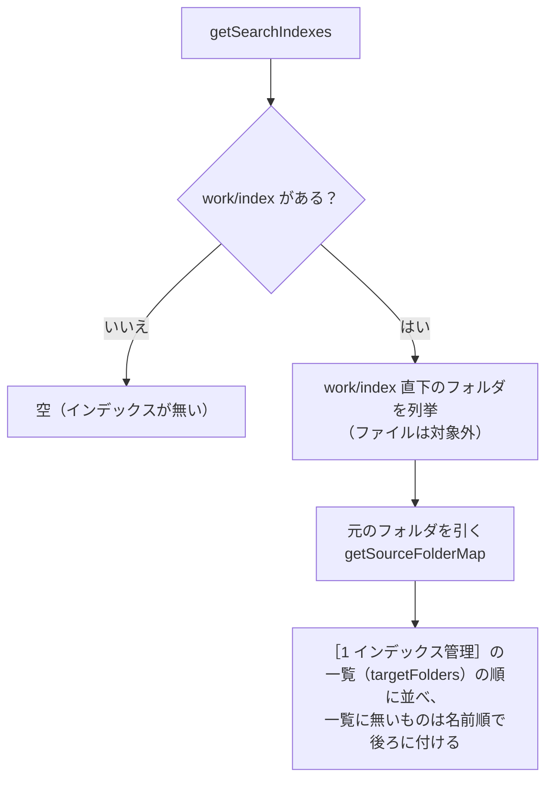
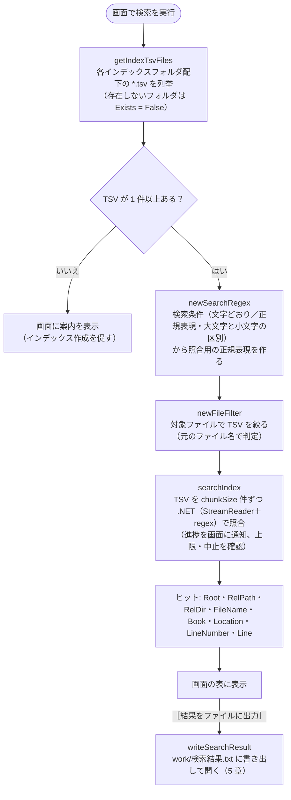
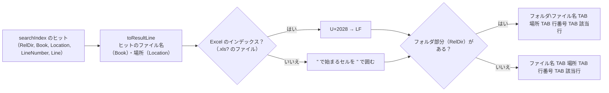
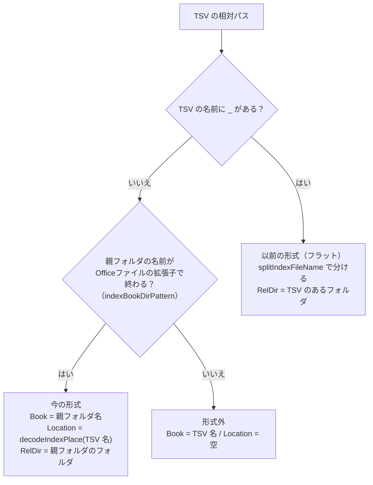

# 検索 設計書（検索処理・検索結果ファイル）

| 項目 | 内容 |
|---|---|
| 画面 | ［2 検索］タブ（[03_画面_2_検索タブ.md](03_画面_2_検索タブ.md)） |
| スクリプト | `scripts/tebunko_grep/lib.ps1`（画面 `scripts/tebunko_grep/gui.ps1` から呼ぶ） |
| 使用する共通関数 | `getIndexTsvFiles` / `getSearchIndexes` / `searchIndex` / `writeSearchResult`（→ `toSearchResultLines` → `toResultLine` / `toResultHeader`）（[00_共通_2_共通モジュール.md](00_共通_2_共通モジュール.md#5-共通モジュール)） |

全体構成・動作環境・フォルダ構成は [00_index.md](00_index.md) を参照。インデックス（TSV）の作り方は [01_変換.md](01_変換.md) を参照。画面の操作・表示は [03_画面_2_検索タブ.md](03_画面_2_検索タブ.md) を参照。

---

## 1. 概要

画面の［2 検索］タブで入力したワードで、`work/index/` 配下のうち、画面の検索対象のツリーでチェックしたインデックス・フォルダの TSV を検索する処理と、［結果をファイルに出力］で書き出す `work/検索結果.txt` の形式を定める。

## 2. 入出力

| 区分 | パス | 内容 |
|---|---|---|
| 入力 | 画面で入力したワード | 1 回の検索で 1 ワード |
| 入力 | `setting.config` の `searchExcludes` | 画面の検索対象のツリーでチェックを外したフォルダ（3 章、省略可） |
| 入力 | `work/index/**/*.tsv` | 変換で作成した TSV |
| 出力 | `work/検索結果.txt` | 画面の［結果をファイルに出力］で書き出す検索結果（5 章）。出力ごとに上書き |

---

## 3. インデックスの一覧（`getSearchIndexes`）

検索対象は `work/index` に固定し、その直下のフォルダ 1 つをインデックス 1 つとして扱う。設定で場所を指定することはしない（［1 インデックス管理］で作ったインデックスは、すべてこの一覧に並ぶ）。



- 1 件を `@{ Name（インデックス名）; Path（インデックスのフォルダ）; SourcePath（元のフォルダ。分からなければ空） }` で返す。
- 別の場所・PC で作ったインデックスは、そのフォルダを `work/index` 直下に置けば一覧に並ぶ（[01_変換_5_変換対象の決定.md](01_変換_5_変換対象の決定.md)）。
- `work/index` が無ければ空を返す。`setting.config` は作成しない。
- 画面では、インデックス 1 件を一番上にしたツリーで、検索するインデックス・フォルダを選ぶ（[03_画面_2_検索タブ.md](03_画面_2_検索タブ.md) 4.8）。選んだ範囲は `getIndexTsvFiles` に `@{ Root（インデックスのフォルダ `work/index`）; RelPath（`<インデックス名>` またはその下のフォルダ）; Recurse }` の配列で渡す。`Recurse` が `$false` なら、そのフォルダ直下の TSV と、直下の元のファイル名のフォルダ（`A社.xlsx\<場所>.tsv`）の中の TSV だけを列挙する。結果の相対パス（`RelPath`・`RelDir`）は `Root` から求めるため、フォルダを絞っても結果の形は変わらない。
- チェックを外したフォルダは `searchExcludes`（`@{ path（フルパス）; subfolders（$false は直下のファイルだけ） }` の配列）に保存する（`readSearchExcludes` / `writeSearchExcludes`）。無ければすべてを検索する。

---

## 4. 検索処理



- TSV はフルパスをキーにまとめるため、入れ子のフォルダを指定しても同じ TSV を二重に検索しない。
- 検索は画面の別スレッドで行い、`chunkSize` 件の TSV ごとに進捗を通知する。画面の中止ボタン（`shouldStop`）で中止でき、件数の上限（`limit`）に達したら打ち切る（上限・表示は [03_画面_2_検索タブ.md](03_画面_2_検索タブ.md)）。

### 4.1 検索仕様

| 項目 | 仕様 |
|---|---|
| 検索対象 | 各インデックスフォルダ配下（再帰）のうち、画面のツリーでチェックしたフォルダの `*.tsv`（3 章）。TSV はパス順に検索する |
| 対象ファイル | 画面の「対象ファイル」（`setting.config` の `fileFilter`）を指定すると、**元のファイル名**（5.3 の Book。今の形式では TSV のあるフォルダ名）が一致する TSV だけを検索する（4.2）。空ならすべて |
| 長いパス | 列挙（`Get-ChildItem`）と検索（.NET の `StreamReader`）には `\\?\` を付けたパスを渡す（`toLongPath`）。付けないと、約 248 文字を超えるフォルダの中を列挙できず、260 文字を超える TSV を読めない。結果の相対パスは `\\?\` の無い形で扱う（[01_変換.md 6.1 節](01_変換_7_出力TSVと既知の問題.md#長いパス260-文字超の扱い)） |
| 読み込み文字コード | UTF-8（BOM があれば BOM に従う） |
| 読めない TSV | 列挙した後に読めなくなった TSV（変換中に削除・置き換えられた等）は飛ばして、検索を続ける。読み込み中の TSV は、変換処理の書き込み・削除を妨げないよう共有モードで開く |
| 検索単位 | TSV の 1 行（= Excel の 1 行）。1 行に複数ヒットしても 1 件。Excel の TSV は N 行目がシートの N 行目なので、TSV の行番号がシートの行番号になる。行の区切りは CRLF・LF・CR |
| 数値のセル | Excel の数値は、シートで**表示されている形**でインデックスに入る。表示形式が「標準」の 12 桁以上の数値は指数表記（`4.90123E+12`）、「#,##0」のセルは桁区切り付き（`1,234,568`）のため、元の番号（`4901234567894`・`1234568`）では見つからない（[01_変換_1_Excel.md](01_変換_1_Excel.md#43-excel-の変換処理convertworkbook) 4.3） |
| セル内改行 | インデックスでは U+2028 になっているため、正規表現の `.` や `\s` にマッチする（例: `1行目.2行目`）。改行をはさんだ文字列をそのまま連結したワード（`1行目2行目`）はヒットしない |
| マッチ方式 | 画面の［正規表現を使う］がオフなら文字どおり、オンなら正規表現として検索する。どちらも `newSearchRegex` で 1 つの正規表現にして照合し、画面の一致箇所の強調にも同じ正規表現を使う（4.2） |
| 大文字と小文字 | 既定は区別しない。画面の［大文字と小文字を区別］がオンなら区別する（全角の英字も同じ） |
| 不正な正規表現 | ［正規表現を使う］がオンでも、正規表現として不正なワード（`(` 単独など）は文字どおりの検索に切り替える（`searchIndex` の戻り値 `SimpleMatch` が `$true` になる） |
| 照合の時間切れ | 1 行の照合に 5 秒を超えた（正規表現によっては終わらなくなる）場合は、`正規表現の照合に時間がかかりすぎるため、検索を中止しました。正規表現を見直してください。` として検索を止める |
| 複数フォルダ | 全フォルダの TSV をまとめて検索する |

### 4.2 検索条件（サクラエディタの Grep にならう）

条件の考え方はサクラエディタの Grep（「英大文字と小文字を区別する」「正規表現」「ファイル」）にならう。インデックスは Office ファイルから作った TSV なので、「ファイル」は TSV の名前ではなく**元のファイル名**で判定する。

| 条件 | 実装（`newSearchRegex` / `newFileFilter`） | 例 |
|---|---|---|
| 文字どおり（既定） | ワードを `[regex]::Escape` して照合する | `(株)` は「(株)」だけに一致 |
| 正規表現 | ワードをそのまま正規表現として照合する | `見積.*確定` |
| 大文字と小文字を区別 | オフのときは `RegexOptions.IgnoreCase` を付ける。`CultureInvariant` も付ける（区別しないときの照合が 2 倍程度速くなる。日本語の照合結果は変わらない） | オンなら `ID` は `id` `Id` に一致しない |
| 対象ファイル | `;`（全角の `；` も可）で区切ったワイルドカード。`!` で始まるものは除外。`*` は任意の文字列、`?` は任意の 1 文字。`*` も `?` も無いものは部分一致。大文字と小文字は区別しない | `*.xlsx;見積;!*old*` は、.xlsx か名前に「見積」を含むファイルのうち、「old」を含まないもの |

### 4.3 検索の実装（速度）

TSV の読み込みと照合、結果 1 件の作成は PowerShell から .NET を直接呼ぶ（`tebunko_grep/lib.ps1` の `searchTsvFiles`／`newTsvFiles`。`FileStream`＋`StreamReader`＋`[regex]`）。実行時コンパイル（`Add-Type`／csc.exe）は使わない（[03_画面_6_実装とテスト.md 12.2](03_画面_6_実装とテスト.md#122-実行時コンパイルcscexeを使わない)）。以前は `Select-String` で照合して 1 件ずつ結果を作っていたため件数が多いと遅く、次に C# 化したが、資産管理・EDR に注目されやすい実行時コンパイルを避けるため、.NET を直接呼ぶ PowerShell に移した（実測: C# の約 2.6 倍だが 50 万行で約 0.6 秒）。

1 行ずつ PowerShell で照合すると、行数に比例して時間がかかる（1 行あたり十数マイクロ秒）。このため TSV を丸ごと読み（改行は LF にそろえる）、正規表現を全文に 1 回かける（.NET の中で走る）。全文にかけてよいかは `getRegexScanMode` が正規表現の書き方から判定する。

| 判定 | 正規表現の例 | 照合のしかた |
|---|---|---|
| `lines` | 文字どおりのワード、`見積.*確定`、`^顧客`、`\d+-\w+` | 一致は必ず 1 行に収まるため、全文での一致の位置から行を切り出す（1 行ずつの照合はしない） |
| `filter` | `見積\s確定`、`[^,]+`、`a(?=b)`（改行に一致しうる・行の外を見る） | 全文で一致しない TSV は読み飛ばし、一致した TSV だけ 1 行ずつ照合する |
| `scan` | `\Aabc`、`a(?!b)`、`(?i)abc`（全文では 1 行と結果が変わりうる） | 従来どおり 1 行ずつ照合する |

- `^` `$` は全文用の正規表現に `Multiline` を付けて行の先頭・末尾に一致させる。判定は安全側に倒し、どの照合でも検索結果（行・行番号）は同じになる（`search_run.Tests.ps1` で 1 行ずつの照合と突き合わせている）。
- 全文への照合が時間切れになった TSV は、1 行ずつ照合し直す。64MB を超える TSV はメモリを使いすぎないよう 1 行ずつ読む。
- 検索前の準備（TSV の列挙・名前の分解）も、1 件ずつの関数呼び出しを省いている（1 万件で約 7 秒 → 約 1 秒）。

さらに、次の 3 つで待ち時間を減らしている。

| しくみ | 内容 |
|---|---|
| 並列検索 | TSV が 400 件以上なら、`chunkSize` 件ずつを別スレッド（RunspacePool。コア数、最大 8）で並行して検索する。各スレッドには `searchTsvFiles` だけを読み込む。結果は TSV の順に取り込み、上限・中止・進み具合の扱いは 1 スレッドのときと同じ |
| 並列の列挙 | TSV の列挙（`findTsvFilesParallel`）は、直下のフォルダごとに別スレッドで走査する。更新日時・サイズも列挙のときに得る（`FileInfo`） |
| 読んだ内容の使い回し | 画面は `newTsvTextCache` を 1 つ持ち、検索で読んだ TSV の内容を残す（上限 6,400 万文字＝約 128MB）。次の検索では、更新日時・サイズが列挙したときと同じ TSV はファイルを開かない。変換し直した TSV は更新日時・サイズが変わるため読み直す |

合成したインデックス（1 万ファイル・70MB・100 万行）での実測。画面と同じく、TSV の列挙から検索の終わりまで（上限 1 万件）:

| 検索 | 導入前 | 導入後（初回） | 導入後（2 回目以降） |
|---|---|---|---|
| 469 件ヒット（文字どおり） | 10.5 秒 | 2.2 秒 | 0.8 秒 |
| 0 件（文字どおり） | 9.8 秒 | 0.7〜0.9 秒 | 0.7〜0.9 秒 |
| 正規表現 `見積\d+\t請求`（1 万件で打ち切り） | 10.8 秒 | 1.2 秒 | 1.2 秒 |
| 大量ヒット（1 万件で打ち切り） | 8.1 秒 | 0.8 秒 | 0.8 秒 |

以前の、約 1 万ファイル・81MB のインデックスでの実測（キャッシュ済み）:

| 検索 | 以前（`Select-String`） | .NET 直接（`searchTsvFiles`） | 参考: サクラエディタ 2.4.3 の Grep |
|---|---|---|---|
| 85,740 件ヒット | 48 秒 | 約 2 秒 | 約 14 秒 |
| 180 件ヒット | 3.8 秒 | 約 3 秒 | 約 10 秒 |
| 0 件 | 7.2 秒 | 約 2 秒 | 約 12 秒 |

---

## 5. 出力仕様

### 5.1 出力フォーマット（`work/検索結果.txt`）

画面の［結果をファイルに出力］で、表示中の結果（絞り込み後）を書き出す。UTF-8（BOM 付き）、改行は CRLF。

```
【検索文字列　<ワード>】 <件数> 件
ファイル名<TAB>場所<TAB>行<TAB>A<TAB>B<TAB>…（該当行の最大セル数分の列名）
<相対フォルダ\><ファイル名><TAB><場所><TAB><行番号><TAB><該当行>
...

```

- `【検索文字列　…】` の空白は全角スペース。ブロックの後に空行を 1 行出力する。
- ファイル名は、インデックスフォルダからの相対フォルダ（= 変換対象フォルダからの相対フォルダ）付き。直下のファイルはフォルダ部分なし。
- **場所** はシート名・ページ・スライド（ヒットの `Location`。5.3）。Excel の図形・コメントは `<シート名>[図形]` `<シート名>[コメント]` で、該当行の 1 列目が図形の左上・コメントのセル番地、2 列目が文字（[01_変換_1_Excel.md](01_変換_1_Excel.md#67-excel-の図形コメントの読み取りreadxlsxobjectunits) 6.7）。シート名にタブ・改行が入っている場合（Excel は付けられる）は、列・行が分かれないようスペースにする。
- **行番号** は TSV の行番号（`searchIndex` の `LineNumber`）。Excel ではシートの行番号、Word・PowerPoint では場所（ページ・スライド等）の中で何行目か。
- **該当行** は、結果をすべて選択して Excel に貼り付けたとき、4 列目以降に元の列の順（4 列目 = A 列）でセルが並ぶように出力する。見出しの列名（A, B, C…）と行番号で、元のセル位置が分かる。
  - Excel: TSV の行をそのまま出力し、セル内改行（U+2028）だけを LF に戻す。改行を含むセルは Excel の出力時点で `"` で囲まれているため、貼り付けても 1 セル内の改行となり、右隣のセル・後続の行はずれない。このため結果ファイルをテキストエディタで開くと、改行を含むセルは複数行に見える。
  - Word・PowerPoint: 行（段落、または表の 1 行をタブ区切りにしたもの）は `"` で囲まれていない。Excel は `"` で始まるセルを囲みの `"` と解釈して後続がずれるため、`"` で始まるセルだけを `"` で囲み、中の `"` を `""` にする。途中に `"` を含むセルはそのままで、貼り付けても文字どおりになる。
- 見出しの列名の数は、ヒット行を Excel に貼り付けたときの最大セル数（`countTsvFields`。`"` で始まるセルは閉じる `"` までを 1 セルとする）。ヒットが 0 件のときは `ファイル名<TAB>場所<TAB>行` と件数の見出し 2 行のみとなる。
- 画面の［コピー］も同じ形式（`toSearchResultLines`）でクリップボードに入れる。

出力例（`⏎` はセル内改行の LF）:

```
【検索文字列　りんご】 3 件
ファイル名	場所	行	A	B	C	D
sub dir\old.xls	Sheet1	3	古い形式 りんご
見積[確定].xlsx	一覧	12		りんご	100	"青森産⏎ふじ"
報告書.docx	ページ002	5	"""りんご""の出荷"
```

### 5.2 1 行の組み立て



### 5.3 ファイル名・場所の分解（`splitIndexTsvPath`）

インデックスフォルダからの TSV の**相対パス**を、元のファイル名（Book）・場所（Location: シート名・ページ・スライド）・元のファイルのあるフォルダ（RelDir）に分解する。検索処理（`newTsvFiles`）も同じ規則で、ヒット 1 件ごとに同じ値を持たせる。



今の形式の TSV 名は場所だけで、場所の `_` は符号化されている（[01_変換.md 6.2 節](01_変換_7_出力TSVと既知の問題.md#62-場所の符号化encodeindexplace--decodeindexplace)）ため、**名前に `_` があるものが以前の形式**と分かる。別の PC へコピーした以前の形式のインデックスも、移行せずにそのまま検索できる。

#### 以前の形式（フラット）の分解（`splitIndexFileName`）

インデックスの**ファイル名**を正規表現 `$indexFileNamePattern` で元のファイル名（book）と場所（sheet）に分解し、場所を `decodeIndexPlace` で元に戻す（検索処理（`splitIndexTsvPath`・`decodeIndexPlace`）も同じ）。

```
^(?:(?<book>.*\.(?:xls|doc|ppt)[a-z]?)_(?<sheet>[^_]*)|(?<book>.*?\.(?:xls|doc|ppt)[a-z]?)_(?<sheet>.*))\.tsv$
```

1. 前半: 場所は `_` を `%5F` に符号化してある（[01_変換.md](01_変換_7_出力TSVと既知の問題.md#62-場所の符号化encodeindexplace--decodeindexplace) 6.2）ため、**最後の `_`** で分ける。ファイル名に `.xls_` 等を含んでも正しく分かれる。
2. 後半: 以前の版の TSV（場所の `_` を符号化していない）で、最後の `_` の前が拡張子にならないものは、最短一致で最初の「拡張子_」で分ける。

| ファイル名（以前の形式） | book | sheet（場所） |
|---|---|---|
| `book.xlsx_Sheet1.tsv` | `book.xlsx` | `Sheet1` |
| `売上.xls_2024%5F上期%22.tsv` | `売上.xls` | `2024_上期"` |
| `コピー.xls_old.xlsx_Sheet1.tsv` | `コピー.xls_old.xlsx` | `Sheet1` |
| `macro.xlsm_A.tsv` | `macro.xlsm` | `A` |
| `報告書.docx_ページ001.tsv` | `報告書.docx` | `ページ001` |
| `旧.doc_ヘッダー・フッター.tsv` | `旧.doc` | `ヘッダー・フッター` |
| `提案.pptx_スライド003%5Fノート.tsv` | `提案.pptx` | `スライド003_ノート` |
| `売上.xls_2024_上期.tsv`（以前の版） | `売上.xls` | `2024_上期` |
| `other.tsv`（形式外） | `other.tsv` | （空） |

以前の版の TSV で、シート名に `.xlsx_` 等を含むもの（ブック `A.xlsx` のシート `old.xlsx_1` → `A.xlsx_old.xlsx_1.tsv`）は、ブック `A.xlsx_old.xlsx` のシート `1` と区別できないため前半で分けられる（再変換すると新しい名前になる）。
場所の付け方は [01_変換.md](01_変換.md) の 6.1・6.2 を参照。

---

## 6. 実装上の注意点・既知の問題

確度: ◎ = 動作確認済み、○ = コード上明らか、△ = 推定。

| # | 内容 | 確度 |
|---|---|---|
| 1 | 検索のたびに全 TSV を読み直すため、インデックス量に比例して時間がかかる（約 1 万ファイル・81MB で 2〜3 秒。4.3） | ◎ |
| 2 | 結果ファイルを Excel で開いたまま［結果をファイルに出力］すると、ファイルがロックされて書き込めない（画面に `検索結果.txt に書き込めません。…` と表示する） | ◎ |
