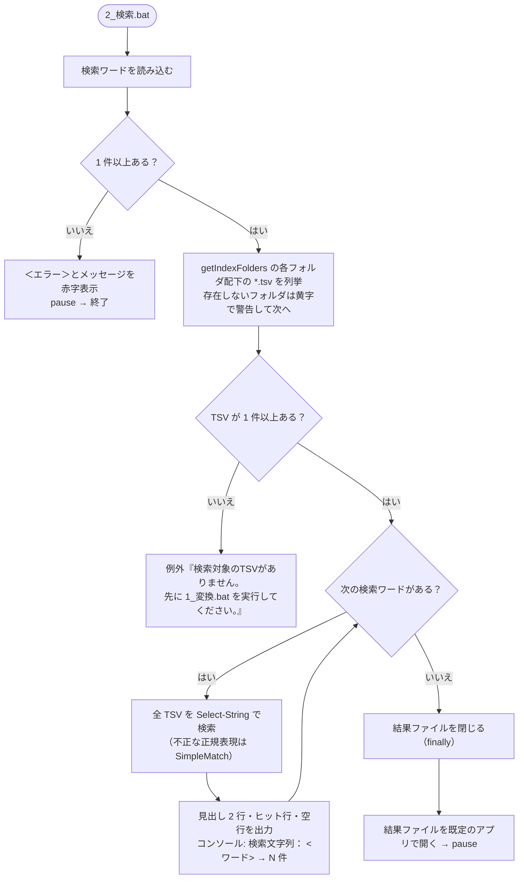

# 検索 設計書

| 項目 | 内容 |
|---|---|
| 起動用バッチ | `2_検索.bat` |
| スクリプト | `scripts/grep.ps1` |
| 使用する共通関数 | `readConfigLines` / `getIndexFolders` / `toResultLine`（→ `splitIndexFileName`）（[00_index.md](00_index.md#5-共通モジュール-scriptscommonps1)） |

全体構成・動作環境・フォルダ構成は [00_index.md](00_index.md) を参照。インデックス（TSV）の作り方は [01_変換.md](01_変換.md) を参照。

---

## 1. 概要

`config/検索ワード.txt` に記載したワードで `work/index/`（または `config/検索対象インデックスパス.txt` に記載したフォルダ）配下の TSV を検索し、結果を `output/検索結果.txt` に出力して開く。

## 2. 入出力

| 区分 | パス | 内容 |
|---|---|---|
| 入力 | `config/検索ワード.txt` | 検索ワード（3.1） |
| 入力 | `config/検索対象インデックスパス.txt` | 検索対象フォルダ（3.2、省略可） |
| 入力 | `work/index/**/*.tsv` | 変換で作成した TSV |
| 出力 | `output/検索結果.txt` | 検索結果（5 章）。実行ごとに上書き |

---

## 3. 設定ファイル

読み込み規則（Trim・空行除外・無ければ作成して例外）は [00_index.md](00_index.md#4-設定ファイルの共通読み込み規則readconfiglines) を参照。

### 3.1 `config/検索ワード.txt`

- 1 行 1 ワード。記載順に検索する。前後の空白は取り除く。
- 各ワードは `Select-String -Pattern` に渡すため、**正規表現**として解釈され、**大文字・小文字を区別しない**。
- **正規表現として不正なワード**（`(` 単独など）は、エラーにせず文字どおりの検索（`-SimpleMatch`）に切り替える。
- 有効行が 0 行の場合は例外: `検索ワード.txt に検索ワードを1行に1つ記載してください。`

### 3.2 `config/検索対象インデックスパス.txt`（`getIndexFolders`、省略可）


- 1 行 1 フォルダで複数指定できる。無い・空なら `work/index` を検索する。
- このファイルは存在しなくても自動作成されない（`readConfigLines` を呼ぶ前に存在確認するため）。

---

## 4. 処理フロー



- TSV を列挙するとき、各フォルダについて `検索対象フォルダ：<フォルダ>（TSV N 件）` を表示する。
- TSV はフルパスをキーにまとめるため、入れ子のフォルダを指定しても同じ TSV を二重に検索しない。
- 未捕捉の例外は `trap` で「＜エラー＞」として表示し、`pause` してから終了する。

### 4.1 検索仕様

| 項目 | 仕様 |
|---|---|
| 検索対象 | 各インデックスフォルダ配下（再帰）の `*.tsv`。TSV はパス順に検索する |
| 読み込み文字コード | UTF-8 |
| 検索単位 | TSV の 1 行（= Excel の 1 行）。1 行に複数ヒットしても 1 件 |
| マッチ方式 | 正規表現、大文字・小文字を区別しない（`Select-String` 既定） |
| 不正な正規表現 | 文字どおりの検索（`-SimpleMatch`）に切り替える |
| 複数ワード | ワードごとに独立して検索し、ワード順に出力（AND / OR 検索ではない） |
| 複数フォルダ | 全フォルダの TSV をまとめて検索する |

---

## 5. 出力仕様

### 5.1 出力フォーマット（`output/検索結果.txt`）

UTF-8（BOM 付き）、改行は CRLF。

```
【検索文字列　<ワード1>】 <件数> 件
ファイル名<TAB>シート名<TAB>該当行
<相対フォルダ\><ブック名><TAB><シート名><TAB><該当行（TSV の 1 行そのまま）>
...

【検索文字列　<ワード2>】 <件数> 件
ファイル名<TAB>シート名<TAB>該当行
...
```

- `【検索文字列　…】` の空白は全角スペース。各ワードのブロックの後に空行を 1 行出力する。
- ファイル名は、インデックスフォルダからの相対フォルダ（= 変換対象フォルダからの相対フォルダ）付き。直下のブックはフォルダ部分なし。
- 該当行は TSV の行をそのまま出力するため、Excel に貼り付けると 3 列目以降にセルが展開される。
- ヒットが 0 件のワードは見出し 2 行のみとなる。

出力例:

```
【検索文字列　りんご】 2 件
ファイル名	シート名	該当行
sub dir\old.xls	Sheet1	古い形式 りんご
見積[確定].xlsx	一覧	りんご	100
```

### 5.2 1 行の組み立て


### 5.3 ブック名・シート名の分解（`splitIndexFileName`）

インデックスの**ファイル名**（フォルダは含まない）を正規表現 `^(?<book>.*?\.xls[a-z]?)_(?<sheet>.*)\.tsv$` で分解する。

| ファイル名 | book | sheet |
|---|---|---|
| `book.xlsx_Sheet1.tsv` | `book.xlsx` | `Sheet1` |
| `売上.xls_2024_上期.tsv` | `売上.xls` | `2024_上期` |
| `macro.xlsm_A.tsv` | `macro.xlsm` | `A` |
| `other.tsv`（形式外） | `other.tsv` | （空） |

ブック名は最短一致で最初の `.xls?` までを取るため、シート名に `_` を含んでも正しく分解できる。

---

## 6. 実装上の注意点・既知の問題

確度: ◎ = 動作確認済み、○ = コード上明らか、△ = 推定。

| # | 内容 | 確度 |
|---|---|---|
| 1 | 検索ワードごとに全 TSV を読み直すため、ワード数 × インデックス量に比例して時間がかかる | ○ |
| 2 | 結果ファイルを Excel で開いたまま検索すると、ファイルがロックされて書き込みに失敗する（＜エラー＞表示） | △ |
