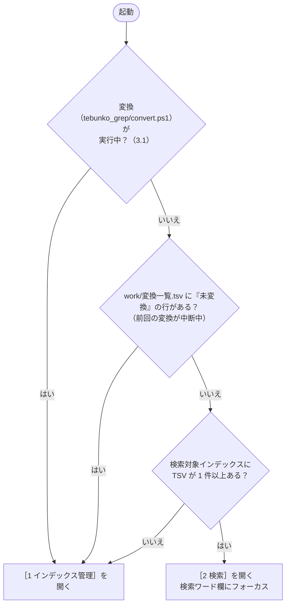

# 画面（GUI）設計書

| 項目 | 内容 |
|---|---|
| 状態 | **第 1・2 段階を実装済み**（[13 章](03_画面_6_実装とテスト.md#13-既存スクリプトへの影響と段階)）。第 3 段階は未実装 |
| 起動用バッチ | `tebunko_grep.bat`（名称は [14 章](03_画面_6_実装とテスト.md#14-未決事項) U1） |
| スクリプト | `scripts/tebunko_grep/gui.ps1`（処理）/ `scripts/tebunko_grep/xaml/tebunko_grep.xaml`（画面定義） |
| 使用する共通関数 | `writeListFile` / `readStatusFile` / `getSearchIndexes` / `splitIndexTsvPath` / `toResultLine` / `toResultHeader`（[00_共通_2_共通モジュール.md](00_共通_2_共通モジュール.md#5-共通モジュール)）、および本書で追加する関数（[12 章](03_画面_6_実装とテスト.md#12-実装構成)） |
| 起動する処理 | `scripts/tebunko_grep/convert.ps1`（[01_変換.md](01_変換.md)）をウィンドウなしで起動する。検索（[02_検索.md](02_検索.md)）とプロセス停止（[5 章](03_画面_3_プロセス停止タブ.md)）は画面内で実行する |

全体構成・動作環境・フォルダ構成は [00_index.md](00_index.md) を参照。

## ファイル構成

本設計書は次のファイルに分かれている。章・節の番号は各ファイルで通し番号。

| ファイル | 章・節 |
|---|---|
| [03_画面.md](03_画面.md)（本書） | 1. 概要、2. 画面構成 |
| [03_画面_1_インデックス管理タブ.md](03_画面_1_インデックス管理タブ.md) | 3. ［1 インデックス管理］タブ |
| [03_画面_2_検索タブ.md](03_画面_2_検索タブ.md) | 4. ［2 検索］タブ |
| [03_画面_2_検索タブ_1_元のファイルを開く.md](03_画面_2_検索タブ_1_元のファイルを開く.md) | 4.5 元のファイルを開く（［2 検索］タブ） |
| [03_画面_3_プロセス停止タブ.md](03_画面_3_プロセス停止タブ.md) | 5. ［9 プロセス停止］タブ |
| [03_画面_4_状態と操作の流れ.md](03_画面_4_状態と操作の流れ.md) | 6. 状態の判定と表示、7. 操作の流れ |
| [03_画面_5_共通仕様.md](03_画面_5_共通仕様.md) | 8. 設定ファイルの読み書き、9. キーボード操作、10. 表示・アクセシビリティ、11. メッセージ一覧 |
| [03_画面_6_実装とテスト.md](03_画面_6_実装とテスト.md) | 12. 実装構成、13. 既存スクリプトへの影響と段階、14. 未決事項、15. 既知の制約 |
| [03_画面_6_実装とテスト_1_テスト.md](03_画面_6_実装とテスト_1_テスト.md) | 16. テスト |

---

## 1. 概要

### 1.1 目的

以前は、利用者が `config/*.txt` をメモ帳で編集し、`.bat` を起動し、結果のテキストファイルを開いて確認していた。
この一連の操作を 1 つの画面で完結させる。特に、最も頻度の高い「ワードを入れて検索し、結果を見て、元のファイルを開く」操作を短くする。

### 1.2 利用場面

| 場面 | 頻度 | 以前の操作 | 困りごと | 本書での対応 |
|---|---|---|---|---|
| 初回の準備 | 1 回 | txt にパスを書き、`1_変換.bat` を実行 | どのファイルを編集するか分からない。パスを手入力する | フォルダ選択ダイアログ・ドラッグ＆ドロップ（3 章） |
| **検索** | **毎日・何度も** | `検索ワード.txt` を編集 → `2_検索.bat` → 結果ファイルを開く → 元のファイルを探して開く | txt・bat・結果ファイル・エクスプローラーを行き来する | ワードを入れて Enter。結果を画面の表で確認し、ダブルクリックで元のファイルの該当箇所を開く（4 章） |
| インデックスの更新 | 時々 | `1_変換.bat` | 最終変換日時や、中断・失敗が残っているかが見えない | インデックスの状態表示（3 章・6 章） |
| 残った Office の終了 | まれ | `9_Office強制終了.bat` で番号を入力 | どのプロセスが残っているか見えない | プロセスの一覧を見て終了する（5 章） |

### 1.3 設計方針

1. **作業単位でタブを分ける**。［1 インデックス管理］［2 検索］［9 プロセス停止］の 3 つとし、番号は以前の `.bat` と合わせる。
2. **検索は 1 ワードずつ、結果は画面に出す**。ワードを入れて Enter で検索し、結果を画面の表で確認する。表から元のファイルを開ける。
3. **保存を意識させない**。インデックスの作成・編集・削除・チェックの変更、検索オプションはその場で保存する。保存の操作は無い。
4. **状態を常に見せる**。インデックスの件数・最終変換日時・中断や失敗の有無・残っている Office プロセスを表示する。
5. **入力の誤りはその場で、文章で知らせる**。ダイアログではなく、入力欄の下に表示する。ダイアログは確認が必要な操作に限る。
6. **操作はすべて画面で行う**。設定ファイル（`setting.config`。8 章）は画面が読み書きするため、直接編集する必要は無い。

### 1.4 実装方式

**PowerShell 5.1 + WPF** とする。Windows 標準の .NET Framework 4.x に含まれるため、追加インストールは要らない。exe も作らない。

| 検討した方式 | 採否 | 理由 |
|---|---|---|
| WPF（XAML） | **採用** | 画面定義（XAML）とロジック（ps1）を分けられる。表（DataGrid）・一致箇所の強調など表現の自由度が高い |
| WinForms | 不採用 | 実装は簡単だが、座標指定のレイアウトで画面変更の手間がかかる |
| メニュー＋メモ帳 | 不採用 | 最小コストだが、結果の表示や状態表示ができない |
| Excel を画面にする | 不採用 | 読み込みが遅い。操作にマクロが要る |
| ローカル Web 画面（HttpListener） | 不採用 | ブラウザからフォルダのフルパスを取れない。この規模には過剰 |
| HTA（mshta） | 不採用 | 技術が古く、セキュリティ製品にブロックされやすい |
| C# で exe 化（csc.exe） | 不採用 | 自作 exe は SmartScreen 等に止められやすい |
| 実行時コンパイル（`Add-Type`／csc.exe） | 不採用 | `powershell.exe → csc.exe` と一時 DLL の生成は資産管理・EDR に注目されやすい（MITRE ATT&CK T1027.004）。画面の型は PowerShell class、検索は .NET 直接呼び出しにした（[03_画面_6_実装とテスト.md 12.2](03_画面_6_実装とテスト.md#122-実行時コンパイルcscexeを使わない)） |

### 1.5 範囲

| 機能 | 実行場所 | 備考 |
|---|---|---|
| インデックス作成（変換） | **別プロセス（ウィンドウなし）**（`tebunko_grep/convert.ps1`） | 時間がかかるため別プロセスで実行する。進み具合・［中止］・ログは画面に表示する（3 章） |
| 検索 | **画面内**（別スレッド） | `tebunko_grep/lib.ps1` の検索関数を使う（4.1）。結果ファイルへの出力は必要なときだけ行う（4.6） |
| プロセス停止 | **画面内** | `tebunko_grep/lib.ps1` の関数でプロセスを取得・終了する（5 章） |

---

## 2. 画面構成

### 2.1 ウィンドウ

| 項目 | 仕様 |
|---|---|
| 構成 | 1 ウィンドウ・3 タブ（［1 インデックス管理］［2 検索］［9 プロセス停止］） |
| 大きさ | 初期 960 × 680、最小 760 × 560。サイズ変更可。広げると結果の表・プロセスの表が伸びる |
| タイトル | `tebunko_grep` |
| 下部 | ステータス表示（直前の操作の結果）。閉じるのはタイトルバーの［×］で行う |
| 多重起動 | 名前付き Mutex で 1 つに制限する。2 つ目は、すでに開いている画面のウィンドウを前面に出して（最小化していれば元に戻して）終了する |
| 変換の開始 | ［変換を開始］は、まず変換対象を数え、インデックスごとの件数を確認するダイアログを出す（3.4）。更新が無いインデックスは `更新不要` と出る |
| 変換の実行後 | 変換はウィンドウなしの別プロセスで実行し、画面は閉じない。変換中も検索・強制終了のタブを使える |

### 2.2 起動時に開くタブ

- ［9 プロセス停止］タブは起動時に開かない。バックグラウンドの Office プロセスが残っていれば、タブ見出しに `⚠` を付けて知らせる（5.3）。
- 変換の失敗が残っているだけの場合は［2 検索］を開き、［1 インデックス管理］タブの見出しに `⚠` を付ける。
- TSV の有無は、最初の 1 件が見つかった時点で判定を打ち切る（件数は 6.3 のとおり別スレッドで数える）。

---
