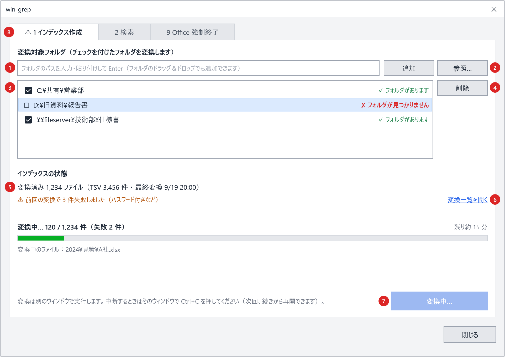

# 画面（GUI）設計書 ― ［1 インデックス作成］タブ

本書は [03_画面.md](03_画面.md) の一部である。章・節の番号は 03_画面.md と分割した各ファイルで通し番号とし、各章がどのファイルにあるかは [03_画面.md](03_画面.md#ファイル構成) の表のとおり。

---

## 3. ［1 インデックス作成］タブ

図は「前回の変換で失敗があり、変換を実行中」の状態。

| No. | 部品 | 仕様 |
|---|---|---|
| 1 | フォルダの追加 | パスを入力・貼り付けして Enter または［追加］で一覧に加える。前後の空白・`"`・末尾の `\` は取り除く（エクスプローラーの「パスのコピー」をそのまま貼れる）。入力欄・一覧へのフォルダのドラッグ＆ドロップでも追加できる。同じフォルダ（大文字・小文字の違いを含む）は追加しない |
| 2 | ［参照…］ | フォルダ選択ダイアログで選んだフォルダを一覧に加える。一覧で選択中のフォルダを初期位置にする。ダイアログはエクスプローラー形式で、アドレスバーや「フォルダー:」欄にパスを貼り付けて選べる（12 章） |
| 3 | 変換対象フォルダの一覧 | 1 行 1 フォルダ。**チェックを付けたフォルダだけを変換する**（チェックを外したフォルダは、登録したまま変換しない。インデックスは残る）。各行にはインデックス名（`[見積]` のように灰色で表示。まだ決まっていなければ空）・チェック・フォルダのパス・`✓ フォルダがあります` / `✗ フォルダが見つかりません` を表示する。一覧が空なら `変換する Office ファイルのあるフォルダを追加してください。` |
| 4 | ［削除］ | 選択中のフォルダを一覧から削除する（Delete キーでも同じ）。`このフォルダのインデックスも、次に変換したときに削除されます。一時的に変換しないだけなら、削除せずにチェックを外してください。` と確認する（既定のボタンは［いいえ］）。フォルダを移した場合は、削除して追加し直すのではなく No.9 の［場所を変更…］を使う（削除して追加すると別のインデックスになり、全件変換になる） |
| 5 | インデックスの状態 | `変換済み N ファイル（TSV M 件 ・ 最終変換 M/d H:mm）`。インデックスが無いときは `まだインデックスがありません。`。中断があれば次の行に表示する（6.1）。失敗は No.8 の一覧に表示する |
| 6 | 注意書き・実行ボタン | 注意書きは `変換中も検索できます。途中でやめるときは［中止］を押してください（次回、続きから再開できます）。`。ボタンは状態に応じて表示を変える（3.1）。押すと `office_to_tsv.ps1` をウィンドウなしで起動し、進み具合を表示する（3.3） |
| 7 | タブ見出し | 変換の失敗が残っているとき `⚠` を付ける |
| 8 | 変換に失敗したファイル | 変換一覧に状態が `失敗` の行があるときだけ表示する。見出しは `⚠ 変換に失敗したファイル N 件`。列は「ファイル」（相対パス）・「失敗の原因」（変換一覧のエラー列。[01_変換.md 4.7](01_変換_6_共通処理とアプリ管理.md#47-失敗の原因describeconverterror)）・「日時」。変換日時の新しい順に並べ、高さを超えたらスクロールする。行をダブルクリックすると、元のファイルをエクスプローラーで選択した状態で開く（ファイルが無ければフォルダを開き、ステータスに表示する）。変換中も、失敗が増えるたびに更新する。変換が終わったとき失敗があれば、進み具合の下に `失敗したファイルと原因は「変換に失敗したファイル」の一覧で確認できます。` と表示する |
| 9 | ［場所を変更…］ | No.4 の上に置く。**選択中のフォルダの「場所」だけを変える**（インデックス名はそのまま）。フォルダを別のドライブ・共有フォルダへ移したときに使う。フォルダ選択ダイアログ（初期位置は今のフォルダ、無ければその上の存在するフォルダ）で選び、`変換対象フォルダの場所を変えます。変更前：<今のパス> 変更後：<選んだパス> インデックス [<名前>] はそのまま使います（作り直しません）。次の変換では、更新されたファイルだけを変換します。変更しますか？` と確認する（既定は［はい］）。すでに一覧にあるフォルダを選んだ場合は `「<パス>」は既に変換対象フォルダにあります。` と出して変えない。変更したら設定に保存し、ステータスに `変換対象フォルダの場所を変えました（<パス>）` と表示する |

変換対象フォルダの追加・削除・チェックの変更・場所の変更は、その場で `setting.config`（`targetFolders`）に保存する（`writeTargetFolders`。チェックなしは `enabled` が `false`）。保存の操作は無い。

**インデックス名と場所は分けて持つ**（`targetFolders` の `name` と `path`）。`name` が `work\index` 直下のフォルダ名になり、インデックスの同一性を表す。`path` を書き換えても `name` は変わらないため、フォルダを移してもインデックスを作り直さない（[01_変換_5](01_変換_5_変換対象の決定.md#変換対象フォルダとインデックス名)）。名前はフォルダを追加した時点では空で、最初の変換で割り当てて保存する（そのため一覧のインデックス名は変換後に表示される）。

### 3.1 実行ボタンの表示

| 状態（6.1） | ボタン |
|---|---|
| 未作成・通常 | ［変換を開始］ |
| 中断中 | ［続きから再開（残り N 件）］ |
| 失敗あり | ［変換を開始］（中断中なら［続きから再開（残り N 件）］）。注意書きの前に `前回失敗したファイルがあります。変換を始めるときに、再変換するかを選べます。` を付ける。押すと次の確認を出す（既定のボタンは［いいえ］）：`前回変換に失敗し、その後更新されていないファイルが N 件あります（パスワード付きなど）。これらも再変換しますか？（「いいえ」の場合はスキップして、新しいファイル・更新されたファイルだけを変換します）`。［はい］は `-RetryFailed` を付けて起動し、［いいえ］は失敗分をスキップして起動する。［キャンセル］は起動しない |
| 変換中 | 無効。表示は `変換中…`。進み具合と［中止］を表示する（3.3） |
| チェックを付けた、存在するフォルダが無い | 無効。注意書きを `変換するフォルダを追加して、チェックを付けてください。` にする |

- 変換は `powershell -NoProfile -ExecutionPolicy Bypass -WindowStyle Hidden -File scripts\office_to_tsv.ps1 [-RetryFailed]` で起動する。ウィンドウは出さない（コンソールでの確認・`pause` は無い）。
- 「変換中」は、この画面から起動した変換のプロセスが終了するまでとする。変換の二重起動を防ぐ。
  - 画面の起動時と［変換を開始］を押したときは、このツールの `scripts\office_to_tsv.ps1` をコマンドラインに含む `powershell.exe` が動いていないかも調べる（`Win32_Process`）。動いていれば新たに起動せず、そのプロセスの進み具合を表示する。起動時に見つかった場合は［1 インデックス作成］タブを開く。

### 3.2 変換対象フォルダを変更したとき

確認は出さずにそのまま保存する。
変換一覧（`work/変換一覧.tsv`）の 1 行目には変換対象フォルダを記録しており、変換時に今のフォルダと異なれば変換一覧を作り直す（[01_変換.md 4.2 節](01_変換_4_メインフローと変換一覧.md#42-変換一覧と変換対象の決定差分中断再試行)）。
そのため、変更前のフォルダの相対パスのまま新しいフォルダを処理することはない。

### 3.3 変換の進み具合

変換はウィンドウなしで実行するため、画面は変換一覧（`work/変換一覧.tsv`）と変換中のファイルの記録（`work/変換中.txt`）を 1 秒ごとに読んで進み具合を表示する。
どちらも、変換側の書き込みを妨げないよう共有を許して読む（`readStatusFile` と同じ開き方）。

| 状況 | 判定 | 表示 |
|---|---|---|
| 変換対象の検索中 | 変換一覧が起動後に書き直されていない | 動き続けるバー。`変換対象のファイルを確認しています…` |
| 変換の開始前 | 書き直されたが、起動後に変換した行が無い | 動き続けるバー。`N 件のファイルを変換します`、`変換中のファイル：<相対パス>` |
| 変換中 | 起動後に変換日時が記録された行が 1 件以上ある | バー（処理済み ÷（処理済み＋未変換））、`変換中… 14 / 31 件（失敗 1 件）`、`残り約 N 分`（最初の 1 件が終わってからの速さで計算）、`変換中のファイル：<相対パス>` |
| 終わった | プロセスが終了した | 終了コードに応じて表示する（3.4）。状態・件数を読み直す |

- タスクバーのアイコンにも進み具合を表示する（失敗があれば黄色）。
- 「処理済み」は、変換日時が起動時刻以降の行（`済` または `失敗`）とする。前回失敗したファイルを再変換する場合（確認で［はい］）、その行は処理されるまで `失敗` のままなので、全体の件数は最後に増えることがある。

### 3.4 中止・終了・ログ

- 変換中は、進み具合の右に［中止］を表示する。押すと `変換を中止しますか？変換中のファイルが終わったところで止まります。次回は続きから再開できます。` と確認する（既定のボタンは［いいえ］）。［はい］で `work/変換中止要求`（`$stopRequestFile`）を作る。変換側は変換中のファイルが終わったところで止まり、終了コード 2 で終わる。終わるまでは `中止しています…（変換中のファイルが終わるまでお待ちください）` と表示する。
- プロセスが終わったら、終了コードに応じて次のように表示する。

| 終了コード | 表示 |
|---|---|
| 0 | `変換が終わりました（成功 N 件 / 失敗 M 件）`。失敗があれば `失敗したファイルと原因は「変換に失敗したファイル」の一覧で確認できます。` を加える。変換したファイルが無ければ `変換が必要なファイルはありませんでした` |
| 2（中止した） | `変換を中止しました（成功 N 件 / 失敗 M 件 / 残り K 件）`、`次回は続きから再開できます。` |
| 1（続けられないエラー。変換対象フォルダが無い など） | `work/変換エラー.txt`（`$convertErrorFile`）を読み、`変換できませんでした` とそのメッセージを表示する。同じ内容をエラーのダイアログでも出す |

- プロセスが終わると［ログを開く］を表示する。変換のログ `work/変換ログ.txt`（`$convertLogFile`。変換側の実行記録）を開く。
- 変換中にウィンドウを閉じようとすると、次の確認を出す（既定のボタンは［キャンセル］）：`変換中です。［はい］変換を中止してから閉じる（変換中のファイルが終わったところで止まります）［いいえ］変換を続けたまま閉じる（もう一度開くと進み具合を表示します）［キャンセル］閉じない`。［はい］は中止の要求ファイルを作ってから閉じる。［いいえ］は変換を続けたまま閉じ、次に画面を開くと実行中の変換を見つけて進み具合を表示する（3.1）。
