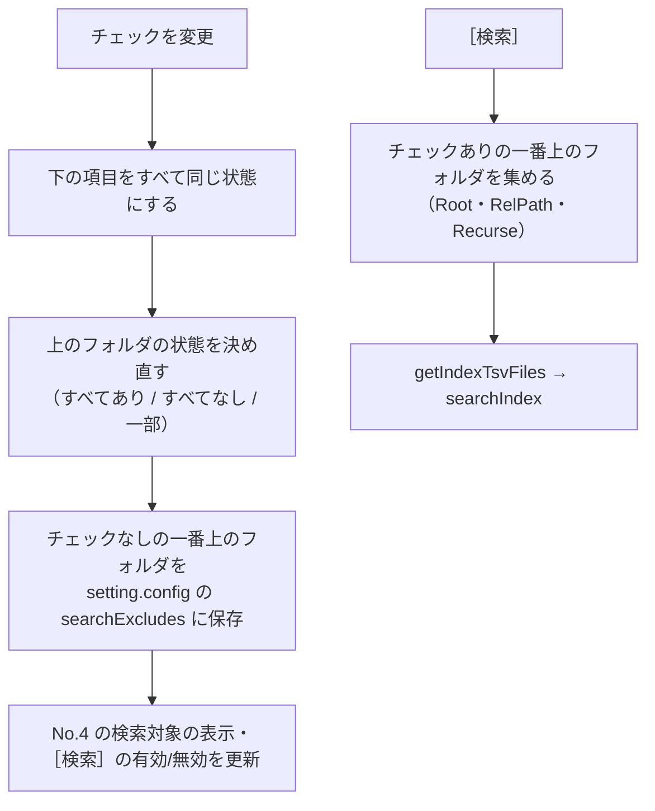

# 画面（GUI）設計書 ― ［2 検索］タブ

本書は [03_画面.md](03_画面.md) の一部である。章・節の番号は 03_画面.md と分割した各ファイルで通し番号とし、各章がどのファイルにあるかは [03_画面.md](03_画面.md#ファイル構成) の表のとおり。

---

## 4. ［2 検索］タブ

| No. | 部品 | 仕様 |
|---|---|---|
| 1 | 検索ワード | 1 行の入力欄。**1 ワードのみ**。Enter で検索する |
| 2 | ［検索］ | 主ボタン。検索ワードが空、検索対象の TSV が 0 件、または No.13 でチェックしたフォルダが無ければ無効。検索中は［中止］に変わる（4.1） |
| 3 | 検索条件 | 検索ワードの下の行。［□ 大文字と小文字を区別］［□ 正規表現を使う］［☑ 図形も検索］［☑ コメントも検索］と「対象ファイル」の入力欄（図形・コメントは既定でオン、ほかは既定でオフ・空）。サクラエディタの Grep の条件にならう（4.2）。正規表現がオンで、正規表現として不正なワードは入力欄の下に注意を出し、文字どおり検索する。対象ファイルの欄で Enter を押しても検索する |
| 4 | 検索対象 | No.13 のツリーで選んだ範囲。すべてチェックしているときは `検索対象：すべて（TSV N 件 ・ 最終取り込み M/d HH:mm）`、一部のときは `検索対象：2024、見積（直下のファイル） ほか 2 か所` のようにチェックしたフォルダを先頭の 3 か所まで表示する。何もチェックしていなければ `検索対象：なし（左の一覧で、検索するフォルダにチェックを付けてください）`。TSV が 0 件なら `先にインデックスを作成してください` と表示し、［1 インデックス管理］タブへ移動するリンクを付ける |
| 5 | 件数 | `N 件（M ファイル） ・ 0.4 秒`。検索中は `検索中… 450 / 1,234 ファイル`。絞り込み中は `N 件中 K 件を表示` |
| 6 | 絞り込み | 結果の中から文字列で絞り込む（4.4）。検索し直さずに結果を絞れる |
| 7 | 結果の表 | 元のファイルごとの見出しと、その下のヒットした行（フォルダ・ファイル名・場所・行・セル・該当行）。**検索した直後は見出しだけ**を出し、見出しのクリックで行を開く・閉じる（4.9）。一致箇所を黄色で強調する（4.3） |
| 8 | 選択行 | 選択した行と、その前後の行を No.9 に表示する。ダブルクリック・Enter で元のファイルの該当箇所を開く（4.5） |
| 9 | 選択行のプレビュー | 選択行とその前後の行を、シートのような表（行番号と列見出し A, B, C…）で表示する（出す行数は高さに合わせて増減する）。一致したセルを黄色で強調する。見出しの右の［Excel で開く］（Word・PowerPoint は［開く］）で元のファイルの該当箇所を開き、［フォルダを開く］でエクスプローラーを開く。セルをクリックして Ctrl+C で値をコピーでき、列見出しの右端のドラッグで列幅を変えられる。**行を選んでいなくても枠は常に表示する**（4.7） |
| 10 | ［結果をファイルに出力］ | 表示中の結果を `work/検索結果.txt`（[02_検索.md](02_検索.md) と同じ形式）に出力して開く（4.6） |
| 11 | ステータス表示 | `検索しました（<ワード>：N 件）` など（11 章） |
| 12 | タブ見出し | ［9 プロセス停止］タブ（5 章） |
| 13 | 検索対象のツリー | 画面の左側。**インデックスの一覧**（［1 インデックス管理］で作ったインデックス）と、その下のフォルダをチェック付きのツリーで表示し、**チェックしたインデックス・フォルダだけを検索する**（4.8）。下に［すべて選択］［すべて解除］を置く。左右の境目はドラッグで幅を変えられる |
| 14 | ［すべて展開］［すべて折りたたむ］ | 件数の行の右（No.6 の左）。すべてのファイルの行を開く・閉じる（4.9）。画面図（上の図）には未記載 |

### 4.1 検索の実行

- **検索処理は `tebunko_grep/lib.ps1` の関数**（`getIndexTsvFiles` / `searchIndex`、12 章）で行う。検索の仕様は [02_検索.md](02_検索.md) 4 章のとおり。
  - 検索対象：No.13 のツリーでチェックしたインデックス・フォルダ配下の `*.tsv`（4.8。フルパスで重複を除く。パス順）。結果のフォルダ（相対パス）は、選んだフォルダではなくインデックスのフォルダ（`work\index`）から求めるため、フォルダを絞っても結果の表示・元のファイルを開く動作は変わらない。
  - 読み込み：UTF-8。1 行単位。照合は No.3 の検索条件に従う（[02_検索.md](02_検索.md) 4.1・4.2 と同じ）。
- **別スレッド（Runspace）で実行**し、検索中も画面を操作できるようにする。
  - TSV を 50 ファイルずつ検索し、そのたびに進捗（No.5 のバーと `検索中… N / M ファイル（K 件）`、タスクバーのアイコン）と結果の表を更新する。見つかった結果から順に表示する。
  - 検索中は［検索］が［中止］に変わる（Esc でも中止）。中止した場合は、それまでの結果を残し、`中止しました（N 件まで表示）` と表示する。
- **件数の上限**：10,000 件（[14 章](03_画面_6_実装とテスト.md#14-未決事項) U3）。上限に達したら検索を打ち切り、`10,000 件を超えたため、ここで打ち切りました。この先のファイルは検索していないため、ワード・対象ファイル・検索対象で絞り込んでください。` と表示する。
  - TSV はパスの順に検索するため、打ち切った時点より後ろのファイルのヒットは結果に出ない（件数の多い順などで選ばれるわけではない）。利用者が「全部出ている」と誤解しないよう、メッセージでその旨を伝える。
- インデックス作成中でも検索できる。その場合、ステータスに `インデックス作成中のため、作成途中のインデックスを検索しています。` と表示する（U4）。

### 4.2 検索ワードの扱い

| 項目 | 仕様 |
|---|---|
| ワード数 | 1 つ。入力欄は 1 行。前後の空白は取り除く |
| 正規表現オフ（既定） | 文字どおりに検索する（`newSearchRegex` でワードをエスケープする）。`(株)` `1.5` `C++` などもそのまま探せる |
| 正規表現オン | 正規表現として検索する。`[regex]::new()` が失敗するワードは、入力欄の下に `正規表現として不正なため、文字どおり検索します。` と表示し、文字どおり検索する（[02_検索.md](02_検索.md) 4.1） |
| 大文字と小文字を区別 | オンなら英字の大文字と小文字を区別する（既定は区別しない） |
| 図形も検索・コメントも検索 | オフにすると、図形（場所 `<元の場所>[図形]`）・コメント（場所 `<元の場所>[コメント]`）を検索しない（既定はどちらもオン）。本文（セルの値・段落）だけを探したいときに使う。Excel・Word・PowerPoint で共通（PowerPoint のテキストボックス・図形の文字はスライドの本文なので、オフにしても検索する） |
| 対象ファイル | 元のファイル名で検索するファイルを絞る。`;` で区切り、`!` で始まるものは除外。`*` は任意の文字列、`?` は任意の 1 文字、どちらも無ければ部分一致（例: `*.xlsx;見積;!*old*`）。結果の上限（10,000 件）に達しやすいときに、検索前に対象を絞れる。一致するファイルが無ければ No.5 に `対象ファイル（<指定>）に一致するファイルがありません。` と表示する |
| 一致箇所の強調 | 結果の表・プレビューの強調には、検索と同じ正規表現（`newSearchRegex`）を使う。このため、大文字と小文字の区別も強調に反映される |
| 条件の表示 | 既定から変えた条件があれば、ステータスを `検索しました（<ワード>：N 件　条件：大文字と小文字を区別・対象ファイル：*.xlsx）` とする（図形・コメントをオフにしたときは `図形を除く` `コメントを除く`）。0 件のときは No.5 にも `見つかりませんでした。（検索条件：…）` と条件を出す |
| 設定の保存 | 各条件は `setting.config` の `useRegex` / `caseSensitive` / `fileFilter` / `includeShapes` / `includeComments` に保存し、次回も引き継ぐ（8 章）。チェックボックスはクリックしたとき、対象ファイルは欄からフォーカスが外れたときと検索したときに保存する |

正規表現を既定オフにするのは、業務文書によく出る表記が意図しない結果になるためである。

| 入力 | 利用者の意図 | 正規表現として検索した場合 |
|---|---|---|
| `(株)` | 「(株)」を探す | `( )` がグループとみなされ、「株」を含む行すべてにヒットする |
| `1.5` | 「1.5」を探す | `.` が任意の 1 文字とみなされ、「105」「1-5」にもヒットする |
| `C++` | 「C++」を探す | 正規表現として不正なので文字どおり検索になる |

### 4.3 結果の表

| 列 | 内容 | 例 |
|---|---|---|
| フォルダ | インデックスフォルダからの相対フォルダ（= クロール対象フォルダからの相対フォルダ）。直下は空欄 | `2024\見積` |
| ファイル名 | 元のファイル名（ヒットの `Book`。今の形式では TSV のあるフォルダ名） | `A社.xlsx` |
| 場所 | 種類と、シート名・ページ番号・スライド番号（`describePlace`。[02_検索.md](02_検索.md) 5.1）。Word のページは目安のため「（目安）」を付ける。並べ替えは TSV の名前（`Location`。`ページ003` のように桁をそろえてある）で行う | `[シート] 売上` / `[ページ] 3（目安）` / `[スライド] 2（非表示）` |
| 種別 | 行の中身の種類。Excel はセル・図形・コメント、Word・PowerPoint は本文・ノート。図形・コメントは、検索条件の［図形も検索］［コメントも検索］と同じ言葉 | `セル` / `図形` / `コメント` / `本文` / `ノート` |
| 行 | TSV の行番号（Excel では元のシートの行番号） | `5` |
| セル | Excel のみ。最初に一致したセル。図形・コメントの場所（`<シート名>[図形]` 等）は、図形の左上・コメントのセル（該当行の 1 列目。プレビューの列名は「セル」「文字」）。1 行の中で複数のセルが一致したときは、ほかの数を ` ほか N` で付ける。Word・PowerPoint は空欄 | `B5` / `B5 ほか 2` |
| 該当行 | TSV の 1 行。セルの区切り（タブ）は ` │ ` で表示する。Excel の図形・コメントの行（場所 `<シート名>[図形]` 等）は、先頭のセル番地を「セル」列に出すため除き、囲みの `"` を外した文字だけを出す（例: `納期は↵別途ご相談`。`HitRow.ShownText`）。一致箇所は黄色の背景・太字で強調する（正規表現オンのときは一致した範囲） | `見積先： │ (株)山田商事 │ 担当：佐藤` |

- 2 つ以上の検索対象インデックスのフォルダ（No.13 のツリーの一番上）から検索したときは、先頭に「インデックス」列（インデックスフォルダ名）を追加する。
- 表示順は既定でパス順（[02_検索.md](02_検索.md) 4.1 の検索順）。列見出しのクリックで並べ替える（もう一度で逆順。ファイルの中の行を並べ替え、ファイルの順もそれに合わせる。4.9）。
- 列幅は変えられる。該当行が長いときは末尾を `…` で省略し、ツールチップに全文を出す。
- 複数行を選択できる（Shift / Ctrl＋クリック）。
- Excel のセル内改行（取り込み時にマーカーへ置き換えたもの。[01_インデックス作成_1_Excel.md](01_インデックス作成_1_Excel.md) の 6.3）は `↵` で表示する。

### 4.4 絞り込み

- 入力のたびに（0.3 秒待ってから）、全列を対象に部分一致（大文字・小文字を区別しない）で絞り込む。
- 絞り込み中は No.5 に `N 件中 K 件を表示` と表示する。入力欄の右の `×` で解除する。
- 新しく検索すると絞り込みは解除する。

> **4.5 元のファイルを開く**（4.5.1 元のフォルダの特定・4.5.2 元のファイルが見つからないとき）→ [03_画面_2_検索タブ_1_元のファイルを開く.md](03_画面_2_検索タブ_1_元のファイルを開く.md#45-元のファイルを開く)

### 4.6 結果をファイルに出力

- 表示中の結果（絞り込み後）を `work/検索結果.txt` に出力し、既定のアプリで開く。
- 形式は [02_検索.md](02_検索.md) 5 章の結果ファイルの形式（`【検索文字列　<ワード>】 N 件`、`toResultHeader` の見出し行、`toResultLine` の各行）。出力は `tebunko_grep/lib.ps1` の関数（`toSearchResultLines` / `writeSearchResult`、12 章）で行う。
- 絞り込み中は、見出しの件数を表示中の件数とし、ステータスに `絞り込み後の K 件を出力しました` と表示する（U7）。
- ファイルが開かれていて書き込めないときは、ステータスに `検索結果.txt に書き込めません。開いているアプリを閉じてから、もう一度出力してください。` と表示する。

### 4.7 選択行のプレビュー

結果の表で行を選ぶと、表の下に**選択行とその前後の行**を表示する。元のファイルを開かなくても、一致した場所の周り（見出しの行・隣のセルなど）が分かる。

| 項目 | 仕様 |
|---|---|
| 表示・非表示 | **常に表示する**（行を選んでいなくても枠を出したままにする）。行を選ぶたびに表の高さが変わらず、次に選んだ行も同じ場所に出る。行を選んでいないときは、枠の中に `結果の表で行を選ぶと、ここにその前後の行を表示します。` と出し、［Excel で開く］［フォルダを開く］は押せない |
| 高さの変更 | 結果の表とプレビューの間の線を**上下にドラッグして高さを変えられる**（`GridSplitter`）。結果の表は 60px、プレビューは 100px（列見出し＋1 行が見える高さ）を下限とする。初めの高さは 200px。高さは画面を開いている間だけ保つ（設定には保存しない）。**高さを変えると、出す行数もそれに合わせて変わる**（下の「表示する行」） |
| 見出し | `<相対フォルダ\ファイル名> ・ <場所> ・ セル <B5>`（Excel）/ `… ・ <N> 行目`（Word・PowerPoint）。右に［Excel で開く］（Word・PowerPoint は［開く］）と［フォルダを開く］を置く。動作は 4.5 の［元のファイルを開く］・［フォルダを開く］と同じ |
| 表示する行 | **プレビューの高さに収まるだけ**（`getPreviewContextLines`）。表示できる行数を「行の表示領域の高さ ÷ 1 行の高さの目安 22px（`previewRowHeight`）」で求め、選択行の前後に同数ずつ割り当てる（余りの 1 行は後ろに付ける）。下限の高さでは**選択行の 1 行だけ**、高くするとその分だけ前後の行が見える。上限は 101 行（`maxPreviewRows`）。 高さを変えると（`PreviewScroll` の `SizeChanged`）読み直すが、ドラッグ中は何度も起きるため、選択の変更と同じ 120 ms のタイマーでまとめて 1 回だけ読む。このとき横スクロールの位置は変えない（ドラッグのたびに左へ戻らないようにするため） インデックスの TSV から該当の行だけを読む（`readTsvContext`、12 章）。Excel の TSV は N 行目がシートの N 行目なので、元のシートの前後の行になる。ファイルの先頭・末尾では、ある行だけを表示する |
| 読み込みの速さ | 巨大な TSV（100 万行のシートなど）でも画面が固まらないよう、次の 2 つを行う。 ・行の先頭位置を 1 ファイル分だけ覚えておき、同じ TSV の 2 回目以降は目的の行へ直接移動する（実測: 156MB・100 万行で、初めの 1 回は約 1.6 秒、2 回目以降は 0.01 秒未満。以前は選ぶたびに 2〜4 秒かかっていた）。TSV が書き換わったら（大きさ・更新日時が変わったら）読み直す ・↑↓で続けて選択が変わったときは、最後の選択の 120 ms 後に 1 回だけ読む |
| 表示する列 | 横に長い行（2,000 列など）をそのまま並べると画面が重くなるため、**一度に表示する列は 200 列まで**にする（`MaxPreviewColumns`）。一致したセルが真ん中に来るように範囲を選び、行の端に近ければその端に寄せる。省略したときは、プレビューの下に `表示は <BQG〜BXX> の 200 列（全 2,000 列）` と出す（`PreviewNote`）。ほかの列は元のファイルを開いて確認する 実測（2,000 列の行）: 行を選んでからプレビューが出るまで 約 2.8 秒 → 約 0.6 秒 |
| 表の形 | 左端に行番号、上に列見出し（Excel は A, B, C…、Word・PowerPoint はタブで分けた順の 1, 2, 3…）。セルの分け方は `splitTsvCells` と同じ（`"` で囲まれたセルは 1 セル） |
| 強調 | 選択行は行全体を薄い青にし、行番号を太字にする。一致したセルは黄色の背景・太字（前後の行で一致したセルも同じ） |
| 列の幅 | 初めの幅は、見出しと各行のセルの文字数（セル内改行のあるセルは最も長い行）から決める（Excel は最大 260px、段落が 1 列になる Word・PowerPoint は最大 640px）。**列見出しの右端をドラッグすると幅を変えられる**（下限 24px）。変えた幅はその表示の間だけ有効で、ほかの行を選ぶと初めの幅に戻る |
| セルの表示 | セル内改行のあるセルは改行のまま折り返して表示する（3 行程度まで。入りきらない分は隠れる）。1 行のセルも幅に入りきらなければ折り返す **長いセルは先頭 300 文字＋`…` で表示**し（`MaxCellChars`）、ツールチップは先頭 1,000 文字まで（`MaxToolTipChars`）。コピー（下の「値のコピー」）は切り詰めずに元の値をそのまま使う。列の幅を決めるときも各行の先頭 100 文字までしか見ない（`MaxWidthChars`。幅には上限があるため結果は変わらない） 実測（32,767 文字のセル）: 約 0.9 秒 → 約 0.4 秒 |
| 値のコピー | セルをクリックするとそのセルを選び（青い枠）、**Ctrl+C でその値をコピーする**。Shift＋クリック、またはドラッグで四角い範囲を選べる。右クリックメニューに［選んだセルをコピー］［この行をコピー］を置く ・1 セル：値をそのまま（引用符・エスケープなし）入れるので、ほかのアプリの入力欄にそのまま貼れる ・複数セル：タブ区切り・行は改行で入れる。改行・タブ・`"` を含むセルは `"` で囲む（Excel に貼り付けると元の位置に並ぶ） ・ステータスに `セルの値をコピーしました：<値>` / `N 個のセルをコピーしました（Excel に貼り付けると、元の位置に並びます）` と表示する |
| 縦スクロール | 出す行数は高さに合わせるが、セル内改行のある行は 1 行の目安（22px）より高いため入りきらないことがある。そのときは縦にスクロールする。**列見出しは行とは別のスクロールに置いて固定**し、縦スクロールで隠れないようにする（横位置は行に合わせる） |
| 横スクロール | 選択行で最初に一致したセルが見えないときは、そのセルが見える位置まで横にスクロールする |
| TSV が読めない | インデックスが作り直された・削除されたなどで読めないときは、選択行だけを表示する |

### 4.8 検索対象のツリー（No.13）

インデックスが大量にあると、すべてを検索するのに時間がかかる。ツリーで**インデックス単位・フォルダ単位に検索対象を絞れる**ようにする。

| 項目 | 仕様 |
|---|---|
| 一番上の項目 | **インデックス 1 件**（`getSearchIndexes`。`work\index` 直下のフォルダ）。表示名はインデックス名で、並びは［1 インデックス管理］の一覧と同じ（その一覧に無いもの＝別の場所・PC からコピーしたインデックスは名前順で後ろ）。インデックスが 1 つも無ければ、ツリーに `インデックスがありません。［1 インデックス管理］でインデックスを作成してください。` と表示する。存在しないフォルダは茶色で表示し、ツールチップに `（フォルダが見つかりません。検索時はスキップします）` を出す |
| 下の項目 | インデックスの中のフォルダ（= クロール対象フォルダの中のフォルダ）。名前順。**元のファイル名のフォルダ**（`A社.xlsx` など。今の形式では TSV をこの中に置く。[01_インデックス作成.md](01_インデックス作成.md)）は、フォルダではなくファイルなのでツリーに出さない（`IndexNode.IsBookDir`。判定は `tebunko_grep/lib.ps1` の `$indexBookDirPattern` と同じ、Office の拡張子で終わる名前） |
| 読み込み | 起動時はインデックスの一覧だけを読む。その下は、▷ で展開したときに初めてそのフォルダの中を読む（フォルダの一覧だけを読み、TSV は数えない）。大量のインデックスでも表示に時間がかからない |
| ツールチップ | 元のフォルダ（`元のフォルダ.txt`・取り込み一覧から引いたクロール対象フォルダ＋その下のフォルダ）。一番上の項目はインデックスのフォルダのパスも出す。分からなければインデックスのフォルダのパス |
| 直下のファイル | サブフォルダと TSV の両方があるフォルダには、先頭に `（このフォルダ直下のファイル）` の項目を置く（灰色）。サブフォルダの一部だけを選んだとき、そのフォルダ直下のファイルを含めるかをこの項目のチェックで表す。ここでいう「直下のファイル」には、そのフォルダ直下の元のファイル名のフォルダ（`A社.xlsx\<場所>.tsv`）の中の TSV も含む（`getIndexTsvFiles` の `Recurse` が `$false` のときと同じ） |
| チェック | 既定はすべてチェックあり。フォルダのチェックを付ける・外すと、その下もすべて同じにする。下の項目の一部だけがチェックありのフォルダは「一部」（▣）の表示になる。スペースキーで選択中の項目のチェックを切り替える。［すべて選択］［すべて解除］は一番上の項目ごと切り替える |
| 検索する範囲 | チェックありの一番上のフォルダごとに、その配下（`（このフォルダ直下のファイル）` は直下だけ）の TSV を検索する（`getIndexTsvFiles` に Root＝`work\index`・RelPath＝`<インデックス名>` からの相対パス・Recurse を渡す） |
| 保存 | チェックを変えるたびに、**チェックなし**の一番上のフォルダ（直下のファイルだけ外した場合はその旨）を `setting.config` の `searchExcludes` に保存し、次回起動時に戻す（`readSearchExcludes` / `writeSearchExcludes`）。チェックなしを保存するため、あとから作成したインデックス・フォルダはチェックありで表示される。存在しないインデックスのフォルダ（ネットワークのドライブが切れているなど）の記録は消さずに残す |
| 読み直し | インデックス作成が終わったとき、F5 で読み直す。チェックの状態（保存したもの）と展開の状態は保つ |

### 4.9 ファイルごとにまとめた表示

結果の表（No.7）は、**元のファイルごとの見出し**の下に、そのファイルでヒットした行を並べる。検索した直後は**すべて閉じた状態（見出しだけ）**にし、どのファイルに何件あるかを先に見せる。1 つのファイルに多くヒットしても一覧が長くならず、件数が多くても表に入れる項目がファイルの数だけで済むため速い。

| 項目 | 仕様 |
|---|---|
| 見出し | 元のファイル 1 つに 1 行。左から、開閉の印（閉じている `▸` / 開いている `▾`）、アプリのアイコン（Excel は緑の `X`、Word は青の `W`、PowerPoint は赤の `P`）、ファイル名（太字）、フォルダ（インデックスフォルダからの相対パス）。右端に、ヒットした場所と件数（`[シート] 4月 ほか 2 か所` ・ `3 件`）。ツールチップは元のファイルのフルパス |
| 場所の表記 | 結果の表の「場所」列と同じ表記（`describePlace`。`[シート] 4月`・`[ページ] 3（目安）`・`[スライド] 7` など）。2 か所以上なら、見つかった順の先頭と残りの数を `[シート] 4月 ほか 2 か所` のように出す（`describeFileLocations`）。絞り込み中もすべてのヒットから作る |
| 件数 | 見出しの件数は、そのファイルで**絞り込みに合う行の数**。No.5 の件数は今までどおり `N 件（M ファイル）`（行の数と、ファイルの数） |
| 開く・閉じる | 見出しをクリック（または選んで Enter）すると、そのファイルの行を開く・閉じる。Shift・Ctrl を押しながらのクリックは複数選択なので切り替えない。No.14 の［すべて展開］［すべて折りたたむ］で、すべてのファイルを開く・閉じる。検索中に［すべて展開］を押すと、そのあと見つかったファイルも開いた状態で足す。新しく検索すると、すべて閉じた状態に戻る |
| 見出しを選んだとき | そのファイルの先頭の行（絞り込みに合うもの）を選んだものとして扱う。選択行のプレビュー（4.7）はその行を出し、［Excel で開く］［フォルダを開く］、右クリックメニューの［元のファイルを開く］などはその行の場所を開く。ダブルクリックでは開かない（クリックで開閉するため）。Ctrl+C（［選択行をコピー］）は、そのファイルの行（絞り込みに合うもの）をすべてコピーする |
| 並び順 | ファイルは既定でパス順（見つかった順）。列見出しをクリックすると、ファイルの中の行をその列で並べ替え、ファイルの順は並べ替えた後の先頭の行の順にする（もう一度で逆順。`sortFileGroups`）。検索中に並べ替えたときは、検索の終わりに、あとから来た行も含めて並べ直す |
| 絞り込み | 絞り込み（4.4）はファイルの中の行に当て、合う行が 1 つも無いファイルは見出しも出さない（`selectShownRows`・`getResultItems`） |
| 結果をファイルに出力 | 閉じているファイルの行も含め、絞り込みに合うすべての行を表の順に出力する（`getShownHitRows`。形式は 4.6 のまま） |

- 表（`ResultGrid`）には、見出し（`FileGroup`）と、開いているファイルの行（`HitRow`）だけを入れる（`result_list.ps1`）。見出しの行は、行の形（`DataGridRow` の `Template`）を `tab_search.xaml` の `FileHeaderRow` に替えて、列をまたいだ 1 行にする。
- **行は必要になるまで作らない（遅延表示）。** 検索中は、ヒットを見出しの `Hits` に生のまま足すだけにし、1 回の取り込み（`pumpSearch`）の最後に、新しいファイルの見出しをまとめて表に入れる（`flushResults`）。表の行（`HitRow`。場所の表示・強調の元になる）は、ファイルを開いたとき・見出しを選んだとき・絞り込み・並べ替え・出力・コピーのときに、必要なファイルの分だけ作る（`ensureRows`）。見出しの件数は、絞り込んでいなければヒットの数（行を作らずに分かる）、絞り込み中は合う行の数にする。一致箇所の強調などは、今までどおり画面に出た行だけで作る（`HitRow.Prepare`）。
- 開閉・絞り込み・並べ替えで多くの行を出し入れするときは、1 件ずつではなく表の中身をまとめて入れ替える（`rebuildResults`）。
- WPF の DataGrid のグループ化（`GroupStyle`）は使わない。グループ化は 1 件ごとに振り分けるため遅く（実測: 10,000 件・504 ファイルで、行ごとの一覧 約 3 秒 → グループ化 約 8〜9 秒。最初に閉じておいても速くならない）、列の幅が決まらない不具合もあったため。
- 実測（10,000 件・504 ファイル。検索スレッドが結果を出し終えたあと、画面が取り込み終えるまでの待ちが検索時間の大半を占める）: 検索にかかる時間は、行を検索中に作っていたとき 約 4.0 秒（うち待ち 約 2.4 秒）→ 行を後で作る今の作りで 約 2.6〜2.9 秒（うち待ち 約 1.1〜1.3 秒）。代わりに［すべて展開］は、そのとき 10,000 行を作るため 約 1.1〜1.5 秒かかる（1 ファイルを開くときは、そのファイルの分だけ）。
- 判断（アプリの種類 `getAppKind`・場所の要約 `describeFileLocations`・表に並べる項目 `getResultItems`・絞り込み `selectShownRows`・並べ替え `sortFileGroups`）は判断層の `search_view.ps1` に置き、テストする。