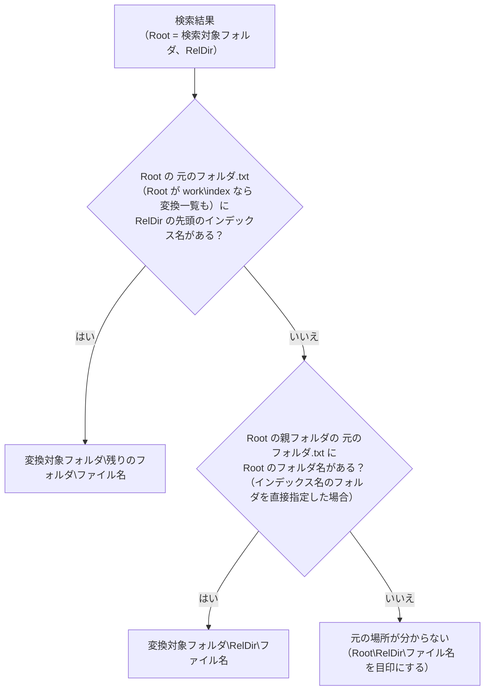
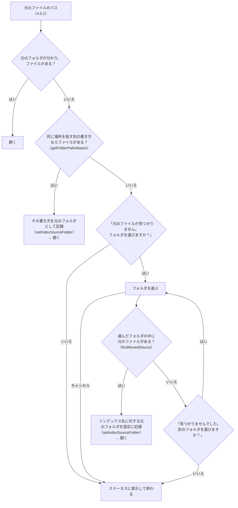

# 画面（GUI）設計書 ― ［2 検索］タブ ― 元のファイルを開く

本書は [03_画面.md](03_画面.md) の一部である。章・節の番号は 03_画面.md と分割した各ファイルで通し番号とし、各章がどのファイルにあるかは [03_画面.md](03_画面.md#ファイル構成) の表のとおり。

---

## 4. ［2 検索］タブ（続き）

### 4.5 元のファイルを開く

ダブルクリック、Enter、選択行のプレビューの［Excel で開く］（Word・PowerPoint は［開く］。4.9）、または右クリックメニュー［元のファイルを開く］で開く。

| 項目 | 仕様 |
|---|---|
| 元のファイルのパス | 結果のフォルダの先頭（インデックス名）から変換対象フォルダを引き、`<変換対象フォルダ>\<残りのフォルダ>\<ファイル名>` とする（`getSourceLocation` / `resolveSourcePath`、4.5.1）。記録された置き換え（4.5.2）があれば反映する |
| 開き方 | 選択行のプレビューの［開き方］で選ぶ（既定は「通常」）。選んだ開き方は `setting.config` の `openMode` に保存し、次回も引き継ぐ（8 章）。右クリックメニューでは、その時だけ別の開き方も選べる ・**通常**（`normal`）: 元のファイルをそのまま開く（編集して上書き保存できる） ・**読み取り専用**（`readOnly`）: 元のファイルを読み取り専用で開く（誤って上書き保存しない） ・**新規**（`new`）: 元のファイルを基にした無題のブック・文書として開く（元のファイルを占有しない） |
| Excel | 起動中の Excel があればそれを使い、無ければ起動する（COM）。ブックを開き（「読み取り専用」は `Workbooks.Open(<元のファイル>, , ReadOnly:=True)`、「新規」は `Workbooks.Add(<元のファイル>)`。そのブックが既に開いていれば、開き方によらずそのブックを使う）、**該当シートを表示して、一致したセル（最初に一致したセル。4.3 の「セル」列）を選択する**。該当シートは「場所」と名前が同じシートとし、無ければ名前を `toSafeFileName` で全角に置き換えて一致するシートとする（以前の版のインデックスは、シート名の記号を全角に置き換えてあるため。`衝突"` と `衝突”` のように置き換えると重なるシートがあるので、名前が同じものを先に選ぶ）。COM で失敗したら、ファイルを既定のアプリで開くだけにする（「新規」ならエクスプローラーの［新規］と同じ動作） |
| Word・PowerPoint | 第 1 段階はファイルを既定のアプリで開く。エクスプローラーの右クリックメニューと同じシェルの動詞を使う（「読み取り専用」は `OpenAsReadOnly`、「新規」は `New`）。該当ページ・スライドへの移動は第 3 段階（13 章） |
| ファイルが無い・元の場所が分からない | 元のファイルのあるフォルダを選んでもらい、その中から探す（4.5.2）。選ばなかった場合は、ステータスに `元のファイルが見つかりません：<パス>` と表示する |

右クリックメニュー：

| メニュー | 動作 |
|---|---|
| 元のファイルを開く（編集する） | 「通常」で開く |
| 読み取り専用で開く | 「読み取り専用」で開く |
| 新規で開く | 「新規」で開く |
| フォルダを開く | 選択行のプレビューの［フォルダを開く］と同じ。エクスプローラーで元のファイルを選択した状態で開く（`explorer /select,`）。ファイルが無い・元の場所が分からない場合は、元のファイルを開くときと同じくフォルダを選んでもらう |
| 選択行をコピー（Ctrl+C） | 選択行を `output/検索結果.txt` と同じ形式（`toResultHeader` の見出し＋`toResultLine` の各行）でクリップボードに入れる。Excel に貼るとセルが元の列の位置に並ぶ |
| ファイルのパスをコピー | 元のファイルのフルパス（置き換えを反映。分からない場合は TSV のパス）。ファイルがあるかは確かめず、フォルダも聞かない |

「読み取り専用」「新規」で開く：

| 開き方 | 開いた後 | 元のファイル |
|---|---|---|
| 通常 | 元のファイルを編集し、上書き保存できる | 編集できる状態で開く |
| 読み取り専用 | 上書き保存はできない（編集するときは名前を付けて保存する）。誤って元のファイルを変えてしまうことがない | 読み取り専用で開く（実測では、開いている間もほかのアプリ・利用者が書き込めた） |
| 新規 | 元のファイルを基にした新しい無題のブック・文書（例: `見積.xlsx` → `見積1`）。保存するときは名前を付けて保存になる | 読み込む間だけ読み、開いた後は占有しない。共有フォルダのファイルをほかの人が編集中でも開け、ほかの人の編集・上書き保存も妨げない |

- Word・PowerPoint はシェルの動詞で開く。その動詞が登録されていない種類のファイルは、元のファイルをそのまま開き、ステータスに `読み取り専用で開けなかったため、元のファイルを開きました：<パス>` / `新規で開けなかったため、元のファイルを開きました：<パス>` と表示する。`ProcessStartInfo.Verbs` は `New` を一覧に含めないため、事前に確かめず実行して例外（`Win32Exception`）で判断する（`openWithShell`）。
- `Start-Process` はパスの `[` `]` をワイルドカードとして扱うため、`ProcessStartInfo` で開く。
- ［開き方］は、起動時に設定から読み込むときは保存しない（設定していない利用者の `setting.config` を作らないため。8 章）。

#### 4.5.1 元のフォルダの特定（インデックスを別の PC・場所で使う場合）

変換処理は、インデックスのフォルダ（`work\index`）に `元のフォルダ.txt`（インデックス名と変換対象フォルダの対応。[01_変換.md](01_変換.md) の 4.2 節）を置く。インデックスのフォルダごと別の PC・場所へコピーして検索対象（4.8）に指定しても、このファイルから元のファイルの場所が分かる。

対応は次の順に読み、後のもので上書きする（`getSourceFolderMap`）。**設定が最も優先される**ため、フォルダを移したときは設定の場所（インデックス名に対する 1 か所）を書き換えるだけで、元のファイルを開けるようになる。

| 順 | 情報 | 内容 |
|---|---|---|
| 1 | インデックスの `元のフォルダ.txt` | インデックスを作ったときの場所。インデックスをコピーしても付いてくる |
| 2 | 変換一覧（`work\変換一覧.tsv`） | 既定のインデックス（`work\index`）のときだけ |
| 3 | 設定（`setting.config` の `targetFolders` / `indexSources`） | **インデックス名に対する今の置き場所**。利用者が指定した情報のため最優先 |

- 読んだ対応は、検索対象フォルダごとに画面でキャッシュする（変換が終わったとき・元のフォルダを設定したときに捨てる）。
- `元のフォルダ.txt` の無い古いインデックスは、変換を 1 回実行すると作られる（変換が必要なファイルが無くても作る）。
- どれにも無い場合は、元のフォルダが分からない（`Known` = `$false`）。インデックス名（相対フォルダの先頭）は分かるため、フォルダを選んでもらえば設定に記録できる（4.5.2）。

#### 4.5.2 元のファイルが見つからないとき（元のフォルダを設定する）

別の PC ではドライブ名・共有フォルダのパスが違う、フォルダを移した、といった場合は元のパスのままでは開けない。その場合は元のファイルのあるフォルダを選んでもらい、**そのインデックスの元のフォルダ（今の置き場所）として設定に記録する**（`setIndexSourceFolder`）。インデックス名に対して 1 か所を持つため、以後は同じインデックスのどのファイルも聞かずに開ける。

- 記録された場所にファイルが無い場合は、フォルダを聞く前に**同じ場所を指す別の書き方**でも探す（`getFolderPathAliases`）。
  ファイルサーバーのフォルダは、ネットワークドライブ（`Z:\見積`）と UNC パス（`\\server\share\見積`）のどちらでも書けるため、
  インデックスを作った PC と、この PC でドライブの割り当てが違っても、聞かずに開ける。見つかった書き方はそのまま元のフォルダとして記録する。
  この PC にそのドライブの割り当てが無い場合は別名が分からないため、フォルダを選んでもらう。
- 選ぶフォルダは、インデックスの元のフォルダに当たるフォルダでも、その下のどのフォルダ（ファイルのあるフォルダなど）に当たるフォルダでもよい。元の相対フォルダが `2024\見積` なら、`<選んだフォルダ>\2024\見積\<ファイル名>`、`<選んだフォルダ>\見積\<ファイル名>`、`<選んだフォルダ>\<ファイル名>` の順に探し、最初に見つかったものを使う。
- 記録するのは、選んだフォルダから相対フォルダの分だけ上に戻ったフォルダ（`findMovedSource` の `Root`）。どのフォルダを選んでも、インデックスの元のフォルダに当たる 1 か所が記録される。上に戻れない場合は記録せず、そのファイルを開くだけにする。
- 記録先（`setIndexSourceFolder`、8 章）:
  - そのインデックス名が変換対象フォルダ（`targetFolders`）にあれば、そのフォルダの `path` を書き換える（次の変換では、この新しいフォルダを変換する）。
  - 無ければ `indexSources` に `{name, path}` として記録する（変換しない、検索だけのインデックス）。
- フォルダ選択の初期位置は、元のパスの上のフォルダのうち存在する最も深いフォルダ。
- 記録したら、元のフォルダの対応のキャッシュ（4.5.1）を捨てて読み直す。

メッセージ：

| 場面 | メッセージ |
|---|---|
| ファイルが無い | `元のファイルが見つかりません。<パス>` ＋ `インデックスを別の PC に持ってきた場合や、フォルダを移した場合は、今の場所のフォルダを選ぶと開けます。` ＋ `（選んだフォルダはインデックス [<名前>] の元のフォルダとして記録し、同じインデックスのほかのファイルも開けるようにします）フォルダを選びますか？` |
| 元のフォルダが分からない | `元のファイルの場所が分かりません（インデックス [<名前>] の元のフォルダが記録されていません）。<相対パス>` ＋ `元のファイルのあるフォルダを選ぶと開けます。` ＋ 同上 |
| フォルダ選択の説明 | `「<元のフォルダ>」に当たるフォルダ（または <ファイル名> のあるフォルダ）を選んでください`（元のフォルダが分からない場合は `<ファイル名> のあるフォルダ（またはインデックス [<名前>] の元のフォルダ）を選んでください`） |
| 選んだフォルダに無い | `選んだフォルダの中に、元のファイルが見つかりませんでした。選んだフォルダ：<フォルダ> 探したファイル：<相対パス>` ＋ `別のフォルダを選びますか？` |
| 記録した（ステータス） | `インデックス [<名前>] の元のフォルダを <フォルダ> に変えました`（続けて開いた結果で上書きされる） |
