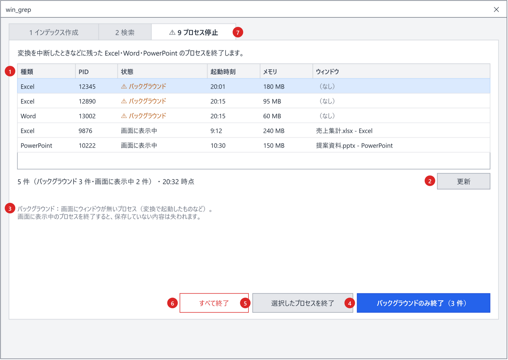

# 画面（GUI）設計書 ― ［9 プロセス停止］タブ

本書は [03_画面.md](03_画面.md) の一部である。章・節の番号は 03_画面.md と分割した各ファイルで通し番号とし、各章がどのファイルにあるかは [03_画面.md](03_画面.md#ファイル構成) の表のとおり。

---

## 5. ［9 プロセス停止］タブ

| No. | 部品 | 仕様 |
|---|---|---|
| 1 | プロセスの表 | 実行中の Excel・Word・PowerPoint を一覧する（5.1）。複数選択できる |
| 2 | ［更新］ | 一覧を取り直す。F5 でも同じ。表の上に `N 件（バックグラウンド X 件・画面に表示中 Y 件） ・ HH:mm 時点` を表示する |
| 3 | 説明 | `バックグラウンド：画面にウィンドウが無いプロセス（変換で起動したものなど）。` `画面に表示中のプロセスを終了すると、保存していない内容は失われます。` |
| 4 | ［バックグラウンドのみ終了（N 件）］ | 主ボタン。バックグラウンドのプロセスをすべて終了する。0 件なら無効 |
| 5 | ［選択したプロセスを終了］ | 表で選択したプロセスを終了する。未選択なら無効 |
| 6 | ［すべて終了］ | 一覧のすべてを終了する。赤枠で表示し、誤操作に注意を促す |
| 7 | タブ見出し | バックグラウンドのプロセスがあるとき `⚠` を付ける（5.3） |

### 5.1 プロセスの表

| 列 | 内容 |
|---|---|
| 種類 | `Excel` / `Word` / `PowerPoint`（プロセス名 `EXCEL` / `WINWORD` / `POWERPNT`） |
| PID | プロセス ID |
| 起動時刻 | 当日なら `HH:mm`、それ以前は `M/d HH:mm`。取得できなければ空欄 |
| メモリ | ワーキングセット（MB） |
| ウィンドウ | ウィンドウのタイトル。無ければ `（なし）` |

- 一覧とバックグラウンドの判定は `windox_grep/lib.ps1` の `getOfficeProcesses`、終了は `stopOfficeProcesses` で行う（12 章）。「バックグラウンド」は `MainWindowHandle` が 0 のものをさす。列としては表示せず、並び順・［バックグラウンドのみ終了］・タブ見出しの `⚠` に使う（画面上では「ウィンドウ」列が `（なし）` かどうかで分かる）。
- 並び順はバックグラウンドを先に、次に起動時刻の古い順とする。
- タブを開いたとき・［更新］・終了操作の後に取り直す。タブを表示している間は 5 秒ごとに自動で取り直す。

### 5.2 終了の確認

終了は `Stop-Process -Force`（保存確認なし）で行うため、必ず確認ダイアログ（[10.2](03_画面_5_共通仕様.md#102-確認ダイアログshowconfirm)）を出す。ボタンは［終了する］。

| 操作 | 見出しと結果 | ボタン |
|---|---|---|
| バックグラウンドのみ | `バックグラウンドの Office を N 件終了しますか？` ＋ `✓ 画面に出ているファイルはありません`（`Excel 2 件・Word 1 件`）／ `→ 残ったまま動いていたものを片付けます`（`次の変換で作り直されます`） | ［終了する］が既定 |
| 選択・すべて（画面に表示中を含まない） | 同上 | ［終了する］が既定 |
| 選択・すべて（画面に表示中を含む） | `開いたままの Office を N 件、強制的に終了しますか？` ＋ `✗ 保存していない内容は失われます`（`画面に出ているもの：Excel 1 件・PowerPoint 1 件`）／ `✓ ファイル自体は消えません`（`保存し忘れがないか、先に画面で確かめてください`） | 赤い［終了する］。**［キャンセル］が既定** |
| 変換が実行中（3.1 の「変換中」） | 上の結果に `✗ いま変換中のファイルは失敗あつかいになります`（`変換が終わってから終了するのが安全です`）を足す | 赤い［終了する］。［キャンセル］が既定 |

- 終了後はステータスに `N 個のプロセスを終了しました。` と表示し、一覧を取り直す。
- 終了できなかったプロセス（権限不足など）があれば、`PID <N> を終了できませんでした：<理由>` と表示する。

### 5.3 タブ見出しの ⚠

- バックグラウンドのプロセスが 1 件以上あり、かつ変換が実行中（3.1 の「変換中」）でないとき、`⚠ 9 プロセス停止` と表示する。
- 判定は起動時と、ウィンドウがアクティブになったときに行う（プロセスの一覧取得は軽いため）。
