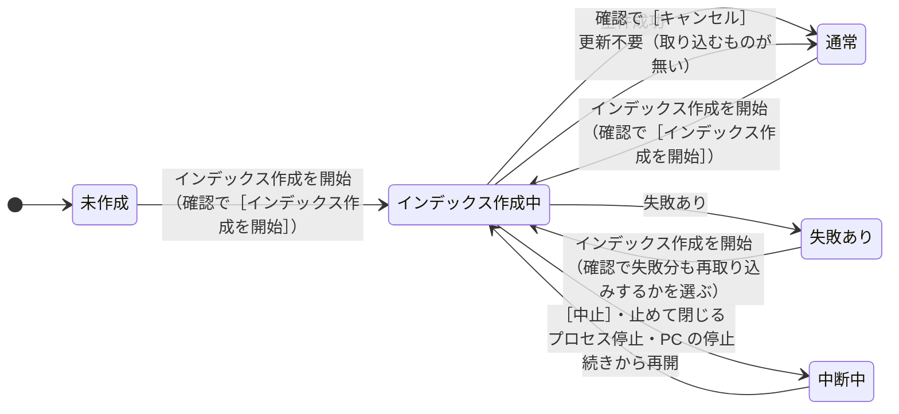
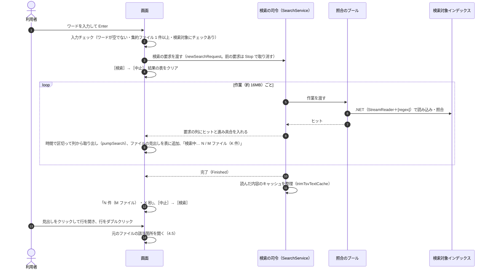
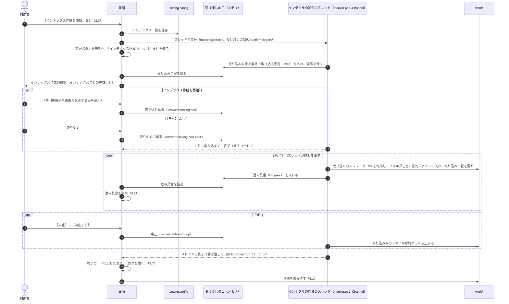
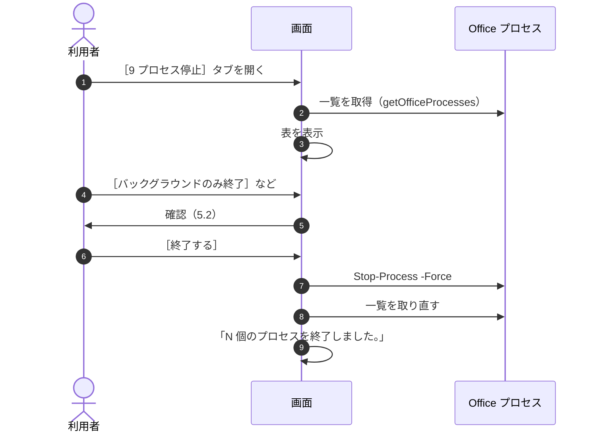
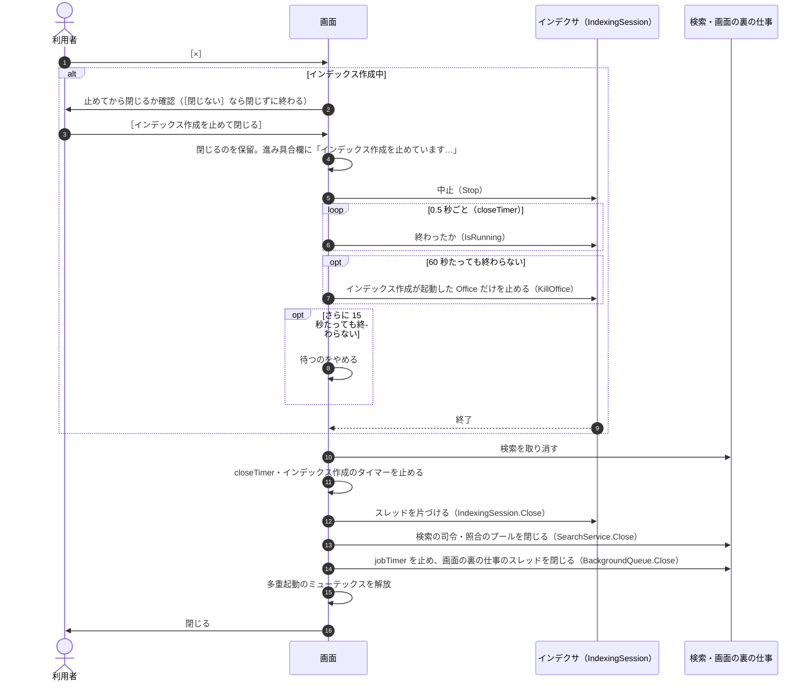

# 画面（GUI）設計書 ― 状態と操作の流れ

本書は [03_画面.md](03_画面.md) の一部である。章・節の番号は 03_画面.md と分割した各ファイルで通し番号とし、各章がどのファイルにあるかは [03_画面.md](03_画面.md#ファイル構成) の表のとおり。

---

## 6. 状態の判定と表示

画面がインデックスとインデックス作成の状態をどう判定して見せるか（6 章）と、検索・インデックス作成・プロセス停止・終了の操作の流れ（7 章）をまとめる。

### 6.1 インデックスとインデックス作成の状態

| 状態 | 判定方法 | ［1 インデックス管理］の表示 | 起動時のタブ |
|---|---|---|---|
| 未作成 | `work/index` に集約ファイルが無い | No.5 に `まだインデックスがありません。` | 1 |
| 中断中 | `work/取り込み一覧.tsv` に状態が `未取り込み` の行がある | No.5 の次の行に `⏸ 前回のインデックス作成が中断しています（残り N 件）`、No.6 のボタンは［続きから再開（残り N 件）］ | 1 |
| 失敗あり | `work/取り込み一覧.tsv` に状態が `失敗` の行がある | 「取り込みに失敗したファイル」の一覧（`⚠ 取り込みに失敗したファイル N 件`。ファイルごとに失敗の原因を表示） | 2（タブ見出しに ⚠） |
| インデックス作成中 | この画面で始めたインデックス作成のスレッド（`IndexingSession`）が動いている（`isIndexing`。3.3） | No.6 のボタンが `インデックス作成中…`（無効）。進み具合（3.6） | 1 |
| 通常 | 上のいずれでもない | No.5 に `取り込み済み N ファイル（集約ファイル M 件 ・ 最終取り込み M/d H:mm）` のみ | 2 |

- 「最終取り込み」は、インデックス配下の集約ファイルの最新の更新日時とする。
- 「インデックス作成中」は、この画面で始めたインデックス作成のスレッドが動いているかで判定する。インデックス作成は画面のプロセスの中で動くため、画面を開いたときに動いているものは無い。画面を使わずに起動した `indexer.ps1` と重なったときは、インデクサがミューテックスで二重に動かないようにする（[01_インデックス作成_4](01_インデックス作成_4_メインフローと取り込み一覧.md#41-メインフロー)）。

### 6.2 インデックス作成の状態遷移（画面から見た状態）

### 6.3 状態を読み直すタイミング

- 起動時、タブを切り替えたとき、ウィンドウがアクティブになったとき、始めたインデックス作成が終わったとき。
- 集約ファイルの件数は、インデックスが大きいと数えるのに時間がかかるため、画面の裏の仕事のスレッド（`startJob`。`BackgroundQueue`）で数える。数え終わるまでは `確認中…` と表示し、その間も画面を操作できるようにする。

---

## 7. 操作の流れ

### 7.1 検索

- 検索の司令と照合のプールは、画面を開いている間使い回す（[7.3](00_共通_4_プロセスとスレッド.md#73-寿命)）。

### 7.2 インデックス作成

### 7.3 プロセス停止

### 7.4 閉じる

- 閉じるのはタイトルバーの［×］（または Alt+F4）で行う。画面に［閉じる］ボタンは置かない。
- 設定はその場で保存しているため、保存の確認は無い。
- 検索中なら検索を取り消してから閉じる。
- インデックス作成は画面のプロセスの中で動くため、画面を閉じるときは止める。インデックス作成を続けたまま画面だけを閉じることはできない。

インデックス作成中に閉じようとすると、確認ダイアログ（[10.2](03_画面_5_共通仕様.md#102-確認ダイアログshowconfirm)）を出す。

| 項目 | 内容 |
|---|---|
| 見出し | `まだインデックス作成の途中です。止めてから閉じますか？` |
| 結果の行 | `→ いま取り込んでいるファイルが終わったところで止まり、画面を閉じます`、`✓ ここまで取り込んだ分はそのまま残ります`（詳細: `次に開いて［インデックス作成を開始］を押すと、続きから再開します`） |
| 選択肢 | ［インデックス作成を止めて閉じる］／［閉じない］ |

- 確認している間にインデックス作成が終わっていれば、［インデックス作成を止めて閉じる］でそのまま閉じる。
- 止めるのを待っている間にもう一度［×］を押しても、何もしない。
- 60 秒待っても終わらないのは、Office が応答しないときである。止めるのは、インデックス作成が起動して PID を記録した Office だけで、利用者が開いていた Office は止めない（[7.6](00_共通_4_プロセスとスレッド.md#76-閉じるときの順番)）。
