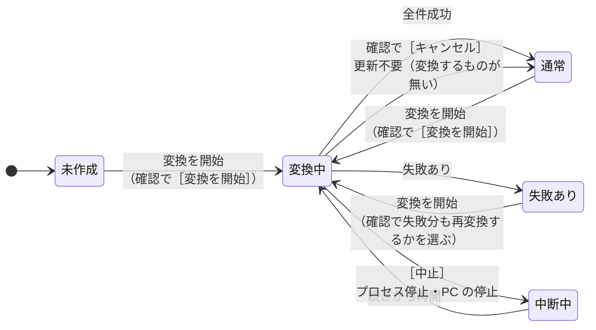
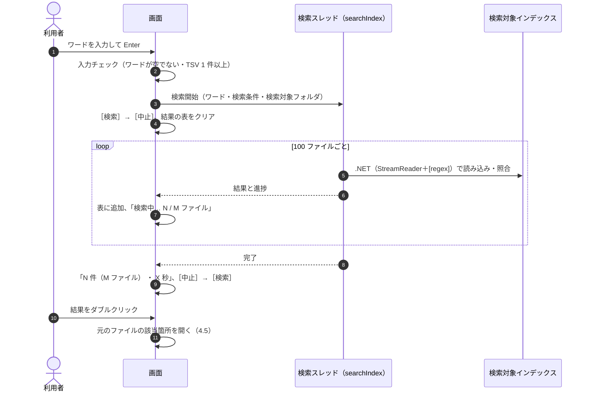
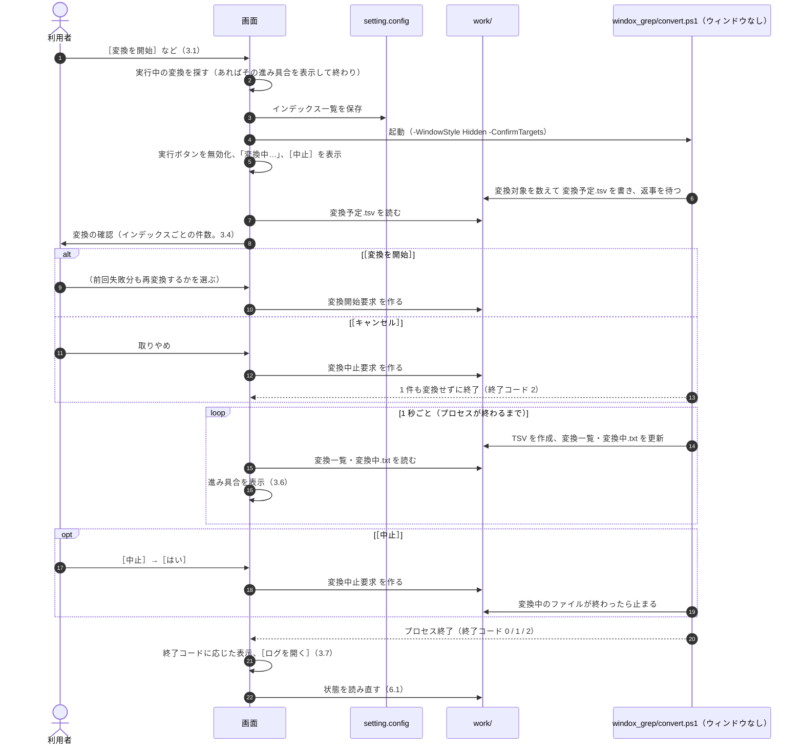
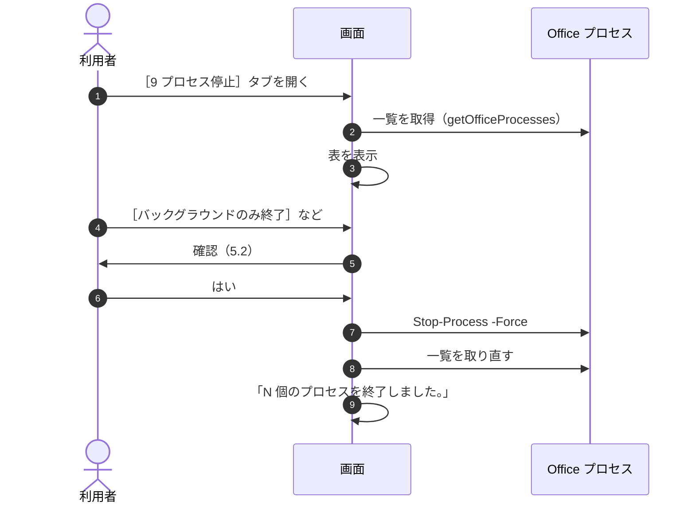

# 画面（GUI）設計書 ― 状態と操作の流れ

本書は [03_画面.md](03_画面.md) の一部である。章・節の番号は 03_画面.md と分割した各ファイルで通し番号とし、各章がどのファイルにあるかは [03_画面.md](03_画面.md#ファイル構成) の表のとおり。

---

## 6. 状態の判定と表示

### 6.1 インデックス・変換の状態

| 状態 | 判定方法 | ［1 インデックス管理］No.6 の表示 | 起動時のタブ |
|---|---|---|---|
| 未作成 | 検索対象インデックスに TSV が無い | `まだインデックスがありません。` | 1 |
| 中断中 | `work/変換一覧.tsv` に状態が `未変換` の行がある | `⏸ 前回の変換が中断しています（残り N 件）` | 1 |
| 失敗あり | `work/変換一覧.tsv` に状態が `失敗` の行がある | 「変換に失敗したファイル」の一覧（`⚠ 変換に失敗したファイル N 件`。ファイルごとに失敗の原因を表示） | 2（タブ見出しに ⚠） |
| 変換中 | この画面から起動した変換（`windox_grep/convert.ps1`）のプロセス、または起動時・開始時に見つけた実行中の変換のプロセスが動いている（3.1） | `変換中…` | 1 |
| 通常 | 上のいずれでもない | `N ファイル ・ 最終変換 M/d HH:mm` のみ | 2 |

- 「最終変換」は、インデックス配下の TSV の最新の更新日時とする。
- 「変換中」は、画面の起動時と［変換を開始］を押したときに、このツールの `scripts\windox_grep\convert.ps1` を実行中の `powershell.exe` を探して判定する（3.1）。見つかれば、そのプロセスの進み具合を表示し、二重に起動しない。

### 6.2 変換の状態遷移（画面から見た状態）

### 6.3 状態を読み直すタイミング

- 起動時、タブを切り替えたとき、ウィンドウがアクティブになったとき、起動した変換のプロセスが終了したとき。
- TSV の件数は、インデックスが大きいと数えるのに時間がかかるため、別スレッド（Runspace）で数える。数え終わるまでは `確認中…` と表示し、その間も画面を操作できるようにする。

---

## 7. 操作の流れ

### 7.1 検索

### 7.2 変換

### 7.3 プロセス停止

### 7.4 閉じる

- 閉じるのはタイトルバーの［×］（または Alt+F4）で行う。画面に［閉じる］ボタンは置かない。
- 設定はその場で保存しているため、保存の確認は無い。
- 検索中なら検索を中止してから閉じる。
- 変換中なら、変換を中止してから閉じるか、続けたまま閉じるかを確認する（3.7）。続けたまま閉じた場合、次に画面を開くと実行中の変換を見つけて進み具合を表示する。
