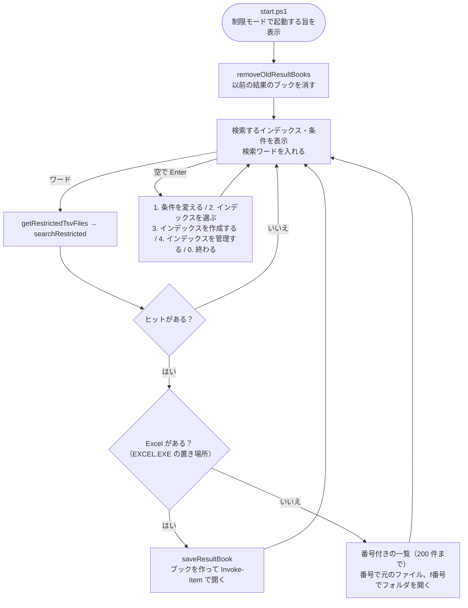

# 制限モード 設計書（制限言語モードの PC で使うコンソールの版）

| 項目 | 内容 |
|---|---|
| 起動 | `tebunko_grep.bat` → `scripts/tebunko_grep/start.ps1`（いつもの画面を開けないときに、同じコンソールで動かす） |
| スクリプト | `scripts/tebunko_grep/restricted/`（読み込み口は `lib_restricted.ps1`） |
| 関係する設計書 | 起動の確認は [03_画面_5_共通仕様.md 10.1](03_画面_5_共通仕様.md#101-配布と実行ポリシーmark-of-the-web)、共用する関数の書き方は [00_共通_2_共通モジュール.md 5.0](00_共通_2_共通モジュール.md#50-フォルダの分け方と読み込み口)、検索の仕様は [02_検索.md](02_検索.md) |

---

## 1. 概要

AppLocker・WDAC（アプリケーション制御）を強制した PC では、管理者が許可していないスクリプトが PowerShell の制限言語モード（ConstrainedLanguage）で動く。制限言語モードでは `Add-Type`・PowerShell class・COM（Excel・Word・PowerPoint）・コア以外の .NET の型が使えないため、いつもの画面（WPF）とインデックス作成は動かない。

制限モードは、そうした PC でも**作ってあるインデックスを検索し、結果を Excel で見られる**ようにする、コンソールの版である。制限言語モードを回避する抜け道（署名の偽装、許可された COM の悪用、mshta など）は使わない。制限言語モードで使える機能（標準のコマンドレット・コアの型・Windows に付いている `tar.exe`）だけで作る。

| 機能 | いつもの画面 | 制限モード |
|---|---|---|
| 検索 | ［2 検索］タブ | コンソールで検索ワードを入れる（2 章） |
| 検索の条件（正規表現・大文字と小文字・対象ファイル・図形・コメント） | ［2 検索］タブ | メニューで切り替える（`setting.config` に保存し、いつもの画面と共通） |
| 検索するインデックスの選択 | 検索対象のツリー | メニューで番号で選ぶ（インデックス単位。`setting.config` の `searchExcludes` をいつもの画面と共通に使う） |
| 検索結果の表示 | 画面の一覧・プレビュー | Excel のブック（3 章）。Excel が無い PC ではコンソールに一覧で出す |
| 元のファイルを開く | 通常・読み取り専用・新規 | ブックのリンク（Excel はシート・セルまで）、または一覧の番号。開き方は選べない（関連付けのアプリで開く） |
| インデックスの作成 | ［1 インデックス管理］の［インデックス作成を開始］ | メニューで作れる（5 章）。取り込めるのは新形式（.docx .docm .pptx .pptm .xlsx .xlsm）だけ |
| インデックス（クロール対象フォルダ）の追加・削除・取り込むものの選択 | ［1 インデックス管理］の一覧 | メニューで番号で行う（5.4） |
| インデックスの名前・元のフォルダの変更 | ［編集…］ | できない（いつもの画面で行う） |
| Excel（.xlsx / .xlsm）のセルの値 | Excel が画面に出す文字をそのまま取り込む | Excel を使わず、表示形式を当てて作る（5.5）。ほとんどは同じ文字になるが、違うものもある（5.6） |
| .xls / .doc / .ppt・パスワード付きのファイル | 取り込める | 取り込めない（Office の COM が要るため）。「未取り込み」のまま残す |
| ［9 プロセス停止］ | ある | 無い（制限モードは Office を起動しない） |

## 2. コンソールの操作



- 文言と入力の読み方は `restricted/console_view.ps1`（判断層。テストあり）、入出力は `restricted/search_console.ps1`（画面層。手で確かめる）。
- 番号は全角の数字でもよい。
- 設定（`setting.config`）が読めない・書けない（壊れた JSON、読み取り専用の配置）ときは、その旨を出して既定の値・今回だけの値で続ける。
- 検索の途中は `Write-Progress` で進み具合を出す。

## 3. 検索（`restricted/restricted_search.ps1`）

いつもの画面の検索（`getIndexTsvFiles`・`searchIndex`）と**同じ TSV を同じ順に照合し、同じヒットを返す**。画面の検索は `FileStream`・`StreamReader`・`List`・並列のスレッドを使うが、制限言語モードではどれも使えない。制限モードは TSV を `Get-Content -Raw` で丸ごと読み、同じ正規表現（`newSearchRegex`）を全文にかける。

| 項目 | 仕様 |
|---|---|
| 列挙（`getRestrictedTsvFiles`） | 選んだインデックスのフォルダ以下の `*.tsv` を `Get-ChildItem`（`\\?\` 付きのパス）で列挙し、パス順（`Sort-Object`）に並べる。元のファイル名・場所・元のファイルのあるフォルダは `splitIndexTsvPath` で分ける |
| 検索から外すフォルダ | いつもの画面の検索対象ツリーと同じ `searchExcludes`。`Subfolders` が `$true` ならそのフォルダ以下、`$false` ならそのフォルダ直下のファイル（直下の元のファイル名のフォルダの中を含む）を外す |
| 照合のしかた | `getRegexScanMode` の `lines`（全文での一致の位置から行を切り出す）・`filter`（全文で一致しない TSV は飛ばす）・`scan`（1 行ずつ）を `searchTsvFiles` と同じに行う。行の区切りと行番号は `StreamReader.ReadLine` と同じ（CRLF・LF・CR。末尾の改行の後ろは行にしない） |
| 上限 | 1 万件（いつもの画面と同じ）。超えたら打ち切る |
| 時間切れ | 全文への照合が時間切れになった TSV は 1 行ずつ照合し直す。1 行の照合が 5 秒を超えたら、いつもの画面と同じメッセージで止める |
| 大きな TSV | 64MB を超える TSV は 1 行ずつ読む |
| 読めない TSV | 飛ばして続ける |

同じ結果になることは `tests/tebunko_grep/restricted/restricted_search.Tests.ps1` が、17 通りの条件（文字どおり・正規表現の 3 つの照合のしかた・大文字と小文字・対象ファイル・図形とコメント・不正な正規表現）と件数の上限で、いつもの画面の検索と突き合わせる。制限言語モードでも同じことは `tests/meta/clm.Tests.ps1` が確かめる。

速さ（手元。TSV 2,000 件・60 万行・1 万件ヒット、模擬の制限言語モード）: 列挙 1.7 秒、検索 1.8 秒。

## 4. 検索結果のブック（`restricted/result_book.ps1`・`result_book_view.ps1`）

制限言語モードでは Excel の COM も `System.IO.Compression` も使えないため、xlsx の部品（XML）を文字列で組み立て（`result_book_view.ps1`。判断層）、`tar.exe` で ZIP にまとめる（`result_book.ps1`）。

### 4.1 シートの中身

［検索結果］シート:

| 行 | 内容 | 深さ |
|---|---|---|
| 見出し | ファイル・場所・種別・行・A・B…（1 行目を固定し、オートフィルターを付ける） | 0 |
| ファイルごとのまとまり | ファイル名（元のファイルへのリンク）・［フォルダを開く］（フォルダへのリンク）・件数。太字・薄い背景色 | 0 |
| ヒット | 元のファイル名（リンク）・場所・種別・行番号・セル。一致した部分だけを濃い赤の太字にする | 1 |
| 前後の行 | ヒットの前後 2 行（同じ TSV の中）。灰色。畳んで隠しておき、ヒットの行の + で開く | 2 |

- 場所・種別は、いつもの画面・検索結果ファイルと同じ表示（`describePlace`）。
- セルは、Excel の TSV は `"` で囲んだセルを 1 つにしてセル内改行（U+2028）を改行に戻し、Word・PowerPoint の行はタブで分ける（検索結果ファイルと同じ扱い）。
- Excel のヒットのリンクは、該当のシートと、一致した最初のセル（図形・コメントは 1 列目のセル番地）を開く（`hyperlink` の `location`）。
- ［条件］シート: 検索ワード・条件・検索したインデックス・件数・検索した TSV の数・日時・見方。
- 元のフォルダが分からないファイル（インデックスだけを別の PC から持ってきた等）は、リンクを付けず「元のフォルダが分かりません」と出す。

### 4.2 XML の書き方

| 項目 | 書き方 | 理由 |
|---|---|---|
| セルの値 | すべて文字列（`t="inlineStr"`） | 元の文書の `=SUM(...)` などを数式として評価させない |
| 書けない文字 | タブ・改行以外の制御文字は `_xHHHH_`、元からある `_xHHHH_` は `_x005F_` で守る。`&` `<` `>` `"` はエンティティ。32,767 文字を超える分は切り詰める | Excel の仕様 |
| 一致した部分の色 | セルの文字を `<r>`（書式付きの区切り）に分ける | Excel が一部の文字に書式を付けるときと同じ形 |
| リンク | リレーションの `Target` を `file:///` に続けたパス（`%` `#` 空白だけ `%XX`）にし、同じ行き先は 1 つのリレーションにまとめる。シート・セルは `location` に書く | Excel が書く形に合わせた（空白・`#`・`%`・日本語のパス、UNC パスを Excel で開いて確かめた） |
| 畳み込み | 行の `outlineLevel`・`hidden`・`collapsed`、`outlinePr summaryBelow="0"`（+ を上の行に出す） | |
| 書式・リンク・色付けの無い行 | セルの番地（`r`）を省き、空のセルも書いて、行ごとにまとめて組み立てる | 前後の行が行の大半を占め、セルごとに関数を呼ぶと遅いため |
| 部品の文字コード | UTF-8（BOM 付き） | 制限言語モードの `Set-Content -Encoding UTF8` は BOM を付ける。XML は BOM があってもよい |

### 4.3 ZIP にまとめる（`writeResultBook`）

`tar.exe` は引数を ANSI のコードページ（日本語版の Windows は CP932、英語版は CP1252）で受け取るため、そこに無い文字を含むパスは引数では開けない（[00_共通_3_テスト.md](00_共通_3_テスト.md) の `clm.yml`）。そこで、作業フォルダに `cmd.exe` で移ってから、ASCII の名前（`result.zip`）で作り、`Move-Item` で目的の名前にする。

```bat
cd /d "<作業フォルダ>" && "%windir%\System32\tar.exe" --format zip -cf result.zip "[Content_Types].xml" _rels xl
```

- `tar.exe` は `PATH` を使わずフルパスで呼ぶ（`PATH` の先に Git の GNU tar があることがあるため）。
- 作業フォルダ（`作成中_<PID>`）は、成否にかかわらず消す。

### 4.4 置き場所と後始末

- `%TEMP%\tebunko_grep\検索結果\検索結果_<日時>.xlsx`（同じ秒に作れば `_2` などを付ける）。検索ごとに作る。
- 制限モードを起動するたびに、このフォルダの中を消す（`removeOldResultBooks`）。Excel で開いたままのブックは消せないため飛ばす。
- `Invoke-Item` で開く（関連付けのアプリ。ふつうは Excel）。

速さ（手元。1 万件・前後の行を含めて 48,000 行、模擬の制限言語モード）: 行の組み立て 3.8 秒、XML 5.8 秒、ZIP 0.6 秒。

## 5. インデックスの作成（`restricted/restricted_indexer.ps1`・`index_console.ps1`）

いつものインデクサ（`indexer.ps1`）と**同じ取り込み一覧（`work\取り込み一覧.tsv`）・同じ形のインデックス**を作る。取り込む対象の決め方（`createTargetList`・`getIngestDecision`）、取り込み一覧の読み書き（`indexer_state.ps1`）、インデックスへの入れ替え（`publishTsv`）は、いつものインデクサと同じ関数を使う。片方のモードで作ったインデックスを、もう片方のモードがそのまま使える。

### 5.1 いつものインデクサとの違い

| 項目 | いつものインデクサ | 制限モード |
|---|---|---|
| 読めるファイル | Excel・Word・PowerPoint（旧形式・パスワード付きも Office で開く） | `.docx` `.docm` `.pptx` `.pptm` `.xlsx` `.xlsm` の ZIP だけ（`office_reader_clm.ps1`。Office は使わない） |
| Excel のセルの値 | Excel のテキスト保存（表示値） | `xl/worksheets/*.xml` の値に表示形式を当てて作る（5.5） |
| 取り込み一覧の「抽出版」 | `2` | `2R`（制限モードで取り込んだ印。いつもの画面では取り込み直す。5.6） |
| 読めないファイル | 失敗として記録する | 取り込まずに飛ばし、「未取り込み」のまま残す |
| 起動 | 画面から `-ConfirmTargets` 付きで起動し、件数を見せてから取り込む | メニューから呼ぶ。件数はクロールの行に出す |
| 二重起動の防止 | 名前付きミューテックス | ロックファイル（`work\インデックス作成中.lock`。PID・コンピューター名・開始日時） |
| 制限時間・Office の再起動 | ある | 無い（Office を使わないため） |
| 進み具合 | `work\インデックス作成進捗.txt`（画面が読む） | `Write-Progress`（コンソール） |
| インデックスの実体の確認（「済」なのに TSV が無い） | `getIndexTsvCounts`（.NET の列挙） | `getRestrictedTsvCounts`（`Get-ChildItem` で 1 回だけ列挙する。結果の使い方は同じ） |
| 以前の版の形式のインデックス | 移す（`moveLegacyIndex`・`migrateFlatIndex`） | 移さない（5.3） |

「未取り込み」のまま残すのは、いつもの画面が使える PC でインデックスを作ったときに取り込ませるため。「失敗」にすると、その PC で［失敗分も再取り込み］を選ぶまで取り込まれない。

### 5.2 1 ファイルの流れ

1. 拡張子が `.docx` `.docm` `.pptx` `.pptm` `.xlsx` `.xlsm` でなければ飛ばす（旧形式・バイナリ形式）。
2. 先頭 4 バイトが ZIP（`PK`）でなければ飛ばす（パスワード付き・中身が旧形式・壊れたファイル）。
3. `work\取り込み中.txt` に印を付け、作業フォルダを空にする。
4. `readDocxUnitsClm` / `readPptxUnitsClm` / `writeXlsxTsvClm` で読み、TSV を作業フォルダに書く。
5. `publishTsv` でそのファイルのインデックスのフォルダごと入れ替える。
6. 取り込み一覧の行を「済」（TSV 数・抽出版 `2R`）にし、1 件ずつ追記する（`addStatusRow`）。途中で止めても、次回は続きから取り込む。
7. 読めなかったときは「失敗」とし、エラーの内容を一覧に書いて次のファイルへ進む。

取り込み中に強制終了されたファイルは、いつものインデクサと同じく次回は最後に回し、続けて 2 回止まったら失敗とする。

### 5.3 以前の版の形式のインデックス

取り込み一覧にインデックス名の無いクロール対象フォルダの行があるとき、または移し替えの途中（`work\index_移行中`）で止まっているときは、**制限モードでは移さずに断る**（形式を移すには制限言語モードで使えない型が要る）。「いつもの画面が使える PC で一度インデックスを作成してください」と出す。

### 5.4 インデックスの管理

メニューの［インデックスを管理する］で、クロール対象フォルダの一覧に対して次を行う（`index_console.ps1`。文言と入力の読み方は `console_view.ps1`）。

| 入力 | 動き |
|---|---|
| 番号 | 取り込む（`[x]`）・取り込まない（`[ ]`）を切り替える。取り込まないフォルダのインデックスは残す |
| `a` | フォルダのパスとインデックス名を入れて追加する。名前の既定はフォルダ名（`newIndexName`）。同じフォルダ・入れ子のフォルダ・使えない名前は、いつもの画面と同じ判定（`testRestrictedFolderInput`）で断る |
| `d` + 番号 | 一覧から外し、インデックス（`work\index\<名前>`）と取り込み一覧の記録も消す（`removeIndex`）。`y` で確かめてから行う |

名前・元のフォルダの変更はできない（インデックスのフォルダの改名に、制限言語モードで使えない型が要るため）。

### 5.5 Excel のセル（`shared/office/office_numfmt.ps1`・`office_reader_clm.ps1`）

xlsx に入っているのは「値」だけで、画面に見えている文字は表示形式（numFmt）を当てて作る必要がある。いつものインデクサは Excel のテキスト保存（表示値）を使うため、制限モードは同じ文字を自前で組み立てる。

| 読むもの | 使い方 |
|---|---|
| `xl/workbook.xml` | シートの名前・並び・非表示（`state`）・1904 年方式（`workbookPr/@date1904`）。シートの選び方はいつものインデクサと同じ（非表示シート・グラフシートは取り込まない） |
| `xl/sharedStrings.xml` | 共有文字列（`t="s"` のセルが番号で引く）。ふりがな（`rPh`）は読まず、書式で分かれた `<r>` はつなぐ |
| `xl/styles.xml` | `cellXfs` の並び順がセルの `s` 属性の番号。そこから表示形式の番号（`numFmtId`）→ 書式を引く。ブックに書かれていない番号は組み込みの書式（日本語版の和暦 27〜36・50〜58 を含む） |
| `xl/worksheets/*.xml` | 行（`<row r>`）とセル（`<c r t s>`）。値は `<v>`、じか書きの文字は `<is>`、数式は結果（`<v>`）だけを読む。シートが大きいと `[xml]` の組み立てが重いため、正規表現で走査する |

表示形式の当て方（`formatExcelCellText`）:

- 書式を `;` で節（正の数・負の数・ゼロ・文字列）に分け、値に合う節を選ぶ。空の節は何も出さない（`#,##0;-#,##0;` のゼロなど）。
- 引用符の中・`\` でエスケープした文字・`[$¥-411]` の通貨記号はそのまま出し、色（`[Red]`）・条件・ロケール（`[$-411]`）は出さない。
- 数値は .NET の書式（`#,##0.00` など Excel と同じ書き方）で組み立てる。`?`（けた合わせ）は `#` と同じに扱う。分数（`# ?/?`）は `?` のけた数で表せるいちばん近い分数にする。
- 日付・時刻は、シリアル値を日時にしてから `yyyy`・`m`・`d`・`aaa`（曜日）・`ggge`（和暦）・`AM/PM`・`[h]`（経過時間）を当てる。秒より細かい端数は秒に丸める。
- シリアル値は、1900 年方式では Excel にしかない 1900/02/29（60）に合わせ、1904 年方式では 1904/01/01 を 0 とする。
- セルの文字は、Excel のテキスト保存と同じく `"` ・タブ・改行・カンマを含むときだけ `"` で囲み、中の `"` は `""`、改行はセル内改行（U+2028）にする。
- 行・列の番号どおりの位置に置き、間は空セル・空行にする。最後に `formatTsv`（いつものインデクサと同じ）で行末の空セルと末尾の空行を取り除く。

### 5.6 Excel と違う値になるもの

制限モードで作った TSV は、テストデータの Excel（26 ブック・112 シート）で**110 件がいつものインデクサとバイト単位で一致**する。違うのは次の 3 か所で、いずれも元の値が文字として残るため、検索で見つからなくなることはない。

| 違い | 制限モード | いつもの画面（Excel） |
|---|---|---|
| 和暦（`[$-ja-JP]ggge"年"m"月"d"日"`） | `令和6年4月1日` | `4月1日令和6年`（Excel のテキスト保存が並べ替える） |
| 負の時刻（`hh:mm:ss` に負の値） | `-0.0416550926`（数のまま） | `#####`（列幅の分だけ `#` が並ぶ） |
| 列幅が足りないセル | 値をそのまま出す | 値をそのまま出す（テキスト保存では `#####` にならない） |

このため、制限モードで取り込んだ行は取り込み一覧の「抽出版」に `R` を付ける（`2R`）。**いつもの画面が使える PC でインデックスを作成すると、`R` の付いた行を Excel の表示どおりに取り込み直す**（`testExtractOutdated`）。制限モードでは `R` の付いた行も付いていない行も取り込み直さない（`${restrictedIngestMode}`）。
### 5.7 確かめ方

- `tests/tebunko_grep/restricted/restricted_indexer.Tests.ps1`（取り込み・2 回目・元のファイルの削除・チェックなし・以前の形式・ロック）。
- `tests/shared/office/office_numfmt.Tests.ps1`（表示形式の当て方）と `tests/shared/office/office_reader_clm.Tests.ps1`（セル・図形・コメントの読み取り）。
- `tests/meta/clm.Tests.ps1`（`restrictedIndexing`・`numberFormat`・`xlsxCells` の呼び出し例）が、FullLanguage と模擬の制限言語モードで、できた TSV のバイト列まで同じことを確かめる。
- 本物の CLM（WDAC）では `tools/clm/check.ps1` の項目「制限モードのインデックス作成」が CI（`clm.yml`）で動く。
- いつものインデクサと同じ TSV になることは、テストデータで突き合わせた。Word・PowerPoint は 31 件のうち ZIP の 28 件で TSV 229 件が一致。Excel は 26 ブックの TSV 112 件のうち 110 件が一致（残り 2 件の違いは 5.6 の 3 セル）。

速さ（手元。模擬の制限言語モード）: Word・PowerPoint 21 件で初回 9.6 秒・2 回目 3.4 秒。Excel 22 ブック（大量データ・多数シートを含む）で初回 108 秒・2 回目 1 秒。

## 6. 制限言語モードで動く書き方

制限モードのファイル（`start.ps1` と、そこから読み込むもの）は、制限言語モードで使える書き方だけで書く。書き方の決まりは [00_共通_2_共通モジュール.md 5.0](00_共通_2_共通モジュール.md#50-フォルダの分け方と読み込み口) の「制限モードと共用する関数」、確かめ方は [00_共通_3_テスト.md](00_共通_3_テスト.md) の `clm.Tests.ps1`・`clm.yml`。

加えて、制限モードの速さのために次を守る。

- ループの中で関数・コマンドレット（`Select-Object`・`Where-Object`・`ForEach-Object` など）を呼ばない。PowerShell の関数呼び出しは 1 回 0.1〜0.3 ms、コマンドレットはそれ以上かかる。配列には演算子（`-replace`・`-match`・`-join`）をまとめてかける。
- 配列に `+=` で足していかない（毎回コピーする）。件数の多いものは、番号をキーにしたハッシュテーブルに入れる。
- 同じ結果になる計算は覚えておく（場所の表示・シート名・元のフォルダ）。

## 7. 既知の制約

| # | 内容 |
|---|---|
| 1 | 取り込めるのは新形式（.docx / .docm / .pptx / .pptm / .xlsx / .xlsm）だけ。旧形式（.xls / .doc / .ppt）・バイナリ形式（.xlsb）・パスワード付きのファイルは、いつもの画面が使える PC でしか取り込めない |
| 2 | Excel のセルは、表示形式を自前で当てるため Excel と違う文字になるものがある（5.6）。制限モードで取り込んだ行は、いつもの画面が使える PC で取り込み直す |
| 3 | インデックスの名前・元のフォルダの変更と、以前の版の形式のインデックスの移し替えは、いつもの画面で行う |
| 4 | 検索するインデックスはインデックス単位でしか選べない（中のフォルダを外すのは、いつもの画面の検索対象ツリーで行い、`setting.config` を共有すれば制限モードでも効く） |
| 5 | 元のファイルの開き方（読み取り専用・新規）は選べない |
| 6 | 共有フォルダ（UNC）のファイルへのリンクをクリックしたとき、Excel が安全の確認を出すかは、実機で確かめていない |
