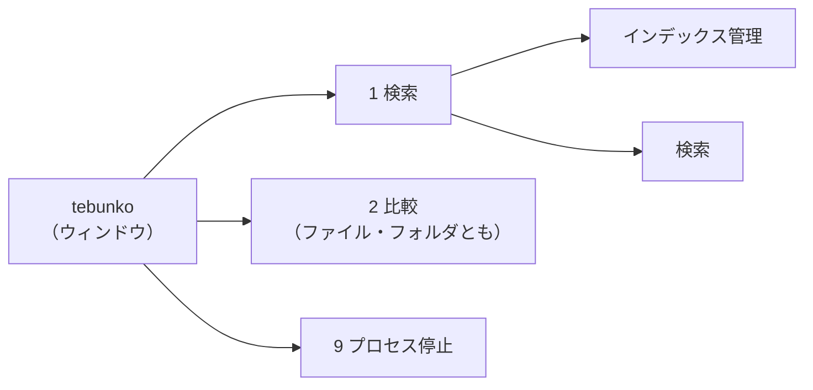
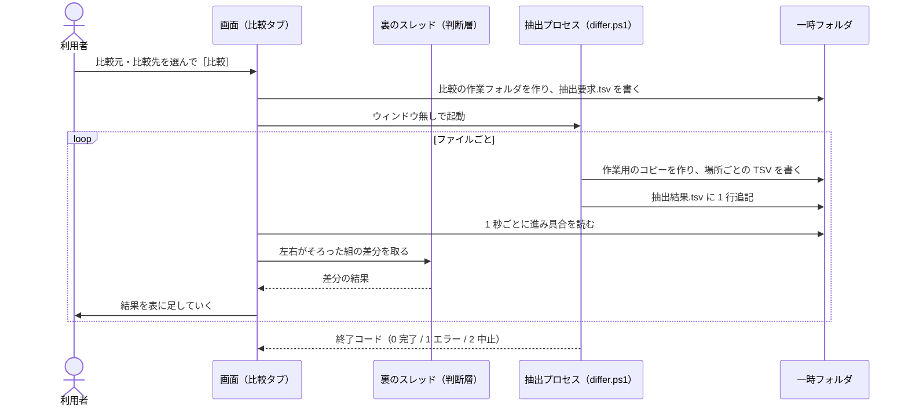
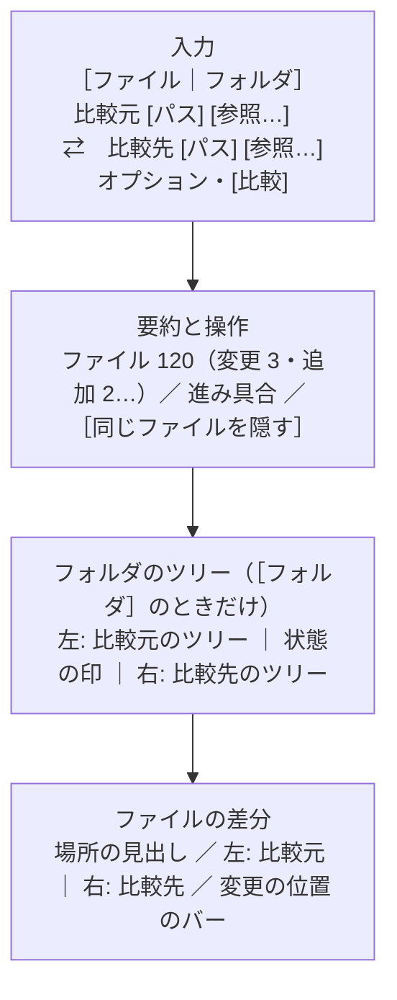
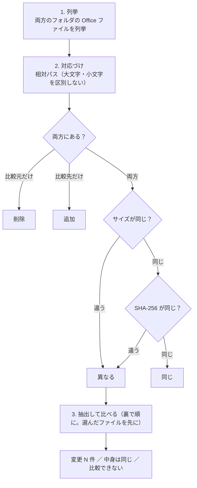
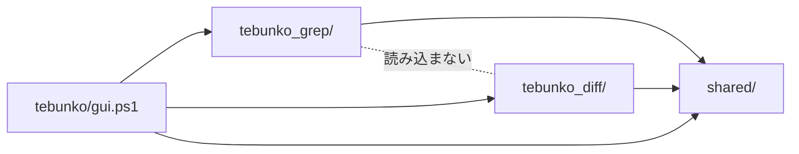

# tebunko 統合と比較（tebunko_diff）設計書

> **状態: 仕様案（レビュー中）。** まだ実装していない。実装したら、本書を現行実装の挙動に合わせて書き直す。

本書は、検索ツール `tebunko_grep` と新しい比較ツール `tebunko_diff` を、1 つの入口 `tebunko` から使えるようにする仕様を定める。変更は 1 つの PR で入れる（[11 章](#11-pr-の範囲)）。

---

## 1. 目的と範囲

### 1.1 目的

- 検索と比較を **1 つの入口（`tebunko.bat`）・1 つのウィンドウ** から使えるようにする。
- Office ファイル（Excel・Word・PowerPoint）の **中身の文字の差分** を、ファイルを開かずに確かめられるようにする。比べる対象は次の 2 つ。どちらも 1 つの［2 比較］タブで行う（入れたものがファイルかフォルダかで切り替える）。
  - ファイル 2 つ
  - フォルダ 2 つ（その下のフォルダを含む）

### 1.2 方針

| 項目 | 方針 |
|---|---|
| インデックス | **検索だけのもの。** 比較はインデックスを使わず、読み書きもしない |
| 比較のしかた | **都度比較。** ［比較］を押すたびに元のファイルから抽出する。抽出したものは一時フォルダに置き、画面を閉じたら消す |
| 抽出 | インデクサと同じ抽出を使う（`shared/` へ上げる）。原本は作業用のコピーを読み取り専用・マクロ無効で開く |
| 比べる単位 | 場所（シート・ページ・スライド）ごとに、行（Excel の 1 行、Word・PowerPoint の 1 段落）の並びの差分を取る。Excel は行の挿入・削除も見つける |

### 1.3 やらないこと

- 書式（色・フォント・罫線・列幅）、画像、数式そのものの比較（Excel は表示されている値で比べる。インデックスと同じ）
- ファイルの書き換え（マージ・差分の反映）
- 種類の違うファイルどうしの比較（Excel と Word など）。`.xls` と `.xlsx` のように、同じ種類で形式が違うものは比べられる
- 名前を変えたファイル・シートの対応づけ（削除と追加として出す。[12 章](#12-未決事項後回しにすること)）

---

## 2. 画面の構成

### 2.1 入口

| 起動 | 動き |
|---|---|
| `tebunko.bat` | 新しい入口。`scripts/tebunko/gui.ps1` を開く。［検索］タブで開く |
| `tebunko_grep.bat` | 互換のために残す。`scripts/tebunko/gui.ps1 -StartPage search` を開く（作ったショートカットを壊さないため）。中身は `tebunko.bat` と同じ起動のしかた（Mark-of-the-Web を消してから RemoteSigned で開く） |

- ウィンドウのタイトルは `tebunko`、アイコンは `scripts/tebunko/tebunko.ico`（今の `tebunko_grep.ico` を移す）。
- 多重起動の防止は、ツールの配置フォルダごとに 1 つのウィンドウ（今と同じ）。名前付きミューテックスは `tebunko_gui_<配置フォルダのハッシュ>` にする。以前の版の画面（`tebunko_grep_gui_…`）が開いているときは「すでに開いています。」を出して終わる。

### 2.2 タブ

タブは 2 段にする。インデックスは検索だけのものなので、［インデックス管理］は［検索］の下に置く。



| 1 段目 | 2 段目 | 中身 |
|---|---|---|
| ［1 検索］ | ［インデックス管理］［検索］ | 今の［1 インデックス管理］［2 検索］のまま。見出しの番号は外す |
| ［2 比較］ | –（2 段目は無い） | 本書の 5・6 章。ファイル同士もフォルダ同士もここで比べる |
| ［9 プロセス停止］ | – | 今のまま（検索と比較で共通）。`shared/ui/` へ移す |

- 2 段目の既定: ［検索］の下は、インデックスが 1 つも無ければ［インデックス管理］、あれば［検索］（今の起動時の動きと同じ）。
- 最後に開いていたタブは覚えない（起動のたびに上の既定で開く）。

### 2.3 キーボード操作

今のキー操作（[03_画面_5_共通仕様.md 9 章](03_画面_5_共通仕様.md#9-キーボード操作)）は、［1 検索］の中では変えない。

| キー | 動き |
|---|---|
| Ctrl+1 / Ctrl+2 / Ctrl+9 | 1 段目のタブを切り替える |
| Ctrl+Tab / Ctrl+Shift+Tab | ［1 検索］の中の 2 段目のタブを切り替える（2 段目の無い［2 比較］［9 プロセス停止］では何もしない） |
| Ctrl+F | ［1 検索］→［検索］の検索ワード欄へ移る（今と同じ） |
| F5 | ［インデックス管理］［9 プロセス停止］は今と同じ。［2 比較］では、同じ条件で比べ直す |
| F8 / Shift+F8 | ［2 比較］で次の変更・前の変更へ移る（フォルダ同士では、ファイルをまたいで移る） |
| Esc | 比較中なら中止する（確認なし。抽出途中の分は捨てる） |

### 2.4 速さ（サクサク確認できること）

画面は今と同じ WPF で作る。**確かめる操作（ファイルを選ぶ・変更へ移る・スクロール・タブの切り替え）で待たせない**ことを、何より優先する。

**目安**

| 操作 | 目安 |
|---|---|
| フォルダ同士で、抽出済みのファイルを選んでから差分が出るまで | 0.2 秒以内 |
| F8 / Shift+F8 で変更へ移る、左右の表示と一覧を切り替える、場所を切り替える | 0.1 秒以内 |
| スクロール | 引っかからない（10 万行の場所でも） |
| 比較中の操作（別のファイルを選ぶ・スクロール・中止） | 止まらない |
| フォルダ同士で、［比較］を押してからツリーが出るまで | 1,000 ファイルで 3 秒以内（ネットワークのフォルダは除く） |

**決まり**

1. **画面のスレッドでは重い処理をしない。**
   - 次の処理は、すべて裏のスレッドか抽出プロセスで行う。
     - 抽出（COM）
     - ハッシュ
     - 差分の計算
     - 左右の行の組み立て（そろえる・たたむ）
   - 画面のスレッドは、できた結果を表に渡すだけにする。
2. **行は仮想化する。**
   - 左右の差分・一覧・フォルダのツリーは、いずれも `VirtualizingStackPanel`（`VirtualizationMode=Recycling`）で作る。見えている行の分だけ部品を作り、スクロールで使い回す。
   - 仮想化が効かなくなる設定は使わない。例えば、行のグループ化や、`ScrollViewer.CanContentScroll=False`。
3. **重い部品を使わない。**
   - 左右の表示は `DataGrid` を使わず、`ListBox` と軽い `DataTemplate`（`TextBlock` を並べたもの）で作る。
   - 行ごとの `Border`・`Effect`・アニメーションは付けない。
4. **表示用の中身は、見えている行だけ作る。**
   - 行は、生のデータだけを持つ軽いオブジェクトとして作る（今の検索の `HitRow` と同じ作り）。
   - 文字の単位の差分（強調の区切り）は、行が見えたときに初めて計算し（`Prepare()`）、結果を覚えておく。
   - 10 万行の場所でも、計算するのは画面に出る数十行だけになる。
5. **画面の更新はまとめて行う。**
   - 裏からの結果は、タイマー（100〜200 ms）でまとめて表に入れる。
   - 1 件ごとに画面のスレッドを呼ばない。一覧の件数・進み具合の表示も、タイマーで更新する。
6. **一度出した結果は覚えておく。**
   - フォルダ同士で一度差分を出したファイルは、組み立てた行をメモリに残す（直近 30 ファイルまで。古いものから捨てる）。
   - 選び直したときは、計算し直さずにすぐ出す。
   - 抽出した TSV は、画面を閉じるまで一時フォルダに残す（3.3）。
7. **速く選び直しても、たまらない。**
   - ↑↓ で次々にファイルを選んだときは、止まってから 150 ms たったファイルだけを表示する。
   - 前に頼んだ表示の計算は捨てる（抽出は捨てずに続ける）。
8. **PowerShell の遅いところを避ける。**
   - 差分の計算の中では、パイプライン・`+=` による配列の継ぎ足し・`Where-Object` を使わない。
   - 型付きの配列・`List[T]`・`Dictionary` と `for` で書く。
   - 行は整数の番号に置き換えて比べる（4.1）。

**確かめ方**: `Slow` タグのテストで、差分の計算の速さを測る（10,000 行・違い 100 か所の場所を 1 秒以内。[10 章](#10-テスト)）。画面の速さは、PR で実際に起動し、上の目安の操作を試して確かめる。

---

## 3. 比較の流れ（共通）

### 3.1 全体



- 抽出は別プロセスで行う。Office（COM）が応答しなくなっても画面が止まらないようにし、時間切れのときにそのプロセスが起動した Office だけを終了できるようにするため（インデクサと同じ考え方）。
- 差分の計算（純粋な文字の処理）は画面のプロセスの裏のスレッド（`startJob`）で行う。

### 3.2 抽出プロセス（`scripts/tebunko_diff/differ.ps1`）

```
powershell.exe -NoProfile -ExecutionPolicy RemoteSigned -WindowStyle Hidden -File differ.ps1 -JobDir <比較の作業フォルダ>
```

| 項目 | 内容 |
|---|---|
| 入力 | `<JobDir>\抽出要求.tsv`。1 行 1 ファイルで `<番号><TAB><側（left / right）><TAB><元のファイルのパス>` |
| 出力 | `<JobDir>\<側>\<番号>\<場所>.tsv`（1 ファイル 1 フォルダ。TSV の名前と中身はインデックスと同じ規則） |
| 結果 | `<JobDir>\抽出結果.tsv` に 1 件ごとに追記する。`<番号><TAB><側><TAB><状態（済 / 失敗）><TAB><TSV数><TAB><エラー>` |
| 進み具合 | `<JobDir>\進捗.txt`。`<済んだ数>/<全体の数><TAB><今のファイルのパス>` |
| 優先 | 画面が `<JobDir>\優先.tsv` に番号を書くと、次にそのファイルを抽出する（フォルダ同士で選んだファイル。[6.2](#62-比べる順番)） |
| 中止 | 画面が `<JobDir>\中止要求` を作る。ファイルの切れ目で止まる。応答が無いときは、画面がプロセスを終了する（`Stop-Process` はしない。子の Office は watchdog が終了する。[3.4](#34-時間切れと中止)） |
| 終了コード | 0 = 完了、1 = 続けられないエラー（`<JobDir>\比較エラー.txt` に原因）、2 = 中止 |
| 多重起動 | 比較は 1 つずつ。画面が抽出中は［比較］を押せないようにする（ミューテックスは使わない。作業フォルダが別なので、ぶつからない） |

- Office アプリ（Excel）は、1 回の抽出の中で使い回す（`getApp`）。終わったら `stopAllApps` で閉じる。
- Word・PowerPoint の新形式（`.docx` `.pptx` 等）は Office を使わずに読む。旧形式だけ Word・PowerPoint で新形式に変換する（インデクサと同じ）。

### 3.3 一時フォルダ

```
%TEMP%\tebunko\diff\<画面の PID>\<比較の番号>\
    抽出要求.tsv  抽出結果.tsv  進捗.txt  優先.tsv  中止要求  比較エラー.txt
    left\<番号>\<場所>.tsv
    right\<番号>\<場所>.tsv
    work\         … 作業用のコピー（抽出が終わるたびに消す）
```

- **比べ直す・別のファイルを選ぶと、前の比較の作業フォルダを消す。** 残すのは、今表示している比較の分だけ。
- 画面を閉じるときに `%TEMP%\tebunko\diff\<画面の PID>\` を消す。
- 画面が強制終了されて残った分は、次に画面を開いたときに消す（`%TEMP%\tebunko\diff\` の下で、PID のプロセスが無いフォルダ）。
- 本文の平文の写しを `work/` に残さない。インデックスと違い、比較の中身は利用者が閉じれば消える。
- 削除は `removeDirectoryRetry`（ウイルス対策ソフト等が掴んでいることがあるため）。長いパスは `toLongPath`。

### 3.4 時間切れと中止

- 1 ファイルの抽出は **10 分** で打ち切る（インデクサと同じ `$fileTimeoutMinutes`）。watchdog（`startWatchdog`）がそのプロセスの起動した Office を終了し、そのファイルは `失敗`（「10 分以内に読み取れませんでした。」）にして次へ進む。
- 失敗の原因の文言は、インデクサの `describeIngestError`（[01_インデックス作成_8](01_インデックス作成_8_エラーメッセージ一覧.md)）と同じものを使う。

---

## 4. 差分の取り方

### 4.1 差分のアルゴリズム（`scripts/tebunko_diff/diff/diff_core.ps1`、判断層）

- 行の並び 2 つ（比較元 A・比較先 B）の最長共通部分列を **Myers の O(ND) 法** で求める。第三者のライブラリは使わない。
- 速くするために、先に次を行う。
  1. 前後の一致する行を取り除く（前方一致・後方一致）。
  2. 行を文字列から整数の番号に置き換えて比べる（同じ文字列は同じ番号）。
- **上限**: 1 つの場所で、どちらかが 100,000 行を超える、または違いの数 D が 5,000 を超えたら、その場所は「違いが多すぎるため、行ごとの比較をやめました。」とし、場所全体を 1 つの `変更` として出す（件数は数えない）。
- 結果は「一致」「削除（A だけ）」「追加（B だけ）」の区間の並び。

### 4.2 変更の組み立て

LCS で一致しなかった区間のうち、削除と追加が隣り合うものを **`変更`** にまとめる。

- 区間の中で、削除の行と追加の行を **先頭から順に 1 対 1 で組む**。数が合わない残りは、それぞれ `削除` `追加` にする。
- 組んだ 2 行の似ている度合い（文字の LCS の長さ × 2 ÷ 両方の長さの和）が **0.3 未満** なら、組まずに `削除` と `追加` に分ける（まったく違う行を「変更」と見せないため）。
- `変更` の行は、文字の単位で差分を取り（同じ Myers の法。1 行 2,000 文字を超える行は取らない）、違う部分を強調する。

| 種類 | 意味 | 比較元の位置 | 比較先の位置 |
|---|---|---|---|
| 追加 | 比較先にだけある | –（直前の行の位置を括弧で出す） | あり |
| 削除 | 比較元にだけある | あり | –（直前の行の位置を括弧で出す） |
| 変更 | 両方にあり、中身が違う | あり | あり |

### 4.3 比べ方の設定

| 設定 | 既定 | 内容 |
|---|---|---|
| ［図形も比較］ | オン | 場所の `[図形]` を比べる（検索の［図形も検索］と同じ分け方） |
| ［コメントも比較］ | オン | 場所の `[コメント]` を比べる |
| ［空白の違いを無視］ | オフ | 行を比べる前に、連続する空白（半角・全角・タブ以外）を 1 つにし、行頭・行末の空白を取る。Excel ではセルの区切り（タブ）は残す |
| ［大文字と小文字を区別］ | オン | オフにすると、英字の大文字・小文字の違いを無視する |

### 4.4 Excel

| 項目 | 内容 |
|---|---|
| 場所の対応 | シート名で対応づける（大文字・小文字を区別しない。Excel と同じ）。片方にしか無いシートは、シートごと `追加` / `削除` とする。シートの順番の違いは差分にしない |
| 比べる単位 | TSV の 1 行 = シートの 1 行（空の行も行番号を保つため残っている。[01_インデックス作成_1_Excel.md](01_インデックス作成_1_Excel.md)）。行の文字（タブ区切りのセルの並び）で LCS を取る。**行の挿入・削除を見つける** |
| 変更の中身 | `変更` にした 2 行は、同じ列どうしでセルを比べ、違うセルの番地と値を出す（例: `B5: 1,200 → 1,350`）。比較元と比較先で行番号が違えば、それぞれの番地を出す（例: `B5 → B6`） |
| 位置の表し方 | 行は `行 5`、セルは `B5`。インデックスと同じく、使用範囲の左上がずれていても本当の行番号・列を出す |
| 図形・コメント | `<シート名>[図形]` `<シート名>[コメント]` を、そのシートに付けて比べる。1 行が `<セル番地><TAB><文字>` なので、行の LCS で比べる |
| 非表示のシート | 比べない（インデックスと同じく抽出しない）。どちらかにだけ非表示のシートがあることは分からない |

**列の挿入・削除**は見つけない。列を 1 つ挿入すると、それより右にセルのあるすべての行が `変更` になる（[12 章](#12-未決事項後回しにすること)）。

### 4.5 Word

| 項目 | 内容 |
|---|---|
| 本文 | `ページNNN` をページの順につないで、文書全体の 1 つの段落の並びとして比べる。ページの区切りは目安で、段落の増減で動きやすいため、対応づけに使わない |
| 位置の表し方 | `ページ 3（目安）・段落 12`（段落はそのページの中での番号） |
| そのほかの場所 | `ヘッダー・フッター` `脚注` はそれぞれで比べる。`ページNNN[図形]` はページの順につないで 1 つとして比べる。`[コメント]`（`文書[コメント]` を含む）も同じ |
| 変更の中身 | 段落の文字の差分を強調する |

### 4.6 PowerPoint

| 項目 | 内容 |
|---|---|
| スライドの対応 | スライドを 1 つの単位として、スライドの文字（段落を改行でつないだもの）で LCS を取り、スライドの挿入・削除を見つける。一致しなかった区間のスライドは、似ている度合い（段落の集合の重なり、Jaccard 係数）が **0.5 以上** の組を順に対応づけ、残りを `追加` / `削除` にする |
| スライドの中 | 対応づけたスライドどうしは、段落で LCS を取る |
| 非表示 | 場所の名前 `スライドNNN（非表示）` から番号と非表示かどうかを分けて扱う。非表示かどうかだけが変わったときは、`変更`（「非表示にした」「表示にした」）として出す |
| ノート・図形・コメント | `スライドNNN_ノート` `スライドNNN[図形]` `スライドNNN[コメント]` は、対応づけたスライドに付けて比べる |
| 位置の表し方 | `スライド 4・段落 2`。スライドの番号が左右で違えば両方を出す（`スライド 4 → 5`） |
| そのほか | `ヘッダー・フッター` はそれだけで比べる |

---

## 5. ［2 比較］タブ

ファイルの比較とフォルダの比較を、**1 つのタブ** で行う。どちらを比べるかは、入力欄の先頭の **［ファイル｜フォルダ］のトグル** で選ぶ。トグルで、選べるもの（ファイルかフォルダか）と、使えるオプションが変わる。

**画面の左半分はすべて比較元、右半分はすべて比較先** にする（入力欄・フォルダのツリー・ファイルの差分のどれも）。どちらがどちらかを迷わないようにするため。

### 5.1 レイアウト



| トグル | 出すもの |
|---|---|
| ［ファイル］ | 要約とファイルの差分だけ。ツリーは出さない（見本「ファイル同士」） |
| ［フォルダ］ | 上にフォルダのツリー、下に選んだファイルの差分（見本「フォルダ同士」） |

- ツリーと差分の境目はドラッグで動かせる。ツリーの高さは `diffTreeHeight` に覚える。
- 比べた後は、入力欄を 1 行にたたむ。
  - 1 行には、トグル、比較元と比較先の名前、［⇄］［設定 ▾］［比べ直す（F5）］を出す。
  - 比べている間は、［比べ直す］の代わりに［中止（Esc）］を出す。
  - 名前の欄をクリックすると、入力欄を開き直す。
  - たたんだ 1 行でトグルを切り替えると、入力欄を開き直す。パスは、切り替えた側の最後のものを入れる。

### 5.2 入力

**トグル（［ファイル｜フォルダ］）**

- 既定は、最後に使った側（`diffMode`）。初めて開いたときは［ファイル］。
- パスは側ごとに覚える（`diffFileLeft` / `diffFileRight`、`diffFolderLeft` / `diffFolderRight`）。切り替えると、その側の最後のパスに入れ替える。入れていた分は捨てずに、元の側に戻せば戻る。
- 比べている間は切り替えられない（押すと、中止するかを聞く）。

**トグルで変わるもの**

| 項目 | ［ファイル］ | ［フォルダ］ |
|---|---|---|
| ［参照…］が開くもの | ファイルを開くダイアログ（Office の拡張子で絞る） | フォルダ選択ダイアログ（今の `dialog_folder_select.xaml`） |
| パスの欄の案内 | 「ファイルを選ぶか、ここへドロップ」 | 「フォルダを選ぶか、ここへドロップ」 |
| ［サブフォルダも比較］ | 押せない（灰色） | 使える（既定はオン） |
| ［同じファイルを隠す］ | 押せない（灰色） | 使える（既定はオン。表示だけの設定） |
| ［図形も比較］［コメントも比較］［空白の違いを無視］［大文字と小文字を区別］（[4.3](#43-比べ方の設定)） | 使える | 使える |
| 結果 | ファイルの差分 | フォルダのツリーと、選んだファイルの差分 |

- 押せないオプションは隠さずに灰色で残す。トグルを切り替えても画面の配置が動かないようにするため。押せない理由（「フォルダを比べるときだけ使えます」）はツールチップで出す。
- オプションは、「フォルダのとき」と「共通」の 2 段に分けて並べる（見本「選ぶ前」）。
- 共通のオプションの値は、両方の側で同じものを使う（`diffOptions`）。

**パスの入れ方**

- ［参照…］、パスの欄への貼り付け、ドラッグ&ドロップ。UNC パス・ネットワークドライブも入れられる。
- ドラッグ&ドロップ:
  - 2 つをまとめて画面にドロップしたら、名前の順に比較元・比較先に入れる。
  - 1 つを入力欄か、左右の半分のどちらかにドロップしたら、その側に入れる。
  - トグルと違うもの（［ファイル］のときにフォルダ）をドロップしたら、**トグルをそちらに切り替えて** 入れる。もう片方の欄が今の側のもので埋まっていれば、切り替えた側の最後のパスに入れ替わる。
- ［⇄］で比較元と比較先を入れ替える。結果があれば、入れ替えて表示し直す（抽出はし直さない）。
- 比べた後にオプションを変えるときは［設定 ▾］から変える。変えたら比べ直す。［同じファイルを隠す］だけは、比べ直さずに表示を変える。

**［比較］を押せないとき**（理由を［比較］の左に出す）

- どちらかが空: 「比較先を選んでください。」
- 見つからない: 「比較元のファイルが見つかりません。」「比較元のフォルダが見つかりません。」
- ［ファイル］で、対応していない拡張子: 「Excel・Word・PowerPoint のファイルを選んでください。」
- ［ファイル］で、種類の違うファイル: 「種類の違うファイル（Excel と Word）は比べられません。」
- 同じもの: 「同じファイルが選ばれています。」「同じフォルダが選ばれています。」
- ［フォルダ］で、一方がもう一方の中にある: 「比較先のフォルダが比較元のフォルダの中にあります。」（［サブフォルダも比較］がオフなら比べられる）

最後に比べたパスとオプションを `setting.config` に保存し、次に開いたときに入れておく（[7 章](#7-設定ファイル)）。

### 5.3 ファイルの差分（左右に並べる・既定）

［ファイル］のときは入れた 2 つのファイル、［フォルダ］のときはツリーで選んだファイルの差分を出す。

- **場所の切り替え**:
  - 場所（シート・本文・脚注・コメント）は、Excel のシートの見出しのような横のタブで切り替える。
  - 見出しには件数と追加・削除の印を付ける。変更の無い場所は薄く出す。
  - PowerPoint は、スライドを見出しに分けない。［スライドとノート］の 1 つの見出しの中に、スライドを順に並べる（4.6）。
- **左右の並べ方**:
  - 左に比較元、右に比較先を置く。LCS で対応づけた行は同じ高さに並べる。
  - 片方にしか無い行は、もう片方に同じ高さの空きの行（斜線）を置く。
  - 縦のスクロールは左右で 1 つにする。左右の行を 1 つの表の行として持つので、ずれない。
  - 横のスクロールは左右それぞれに持ち、動かすと相手側も同じだけ動く。
- **色**:
  - 行の背景: 追加は薄い緑、削除は薄い赤、変更は薄い青。
  - 違う部分: Excel は違うセル、Word・PowerPoint は違う文字に濃い色を付ける。削除した文字は取り消し線も付ける。
- **同じ行をたたむ**（既定はオン）:
  - 変更の前後 2 行を残し、続けて同じ行を「▸ 同じ行 N 行（行 a〜b）」の 1 行にまとめる。クリックで開く。
  - Word は「同じ段落 N 個」、PowerPoint は「変わらないスライド N 枚」とする。
- **変更の位置のバー**:
  - 右の端に、場所全体での変更の位置を色の印で出す。今見えている範囲を枠で示す。
  - 印をクリックすると、その位置へ移る。
- **Excel**:
  - 左右それぞれを、列の見出し（A・B・C…）と行番号の付いた表として出す。
  - 列の幅は左右で同じにする。幅は両方の値の長い方に合わせ、上限を設ける。
- **Word**:
  - 段落を 1 行として並べる。長い段落は折り返し、左右で高い方に高さをそろえる。
  - ページ（目安）の区切りの行を入れる。ページが変わっても、同じ段落は横に並ぶ。
- **PowerPoint**:
  - スライドごとに見出しの行（`スライド 4　費用`）を入れ、その下に段落、ノート、図形（SmartArt・グラフ）の順に並べる。
  - 見出しの行の色で、スライドの追加・削除・変更を表す。片方にしか無いスライドは、もう片方に斜線の見出しを置く。
  - 対応づけたスライドの番号が左右で違えば、見出しに「（比較元はスライド 3）」と出す。非表示の切り替えは、見出しに印（「非表示にした」）を付ける。
- **選んだ変更**:
  - Excel の `変更` の行を選ぶと、差分の下の 1 行の欄に違うセル（`B8：10 → 12`）と［比較元を開く］［比較先を開く］を出す。
- **ダブルクリック・Enter**: その側のファイルを、その位置で開く。
  - Excel はそのシートのそのセルを選ぶ（今の `openInExcel`）。
  - Word・PowerPoint はファイルを開くだけ（ページ・スライドへは移らない）。
  - 開き方（通常・読み取り専用・新規）は、検索の［開き方］と同じ設定（`openMode`）を使う。
- **右クリック**: ［比較元を開く］［比較先を開く］［コピー］（選んだ行をタブ区切りで）。
- **大きさ**: 行は仮想化する（[2.4](#24-速さサクサク確認できること)）。1 つの場所で 10 万行まで扱う（4.1 の上限と同じ）。

### 5.4 一覧の表示

［左右に並べる］と［一覧］を切り替えられる（`diffView`）。一覧は、変更だけを 1 行ずつ並べる。変更が多いファイルで全体を見渡すときに使う。

- 列は「種類」「比較元の位置」「比較先の位置」「比較元」「比較先」。違う部分は左右の表示と同じ色で強調する。長い行は省略し、選ぶと下の欄に全文を出す。
- 場所の見出しと F8 / Shift+F8 は、左右の表示と同じ。
- 行をダブルクリックすると、比較先のその位置を開く。`削除` の行は比較元を開く。

### 5.5 要約と進み具合

- ［ファイル］: `シート 4 のうち 3 に変更（追加 2・削除 1・変更 3）`。違いが無ければ `違いはありません。（シート 4）`。
- ［フォルダ］: `ファイル 120（変更 3・追加 2・削除 1・比較できない 1・中身は同じ 1）` と、［同じファイルを隠す（109）］［すべて開く］［すべて閉じる］。
- 比べている間は、要約の横に細い進捗バーと「中身を比べています 5 / 9」を出す。比べている間も、ツリーの操作と、比べ終わったファイルの差分の表示はできる。
- 抽出に失敗したら、差分の代わりに「比較元を読み取れませんでした。（<原因>）」を出す。
- ［結果をファイルに出力］で `work/tebunko_diff/比較結果.txt` に書き出す（[8 章](#8-比較結果ファイル)）。フォルダ同士でまだ比べていないファイルがあれば、比べ終わるのを待ってから書き出す（進み具合を出す）。

---

## 6. フォルダ同士の比較

### 6.1 フォルダのツリー（左右に並べる）

左に比較元のフォルダ、右に比較先のフォルダを、**同じ並びのツリー** として出す（見本「フォルダ同士」）。

- **行**: 両方のフォルダの中身を相対パスで対応づけ、1 つの行に左右を並べる。並びは、フォルダが先、同じ階層の中は名前の順。
- **片方にしか無いもの**: もう片方は斜線の空きにする。フォルダごと片方にしか無いときも同じ（中のファイルの数を出す）。
- **中央の印**: 左右の間に、状態の印を出す。

  | 印 | 状態 | 名前の色 |
  |---|---|---|
  | `≠` | 変更 | 青 |
  | `+` | 追加（比較先だけ） | 緑 |
  | `−` | 削除（比較元だけ） | 赤 |
  | `≈` | 中身は同じ（バイトは違うが、抽出した文字が同じ） | 灰 |
  | `=` | 同じ（バイトが同じ） | 灰 |
  | `!` | 比較できない | 橙 |
  | `…` | 比較待ち・比較中 | 黄 |

- **フォルダの行**:
  - 中の状態をまとめて出す。中に変更などがあれば `≠` と件数、全部同じなら `=`、比べている途中なら `…` と「比較中 2 / 5」。
  - ▸ ▾ で開く・閉じる。左右は一緒に開く・閉じる。
  - 既定では、違いのあるフォルダを開き、全部同じフォルダは閉じる。
- **ファイルの行**: 名前、変更の件数（比較先の側）、サイズ、更新日時。
- **［同じファイルを隠す］**（既定はオン）: `=` のファイルと、中が全部 `=` のフォルダを隠す。隠した数をチェックの横に出す。
- **作り方**:
  - ツリーは WPF の `TreeView` を使わない。開いている行だけを 1 つの平らな一覧にし、字下げで階層を表す。
  - `ListBox`（仮想化）で出す。`TreeView` は行の多いときに仮想化が効きにくく、遅いため（[2.4](#24-速さサクサク確認できること)）。

**操作**

| 操作 | 動き |
|---|---|
| ファイルを選ぶ（クリック・↑↓） | 下にそのファイルの差分を出す。まだ抽出していなければ、そのファイルを**抽出の順番の先頭に回し**、差分の欄に「読み取り中…」を出す |
| フォルダを選ぶ | 差分の欄に、そのフォルダの中の件数の内訳を出す |
| → / ← / Enter | フォルダを開く・閉じる |
| Ctrl+↓ / Ctrl+↑ | 次・前の違うファイル（`≠` `+` `−` `!`）へ移る。閉じたフォルダの中にあれば開く |
| F8 / Shift+F8 | 差分の中で次・前の変更へ移る。そのファイルの最後の変更の次は、次の違うファイルの最初の変更へ移る |
| Tab | ツリーと差分の間でフォーカスを移す |
| `+` `−` のファイルを選ぶ | 差分の欄に、片方だけの中身を出す（そのときに抽出する）。もう片方は空き |
| 右クリック | ［比較元を開く］［比較先を開く］［比較元のフォルダを開く］［比較先のフォルダを開く］［相対パスをコピー］ |

### 6.2 比べる順番

Excel の抽出は 1 ファイルに数秒かかる。このため、先にツリーを出し、中身は裏で順に比べる。



1. **列挙**（裏のスレッド）:
   - 対象は Office の拡張子（`testOfficeFile`）。
   - Office の一時ファイル（`~$` で始まるもの）と、隠しファイル・システムファイルは除く（インデクサのクロールと同じ規則。`findOfficeFiles` を `shared/` へ上げて使う）。
   - 長いパスは `toLongPath`（`\\?\` を付ける）で扱う。
2. **対応づけとハッシュ**（裏のスレッド）:
   - サイズが同じ組だけ SHA-256 を計算する。
   - ここまでで一覧を出す。ハッシュの途中の行は `比較待ち` にしておき、終わった行から状態を変える。
3. **抽出と比較**:
   - `異なる` の組を、ツリーの上から順に抽出プロセスへ渡す。
   - 抽出プロセスは 1 ファイルずつ抽出し、終わるたびに `抽出結果.tsv` に書く。
   - 画面は、左右がそろった組から裏のスレッドで差分を取り、ツリーの行を更新する。
   - バイトは違うが抽出した文字が同じもの（保存し直しただけ等）は `中身は同じ` とする。
   - **選んだファイルを先に回す**:
     - 画面は `<JobDir>\優先.tsv` に、そのファイルの番号を書く。
     - 抽出プロセスは、1 ファイル終わるたびにこれを読み、書かれたファイルを次に抽出する。
     - 抽出中のファイルは止めない。Excel の抽出を途中で止めると、Office を起動し直すことになり、かえって遅いため。

- 上限: 両方合わせて 10,000 ファイル。超えたら、比べる前に「ファイルが多すぎます（N 件）。フォルダを絞ってください。」を出して止める。
- `追加` `削除` のファイルは、選んだときだけ抽出する（比べる相手が無いため、先回りしない）。

---

## 7. 設定ファイル

`setting.config` は 1 ファイルのまま使い、比較のキーは `diff` で始める（TODO C3）。

**今の問題**: `readSettings` は知っているキーだけを読み、`writeSettings` はファイル全体を書き直す。このため、検索の設定を保存すると比較のキーが消える。

**直し方**:
- JSON の読み書きを `shared/core/settings.ps1` に移す。**知らないキーも残して書き戻す**ようにする。
- 既定値とキーの一覧はツールごとに持つ（`settings_grep.ps1` と `settings_diff.ps1`）。
- 保存は、読んで → 自分のキーだけ変えて → 書く、にする（今の `updateSettings` と同じ流れ）。

| キー | 型 | 既定 | 内容 |
|---|---|---|---|
| `diffMode` | 文字列 | `"file"` | トグル（`file` / `folder`）。最後に使った側 |
| `diffFileLeft` / `diffFileRight` | 文字列 | `""` | ［ファイル］で最後に入れた比較元・比較先 |
| `diffFolderLeft` / `diffFolderRight` | 文字列 | `""` | ［フォルダ］で最後に入れた比較元・比較先 |
| `diffSubfolders` | 真偽 | `true` | ［サブフォルダも比較］（［フォルダ］のときだけ使う） |
| `diffHideSame` | 真偽 | `true` | ［同じファイルを隠す］（［フォルダ］のときだけ使う） |
| `diffOptions` | オブジェクト | 下のとおり（両方の側で共通） | `{ includeShapes: true, includeComments: true, ignoreWhitespace: false, caseSensitive: true }` |
| `diffView` | 文字列 | `"side"` | ファイルの差分の表示（`side` = 左右に並べる、`list` = 一覧） |
| `diffFoldSame` | 真偽 | `true` | ［同じ行をたたむ］ |
| `diffTreeHeight` | 数値 | `260` | フォルダのツリーの高さ（px） |

- 以前の版の tebunko_grep で保存すると、`diff` のキーは消える。消えても既定値で動くので、互換の問題にはしない。

---

## 8. 比較結果ファイル

`work/tebunko_diff/比較結果.txt`（UTF-8 BOM 付き、CRLF。上書き）。

```
比較元: C:\共有\営業部\見積_v1.xlsx
比較先: C:\共有\営業部\見積_v2.xlsx
日時:   2026/09/22 10:15:00
設定:   図形も比較・コメントも比較
要約:   シート 3 のうち 2 に変更（追加 4・削除 1・変更 7）

■ 明細
変更	行 5 → 行 6	B5: 1,200 → 1,350
追加	(行 8) → 行 10	A10	消耗品	300
削除	行 12 → (行 13)	A12	送料	500

■ 見積[コメント]
変更	C2 → C2	税抜の金額 → 税込の金額
```

フォルダ同士では、先頭にファイルの一覧（`<状態><TAB><相対パス><TAB><変更>`）を出し、その後に変更のあるファイルごとに上の形式で続ける。

---

## 9. ソースの構成

### 9.1 フォルダ

```
tebunko.bat                      新しい入口
tebunko_grep.bat                 互換（tebunko を -StartPage search で開く）
scripts/
  shared/                        どのツールからも使う
    core/settings.ps1            （新）JSON の設定の読み書き（知らないキーを残す）
    office/office_extract.ps1    （移す）Office から場所ごとの TSV を抽出する（extract_office.ps1 の抽出の部分）
    office/office_crawl.ps1      （移す）findOfficeFiles
    office/place_name.ps1        （移す）場所の名前 → TSV のファイル名（encodeIndexPlace・toIndexFileName）
    ui/process_tab.ps1           （移す）［9 プロセス停止］
    xaml/tab_kill.xaml           （移す）
  tebunko/                       （新）入口。両ツールの画面を 1 つのウィンドウに組み立てるだけ
    gui.ps1                      画面の起動口（多重起動の防止・ウィンドウ・タブ・後始末）
    xaml/tebunko.xaml            ウィンドウと 1 段目・2 段目のタブ
    tebunko.ico
  tebunko_grep/                  検索（今のまま。gui.ps1 の中身は ui/grep_page.ps1 に移す）
    ui/grep_page.ps1             （新）［1 検索］の 2 つのタブを組み立てる（initGrepPage）
  tebunko_diff/                  （新）比較
    lib.ps1                      画面以外の部品の読み込み口
    differ.ps1                   抽出プロセスの起動口
    core/paths_diff.ps1          一時フォルダ・結果ファイルのパス
    core/settings_diff.ps1       比較の設定の既定値
    diff/diff_core.ps1           判断層: Myers の差分・変更の組み立て・文字の差分
    diff/diff_office.ps1         判断層: 種類ごとの場所の対応づけ（Excel・Word・PowerPoint）
    diff/diff_folder.ps1         判断層: フォルダの対応づけ・状態の判定
    diff/diff_report.ps1         判断層: 比較結果ファイルの文字
    job/diff_job.ps1             状態層: 作業フォルダ・抽出要求・抽出結果の読み書き・後始末
    ui/diff_tab.ps1              ［2 比較］タブ（入力・要約・進み具合。initDiffTab）
    ui/diff_tree.ps1             フォルダのツリー（左右に並べる。平らな一覧で作る）
    ui/diff_pane.ps1             ファイルの差分（左右に並べる・一覧）
    ui/diff_view.ps1             判断層: 画面に出す文言・件数・可否
    ui/types_diff.ps1            表の行の型
    xaml/tab_diff.xaml
```

### 9.2 読み込みの決まり



- `tebunko/` は両ツールと `shared/` を読み込んでよい。ツール同士は、今と同じく互いを読み込まない。
- `shared/` はツールを知らない。今の漏れ（`shared/office/office_reader.ps1` の `writeUnits` が tebunko_grep の `toIndexFileName` を呼んでいる）を、`place_name.ps1` を `shared/` へ移して直す。
- 1 つの runspace に両ツールを読み込むため、**関数名・`script:` 変数名がツール間でぶつからないこと**を meta テストで確かめる（[10 章](#10-テスト)）。
- `appId`: 画面は `tebunko`。インデクサ・作業ファイルの名前は `tebunko_grep` のまま（`work/` のファイル名・`%TEMP%\tebunko_grep\<PID>` を変えない）。比較の抽出プロセスの一時フォルダは `%TEMP%\tebunko\diff\`。

### 9.3 画面の組み立て

- `tebunko/gui.ps1` は次を順に行う。
  1. 多重起動の防止
  2. 型・`app_host` の読み込み
  3. `tebunko.xaml` の読み込み
  4. `initGrepPage $ui.SearchPage`
  5. `initDiffTab $ui.DiffTab`
  6. `initProcessTab $ui.KillTab`
  7. `ShowDialog`
  8. 後始末（両ツールの `close*` を呼ぶ）
- **閉じるとき**:
  - インデックス作成中の確認は今のまま。
  - 比較中なら、確認して抽出プロセスを止め、作業フォルダを消す。
- **［9 プロセス停止］の作業中の知らせ**: 今の `isIndexing` への直接の依存をやめる。ツールが「作業中か」を返す関数を登録し（`registerBusyCheck { isIndexing } "インデックス作成中"`、`registerBusyCheck { isDiffExtracting } "比較中"`）、タブはそれを順に聞く。

---

## 10. テスト

| タグ | 対象 | 内容 |
|---|---|---|
| Unit | `diff_core.ps1` | Myers の差分の正しさ（空・全部一致・全部違う・前後の一致・繰り返しのある行）。ランダムな入力で、総当たりの LCS の長さと一致すること。上限を超えたときの扱い |
| Unit | `diff_core.ps1` | 変更の組み立て（1 対 1 の組み・数が合わない残り・似ている度合いの閾値）、文字の差分の区間 |
| Unit | `diff_office.ps1` | Excel: 行の挿入・削除・セルの変更・シートの追加と削除・大文字小文字の違うシート名。Word: ページをまたぐ段落の移動が差分にならないこと。PowerPoint: スライドの挿入・並べ替え・非表示の切り替え・ノート |
| Unit | `diff_folder.ps1`・`diff_view.ps1`・`diff_report.ps1` | 状態の判定・並べ替え・要約の文言・比較結果ファイルの文字。トグルごとに使えるオプション・［比較］を押せない理由・ドロップしたものでトグルを切り替える判定 |
| Slow | `diff_core.ps1`・`diff_office.ps1` | 速さ: 10,000 行・違い 100 か所の場所の差分と、左右の行の組み立てが 1 秒以内（[2.4](#24-速さサクサク確認できること)） |
| Unit | `shared/core/settings.ps1` | 知らないキーを残すこと。検索の設定を保存しても `diff` のキーが消えないこと |
| Io | `diff_job.ps1`・`office_crawl.ps1` | 作業フォルダの作成と後始末（PID の無いフォルダを消す）、長いパス、ハッシュの比較 |
| Office | `differ.ps1` | テストデータの組（下）を抽出して比べ、期待する差分になること。時間切れ・中止・終了コード |
| Meta | 構成 | 読み込み口に `tebunko\gui.ps1`・`tebunko_diff\differ.ps1` を足す。ツール間で関数名・`script:` 変数名がぶつからない。`shared/` がツール名を含まない（今の検査）に加え、ツールの関数を呼ばない |
| Meta | 安全性 | `safety.Tests.ps1` の決め打ちを直す。起動口は `tebunko.bat`・`tebunko_grep.bat`。`SaveAs`・読み取り専用で開く・マクロ無効の検査の対象を `shared/office/office_extract.ps1` に移す。一時フォルダは `tebunko_grep\<PID>` と `tebunko\diff\<PID>` の 2 つだけ |

**テストデータ**: `tests/testdata/` に、比較用の組（`diff/<種類>_v1.<拡張子>`・`_v2`）を `make_testdata.ps1` で作る。Excel は行の挿入・セルの変更・シートの追加、Word は段落の追加・変更・ページをまたぐ移動、PowerPoint はスライドの挿入・ノートの変更を含める。コミットする前に、埋め込まれる作成者名・パスを取り除く（[tests/testdata/README.md](https://github.com/hsgwa/tebunko/blob/main/tests/testdata/README.md)）。

---

## 11. PR の範囲

1 つの PR で次をすべて入れる。

1. 入口: `tebunko.bat`・`scripts/tebunko/`・2 段のタブ・`tebunko_grep.bat` の互換
2. `shared/` へ上げる: 抽出・クロール・場所の名前・設定の読み書き・［9 プロセス停止］（TODO C2）
3. 比較: `scripts/tebunko_diff/`（ファイル同士・フォルダ同士の比較を 1 つのタブで）
4. テスト（10 章）・テストデータ
5. 配布:
   - zip は `tebunko-<版>.zip`、展開すると `tebunko/`（`tools/new_release_package.ps1`・`new_release_files.ps1`・`.github/workflows/release.yml`）
   - 両方の `.bat` を入れる
6. ドキュメント:
   - 本書を現行実装に合わせて書き直す。
   - `00_index.md`（全体構成・ドキュメント構成）、`03_画面*`（タブの構成・キー操作）、`04_安全性.md`（一時フォルダ・起動口）、README（使い方・スクリーンショット）、`tools/mkdocs/mkdocs.yml` の `nav` を直す。
   - docs を文脈ごとのフォルダに分けるの（TODO C1）は、リンクの書き換えが多いので本 PR に入れない。

**互換と版**: `setting.config`・インデックスの形式は変えない。ただし zip の展開先のフォルダが `tebunko_grep/` から `tebunko/` に変わるので、配布物のファイル構成が変わる。今の利用者は `work/` と `setting.config` を新しいフォルダへ移す必要がある。このため、PR は **`breaking`**（タイトルは `feat!: …`）とする。0.x の間なので **マイナー版** を上げる。マージとリリースの前に利用者の了承を得る。PR 本文とリリースノートに、次の移行の手順を書く。

1. `tebunko-<版>.zip` を展開する。
2. 前の `tebunko_grep\` フォルダから、`work\` と `setting.config` を新しい `tebunko\` フォルダへ移す。
3. 作ったショートカットは `tebunko.bat` に作り直す。`tebunko_grep.bat` も残してあるので、作り直さなくても動く。

展開先のフォルダ名を `tebunko_grep/` のまま残せば、`breaking` にしなくて済む。上書きで展開すれば、そのまま使えるため。ただし、名前と中身が食い違ったまま残る（[12 章](#12-未決事項後回しにすること)）。

**カバレッジ**: 判断層（`diff_core.ps1`・`diff_office.ps1`・`diff_folder.ps1`・`diff_report.ps1`・`diff_view.ps1`）は 95% 以上を保つ。画面層（`ui/diff_tab.ps1`・`diff_tree.ps1`・`diff_pane.ps1`・`tebunko/gui.ps1`）は `tests/run.ps1` の計測の対象から外す。全体が `tests/coverage.baseline` を下回らないようにする。

---

## 12. 未決事項・後回しにすること

| 項目 | 内容 |
|---|---|
| 列の挿入・削除（Excel） | 列の LCS を先に取り、列の対応を決めてから行を比べる方式を検討する |
| 名前を変えたファイル・シート | 中身の似ている度合いで `削除` と `追加` を対応づける |
| Word・PowerPoint の位置で開く | ［比較元を開く］で、そのページ・スライドへ移る |
| 検索との連携 | 検索結果の右クリックで［比較元にする］［これと比べる］ |
| zip の展開先のフォルダ名 | `tebunko/` にして `breaking` にするか、`tebunko_grep/` のまま残すか（[11 章](#11-pr-の範囲)） |
| 対象ファイルの絞り込み（フォルダ同士） | 検索の「対象ファイル」と同じ書き方。今の解釈は tebunko_grep の `search_query.ps1` にあるため、使うなら `shared/` へ上げる |
