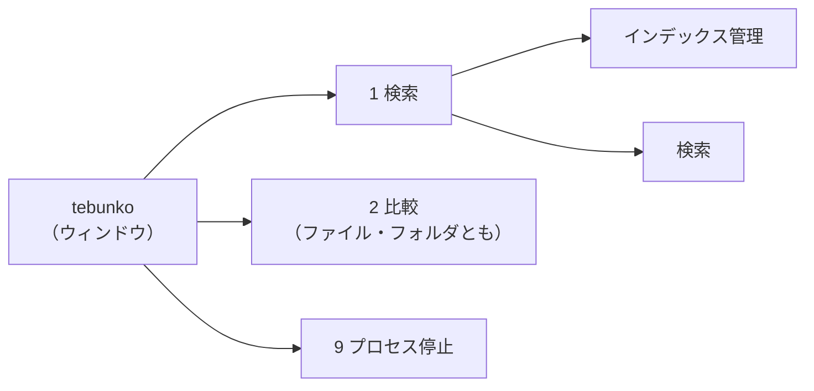
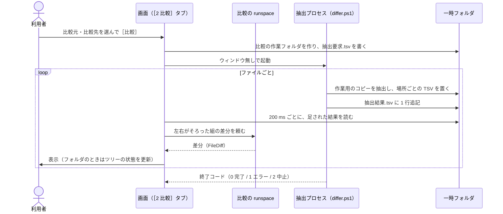
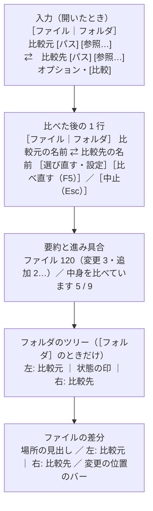
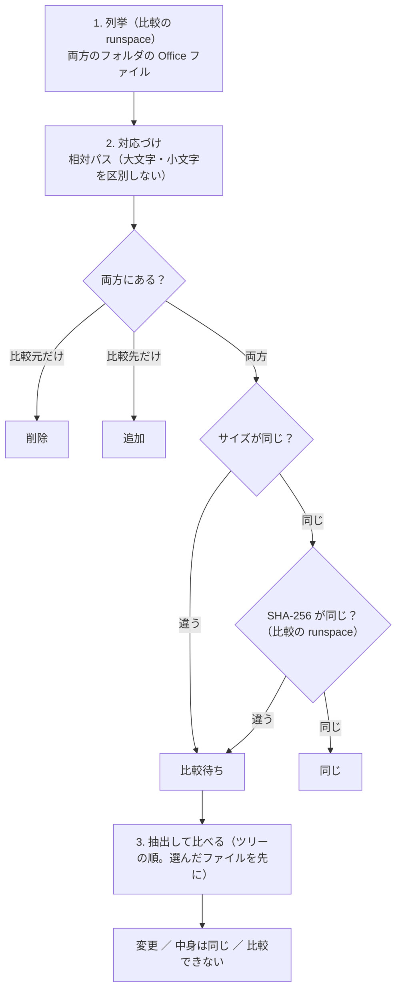
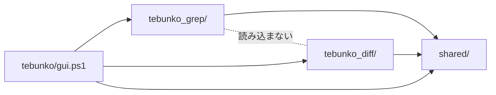

# tebunko 統合と比較（tebunko_diff）設計書

本書は、検索ツール `tebunko_grep` と比較ツール `tebunko_diff` を 1 つの入口 `tebunko` から使えるようにした仕組みと、比較（［2 比較］タブ）の仕様を定める。記載内容は**現行実装の挙動**を正とする。

---

## 1. 目的と範囲

### 1.1 目的

- 検索と比較を **1 つの入口（`tebunko.bat`）・1 つのウィンドウ** から使えるようにする。
- Office ファイル（Excel・Word・PowerPoint）の **中身の文字の差分** を、ファイルを開かずに確かめられるようにする。比べる対象は次の 2 つ。どちらも 1 つの［2 比較］タブで、先頭の［ファイル｜フォルダ］のトグルで切り替える。
  - ファイル 2 つ
  - フォルダ 2 つ（その下のフォルダを含む）

### 1.2 方針

| 項目 | 方針 |
|---|---|
| インデックス | **検索だけのもの。** 比較はインデックスを使わず、読み書きもしない |
| 比較のしかた | **都度比較。** ［比較］を押すたびに元のファイルから抽出する。抽出したものは一時フォルダに置き、画面を閉じたら消す |
| 抽出 | インデクサと同じ抽出（`shared/office/office_extract.ps1`）を使う。原本は作業用のコピーを読み取り専用・マクロ無効で開く |
| 比べる単位 | 場所（シート・ページ・スライド）ごとに、行（Excel の 1 行、Word・PowerPoint の 1 段落）の並びの差分を取る。Excel は行の挿入・削除も見つける |

### 1.3 やらないこと

- 書式（色・フォント・罫線・列幅）、画像、数式そのものの比較（Excel は表示されている値で比べる。インデックスと同じ）
- ファイルの書き換え（マージ・差分の反映）
- 種類の違うファイルどうしの比較（Excel と Word など）。`.xls` と `.xlsx` のように、同じ種類で形式が違うものは比べられる
- 名前を変えたファイル・シートの対応づけ（削除と追加として出す。[12 章](#12-未決事項後回しにすること)）
- Excel の列の挿入・削除を見つけること（[4.4](#44-excel)）

---

## 2. 画面の構成

### 2.1 入口

| 起動 | 動き |
|---|---|
| `tebunko.bat` | 入口。`scripts/tebunko/gui.ps1` を開く。［1 検索］で開く |

- ウィンドウのタイトルは `tebunko`、アイコンは `scripts/tebunko/tebunko.ico`。
- 多重起動の防止は、ツールの配置フォルダごとに 1 つのウィンドウ。名前付きミューテックスは `tebunko_gui_<配置フォルダのハッシュ>`（ハッシュは `getFolderKey`）。2 つ目を起動すると、開いている画面を前面に出して終わる。
- 以前の版の画面（`tebunko_grep_gui_<ハッシュ>`）とは名前が違うため、同じフォルダで以前の版の画面を開いたまま新しい版を起動しても止められない。版を上げるときは、以前の版の画面を閉じてから移す（移行の手順は README）。

### 2.2 タブ

タブは 2 段。インデックスは検索だけのものなので、［インデックス管理］は［1 検索］の下に置く。



| 1 段目 | 2 段目 | 中身 |
|---|---|---|
| ［1 検索］ | ［インデックス管理］［検索］ | 検索（tebunko_grep）。2 段目の見出しは `SubTabs`（theme.xaml） |
| ［2 比較］ | –（2 段目は無い） | 本書の 5・6 章 |
| ［9 プロセス停止］ | – | `shared/ui/process_tab.ps1`（検索と比較で共通） |

- ［1 検索］の 2 段目の既定: インデックス作成中・中断中、またはインデックスが無ければ［インデックス管理］、それ以外は［検索］。
- 取り込みに失敗したファイルがあると、［インデックス管理］と［1 検索］の見出しの両方に ⚠ を付ける。
- ［9 プロセス停止］は、インデックス作成中・比較中（各ツールが `registerBusyCheck` で知らせる）には見出しに ⚠ を付けず、終了の前に「いま〜で読み取り中のファイルは失敗あつかいになります」を出す。

### 2.3 キーボード操作

［1 検索］の中のキー操作は、以前の版と同じ（[03_画面_5_共通仕様.md 9 章](03_画面_5_共通仕様.md#9-キーボード操作)）。

| キー | 動き |
|---|---|
| Ctrl+1 / Ctrl+2 / Ctrl+9 | 1 段目のタブを切り替える |
| Ctrl+Tab / Ctrl+Shift+Tab | フォーカスのあるタブの並びを切り替える（WPF の標準の動き） |
| Ctrl+F / Ctrl+Shift+F | どのタブからでも［1 検索］→［検索］の検索ワード欄・絞り込み欄へ移る |
| F5 | ［インデックス管理］［検索］［9 プロセス停止］は以前と同じ。［2 比較］では同じ条件で比べ直す |
| F8 / Shift+F8 | ［2 比較］で次の変更・前の変更へ移る（場所・ファイルをまたいで移る） |
| Ctrl+↓ / Ctrl+↑ | ［2 比較］のフォルダ同士で、次・前の違うファイルへ移る |
| Esc | ［2 比較］で比べている途中なら中止する（抽出中の 1 ファイルが終わると止まる） |

### 2.4 速さ（サクサク確認できること）

画面は WPF で作る。**確かめる操作（ファイルを選ぶ・変更へ移る・スクロール・タブの切り替え）で待たせない**ことを、何より優先する。

**目安**

| 操作 | 目安 |
|---|---|
| フォルダ同士で、差分を計算済みのファイルを選び直してから差分が出るまで | 0.2 秒以内（覚えている差分をそのまま出す） |
| F8 / Shift+F8、左右の表示と一覧の切り替え、場所の切り替え | 0.1 秒以内 |
| スクロール | 引っかからない（行は仮想化している） |
| 比べている間の操作（別のファイルを選ぶ・スクロール・中止） | 止まらない |
| 10,000 行・違い 100 か所のシートの差分（裏の runspace） | 5 秒以内（`Slow` タグのテストで確かめる。手元の実測は約 2 秒） |

**決まり**

1. **画面のスレッドでは重い処理をしない。**
   - 抽出（COM）は抽出プロセス（`differ.ps1`）で行う。
   - フォルダの列挙・ハッシュ・差分の計算・左右の行の組み立て（そろえる・たたむ・文字の区切り）は、**比較の runspace** で行う。
   - 比較の runspace は画面を開いたときに 1 つだけ作り、比較の部品（`tebunko_diff/lib.ps1`）を 1 回だけ読み込む。仕事は 1 つずつ順に渡す（選んだファイルの仕事は先に回す）。呼ぶたびに runspace を作ると、部品の読み込みに毎回 0.5 秒ほどかかるため。
   - 画面のスレッドは、できた結果を表に渡すだけにする。
2. **行は仮想化する。** 左右の差分・一覧・フォルダのツリーは、いずれも仮想化した `ListBox`（`VirtualizingStackPanel`・`VirtualizationMode=Recycling`・`CanContentScroll=True`）で作る。
3. **重い部品を使わない。**
   - `DataGrid`・`TreeView` は使わない（ツリーは開いている行だけの平らな一覧にする）。
   - 行の種類（文字の行・Excel の行・スライドの見出し・小見出し・たたんだ行・空き）ごとに `DataTemplate` を分け、`ContentControl` のスタイルで選ぶ。選んだ型の部品だけを作る。
4. **文字の区切りは裏で先に作る。** 変更の行の違う文字の区切り（`DiffSeg`）は、比較の runspace で行を組み立てるときに作る（1 つの場所で 3,000 行まで。超えた行は行全体を変更として示す）。変更の行はふつう少ないため、画面の側で見えた行だけ計算する仕組みは作らない。
5. **画面の更新はまとめて行う。**
   - 抽出の結果・進み具合はタイマー（200 ms）で読む。`抽出結果.tsv` は、前回読んだ位置より後に書き足された行だけを読む（`readNewExtractResults`）。
   - フォルダのツリーは、比べている間は 1.5 秒に 1 回まで並べ直す（ファイルが多いと並べ直しに時間がかかるため）。利用者の操作（開く・閉じる・選ぶ）ではすぐ並べ直す。
6. **一度出した差分は覚えておく。** 直近 30 ファイルの差分（`FileDiff`）をメモリに残し、選び直したら計算し直さずに出す。抽出した TSV は画面を閉じるまで一時フォルダに残す。
7. **速く選び直しても、たまらない。** ↑↓ で次々にファイルを選んだときは、止まってから 150 ms たったファイルだけを表示する。比べ直したら、前の比較の結果が後から届いても使わない（`Generation`）。
8. **PowerShell の遅いところを避ける。** 関数の呼び出し・`New-Object`・パイプラインは 1 回ごとに数十マイクロ秒かかる。差分の計算の中の 1 行・1 セルごとに回るところでは、これらを使わず、型付きの配列・`List[T]`・`Dictionary`・`::new()` と `for` で書く。

---

## 3. 比較の流れ（共通）

### 3.1 全体



- 抽出は別プロセスで行う。Office（COM）が応答しなくなっても画面が止まらないようにし、時間切れのときにそのプロセスが起動した Office だけを終了できるようにするため（インデクサと同じ考え方）。

### 3.2 抽出プロセス（`scripts/tebunko_diff/differ.ps1`）

```
powershell.exe -NoProfile -ExecutionPolicy RemoteSigned -WindowStyle Hidden -File differ.ps1 -JobDir <比較の作業フォルダ>
```

| 項目 | 内容 |
|---|---|
| 入力 | `<JobDir>\抽出要求.tsv`。1 行 1 ファイルで `<番号><TAB><側（left / right）><TAB><元のファイルのパス>`。**ファイルの切れ目ごとに読み直し**、足された行も抽出する（フォルダ同士で片方にしか無いファイルを選んだとき、画面が書き足す）。結果のあるものは抽出し直さない |
| 出力 | `<JobDir>\<側>\<番号>\<場所>.tsv`（TSV の名前と中身はインデックスと同じ規則）と、抽出した順を並べた `順番.txt`（場所の順番） |
| 結果 | `<JobDir>\抽出結果.tsv` に 1 件ごとに追記する。`<番号><TAB><側><TAB><状態（済 / 失敗）><TAB><TSV数><TAB><エラー>` |
| 進み具合 | `<JobDir>\進捗.txt`。`<済んだ数><TAB><全体の数><TAB><今のファイルのパス>` |
| 優先 | 画面が `<JobDir>\優先.tsv`（`<番号><TAB><側>` を上から）に書くと、次にそのファイルを抽出する。抽出中のファイルは止めない（Excel を途中で止めると起動し直すことになり、かえって遅いため） |
| 中止 | 画面が `<JobDir>\中止要求` を作ると、ファイルの切れ目で止まる。画面を閉じるとき・比べ直すときは、1.5 秒待っても終わらなければプロセスを終了する（子の Office は抽出プロセスの watchdog が見ている） |
| 終了コード | 0 = 完了（ファイルごとの失敗は 抽出結果.tsv）、1 = 続けられないエラー（`<JobDir>\比較エラー.txt` に原因）、2 = 中止 |

- 抽出は `extractOfficeFile`（インデクサと同じ）。作業用のコピーは `<JobDir>\work\` に置き、1 ファイルごとに空にし、終わったら消す。
- Office アプリ（Excel）は、1 回の抽出の中で使い回す。終わったら `stopAllApps` で閉じる。
- Word・PowerPoint の新形式（`.docx` `.pptx` 等）は Office を使わずに読む。旧形式だけ Word・PowerPoint で新形式に変換する。

### 3.3 一時フォルダ

```
%TEMP%\tebunko\diff\<画面の PID>\<比較の番号（日時）>\
    抽出要求.tsv  抽出結果.tsv  進捗.txt  優先.tsv  中止要求  比較エラー.txt
    left\<番号>\<場所>.tsv  順番.txt
    right\<番号>\<場所>.tsv 順番.txt
    work\         … 作業用のコピー（抽出中だけ）
```

- **比べ直すと、前の比較の作業フォルダを消す。** 残すのは、今表示している比較の分だけ。
- 画面を閉じるときに `%TEMP%\tebunko\diff\<画面の PID>\` を消す。
- 画面が強制終了されて残った分は、次に画面を開いたときに消す（`%TEMP%\tebunko\diff\` の下で、その PID のプロセスが無いフォルダ。`removeStaleDiffDirs`）。
- 本文の平文の写しを `work/` に残さない。比較の中身は、利用者が画面を閉じれば消える（［結果をファイルに出力］したときだけ `work\tebunko_diff\比較結果.txt` に残る）。

### 3.4 時間切れと失敗

- 1 ファイルの抽出は **10 分** で打ち切る（`${diffFileTimeoutMinutes}`）。watchdog（`startWatchdog`）がそのプロセスの起動した Office を終了し、そのファイルは失敗（「10 分以内に読み取れなかったため中止しました（Officeアプリを強制終了しました）」）にして次へ進む。
- 失敗の原因の文言は、インデクサと同じ `describeIngestError`（`shared/office/office_files.ps1`）で作る。画面には「比較元を読み取れませんでした。（<原因>）」の形で出す。

---

## 4. 差分の取り方

### 4.1 行の対応（`scripts/tebunko_diff/diff/diff_core.ps1`、判断層）

行を比べるための形にし（`getCompareKeys`）、**空の行を除いて**から整数の番号に置き換え（同じ文字列は同じ番号。`getLineKeys`）、次の順に対応を求める（`getLineMatches`）。PowerShell は 1 回ごとの処理が遅いため、比べる量を先に減らす。

- 比べるための形: ［空白の違いを無視］［大文字と小文字を区別］の設定に合わせて整える。Excel の行は、右端の空のセル（TSV の行末のタブ）を落とし、値のあるセルだけで比べる。
- 空の行（空白だけの行、値が 1 つも無い Excel の行、空の段落）は比べず、差分の一覧にも出さない。空の行を足した・消しただけでは差分にしない。行番号は元の位置のまま出す（間の空の行の分だけ番号が飛ぶ）。


1. 前後の一致する行を取り除く。
2. 両方に 1 回ずつしか出てこない行を目印にし、両方で順番がそろう最長の並び（最長増加部分列）を選び、その目印で区間に分ける（patience diff）。区間ごとに 1. からくり返す。
3. 目印が無い区間だけを **Myers の O(ND) 法** で比べる。違いの数 D が **300**（`${diffMaxMyersD}`）を超える区間は、その区間だけまとめて置き換え（削除と追加）にする。

- 第三者のライブラリは使わない。
- 1 つの場所で、どちらかが **100,000 行**（`${diffMaxLines}`）を超えたら行ごとには比べず、「行が多すぎるため（上限 100000 行）、行ごとには比べていません。中身は同じです／違います。」とだけ出す。
- patience diff は最長の対応を必ず返すとは限らないが、目印（1 回しか出てこない行）で区切るため、行の挿入・削除のずれが起きにくい。Myers の部分は最長の対応を返すことをテストで確かめる。

### 4.2 変更の組み立て

一致しなかった区間の削除と追加を、前から順に組んで **`変更`** にする（`getAlignedPairs`）。

- 組んだ 2 行の似ている度合いが下限以上なら `変更`、下限未満なら組まない。組まないときは、1 行先に似ている行があればそれと組み（間の行は `追加`・`削除`）、無ければ `削除` と `追加` に分ける。
- 似ている度合い:
  - 文字の行（Word・PowerPoint の段落、Excel の図形・コメント）: 2 文字ずつの組の重なり（Dice 係数。`getTextSimilarity`）が **0.3** 以上。1 文字以下の行は、同じでなければ 0。
  - Excel の行: 同じ列で同じ値のセルの割合（`getCellSimilarity`）と、行の文字の Dice 係数の大きい方が **0.4** 以上。
- `変更` の行は、文字の単位で差分を取り（同じ方法。1 行 **2,000 文字**まで）、違う部分を強調する（`getCharSegments`）。

| 種類 | 意味 | 比較元の位置 | 比較先の位置 |
|---|---|---|---|
| 追加 | 比較先にだけある | 空き（斜線） | あり |
| 削除 | 比較元にだけある | あり | 空き（斜線） |
| 変更 | 両方にあり、中身が違う | あり | あり |

### 4.3 比べ方の設定

| 設定 | 既定 | 内容 |
|---|---|---|
| ［図形も比較］ | オン | 場所の `[図形]` を比べる（検索の［図形も検索］と同じ分け方） |
| ［コメントも比較］ | オン | 場所の `[コメント]` を比べる |
| ［空白の違いを無視］ | オフ | 行を比べる前に、続く空白（半角・全角）を 1 つにし、セルの区切り（タブ）の前後と行頭・行末の空白を取る |
| ［大文字と小文字を区別］ | オン | オフにすると、英字の大文字・小文字の違いを無視する |

### 4.4 Excel

| 項目 | 内容 |
|---|---|
| 場所の対応 | シート名で対応づける（大文字・小文字を区別しない）。片方にしか無いシートは、シートごと `追加` / `削除`。並びは比較先の順を基にし、比較元にしか無いシートは、比較元でその前にあったシートの後ろに入れる（`mergePlaceOrder`）。シートの順番の違いは差分にしない |
| 比べる単位 | TSV の 1 行 = シートの 1 行（空の行も行番号を保つため残っている）。セルの値の並び（右端の空のセルは落とす）で対応を取り、**行の挿入・削除を見つける**。値の無い行は比べず、表にも出さない |
| 変更の中身 | `変更` の 2 行は同じ列どうしでセルを比べ、値の違うセルだけに色を付ける。値の違うセルが無ければ（［空白の違いを無視］で同じになったときなど）`変更` にしない。説明は `B5：10 → 12　C5：120,000 → 144,000`（行番号が違えば `B2→B3：1 → 2`。5 セルまで） |
| 表示 | 左右それぞれを、列の見出し（A・B・C…）と行番号の付いた表として出す。列は **100 列**まで。列の幅は左右で同じにし、値の長い方に合わせる（Shift_JIS のバイト数 × 7 + 14 px。44〜240 px。先頭の 3,000 行で測る） |
| 図形・コメント | `<シート名>[図形]` `<シート名>[コメント]` は別の場所として比べる。1 行が `<セル番地><TAB><文字>` なので、文字の行として比べ、行番号の欄にセル番地を出す。開くときは元のシートのそのセル |
| 引用符・改行 | 引用符で囲まれたセルは外し、セル内の改行（U+2028）は ` ↵ ` で出す |
| 非表示のシート | 比べない（インデックスと同じく抽出しない） |

**列の挿入・削除**は見つけない。列を 1 つ挿入すると、それより右にセルのある行が `変更` になる。

### 4.5 Word

| 項目 | 内容 |
|---|---|
| 比べる単位 | 本文（`ページNNN` をページの順につなぐ）・脚注・コメント（`ページNNN[コメント]` と `文書[コメント]`）・図形（`ページNNN[図形]`）・ヘッダー・フッター・その他の場所を、それぞれ 1 つの場所として比べる（`getWordGroups`） |
| ページ | ページの区切りは目安で、段落の増減で動きやすいため、対応づけに使わない。ページが変わっても、同じ段落は横に並ぶ |
| 行番号の欄 | `p.3 ¶2`（ページ 3 の 2 番目の段落。ページの無い場所は `¶2`） |
| 変更の中身 | 段落の違う文字を強調する |

### 4.6 PowerPoint

| 項目 | 内容 |
|---|---|
| 場所 | スライド・ノート・図形・コメントは、1 つの場所「スライドとノート」にまとめる。スライドに属さない場所（ヘッダー・フッター）は別の場所 |
| スライドの対応 | スライドの本文（段落を改行でつないだもの）で対応を取る（4.1 と同じ方法）。一致しなかったスライドは、本文とノートをつないだ文字の似ている度合い（Dice 係数）が **0.4** 以上の組を順に対応づけ、残りを `追加` / `削除` にする |
| 並べ方 | スライドごとに見出しの行（`スライド 4　費用`）を入れ、その下に本文の段落、ノート・図形・コメント（それぞれ小見出しの下）を並べる。見出しの色で、スライドの追加（緑）・削除（赤）・変更（青）を表す |
| 番号・非表示 | 対応づけたスライドの番号が左右で違えば、見出しに「比較元はスライド 3」と出す。場所の名前 `スライドNNN（非表示）` から非表示を読み、非表示かどうかが変わったら「非表示にした」「表示にした」を出す（行が同じでも変更にする） |
| たたむ | 変わらないスライドが続くところは「変わらないスライド N 枚（スライド a〜b）」の 1 行にまとめる |

---

## 5. ［2 比較］タブ

ファイルの比較とフォルダの比較を、**1 つのタブ** で行う。どちらを比べるかは、入力欄の先頭の **［ファイル｜フォルダ］のトグル** で選ぶ。トグルで、選べるもの（ファイルかフォルダか）と、使えるオプションが変わる。

**画面の左半分はすべて比較元、右半分はすべて比較先** にする（入力欄・フォルダのツリー・ファイルの差分のどれも）。

### 5.1 レイアウト



| トグル | 出すもの |
|---|---|
| ［ファイル］ | 要約とファイルの差分。ツリーは出さない |
| ［フォルダ］ | 上にフォルダのツリー、下に選んだファイルの差分。境目はドラッグで動かせ、ツリーの高さは `diffTreeHeight` に覚える |

- 比べる前は、入力欄の下に「比べる 2 つのファイルを選ぶか、ここへドロップしてください」の案内を出す。
- 比べると入力欄を 1 行にたたむ。1 行の名前をクリックするか、［選び直す・設定］を押すと、入力欄を開き直す。1 行のトグルを切り替えたときも入力欄を開き直す（比べている途中なら中止する）。

### 5.2 入力

**トグル（［ファイル｜フォルダ］）**

- 既定は、最後に使った側（`diffMode`）。初めて開いたときは［ファイル］。
- パスは側ごとに覚える（`diffFileLeft` / `diffFileRight`、`diffFolderLeft` / `diffFolderRight`）。切り替えると、その側の最後のパスに入れ替える。入れていた分は捨てずに、元の側に戻せば戻る。

**トグルで変わるもの**（`getModeView`）

| 項目 | ［ファイル］ | ［フォルダ］ |
|---|---|---|
| ［参照…］が開くもの | ファイルを開くダイアログ（Office の拡張子で絞る） | フォルダ選択ダイアログ（`dialog_folder_select.xaml`） |
| パスの欄の案内 | 「ファイルを選ぶか、ここへドロップ」 | 「フォルダを選ぶか、ここへドロップ」 |
| ［サブフォルダも比較］［同じファイルを隠す］ | 押せない（灰色。ツールチップ「フォルダを比べるときだけ使えます」） | 使える（既定はオン） |
| 共通の 4 つ（[4.3](#43-比べ方の設定)） | 使える | 使える |

- 押せないオプションは隠さずに灰色で残す。トグルを切り替えても画面の配置が動かないようにするため。
- オプションは「フォルダのとき」と「共通」の 2 段に並べる。共通のオプションは両方の側で同じ値（`diffOptions`）。

**パスの入れ方**

- ［参照…］、パスの欄への貼り付け、ドラッグ&ドロップ。UNC パス・ネットワークドライブも入れられる。パスの欄で Enter を押すと比べる。
- ドラッグ&ドロップ（`getDropAction`）:
  - 2 つをまとめてドロップしたら、名前の順に比較元・比較先に入れ、**そのまま比べる**。ファイルとフォルダが混ざっていたら入れない。
  - 1 つは、タブの左半分にドロップしたら比較元、右半分なら比較先に入れる。
  - トグルと違うもの（［ファイル］のときにフォルダ）をドロップしたら、トグルをそちらに切り替える。
- 入力欄の［⇄］は入れ替えるだけ。比べた後の 1 行の［⇄］は、入れ替えて比べ直す。

**［比較］を押せないとき**（`getCompareBlockReason`。理由を［比較］の左に出す）

- どちらかが空: 「比較先のファイルを選んでください。」など
- 見つからない: 「比較元のファイルが見つかりません。」
- トグルと違うもの: 「比較元はフォルダです。［フォルダ］に切り替えるか、ファイルを選んでください。」など
- ［ファイル］で、Office でない・種類が違う: 「Excel・Word・PowerPoint のファイルを選んでください。」「種類の違うファイル（Excel と Word）は比べられません。」
- 同じもの: 「同じファイルが選ばれています。」
- ［フォルダ］で、一方がもう一方の中にある: 「比較先のフォルダが比較元のフォルダの中にあります。」（［サブフォルダも比較］がオフなら比べられる）

比べるたびに、パスとオプションを `setting.config` に保存する（[7 章](#7-設定ファイル)）。

### 5.3 ファイルの差分（左右に並べる・既定）

- **場所の見出し**: 場所（シート・本文・スライドとノート など）を、Excel のシートの見出しのような横のタブで切り替える。見出しには違いの数と「（追加）」「（削除）」を付け、違いの無い場所は薄く出す。最初は違いのある最初の場所を開く。
- **左右の並べ方**: 左に比較元、右に比較先。対応した行は同じ高さに並べ、片方にしか無い行は、もう片方に空き（斜線）を置く。縦のスクロールは左右で 1 つ（左右の行を 1 つの一覧の行として持つので、ずれない）。
- **色**: 行の背景は、追加は薄い緑、削除は薄い赤、変更は薄い青。違う部分は、Excel は違うセル、文字の行は違う文字に濃い色を付ける（削除した文字は取り消し線も）。
- **同じ行をたたむ**（既定はオン。`diffFoldSame`）: 変更の前後 2 行を残し、続く同じ行（3 行以上）を「▸ 同じ行 N 行（行 a〜b）」の 1 行にまとめる（`foldSameRows`）。クリックで開く。Word は「同じ段落 N 個」、Excel の図形・コメントは「同じ N 件」。
- **変更の位置のバー**: 右の端に、場所全体での変更の塊の位置を色の印で出す（400 個まで）。クリックすると、その位置の変更へ移る。
- **Excel の横のスクロール**: 表の下の横のスクロールバーで、左右の表がそろって動く（列の見出しも）。
- **選んだ行**: 下の欄に変更の説明（Excel は違うセル）を出し、［比較元を開く］［比較先を開く］を押せるようにする。
- **ダブルクリック**: 押した側（左半分なら比較元、右半分なら比較先。空きの側なら反対側）のファイルを、その位置で開く。
  - Excel はそのシートのそのセルを選んで開く（`openInExcel`）。Excel が操作できなければ、既定のアプリで開く。
  - Word・PowerPoint はファイルを開くだけ（ページ・スライドへは移らない）。
  - 開き方（通常・読み取り専用・新規）は、検索の［開き方］と同じ設定（`openMode`）を使う。
- **F8 / Shift+F8**: 次・前の変更の塊の先頭へ移る（`findNextChangeRow`）。場所の最後まで来たら次の違いのある場所へ、ファイルの最後まで来たら（フォルダのとき）次の違うファイルの最初の変更へ移る。

### 5.4 一覧の表示

［左右に並べる］と［一覧］を切り替えられる（`diffView`）。一覧は、変更の行（とスライドの見出し）だけを 1 行ずつ並べる。

- 列は「種類」「比較元の位置」「比較先の位置」「比較元」「比較先」。違う部分は左右の表示と同じ色で強調する。
- 行をダブルクリックすると、比較先のその位置を開く（`削除` の行は比較元）。

### 5.5 要約と進み具合

- ［ファイル］: `シート 4 のうち 3 に変更`（違いが無ければ `違いはありません。（シート 4）`）と、件数（`追加 2・削除 1・変更 3`）。PowerPoint は `スライド 6 → 7` と `スライド追加 1・スライド削除 1・…`。
- ［フォルダ］: `ファイル 120（変更 3・追加 2・削除 1・比較できない 1・中身は同じ 1・同じ 105）`。
- 比べている間は、要約の横に細い進捗バーと「比較元を読み取り中…」「違いを調べています…」「中身を比べています 5 / 9」を出す。比べている間も、ツリーの操作と、比べ終わったファイルの差分の表示はできる。
- ［結果をファイルに出力］で `work\tebunko_diff\比較結果.txt` に書き出す（[8 章](#8-比較結果ファイル)）。比べている間は押せない。

### 5.6 中止・比べ直し・閉じる

- ［中止］・Esc: 抽出プロセスに中止を頼み、待っている仕事を捨てる。読み取り済みのファイルの結果は残す。
- ［比べ直す］・F5: 入力欄の内容で比べ直す（抽出からやり直す）。
- ウィンドウを閉じる: 比較は閉じれば要らなくなるため、**聞かずに**止める（抽出プロセスを終わらせ、比較の runspace を閉じ、この画面の作業フォルダを消す）。インデックス作成中の確認は、以前と同じく［1 検索］の側で出す。

---

## 6. フォルダ同士の比較

### 6.1 フォルダのツリー（左右に並べる）

左に比較元のフォルダ、右に比較先のフォルダを、**同じ並びのツリー** として出す（`buildTreeRows`）。

- **行**: 両方のフォルダの中身を相対パス（大文字・小文字を区別しない）で対応づけ、1 つの行に左右を並べる。並びは、フォルダが先、同じ階層の中は名前の順。名前は日本語（`ja-JP`）の規則で並べ、Windows の表示言語が違う PC でも同じ順にする（`diff_folder.ps1` の `$diffSortCulture`）。
- **片方にしか無いもの**: もう片方は斜線の空きにする。フォルダごと片方にしか無いときも同じ（「フォルダ · N ファイル」）。
- **中央の印**:

  | 印 | 状態 | 名前の色 |
  |---|---|---|
  | `≠` | 変更 | 青 |
  | `+` | 追加（比較先だけ） | 緑（行の背景も） |
  | `−` | 削除（比較元だけ） | 赤（行の背景も） |
  | `≈` | 中身は同じ（バイトは違うが、抽出した文字が同じ） | 灰 |
  | `=` | 同じ（バイトが同じ） | 灰 |
  | `!` | 比較できない | 橙 |
  | `…` | 比較待ち・比較中 | 黄 |

- **フォルダの行**: 中の状態をまとめる。中に違い（変更・追加・削除・比較できない）があれば `≠` と「違い N」、比べている途中なら `…` と「比較中 a / b」、全部同じなら `=`。
- **ファイルの行**: 名前と、右側に結果（`変更 6 · ` `中身は同じ · ` など）・サイズ・更新日時。
- **開く・閉じる**: 利用者が開いた・閉じたフォルダは覚える。どちらでもないフォルダは、中に違いがあれば開き、全部同じなら閉じる。［すべて開く］［すべて閉じる］。
- **［同じファイルを隠す］**（既定はオン。`diffHideSame`）: `=` のファイルと、中がすべて `=` のフォルダを隠す。隠した数をチェックの横に出す。
- **作り方**: 開いている行だけの平らな一覧を、仮想化した `ListBox` に出す（`TreeView` は行の多いときに仮想化が効きにくく、遅いため）。

**操作**

| 操作 | 動き |
|---|---|
| ファイルを選ぶ（クリック・↑↓） | 止まってから 150 ms 後に、下にそのファイルの差分を出す。覚えている差分はすぐ出す。まだなら「読み取っています…」を出し、抽出済みなら差分を先に頼み、未抽出なら抽出の順番の先頭に回す（`優先.tsv`） |
| `+` `−` のファイルを選ぶ | そのときに片方だけを抽出し（抽出要求に書き足す）、片方だけの中身を出す（もう片方は空き） |
| `=` のファイルを選ぶ | 「同じファイルです。（バイトまで同じ）」 |
| フォルダを選ぶ | 差分の欄に、そのフォルダの中の件数の内訳を出す |
| クリック（フォルダ）・→ / ← / Enter | フォルダを開く・閉じる |
| Ctrl+↓ / Ctrl+↑ | 次・前の違うファイル（`≠` `+` `−` `!`）へ移る。閉じたフォルダの中にあれば開く（`findNextDiffEntry`） |
| Tab | ツリーから差分へフォーカスを移す |

### 6.2 比べる順番

Excel の抽出は 1 ファイルに数秒かかる。このため、先にツリーを出し、中身は裏で順に比べる。



1. **列挙**: 対象は Office の拡張子（`${officeExtensions}`）。Office の一時ファイル（`~$` で始まるもの）は除く（インデクサのクロールと同じ `findOfficeFiles`）。［サブフォルダも比較］がオフなら直下だけ。長いパスは `toLongPath`（`\\?\` を付ける）で扱う。アクセスできないフォルダがあれば、ステータスに知らせる。
2. **対応づけとハッシュ**: 列挙が終わったらツリーを出す。サイズが同じ組だけ SHA-256 を計算し、同じなら `同じ` にする。
3. **抽出と比較**: 残った組（`比較待ち`）に番号を振り、ツリーの順に抽出要求へ書いて抽出プロセスを起動する。左右がそろった組から比較の runspace で差分を取り、状態を `変更` / `中身は同じ`（抽出した文字に違いが無い）にする。抽出中のファイルは `比較中` にする。

- 上限: 両方合わせて **10,000 ファイル**（`${diffMaxFiles}`）。超えたら比べずに「ファイルが多すぎます（N 件。上限 10000 件）。フォルダを絞ってください。」を出す。
- `追加` `削除` のファイルは、選んだときだけ抽出する（比べる相手が無いため、先回りしない）。

---

## 7. 設定ファイル

`setting.config` は 1 ファイルのまま使い、比較のキーは `diff` で始める。読み書きは `shared/core/settings.ps1` で、**書く側が知らないキー（ほかのツールの設定）を残して書き戻す**（`writeSettingsFile`）。キーと既定値はツールごとに持つ（比較は `tebunko_diff/core/settings_diff.ps1` の `newDiffSettings`）。保存は、読んで → 自分のキーだけ変えて → 書く（`updateDiffSettings`）。

| キー | 型 | 既定 | 内容 |
|---|---|---|---|
| `diffMode` | 文字列 | `"file"` | トグル（`file` / `folder`）。最後に使った側 |
| `diffFileLeft` / `diffFileRight` | 文字列 | `""` | ［ファイル］で最後に比べた比較元・比較先 |
| `diffFolderLeft` / `diffFolderRight` | 文字列 | `""` | ［フォルダ］で最後に比べた比較元・比較先 |
| `diffSubfolders` | 真偽 | `true` | ［サブフォルダも比較］ |
| `diffHideSame` | 真偽 | `true` | ［同じファイルを隠す］ |
| `diffOptions` | オブジェクト | 下のとおり | 比べ方（両方の側で共通）。`{ includeShapes: true, includeComments: true, ignoreWhitespace: false, caseSensitive: true }` |
| `diffView` | 文字列 | `"side"` | ファイルの差分の表示（`side` = 左右に並べる、`list` = 一覧） |
| `diffFoldSame` | 真偽 | `true` | ［同じ行をたたむ］ |
| `diffTreeHeight` | 数値 | `260` | フォルダのツリーの高さ（px。80〜2000） |

- 知らない値（`diffMode` が `file` / `folder` 以外など）は既定値にする。
- 以前の版の tebunko_grep で設定を保存すると、`diff` のキーは消える。消えても既定値で動く。

---

## 8. 比較結果ファイル

`work\tebunko_diff\比較結果.txt`（UTF-8 BOM 付き、CRLF。上書き）。作るのは `diff_report.ps1`。

```
比較元: C:\共有\営業部\見積_v1.xlsx
比較先: C:\共有\営業部\見積_v2.xlsx
日時:   2026/09/22 10:15:00
設定:   図形も比較・コメントも比較
要約:   シート 2 のうち 1 に変更（追加 1・削除 1・変更 1）

■ 明細
変更	2 → 2	B2：120,000 → 144,000
削除	3 → (2)	送料	500
追加	(3) → 3	保守費用	240,000
```

- 位置は `比較元の位置 → 比較先の位置`。空きの側は、直前にあるその側の行番号を括弧で出す。
- PowerPoint のスライドの追加・削除・変更は `□ スライド 4 変更（比較元はスライド 3）` の行で出す。
- フォルダ同士では、先頭にファイルの一覧（`<状態><TAB><相対パス><TAB><変更の件数・失敗の原因>`。ツリーの順）を出し、その後に変更のあるファイルごとに `==== <相対パス>（<要約>）` と上の形式で続ける。変更のあるファイルの中身は、書き出すときに抽出した TSV から比べ直す（覚えている差分は 30 ファイルまでのため）。

---

## 9. ソースの構成

### 9.1 フォルダ

```
tebunko.bat                      入口
scripts/
  shared/                        どのツールからも使う
    core/settings.ps1            setting.config の読み書き（知らないキーを残す）
    office/office_extract.ps1    Office から場所ごとの TSV を抽出する（extractOfficeFile）
    office/office_files.ps1      対象の拡張子・findOfficeFiles・describeIngestError・開き方の定数
    office/place_name.ps1        場所の名前 → TSV のファイル名（encodeIndexPlace・toIndexFileName）
    ui/open_file.ps1             元のファイルを開く（openInExcel・openWithShell）
    ui/process_tab.ps1           ［9 プロセス停止］（registerBusyCheck）
    xaml/tab_kill.xaml
  tebunko/                       入口。両ツールの画面を 1 つのウィンドウに組み立てるだけ
    gui.ps1                      画面の起動口（多重起動の防止・ウィンドウ・タブ・キー操作・後始末）
    xaml/tebunko.xaml            ウィンドウと 2 段のタブ
    tebunko.ico
  tebunko_grep/                  検索
    ui/grep_page.ps1             ［1 検索］のウィンドウ全体にかかわる処理
  tebunko_diff/                  比較
    lib.ps1                      画面以外の部品の読み込み口
    differ.ps1                   抽出プロセスの起動口
    core/paths_diff.ps1          一時フォルダ・受け渡しのファイル名・上限
    core/settings_diff.ps1       比較の設定の既定値と読み書き
    diff/diff_core.ps1           判断層: 行の対応・変更の組み立て・文字の区切り・たたみ（DiffRow・DiffSeg・DiffCell）
    diff/diff_office.ps1         判断層: Excel・Word・PowerPoint の比べ方（PlaceDiff・FileDiff）
    diff/diff_folder.ps1         判断層: フォルダの対応づけ・状態・ツリーの行（TreeRow）
    diff/diff_report.ps1         判断層: 比較結果ファイルと要約の文字
    job/diff_job.ps1             状態層: 作業フォルダ・受け渡しのファイル・抽出した TSV・ハッシュ・列挙
    ui/diff_view.ps1             判断層: 画面に出す文言・可否（トグル・押せない理由・ドロップ・次の変更）
    ui/types_diff.ps1            画面の型（DiffViewState・PlaceTab・ColumnHead）
    ui/diff_tab.ps1              ［2 比較］タブ（入力・比べる流れ・比較の runspace・抽出プロセスの見張り）
    ui/diff_pane.ps1             ファイルの差分の表示（左右に並べる・一覧・変更の位置のバー・開く）
    ui/diff_tree.ps1             フォルダのツリー
    xaml/tab_diff.xaml
```

### 9.2 読み込みの決まり



- `tebunko/` は両ツールと `shared/` を読み込んでよい。ツールの側からは、ほかのツールも `tebunko/` も読み込まない（`tests/meta/layers.Tests.ps1`）。
- `shared/` はツールを知らない。
- 判断層（`tebunko_diff/diff/*.ps1`・`*_view.ps1`）は `$ui`・`$window`・WPF の型に触らない。
- 判断層の型（`DiffRow` など）は、比較の runspace で作られて画面へ渡る。PowerShell の class は runspace ごとに別の型になるため、画面は型の名前で見分けず（`-is` を使わず）、プロパティだけを読む。型にはメソッドを持たせない。
- 比較の runspace へ渡す仕事の終わりの処理（`onDone`）に値を渡すときは、`GetNewClosure()` を使わず、仕事に付けた値（`context`）で渡す。閉じた scriptblock からは、画面で読み込んだ関数が見えなくなるため。

### 9.3 画面の組み立て

`tebunko/gui.ps1` は次を順に行う。

1. 多重起動の防止（開いている画面があれば前面に出して終わる）
2. 型（`shared` → `tebunko_grep` → `tebunko_diff`）と `app_host` の読み込み
3. `tebunko.xaml` の読み込みと、タブの中身（`tab_index.xaml`・`tab_search.xaml`・`tab_diff.xaml`・`tab_kill.xaml`）の読み込み。x:Name の対応表（`$ui`）を作る
4. 各タブの画面のファイルの読み込み（イベントの登録まで入っている）と、`registerBusyCheck`
5. `startGrepPage`・`startDiffPage`（前回の設定を入れ、残った作業フォルダを消し、比較の runspace を用意する）
6. `ShowDialog`
7. 閉じるとき: `confirmGrepClosing`（インデックス作成中の確認）→ `confirmDiffClosing`、閉じた後: `closeGrepPage`・`closeDiffPage`

---

## 10. テスト

| タグ | テスト | 内容 |
|---|---|---|
| Unit | `tests/tebunko_diff/diff/diff_core.Tests.ps1` | 行の対応（挿入・削除・空の行の多い並び・片方が空）、でたらめな並びでも対応が正しい形であること、Myers の部分が最長の対応になること（総当たりと比べる）、上限を超える区間、空白・大文字小文字の無視、似ている度合い、変更の組み立て、文字の区切り、たたみ |
| Unit | `tests/tebunko_diff/diff/diff_office.Tests.ps1` | Excel（シートの対応・行の挿入・空の行と右端の空のセルを差分にしない・違うセルの説明・行番号のずれ・1 セルの行・先頭が空の行・引用符・図形とコメント・オプション・列の幅・列名）、Word（ページをまたぐ段落・場所の分け方・空の段落）、PowerPoint（スライドの挿入・削除・番号のずれ・非表示・ノート・たたみ・ヘッダー・フッター）、場所の並び、大きすぎる場所 |
| Unit | `diff_folder.Tests.ps1`・`diff_report.Tests.ps1`・`ui/diff_view.Tests.ps1` | ツリーの行・状態・隠す・開閉・進み具合、次の違うファイル、比較結果ファイル、押せない理由・ドロップ・要約・次の変更 |
| Io | `core/settings_diff.Tests.ps1`・`tests/shared/core/settings.Tests.ps1` | 比較の設定の読み書き。検索の設定と比較の設定が互いに消えないこと |
| Io | `job/diff_job.Tests.ps1` | 作業フォルダの作成と後始末（PID の無いフォルダを消す）、受け渡しのファイル、書き込み途中の行、足された行だけを読むこと、TSV の移動と順番、列挙、ハッシュ |
| Office | `tests/tebunko_diff/differ.Tests.ps1` | 本物の Excel・Word・PowerPoint で抽出して比べる（テストデータの `Excel\2024\見積\A社.xlsx` と `Excel\2025\見積\A社.xlsx` など）、見つからないファイルの失敗、優先、中止、続けられないエラー |
| Slow | `diff_core.Tests.ps1` | 10,000 行・違い 100 か所のシートを 5 秒以内に比べる |
| Meta | `tests/meta/*` | 起動口（`tebunko/gui.ps1`・`indexer.ps1`・`differ.ps1`）からすべての .ps1 をたどれる、ツール同士が読み込まない、判断層が画面に触らない、`gui.ps1` が使う名前が XAML にある、起動用の .bat が 2 つとも RemoteSigned、`Visible = $true` は `open_file.ps1` だけ |

画面層（`diff_tab.ps1`・`diff_pane.ps1`・`diff_tree.ps1`・`grep_page.ps1`・`tebunko/gui.ps1`）は自動テストの対象外。PR では一時フォルダに写した画面を実際に動かし、Excel・Word・PowerPoint のファイル同士とフォルダ同士を比べて確かめる。

---

## 11. PR の範囲

1 つの PR で次をすべて入れる。

1. 入口: `tebunko.bat`・`scripts/tebunko/`・2 段のタブ・`tebunko_grep.bat` を無くす
2. `shared/` へ上げる: 抽出・クロールの列挙・場所の名前・失敗の文言・設定の読み書き・ファイルを開く処理・［9 プロセス停止］
3. 比較: `scripts/tebunko_diff/`（ファイル同士・フォルダ同士）
4. テスト（10 章）
5. 配布: zip は `tebunko-<版>.zip`、展開すると `tebunko/`。両方の `.bat` を入れ、カタログも両方を含める
6. ドキュメント: 本書、`00_index.md`・`00_共通_*`・`01_*`・`03_画面*`・`04_安全性.md`・README

**互換と版**: `setting.config`・インデックスの形式は変えない。zip の展開先のフォルダが `tebunko_grep/` から `tebunko/` に変わるため、PR は **`breaking`**（タイトルは `feat!: …`）とし、0.x の間なので **マイナー版** を上げる。マージとリリースの前に利用者の了承を得る。移行の手順:

1. `tebunko-<版>.zip` を展開する。
2. 前の `tebunko_grep\` フォルダから、`work\` と `setting.config` を新しい `tebunko\` フォルダへ移す。
3. 作ったショートカットは `tebunko.bat` に作り直す（`tebunko_grep.bat` は無くした）。

---

## 12. 未決事項・後回しにすること

| 項目 | 内容 |
|---|---|
| 列の挿入・削除（Excel） | 列の対応を先に決めてから行を比べる方式を検討する |
| 名前を変えたファイル・シート | 中身の似ている度合いで `削除` と `追加` を対応づける |
| Word・PowerPoint の位置で開く | ［比較先を開く］で、そのページ・スライドへ移る |
| 検索との連携 | 検索結果の右クリックで［比較元にする］［これと比べる］ |
| 対象ファイルの絞り込み（フォルダ同士） | 検索の「対象ファイル」と同じ書き方。今の解釈は tebunko_grep の `search_query.ps1` にあるため、使うなら `shared/` へ上げる |
| Word のページの区切りの行 | 左右に並べる表示に、ページ（目安）の区切りの行を入れる |
| 大きいフォルダでのツリーの並べ直し | 1 万ファイル近くでは並べ直しに 1 秒以上かかる。状態の変わった行だけを直す形にする |
