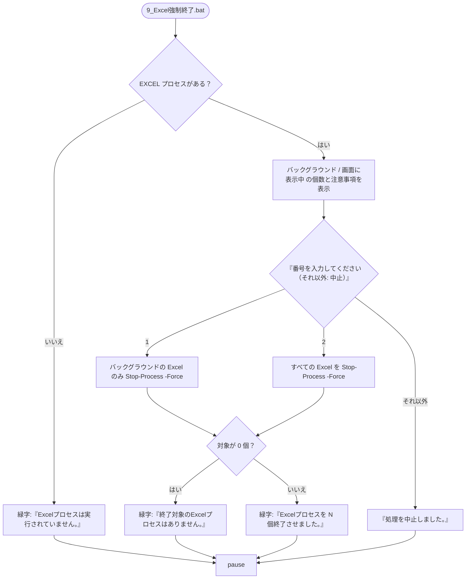

# Excel 強制終了 設計書

| 項目 | 内容 |
|---|---|
| 起動用バッチ | `9_Excel強制終了.bat` |
| スクリプト | `scripts/kill_process.ps1` |
| 使用する共通関数 | なし（`common.ps1` を読み込まない） |

全体構成・動作環境は [00_index.md](00_index.md) を参照。

---

## 1. 概要

変換（[01_変換.md](01_変換.md)）をウィンドウの×ボタン等で終了した際に残る、バックグラウンドの Excel プロセスを終了させる。

## 2. 入出力

ファイルの入出力は無い。対象は実行中の `EXCEL` プロセスのみ。

---

## 3. 処理フロー



### 3.1 画面表示

```
Excelプロセスが起動中です。
  バックグラウンド（画面に表示されていない）: <N> 個
  画面に表示中                              : <M> 個

※ 変換処理の実行中にバックグラウンドのExcelを終了すると、変換中のファイルは失敗扱いになります。
※ 画面に表示中のExcelを終了すると、保存していない内容は失われます。

  1: バックグラウンドのExcelのみ終了
  2: すべてのExcelを保存せずに終了
番号を入力してください（それ以外: 中止）:
```

### 3.2 判定・終了の仕様

| 項目 | 仕様 |
|---|---|
| 対象プロセス | プロセス名 `EXCEL` |
| バックグラウンドの判定 | `MainWindowHandle` が 0（画面にウィンドウを持たない）。COM で起動された Excel はこれに該当する |
| 画面に表示中の判定 | `MainWindowHandle` が 0 以外 |
| 終了方法 | `Stop-Process -Force`（保存確認なし） |

- 変換処理の実行中にバックグラウンドの Excel を終了すると、変換中のファイルは失敗扱いになる（変換処理は Excel を再起動して続行する。[01_変換.md](01_変換.md) の 5 章を参照）。

---

## 4. 実装上の注意点・既知の問題

確度: ◎ = 動作確認済み、○ = コード上明らか、△ = 推定。

| # | 内容 | 確度 |
|---|---|---|
| 1 | 画面に表示中の Excel でも、すべてのウィンドウを閉じた直後など `MainWindowHandle` が 0 の場合はバックグラウンドとして扱われる | △ |
