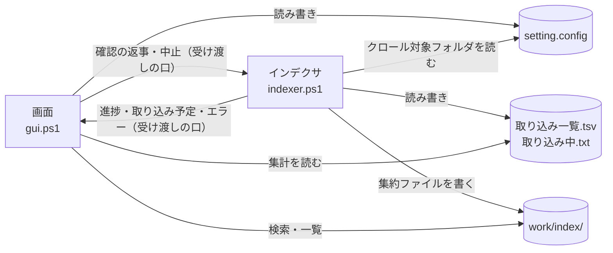

# フォルダ構成とデータの置き場所

## フォルダ構成

スクリプトの場所は `scripts/shared/core/paths.ps1` の `$rootDir`（= リポジトリ直下。このファイルから 3 つ上）を基準に決まる。`setting.config` は、ふつうは `$rootDir` の直下に置く（ツールのフォルダに書き込めないときは利用者ごとの場所）。インデックス・取り込み一覧・ログ（ワークスペース）は、既定で `%USERPROFILE%\Documents\tebunko_ws` に置き、利用者が画面で置き場所を変えられる（[データの置き場所](#データの置き場所settingconfigwork)）。**カレントディレクトリには依存しない。**
ファイル操作は `-LiteralPath` または .NET の `System.IO` を使い、`[` `]` を含むファイル名・フォルダ名を扱える。

### 利用者が使うもの

| パス | 種別 | 説明 |
|---|---|---|
| `tebunko.bat` | 起動用バッチ | 画面を開く（インデックス作成・検索・プロセス停止）。利用者が起動するのはこれだけ。`conhost.exe` 経由で PowerShell を `-ExecutionPolicy RemoteSigned -WindowStyle Hidden` で 1 回起動し、その中で `scripts` の中のファイルから Mark-of-the-Web を外して（`Unblock-File`。[安全性の要約](../../safety/index.md) の [Mark-of-the-Web の解除](../../safety/disclosure.md#mark-of-the-web-の解除tebunkobat)）から `gui.ps1` を開く。既定のターミナルが Windows Terminal だと `-WindowStyle Hidden` が効かず、PowerShell の窓が残るため `conhost.exe` を通す |
| `setting.config` | 設定 | 画面が保存する設定（JSON。無ければ既定値で動き、画面で設定を保存したときに作成する。git 管理外。[設定ファイル（setting.config）](settings-file.md)）。ツールのフォルダに書き込めないときは利用者ごとの場所に置く（[データの置き場所](#データの置き場所settingconfigwork)） |
| `work/` | 自動生成 | インデックス・状態ファイル・ログ（[入出力ファイル一覧](#入出力ファイル一覧)）。git 管理外。削除すると全件取り込み直しになる。置き場所は画面で変えられる（[データの置き場所](#データの置き場所settingconfigwork)） |

### スクリプト（`scripts/`）

ソースは**文脈**（`shared/` = どのツールからも使う、`tebunko/` = このツール固有）と**層**で分ける。フォルダごとの中身と読み込み口は [共通モジュール](modules.md)。

| パス | 種別 | 説明 |
|---|---|---|
| `scripts/shared/` | スクリプト | どのツールからも使う部品（`core/`・`office/`・`ui/`・`xaml/`） |
| `scripts/shared/shared.ps1` | スクリプト | 共通基盤の読み込み口 |
| `scripts/shared/office/office_reader.ps1` | スクリプト | Office ファイルを ZIP として直接読み、Word・PowerPoint の本文・図形・コメント・SmartArt・グラフと、Excel の図形・コメントの文字を取り出す（[インデックスの形式](../indexer/index-format.md) の [Word・PowerPoint のテキスト読み取り](../indexer/office-apps.md#wordpowerpoint-のテキスト読み取りscriptssharedofficeoffice_readerps1)、Word は [Word](../indexer/word.md)、PowerPoint は [PowerPoint](../indexer/powerpoint.md)） |
| `scripts/shared/xaml/` | 画面定義 | 共通の画面定義（`theme.xaml`・確認ダイアログ） |
| `scripts/tebunko/` | スクリプト | tebunko 固有の処理と画面（`core/`・`index/`・`indexer/`・`search/`・`ui/`・`xaml/`） |
| `scripts/tebunko/gui.ps1` | スクリプト | 画面の起動口（[画面（GUI）](../gui/index.md)）。検索・プロセス停止は画面の中で行う |
| `scripts/tebunko/indexer.ps1` | スクリプト | インデックス作成の起動口（[インデックス作成（インデクサ）](../indexer/index.md)）。画面は自分のプロセスのスレッドでこれを実行する（`-Channel`）。画面を使わずにコンソールから実行することもできる |
| `scripts/tebunko/lib.ps1` | スクリプト | 画面以外の部品の読み込み口 |
| `scripts/tebunko/xaml/` | 画面定義 | tebunko の画面定義（`tebunko.xaml`・タブ・ダイアログ） |
| `scripts/tebunko/tebunko.ico` | 画像 | 画面のアイコン（[画面の共通仕様](../gui/common.md#表示アクセシビリティ)）。元データは `docs/images/logo.svg`（リポジトリの管理者が作成）で、`tools/new_icon.ps1` で作る。手で編集しない |

### ドキュメント・配布物

| パス | 種別 | 説明 |
|---|---|---|
| `README.md` | ドキュメント | 使い方の入口。配布 zip に同梱する（相対リンクと画像は、その版の GitHub の URL に書き換える） |
| `LICENSE` | ドキュメント | ライセンス（MIT）。配布 zip に同梱する |
| `.github/SECURITY.md`・`.github/SECURITY.ja.md` | ドキュメント | 安全性の説明の入口と、脆弱性の連絡先・対応方針（英語版が正、`.ja.md` が日本語版）。配布 zip には入れず、リリースの説明からリンクする |
| `sbom.cdx.json` | 配布用 | 部品表（CycloneDX 1.6）。第三者の部品を 1 件も含まないことを示す（[安全性の要約](../../safety/index.md) の [供給網（サプライチェーン）とライセンス](../../safety/supply-chain.md)）。配布 zip と並べてリリースに載せる |
| `installer/tebunko.iss` | 配布用 | インストーラー（`tebunko-setup-<バージョン>.exe`）を作る Inno Setup 7 のスクリプト。管理者権限なしで `%LOCALAPPDATA%\Programs\tebunko` に入れ、スタートメニューとアンインストールに登録する（[安全性の要約](../../safety/index.md) の [インストーラー版](../../safety/disclosure.md#インストーラー版)）。BOM 付き UTF-8・CRLF |
| `installer/tebunko.cs` | 配布用 | インストーラー版の起動口 `tebunko.exe` のソース（C# 5）。`tebunko.bat` と同じく `gui.ps1` を `-ExecutionPolicy RemoteSigned` で起動する。窓を作らずに起動し、起動できなかったときは PowerShell のエラーをメッセージで出す。zip 版には入れない |
| `docs/` | ドキュメント | 利用者向けの使い方・安全性の説明・設計書（MkDocs のサイトの元）。`docs/images/` に図・画面の画像・ロゴ（`logo.svg`）を置く。配布 zip には入れない |
| `.github/CONTRIBUTING.md`・`.github/SUPPORT.md`・`.github/CODE_OF_CONDUCT.md`（と、それぞれの `.ja.md`） | ドキュメント | 開発に参加する手順・使い方の質問の窓口・行動規範。英語版が正で、`.ja.md` が日本語版。GitHub は `.github/` に置いた英語版の名前のファイルを認識する |

### 開発用（配布しない）

| パス | 種別 | 説明 |
|---|---|---|
| `tests/` | テスト | Pester テスト（`scripts/` と同じ構成。[テスト](../testing/index.md)） |
| `tools/check_commit.ps1` | 開発用 | 公開してはいけない内容（利用者名を含むパス・メールアドレス・Office ファイルの作成者名など）・`.ps1` と `.xaml` の文字コード・長すぎるファイル名を検査する。pre-commit フックと CI が使う（[CI](../testing/ci.md#ci)） |
| `tools/check_commit_message.ps1` | 開発用 | コミットメッセージの 1 行目・PR と Issue のタイトルが Conventional Commits の形かを確かめる。commit-msg フックと CI（`title.yml`）が使う |
| `tools/check_signoff.ps1` | 開発用 | コミットに作者の `Signed-off-by` があるかを確かめる。commit-msg フックと CI（`test.yml`）が使う |
| `tools/check_markdown_links.ps1` | 開発用 | git で管理している `.md` の相対リンクの先（ファイル・見出し）があるかを確かめる。`tests/meta/links.Tests.ps1` が使う（[テストの実行と CI](../testing/ci.md)） |
| `tools/hooks/pre-commit`・`tools/hooks/commit-msg`・`tools/install_hooks.ps1` | 開発用 | コミット時の検査。clone 後に `install_hooks.ps1` を 1 回実行して有効にする（[CI](../testing/ci.md#ci)） |
| `tools/new_release_files.ps1` | 配布用 | 配布物のカタログ（`tebunko.cat`）とハッシュ一覧（`SHA256SUMS.txt`）を作る（既定の出力先は `work/release/`）。受け取った側が改ざんの有無を確認できる（[安全性の要約](../../safety/index.md) の [配布物の完全性（カタログ・ハッシュ一覧・来歴の署名）](../../safety/scans.md#配布物の完全性カタログハッシュ一覧来歴の署名)） |
| `tools/new_release_package.ps1` | 配布用 | 配布する zip（`tebunko-<バージョン>.zip`。本体・README・LICENSE・VERSION.txt）と、zip と並べてリリースに載せるカタログ・ハッシュ一覧・SBOM を `work/release/` に作る。`v` で始まるタグを push すると `.github/workflows/release.yml` が実行し、GitHub Release に載せる（[CI](../testing/ci.md#ci)） |
| `tools/new_installer.ps1` | 配布用 | インストーラー（`tebunko-setup-<バージョン>.exe`）を `work/release/` に作る。起動口 `tebunko.exe` を Windows 標準の `csc.exe`（.NET Framework）でビルドし、`scripts/`・`LICENSE`・`VERSION.txt` と並べて Inno Setup 7 の `ISCC.exe` に渡す。`release.yml` が実行する。手元で作るときは Inno Setup 7 を入れておく（`-Iscc` で場所を指定できる） |
| `tools/new_version_text.ps1` | 配布用 | 配布物に入れる `VERSION.txt` の中身（タグ名とコミットの SHA の2行。BOM 付き UTF-8・CRLF）を作る。`new_release_package.ps1`・`new_installer.ps1` が共通で呼ぶ。`VERSION.txt` は zip のエントリー・インストーラーのステージにだけ作り、リポジトリの作業ツリーには書かない（開発中に git のチェックアウトから起動すると「開発版」と出る） |
| `tools/new_icon.ps1` | 開発用 | 画面のアイコン（`tebunko.ico`）を元データの `docs/images/logo.svg` から作る。Windows に入っている Microsoft Edge（ヘッドレス）で SVG を描き、.NET の `System.Drawing` で 16〜256 px の 8 サイズに縮小して、PNG 形式の `.ico` にまとめる。第三者のツールは使わない。図柄を変えたら実行し、SVG と `.ico` を同じコミットに入れる |
| `tools/make_social_preview.ps1` | 開発用 | GitHub の social preview 用の画像（`docs/images/social_preview.png`）を作る。登録はリポジトリの設定から手で行う |
| `tools/mkdocs/` | 開発用 | 設計書の Web サイトを作る設定（`mkdocs.yml`）・フック（`hooks.py`）・使うパッケージ（`requirements.txt`）（[CI](../testing/ci.md#ci)） |
| `.github/workflows/` | 開発用 | CI（`test.yml`・`title.yml`・`docs.yml`・`codeql.yml`・`scorecard.yml`）、性能の計測（`perf.yml`）と配布物の公開（`release.yml`）（[CI](../testing/ci.md#ci)） |
| `.github/codecov.yml` | 開発用 | Codecov の設定。ASCII の文字だけで書く（[CI](../testing/ci.md#ci)） |
| `.github/dependabot.yml`・`.github/release.yml` | 開発用 | 依存（GitHub Actions・MkDocs のパッケージ）の更新 PR の設定と、リリースノートを PR のラベルで分ける設定 |
| `.github/ISSUE_TEMPLATE/`・`.github/pull_request_template.md`・`.github/title_comment.md` | 開発用 | Issue・PR のテンプレートと、形の違う Issue のタイトルに付けるコメント |
| `.gitattributes` | 開発用 | `.ps1`・`.xaml`・`.bat`・`.iss`・`.cs` を CRLF、`tools/hooks/*` を LF に固定する |
| `AGENTS.md`・`.claude/CLAUDE.md` | 開発用 | コーディングエージェント向けの決まり。`CLAUDE.md` は `AGENTS.md` を読み込む |

### 自動生成（`work/`）

!!! note "設計書の `work/` の書き方"
    設計書では、ワークスペース（インデックス・取り込み一覧・ログを置くフォルダ）を `work/` と書く。実際の場所は、既定では `%USERPROFILE%\Documents\tebunko_ws`、［8 設定］で変えたときはその場所である（[データの置き場所](#データの置き場所settingconfigwork)）。以前の版はツールのフォルダの `work` に置いていたため、この書き方を残している。開発用のリポジトリ直下の `work/`（`work/test/`・`work/release/`・`work/site/` など、git 管理外）は別のもの。

| パス | 説明 |
|---|---|
| `work/index/` | インデックス。クロール対象フォルダごとに `work/index/<インデックス名>/` に分かれ、その下はクロール対象フォルダと同じフォルダ構成で、各フォルダに元のファイルの拡張子ごとの集約ファイル（`content.xlsx.001.tsv` など）を置く。取り込み中だけ、元のファイル 1 つにつき 1 フォルダの TSV（`<ファイル名.xlsx>/<場所>.tsv`）ができ、フォルダの取り込みが終わると集約ファイルに入れて消す（[配置・命名規則](../indexer/index-format.md#配置命名規則)） |
| `work/index/<インデックス名>/元のフォルダ.txt` | インデックス名と元のフォルダ（クロール対象フォルダ）の対応。インデックス 1 件につき 1 ファイル。`work/index` ごとでも `<インデックス名>` のフォルダだけでも、別の PC・場所へコピーすれば検索結果から元のファイルを開ける |
| `work/system_index/` | システムインデックス（高速検索用。`work/index` の中のフォルダごとの 2-gram の txt。[システムインデックス（system_index）](../indexer/index-format.md#システムインデックスsystem_index)）。Windows Search に索引させる |
| `work/システムインデックスの状態.tsv` | システムインデックスの状態（対応済み・反映待ち・対象外。[システムインデックス（system_index）](../indexer/index-format.md#システムインデックスsystem_index)） |
| `work/取り込み一覧.tsv` | 取り込み対象のファイルごとの更新日時・サイズ・状態（未取り込み・済・失敗） |
| `work/取り込み中.txt` | 取り込み中のファイル（取り込みのスレッドごとに 1 行）。取り込み中に強制終了したときだけ残る |
| `work/取り込み出力/<PID>/` | 1 ファイル分の TSV を、インデックスに入れる直前に集めるフォルダ（インデックス作成の終了時に削除する） |
| `work/インデックス作成ログ.txt` | インデクサの表示内容の記録（実行ごとに上書き） |
| `work/画面エラー.txt` | 画面で起きた予期しないエラーの記録（追記） |
| `work/検索結果.txt` | 画面の［結果をファイルに出力］で書き出す検索結果 |
| `work/test/`・`work/release/`・`work/site/`・`work/cache/` | 開発用の出力（テスト結果とカバレッジ・配布物・設計書のサイト・サイトを作るときのキャッシュ） |

取り込みの作業領域は `%TEMP%\tebunko\<PID>` に置く。Excel は `[` `]` を含むパスに保存できないため、ツールの配置場所に依存させない。インデックス作成を同時に複数実行しても互いの作業ファイルを削除・移動しないよう、プロセス ID ごとのフォルダにする。その下は、取り込みのスレッド（Excel・Word・PowerPoint・読み取りのレーンのスレッド）ごとに `w<番号>` のフォルダに分ける（`work/取り込み出力/<PID>` も同じ。[インデックス作成の並列化](threads.md#インデックス作成の並列化)）。

できた TSV をインデックス（集約ファイルに入れる前の置き場所）に入れるときは、`work/取り込み出力/<PID>` にいったん集めてからフォルダごと入れ替える（`publishIndexFiles`）。途中で強制終了しても作りかけのインデックスが残らない。フォルダごと移すには同じドライブである必要があるため、作業領域（`%TEMP%`）とは別に `work` の中に置く。どちらのフォルダも、終了時と次回の開始時（終了済みのプロセスの分）に削除する。

## 入出力ファイル一覧

画面（`gui.ps1`）とインデクサ（`indexer.ps1`）は同じプロセスの別のスレッドで動き、進み具合・取り込み予定・確認の返事・中止・エラーはメモリ上の受け渡しの口（`newIndexerChannel`）で受け渡す（[画面とインデクサの受け渡し](threads.md#画面とインデクサの受け渡し)）。ファイルに残すのは、取り込み一覧・取り込み中のファイル・ログだけである。

| パス | 種別 | 作成 | 使用 | 文字コード | 内容 |
|---|---|---|---|---|---|
| `setting.config` | 設定 | 画面 | 画面・インデックス作成 | UTF-8（BOM なし）、JSON | クロール対象フォルダ・検索対象のツリーでチェックを外したフォルダ・元のフォルダ・検索条件・開き方（[設定ファイル（setting.config）](settings-file.md)）。PC ごとの設定 |
| `work/取り込み一覧.tsv` | インデックス作成の状態 | インデックス作成 | インデックス作成・画面 | UTF-8（BOM 付き）、タブ区切り | 先頭にクロール対象フォルダの行、以降 1 ファイル 1 行で相対パス・更新日時・サイズ・状態・TSV 数・取り込み日時・エラー・抽出版（[取り込み一覧と取り込み対象の決定（差分・中断・再試行）](../indexer/flow.md#取り込み一覧と取り込み対象の決定差分中断再試行)） |
| `work/取り込み中.txt` | インデックス作成の状態 | インデックス作成 | インデックス作成 | UTF-8（BOM 付き） | 取り込み中のファイルごとに `<回数><TAB><相対パス>` の 1 行（取り込みを複数のスレッドで行うため、取り込み中のものすべて。`readIngestingFiles` / `writeIngestingFiles` / `removeIngestingFile`）。取り込みが終わったファイルの行は消し、インデックス作成が終われば削除する。残っていれば、書かれたファイルの取り込み中に強制終了した（[強制終了・時間切れからの再開](../indexer/flow.md#強制終了時間切れからの再開)） |
| `work/取り込み出力/<PID>/` | 作業領域 | インデックス作成 | インデックス作成 | – | 1 ファイル分の TSV（`<元のファイル名>/<場所>.tsv`）。集め終わったら `work/index` の中へフォルダごと移す（`publishIndexFiles`） |
| `%TEMP%\tebunko\<PID>\` | 作業領域 | インデックス作成 | インデックス作成 | – | 取り込み中の元ファイルのコピー（Excel は元と同じファイル名、長すぎれば `source.<拡張子>`。Word・PowerPoint は `source.<拡張子>`。元のファイルを占有しないため）、抽出途中の `sheet<N>.tmp`（UTF-16LE）/ `*.tsv`、旧形式の変換用の `source.doc` `source.ppt` / `converted.docx` `converted.pptx` |
| `work/インデックス作成ログ.txt` | 記録 | インデックス作成 | 利用者 | UTF-8（BOM 付き） | インデクサの表示内容（`writeIndexerLog`。実行ごとに上書き） |
| `work/画面エラー.txt` | 記録 | 画面 | 利用者 | UTF-8（BOM 付き） | 画面で起きた予期しないエラーの内容（`writeErrorLog`。追記） |
| `work/index/` | インデックス | インデックス作成 | 検索 | 集約ファイルは UTF-16LE（BOM 付き）、LF。取り込み中の TSV は UTF-8（BOM 付き）、CRLF | フォルダ・拡張子ごとの集約ファイル（`content.<拡張子>.<番号>.tsv`。元のファイルごと・場所（シート・ページ・スライド、図形・コメント）ごとに、メタ情報の行と TSV の中身を並べる）。取り込み中だけ、シート・ページ・スライドごとの TSV と図形・コメントの TSV（`<元の場所>[図形]`・`<元の場所>[コメント]`） |
| `work/index/<インデックス名>/元のフォルダ.txt` | インデックス | インデックス作成 | 画面 | UTF-8（BOM 付き）、タブ区切り | 1 行目は説明、2 行目は `<インデックス名><TAB><元のフォルダ>`（[クロール対象フォルダとインデックス名](../indexer/flow.md#クロール対象フォルダとインデックス名)）。`.tsv` にすると検索対象になるため `.txt` |
| `work/検索結果.txt` | 出力 | 画面 | 利用者 | UTF-8（BOM 付き）、CRLF | 検索結果（[検索結果ファイル](../search/output.md)） |

各設定の意味は、使用する処理の設計書に記載する（クロール対象フォルダ → [インデックス作成（インデクサ）](../indexer/index.md)、検索対象インデックス → [検索](../search/index.md)、画面での扱い → [設定ファイル（setting.config）](settings-file.md#画面での読み書き)）。

## データの置き場所（`setting.config`・`work/`）

ツールを書き込めない場所（`C:\Program Files`、読み取り専用の共有フォルダ）に置いても動くよう、また、インデックス（元の文書の本文を持つ。[安全性の要約](../../safety/index.md) の [インデックスが元文書の本文を保持する（情報の集約）](../../safety/disclosure.md#インデックスが元文書の本文を保持する情報の集約)）をアクセス権を絞ったフォルダや容量のあるドライブに置けるよう、データの置き場所をツールのフォルダと分けられるようにしている。

| 変数 | 決め方 | 定義 |
|---|---|---|
| `$dataDir` | ツールのフォルダ（`$rootDir`）にファイルを作れればそこ（以前の版と同じ）。作れなければ `%LOCALAPPDATA%\tebunko\<鍵>`。鍵は `getFolderKey $rootDir` の先頭 16 文字で、ツールのフォルダごとに分かれる | `scripts/shared/core/data_dir.ps1` の `getDataDir`（書き込めるかは `testWritableFolder`。試しに作ったファイルは閉じると消える） |
| `$settingsFile` | `$dataDir\setting.config` | `scripts/tebunko/core/settings.ps1` |
| `$workspace.Dir` | `setting.config` の `workspaceFolder`（[形式](settings-file.md#形式)）。空なら既定の `%USERPROFILE%\Documents\tebunko_ws`（`getDefaultWorkDir`。OneDrive にリダイレクトされた「ドキュメント」ではなく、プロファイルの直下の Documents） | `scripts/tebunko/core/settings.ps1`（`getWorkDir`） |

- 既定の場所をドキュメントにするのは、高速検索（[検索](../search/index.md) [高速検索（Windows Search）](../search/fast-search.md)）で Windows Search に システムインデックスを索引させるため（ドキュメントは既定で索引の対象）。既定の場所にほかのファイルが置いてあると、インデックスのファイルと混ざるため使わせない（`testDefaultWorkspace`・`getWorkspaceBlockMessage`。起動時・インデックス作成の開始・［既定に戻す］・インデクサで確かめ、`「…」は空のフォルダではありません。…` と出す）。無い・空・前から使っているワークスペース（`index` か `取り込み一覧.tsv` がある）なら使える。以前の既定（設定ファイルと同じフォルダの `work`）からは移さない（使い続けるときは［8 設定］の［変更…］で選ぶ）。
- `$workspace.Dir` のフォルダを画面では**ワークスペース**と呼ぶ。［8 設定］で表示し、［変更…］で空のフォルダに変えられる（[［8 設定］タブ](../gui/settings-tab.md)）。
- `work/` の中身（インデックス・取り込み一覧・ログ・取り込みの出力）はまとめて動く。取り込みの出力（`work/取り込み出力/<PID>`）はインデックスとフォルダごと入れ替えるため、インデックスと同じ `work` の中に置く。
- 置き場所を変えると、今の `work/` の中身（tebunko が作るファイル・フォルダだけ。`Workspace.Entries`）を新しい場所へ移す（`moveWorkspace`）。新しい場所に同じ名前があれば移さずに止め、途中で移せなければ移した分を戻す。検索対象のツリーでチェックを外したフォルダ（`searchExcludes`）も、移した先のインデックスに付け替える（`moveSearchExcludes`）。ただし新しい場所にすでにインデックスなどがあるとき（ほかの人が共有したワークスペースなど）は、それを使う（今の中身は移さず、インデックスの一覧をそのワークスペースの取り込み一覧に合わせる）か、消して最初からやり直す（消してから今の中身を移す）かを利用者が選ぶ（[［8 設定］タブ](../gui/settings-tab.md)）。
- 同じ `work` を複数の PC・利用者から同時に使うことは考えない（取り込み一覧・インデックスが食い違う）。同じ PC の中では、インデックス作成の二重起動の鍵を `$workspace.Dir` から作るため、別のツールのフォルダから同じ `work` を指しても二重には動かない。
- `$rootDir` が書き込めるかは読み込むたびに調べる。書き込めない場所から書き込める場所に戻すと、設定は `$rootDir` 直下のものに戻る。
