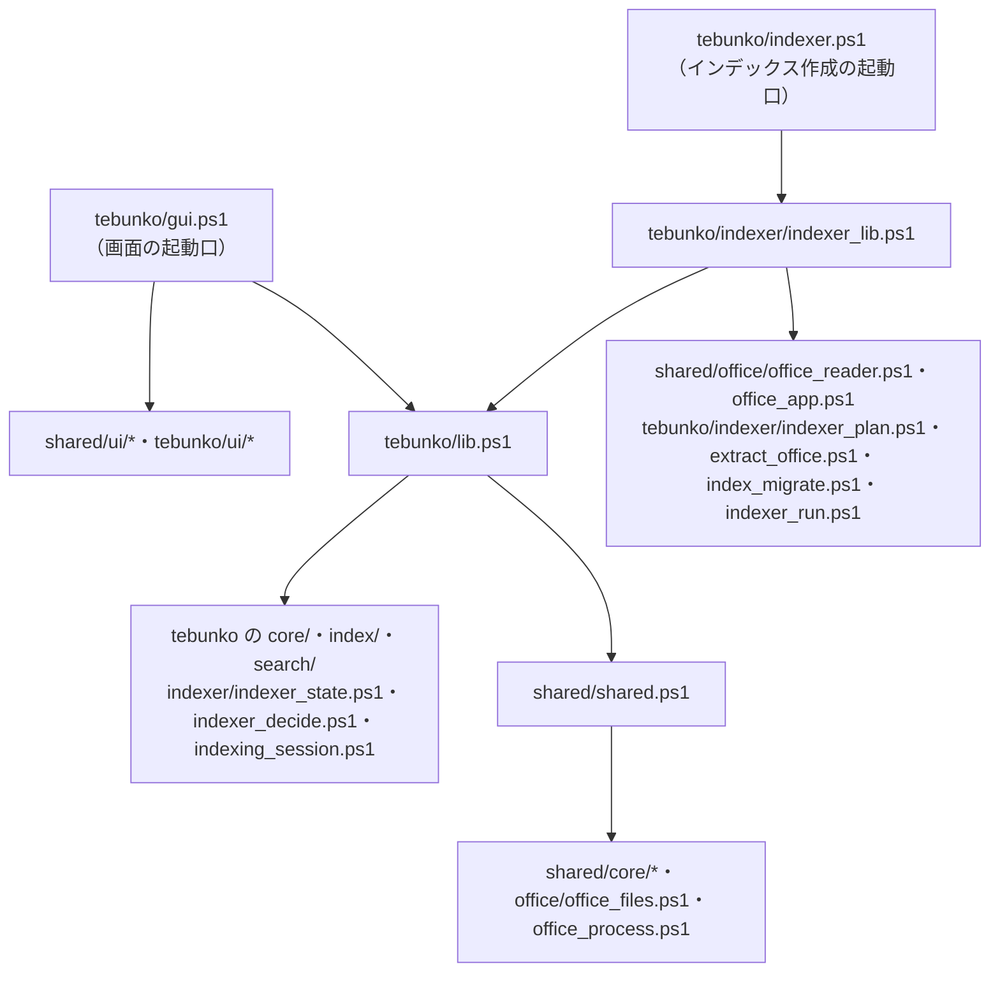
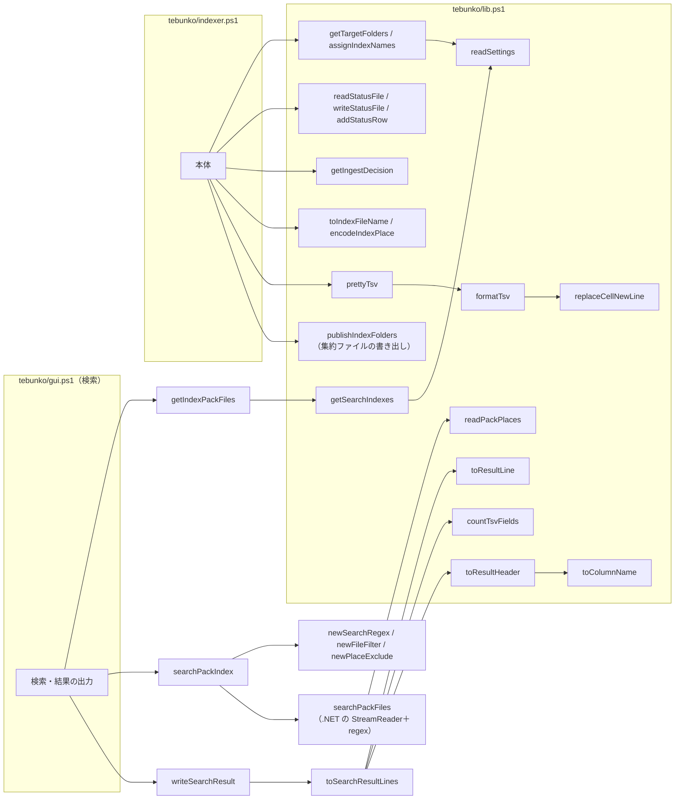
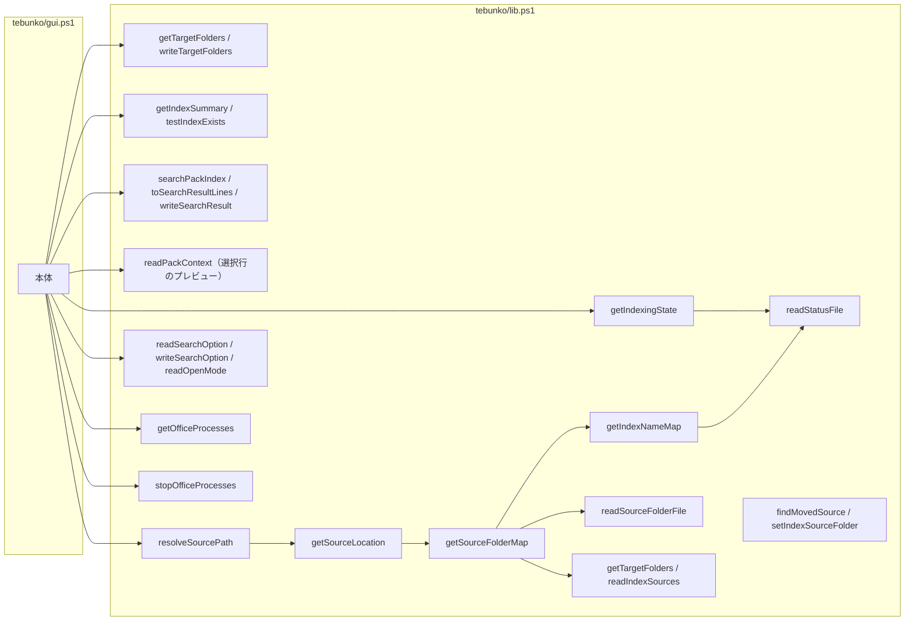
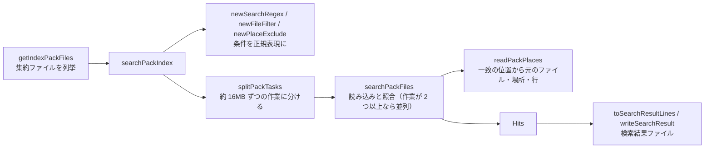

# 共通モジュール

処理は**文脈**（どの機能のものか）と**層**（何をするものか）で分けて置く。

## フォルダの分け方と読み込み口

| フォルダ | 置くもの |
|---|---|
| `scripts/shared/core/` | パス定義（`paths.ps1`）・ファイルの読み書き（`fs.ps1`）・データの置き場所（`data_dir.ps1`）・TSV とセルの文字列（`text.ps1`）・フォルダのパスと一覧（`folder.ps1`）・スレッドのプール（`worker_pool.ps1`。`WorkerPool`・`BackgroundQueue`）・配布物の版の記録（`version.ps1`。`VERSION.txt` の読み取り） |
| `scripts/shared/office/` | Office ファイルの判定（`office_files.ps1`）・プロセスの一覧と強制終了（`office_process.ps1`）・Office ファイルを ZIP として読む処理（`office_reader.ps1`）・Office アプリ（COM）の起動と終了（`office_app.ps1`） |
| `scripts/shared/ui/` | 画面の土台と共通部品（`types.ps1`・`app_host.ps1`・`shell.ps1`・`folder_dialog.ps1`） |
| `scripts/tebunko/core/` | tebunko のパス定義（`paths.ps1`）・設定ファイル（`settings.ps1`）・ワークスペース（`workspace.ps1`） |
| `scripts/tebunko/index/` | インデックス名と TSV の名前の決め方（`index_name.ps1`）・インデックスの作成と集計（`index_store.ps1`）・検索用の集約ファイルの形式（`pack_format.ps1`）と読み書き（`pack_store.ps1`）・高速検索用の システムインデックスと状態（`system_index.ps1`） |
| `scripts/tebunko/indexer/` | インデックス作成の状態ファイル（`indexer_state.ps1`）・取り込み直すかの判断（`indexer_decide.ps1`）・取り込み対象の決定（`indexer_plan.ps1`）・1 ファイルの取り込みと抽出（`extract_office.ps1`）・作業フォルダ・外したフォルダのインデックスの後始末（`index_migrate.ps1`）・インデックス作成の本体と取り込みのスレッド（`indexer_run.ps1`）・画面のインデックス作成 1 回分のスレッド（`indexing_session.ps1`。`IndexingSession`）・インデックス作成の部品の読み込み口（`indexer_lib.ps1`） |
| `scripts/tebunko/search/` | 検索条件（`search_query.ps1`）・集約ファイルの検索（`pack_search.ps1`）・検索結果の組み立てとインデックスの件数（`search_run.ps1`）・元のファイルの場所（`source_map.ps1`）・高速検索の決まり（`search_gram.ps1`）・Windows Search への問い合わせ（`windows_search.ps1`）・高速検索で照合する集約ファイルの収集（`fast_search.ps1`）・検索の司令のスレッド（`search_service.ps1`。`SearchService`） |
| `scripts/tebunko/ui/` | タブごとの画面（`*_tab.ps1` ほか）と、その判断層（`*_view.ps1`）。タブに属さないもの（タブ右上の［⋯］メニューと「tebunko について」ダイアログ：`about_dialog.ps1`・判断層の `about_view.ps1` の `getAboutView`）も置く |

層は次の 3 つに分ける。**判断層は画面に触らないため、そのままテストできる**（[テスト](../testing/index.md)）。

| 層 | 例 | テスト |
|---|---|---|
| 判断層（入力は素の値、出力は素の値） | `text.ps1`・`index_name.ps1`・`pack_format.ps1`・`search_query.ps1`・`search_gram.ps1`・`indexer_decide.ps1`・`*_view.ps1` | する（主にタグ `Unit`） |
| 状態層（ファイル・COM を読み書きする） | `indexer_state.ps1`・`index_store.ps1`・`pack_store.ps1`・`pack_search.ps1`・`search_run.ps1`・`system_index.ps1`・`fast_search.ps1`・`windows_search.ps1`・`version.ps1` | する（主にタグ `Io`。`$TestDrive` を使う） |
| 画面層（`$ui` を触る） | `gui.ps1`・`*_tab.ps1`・`shell.ps1`・`app_host.ps1`・`folder_dialog.ps1`、`result_list.ps1`・`open_source.ps1`・`preview.ps1`・`index_tree.ps1` | `gui.ps1`・`*_tab.ps1`・`shell.ps1`・`app_host.ps1`・`*_dialog.ps1` は手で確かめる（カバレッジの対象外）。ほかは `$ui` を偽物にしてテストする |

依存の向きは一方向にする。**`shared/` はツール（`tebunko/`）を知らない。** ツール同士も互いを読み込まない。判断層と状態層（`core/`・`index/`・`indexer/`・`search/`・`shared/` の `core/`・`office/`）は `$ui`・`$window`・WPF の型に触らず、画面以外の読み込み口（`shared.ps1`・`lib.ps1`・`indexer.ps1`）は `ui/` のファイルを読み込まない。これらの決まりは `tests/meta/layers.Tests.ps1` で機械的に確かめる。

読み込み口は次の 2 つ。ファイルを足したら、読み込み口か起動口のどれかから読み込む（読み込み漏れは `tests/meta/layers.Tests.ps1` が起動口からたどって検出する）。読み込みは `. "$PSScriptRoot\..."` の形で書く（この形の行だけを検査がたどる）。

| 読み込み口 | 読み込むもの | 使う側 |
|---|---|---|
| `scripts/shared/shared.ps1` | 共通基盤（`core/` のすべてと、`office/` のうち `office_files.ps1`・`office_process.ps1`） | `tebunko/lib.ps1` |
| `scripts/tebunko/lib.ps1` | 上記＋ tebunko の `core/`・`index/`・`search/` と、`indexer/` のうち `indexer_state.ps1`・`indexer_decide.ps1`・`indexing_session.ps1` | 画面・インデクサ・テスト・画面が起こす別スレッド |

画面の部品（`shared/ui/`・`tebunko/ui/`）は `gui.ps1` が、インデックス作成だけで使うもの（`office_reader.ps1`・`office_app.ps1`・`indexer_plan.ps1`・`extract_office.ps1`・`index_migrate.ps1`・`indexer_run.ps1`）は `indexer/indexer_lib.ps1` が読み込む。`indexer_lib.ps1` は `indexer.ps1` と取り込みのスレッドが読み込む（画面は読み込まない）。

各スクリプト・テストからは dot-source（`. "$PSScriptRoot\lib.ps1"`）して使う。

## パス定義

パスと定数は、どのツールからも使うもの（`shared/`）と tebunko 固有のもの（`tebunko/core/paths.ps1`・`settings.ps1`）に分かれる。

| 変数 | 値 | 定義 |
|---|---|---|
| `$rootDir` | リポジトリ直下 | `shared/core/paths.ps1` |
| `$dataDir` | 設定ファイルを置くフォルダ（ワークスペースの既定の場所とは関係しない）。`$rootDir` に書き込めればそこ、書き込めなければ `%LOCALAPPDATA%\tebunko\<鍵>`（[データの置き場所](layout.md#データの置き場所settingconfigwork)） | `shared/core/data_dir.ps1` |
| `$utf8Bom` | BOM 付き UTF-8 の `System.Text.Encoding` | `shared/core/paths.ps1` |
| `$cellNewLine` | インデックス TSV でセル内改行の代わりに使う文字（U+2028 LINE SEPARATOR） | `shared/core/text.ps1` |
| `$maxFileNameLength` | ファイル名 1 つの長さの上限（255） | `shared/core/fs.ps1` |
| `$officeExtensions` | 取り込み対象の拡張子（`.xlsx` `.xlsm` `.xls` `.xlsb` `.docx` `.docm` `.doc` `.pptx` `.pptm` `.ppt`） | `shared/office/office_files.ps1` |
| `$officeProcessNames` | 強制終了の対象のプロセス名 → 表示名（`EXCEL` → `Excel`、`WINWORD` → `Word`、`POWERPNT` → `PowerPoint`） | `shared/office/office_process.ps1` |
| `$appId` | ツールの ID（`tebunko`。ミューテックスの名前に使う） | `tebunko/core/paths.ps1` |
| `$workspace` | 今のワークスペース（`Workspace`。[ワークスペースの中の場所（Workspace）](#ワークスペースの中の場所workspace)）。設定 `workspaceFolder` から決める（`getWorkDir`） | 同上 |
| `$tmpDir` | `%TEMP%\tebunko\<PID>`（プロセスごと。取り込みのスレッドは、その下の `w<番号>` を使う） | 同上 |
| `$sourceFolderFileName` | 各インデックスのフォルダに置く対応表のファイル名（`元のフォルダ.txt`） | 同上 |
| `$indexingPhaseCrawl` / `$indexingPhaseConfirm` / `$indexingPhaseIngest` / `$indexingPhaseFinish` | インデックス作成の進み具合の段階（`クロール` / `確認` / `取り込み` / `仕上げ`） | 同上 |
| `$ingestPlanColumns` | 取り込み予定の列名（`インデックス名` `元のフォルダ` `区分` `ファイル数` `取り込み対象` `新規` `更新あり` `前回未完了` `インデックスなし` `前回失敗`） | 同上 |
| `$planKindIngest` / `$planKindUnchecked` / `$planKindMissing` | 取り込み予定の区分（`取り込み` / `チェックなし` / `フォルダなし`） | 同上 |
| `$statusColumns` | 取り込み一覧の列名（`相対パス` `更新日時` `サイズ` `状態` `TSV数` `取り込み日時` `エラー` `抽出版`） | 同上 |
| `$statusFolderKey` | 取り込み一覧の先頭のクロール対象フォルダの行の見出し（`クロール対象フォルダ`） | 同上 |
| `$stateNew` / `$stateDone` / `$stateFailed` | 取り込み一覧の状態（`未取り込み` / `済` / `失敗`） | 同上 |
| `$settingsFile` | `$dataDir\setting.config`（画面が保存する設定。内容は JSON。[設定ファイル（setting.config）](settings-file.md)） | `tebunko/core/settings.ps1` |
| `$openModeNormal` / `$openModeReadOnly` / `$openModeNew`・`$openModes` | 元のファイルの開き方（設定 `openMode` の値 `normal` / `readOnly` / `new`）と、その一覧 | 同上 |

### ワークスペースの中の場所（Workspace）

`tebunko/core/workspace.ps1` の `Workspace` クラスは、ワークスペースのフォルダ（`Dir`）から中の場所を組み立てる。設定は読まない。

- 関数は、ワークスペースの中の場所を既定値で `$workspace` から取る（例 `[string]$path = $workspace.StatusFile`）。既定値は呼んだときに決まるため、`$workspace` を差し替えれば、読み込み直さずに別のワークスペースを使う。
- 別のスレッド（画面の裏の仕事・検索の司令・取り込み）は `lib.ps1` を読み込んだときの `$workspace` を持つ。そのため画面は、場所を引数で渡すか、`Dir`（文字列）を渡してそのスレッドで `Workspace` を作り直す。オブジェクトはスレッドをまたいで渡さない。
- 取り込みのスレッドは `PublishDir` を、その下の `w<番号>` に差し替える。
- ワークスペースを変えるときは、今のワークスペースの中身を移す。移すのは `Entries()`（tebunko が作るファイル・フォルダ）だけで、利用者のほかのファイルは移さない。`getWorkspaceEntries`（あるものだけ）・`getWorkspaceMoveConflicts`（移し先に同じ名前があるもの）・`moveWorkspace`（移す。移し先に同じ名前があれば何も移さず、途中で失敗したら移した分を戻す。別のドライブのフォルダは `copyDirectoryTree` で写してから消す）・`moveSearchExcludes`（`searchExcludes` を移した先のインデックスに付け替える）。選んだフォルダにすでにインデックスなどがあれば、`useWorkspaceTargets`（そのワークスペースの取り込み一覧のクロール対象フォルダを、インデックスの一覧にする）で使うか、`removeWorkspaceEntries`（tebunko のファイル・フォルダだけを削除する）で消してから移す。

| プロパティ | 値 |
|---|---|
| `Dir` | ワークスペースのフォルダ |
| `IndexDir` | `<Dir>\index` |
| `SystemIndexDir` | `<Dir>\system_index`（システムインデックス） |
| `SystemIndexStateFile` | `<Dir>\システムインデックスの状態.tsv` |
| `PublishDir` | `<Dir>\取り込み出力\<PID>`（TSV をインデックスに入れる直前に集めるフォルダ） |
| `StatusFile` | `<Dir>\取り込み一覧.tsv` |
| `IngestingFile` | `<Dir>\取り込み中.txt` |
| `ResultFile` | `<Dir>\検索結果.txt` |
| `IndexingLogFile` | `<Dir>\インデックス作成ログ.txt`（インデクサの表示内容の記録。実行ごとに上書き） |
| `GuiErrorLogFile` | `<Dir>\画面エラー.txt`（画面で起きた予期しないエラーの記録。追記。共通基盤の `writeErrorLog` は、画面が定義する `getGuiErrorLogFile` からこの場所を得る） |

## 関数一覧

関数は用途ごとに次の 3 つに分けて記載する。

- [設定ファイル・取り込み一覧・クロール対象フォルダ・インデックス名](#設定ファイル取り込み一覧クロール対象フォルダインデックス名)
- [TSV の作成・検索](#tsv-の作成検索)（インデックスの TSV の名前・作成・配置、集約ファイルの形式・読み書きと、検索。`shared/core/fs.ps1`・`text.ps1`、`tebunko/index/`・`search/`）
- [元のファイルの特定・画面](#元のファイルの特定画面)（検索結果から元のファイルを特定する処理と、画面が使う集計・設定・Office プロセスの関数）

`lib.ps1` から読み込まれない部品の関数は、それぞれの設計書に記載する。

| ファイル | 主な関数 | 記載先 |
|---|---|---|
| `shared/office/office_reader.ps1` | `isZipFile` / `isCompoundFile` / `readDocxUnits` / `readPptxUnits` / `readXlsxObjectUnits` / `writeUnits` | [インデックスの形式](../indexer/index-format.md) の [Word・PowerPoint のテキスト読み取り](../indexer/office-apps.md#wordpowerpoint-のテキスト読み取りscriptssharedofficeoffice_readerps1)、[Excel](../indexer/excel.md)、[Word](../indexer/word.md)、[PowerPoint](../indexer/powerpoint.md) |
| `shared/office/office_app.ps1` | `getApp` / `stopApp` / `stopAllApps` / `startWatchdog` / `stopWatchdog` | [Office アプリ（Excel・Word・PowerPoint）の管理](../indexer/office-apps.md#office-アプリexcelwordpowerpointの管理) |
| `tebunko/indexer/indexer_plan.ps1` | `findOfficeFiles` / `createTargetList` / `waitForIndexingApproval` | [取り込み対象の決定](../indexer/flow.md#取り込み対象の決定createtargetlist)、[メインフロー](../indexer/flow.md#メインフロー) |
| `tebunko/indexer/extract_office.ps1` | `ingestFile` / `extractWorkbook` / `extractDocument` | [Excel](../indexer/excel.md)、[Word・PowerPoint の抽出処理](../indexer/office-apps.md#wordpowerpoint-の抽出処理extractdocument) |
| `tebunko/indexer/index_migrate.ps1` | `publishTsv` / `removeStaleTmpDirs` / `removeDroppedFolders` | [処理の流れと取り込み一覧](../indexer/flow.md)、[配置・命名規則](../indexer/index-format.md#配置命名規則) |
| `tebunko/indexer/indexer_run.ps1` | `invokeIndexer` / `invokeIndexerBody` / `getIngestWorkerCount` / `getIngestLaneCapacity` / `newIngestPool` / `addIngestTask` / `receiveIngestResult` / `stopIngestWorkers` / `runIngestWorker` / `invokeIngestTask` / `flushPendingPublish` | [メインフロー](../indexer/flow.md#メインフロー)、[インデックス作成の並列化](threads.md#インデックス作成の並列化) |
| `shared/ui/*`・`tebunko/ui/*` | 画面の部品（`showConfirm`・`selectFolder` など） | [実装構成](../gui/implementation.md#実装構成) |

### 設定ファイル・取り込み一覧・クロール対象フォルダ・インデックス名

**設定ファイル（`tebunko/core/settings.ps1`）**

| 関数 | 入力 | 出力 | 概要 | 詳細 | 使用元 |
|---|---|---|---|---|---|
| `newSettings` | – | ordered hashtable | 設定の既定値（`targetFolders` `indexSources` `searchExcludes` `useRegex` `caseSensitive` `fileFilter` `includeShapes` `includeComments` `openMode` `workspaceFolder` `ingestThreads`） | [設定ファイル（setting.config）](settings-file.md) | readSettings |
| `readSettings` | path（既定 `$settingsFile`） | ordered hashtable | 設定を読む。記載の無いキーは既定値。ファイルが無ければ既定値（ファイルは作らない）。数値のキーは文字列でも数値にして読む（読めなければ既定値）。JSON として読めなければ例外 | 同上 | 設定の各関数 |
| `toSettingBool` | value, default | bool | 設定ファイルの真偽値を読む。文字列の `"true"` / `"false"` も読み、読めなければ default | 同上 | readSettings, readSearchExcludes |
| `writeSettings` | settings, path（既定 `$settingsFile`） | – | 設定を JSON（UTF-8 BOM なし）で保存。一時ファイルに書いてから置き換える（`writeTextLinesAtomic`） | 同上 | updateSettings |
| `invokeSettingsLocked` | path, action, timeout（既定 5000 ミリ秒） | action の出力 | 設定ファイルごとの名前付きミューテックス（`Local\tebunko_settings_<getFolderKey の鍵>`）の中で action を実行する。設定の「読む → 変える → 書く」の一続きを囲む。引数の順は path, action, timeout（`-action` は名前で渡す） | [設定ファイル（setting.config）](settings-file.md) | updateSettings など |
| `updateSettings` | key, value, path（既定 `$settingsFile`） | – | ファイルを読み直し、key の値だけ変えて保存する（`invokeSettingsLocked` の中） | 同上 | 設定の各関数 |
| `getTargetFolders` | path（既定 `$settingsFile`） | `@{Name; Path; Enabled}` の配列 | クロール対象フォルダ（`targetFolders`。記載順）。Name はインデックス名、Path は今の置き場所（分けて持つ）。`enabled` が `false` はチェックなし（Enabled = `$false`）。同じフォルダ・同じ名前は最初のものだけ（書き方が違うだけで同じフォルダも `testSameFolder` で同一とみなす。重複した名前は空にして割り当て直す） | [クロール対象フォルダ](../indexer/index.md#クロール対象フォルダgettargetfolders) | インデックス作成・画面 |
| `writeTargetFolders` | folders（`@{Name; Path; Enabled}` の配列）, path（既定 `$settingsFile`） | – | クロール対象フォルダを `targetFolders` に保存（名前も保存する） | 同上 | インデックス作成・画面 |
| `mergeAssignedIndexNames` / `saveAssignedIndexNames` | current, assigned / assigned, path | 一覧 / 一覧 | 割り当てたインデックス名（assigned）を、読み直した今の一覧（current）の名前が空の項目にだけ、パスで突き合わせて足す（同じ名前をほかの項目が使っていれば付けない）/ 排他の中で読み直して足して保存し、保存した一覧を返す | [設定ファイル（setting.config）](settings-file.md) | インデクサ・画面（loadTargets） |
| `readIndexSources` / `writeIndexSources` | path（既定 `$settingsFile`） / sources, path | `@{Name; Path}` の配列 / – | インデックス作成の対象にしないインデックスの元のフォルダ（`indexSources`）を読み書きする | [設定ファイル（setting.config）](settings-file.md) | getSourceFolderMap, 画面 |
| `setIndexSourceFolder` | name, folder, path（既定 `$settingsFile`） | – | インデックス名に対する元のフォルダを記録する。クロール対象フォルダにある名前ならそのフォルダの Path を書き換え、無ければ `indexSources` に記録する | [元のファイルが見つからないとき（元のフォルダを設定する）](../gui/search-tab.md#元のファイルが見つからないとき元のフォルダを設定する) | 画面 |
| `readSearchExcludes` / `writeSearchExcludes` | path（既定 `$settingsFile`） / excludes, path | `@{Path; Subfolders}` の配列 / – | 画面の検索対象のツリーでチェックを外したフォルダ（`searchExcludes`）を読み書きする。無ければ空（すべて検索） | [インデックスの一覧](../search/index.md#インデックスの一覧getsearchindexes) | 画面（検索対象のツリー） |
| `readVersionFile` | path（配布物の `VERSION.txt` のパス） | `@{Tag; Sha}` / `$null` | 版とコミットの記録を読む。無い・読めない・2行でない・形が違えば `$null`（画面は「開発版」と表示する。`about_view.ps1` の `getAboutView`） | [画面構成](../gui/index.md#画面構成) | 画面 |
| `readSearchOption` / `writeSearchOption` | path / option, path | `@{UseRegex; CaseSensitive; FileFilter; IncludeShapes; IncludeComments}` / – | 画面の検索条件。[元のファイルの特定・画面](#元のファイルの特定画面) を参照 | [続き](#元のファイルの特定画面) | 画面 |
| `readOpenMode` / `writeOpenMode` | path（既定 `$settingsFile`） / mode, path | string / – | 元のファイルの開き方（`openMode`）を読み書きする。無い・知らない値なら `normal` | [元のファイルを開く](../gui/search-tab.md#元のファイルを開く) | 画面 |
| `getDefaultWorkDir` | profileDir（既定は利用者のプロファイル） | string | 既定のワークスペース `<profileDir>\Documents\tebunko_ws`（OneDrive にリダイレクトされた「ドキュメント」は使わない） | [データの置き場所](layout.md#データの置き場所settingconfigwork) | getWorkDir, writeWorkspaceFolder, 画面 |
| `getWorkDir` | path（既定 `$settingsFile`） | string | `work` の置き場所（`workspaceFolder`。空なら既定。相対パスは設定ファイルのフォルダから、`%変数%` は展開する） | 同上 | `paths.ps1`（`$workspace`） |
| `writeWorkspaceFolder` | folder, path（既定 `$settingsFile`） | – | `work` の置き場所を保存する。既定の場所なら空で保存する | 同上 | 画面 |

**ファイルとフォルダ（`shared/core/fs.ps1`・`folder.ps1`・`shared/office/office_files.ps1`）**

| 関数 | 入力 | 出力 | 概要 | 詳細 | 使用元 |
|---|---|---|---|---|---|
| `readListFile` | path | string[] | 行ファイルの空行以外の行（Trim しない）。無ければ空配列。読めなければ例外（空の一覧と取り違えない） | – | 取り込み中のファイル・元のフォルダ.txt など |
| `writeListFile` | path, lines | – | 行ファイルを UTF-8（BOM 付き）で保存 | – | 同上 |
| `writeTextLinesAtomic` | path, lines, encoding（既定は BOM 付き UTF-8） | – | 一時ファイルに書いてから置き換える（置き換えられなければ少し待って 5 回まで試す） | – | writeStatusFile, renameStatusIndexName など |
| `formatFileTime` | time | string | 取り込み一覧に記録する日時（`yyyy/MM/dd HH:mm:ss`）。更新の有無はこの文字列で比べる | [取り込み一覧と取り込み対象の決定（差分・中断・再試行）](../indexer/flow.md#取り込み一覧と取り込み対象の決定差分中断再試行) | インデックス作成 |
| `copyFileShared` | sourcePath, destPath | – | 元のファイルを読み取りだけで開いてコピーする（ほかのアプリの読み書き・削除を妨げない）。インデックス作成は、このコピーを開く | [取り込み対象のファイルは書き換えない](../../safety/file-access.md#取り込み対象のファイルは書き換えない) | インデックス作成 |
| `getFolderKey` | dir | string（16 進 64 文字） | フォルダのパスを小文字にした SHA-256。名前付きミューテックス・イベントの名前に使う。FIPS モードの Windows でも動くよう、FIPS 準拠の実装（`SHA256CryptoServiceProvider`）を使う | – | newAppMutex, 画面（多重起動の防止） |
| `testWritableFolder` | dir | bool | フォルダにファイルを作れるか（試しに作ったファイルは閉じると消える）。無いフォルダは `$false` | [データの置き場所](layout.md#データの置き場所settingconfigwork) | getDataDir, 画面（置き場所の変更） |
| `getDataDir` | root（既定 `$rootDir`）, fallbackBase（既定 `%LOCALAPPDATA%`） | string | 設定ファイルを置くフォルダ。root に書き込めれば root、書き込めなければ `<fallbackBase>\tebunko\<getFolderKey の先頭 16 文字>`（`shared/core/data_dir.ps1`） | 同上 | `data_dir.ps1`（`$dataDir`） |
| `newAppMutex` | name（`gui` / `indexer`）, dir（既定 `$rootDir`） | `@{Mutex; Acquired}` | 同じツール（配置フォルダ）の処理を二重に動かさないための名前付きミューテックス（`Local\tebunko_<name>_<getFolderKey の鍵>`）。`Acquired` が `$false` なら、ほかで実行中。プロセスが終われば解放されるため、強制終了しても残らない | [メインフロー](../indexer/flow.md#メインフロー) | インデックス作成（起動時。dir に `$workspace.Dir` を渡し、同じ `work` を使うものを 1 つにする）。画面は `getFolderKey` の鍵で同じ規則の名前を自前で作る（ウィンドウを前面に出すイベントの名前と共通の鍵を使うため） |
| `invokeWithNamedMutex` | mutexName, timeoutMilliseconds, action | action の出力 | 名前付きミューテックスを取って action を実行し、終わったら手放す。同じスレッドの入れ子は通す。時間を過ぎても取れなければ「排他の待ちが時間切れになりました」の例外。前の持ち主が手放さずに終わっていた（abandoned）ときは取れたものとして続ける | [スレッド](threads.md) | invokeSettingsLocked |
| `normalizeFolderPath` | path | string | フォルダパスを 1 つの書き方にそろえる（前後の空白・`"` の除去、環境変数の展開、`/` → `\`、`\\?\` の除去、重なった `\` ・ `.` ・ `..` の解決、相対パスは `$rootDir` から、末尾の `\` の除去。ドライブ直下は `D:\` のまま）。解釈できない場合は書かれたとおり | [クロール対象フォルダ](../indexer/index.md#クロール対象フォルダgettargetfolders) | getTargetFolders, 画面 |
| `getPathUnderFolder` | path, folder | string / `$null` | path が folder 自身か下なら folder からの相対パス（folder 自身は空）、下でなければ `$null`（大文字・小文字と末尾の `\` を無視）。パスの文字数で切り出さないために使う | 同上 | インデックス作成・検索 |
| `getDriveTargets` | – | Dictionary（`Z:` → 割り当て先） | ネットワークドライブの割り当てを CIM（`Win32_LogicalDisk` の DriveType=4）で調べる（同じプロセスで 1 回だけ。`subst` は解決しない） | 同上 | getFolderPathAliases |
| `getFolderPathAliases` | path, drives（既定 `getDriveTargets`） | string[] | 同じ場所を指す別の書き方を path 自身を先頭にして返す（`Z:\見積` ⇔ `\\server\share\見積`） | 同上 | testSameFolder, 画面 |
| `testSameFolder` | a, b, drives（既定 `getDriveTargets`） | bool | 2 つのパスが同じフォルダを指すか（書き方の違い・ドライブの割り当てをたどる） | 同上 | getTargetFolders, getSourceFolderMap, 画面 |
| `testFolderUnder` | path, folder, drives（既定 `getDriveTargets`） | bool | path が folder 自身か folder の下のフォルダか（`testSameFolder` と同じく書き方の違いをたどる）。クロール対象フォルダが入れ子にならないかの確認に使う | 同上 | 画面（インデックスの追加・編集） |
| `getFolderLeafName` | folderPath | string | フォルダ名（ドライブ直下はドライブ名、UNC は共有名） | [取り込み一覧と取り込み対象の決定（差分・中断・再試行）](../indexer/flow.md#取り込み一覧と取り込み対象の決定差分中断再試行) | newIndexName |
| `getExistingAncestorFolder` | folder | string | folder が今もあればそのまま、無ければその上の今もあるフォルダ。どこにも無ければ空 | [フォルダ選択ダイアログ（［参照…］）](../gui/index-tab.md#フォルダ選択ダイアログ参照) | 画面（フォルダ選択） |

**取り込み一覧・状態ファイル・画面との受け渡しの口（`tebunko/indexer/indexer_state.ps1`）**

| 関数 | 入力 | 出力 | 概要 | 詳細 | 使用元 |
|---|---|---|---|---|---|
| `newStatusRow` | 相対パス, 更新日時, サイズ, 状態, TSV数, 取り込み日時, エラー, 抽出版（2 番目以降は省略可） | 行オブジェクト | 取り込み一覧の 1 行を作る | [取り込み一覧と取り込み対象の決定（差分・中断・再試行）](../indexer/flow.md#取り込み一覧と取り込み対象の決定差分中断再試行) | インデックス作成 |
| `toStatusLine` | row | string | 取り込み一覧の 1 行を文字列にする（エラーのタブ・改行はスペース）。`writeStatusFile` は速さのため同じ整形をその場に展開しているため、変えるときは両方を直す（テストで同じ結果になることを確かめている） | 同上 | addStatusRow |
| `describeIngestError` | exception | string | 取り込みの例外から、取り込み一覧のエラー列・画面に表示する失敗の原因を作る | [失敗の原因](../indexer/office-apps.md#失敗の原因describeingesterror) | インデックス作成 |
| `readStatusFile` | path（既定 `$workspace.StatusFile`） | `@{Folders; Rows}` | 取り込み一覧を読む。Folders はクロール対象フォルダ `@{Path; Name}`（Name = インデックス名）、Rows は相対パス（`インデックス名\フォルダからの相対パス`。大文字・小文字を区別しない）→ 行。同じ相対パスは後の行を優先し、列数の合わない行は無視。インデックス作成中に読んでも書き込みを妨げない共有モードで開く。無ければ空 | [取り込み一覧と取り込み対象の決定（差分・中断・再試行）](../indexer/flow.md#取り込み一覧と取り込み対象の決定差分中断再試行) | インデックス作成・画面 |
| `writeStatusFile` | folders（`@{Path; Name}` の配列）, rows, path（既定 `$workspace.StatusFile`） | – | 取り込み一覧を書き出す（先頭にクロール対象フォルダの行、1 ファイル 1 行。一時ファイルに書いてから置き換える） | 同上 | インデックス作成 |
| `addStatusRow` | row, path（既定 `$workspace.StatusFile`） | – | 取り込み一覧の末尾に 1 行追記する | 同上 | インデックス作成 |
| `readStatusLines` | path（既定 `$workspace.StatusFile`） | 行の配列 | 取り込み一覧を共有を許して 1 行ずつ読む | – | renameStatusIndexName, removeStatusIndexName |
| `renameStatusIndexName` / `removeStatusIndexName` | oldName, newName, path / name, path | – | 取り込み一覧のインデックス名を書き換える / その記録を取り除く。行の順序と内容はそのまま保つ（`readStatusLines` で読み、`writeTextLinesAtomic` で置き換える） | [追加・編集のダイアログ](../gui/index-tab.md#追加編集のダイアログ) | renameIndex, removeIndex |
| `readIngestingFiles` | path（既定 `$workspace.IngestingFile`） | `@{RelPath; Count}` の配列 | 取り込み中のファイルの記録（1 行に 1 ファイル。相対パスと、続けて取り込みを始めて終わらなかった回数）を読む。無ければ空。壊れた行は読み飛ばす | [強制終了・時間切れからの再開](../indexer/flow.md#強制終了時間切れからの再開) | インデックス作成 |
| `writeIngestingFiles` | entries（`@{RelPath; Count}` の配列）, path（既定 `$workspace.IngestingFile`） | – | 取り込み中のファイルを 1 行に 1 つ `<回数><TAB><相対パス>` で記録する。無ければ記録を消す | 同上 | インデックス作成 |
| `removeIngestingFile` | path（既定 `$workspace.IngestingFile`） | – | 取り込み中のファイルの記録を削除する（無くてもエラーにしない） | 同上 | インデックス作成 |
| `newIndexerChannel` | retryFailed, confirmTargets, workers（既定 -1） | 受け渡しの口（`[hashtable]::Synchronized`） | 画面とインデクサの受け渡しの口を作る（`RetryFailed`・`ConfirmTargets`・`Workers`・`Progress`・`Stop`・`Plan`・`Answer`・`Answered`・`Error`・`ExitCode`・`OfficePids`）。`Workers` は -1 で設定・コア数から決める、0 で司令のスレッドで取り込む（テスト） | [画面とインデクサの受け渡し](threads.md#画面とインデクサの受け渡し) | 画面・indexer.ps1 |
| `writeIndexingProgress` | phase, processed, remaining, failed, detail, channel（既定はいま動いているインデックス作成の口） | – | インデックス作成の進み具合を受け渡しの口の `Progress` に入れる（口が無ければ何もしない） | [メインフロー](../indexer/flow.md#メインフロー) | インデックス作成（1 ファイルにつき 1 回） |
| `readIndexingProgress` | channel | `@{Phase; Processed; Remaining; Failed; Detail}` / `$null` | インデックス作成の進み具合を受け渡しの口から読む（まだ無ければ `$null`）。画面が 1 秒ごとに呼ぶ（数万行の取り込み一覧を読み直さない） | [インデックス作成の進み具合](../gui/index-tab.md#インデックス作成の進み具合) | 画面 |
| `requestIndexingStop` | channel | – | 中止を求める（`Stop` を立て、確認を待っていれば取りやめの返事にする） | 同上 | 画面 |
| `answerIndexingPlan` | channel, answer（`@{RetryFailed}` / `$null`） | – | 確認のダイアログの返事をインデクサに伝える。`$null` は取りやめ（`Stop` も立てる） | [インデックス作成の確認ダイアログ](../gui/index-tab.md#インデックス作成の確認ダイアログ) | 画面 |
| `testIndexerRunning` | dir（既定 `$workspace.Dir`） | bool | この `work` でインデックス作成が動いているか（インデクサのミューテックスを取れるかで調べ、取れたらすぐ放す）。画面を使わずに起動したものも分かる | [画面とインデクサの受け渡し](threads.md#画面とインデクサの受け渡し) | 画面（［8 設定］） |
| `writeIndexerLog` | text, color | – | インデックス作成の表示内容をログ（`インデックス作成ログ.txt`）に書く。画面を使わずに実行したときはコンソールにも出す（color はそのときの色）。取り込みのスレッドでは 1 ファイル分を貯め、司令がまとめて書く | [メインフロー](../indexer/flow.md#メインフロー) | インデックス作成 |
| `newIngestPlanRow` | name, path, kind, total, targets, new, updated, pending, lost, failed | 取り込み予定の 1 行（`[pscustomobject]`） | インデックス 1 件分の取り込み対象の件数を作る（`$ingestPlanColumns` と同じ列） | [取り込み予定（画面の確認に出す件数）](../indexer/flow.md#取り込み予定画面の確認に出す件数) | インデックス作成 |
| `getIndexingState` | since, path | [元のファイルの特定・画面](#元のファイルの特定画面) を参照 | 取り込み一覧の状態ごとの件数など | [続き](#元のファイルの特定画面) | 画面 |

**取り込み直すかの判断（`tebunko/indexer/indexer_decide.ps1`）**

| 関数 | 入力 | 出力 | 概要 | 詳細 | 使用元 |
|---|---|---|---|---|---|
| `getExtractVersion` | path | int | ファイルの形式（拡張子）の今の抽出版（読み取る内容の版。図形・コメントなどを読むようになった形式は 2、ほかは 1） | [取り込み対象の決定](../indexer/flow.md#取り込み対象の決定createtargetlist) | testExtractOutdated、インデックス作成（取り込み一覧の抽出版の列） |
| `testExtractOutdated` | row | bool | 取り込み一覧の行が、今の抽出版より前の版で取り込んだものか（抽出版の列が空なら 1） | 同上 | getIngestDecision |
| `getIngestDecision` | old（前回の行 / `$null`）, updated, size, indexComplete | `@{Ingest; Reason}` | 取り込むかどうかと理由（`done` / `failed` / `new` / `updated` / `pending` / `lost` / `outdated`）。更新日時・サイズが同じでも、TSV が欠けていれば `lost`、前の抽出版なら `outdated` で取り込み直す | 同上 | createTargetList |
| `getIngestLane` | relPath | string | 取り込むレーン（`.xls*` は `Excel`、`.doc` は `Word`、`.ppt` は `PowerPoint`、それ以外（`.docx`・`.docm`・`.pptx`・`.pptm`）は `Reader`） | [インデックス作成の並列化](threads.md#インデックス作成の並列化) | インデックス作成（司令） |
| `getOfficeLane` | relPath | string | 読み取りのレーンで Office が要ると分かったファイルの回し先（`.ppt*` は `PowerPoint`、ほかは `Word`） | 同上 | インデックス作成（司令） |

**インデックス名とインデックスの管理（`tebunko/index/index_name.ps1`・`index_store.ps1`）**

| 関数 | 入力 | 出力 | 概要 | 詳細 | 使用元 |
|---|---|---|---|---|---|
| `newIndexName` | folderPath, usedNames（HashSet・配列・文字列・`$null`） | string | インデックス名（フォルダ名・ドライブ名・共有名。重複すれば `名前(2)`…） | [取り込み一覧と取り込み対象の決定（差分・中断・再試行）](../indexer/flow.md#取り込み一覧と取り込み対象の決定差分中断再試行) | assignIndexNames |
| `assignIndexNames` | targetFolders, previousFolders（readStatusFile の Folders） | `@{Path; Enabled; Name}` の配列 | 設定の名前（getTargetFolders の Name）をそのまま使う。名前が無ければ、前回の取り込み一覧の同じフォルダの名前、それも無ければフォルダ名から重複しない名前を作る | 同上 | インデックス作成 |
| `splitIndexRelPath` | relPath | `@{Name; Rest}` | `work\index` からの相対パスを、先頭のインデックス名と残りに分ける | 同上 | インデックス作成, resolveSourcePath |
| `testIndexName` | name, usedNames | string（使えれば空） | インデックス名として使えるか調べ、使えない理由を返す（空・前後の空白・255 文字超・使えない文字・末尾の `.`・Windows の予約語・ほかと重複） | [追加・編集のダイアログ](../gui/index-tab.md#追加編集のダイアログ) | 画面 |
| `getIndexNameMap` | path（既定 `$workspace.StatusFile`） | Dictionary（インデックス名 → フォルダパス） | 取り込み一覧のインデックス名からクロール対象フォルダを引く表。クロール対象フォルダの行は先頭にあるため、見出し行まで読んで打ち切る | 同上 | resolveSourcePath, 画面 |
| `getIndexStats` | rows（readStatusFile の Rows） | 名前 → `@{Total; Done; Pending; Failed; LastIngested}` | 取り込み一覧の行をインデックス名ごとに集計する（一覧の「ファイル」「最終取り込み」） | [一覧の列](../gui/index-tab.md#一覧の列) | 画面（getIndexingState 経由） |
| `renameIndex` | oldName, newName, dir（既定 `$workspace.IndexDir`）, statusPath | – | インデックス名を変える。`work\index\<旧名>` を改名し、取り込み一覧の記録（`renameStatusIndexName`）も書き換えるため、**インデックスは作り直さない**。移動先が既にあれば例外 | 同上 | 画面（［編集…］） |
| `removeIndex` | name, dir（既定 `$workspace.IndexDir`）, statusPath | – | インデックスを削除する。`work\index\<名前>` を中身ごと削除し、取り込み一覧からもその記録を取り除く（`removeStatusIndexName`） | 同上 | 画面（［削除］） |
| `getSearchIndexes` | dir（既定 `$workspace.IndexDir`）, statusPath, settingsPath | `@{Name; Path; SourcePath}` の配列 | インデックスの一覧（`work\index` 直下のフォルダ 1 つがインデックス 1 つ）。並びは［1 インデックス管理］の一覧と同じで、一覧に無いもの（コピーしたインデックスなど）は名前順で後ろ。`SourcePath` は元のフォルダ（分からなければ空） | [インデックスの一覧](../search/index.md#インデックスの一覧getsearchindexes) | 画面（検索対象のツリー） |

TSV の名前・配置、集約ファイル、検索にかかわる関数（`index_name.ps1` の `encodeIndexPlace` など、`index_store.ps1` の `getIndexTsvCounts` / `publishIndexFiles` など、`pack_format.ps1`・`pack_store.ps1`・`pack_search.ps1`）は [TSV の作成・検索](#tsv-の作成検索) に記載する。

> **[TSV の作成・検索](#tsv-の作成検索) TSV の作成・検索** → [TSV の作成・検索](#tsv-の作成検索)

> **[元のファイルの特定・画面](#元のファイルの特定画面) 元のファイルの特定・画面** → [元のファイルの特定・画面](#元のファイルの特定画面)

インデクサ（`tebunko/indexer.ps1`）と、画面の検索（`tebunko/gui.ps1`）は次の関数を使う。

画面（`tebunko/gui.ps1`）は、ほかに次の関数を使う。

### TSV の作成・検索

**TSV の名前と場所（`shared/core/fs.ps1`・`tebunko/index/index_name.ps1`）**

| 関数 | 入力 | 出力 | 概要 | 詳細 | 使用元 |
|---|---|---|---|---|---|
| `toSafeFileName` | name | string | ファイル名禁止文字を全角に置換 | [インデックス作成（インデクサ）](../indexer/index.md) | インデックス名（newIndexName・getTargetFolders）、シート名の照合（画面。元のファイルを開くとき） |
| `encodeIndexPlace` | place | string | TSV のファイル名に入れる場所を符号化する（ファイル名禁止文字・制御文字・`_`・`%` を `%XX` に） | [場所の符号化](../indexer/index-format.md#場所の符号化encodeindexplace--decodeindexplace) | toIndexFileName |
| `decodeIndexPlace` | place | string | `encodeIndexPlace` の `%XX` を元に戻す（それ以外の `%` はそのまま） | 同上 | getIndexFolderBooks |
| `toIndexFileName` | place | string | インデックスの TSV のファイル名 `<場所>.tsv`（場所は `encodeIndexPlace`）。元のファイル名はフォルダ名にするため入れない。`$maxFileNameLength`（255）文字を超えれば例外 | [配置・命名規則](../indexer/index-format.md#配置命名規則) | インデックス作成（Excel・Word・PowerPoint） |
| `splitObjectPlace` | place | `@{Base; Kind}` | 図形・コメントの場所（`<元の場所>[図形]` 等）を、元の場所と種類に分ける。ふつうの場所は Kind が空 | [配置・命名規則](../indexer/index-format.md#配置命名規則)「図形・コメントの場所」 | 元のファイルを開く、convertPlaceToPackMeta |
| `describePlace` | book, place | `@{Place; Kind}` | 画面の「場所」「種別」と検索結果ファイルに出す文字（`[シート] 売上`・図形、`[ページ] 3（目安）`・本文 など） | [出力フォーマット](../search/output.md#出力フォーマットwork検索結果txt) | 画面・`toResultLine` |
| `toLongPath` | path | string | ファイル操作に渡すパスの先頭に `\\?\`（ネットワークのパスは `\\?\UNC\`）を付け、260 文字を超えるパスも扱えるようにする。付いていればそのまま | [長いパス（260 文字超）の扱い](../indexer/index-format.md#長いパス260-文字超の扱い) | インデックス作成・検索 |
| `fromLongPath` | path | string | `toLongPath` で付けた `\\?\` を外す（`Get-ChildItem` の `FullName` から相対パスを求めるため） | 同上 | インデックス作成・検索 |
| `removeDirectoryRetry` | path, tries（既定 3）, waitMilliseconds（既定 200） | – | フォルダを中身ごと削除する。ほかのアプリが一時的に掴んでいることがあるため、少し待って数回試す | – | インデックス作成（インデックス・作業フォルダの削除） |

**TSV の整形（`shared/core/text.ps1`）**

| 関数 | 入力 | 出力 | 概要 | 詳細 | 使用元 |
|---|---|---|---|---|---|
| `replaceCellNewLine` | inputString | string | `"` で囲まれた範囲の改行（CRLF・CR・LF）を `$cellNewLine` に置き換える | [Excel](../indexer/excel.md) | formatTsv |
| `formatTsv` | content, firstRow（既定 1）, firstColumn（既定 1） | string | TSV 整形。N 行目・k 列目をシートの N 行目・k 列目にそろえる | 同上 | prettyTsv |
| `prettyTsv` | 入力パス, 出力パス, firstRow（既定 1）, firstColumn（既定 1） | bool | 入力（UTF-16）を読み、`formatTsv` して UTF-8（BOM 付き）で保存。内容が空なら保存せず `$false` | 同上 | インデックス作成 |
| `countTsvFields` | line | int | Excel に貼り付けたときのセル数（`"` で始まるセルは閉じる `"` までを 1 セルとする。先頭のセルが空でも数え落とさない） | [1 行の組み立て](../search/output.md#1-行の組み立て) | 検索 |
| `toColumnName` | number | string | 列番号を列名に変換（1 → `A`、27 → `AA`） | 同上 | toResultHeader |
| `splitTsvCells` | line | string[] | TSV の 1 行をセルに分ける（`"` で囲まれたセルは 1 セルとし、囲みを外す。`countTsvFields` と同じ区切り方。画面のプレビューは同じ区切り方を型 `HitRow`（`types.ps1`）の中に持つ） | – | テストだけ |

**インデックスへの配置（`tebunko/index/index_store.ps1`）**

| 関数 | 入力 | 出力 | 概要 | 詳細 | 使用元 |
|---|---|---|---|---|---|
| `getIndexTsvCounts` | dir（既定 `$workspace.IndexDir`） | 相対パス → 数の辞書 / `$null` | インデックスの中のファイルを 1 回列挙して数える。集約ファイルはそのファイルの相対パス → 1（0 バイトなら -1）、集約する前の TSV は元のファイルのフォルダの相対パス（取り込み一覧の相対パスと同じ）→ TSV の数（0 バイトの TSV があれば -1。TSV の無いフォルダは 0）。列挙できなければ `$null` | [取り込み対象の決定](../indexer/flow.md#取り込み対象の決定createtargetlist) | インデックス作成（取り込み対象の決定） |
| `testIndexComplete` | row, relPath, counts | bool | 取り込み一覧の「済」の行に対して、インデックスがそろっているかを返す。そのフォルダ・その拡張子の集約ファイルがあれば（0 バイトでなければ）`$true`。無ければ集約する前の TSV を見て、行の TSV 数より少ない・0 バイトなら `$false`（取り込み直す）。TSV 数が空・counts が `$null` のときは確認しない | 同上 | インデックス作成（取り込み対象の決定） |
| `publishIndexFiles` | fromDir, bookDir, stagingDir | – | 書き出した TSV を stagingDir に集めてから、`bookDir` をフォルダごと入れ替える（作りかけのインデックスを残さない）。別ドライブでフォルダごと移せない場合は 1 件ずつ移す | [インデックスへの入れ替え](../indexer/index-format.md#インデックスへの入れ替えpublishtsv--publishindexfiles) | インデックス作成（publishTsv） |

**集約ファイルの形式（`tebunko/index/pack_format.ps1`）**

形式は [配置・命名規則](../indexer/index-format.md#配置命名規則)「集約ファイルの形式」。判断層のため、ファイルを読み書きしない。

| 関数 | 入力 | 出力 | 概要 | 使用元 |
|---|---|---|---|---|
| `getPackFileKind` | book | string | 元のファイル名から種類（`Excel` / `Word` / `PowerPoint`。分からなければ空） | convertToPackText, convertPlaceToPackMeta |
| `getPackExtension` / `getPackFileName` / `readPackFileName` | book / extension, part / name | string / `@{Extension; Part}` | 集約ファイルを分ける拡張子（小文字・`.` なし） / 集約ファイルの名前（`content.<拡張子>.<番号>.tsv`） / 名前から拡張子と番号を取り出す | convertIndexFolderToPack, getIndexTsvCounts |
| `splitPackBooksByExtension` | books | [ordered] 拡張子 → 並び | 元のファイルの並びを拡張子ごとに分ける（各並びの中の順は変えない） | convertIndexFolderToPack |
| `encodePackValue` / `decodePackValue` | value | string | メタ情報の値の制御文字（タブを除く）と `%` を `%XX` にする / 戻す | convertToPackText, readPackPlaces |
| `convertPlaceToPackMeta` | book, place | [ordered] キー → 値 | 場所の名前（TSV のファイル名。`見積[図形]`・`ページ001` など）を場所のメタ情報にする。組み立て直して同じ名前にならないものは `部分=<名前>`・`対象=本文` | convertToPackText |
| `convertPackMetaToPlace` | meta | string | 場所のメタ情報から場所の名前を組み立てる（画面の表示・図形とコメントの除外・元のファイルを開く処理が使う形） | readPackPlaces |
| `convertToPackBody` | text | string | TSV の中身を集約ファイルに入れる形にする（改行を LF に、末尾に LF、U+001C〜U+001F を除く） | convertToPackText |
| `convertToPackText` | books | string | 元のファイルの並び（TSV から新しく作るもの、または前の集約ファイルから写すまとまり）から、集約ファイルの文字列を作る | convertIndexFolderToPack |
| `readPackPlaces` | text | `@{Book; Location; Start; End}` の並び | 集約ファイルの文字列から、場所ごとの元のファイル名・場所の名前・中身の範囲を先頭から順に返す。版が違えば例外 | 検索（searchPackFiles）、readPackContext |
| `splitPackTextByBook` | text | `@{Name; Block}` の並び | 集約ファイルの文字列を元のファイルごとのまとまりに分ける（入れ替えない元のファイルをそのまま写すため）。版が違えば例外 | convertIndexFolderToPack |
| `getPackContentText` | text | string | メタ情報の行を除いた中身（システムインデックスの語を作るため） | writeSystemIndexFolder |

**集約ファイルの読み書き（`tebunko/index/pack_store.ps1`）**

| 関数 | 入力 | 出力 | 概要 | 詳細 | 使用元 |
|---|---|---|---|---|---|
| `writePackFile` / `readPackText` | path, text / path | – / string | 集約ファイルを UTF-16LE（BOM 付き）で書く（`<名前>.tmp` に書いてから `File.Replace` で置き換える） / 読む（置き換え・削除を妨げない共有モード） | [配置・命名規則](../indexer/index-format.md#配置命名規則) | convertIndexFolderToPack, readPackContext |
| `getIndexFolderBooks` | folder | `@{Name; Places}` の並び | フォルダ直下の元のファイルごとのフォルダ（`<ファイル名.xlsx>\<場所>.tsv`）から、集約ファイルに入れる元のファイルと場所の並びを作る | 同上 | convertIndexFolderToPack |
| `convertIndexFolderToPack` | folder, destFolder, removeBooks, removeTsv | `@{Books; Tsv; Chars; Files; Texts}` | フォルダ 1 つの TSV から拡張子ごとの集約ファイルを書く。前の集約ファイルとまぜ（TSV のある元のファイルは入れ替え、removeBooks は外し、ほかは写す）、元のファイルが無くなった拡張子の集約ファイルは消す。removeTsv なら書き終えた後に TSV のフォルダを消す。Texts は書いた中身 | 同上 | updateIndexFolderPack |
| `updateIndexFolderPack` | folder, removeBooks | 同上 | `convertIndexFolderToPack` を同じフォルダに書き、TSV を消す形で呼ぶ | 同上 | publishIndexFolders |
| `getPackFiles` | root, relPath, recurse | `@{Path; Root; RelDir; RelPath; Ticks; Size}` の配列 | フォルダ以下の集約ファイルを列挙し、フォルダの順・フォルダの中は名前の順に並べる（Path は `\\?\` 付き。Ticks・Size は読んだ内容を使い回してよいかの判定に使う） | [検索](../search/index.md#検索の実装速度) | getIndexPackFiles |
| `findIndexFoldersWithBooks` | root | string[] | 元のファイルごとのフォルダ（集約ファイルに入れる前の TSV）が直下にあるフォルダを返す（インデックス作成が途中で止まったとき） | [配置・命名規則](../indexer/index-format.md#配置命名規則) | インデックス作成（開始時） |
| `publishIndexFolders` | pending（フォルダ → 無くなった元のファイル名）, indexRoot, systemRoot, statePath | 書き出したフォルダの数 | フォルダごとに、集約ファイルを書き（`updateIndexFolderPack`）、TSV を消し、書いた中身からシステムインデックスの txt を作る（`writeSystemIndexFolder`）。txt の「反映待ち」はまとめて状態ファイルに書く | 同上 | インデックス作成（flushPendingPublish） |
| `readPackContext` | path, book, location, lineNumber, before（既定 3）, after（既定 3）, cache | `@{LineNumber; Line}` の配列 | 集約ファイルの中の元のファイル book・場所 location の lineNumber 行目と前後の行を返す（行の数え方は検索と同じ）。cache（`newTsvTextCache`）に同じ集約ファイルの内容があれば読み直さない。読めない・見つからなければ空 | [［2 検索］タブ](../gui/search-tab.md) [選択行のプレビュー](../gui/search-tab.md#選択行のプレビュー) | 画面 |

**検索（`tebunko/search/search_query.ps1`・`pack_search.ps1`・`search_run.ps1`）**

| 関数 | 入力 | 出力 | 概要 | 詳細 | 使用元 |
|---|---|---|---|---|---|
| `isValidRegex` | pattern | bool | 正規表現として正しいか | – | 検索・画面 |
| `newSearchRegex` | word, simpleMatch, caseSensitive | `@{Regex; SimpleMatch; TextRegex; ScanMode}` | 検索条件から照合用の正規表現を作る（文字どおりならエスケープ、大文字と小文字を区別しないなら IgnoreCase、正規表現として不正なら文字どおりにする）。1 行の照合は 5 秒で時間切れ。TextRegex は集約ファイルの全文にかける正規表現（Multiline）、ScanMode はそれを全文にかけてよいか（`getRegexScanMode`） | [検索](../search/index.md#検索条件サクラエディタの-grep-にならう) | 検索・画面（一致箇所の強調） |
| `getRegexScanMode` | pattern | string（`lines` / `filter` / `scan`） | 正規表現を全文にかけて、1 行ずつの照合と同じ結果になるかを判定する。`lines` は全文での一致の位置から行が分かる、`filter` は全文で一致しない集約ファイルを読み飛ばせる、`scan` は 1 行ずつ照合する。分からない書き方は安全側（`filter` か `scan`）に倒す | [検索](../search/index.md#検索の実装速度) | newSearchRegex |
| `newFileFilter` | filter | `@{Include; Exclude}` | 対象ファイルの指定（`*.xlsx;見積;!*old*`）を、元のファイル名に対する正規表現にする（無い側は `$null`） | [検索](../search/index.md#検索条件サクラエディタの-grep-にならう) | `searchPackIndex` |
| `newPlaceExclude` | includeShapes, includeComments | regex / `$null` | 検索から外す図形・コメントの場所（名前の末尾 `[図形]` `[コメント]`）の正規表現。どちらも検索するなら `$null` | 同上 | `searchPackIndex` |
| `getIndexPackFiles` | folders（既定 `$workspace.IndexDir`。フォルダの文字列、または `@{Root; RelPath; Recurse}`（画面のツリーで選んだ範囲。`Recurse` が `$false` なら直下だけ）の配列）, onProgress（フォルダを 1 つ数えるたびに `{ param($count) }` を呼ぶ） | `@{Folders; Packs}` | 検索対象の集約ファイルを列挙する（`getPackFiles`）。結果の相対パスは `Root` から求める。Folders はフォルダごとの `@{Path; Root; Exists; Count}`、Packs は `getPackFiles` の要素をつないだもの（フォルダの順・名前の順、重複なし） | [検索](../search/index.md#検索の実装速度) | 検索・画面、getFastSearchPackFiles |
| `testIndexExists` | folders | bool | 集約ファイルが 1 件でもあるか（最初の 1 件で打ち切る） | – | 画面 |
| `getIndexSummary` | folders | `@{Count; LastWrite; Missing}` | 集約ファイルの件数・最新の更新日時・存在しないフォルダ | – | 画面 |
| `splitPackTasks` | packs, taskBytes（既定 16MB） | `@{Start; Count}` の並び | 集約ファイルの並びを、大きさの合計がおよそ taskBytes になるまでまとめて、1 つのスレッドに渡す作業に分ける | 同上 | searchPackIndex |
| `searchPackFiles` | packs, start, count, regex, max, textRegex, scanMode, cache, include, exclude, excludePlace | ヒットの一覧 | packs の start から count 件を読み、regex に一致する行を返す（1 行に複数一致しても 1 件）。`ScanMode` に応じて全文に 1 回照合し、一致しない集約ファイルは飛ばす。一致の位置から場所・行を求める（`readPackPlaces`）。インデックス作成中の集約ファイルも読めるよう共有して開き、読めないものは飛ばす | 同上 | searchPackIndex（並列検索のスレッドでも動く） |
| `searchPackIndex` | word, packs, simpleMatch, limit, shouldStop, caseSensitive, fileFilter, workerCount（並列のスレッド数。0 は自動で最大 4）, cache（`newTsvTextCache`）, includeShapes, includeComments（図形・コメントの場所も検索するか。`newPlaceExclude`）, taskBytes, onProgress（`{ param($done, $total, $newHits) }`。done・total は集約ファイルの数）, pool（照合のプール `newPackWorkerPool`。`$null` なら並列にするときだけ作って最後に閉じる） | `@{Hits; SimpleMatch; Total; Truncated; Cancelled}` | 集約ファイルを検索する（照合は `searchPackFiles`＝.NET の `StreamReader`＋`[regex]`）。Hits は PSCustomObject（Root・RelPath（集約ファイル）・RelDir・FileName・Book・Location・LineNumber・Line）。Total は集約ファイルの数。作業（約 16MB）ごとに進捗を知らせ、上限・中止に対応する。作業が 2 つ以上なら複数スレッドで並行して検索する（結果の順は変わらない）。照合が時間切れになれば例外にする | [検索](../search/index.md) | 検索・画面 |
| `newTsvTextCache` | maxChars（既定 6,400 万文字） | `@{Texts; Chars; MaxChars; Generation}` | 検索で読んだ集約ファイルの内容と場所の一覧を次の検索・プレビューで使い回す入れ物（パス → 更新日時・サイズ・内容・場所の一覧・最後に使った世代）。更新日時・サイズが変わった集約ファイルは読み直す。追い出しは `trimTsvTextCache` | [検索](../search/index.md#検索の実装速度) | 画面 |
| `newPackWorkerPool` | workers（既定 `getWorkerCount`） | `WorkerPool` | 集約ファイルの照合のプールを作る（各スレッドには照合に要る関数と値だけを読み込む。優先度は Normal） | [寿命](threads.md#寿命) | 検索の司令（`SearchService`）、searchPackIndex |
| `trimTsvTextCache` | cache, keepRatio（既定 0.9） | 追い出した数 | 検索 1 回の後に呼ぶ。上限の keepRatio を超えていたら、今の世代で使わなかったものを古い世代から追い出し、世代を 1 つ進める | [GC とメモリ](threads.md#gc-とメモリ) | 検索の司令 |
| `newSearchRequest` | word, simpleMatch, folders, limit, option, useFast | 検索の要求（`[hashtable]::Synchronized`） | 検索 1 回分の要求を作る。画面が条件と `Stop`（取り消し）を書き、検索の司令がヒット（`Queue`）・進み具合・`Finished` を書く | [寿命](threads.md#寿命) | 画面 |
| `invokeSearchRequest` | request, pool, cache | – | 検索の要求を実行し、ヒットと進み具合を要求に少しずつ入れる。例外は投げずに `Error` に入れる。始める前に取り消されていたら何もせずに `Cancelled` にする | 同上 | 検索の司令 |
| `toResultLine` | book, location, lineNumber, line | string | `ファイル名<TAB>場所<TAB>種別<TAB>行番号<TAB>該当行` を返す（場所・種別は `describePlace` の表示）。Excel はセル内改行を LF に戻し、Word・PowerPoint は `"` で始まるセルを `"` で囲む。場所のタブ・改行（Excel のシート名に付けられる）はスペースにする | [検索結果ファイル](../search/output.md#1-行の組み立て) | 検索 |
| `toResultHeader` | columnCount | string | 見出し行 `ファイル名<TAB>場所<TAB>種別<TAB>行<TAB>A<TAB>B…` を返す | [検索結果ファイル](../search/output.md#出力フォーマットwork検索結果txt) | 検索 |
| `toSearchResultLines` | hits | `@{Header; Lines}` | 検索結果ファイルの見出し行と各行（相対フォルダ付き `toResultLine`、最大セル数の `toResultHeader`） | 同上 | 検索・画面 |
| `writeSearchResult` | writer, word, hits | – | 1 ワード分の `【検索文字列　X】 N 件`・見出し行・各行・空行を書き出す | 同上 | 検索・画面 |

**スレッドとプール（`shared/core/worker_pool.ps1`・`tebunko/search/search_service.ps1`・`tebunko/indexer/indexing_session.ps1`）**

設計は [プロセスとスレッド](threads.md)。クラスは画面のスレッド（作ったランスペースのスレッド）だけから呼ぶ（[クラスと関数の使い分け](threads.md#クラスと関数の使い分け)）。

| 関数・クラス | 入力 | 出力 | 概要 | 使用元 |
|---|---|---|---|---|
| `newWorkerState` | functions, variables | `InitialSessionState` | プールの各スレッドに読み込む関数・値だけを入れた状態を作る（lib.ps1 全体を読み込むと、スレッドを用意するだけで時間がかかるため） | newPackWorkerPool, writeSystemIndexFolders |
| `getWorkerCount` | max（既定 4）, processors | int | プールのスレッドの数の既定（コア数 − 1。1〜max） | 検索・インデックス作成 |
| `WorkerPool` | size, state, host, priority | – | ランスペースと PowerShell のインスタンスを使い回すプール。`Submit`（仕事を始める）・`Receive`（終わりを待って出力を返す）・`Cancel`・`Close`。`Priority` は仕事を始めるたびにスレッドに設定する。`Prelude` は各スレッドで最初の仕事の前に 1 回だけ実行する | 照合のプール・システムインデックスのプール・BackgroundQueue |
| `BackgroundQueue` | size, prelude, host | – | 画面から頼まれる短い仕事のスレッド（画面は 2 つで作る）。`Post`（仕事を始める）・`Poll`（終わった仕事の onDone を画面のスレッドで呼び、残りの数を返す）・`Close` | startJob（`shell.ps1`） |
| `newSearchService` / `SearchService` | libPath, cache, workers | `SearchService` | 検索の司令のスレッド（画面を開いている間 1 つ）。`Request`（前の要求を取り消して新しい要求を渡す。スレッドが止まっていれば作り直す）・`Cancel`・`IsRunning`・`GetFailure`・`Close`（5 秒待って止まらなければスレッドを止める） | 画面 |
| `newIndexingSession` / `IndexingSession` | indexerPath, channel | `IndexingSession` | インデックス作成 1 回分のスレッド（MTA・BelowNormal）を作り、`indexer.ps1 -Channel <channel>` を実行する。`IsRunning`・`Stop`・`Wait`・`GetExitCode`（終了コードが無ければ 1）・`GetError`・`KillOffice`（`OfficePids` に記録した Office だけを、プロセス名を確かめて止める）・`Close` | 画面 |

### 元のファイルの特定・画面

**元のファイルの特定（`tebunko/search/source_map.ps1`）**

| 関数 | 入力 | 出力 | 概要 | 詳細 | 使用元 |
|---|---|---|---|---|---|
| `writeSourceFolderFile` | folders（`@{Path; Name}` の配列）, dir（既定 `$workspace.IndexDir`） | – | 各インデックスのフォルダ（`dir\<インデックス名>`）に `元のフォルダ.txt`（`インデックス名<TAB>クロール対象フォルダ`）を書き出す | [取り込み一覧と取り込み対象の決定（差分・中断・再試行）](../indexer/flow.md#取り込み一覧と取り込み対象の決定差分中断再試行) | インデックス作成 |
| `readSourceFolderFile` | dir | Dictionary（インデックス名 → フォルダパス） | `dir` 直下の `元のフォルダ.txt` を読む。無ければ空（`dir` の下は探さない。インデックスのフォルダの下は元のファイル 1 つにつき 1 フォルダになるため） | 同上 | getSourceFolderMap |
| `getSourceFolderMap` | dir, statusPath（既定 `$workspace.StatusFile`）, settingsPath（既定 `$settingsFile`） | Dictionary（インデックス名 → 元のフォルダ） | インデックス名に対する元のフォルダ。`dir` 直下の `元のフォルダ.txt` → （既定のインデックスなら）取り込み一覧 → **設定（`targetFolders` / `indexSources`）** の順に上書きするため、設定の「今の置き場所」が最も優先される | [元のフォルダの特定（インデックスを別の PC・場所で使う場合）](../gui/search-tab.md#元のフォルダの特定インデックスを別の-pc場所で使う場合) | getSourceLocation |
| `getSourceLocation` | hit, maps（フォルダ → 対応 のキャッシュ） | `@{Name; Folder; Rest; Known}` | 検索結果のインデックス名・元のフォルダ・その下の相対フォルダ。検索対象フォルダの対応 → その下の `<インデックス名>` のフォルダのもの → 検索対象フォルダ自身・その親のもの（インデックス名のフォルダを直接指定した場合）の順に使う。分からなければ Known = `$false`・Folder = 空（Name は返すため、フォルダを選んでもらえば設定に記録できる） | 同上 | resolveSourcePath, 画面 |
| `joinSourcePath` | folder, rest, name | string | フォルダ・相対フォルダ・ファイル名をつなぐ（ドライブ直下でも `\` を重ねない） | – | 画面 |
| `findMovedSource` | picked, rest, book | `@{Path; Root}` / `$null` | 選んだフォルダの中から元のファイルを探す。選んだフォルダを元のフォルダ、その下のフォルダ…の順に当てはめて試し、見つかったファイルと、元のフォルダに当たるフォルダ（Root）を返す | [元のファイルが見つからないとき（元のフォルダを設定する）](../gui/search-tab.md#元のファイルが見つからないとき元のフォルダを設定する) | 画面 |
| `resolveSourcePath` | hit, maps | string / `$null` | 検索結果の元のファイルのパス（ファイルがあるかは確かめない）。元のフォルダが分からなければ `$null` | [元のフォルダの特定（インデックスを別の PC・場所で使う場合）](../gui/search-tab.md#元のフォルダの特定インデックスを別の-pc場所で使う場合) | 画面 |

**画面が使う集計・設定・Office プロセス**

| 関数 | 入力 | 出力 | 概要 | 詳細 | 使用元 |
|---|---|---|---|---|---|
| `readSearchOption` / `writeSearchOption` | path（既定 `$settingsFile`） / option（`@{UseRegex; CaseSensitive; FileFilter; IncludeShapes; IncludeComments}` のうち変える項目）, path | `@{UseRegex; CaseSensitive; FileFilter; IncludeShapes; IncludeComments}` / – | 画面の検索条件（`setting.config` の `useRegex` / `caseSensitive` / `fileFilter` / `includeShapes` / `includeComments`。無ければオフ・空、図形とコメントはオン）。保存は option にある項目だけを変える | [設定ファイル（setting.config）](settings-file.md) | 画面 |
| `getIndexingState` | since, path | `@{Exists; Folders; Total; Pending; Failed; Done; IngestedSince; Updated; FailedRows; IndexStats}` | 取り込み一覧の状態ごとの件数、since 以降に取り込んだ件数、失敗したファイルの行（FailedRows。取り込み日時の新しい順）、インデックス名ごとの集計（IndexStats。`getIndexStats`。取り込み一覧を読み直さずに済むよう同じ読み込みから作る） | [状態と操作の流れ](../gui/state-flow.md) | 画面 |
| `getOfficeProcesses` | – | プロセス情報の配列 | 実行中の Excel・Word・PowerPoint（Id・ProcessName・AppName・Background・StartTime・MemoryMB・Title）。`MainWindowHandle` が 0 ならバックグラウンド | [［9 プロセス停止］タブ](../gui/process-tab.md) | 画面 |
| `stopOfficeProcesses` | ids | `@{Id; Stopped; Message}` の配列 | `Stop-Process -Force` で終了し、成否と理由を返す | 同上 | 画面 |
