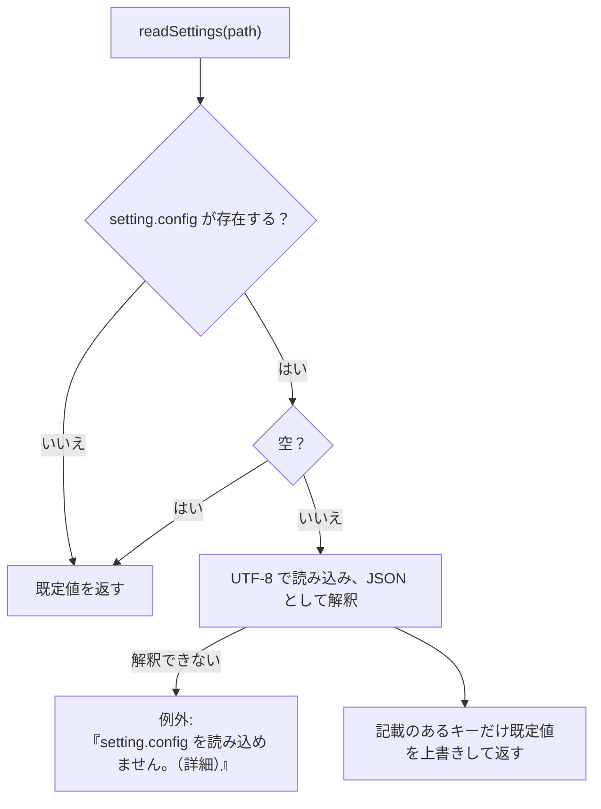

# 設定ファイル（setting.config）

設定は、ツール直下（書き込めなければ利用者ごとの場所。3.3）の `setting.config`（内容は JSON）の 1 ファイルにまとめ、画面が読み書きする。利用者が手で編集する前提にはしない。インデクサ（画面のプロセスの別のスレッド、または画面を使わずに起動した `indexer.ps1`）は、画面が保存したクロール対象フォルダと `work` の置き場所をこのファイルから読む。読み書きの関数は `scripts/tebunko/core/settings.ps1` にある。

## 形式

```json
{
    "targetFolders": [
        { "name": "見積", "path": "C:\\データ\\見積", "enabled": true },
        { "name": "報告書", "path": "D:\\old\\報告書", "enabled": false }
    ],
    "indexSources": [
        { "name": "営業", "path": "\\\\server\\営業" }
    ],
    "searchExcludes": [],
    "useRegex": false,
    "caseSensitive": false,
    "fileFilter": "",
    "includeShapes": true,
    "includeComments": true,
    "openMode": "normal",
    "workspaceFolder": "",
    "ingestThreads": 0
}
```

| キー | 型 | 既定値 | 内容 | 読み書きする関数 |
|---|---|---|---|---|
| `targetFolders` | `{name, path, enabled}` の配列 | 空 | クロール対象フォルダ（記載順）。`name` は**インデックス名**（`work\index` 直下のフォルダ名）、`path` は**そのフォルダが今置かれている場所**。名前と置き場所を分けて持つため、フォルダを移したときは `path` の値を書き換えるだけでよい（インデックスは作り直さない。[クロール対象フォルダとインデックス名](../indexer/flow.md#クロール対象フォルダとインデックス名)）。`name` が空ならインデックス作成時に割り当てて保存する。`enabled` が `false` はチェックなし（登録のみで取り込まない）。`enabled` が無ければチェックあり（[インデックス作成（インデクサ）](../indexer/index.md#クロール対象フォルダgettargetfolders)） | `getTargetFolders` / `writeTargetFolders` |
| `indexSources` | `{name, path}` の配列 | 空 | インデックス作成の対象にしないインデックスの元のフォルダ（インデックス名 → 今の置き場所）。別の PC・場所で作ったインデックスを検索するとき、元のファイルを開くために使う（[元のファイルが見つからないとき（元のフォルダを設定する）](../gui/search-tab.md#元のファイルが見つからないとき元のフォルダを設定する)） | `readIndexSources` / `writeIndexSources` / `setIndexSourceFolder` |
| `searchExcludes` | `{path, subfolders}` の配列 | 空 | 画面の検索対象のツリーでチェックを外したフォルダ（フルパス）。`subfolders` が `false` はフォルダ直下のファイルだけを外す。空ならすべてを検索する（[検索](../search/index.md#インデックスの一覧getsearchindexes)） | `readSearchExcludes` / `writeSearchExcludes` |
| `useRegex` | true / false | false | ［正規表現を使う］の状態 | `readSearchOption` / `writeSearchOption` |
| `caseSensitive` | true / false | false | ［大文字と小文字を区別］の状態（[検索](../search/index.md#検索条件サクラエディタの-grep-にならう)） | `readSearchOption` / `writeSearchOption` |
| `fileFilter` | 文字列 | 空 | 「対象ファイル」の指定（例: `*.xlsx;見積;!*old*`）。空ならすべて（同上） | `readSearchOption` / `writeSearchOption` |
| `includeShapes` | true / false | true | ［図形も検索］の状態。オフなら図形の場所（`<元の場所>[図形]`）を検索しない（同上） | `readSearchOption` / `writeSearchOption` |
| `includeComments` | true / false | true | ［コメントも検索］の状態。オフならコメントの場所（`<元の場所>[コメント]`）を検索しない（同上） | `readSearchOption` / `writeSearchOption` |
| `openMode` | `normal` / `readOnly` / `new` | `normal` | ［開き方］の状態。検索結果の元のファイルを、通常（編集する）・読み取り専用・新規（元のファイルを基にした無題の文書。占有しない）のどれで開くか（[元のファイルを開く](../gui/search-tab.md#元のファイルを開く)）。知らない値は `normal` とする | `readOpenMode` / `writeOpenMode` |
| `workspaceFolder` | 文字列 | 空 | `work`（インデックス・取り込み一覧・ログ）を置くフォルダ（[データの置き場所](layout.md#データの置き場所settingconfigwork)）。空なら既定の `%USERPROFILE%\Documents\tebunko_ws`（[データの置き場所](layout.md#データの置き場所settingconfigwork)）。既定の場所を選んだときも空で保存する。手で書いた相対パスは設定ファイルのフォルダから、`%変数%` は展開して読む | `getWorkDir` / `writeWorkspaceFolder` |
| `ingestThreads` | 数値 | 0 | インデックス作成で、Office を使わずに読むファイル（`.docx`・`.pptx` など）を並べて取り込む読み取りのスレッドの数（1〜4。4 より大きい値は 4 にする）。0 はコア数 − 1（1〜4）にする。取り込むファイルの数より多くはしない。Excel・Word・PowerPoint のファイルは、この値にかかわらず種類ごとにスレッド 1 つ・Office 1 つで取り込む。画面には出さない（手で書き換える）（[インデックス作成の並列化](threads.md#インデックス作成の並列化)） | `readSettings`（インデクサの `getIngestWorkerCount`） |

## 読み込み・保存



- ファイルが無くても作成しない（既定値で動く）。ファイルを作るのは画面が設定を保存したときだけ。
- 記載の無いキー・未知のキー・値が `null` のキーは無視する（キーが増えても古い設定ファイルをそのまま読める）。
- 真偽値のキーは、手で `"false"` のような文字列に書き換えても `true` / `false` として読む（`toSettingBool`）。読めない値は既定値にする。
- 数値のキー（`ingestThreads`）は、手で `"2"` のような文字列に書き換えても数値として読む。数値にできない値は既定値にする。
- 保存（`updateSettings`）は、保存のたびにファイルを読み直し、変えたキーだけを書き換える。ほかのキーは、ほかの画面・処理が保存した内容を保つ。UTF-8（BOM なし）。
- JSON として解釈できないときは例外にする。インデクサでは、例外は `invokeIndexer` が受け、受け渡しの口の `Error` に入れて画面が表示する（終了コード 1）。

## 画面での読み書き

画面の設定と［8 設定］タブ（[画面での読み書き](#画面での読み書き)）、キーボード操作（[キーボード操作](../gui/common.md#キーボード操作)）、見た目と配布の決まり（[表示・アクセシビリティ](../gui/common.md#表示アクセシビリティ)）、画面に出すメッセージ（[メッセージ一覧](../gui/common.md#メッセージ一覧)）をまとめる。

| ファイル | 画面での扱い |
|---|---|
| `setting.config` | 画面が読み書きし、インデクサはクロール対象フォルダを読む。UTF-8 の JSON で、キーは次のとおり。<br>・`targetFolders`：クロール対象フォルダ `{name, path, enabled}` の配列（［1 インデックス管理］。`getTargetFolders` / `writeTargetFolders`）。`name` はインデックス名、`path` は今の置き場所（分けて持つ）。`enabled` が `false` はチェックなし<br>・`indexSources`：取り込まないインデックスの元のフォルダ `{name, path}` の配列（[元のファイルが見つからないとき（元のフォルダを設定する）](../gui/search-tab.md#元のファイルが見つからないとき元のフォルダを設定する)。`readIndexSources` / `writeIndexSources` / `setIndexSourceFolder`）<br>・`searchExcludes`：検索対象のツリーでチェックを外したフォルダ `{path, subfolders}` の配列（4.8。`readSearchExcludes` / `writeSearchExcludes`）。無ければすべてチェックあり<br>・`useRegex`：［正規表現を使う］の状態（true / false。`readSearchOption` / `writeSearchOption`）。無ければオフ<br>・`caseSensitive`：［大文字と小文字を区別］の状態（true / false。同上）。無ければオフ<br>・`fileFilter`：「対象ファイル」の指定（文字列。同上）。無ければ空（すべて）<br>・`includeShapes` / `includeComments`：［図形も検索］［コメントも検索］の状態（true / false。同上）。無ければオン<br>・`openMode`：［開き方］の状態（`normal` / `readOnly` / `new`。`readOpenMode` / `writeOpenMode`、[元のファイルを開く](../gui/search-tab.md#元のファイルを開く)）。無い・知らない値なら `normal`（通常）<br>・`workspaceFolder`：ワークスペース（インデックス・取り込み一覧・ログを置くフォルダ）（文字列。`getWorkDir` / `writeWorkspaceFolder`、8.1）。無ければ空（既定の場所） |

| 項目 | 仕様 |
|---|---|
| 読み込み | `setting.config` が無ければ既定値とし、**ファイルを作成しない**。手で書き換えた `"false"` などの文字列の真偽値も読める（`toSettingBool`） |
| 保存のタイミング | インデックス一覧：追加・編集・削除・チェックの変更のたび。検索対象のツリー：チェックを変えたとき。検索条件のチェックボックス（正規表現・大文字と小文字・図形・コメント）：クリックしたとき。対象ファイル：欄からフォーカスが外れたときと検索したとき（検索したときは検索条件をまとめて保存する）。［開き方］：選び直したとき（起動時の読み込みでは保存しない）。ワークスペース：［8 設定］で変えたとき（[［8 設定］タブ](#8-設定タブ)）。インデックスの元のフォルダ：［編集…］で変えたとき・検索結果からフォルダを選んで見つかったとき。インデックス名：インデックスを作成したとき・［編集…］で変えたとき（名前の無い設定を読み込んだときは、読み込み時に割り当てて保存する） |
| 保存形式 | `setting.config`：保存のたびにファイルを読み直し、変えたキーだけを書き換える（ほかのキーは、ほかの画面・処理が保存した内容を保つ）。UTF-8（BOM なし） |
| 外部での編集 | ウィンドウがアクティブになったとき、保存されているインデックス一覧を、画面が最後に読み込み・保存した一覧と比べ（`getTargetsKey`）、異なれば読み直す（画面側の変更はその場で保存済みのため、失われるものは無い） |

### ［8 設定］タブ

［8 設定］タブ（`tab_settings.xaml`・`settings_tab.ps1`）には、「ワークスペース」と「設定ファイル」の 2 つの枠を置く。［9 プロセス停止］の前に置き、プロセス停止を最後のタブのままにする。

**ワークスペース**は、インデックス・取り込み一覧・ログ（`work` の中身。[フォルダ構成](layout.md#フォルダ構成)）を置くフォルダ。既定は `%USERPROFILE%\Documents\tebunko_ws`（高速検索のため、Windows Search の索引の対象になる場所。[データの置き場所](layout.md#データの置き場所settingconfigwork)）。

「ワークスペース」の枠には、今のワークスペースのフォルダを出し、その下に補足を出す。既定の場所なら `既定の場所（ドキュメントの tebunko）です。`、既定でなければ `既定の場所は「<既定の場所>」です。`。「設定ファイル」の枠には `setting.config` の場所を出し（表示だけ）、ツールのフォルダにあれば `ツールのフォルダに置いています。`、利用者ごとの場所なら `ツールのフォルダ（<ツールのフォルダ>）に書き込めないため、利用者ごとの場所に置いています。` と補足する。文言は判断層の `getWorkspaceView`・`getSettingsFileView`（`settings_view.ps1`）が決める。

- ［変更…］: フォルダ選択ダイアログ（[フォルダ選択ダイアログ（［参照…］）](../gui/index-tab.md#フォルダ選択ダイアログ参照)。説明は `ワークスペースにする空のフォルダを選んでください。…`）で**空のフォルダ**を選んでもらい、ワークスペースにする。空でなければ警告する（下）。
- ［既定に戻す］: 既定の場所に戻す（無ければ作る）。ほかのファイルが置いてあれば `「…」は空のフォルダではありません。…` と出して戻さない（前から使っているワークスペースなら戻す）。既定でない場所のときだけ表示する。

どちらも、インデックス作成中（画面を使わずに起動したものも含む）と、前のインデックスの削除中は変えられない（`インデックス作成中はワークスペースを変えられません。…`）。選んだフォルダは `testWorkspaceChoice` が調べる。

| 選んだフォルダ | 動き |
|---|---|
| 今と同じ（書き方の違い・ドライブの割り当てを含む） | 何もしない（ステータスに `今と同じワークスペースです`） |
| 今のインデックス（`<ワークスペース>\index`）の中 | `「<フォルダ>」は今のインデックスのフォルダの中です。…` と出して変えない |
| ファイルを作れない | `「<フォルダ>」にはファイルを作れません。書き込めるフォルダを選んでください。` と出して変えない |
| 空のフォルダ | 確認ダイアログを出す |
| 空でないフォルダ | 警告のダイアログを出す |

どちらのダイアログも [確認ダイアログ](../gui/common.md#確認ダイアログshowconfirm) の形で、中身は `newWorkspaceConfirm` が決める。

**確認ダイアログ（空のフォルダ）** の見出しは `ワークスペースを変えますか？`、ボタンは［ワークスペースを変える］。

- `→ インデックス・取り込み一覧・ログを、このフォルダに置きます`（選んだフォルダ）
- `→ 今のワークスペースの中身（インデックス・取り込み一覧・ログ）は、新しいワークスペースへ移します`（`移す前の場所：<今のワークスペース>`）

**警告のダイアログ（空でないフォルダ）** の見出しは `選んだフォルダは空ではありません。ワークスペースには空のフォルダを選んでください。`。選び直さなくても済むよう、選んだフォルダの中にワークスペースのフォルダを作る選択肢も出す。既定のボタンは［キャンセル］（何もしない。空のフォルダを選び直す）。

- `! このフォルダは空ではありません（ファイル・フォルダが N 個）`（中身の名前を先頭の 3 つまで。ほかにもあれば `など`。数えるのは 1,000 個までで、それ以上は `1,000 個以上`）

- `→ 今のワークスペースの中身（インデックス・取り込み一覧・ログ）は、新しいワークスペースへ移します`
- 選択肢［中に「workspace」フォルダを作って、ワークスペースにする］（`<選んだフォルダ>\workspace`）: `workspace` が無いか、あっても空のときだけ出す。作ってから、そこをワークスペースにする。
- 選択肢［このフォルダをそのまま使う］（`中のファイルは消しません。tebunko のファイルが同じフォルダに混ざります`）。

**インデックスがあるフォルダ**（中に tebunko のファイル・フォルダ（`getWorkspaceEntries`）があるとき。ほかの人が共有したワークスペースなど）の見出しは `選んだフォルダには、すでにインデックスがあります。どうしますか？`。インデックスを共有し、ほかの人が取り込めるようにするための選択肢を出す。既定のボタンは［キャンセル］。

- `✓ インデックス・取り込み一覧などがあります`（中にある名前）
- `→ 使うときは、インデックスの一覧もこのワークスペースのものにします`（`今のワークスペースの中身は移さず、元の場所に残します：<今のワークスペース>`）
- 補足: `ほかの人が共有したインデックスを使うときは［あるインデックスを使う］を選んでください。`
- 選択肢［あるインデックスを使う］: 今のワークスペースの中身は移さない。インデックスの一覧（`targetFolders`）を、そのワークスペースの取り込み一覧にあるクロール対象フォルダにする（`useWorkspaceTargets`。取り込み一覧が無ければ一覧は変えない）。一覧を合わせないままインデックス作成をすると、一覧に無いインデックスが削除されたフォルダのものとして消えるため。
- 選択肢［消して、最初からやり直す］（赤いボタン。`このフォルダのインデックス・取り込み一覧・ログを削除し、今のワークスペースの中身を移します（元に戻せません）`）: そのフォルダの tebunko のファイル・フォルダだけを削除し（`removeWorkspaceEntries`。ほかのファイルは消さない）、今のワークスペースの中身を移す。

決めると、実行中の検索を止めてから、今のワークスペースの中身（tebunko が作るファイル・フォルダだけ。利用者のほかのファイルは移さない）を新しいワークスペースへ移す（`moveWorkspace`。[データの置き場所](layout.md#データの置き場所settingconfigwork)）。移し先に同じ名前があるときや、ファイルが開かれていて移せないときは、移した分を戻し、理由を知らせてワークスペースを変えない。移せたら `setting.config` の `workspaceFolder` に保存し（既定の場所なら空）、画面は開き直さず、その場で新しいワークスペースに切り替える（`settings_tab.ps1` の `switchWorkspace`）。実行中の検索は止め、検索結果・プレビューを空にし、インデックス一覧・取り込みの状態・検索対象のツリー・件数を新しいワークスペースから読み直す。切り替える前に始めた裏の仕事（取り込みの状態の集計・件数の数え上げ・高速検索が使えるかの確認）の結果は、画面に出さない。インデックス一覧（クロール対象フォルダ）は変わらず、中身を移したので、インデックス・取り込みの状態もそのまま使える。検索対象のツリーでチェックを外したフォルダ（`searchExcludes`）は `<ワークスペース>\index` の下のフルパスで持つため、移した先のインデックスの下に付け替える（`moveSearchExcludes`）。
