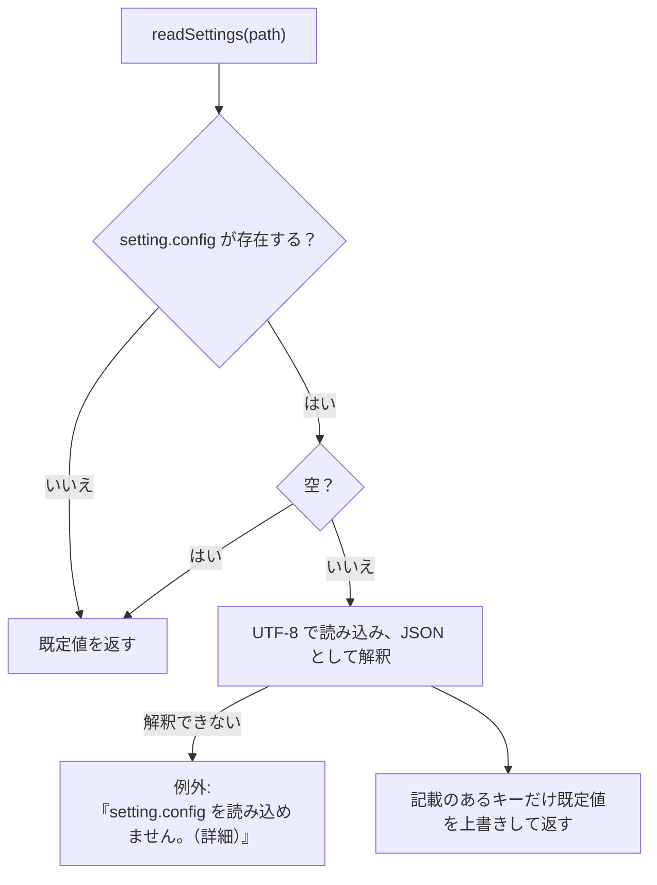

# 設定ファイル（setting.config）

設定は、ツール直下（書き込めなければ利用者ごとの場所。[データの置き場所](layout.md#データの置き場所settingconfigwork)）の `setting.config`（内容は JSON）の 1 ファイルにまとめ、画面が読み書きする。利用者が手で編集する前提にはしない。インデクサ（画面のプロセスの別のスレッド、または画面を使わずに起動した `indexer.ps1`）は、画面が保存したクロール対象フォルダとワークスペースの場所をこのファイルから読む。読み書きの関数は `scripts/tebunko/core/settings.ps1` にある。

## 形式

```json
{
    "targetFolders": [
        { "name": "見積", "path": "C:\\データ\\見積", "enabled": true },
        { "name": "報告書", "path": "D:\\old\\報告書", "enabled": false }
    ],
    "indexSources": [
        { "name": "営業", "path": "\\\\server\\営業" }
    ],
    "searchExcludes": [],
    "useRegex": false,
    "caseSensitive": false,
    "fileFilter": "",
    "includeShapes": true,
    "includeComments": true,
    "openMode": "normal",
    "workspaceFolder": "",
    "ingestThreads": 0
}
```

| キー | 型 | 既定値 | 内容 | 読み書きする関数 |
|---|---|---|---|---|
| `targetFolders` | `{name, path, enabled}` の配列 | 空 | クロール対象フォルダ（記載順）。`name` は**インデックス名**（`<ワークスペース>\index` 直下のフォルダ名）、`path` は**そのフォルダが今置かれている場所**。名前と置き場所を分けて持つため、フォルダを移したときは `path` の値を書き換えるだけでよい（インデックスは作り直さない。[クロール対象フォルダとインデックス名](../indexer/flow.md#クロール対象フォルダとインデックス名)）。`name` が空ならインデックス作成時に割り当てて保存する。`enabled` が `false` はチェックなし（登録のみで取り込まない）。`enabled` が無ければチェックあり（[インデックス作成（インデクサ）](../indexer/index.md#クロール対象フォルダgettargetfolders)） | `getTargetFolders` / `writeTargetFolders` |
| `indexSources` | `{name, path}` の配列 | 空 | インデックス作成の対象にしないインデックスの元のフォルダ（インデックス名 → 今の置き場所）。別の PC・場所で作ったインデックスを検索するとき、元のファイルを開くために使う（[元のファイルが見つからないとき（元のフォルダを設定する）](../gui/search-tab.md#元のファイルが見つからないとき元のフォルダを設定する)） | `readIndexSources` / `writeIndexSources` / `setIndexSourceFolder` |
| `searchExcludes` | `{path, subfolders}` の配列 | 空 | 画面の検索対象のツリーでチェックを外したフォルダ（フルパス）。`subfolders` が `false` はフォルダ直下のファイルだけを外す。空ならすべてを検索する（[検索](../search/index.md#インデックスの一覧getsearchindexes)） | `readSearchExcludes` / `writeSearchExcludes` |
| `useRegex` | true / false | false | ［正規表現を使う］の状態 | `readSearchOption` / `writeSearchOption` |
| `caseSensitive` | true / false | false | ［大文字と小文字を区別］の状態（[検索](../search/index.md#検索条件サクラエディタの-grep-にならう)） | `readSearchOption` / `writeSearchOption` |
| `fileFilter` | 文字列 | 空 | 「対象ファイル」の指定（例: `*.xlsx;見積;!*old*`）。空ならすべて（同上） | `readSearchOption` / `writeSearchOption` |
| `includeShapes` | true / false | true | ［図形も検索］の状態。オフなら図形の場所（`<元の場所>[図形]`）を検索しない（同上） | `readSearchOption` / `writeSearchOption` |
| `includeComments` | true / false | true | ［コメントも検索］の状態。オフならコメントの場所（`<元の場所>[コメント]`）を検索しない（同上） | `readSearchOption` / `writeSearchOption` |
| `openMode` | `normal` / `readOnly` / `new` | `normal` | ［開き方］の状態。検索結果の元のファイルを、通常（編集する）・読み取り専用・新規（元のファイルを基にした無題の文書。占有しない）のどれで開くか（[元のファイルを開く](../gui/search-tab.md#元のファイルを開く)）。知らない値は `normal` とする | `readOpenMode` / `writeOpenMode` |
| `workspaceFolder` | 文字列 | 空 | ワークスペース（インデックス・取り込み一覧・ログを置くフォルダ）。空なら既定の `%USERPROFILE%\Documents\tebunko_ws`（[データの置き場所](layout.md#データの置き場所settingconfigwork)）。既定の場所を選んだときも空で保存する。手で書いた相対パスは設定ファイルのフォルダから、`%変数%` は展開して読む | `getWorkDir` / `writeWorkspaceFolder` |
| `ingestThreads` | 数値 | 0 | インデックス作成で、Office を使わずに読むファイル（`.docx`・`.pptx` など）を並べて取り込む読み取りのスレッドの数（1〜4。4 より大きい値は 4 にする）。0 はコア数 − 1（1〜4）にする。取り込むファイルの数より多くはしない。Excel・Word・PowerPoint のファイルは、この値にかかわらず種類ごとにスレッド 1 つ・Office 1 つで取り込む。画面には出さない（手で書き換える）（[インデックス作成の並列化](threads.md#インデックス作成の並列化)） | `readSettings`（インデクサの `getIngestWorkerCount`） |

## 読み込み・保存



- ファイルが無くても作成しない（既定値で動く）。ファイルを作るのは画面が設定を保存したときだけ。
- 記載の無いキー・未知のキー・値が `null` のキーは無視する（キーが増えても古い設定ファイルをそのまま読める）。
- 真偽値のキーは、手で `"false"` のような文字列に書き換えても `true` / `false` として読む（`toSettingBool`）。読めない値は既定値にする。
- 数値のキー（`ingestThreads`）は、手で `"2"` のような文字列に書き換えても数値として読む。数値にできない値は既定値にする。
- 保存（`updateSettings`）は、保存のたびにファイルを読み直し、変えたキーだけを書き換える。ほかのキーは、ほかの画面・処理が保存した内容を保つ。UTF-8（BOM なし）。
- 保存は、書き込みの途中で止まっても設定ファイルが壊れないよう、一時ファイル（`setting.config.tmp`）に書いてから置き換える（`writeTextLinesAtomic`）。
- 「読み直す → 変える → 書く」の一続きは、設定ファイルごとの名前付きミューテックス（`Local\tebunko_settings_<getFolderKey 設定ファイルのパス>`。`invokeSettingsLocked`）の中で行う。画面・インデクサ（別のプロセスも）が同時に保存しても、互いの変更を消さない。待つのは 5 秒で、過ぎたら例外にする。同じ Windows のセッションの中だけの排他（別のセッションからは排他しない）。
- インデクサが決めたインデックス名は、始めに読んだ一覧を丸ごと書き戻さず、書き戻す直前に読み直した一覧へ、名前が空の項目にだけ足す（`saveAssignedIndexNames`・`mergeAssignedIndexNames`。同じ名前をほかの項目が使っていれば付けない）。その間に画面で足した・変えたクロール対象フォルダを消さないため。
- JSON として解釈できないときは例外にする。インデクサでは、例外は `invokeIndexer` が受け、受け渡しの口の `Error` に入れて画面が表示する（終了コード 1）。

## 画面での読み書き

画面は設定を変えたその場で保存する。［8 設定］タブの画面の仕様は [［8 設定］タブ](../gui/settings-tab.md) にある。

| 項目 | 仕様 |
|---|---|
| 保存のタイミング | インデックス一覧：追加・編集・削除・チェックの変更のたび。検索対象のツリー：チェックを変えたとき。検索条件のチェックボックス（正規表現・大文字と小文字・図形・コメント）：クリックしたとき。対象ファイル：欄からフォーカスが外れたときと検索したとき（検索したときは検索条件をまとめて保存する）。［開き方］：選び直したとき（起動時の読み込みでは保存しない）。ワークスペース：［8 設定］で変えたとき（[［8 設定］タブ](../gui/settings-tab.md)）。インデックスの元のフォルダ：［編集…］で変えたとき・検索結果からフォルダを選んで見つかったとき。インデックス名：インデックスを作成したとき・［編集…］で変えたとき（名前の無い設定を読み込んだときは、読み込み時に割り当てて保存する） |
| 外部での編集 | ウィンドウがアクティブになったとき、保存されているインデックス一覧を、画面が最後に読み込み・保存した一覧と比べ（`getTargetsKey`）、異なれば読み直す（画面側の変更はその場で保存済みのため、失われるものは無い） |
