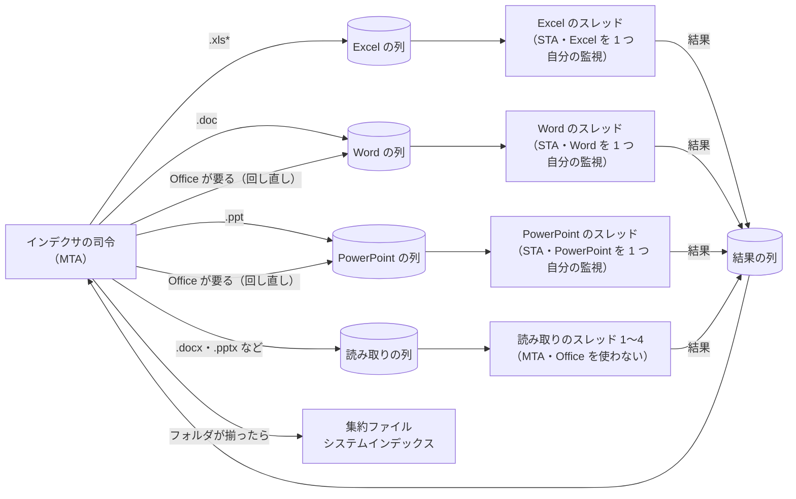
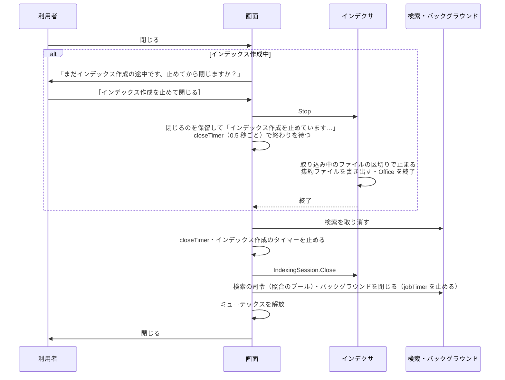

# プロセスとスレッド

このページは、tebunko がどのプロセス・スレッドで動き、それぞれをいつ作っていつ片づけるかをまとめる。検索・インデックス作成・画面の処理を足すときは、ここの決まりに合わせる。

| 知りたいこと | 節 |
|---|---|
| プロセスをどう分けているか | [プロセス](#プロセス) |
| どのスレッドが何をするか・優先度・STA と MTA | [スレッドの一覧](#スレッドの一覧) |
| いつ作っていつ片づけるか | [寿命](#寿命) |
| インデックス作成の並列化 | [インデックス作成の並列化](#インデックス作成の並列化) |
| 画面とインデクサの受け渡し | [画面とインデクサの受け渡し](#画面とインデクサの受け渡し) |
| 閉じるときの順番 | [閉じるときの順番](#閉じるときの順番) |
| GC で画面を止めないための決まり | [GC とメモリ](#gc-とメモリ) |
| クラスを使ってよいところ | [クラスと関数の使い分け](#クラスと関数の使い分け) |

## プロセス

- **画面のプロセス 1 つで動く。** 検索・インデックス作成・画面の裏の読み込みは、どれも画面のプロセスの中のスレッドで行う。
- **別のプロセスになるのは Office（Excel・Word・PowerPoint）だけ。** COM で操作するアプリは、COM の仕組みで別のプロセスとして動く。
- **画面を閉じたら何も残さない。** インデックス作成中に閉じるときは、作成を中止してから閉じる（[閉じるときの順番](#閉じるときの順番)）。作成を続けたまま画面だけを閉じることはできない。
- 画面は、インデックス作成 1 回ごとに `IndexingSession`（`newIndexingSession`）を作る。`IndexingSession` はインデクサの司令のスレッドを作り、そこで `indexer.ps1 -Channel <受け渡しの口>` を実行する。
- `indexer.ps1` は、画面を使わずにインデックスを作る入口としても使える（`-RetryFailed`）。`-Channel` を付けなければ自分で受け渡しの口を作り、ログをコンソールにも出す。中身は画面から使うものと同じ関数（`invokeIndexer`）で、コンソールのプロセスの中で同じスレッドの構成で動く。
- ツールが起動する外のプロセスは、エクスプローラー（`explorer.exe`）だけである。ワークスペースを変えても、画面は起動し直さない（その場で切り替える）。インデックス作成のために `powershell.exe` を起動することはない。

分けない理由は、閉じるときに後始末を確実にするためと、受け渡しをファイルで行わずに済ませるためである。スレッドにすると GC で画面が止まるおそれがあるが、実測では画面の止まりが増えなかった（[GC とメモリ](#gc-とメモリ)）。

## スレッドの一覧

| スレッド | 数 | 寿命 | アパートメント | 優先度 | 役目 |
|---|---|---|---|---|---|
| 画面 | 1 | アプリ | STA | Normal | 表示と操作の受け付けだけ。ファイルの読み込みなどの重い処理はしない |
| 検索の司令 | 1 | アプリ | MTA | Normal | 検索の要求を待ち、候補を集め、照合を照合のプールに配り、結果を画面へ渡す |
| 照合のプール | コア数 − 1（1〜4） | アプリ | MTA | Normal | 集約ファイルを読み、正規表現で照合する |
| バックグラウンド | 2 | アプリ | MTA | Normal | 画面から頼まれる短い仕事（`startJob`。プレビューの読み込み・状態の読み直し・プロセスの一覧など）。長い仕事の間もプレビューが待たないよう 2 つにする |
| インデクサの司令 | 1 | インデックス作成 1 回 | MTA | BelowNormal | クロール・確認・取り込みの振り分け・取り込み一覧・集約ファイルとシステムインデックスの書き出し |
| 取り込み（Excel） | 1 | インデックス作成 1 回 | STA | BelowNormal | Excel のファイル（`.xls*`）を 1 つずつ TSV に取り込む。Excel を 1 つ持つ |
| 取り込み（Word） | 1 | インデックス作成 1 回 | STA | BelowNormal | 旧形式の Word のファイル（`.doc`）を取り込む。Word を 1 つ持つ |
| 取り込み（PowerPoint） | 1 | インデックス作成 1 回 | STA | BelowNormal | 旧形式の PowerPoint のファイル（`.ppt`）を取り込む。PowerPoint を 1 つ持つ |
| 取り込み（読み取り） | コア数 − 1（1〜4。設定 `ingestThreads` で変えられる） | インデックス作成 1 回 | MTA | BelowNormal | 新形式の Word・PowerPoint のファイル（`.docx`・`.docm`・`.pptx`・`.pptm`）を、Office を使わずに読む |
| 監視 | Office の取り込みスレッド 1 つに 1 つ | インデックス作成 1 回 | MTA | Normal | 自分の取り込みスレッドの制限時間を見て、過ぎたらそのスレッドが起動した Office だけを PID で止める |
| システムインデックスのプール | 最大 4 | インデックス作成 1 回 | MTA | BelowNormal | フォルダごとのシステムインデックスを作る（`WorkerPool`） |

**優先度の決まり。** 利用者が結果を待つもの（画面・検索・バックグラウンド）は Normal にする。インデックス作成のものは BelowNormal にし、インデックス作成中も検索を先に動かす。監視は、固まった Office を止める役目のため Normal のままにする。

- 優先度は、プロセス全体（`PriorityClass`）ではなくスレッドごと（`Thread.Priority`）に下げる。プロセス全体を下げると画面も下がるため。画面のプロセスの `PriorityClass` は変えない。
- **優先度を下げるのは、利用者とプロセスを共有しないと確実に言えるものだけにする。** インデックス作成のスレッドは画面のプロセスの中にあり、利用者と共有しないため下げる。取り込みスレッドが起動した Office のプロセスは、`PriorityClass` を変えない（Normal のまま）。利用者がダブルクリックしたファイルが、インデックス作成が起動した画面の無い Excel・Word で開くことがあり、PowerPoint は 1 つのプロセスしか持てず利用者の PowerPoint と同じプロセスになるため、下げると利用者の操作が遅くなるおそれがある。Excel の `IgnoreRemoteRequests` で分けることもできるが、この設定は Excel のオプションとして残ることがあり、インデックス作成の Excel が途中で止まると利用者の Excel でファイルを開けなくなるおそれがあるため使わない。

**STA と MTA の使い分け。**

- STA（シングルスレッド アパートメント）では、そのスレッドで作った COM の部品を、そのスレッドだけで呼ぶ。Office の COM と WPF の画面はこれが前提になっている。
- MTA（マルチスレッド アパートメント）は、どのスレッドからでも呼べる。PowerShell のランスペースの既定である。
- Office の COM に触るスレッド（画面・Excel・Word・PowerPoint の取り込み）だけを STA にし、それ以外は MTA にする。STA のスレッドが長く待つと、そのスレッドの COM の部品への呼び出しが止まるため、必要なところに絞る。
- COM の部品はスレッドの間で渡さない。作ったスレッドで使い、同じスレッドで片づける。
- 画面のスレッドで COM を使うのは、利用者の Excel に「開いて」と頼む短い呼び出し（[元のファイルを開く](../gui/search-tab.md)）だけにする。

## 寿命

スレッドやランスペースは、作っては捨てるのをやめ、次の 4 つの寿命のどれかに属させる。

| 寿命 | 始まり | 終わり | 属するもの |
|---|---|---|---|
| アプリ | 画面を開く | 画面を閉じる | 検索の司令・照合のプール・バックグラウンド・読んだ内容のキャッシュ |
| インデックス作成 1 回 | ［インデックス作成を開始］ | 完了・中止・エラー | インデクサの司令・取り込み・監視・システムインデックスのプール・Office |
| 検索の要求 1 回 | 検索の開始 | 結果の受け渡しの完了・取り消し | 要求（語・条件・取り消しの札 `Stop`）と結果の列だけ。スレッドは作らない |
| 読んだ内容 | 集約ファイルを読む | キャッシュの予算を超えて追い出される・ファイルが変わる | 集約ファイルの内容（[GC とメモリ](#gc-とメモリ)） |

- アプリの寿命のスレッドは、最初に使うときに作る。ランスペースには、はじめに一度だけ関数を読み込む。検索のたびに lib.ps1 を読み込み直さない。
  - 検索の司令（`SearchService`）は、スレッドを始めたときに lib.ps1 を 1 回だけ読み込み、照合のプール（`newPackWorkerPool`）を 1 回だけ作る。
  - バックグラウンド（`BackgroundQueue`）の各スレッドは、最初の仕事の前に lib.ps1 を 1 回だけ読み込む（`WorkerPool.Prelude`）。
  - そのため、これらのスレッドは読み込んだときのワークスペース（`$workspace`）を持ち続ける。画面は仕事を頼むときにワークスペースの中の場所を渡す（検索の要求は `WorkDir` を持つ）。ワークスペースを変えてもスレッドは作り直さない（[ワークスペースの中の場所（Workspace）](modules.md#ワークスペースの中の場所workspace)）。
- 照合のプールでは、ランスペースに加えて PowerShell のインスタンスも使い回す（`WorkerPool`）。
- 検索の要求（`newSearchRequest`。`[hashtable]::Synchronized`）は、`invokeSearchRequest` が実行する。要求の `Stop` が取り消しの札になる。新しい要求を出すと、前の要求の `Stop` を立てて取り消す。
- 検索 1 回が終わるたびに、検索の司令が読んだ内容のキャッシュを整理する（`trimTsvTextCache`。[GC とメモリ](#gc-とメモリ)）。

## インデックス作成の並列化

インデクサの司令が取り込み対象を並べ、ファイルの種類ごとの「レーン」に 1 ファイルずつ渡す。レーンごとに列と取り込みスレッドを持つ。取り込みスレッドは結果（成功・失敗・TSV の場所）を返し、書き出しは司令がまとめて行う。

| レーン | 対象（拡張子） | スレッド | Office |
|---|---|---|---|
| Excel | `.xls*`（すべての Excel のファイル。セルの表示値を読むため Excel が要る） | 1（STA） | Excel を 1 つ |
| Word | `.doc` | 1（STA） | Word を 1 つ |
| PowerPoint | `.ppt` | 1（STA） | PowerPoint を 1 つ |
| 読み取り | `.docx`・`.docm`・`.pptx`・`.pptm` | 設定 `ingestThreads`（1〜4。0 はコア数 − 1 で 1〜4。取り込むファイルの数より多くはしない）（MTA） | 使わない |

- **レーンは拡張子で決める**（`getIngestLane`。判断層の `indexer_decide.ps1`）。Excel のファイルはセルの表示値を読むため、すべて Excel のレーンにする。Word・PowerPoint は、旧形式（`.doc`・`.ppt`）だけ Office のレーンにし、新形式は読み取りのレーンにする。
- **Office は種類ごとに 1 つだけ起動する。** Excel・Word・PowerPoint のレーンは、それぞれスレッド 1 つが自分の Office を 1 つ持つ。インデックス作成が起動する Office は、Excel・Word・PowerPoint がそれぞれ最大 1 つになる。3 つのレーンは互いに並べて動く。PowerPoint も、自分のスレッドが一度起動したら使い回す（変換のたびに起動し直さない）。同じ種類の Office を複数のスレッドが同時に起動しないため、起動の前後のプロセスの一覧の差で PID を取り違えない。起動した Office の優先度は変えない（[スレッドの一覧](#スレッドの一覧)）。起動した Office の PID は受け渡しの口（`OfficePids`）に記録する。
- **レーンのスレッドは、そのレーンのファイルを初めて渡すときに始める**（`addIngestTask`）。渡すファイルが無いレーンは、スレッドも Office も作らない。列は `newIngestPool` がレーンごとに作る（`BlockingCollection`）。
- **読み取りのスレッドは Office を使わない。** `.docx`・`.pptx` などの ZIP（XML）の形式を `office_reader` で直接読む。監視も持たない。
- **Office が要ると分かったファイルは、Office のレーンに回し直す。** 新形式の拡張子でも、中身が ZIP でない（パスワード付き・中身が旧形式）ことがある。読み取りのスレッドでは、`extractDocument` が `${officeRequiredMessage}`（`このファイルの取り込みには Word・PowerPoint が要ります。`）の例外を投げ、`invokeIngestTask` が `Reroute` を返す。司令は同じファイルを Word または PowerPoint のレーン（`getOfficeLane`）に渡し直す。回し直す間も取り込み中のまま扱う。ZIP でも旧形式でもない PowerPoint のファイル（壊れている）は、回し直さずに失敗にする。
- **並びの先を見て、空いているレーンに渡す。** 司令は、まだ渡していない最初のファイルから `${ingestLookAhead}`（200 件）先までを見て、レーンに空きがあるファイルを渡す。レーンに渡しておける数（`getIngestLaneCapacity`）は、Office のレーンが 2（取り込み中の 1 件と次の 1 件）、読み取りのレーンが読み取りのスレッドの数 × 2 である。Excel のファイルが続いても、読み取りのスレッドを遊ばせない。取り込む順は取り込み一覧の順と変わることがあるが、結果（取り込み一覧・集約ファイル）は同じになる。
- **監視は Office のスレッドごとに持つ。** Office のレーンのスレッドは、始めるときに自分の監視のスレッドを作る（`startWatchdog`）。監視は、そのスレッドの制限時間だけを見て、そのスレッドが起動した Office だけを PID で止める。
- **Office の起動し直しと制限時間は、Office のスレッドごとに数える。** スレッドごとに 100 ファイルで起動し直す。1 ファイルの制限時間は 10 分。
- **一時フォルダはスレッドごとに分ける。** `%TEMP%\tebunko\<PID>\w<番号>` と、取り込み出力の `w<番号>` を使う。
- **集約ファイルはフォルダが揃ってから書く。** 司令は、はじめにフォルダごとのファイルの数を数えておき、取り込み中の数（`folderBusy`）と、まだ渡していない数（`folderPending`）を持つ。結果を受け取るたびに、どちらも 0 になったフォルダの集約ファイルとシステムインデックスを書き出す（`flushPendingPublish` に、まだ書き出さないフォルダを渡す）。
- **取り込み一覧と進み具合は司令だけが書く。** 取り込みスレッドは結果を結果の列（`BlockingCollection`）に入れるだけで、取り込み一覧（`addStatusRow`）・進み具合・システムインデックスの変更の印（`markSystemIndexChanged`）は司令が書く。ログも、取り込みスレッドが 1 ファイル分を貯めて結果と一緒に返し、司令が書く。
- **取り込み中のファイルは、取り込み中のものをすべて記録する**（`取り込み中.txt`。1 行に 1 ファイル）。強制終了の後は、記録にあるファイルすべてを「前回止まったファイル」として扱う。
- **中止。** 司令は振り分けをやめ、取り込み中のファイル（回し直したものを含む）が終わるのを待ってから、書き出しと Office の片づけを行う。各レーンのスレッドは、列が閉じられたら自分の Office を終了して終わる（`stopIngestWorkers`）。
- **取り込みスレッドが止まったら。** 取り込みスレッドが途中で止まった（読み込めない等）ときは、インデックス作成を続けられないエラー `取り込みのスレッドが止まりました：<理由>` にする。

`setting.config` の `ingestThreads` で変えられるのは、読み取りのスレッドの数だけである。Excel・Word・PowerPoint のレーンは、いつもスレッド 1 つ・Office 1 つにする。

取り込みのスレッドを使うときは、はじめにログに `N 件のファイルを取り込みます。（Excel・Word・PowerPoint はそれぞれ 1 つずつ、Office を使わずに読むファイルは R 個のスレッドで並べて取り込みます。…）` と出す。

テストでは受け渡しの口の `Workers` を 0 にし、すべてのファイルの取り込みを司令のスレッドで行う（途中に割り込むため）。テストデータ（300 ファイル）で、スレッド 1 つと 4 つの結果（集約ファイルと取り込み一覧）が同じになることを確かめた。

速さは、空いている CPU の量で決まる。1 ファイルの取り込みには、Excel と PowerShell で約 1 コアを使う。スレッドと Office の両方の優先度を下げていたときは、ほかのアプリが約 2 コアを使っている PC で、変更前より 1〜2 割遅くなった（性能データ 1,080 ファイル。変更前 414 秒、取り込みのスレッド 1 つ 518 秒、3 つ 456 秒。両方 Normal では 398 秒）。PowerPoint を変換のたびに起動し直していたときは、旧形式 1 件に約 7 秒かかった（使い回すと約 0.25 秒）。

## 画面とインデクサの受け渡し

画面とインデクサは、同じプロセスのメモリ上の受け渡しの口（`newIndexerChannel`。`[hashtable]::Synchronized`）でやり取りする。ファイルでの受け渡しは行わない。画面は進み具合を 1 秒ごとに口から読む。

| 項目 | 書く側 | 読む側 | 内容 |
|---|---|---|---|
| RetryFailed・ConfirmTargets・Workers | 画面 | インデクサ | 前回失敗したファイルも取り込むか・取り込む前に確認するか・読み取りのスレッドの数（-1 は設定とコア数から決める。0 はすべてを司令のスレッドで取り込む（テスト）） |
| Progress | インデクサの司令（`writeIndexingProgress`） | 画面（`readIndexingProgress`） | 段階・処理済み・残り・失敗・詳細 |
| Stop | 画面（`requestIndexingStop`） | インデクサ | 中止の要求 |
| Plan・Answer・Answered | インデクサ → 画面（`answerIndexingPlan`） → インデクサ | 両方 | 取り込み予定と、利用者の返事。インデクサは `Answered`（`ManualResetEvent`）で待つ（`waitForIndexingApproval`。60 分で取りやめる） |
| Error・ExitCode | インデクサ | 画面 | 続けられないエラーの内容と、終了コード（0 完了・1 エラー・2 中止）。`ExitCode` は最後に入れる |
| Notice・Postponed | インデクサ | 画面（`IndexingSession.GetNotice` / `GetPostponed`） | 終わりの案内（利用者の PowerPoint が起動していて後回しにしたファイルがあるときの一言。無ければ空）と、後回しにした件数（未取り込みのまま残した件数。無ければ 0） |
| OfficePids | 取り込みスレッド | 画面 | インデックス作成が起動した Office の PID とプロセス名（`ConcurrentDictionary`）。閉じるときに止まらなければ、これだけを止める |

ファイルに残すのは次のものだけである。

- `取り込み一覧.tsv`
- `取り込み中.txt`（強制終了からの再開）
- `インデックス作成ログ.txt`（`writeIndexerLog` で書く。実行ごとに上書き）

インデクサのミューテックス（`newAppMutex "indexer"`。画面と `indexer.ps1` が同時に作らないため）は、インデクサの司令のスレッドで取得し、同じスレッドで解放する。ログはミューテックスを取ってから開く。［8 設定］タブは、ワークスペースを変える前に、画面を使わずに起動したインデックス作成が動いていないかをこのミューテックスで調べる（`testIndexerRunning`）。

設定ファイル（`setting.config`）の「読み直す → 変える → 書く」は、画面（UI のスレッド）とインデクサ（別のプロセスの司令のスレッド）が同時に行うことがあるため、設定ファイルごとの名前付きミューテックス（`Local\tebunko_settings_<鍵>`。`invokeSettingsLocked`）の中で行う。時間（5 秒）を過ぎても取れなければ例外にする。前の持ち主が手放さずに終わっていた（abandoned）ときは、取れたものとして続ける。重い読み込み（取り込み一覧など）はミューテックスの外で済ませ、持つ時間を短くする。

## 閉じるときの順番

- 確認の選択肢は［インデックス作成を止めて閉じる］と［閉じない］だけである。インデックス作成を続けたまま画面を閉じることはできない。確認している間にインデックス作成が終わっていれば、そのまま閉じる。
- Office が固まってインデクサが戻らないときは、まず監視が制限時間で Office を止める。画面は 60 秒待っても終わらなければ、インデックス作成が起動した Office を PID で止め（`IndexingSession.KillOffice`）、さらに 15 秒待つ。それでも終わらなければ、そのまま閉じる（スレッドは `IndexingSession.Close` で止める）。
- 止めるのは、インデックス作成が起動して PID を記録した Office（`OfficePids`）だけである。PID が別のプロセスに使い回されていないよう、記録したプロセス名と同じかも確かめる。利用者が開いていた Office は止めない。
- 止めるのを待っている間にもう一度閉じようとしても、何もしない。

## GC とメモリ

スレッドは同じプロセスのヒープを使うため、インデクサや検索が大量にメモリを使うと、GC で画面のスレッドも止まる。

実測（画面の代わりに 5ms ごとに起きるスレッドを動かし、遅れを測った。ヒープ 300MB、20 秒）では、次のとおりだった。

| 負荷 | 遅れの最大 | 50ms を超えた回数 |
|---|---|---|
| なし | 27.0ms | 0 |
| 同じプロセスのスレッドで集約ファイルの読み書き | 45.0ms | 0 |
| 別のプロセスで同じ負荷 | 18.8ms | 0 |
| 同じプロセス＋`SustainedLowLatency` | 33.2ms | 0 |

Windows のタイマーの刻み（約 15.6ms）を考えると、どれも画面の操作で気づく止まりではない。そのうえで、次を守る。

- 起動時に `GCSettings.LatencyMode` を `SustainedLowLatency` にする（重い全体の GC を後回しにする）。
- 読んだ内容のキャッシュに予算（文字数）を決め、超えたら使われていないものから追い出す。追い出しは検索の司令のスレッドで、検索の後に行う（`trimTsvTextCache`）。
  - キャッシュの各内容には、最後に使った世代を付ける。世代は検索 1 回ごとに 1 つ進める。
  - 予算の 90% を超えていたら、今の世代（いま終わった検索）で使わなかったものを、古い世代から追い出す。今の世代で使ったものは残す（毎回同じ集約ファイルを順に読むため、使った順だけで追い出すと、予算より大きいインデックスでは何も残らない）。
- 画面のスレッドで大きな文字列を作らない。プレビューの読み込み（`readPackContext`）はバックグラウンドのスレッドで行い、表示する分だけを受け取る。
- 検索の結果は、時間で区切って少しずつ画面に移す（`pumpSearch`）。

実装を変えたときは、画面の心拍（画面のスレッドの `DispatcherTimer` の遅れ）を、インデックス作成と検索を同時に動かして測る。100ms を超える止まりが出るようなら、インデクサだけを別のプロセスに戻すことを検討する。

## クラスと関数の使い分け

PowerShell 5.1 のクラスのメソッドは、別のランスペースへ渡したインスタンスから呼んでも、作った側（定義したランスペース）の関数を呼ぶ（試し c）。作った側のランスペースが同時に実行中のときにどう動くかは試していない。次の 3 つを Windows で試し、その結果をもとに使い分けを決める。

**試したこと**（環境: Windows 11、PowerShell 5.1.26100.9549、main 79065aa、2026-09-26。個人のパスは書かない）

- a. クラスのメソッドから、同じランスペースのスクリプトの関数・`$script:` 変数が見えるか。ランスペースの無い .NET のスレッドからクラスのメソッドを呼べるか
- b. 関数の呼び出し・インスタンスのメソッドの呼び出し・静的メソッドの呼び出し・`$script:` 変数の読み・クラスのプロパティの読み・hashtable の読みの、1 回あたりの速さ（下の「速さ」）
- c. `CreateRunspace` で作ったランスペースの中でクラスを dot-source して使えるか。別のランスペースへ渡したインスタンスのメソッドは、どちらのランスペースの関数を呼ぶか

**決まり**

| 決まり | 理由（試した結果） |
|---|---|
| クラスは、使うランスペースの中で定義のファイルを dot-source して作り、そのランスペースの中だけで使う | `CreateRunspace` で作ったランスペースの中で dot-source したクラスは使えた（c） |
| クラスのインスタンスを別のスレッド（別のランスペース）へ渡さない。別のスレッドには素の値（例 `Workspace` の `Dir` の文字列）を渡し、そこで作り直す | 渡したオブジェクトのメソッドは、**作った側のランスペースの関数**を呼んだ。作った側が実行中のときに別スレッドから呼んだときの動きは試していない（c）。また、同じ名前のクラスでも dot-source したランスペースごとに別の型になるとみられ、型付きの引数や `-is` が合わないおそれがある（試していない） |
| スレッドをまたいで使うもの（受け渡しの口・取り込みの結果・キャッシュ）は、今までどおり .NET のコレクション（`ConcurrentQueue`・`ConcurrentDictionary`・`[hashtable]::Synchronized` など）と hashtable・関数で作る。クラスはそれを持って読み書きしてよい | 同上 |
| クラスのメソッドから使ってよい関数・変数は、**スクリプトのトップのスコープ（または global）で dot-source したファイルの関数と `$script:` 変数**だけにする（関数の定義がクラスより前でも後でもよい） | 見えた（a）。試したのはスクリプトのトップで dot-source した場合だけ。PS のクラスのメソッドは、呼んだ側ではなく定義したスコープから関数を引くので、関数やスクリプトブロックの中（Pester の `BeforeAll`・`It` を含む）で定義した関数・変数、`Mock` で差し替えた関数はメソッドから見えないことがある（`tests/tebunko/indexer/extract_office.Tests.ps1` の先頭のコメントはこの場合に当たる）。関数の中で dot-source した場合・テストでの差し替えは試していない |
| テストで差し替えたいもの（ファイル・COM・時刻などの I/O）は、メソッドの中で関数を呼んで `Mock` で差し替える形にせず、コンストラクタの引数かプロパティで受け取る（スクリプトブロックや部品のオブジェクト） | 上の行のとおり、メソッドの中の関数は `Mock` で差し替えられるとは限らない |
| ランスペースの無い .NET のスレッド（`[System.Threading.Thread]` に渡したデリゲート・`System.Threading.Timer` のコールバックなど）から、クラスのメソッドやスクリプトブロックを呼ばない | try/catch でも捕まらずにプロセスごと終わった（a。クラスとデリゲートのどちらが原因かは切り分けていない。今のコードにこの使い方は無い） |
| 引数なしで作れるクラスは、既定のコンストラクタを明示する | `tests/meta/classes.Tests.ps1`（既にある決まり。ここから参照する） |
| スレッドやプールの寿命を持つクラスは `Open`（または最初の使用）でスレッドを作り、`Close` で止めて片づける。`Close` は何度呼んでもよい | 今の決まりのまま |

**今のクラスと使う場所**

| クラス | 作って使うスレッド |
|---|---|
| `SearchService`・`BackgroundQueue`・`IndexingSession` | 画面のスレッド |
| `WorkerPool` | プールを持つ側のスレッドで作り、そのスレッドから使う: 画面のスレッド（`BackgroundQueue` の中。`shared/core/worker_pool.ps1`）・検索の司令のスレッド（`newPackWorkerPool`。`tebunko/search/pack_search.ps1`）・インデクサの司令のスレッド（`writeSystemIndexFolders`。`tebunko/index/system_index.ps1`） |
| `Workspace`（`tebunko/core/workspace.ps1`） | `lib.ps1` を読む各ランスペース（画面・インデクサの司令・取り込み・検索のスレッド）で、それぞれ作る。別のスレッドへは `Dir` の文字列を渡し、そこで作り直す（`workspace.ps1` の先頭のコメント・`core/paths.ps1`・`indexer/indexer_run.ps1`・`search/search_run.ps1`）。新しい決まり「作ったランスペースで使い、渡さない」の先例として書く |

refactor で作るクラス（`IndexCatalog` など）は [目的ごとのクラス](modules.md#目的ごとのクラス) へ。

画面層のクラス（`shared/ui/types.ps1` の `NotifyBase`・`ConfirmFact`、`tebunko/ui/types.ps1` の WPF に渡す型）は、上の表と決まりの外（画面のスレッドだけで使う）。

**速さ**（1 回あたりの時間。10 万回 × 3 回の中央値、空ループ 0.64μs を含む）

| 操作 | 時間 |
|---|---|
| 関数の呼び出し | 40.5μs（ばらつきがあり、初回が大きい） |
| インスタンスのメソッドの呼び出し | 4.33μs |
| 静的メソッドの呼び出し | 3.56μs |
| `$script:` 変数の読み | 0.63μs |
| クラスのプロパティの読み | 0.86μs |
| hashtable の読み | 1.06μs |

- 読み取り方: 変数・プロパティ・hashtable の読みは、どれも空ループ（0.64μs）と区別できないほど小さく、差は無いものとみる。比べるのは関数とメソッドの呼び出しの差だけで、メソッドは関数の約 10 分の 1。**クラスにしても呼び出しは遅くならない。** ただしメソッドの中から関数を呼べば関数の時間がそのまま足される。取り込みの 1 ファイルごとに通る経路（`IngestDispatcher`・`OfficeWatchdog`）では、書き直しで関数の呼び出しの段を増やさない。1 ファイル 1 回増えると 1,000 ファイルで約 40ms で、1 ファイルの取り込み（Office を使えば数百 ms 以上）に比べれば小さいが、段を重ねると積み上がるため。
- 性能を落としていないかの判断は、この表ではなく取り込みの計測（[CI](../testing/ci.md#ci) の「計測の口」）で、同じ日に main と比べて行う。
