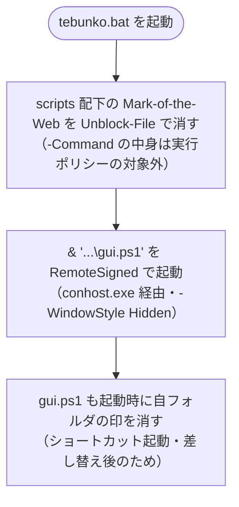
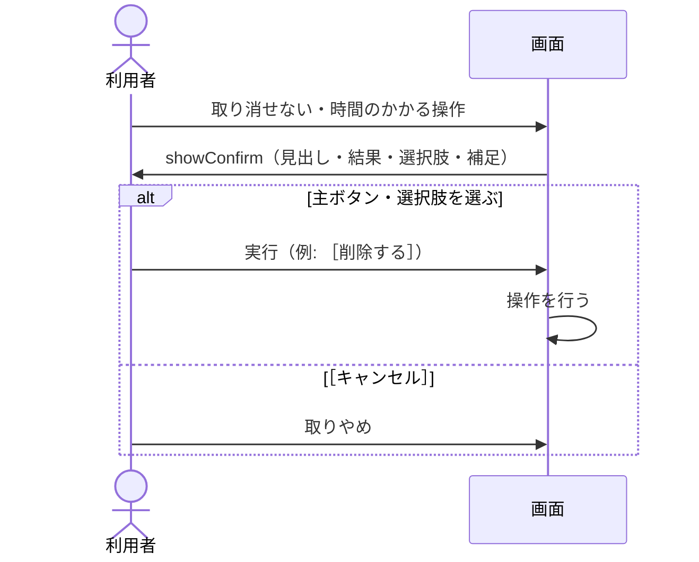

# 画面の共通の決まり

扱うこと: キーボード操作・表示とアクセシビリティの決まり、配布と実行ポリシー（Mark-of-the-Web）、確認ダイアログの形式、複数のタブで共通のフォルダ選択ダイアログ。扱わないこと: 画面に出すメッセージそのものの一覧（[画面に出すメッセージの一覧](messages.md)）。先に読むページ: [画面](index.md)。

## キーボード操作

| キー | 動作 |
|---|---|
| Enter（検索ワード欄・対象ファイル欄） | 検索する |
| Esc | 検索中なら中止する（ウィンドウは閉じない） |
| Ctrl+F | 検索ワード欄にフォーカスを移し、全選択する（［2 検索］タブに切り替える） |
| Ctrl+Shift+F | 絞り込み欄にフォーカスを移す |
| Enter（結果の表） | 元のファイルの該当箇所を開く（ファイルの見出しの行では、そのファイルの行を開く・閉じる。[ファイルごとにまとめた表示](preview.md#ファイルごとにまとめた表示)） |
| Ctrl+C（結果の表） | 選択行をコピーする（[元のファイルを開く](open-file.md)。見出しの行を選んでいれば、そのファイルの行をすべて） |
| Ctrl+C（選択行のプレビュー） | 選んだセルの値をコピーする（[選択行のプレビュー](preview.md)） |
| F5 | ［9 プロセス停止］ではプロセスの一覧を、それ以外のタブではインデックスの状態と検索対象のツリーを読み直す |
| Ctrl+Tab / Ctrl+Shift+Tab | タブを切り替える |
| Delete | インデックス一覧で、選択中のインデックスを削除する（確認あり。[［1 インデックス管理］タブ](index-tab.md)の［削除］） |
| スペース | 検索対象のツリーで、選択中の項目のチェックを切り替える（[検索対象のツリー](search-tree.md)） |

インデックス作成と強制終了は影響が大きいため、ショートカットキーを設けない。フォルダ選択ダイアログ（[フォルダ選択ダイアログ（［参照…］）](common.md#フォルダ選択ダイアログ参照)）は Windows 標準のため、キー操作もエクスプローラーと同じになる。

## 表示・アクセシビリティ

- フォントは Yu Gothic UI（無ければ Meiryo UI）、13 px とする。結果の表は 12 px とする。
- WPF は高 DPI に自動で対応するため、表示倍率 125 %・150 % でもぼやけない。
- 状態は**色だけで表さない**。`✓` `✗` `⚠` `⏸` の記号と文言を併記する。一致箇所の強調は背景色に加えて太字にする。
- 文言は「Excel」ではなく「Office ファイル」とする（対象は Excel・Word・PowerPoint）。
- **タブの中身が UI オートメーション（スクリーンリーダー・画面のスモークテスト）に出るようにする。** `scripts/shared/xaml/theme.xaml` の `TabControl` のテンプレートで、選んだタブの中身を出す `ContentPresenter` に `x:Name="PART_SelectedContentHost"` を付けている。WPF の `TabItemAutomationPeer` がこの名前で中身を探すため、名前が無いとタブの中の部品（検索ワードの欄・一覧など）が UI オートメーションの木に出ず、ナレーターなどが読めない。テンプレートを書き直すときも、この名前を残す（[画面のスモークテスト](../testing/gui-smoke.md)が、タブの中の部品を操作できることで確かめる）
- 入力の誤りや注意は入力欄の下やステータスに表示する。ダイアログは確認が必要な操作（[［1 インデックス管理］タブ](index-tab.md)の［削除］、[インデックス作成の確認ダイアログ](indexing-run.md#インデックス作成の確認ダイアログ) のインデックス作成の確認、[中止・終了・ログ](indexing-run.md#中止終了ログ) のインデックス作成の中止、[元のファイルが見つからないとき（元のフォルダを設定する）](open-file.md#元のファイルが見つからないとき元のフォルダを設定する)、[終了の確認](process-tab.md#終了の確認)）に限り、その形式は [確認ダイアログ](#確認ダイアログshowconfirm) のとおりとする（[インデックス作成の確認ダイアログ](indexing-run.md#インデックス作成の確認ダイアログ) だけは、インデックスごとの件数を一覧で見せるため専用のダイアログにする）。なお、インデックスの［追加…］［編集…］は入力が必要なためダイアログにし、入力の誤りはダイアログ内に表示する（[追加・編集のダイアログ](index-tab.md#追加編集のダイアログ)）。確認も入力も要らない「tebunko について」（タブの右上の［⋯］メニュー）だけは例外で、版・コミット・ライセンスを見せるだけの小さなダイアログにする（メンテナの選択。[画面構成](index.md#画面構成)）。
- 危険な操作（［すべて終了］）のボタンは赤枠にし、主ボタン（青）と区別する。確認ダイアログの中で消す操作を選ぶボタン（［削除する］など）は、赤で塗りつぶして区別する（[確認ダイアログ](#確認ダイアログshowconfirm)）。
- **説明を読まないと何が起きるか分からない画面にしない**。確認は「実行するとこうなります」を並べて見せ（[確認ダイアログ](#確認ダイアログshowconfirm)）、ボタンの文言は「はい／いいえ」ではなく操作そのもの（［削除する］［中止する］）にする。画面の注意書きには、内部の言葉（`TSV`・`work\content_index`・`取り込み一覧`）や、その場で必要のない手順の説明を書かない。
- アイコンは `scripts/tebunko/tebunko.ico`（16〜256 px を収めたマルチサイズ）とし、タイトルバー・タスクバー・Alt+Tab に表示する。
  - XAML には書かず `tebunko/gui.ps1` の `loadWindow` で読み込む（`XamlReader.Load` は XAML 内の相対パスを解決できないため）。ファイルが無くても画面は開く。
  - タスクバー・タイトルバーのアイコンは `Window.Icon`（上記）で出る。画面は `powershell.exe` で動くため、タスクバーのボタンは PowerShell と同じグループにまとめられる（アイコン自体は tebunko のものが出る）。独立したボタンにするには P/Invoke（`SetCurrentProcessExplicitAppUserModelID`）が要り、実行時コンパイルを使わない方針に反するため行わない（[画面の実装](implementation.md#実行時コンパイルcscexeを使わない)）。
  - `tebunko.bat` 自体のアイコン（エクスプローラー上の表示）は Windows の仕様で変更できない。デスクトップ等にアイコン付きで置きたい利用者は、自分でショートカットを作る（ツールはショートカットを作らない）。

## 配布と実行ポリシー（Mark-of-the-Web）

起動は、zip 版は `tebunko.bat`、インストーラー版は起動口の `tebunko.exe`（`installer/tebunko.cs`）から行う。どちらも Windows の PowerShell 5.1 を、そのプロセスだけの実行ポリシー `RemoteSigned` で起動する。`Bypass` を使わない理由、実行ポリシーの設定を変えないこと、Mark-of-the-Web を解除する範囲は、安全性の [Mark-of-the-Web の解除](../../safety/disclosure.md#mark-of-the-web-の解除tebunkobat) にまとめている。ここには実装の決まりだけを書く。

- **なぜ Mark-of-the-Web（MOTW）が問題か**：zip をブラウザ・メールでダウンロードして展開すると、展開後の各ファイルに「外部由来」の印（`Zone.Identifier` という代替データストリーム）が付く。`RemoteSigned` は、この印の付いた未署名 `.ps1` の実行をブロックする（`.xaml`・`.ico` は実行ポリシーの対象外なので影響しない）。
- **対策**：`tebunko.bat` が起動する PowerShell の `-Command` の中で、まず自フォルダの `scripts` 配下の印を `Get-ChildItem -Recurse -File \| Unblock-File` で消し（`work` には数万件の TSV があり、起動のたびに全件へかけると TSV 1 万件あたり約 3 秒遅くなるため、実行するスクリプトのある `scripts` に限る）、続けて `& '...\gui.ps1'` で画面を開く。インラインの `-Command` の中身は実行ポリシーの対象外なので、印が付いていても `Unblock-File` は動く。`&` で呼ぶ `gui.ps1` は `RemoteSigned` で調べられるため、印を消す前に呼ぶとブロックされる（順番に意味がある）。以前は印を消すためだけに PowerShell を別に起動していたが、PowerShell の起動 1 回分（1〜2 秒）画面が出るのが遅れるため、1 つのプロセスにまとめた。念のため `tebunko/gui.ps1` も起動時に自フォルダの印を消す（利用者が自作したショートカットから起動したときや、あとでファイルを差し替えたときのため）。
- **初回のセキュリティ警告**：zip 由来だと `tebunko.bat` 自体にも印が付くため、初回のダブルクリックで Windows の「開いているファイル - セキュリティの警告」（発行元を確認できません）が 1 回出る。［実行］を押すと bat が動き、以降は印が消えるので警告は出ない。これは Windows の正規の確認であり、隠す対象ではない。
- **`Bypass` を使わない代わりの実測挙動**（この PC・`RemoteSigned` で確認）：印あり＝ブロック（「デジタル署名されていません。実行できません」）／`tebunko.bat` の `Unblock-File` で印を消す＝0 件／消した後は `RemoteSigned` で起動成功。
- **コンソールの窓を残さない**：`tebunko.bat` は `start "" conhost.exe powershell ... -WindowStyle Hidden -Command "..."` で起動する。Windows 11 で既定のターミナルが Windows Terminal のとき（「Windows に任せる」の場合も含む）、コンソールの窓は Windows Terminal に渡され、Windows Terminal は `-WindowStyle Hidden` を無視する。そのため `conhost.exe` を通さないと、画面を閉じるまで PowerShell の窓（Windows Terminal のタブ）が開いたままになる。`conhost.exe` を通すと従来のコンソールで動き、`-WindowStyle Hidden` で窓が隠れる（起動の瞬間に一度だけ窓が見えることがある）。インデクサは画面のプロセスの中のスレッドで動くため（[プロセスとスレッド](../structure/threads.md)）、別の窓は開かない。
- **インストーラー版**：`tebunko.exe` は `powershell.exe -NoProfile -STA -ExecutionPolicy RemoteSigned -File <gui.ps1>` を、窓を作らずに（`CreateNoWindow`）起動する。インストーラーで入れたファイルには Mark-of-the-Web が付かないため、`tebunko.bat` の `Unblock-File` にあたる処理は要らない（`gui.ps1` も起動時に同じ解除を行う）。
- **バッチの書式**：`tebunko.bat` は ASCII・CRLF で書く。cmd はコードページ（日本語環境は CP932）と改行に敏感で、UTF-8 の日本語コメントや LF 改行だと行が結合して起動の行がコメントに飲み込まれる不具合が出るため。説明コメントは英語にし、日本語の説明はこのページに置く。
- **起動の失敗の知らせ方**：`gui.ps1` の画面が出る前に起動が失敗したとき（制限言語モード・実行ポリシー・ファイル不足など）、`tebunko.bat` は `& $gui` を `try`/`catch` で包んで理由を分け、Notepad で示す（WPF・WinForms のメッセージボックスが出せない場面があるため）。詳しくは安全性の[起動に失敗したときの知らせ](../../safety/disclosure.md#起動に失敗したときの知らせtebunkobat)を参照。

## 確認ダイアログ（`showConfirm`）

取り消せない操作・時間のかかる操作の確認は、`MessageBox` ではなく `scripts/shared/xaml/dialog_confirm.xaml` の自前のダイアログで行う（`showConfirm`）。**説明を読まなくても、押す前に何が起きるか分かる**ようにするため。

| 部分 | 役割 | 書き方 |
|---|---|---|
| 見出し | これから何をするか | 1 行で読み切れる長さの問いかけ（`インデックス「<名前>」を一覧から削除しますか？`） |
| 結果 | 実行すると何がどうなるか | `✗`（消える・失われる、赤）・`✓`（残る、緑）・`→`（続けて起きること、青）の行。各行は「何がどうなるか」の 1 行と、場所・件数などの補足の 1 行（補足は空なら出さない） |
| 選択肢 | 押せる操作 | ボタンの文言そのものが操作（［削除する］［作り直す］［中止する］）。2 つ以上あるときは縦に並べ、ボタンの中の 2 行目にその結果を書く |
| 補足 | 別のやり方の案内 | 読まなくても操作できる内容だけを書く（`しばらく検索しないだけなら、削除せずに［作成］のチェックを外してください。…`） |

- **ボタンの並べ方**: 選択肢が 1 つなら右下に［実行］＋［キャンセル］、2 つ以上なら本文に選択肢のボタンを縦に並べ、右下は［キャンセル］だけにする（キャンセルの文言は場面に合わせて変える。例：［閉じない］［インデックス作成を始めない］）。
- **既定のボタン**: 消す操作（`Danger`。ボタンを赤にする）・時間のかかる操作（`Careful`）・選択肢が 2 つ以上のときは、Enter で進まないよう［キャンセル］を既定にしてフォーカスを置く。そうでなければ主ボタンを既定にする。
- **文言の決まり**: 画面に出ない言葉（`TSV`・`work\content_index`・`取り込み一覧`）は書かない。利用者から見て何が消えて何が残るかだけを書く。「〜の場合は〜してください」という手順の説明は、結果ではなく補足に置く。
- **使っている場面**: インデックスの［削除］（[［1 インデックス管理］タブ](index-tab.md)）、インデックス作成の中止・インデックス作成中に閉じる（[中止・終了・ログ](indexing-run.md#中止終了ログ)）、元のファイルが見つからないとき（[元のファイルが見つからないとき（元のフォルダを設定する）](open-file.md#元のファイルが見つからないとき元のフォルダを設定する)）、プロセスの終了（[終了の確認](process-tab.md#終了の確認)）。インデックス作成の確認（[インデックス作成の確認ダイアログ](indexing-run.md#インデックス作成の確認ダイアログ)）は、インデックスごとの件数を一覧で見せるため専用のダイアログにする。
- 伝えるだけのダイアログ（エラー・警告・`OK` だけのもの）は、これまでどおり `showMessage`（`MessageBox`）で出す。

## フォルダ選択ダイアログ（［参照…］）

**Windows 標準のエクスプローラー形式のダイアログ**（COM の `IFileOpenDialog` を、フォルダを選ぶ設定 `FOS_PICKFOLDERS` で開いたもの）を使う（`shared/ui/folder_dialog.ps1` の `selectFolder`）。利用者が見慣れた画面のため、クイックアクセス・OneDrive・ネットワーク・検索・［新しいフォルダー］がそのまま使える。

［参照…］（[追加・編集のダイアログ](index-tab.md#追加編集のダイアログ)）、元のファイルのフォルダを選んでもらう場面（[元のファイルが見つからないとき（元のフォルダを設定する）](open-file.md#元のファイルが見つからないとき元のフォルダを設定する)）、ワークスペースの［変更…］（[［8 設定］タブ](settings-tab.md)）で共通に使う。

| 項目 | 仕様 |
|---|---|
| タイトル | 呼び出し元が渡す文言。追加・編集は `インデックスにする、Office ファイルのあるフォルダを選んでください` |
| 最初に開くフォルダ | 呼び出し元が渡したフォルダ（［参照…］は今の入力値）。**ネットワークのパスは、画面のスレッドで有無を調べない。** ローカルなら、無ければその上の、今もあるフォルダ（`getExistingAncestorFolder`）。ネットワークのパスは、直前の「フォルダの状態」の確認で「ある」と分かったフォルダ（編集中のインデックスの元のフォルダで、場所を書き換えていないとき）だけを、調べずにそのまま使う（`selectFolder` の `knownExisting`）。それ以外はどこにも無いのと同じ扱いにする。どこにも無ければ Windows に任せる（前回開いた場所） |
| 親ウィンドウ | 呼び出し元のウィンドウ（［参照…］は追加・編集のダイアログ、それ以外は主画面）。閉じるまで親は操作できない |
| 一覧 | フォルダだけが出る（フォルダを選ぶ設定では、Windows がファイルを出さない） |
| 選んだとき | 選んだフォルダのパスを `normalizeFolderPath` で整えて返す |
| ［キャンセル］ | 何も返さない |

**呼び出し方**：`IFileOpenDialog` を PowerShell から直接呼ぶにはインターフェースの定義が要り、自分で定義すると実行時コンパイル（`csc.exe`）が要る（[実行時コンパイル（csc.exe）を使わない](implementation.md#実行時コンパイルcscexeを使わない)）。そのため、WinForms（`gui.ps1` で読み込み済み）が内部に持つ定義 `FileDialogNative+IFileDialog` をリフレクションで呼ぶ。`csc.exe` の起動・一時 DLL の生成・`Add-Type` の追加は無い（[危険とされる処理の検査結果](../../safety/checks.md#検査項目と結果)）。

- 内部の型が見つからない・呼べないとき（.NET の変更など）は、エラーのログに記録し、同じエクスプローラー形式の「ファイルを開く」ダイアログ（`OpenFileDialog`。公開の API だけで開ける）で、選びたいフォルダの中に入って［開く］を押してもらう。ツリー形式の `FolderBrowserDialog` は、中身が見えず目的のフォルダにたどり着きにくいため使わない。
- 以前はフォルダの中身（Office ファイル）も見える自作のダイアログを使っていたが、見慣れた画面で操作できることを優先して Windows 標準にした。
