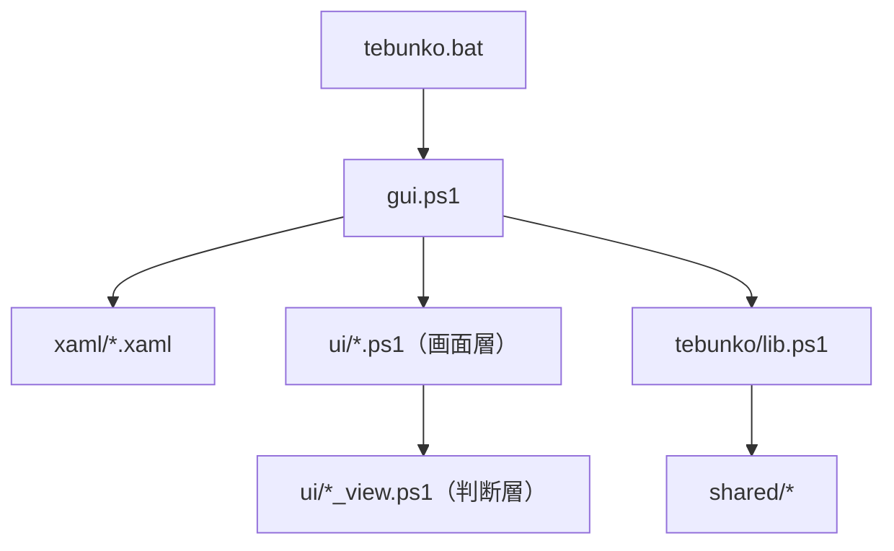

# 画面の実装構成

扱うこと: 画面のファイル構成（XAML・スクリプト・型）、実行時コンパイル（csc.exe）を使わない設計、今後の検討・決めたこと・既知の制約。扱わないこと: 画面を固まらせない待たせ方そのもの（[画面を固まらせない待たせ方](responsiveness.md)）。先に読むページ: [画面](index.md)。

## 実装構成

| ファイル | 内容 |
|---|---|
| `tebunko.bat` | 起動用バッチ。PowerShell は PATH からではなく `%SystemRoot%\System32\WindowsPowerShell\v1.0\powershell.exe` を指す（無ければ Notepad で理由を示して終わる）。`conhost.exe` を通して `-NoProfile -STA -ExecutionPolicy RemoteSigned -WindowStyle Hidden -Command "..."` を `start` で起動する。`-Command` の中で `scripts` 配下の Mark-of-the-Web を消してから、`try`/`catch` で包んだ `& 'scripts\tebunko\gui.ps1'` で画面を開く（PowerShell の起動は 1 回。`conhost.exe` を通すのは、既定のターミナルが Windows Terminal でも窓を隠すため）。画面が開く前に失敗したときは、`scripts\tebunko\startup\*.txt` の文言を Notepad で示し、記録を残す。ASCII・CRLF で書き、説明コメントは英語にする（cmd はコードページ・改行に敏感なため）。詳細は [画面の共通仕様](common.md#配布と実行ポリシーmark-of-the-web)・安全性の[起動に失敗したときの知らせ](../../safety/disclosure.md#起動に失敗したときの知らせtebunkobat) |
| `scripts/tebunko/gui.ps1` | 画面の起動口。起動中の表示（`splash.xaml`。スクリプトを読み込む前に出し、区切りごとに `stepSplash` で描画を進め、画面の `ContentRendered` で閉じる）、Mark-of-the-Web の除去、多重起動の防止（[画面を固まらせない待たせ方](responsiveness.md)）、ウィンドウとタブの読み込みと `x:Name` の対応表（`$ui`）の作成、各部品の読み込み（**順に意味がある**）、ウィンドウ全体のイベント、`ShowDialog`、描き終わってからの一覧の読み込み（`loadStartupData`。済むまで `Activated`・タブの切り替えでは読み直さない）。画面を開いている間使うスレッド（検索の司令 `SearchService`・画面の裏の仕事 `BackgroundQueue`）の用意と、閉じるときの順番（インデックス作成を止めてから閉じる。[閉じる](state-flow.md#閉じる)）。起動時に `GCSettings.LatencyMode` を `SustainedLowLatency` にする。判定・検索ロジックは持たない |
| `scripts/tebunko/xaml/tebunko.xaml` | 画面の枠（ウィンドウ）。左の欄（`NavHost`。幅を変えられる）・中身（`ContentHost`）・下端のステータスバー（`StatusBarHost`）の 3 つの口だけを持つ。口に入れる中身は別ファイルにし、`ui/gui_main.ps1` が読み込んで入れる |
| `scripts/tebunko/xaml/shell/nav.xaml` `shell/status_bar.xaml` | 窓の枠の部品。`nav.xaml` は左の欄（画面の一覧の `NavList`・注意の印 `IndexTabBadge`・下の［tebunko について］`AboutLink`）、`status_bar.xaml` は下端のステータスバー（`StatusText`）。`xaml/` の下のフォルダの XAML も、単一 .ps1 の作成（`tools/new_single_script.ps1`）が埋め込む |
| `scripts/tebunko/xaml/splash.xaml` | 起動中の表示（[ウィンドウ](index.md#ウィンドウ)）。早く出すため `theme.xaml` を読み込まず、色は `theme.xaml` と同じ値を直接書く |
| `scripts/tebunko/xaml/settings/settings.xaml` | 各画面の中身（設定の画面は領域のフォルダ `settings\` に置く）。イベントは書かず、`x:Name` だけを付ける。ルート要素には `StaticResource` を使う属性を置かない（自分の `Resources` より先に解決されるため）。`x:Name` が `gui.ps1` の一覧と食い違っていないことは `tests/meta/structure.Tests.ps1` で確かめる |
| `scripts/tebunko/xaml/search/search.xaml` `search_bar.xaml` `target_tree.xaml` `result_list.xaml` `preview.xaml` | ［2 検索］の領域ごとの XAML。`search.xaml` は枠（検索バー・結果の一覧・プレビューを入れる場所）、`target_tree.xaml` は左の欄の下（検索対象のツリー）に入る。ルート要素の決まりと `x:Name` の確かめは、上の各画面の中身と同じ |
| `scripts/tebunko/xaml/index/index.xaml` `index_list.xaml` `index_detail.xaml` | ［1 インデックス管理］の領域ごとの XAML。`index.xaml` は枠（上に一覧、下に詳細を入れる場所と、間の境目）、`index_list.xaml` は一覧（見出し・［インポート…］［追加…］［インデックス作成を開始］・表。行の［⋯］から開くメニュー `IndexRowMenu` に［編集…］［エクスポート…］［削除］）、`index_detail.xaml` は詳細（状態の合計・取り込みの進み具合・取り込みに失敗したファイル）。ルート要素の決まりと `x:Name` の確かめは検索の領域と同じ |
| `scripts/tebunko/xaml/dialog_export.xaml` `dialog_import.xaml` | インデックスのエクスポート・インポートのダイアログ（[エクスポート・インポート](index-tab.md#エクスポートインポート)）。`ui/index/index_archive.ps1` が開く |
| `scripts/tebunko/xaml/dialog_index_edit.xaml` | インデックスの追加・編集のダイアログ（[追加・編集のダイアログ](index-tab.md#追加編集のダイアログ)）。追加と編集で同じ定義を使い、表題・説明・注意書きを `ui/index/index_edit.ps1` で変える |
| `scripts/tebunko/xaml/dialog_indexing_confirm.xaml` | インデックス作成の確認ダイアログ（[インデックス作成の確認ダイアログ](indexing-run.md#インデックス更新の確認ダイアログ)）。インデックスごとの取り込み対象の件数（受け渡しの口の `Plan`）を一覧にする。`ui/indexing_tab.ps1` が開く |
| `scripts/tebunko/xaml/dialog_about.xaml` | 「tebunko について」ダイアログ（左の欄の下の［tebunko について］。[画面構成](index.md#画面構成)）。アプリのアイコン・版・コミット・ライセンスを表示するだけで、入力も確認も無い。`ui/about_dialog.ps1` が開く |
| `scripts/shared/xaml/dialog_confirm.xaml` | 確認ダイアログ（[確認ダイアログ](common.md#確認ダイアログshowconfirm)）。見出し・結果の一覧（`ItemsControl` に `ConfirmFact` をバインド）・補足だけを定義し、ボタンは場面ごとに違うため `shared/ui/shell.ps1` の `showConfirm` が組み立てて `ButtonPanel` / `ChoicePanel` に入れる |
| `scripts/shared/xaml/theme.xaml` | 画面の見た目（色・文字・コントロールの形）の共通定義 |
| `scripts/shared/ui/types.ps1` `scripts/tebunko/ui/types.ps1` | 画面で使う型（PowerShell class。[実行時コンパイル（csc.exe）を使わない](#実行時コンパイルcscexeを使わない)）。継承元（`NotifyBase`）と共通の型（`ConfirmFact`）は shared に置き、先に読み込む（型の解決は読み込む順に依存するため、`tests/meta/structure.Tests.ps1` で確かめる）。主な型は次のとおり。 ・`FileGroup`：結果の表の、元のファイル 1 つ分の見出し（[ファイルごとにまとめた表示](preview.md#ファイルごとにまとめた表示)）。ヒットは生のまま `Hits` に持ち、表の行は開いたとき・絞り込み・並べ替え・出力のときに作る ・`HitRow`：結果の 1 行。件数が多いので**生成時は生データのみ**を持ち、表示用（強調セグメント・DisplayLine・セル番地・一致したセルの数）と「場所」列の表記（`SetPlaceDisplay`。`prepareHitRow` が `describeHitPlace` で作る）は**画面に出た行だけ** `Prepare()` で作る（`ResultGrid` の `LoadingRow` から呼び、`INotifyPropertyChanged` で反映）。選択行のプレビュー（[選択行のプレビュー](preview.md)）の表は `BuildPreview`（`readPackContext` で読んだ行から `PreviewTable` を作る）で組み立てる ・`PreviewColumn`：列の幅。列見出しと各行のセルで共有し、見出しの `Thumb` のドラッグで `SetWidth` を呼ぶと列全体に反映する ・`IndexNode`：検索対象のツリー（[検索対象のツリー](search-tree.md)）。展開時のフォルダ読み込み・3 状態のチェック・検索範囲 `SearchTarget`／除外 `SearchExclude` の組み立てを持つ。チェックは OneWay バインドとし、クリック（`Toggle`）・展開（`LoadChildren`）はイベントで駆動する（PS class はプロパティのセッターにロジックを書けないため） |
| `scripts/shared/ui/app_host.ps1` | 画面の土台。XAML の読み込み（`loadXaml`。`ParserContext.BaseUri` にそのファイルの場所を渡し、`theme.xaml` への相対参照を解決する）、ウィンドウの読み込みとアイコン（`loadWindow`）、色の取得（`themeBrush`）、予期しないエラーの記録（`writeErrorLog`） |
| `scripts/shared/ui/shell.ps1` | 画面の共通部品。ステータス表示（`setStatus`）、メッセージ（`showMessage`）、確認ダイアログ（`showConfirm`。結果の行は `factGone` / `factKept` / `factNext` で `ConfirmFact` を作り、選択肢のボタンは `newChoiceContent` で 2 行のボタンにする。ボタンの `Click` と `ContentRendered` は `GetNewClosure()` で値を取り込んだスクリプトブロックにし、スクリプトスコープの変数に置かない）、例外を拾う `safe`、予期しないエラーを知らせる `reportUnexpectedError`（`safe` の catch と、画面のスレッドの `Dispatcher` で捕まえていない例外の両方から呼ぶ。後者からの呼び出しだけ、同じ例外（型・メッセージ・発生場所）の繰り返しを抑える）と、それを `Dispatcher.UnhandledException` に登録する `registerUnhandledErrorHandler`（`gui.ps1` が起動時に呼ぶ）、タイマー（`newTimer`）、画面の裏の仕事（`startJob`。`gui.ps1` が用意する `BackgroundQueue` に渡す。[画面を固まらせない待たせ方](responsiveness.md)） |
| `scripts/shared/ui/folder_dialog.ps1` | Windows 標準のフォルダ選択（`selectFolder`。[フォルダ選択ダイアログ（［参照…］）](common.md#フォルダ選択ダイアログ参照)）。WinForms 内部の `IFileDialog` をリフレクションで呼んで開き、開けなければ `OpenFileDialog` でフォルダの中に入って選んでもらう（[実行時コンパイル（csc.exe）を使わない](#実行時コンパイルcscexeを使わない)）。フォルダのドラッグ＆ドロップの判定（`getDroppedFolders`・`onFolderDragOver`）も置く |
| `scripts/tebunko/ui/index/index_list.ps1` `index_edit.ps1` `index_archive.ps1` `index_detail.ps1` `index_events.ps1` `indexing_tab.ps1` | ［1 インデックス管理］タブ（[［1 インデックス管理］タブ](index-tab.md)）。インデックスの一覧・追加・編集・削除と、インデックス作成の開始（`IndexingSession`）・中止・進み具合の表示。インデックス一覧のほかでの変更は、`getTargetsKey`（保存されている一覧を比べるための文字列）をウィンドウがアクティブになったときに比べて検出する（[画面での読み書き](../structure/settings-file.md#画面での読み書き)） |
| `scripts/tebunko/ui/search/search_bar.ps1` `search_session.ps1` `result_filter.ps1` `result_list.ps1` `preview.ps1` `open_source.ps1` `index_tree.ps1` | ［2 検索］タブ（[検索タブ](search-tab.md)）。検索バーとチップ（`search_bar.ps1`）、検索の実行（`search_session.ps1`）、結果の絞り込み（`result_filter.ps1`）、結果の表（ファイルごとの見出しと行・絞り込み・並べ替え。`result_list.ps1`）、選択行のプレビュー（`preview.ps1`）、元のファイルを開く処理（Excel COM。[元のファイルを開く](open-file.md)。`open_source.ps1`）、検索対象インデックスのツリー（`index_tree.ps1`） |
| `scripts/tebunko/ui/settings/settings.ps1` | 設定の画面（[［8 設定］タブ](settings-tab.md)）。ワークスペースを変えたら、その場で切り替える |
| `scripts/tebunko/ui/leftover_view.ps1` | 起動時の残った Office の確認の文言・出すタイミング・対象の選び方（判断層。[前回残った Office の確認](leftover-office.md)） |
| `scripts/tebunko/xaml/dialog_leftover.xaml` | 前回残った Office の確認ダイアログ（[前回残った Office の確認](leftover-office.md#確認ダイアログ)）。見出し・説明（✓）・［詳細を表示］の開け閉め・詳細の表（アプリ・PID・起動した時刻。5 行を超えたら縦にスクロール）・補足・2 つのボタン。`ui/leftover_dialog.ps1` が開く |
| `scripts/tebunko/ui/leftover_dialog.ps1` | 起動時の「前回残った Office」の確認の画面側（[前回残った Office の確認](leftover-office.md#画面の実装)）。記録の読み取りを裏の仕事で行い、出すかどうかは `getLeftoverPromptTiming` で決め、［終了する］のときだけ確認に出した PID を `stopOfficeProcesses` で終了して、結果をステータスに出す。ダイアログは `showOwnedDialog` で開く |
| `scripts/tebunko/ui/about_dialog.ps1` | 左の欄の下の［tebunko について］（`shell/nav.xaml` の `AboutLink`）と「tebunko について」ダイアログ（`dialog_about.xaml`）。`AboutLink` の `Click` でダイアログを開く。版・コミットの文字列（`about_view.ps1` の `getAboutView`）は `gui.ps1` が起動時に 1 回だけ組み立て、ダイアログを開くたびには読み直さない |
| `scripts/tebunko/ui/shell/nav.ps1` | 左の欄と画面の切り替え（画面層）。窓の中身は領域の表（`ui/gui_main.ps1` の `$regions`。File・Slot・Screen・Names）で読み込み、各領域の `x:Name` を `$ui` に集める。画面の中身（`Screen` の付いた領域）は起動のときに読み込んで `$script:screenContents` に持ち、`selectScreen`（画面の名前 → `ContentHost` に差す）が切り替える。ナビのクリック・Ctrl+Tab・ほかの画面からの切り替えは、すべて `selectScreen` を通す。起動時の読み込み（`loadStartupData`）が済むまでは、切り替えても読み直さない |
| `scripts/tebunko/ui/index_view.ps1` `indexing_view.ps1` `search\search_bar_view.ps1` `result_list_view.ps1` `open_source_view.ps1` `preview_view.ps1` `settings\settings_view.ps1` `about_view.ps1` `shell/nav_view.ps1` | 画面の**判断層**。「何を出すか」を決める部分を `$ui` に触らない関数として切り出したもの（入力は素の値、出力は素の値）。色は意味（`info` / `ok` / `warn` / `ng` / `gray`）で返し、実際の色はタブ側で対応表から引く。`shell/nav_view.ps1` は、ナビの画面の並び（`getScreenOrder`・`isScreenName`・`getNextScreen`）と、キー操作の判定（`getShortcutAction`。Ctrl+Tab・Ctrl+Shift+Tab・Ctrl+F・F5・Esc をどの操作にするか）を決める。`about_view.ps1` の `getAboutView` は、版の記録（`scripts/shared/core/version.ps1` の `readVersionFile`）から画面に出す版・コミットの文字列を決める。Pester でテストする（[画面のテストと確認](../testing/gui-tests.md#画面の単体テスト)） |
| `scripts/tebunko/lib.ps1` | 画面とインデックス作成（`tebunko/indexer.ps1`）で使う部品の読み込み口（下表の関数。実体は `core/`・`index/`・`indexer/`・`search/` と `shared/`）。検索の司令・画面の裏の仕事のスレッドも、始めたときに 1 回だけこれを読み込む |

`tebunko/lib.ps1` の関数のうち、画面が使うものは次のとおり（引数・戻り値・内容は [部品から関数一覧を引く](../reference/index.md) の関数一覧にある）：`isValidRegex`・`getIndexPackFiles`・`testIndexExists`・`getIndexSummary`・`newSearchRegex`・`searchPackIndex`・`toSearchResultLines`・`writeSearchResult`・`readPackContext`・`getSourceLocation`・`resolveSourcePath`・`findMovedSource`・`setIndexSourceFolder`・`getTargetFolders`・`writeTargetFolders`・`normalizeFolderPath`・`readSearchOption`・`writeSearchOption`・`readOpenMode`・`writeOpenMode`・`getSearchIndexes`・`newSearchService`・`newSearchRequest`・`newIndexingSession`・`newIndexerChannel`・`readIndexingProgress`・`requestIndexingStop`・`answerIndexingPlan`・`testIndexerRunning`・`readSearchExcludes`・`writeSearchExcludes`・`getIndexingState`・`getOfficeProcesses`・`stopOfficeProcesses`・`readVersionFile`。
### 実行時コンパイル（csc.exe）を使わない

資産管理・EDR は「`powershell.exe` が `csc.exe` を起動して `%TEMP%` の一時 DLL を読み込む」動き（実行時コンパイル。MITRE ATT&CK T1027.004）を、良性でも拾うことがある。tebunko はこれを一切出さない設計にする（`tests/meta/safety.Tests.ps1` の「実行時にコードをコンパイルしない」が確かめる。[危険とされる処理の検査結果](../../safety/checks.md#検査項目と結果)）。

- **画面で使う型は PowerShell class**（`HitRow`・`FileGroup`・`Segment`・`PreviewColumn`／`PreviewCell`／`PreviewRow`／`PreviewTable`・`ProcRow`・`FailRow`・`PlanRow`・`FolderItem`・`SearchTarget`・`SearchExclude`・`IndexNode`・`ConfirmFact`）。PS class はエンジンがメモリ内で用意し、`csc.exe`・一時 DLL を出さない。`INotifyPropertyChanged` は `NotifyBase` を継承して実装する。
- **検索・本文インデックスの読み取りは .NET を直接呼ぶ**（`searchPackFiles`／`readPackPlaces`／`readPackContext`。`StreamReader`＋`[regex]`）。
- **Win32 API（P/Invoke）と、インターフェース定義が要る COM を使わない**。代わりに次を使う。

  | 目的 | 使うもの | 使わないもの（実行時コンパイルが要る） |
  |---|---|---|
  | フォルダ選択 | Windows 標準のエクスプローラー形式のダイアログ（`IFileOpenDialog`）。インターフェースの定義は WinForms が内部に持つもの（`FileDialogNative+IFileDialog`）をリフレクションで使う（[フォルダ選択ダイアログ（［参照…］）](common.md#フォルダ選択ダイアログ参照)） | `IFileOpenDialog` のインターフェースを自分で定義すること |
  | ドライブの列挙・ネットワークドライブの割り当て先 | `System.IO.DriveInfo`・CIM（`Win32_LogicalDisk`） | `QueryDosDevice` |
  | 多重起動時の前面化 | `Window.Activate` | `SetForegroundWindow`／`AttachThreadInput` |
  | 完了の通知 | 進み具合とステータスの表示 | `FlashWindowEx` |
  | タスクバー・タイトルバーのアイコン | `Window.Icon` | `SetCurrentProcessExplicitAppUserModelID` |

- 結果、起動〜検索を通じて `Add-Type`（実行時コンパイル）は 0 回、`csc.exe` の起動・一時 DLL の生成も 0（実起動で確認）。読み込むのは Microsoft 署名済みの GAC アセンブリ（WPF・WinForms）だけ。
- 代償と対処：PS class はメソッド呼び出しが C# より遅い（実測: 検索コアは C# の約 2.6 倍だが 50 万行で約 0.6 秒。結果行 `HitRow` の一括生成は 1 万件で約 10 秒と遅いため、**可視行だけ作る遅延描画**（`HitRow.Prepare`＋`LoadingRow`。軽量生成は 1 万件で約 0.56 秒）で回避する）。PS class はプロパティのセッターにロジックを書けないため、列幅・チェック・選択は `Set*` メソッドやイベントで変える。`subst` ドライブは実体のパスに解決しない。タスクバーのボタンは PowerShell と同じグループにまとめられる（アイコン自体は tebunko のものが出る。[表示・アクセシビリティ](common.md#表示アクセシビリティ)）。

## 今後の検討

- Word・PowerPoint の該当ページ・スライドへの移動（今は Excel だけ該当セルを選んで開く。Word・PowerPoint の COM 操作を足す必要がある）

## 決めたこと

画面を作ったときに、選択肢から決めたこと。

| # | 事項 | 選択肢 | 決定 |
|---|---|---|---|
| U1 | 入口の名前 | `0_設定.bat` / `tebunko.bat` など | **`tebunko.bat`**。画面がすべての操作の入口で `.bat` もこれ 1 本だけのため、番号を付けず、ツールの名前にする |
| U2 | 正規表現の既定 | オン / オフ（文字どおり） | **オフ** |
| U3 | 検索結果の件数の上限 | 1,000 / 10,000 / 上限なし | **10,000 件** |
| U4 | インデックス作成中の検索 | 許可（注意を表示） / 禁止 | **許可**（注意を表示） |
| U5 | 複数ワードの一括検索 | 設ける / 設けない | **設けない** |
| U6 | 元のファイルを開くときの Excel | 起動中の Excel を使う / 常に新しく起動する / 既定のアプリで開くだけ | **起動中の Excel を使う**（無ければ起動）。該当セルを選択できる |
| U7 | ファイル出力の対象 | 絞り込み後の表示分 / 全件 | **絞り込み後の表示分** |

## 既知の制約

確度: ◎ = 動作確認済み、○ = コード上明らか、△ = 推定。

| # | 内容 | 確度 |
|---|---|---|
| 1 | 元のファイルのパスは、取り込み時に記録したクロール対象フォルダから組み立てる。取り込み後に元のフォルダを移動・名前変更した場合は、開くときにフォルダを選び直す必要がある（選んだフォルダは置き換えとして記録し、同じフォルダの下は次から聞かない。[元のファイルが見つからないとき（元のフォルダを設定する）](open-file.md#元のファイルが見つからないとき元のフォルダを設定する)） | ○ |
| 2 | 元のフォルダの記録（`source_folder.txt`）の無いインデックス（インデックス作成を 1 回実行すると作られる）を別の場所にコピーした場合は、元の場所が分からないため、開くときにフォルダを選ぶ必要がある | ○ |
| 3 | 窓を持たないかの判定は `MainWindowHandle` による。画面に表示中でも、すべてのウィンドウを閉じた直後などは窓が無いと判定される。ただし記録の無い Office は対象にならない（[止めてよいものの条件](leftover-office.md#止めてよいものの条件)） | △ |
| 4 | フォルダ選択は Windows 標準のダイアログのため、フォルダの中のファイル（Office ファイルがあるか）は一覧に出ない（[フォルダ選択ダイアログ（［参照…］）](common.md#フォルダ選択ダイアログ参照)）。WinForms の内部の型を使うため、Windows PowerShell 5.1（.NET Framework）が前提。内部の型が使えないときは、`OpenFileDialog` でフォルダの中に入って［開く］を押す形になる | ○ |
| 5 | 本文インデックスのファイルが非常に多い場合、件数を数え終わるまで状態表示が `確認中…` になる | △ |

