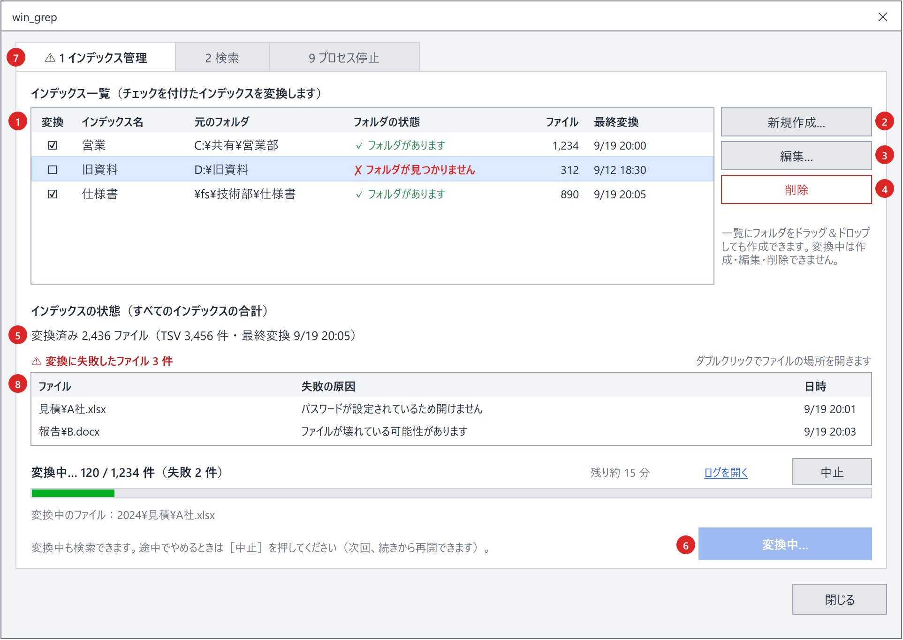

# ［1 インデックス管理］タブ

インデックスを **追加・一覧・編集・削除** し、インデックス作成（クロールして Office ファイルの文字を TSV に取り込む）を実行するタブ。
図は「前回取り込みに失敗したファイルがあり、インデックス作成を実行中」の状態。

| No. | 部品 | 仕様 |
|---|---|---|
| 1 | インデックス一覧 | 見出しは `インデックス一覧`、その右に `チェックを付けたインデックスを取り込みます`。1 行 1 インデックス（1 フォルダ）。列は「作成」（チェック）・「インデックス名」・「元のフォルダ」・「フォルダの状態」・「ファイル」・「最終取り込み」（[一覧の列](#一覧の列)）。**チェックを付けたインデックスだけを取り込む**（チェックを外したインデックスは、一覧にも `work\index` にも残したまま取り込まない）。一覧が空なら `インデックスがありません。［追加…］で、Office ファイルのあるフォルダを指定してください。`。並びは `targetFolders` の順で、検索対象のツリー（[検索対象のツリー（No.13）](search-tab.md#検索対象のツリーno13)）もこの順に並ぶ |
| 2 | ［追加…］ | 追加のダイアログ（[追加・編集のダイアログ](#追加編集のダイアログ)）を開き、決めた内容でインデックスを 1 件追加する。一覧へのフォルダのドラッグ＆ドロップでも追加できる（このときインデックス名はフォルダ名から自動で決める）。追加するだけでインデックス作成はせず、ステータスに `インデックス [<名前>] を追加しました。［インデックス作成を開始］を押すと中身を取り込みます` と表示する（フォルダが見つからない場合は `インデックス [<名前>] を追加しましたが、フォルダが見つかりません：<パス>`）。同じフォルダ（書き方の違い・大文字小文字を含む）のインデックスは二重に追加しない |
| 3 | ［編集…］ | 選択中のインデックスの**名前**と**元のフォルダの場所**を変える（[追加・編集のダイアログ](#追加編集のダイアログ)。行のダブルクリックでも開く）。変えても**インデックスは作り直さない**。変更したらステータスに `インデックスを変更しました（名前 [<旧>] → [<新>] / 場所 <旧> → <新>）` と表示する |
| 4 | ［削除］ | 選択中のインデックスを削除する（Delete キーでも同じ）。確認ダイアログ（[確認ダイアログ](common.md#確認ダイアログshowconfirm)）で確認する。見出しは `インデックス「<名前>」を一覧から削除しますか？`、結果は `✗ tebunko が作ったインデックスが消えます`（`このフォルダは検索できなくなります（もう一度［インデックス作成を開始］すれば作り直せます）`）／ `✓ 元のフォルダと、その中のファイルはそのままです`（`<パス>`）、補足は `しばらく検索しないだけなら、削除せずに［作成］のチェックを外してください。インデックスは残ったままです。`、ボタンは赤い［削除する］（既定は［キャンセル］）。［削除する］で一覧からすぐ消し、`work\index\<名前>` と取り込み一覧の記録の削除（`removeIndex`）は**別スレッド**で行う（数万フォルダでは数十秒かかることがあり、画面のスレッドで行うと「応答なし」になるため）。削除の間はステータスに `インデックス [<名前>] を削除しています…（件数によっては少し時間がかかります）` と出し、インデックスの操作・インデックス作成の開始はできないようにする。終わったらステータスに `インデックス [<名前>] を削除しました` と表示する |
| 5 | インデックスの状態 | すべてのインデックスの合計。`取り込み済み N ファイル（集約ファイル M 件 ・ 最終取り込み M/d H:mm）`。インデックスが無いときは `まだインデックスがありません。`。中断があれば次の行に表示する（[インデックスとインデックス作成の状態](state-flow.md#インデックスとインデックス作成の状態)）。失敗は No.8 の一覧に表示する |
| 6 | 注意書き・実行ボタン | 注意書きは、押す前は「押すと何が起きるか」（`押すと、何件取り込むかを確認してから、新しいファイル・変わったファイルだけを取り込みます。`）、インデックス作成中は「やめるとどうなるか」（`インデックス作成中も検索できます。やめるときは［中止］を押してください（次に［インデックス作成を開始］を押すと続きから再開します）。`）を書く。ボタンは状態に応じて表示を変える（[実行ボタンの表示](#実行ボタンの表示)）。押すと `tebunko/indexer.ps1` を画面のプロセスの中のスレッドで実行し、**取り込み対象を数え終えたところで確認のダイアログを出す**（[インデックス作成の確認ダイアログ](#インデックス作成の確認ダイアログ)）。ダイアログで［インデックス作成を開始］を押すとインデックス作成が始まり、進み具合を表示する（[インデックス作成の進み具合](#インデックス作成の進み具合)） |
| 7 | タブ見出し | 取り込みに失敗したファイルが残っているとき `⚠` を付ける |
| 8 | 取り込みに失敗したファイル | 取り込み一覧に状態が `失敗` の行があるときだけ表示する。見出しは `⚠ 取り込みに失敗したファイル N 件`。列は「ファイル」（相対パス）・「失敗の原因」（取り込み一覧のエラー列。[失敗の原因](../indexer/office-apps.md#失敗の原因describeingesterror)）・「日時」。取り込み日時の新しい順に並べ、高さを超えたらスクロールする。行をダブルクリックすると、元のファイルをエクスプローラーで選択した状態で開く（ファイルが無ければフォルダを開き、ステータスに表示する）。インデックス作成中も、失敗が増えるたびに更新する。インデックス作成が終わったとき失敗があれば、進み具合の下に `失敗したファイルと原因は「取り込みに失敗したファイル」の一覧で確認できます。` と表示する |

- インデックスの追加・編集・削除・チェックの変更は、その場で `setting.config`（`targetFolders`）に保存する（`writeTargetFolders`。チェックなしは `enabled` が `false`）。保存の操作は無い。
- **インデックス作成中は追加・編集・削除をしない**。［追加…］［編集…］［削除］は無効にし、操作しようとした場合は `インデックス作成中はインデックスを<追加／編集／削除>できません。インデックス作成が終わるまでお待ちください（［中止］で止められます）。` と出す。インデクサがインデックスのフォルダと取り込み一覧を使っているため。
- ［編集…］［削除］は、一覧で 1 件選んでいるときだけ有効にする。
- **インデックスを一から作り直すボタンは置かない**。取り込み対象は毎回［インデックス作成を開始］の確認（[インデックス作成の確認ダイアログ](#インデックス作成の確認ダイアログ)）で分かるため、ふだんは作り直す必要がない。更新日時が変わらないまま中身が変わった場合など、どうしても作り直したいときは［削除］してから追加し直す。

**インデックス名と場所は分けて持つ**（`targetFolders` の `name` と `path`）。`name` が `work\index` 直下のフォルダ名になり、インデックスの同一性を表す。`path` を書き換えても `name` は変わらないため、フォルダを移してもインデックスを作り直さない（[クロール対象フォルダとインデックス名](../indexer/flow.md#クロール対象フォルダとインデックス名)）。
画面では**追加した時点で名前を決めて保存する**（追加のダイアログの既定値は `newIndexName`）。名前の無い設定（設定ファイルを直接書き換えた場合など）を読み込んだときは、`assignIndexNames` で名前を割り当てて保存してから一覧に出す。

## 一覧の列

| 列 | 幅 | 内容 |
|---|---|---|
| 作成 | 52 | チェックボックス。**チェックを付けたインデックスだけを取り込む**。切り替えたその場で `setting.config` に保存する。ツールチップは `チェックを付けたインデックスだけを取り込みます（外してもインデックスは残ります）` |
| インデックス名 | 150 | `work\index` 直下のフォルダ名（`targetFolders[].name`）。検索対象のツリー・検索結果の表示にも使う |
| 元のフォルダ | 残り | Office ファイルのあるフォルダ（`targetFolders[].path`）。入りきらなければ `…` で省略し、ツールチップに全体を出す |
| フォルダの状態 | 140 | `✓ フォルダがあります`（緑）/ `✗ フォルダが見つかりません`（赤）/ 調べている間は `… フォルダを確認しています`（灰）。起動時とウィンドウがアクティブになるたびに、別スレッドで調べ直す（届かないネットワークのフォルダでは確認に十数秒かかり、画面のスレッドで調べると「応答なし」になるため） |
| ファイル | 76 | 取り込み一覧に記録されているこのインデックスのファイル数（`getIndexStats`。3 桁区切り）。まだ取り込んでいなければ `－`（ツールチップは `まだ取り込んでいません`）。ツールチップは `済 N 件 ・ 未取り込み M 件 ・ 失敗 K 件` |
| 最終取り込み | 100 | このインデックスの最も新しい取り込み日時（当日は `H:mm`、それ以外は `M/d H:mm`）。まだ取り込んでいなければ空 |

「ファイル」「最終取り込み」は取り込み一覧（`work/取り込み一覧.tsv`）の集計で、状態を読み直すたび（起動時・ウィンドウがアクティブになったとき・インデックス作成中は 1 秒ごと）に更新する。

## 追加・編集のダイアログ

`tebunko/xaml/dialog_index_edit.xaml`。追加と編集で同じダイアログを使い、表題と説明を変える。

| 部品 | 仕様 |
|---|---|
| 表題・説明 | 追加は `インデックスの追加` と `Office ファイル（Excel・Word・PowerPoint）の入っているフォルダを 1 つ選んでください。ここでは一覧に加えるだけです。中のファイルを読むのは［インデックス作成を開始］を押してからです。`。編集は `インデックスの編集` と `名前と、元のフォルダの場所を変えられます。` |
| 元のフォルダ | パスの入力・貼り付け・フォルダのドラッグ＆ドロップで指定する。前後の空白・`"`・末尾の `\` は取り除く（`normalizeFolderPath`。エクスプローラーの「パスのコピー」をそのまま貼れる）。［参照…］は Windows 標準のフォルダ選択ダイアログ（[フォルダ選択ダイアログ（［参照…］）](#フォルダ選択ダイアログ参照)。初期位置は今の入力値） |
| インデックス名 | 画面では `インデックス名` とだけ書き、`work\index` 直下のフォルダ名になることは書かない（利用者が決めるのは検索対象の一覧と検索結果に出る名前のため）。入力欄の下は `検索対象の一覧と検索結果に、この名前が出ます。\ / : * ? " < > | は使えません。`。**追加では、フォルダを指定すると `newIndexName` の名前を自動で入れる**（利用者が名前を変えた後は上書きしない）。編集では今の名前を初期値にする |
| 注意書き（編集のみ） | `変えるのは名前と場所だけです。インデックスはそのまま使います（作り直しません）。フォルダを別のドライブや共有フォルダへ移したときは、ここで新しい場所を指定してください。` |
| ［OK］ | 入力を調べ、問題があればダイアログ内に赤字で出して閉じない（下表）。問題がなければ確定する |

［OK］で調べる内容（`checkIndexEditInput` / `testIndexName`）:

| 条件 | メッセージ |
|---|---|
| フォルダが空 | `元のフォルダを指定してください。` |
| ほかのインデックスと同じフォルダ | `「<パス>」のインデックス [<名前>] が既にあります。` |
| ほかのインデックスのフォルダの中（`testFolderUnder`） | `「<パス>」は、インデックス [<名前>]（<そのパス>）の中のフォルダです。同じファイルが二重に取り込まれるため、登録できません。検索する範囲を絞るときは［2 検索］の検索対象で外してください。` |
| 中にほかのインデックスのフォルダがある | `「<パス>」の中には、インデックス [<名前>]（<そのパス>）があります。同じファイルが二重に取り込まれるため、登録できません。まとめるときは、先に [<名前>] を削除してください。` |
| 名前が空 | `インデックス名を入力してください。` |
| 名前の前後に空白 | `インデックス名の前後に空白は使えません。` |
| 名前が 255 文字超 | `インデックス名が長すぎます（255 文字まで）。` |
| 名前にファイル名で使えない文字 | `インデックス名に使えない文字が含まれています（\ / : * ? " < > \| と制御文字）。` |
| 名前の末尾が `.` | `インデックス名の最後に . は使えません。` |
| 名前が Windows の予約語（`CON` `PRN` `AUX` `NUL` `COM1`〜`COM9` `LPT1`〜`LPT9`） | `「<名前>」は Windows で使えない名前です。` |
| ほかのインデックスと同じ名前（大文字・小文字を区別しない） | `「<名前>」は、ほかのインデックスが使っています。別の名前を付けてください。` |

フォルダが見つからない場合も追加・変更できる（一覧の「フォルダの状態」に `✗ フォルダが見つかりません` と出す）。ネットワークドライブが一時的に切れている場合に登録できなくなるのを避けるため。

### 名前を変えたときの処理（`renameIndex`）

名前を変えても**インデックスは作り直さない**。次の順に、名前だけを付け替える。

1. `work\index\<旧名>` を `work\index\<新名>` に改名する（長いパスの集約ファイル・TSV があっても扱えるよう `\\?\` 付きで操作する）。移動先が既にあれば例外にして何もしない。大文字・小文字だけを変える場合は一時名を経由する
2. 取り込み一覧（`work/取り込み一覧.tsv`）の `クロール対象フォルダ` の行のインデックス名と、各行の相対パスの先頭（`<旧名>\…` → `<新名>\…`）を書き換える（`renameStatusIndexName`。行の順序と内容はそのまま保ち、一時ファイルに書いてから置き換える）
3. `setting.config` の `targetFolders[].name` を保存し、各インデックスの `元のフォルダ.txt` を書き直す（`updateIndexSourceFile`）

### 削除したときの処理（`removeIndex`）

1. `work\index\<名前>` を中身ごと削除する（`\\?\` 付き）
2. 取り込み一覧から、そのインデックスの `クロール対象フォルダ` の行と各ファイルの行を取り除く（`removeStatusIndexName`）
3. `setting.config` から外して保存し、`元のフォルダ.txt` を書き直す

インデクサの `removeDroppedFolders`（[クロール対象フォルダとインデックス名](../indexer/flow.md#クロール対象フォルダとインデックス名)）は、画面を通さずに設定を書き換えた場合の後始末として残す。画面から削除した場合は、その場で消えているため何もしない。

## フォルダ選択ダイアログ（［参照…］）

**Windows 標準のエクスプローラー形式のダイアログ**（COM の `IFileOpenDialog` を、フォルダを選ぶ設定 `FOS_PICKFOLDERS` で開いたもの）を使う（`shared/ui/folder_dialog.ps1` の `selectFolder`）。利用者が見慣れた画面のため、クイックアクセス・OneDrive・ネットワーク・検索・［新しいフォルダー］がそのまま使える。

［参照…］（[追加・編集のダイアログ](#追加編集のダイアログ)）、元のファイルのフォルダを選んでもらう場面（[元のファイルが見つからないとき（元のフォルダを設定する）](search-tab.md#元のファイルが見つからないとき元のフォルダを設定する)）、ワークスペースの［変更…］（[［8 設定］タブ](settings-tab.md)）で共通に使う。

| 項目 | 仕様 |
|---|---|
| タイトル | 呼び出し元が渡す文言。追加・編集は `インデックスにする、Office ファイルのあるフォルダを選んでください` |
| 最初に開くフォルダ | 呼び出し元が渡したフォルダ（［参照…］は今の入力値）。無ければその上の、今もあるフォルダ（`getExistingAncestorFolder`）。どこにも無ければ Windows に任せる（前回開いた場所） |
| 親ウィンドウ | 呼び出し元のウィンドウ（［参照…］は追加・編集のダイアログ、それ以外は主画面）。閉じるまで親は操作できない |
| 一覧 | フォルダだけが出る（フォルダを選ぶ設定では、Windows がファイルを出さない） |
| 選んだとき | 選んだフォルダのパスを `normalizeFolderPath` で整えて返す |
| ［キャンセル］ | 何も返さない |

**呼び出し方**：`IFileOpenDialog` を PowerShell から直接呼ぶにはインターフェースの定義が要り、自分で定義すると実行時コンパイル（`csc.exe`）が要る（[実行時コンパイル（csc.exe）を使わない](implementation.md#実行時コンパイルcscexeを使わない)）。そのため、WinForms（`gui.ps1` で読み込み済み）が内部に持つ定義 `FileDialogNative+IFileDialog` をリフレクションで呼ぶ。`csc.exe` の起動・一時 DLL の生成・`Add-Type` の追加は無い（[危険とされる処理の検査結果](../../safety/checks.md#検査項目と結果)）。

- 内部の型が見つからない・呼べないとき（.NET の変更など）は、エラーのログに記録し、同じエクスプローラー形式の「ファイルを開く」ダイアログ（`OpenFileDialog`。公開の API だけで開ける）で、選びたいフォルダの中に入って［開く］を押してもらう。ツリー形式の `FolderBrowserDialog` は、中身が見えず目的のフォルダにたどり着きにくいため使わない。
- 以前はフォルダの中身（Office ファイル）も見える自作のダイアログを使っていたが、見慣れた画面で操作できることを優先して Windows 標準にした。

## 実行ボタンの表示

| 状態（[インデックスとインデックス作成の状態](state-flow.md#インデックスとインデックス作成の状態)） | ボタン |
|---|---|
| 未作成・通常 | ［インデックス作成を開始］ |
| 中断中 | ［続きから再開（残り N 件）］ |
| 失敗あり | ［インデックス作成を開始］（中断中なら［続きから再開（残り N 件）］）。注意書きの前に `前回うまく取り込めなかったファイルがあります（押したあとで、もう一度ためすか選べます）。` を付ける。失敗分も再取り込みするかは、取り込み対象を数えた後の確認のダイアログ（[インデックス作成の確認ダイアログ](#インデックス作成の確認ダイアログ)）のチェックボックスで選ぶ |
| インデックス作成中 | 無効。表示は `インデックス作成中…`。進み具合と［中止］を表示する（[インデックス作成の進み具合](#インデックス作成の進み具合)）。［追加…］［編集…］［削除］も無効にする |
| チェックを付けた、存在するフォルダが無い | 無効。注意書きを `まずインデックスを追加して、［作成］にチェックを付けてください。` にする |

- インデックス作成は、画面のプロセスの中のスレッドで実行する（`newIndexingSession`。インデクサの司令のスレッドが `scripts\tebunko\indexer.ps1 -Channel <受け渡しの口>` を実行する）。受け渡しの口（`newIndexerChannel -confirmTargets $true`）の `ConfirmTargets` で、取り込み対象を数えたところでいったん止まって画面の確認（[インデックス作成の確認ダイアログ](#インデックス作成の確認ダイアログ)）を待つ。別の `powershell.exe` は起動しない（[プロセスとスレッド](../architecture/threads.md)）。
- 「インデックス作成中」は、この画面で始めたインデックス作成のスレッドが終わるまでとする（`isIndexing`）。インデックス作成の二重起動を防ぐ。
  - 画面を使わずに起動した `indexer.ps1` と重なった場合は、インデクサがミューテックスで止め、`ほかのインデックス作成が実行中です。…` のエラーで終わる（[中止・終了・ログ](#中止終了ログ)）。

## インデックス作成の確認ダイアログ

`tebunko/xaml/dialog_indexing_confirm.xaml`。［インデックス作成を開始］を押すと、インデクサはまず**取り込み対象を数えるだけ**行って止まり（受け渡しの口の `ConfirmTargets`）、インデックスごとの件数を受け渡しの口の `Plan` に入れる（[取り込み対象の決定](../indexer/flow.md#取り込み対象の決定createtargetlist)）。
画面は進み具合の段階が `確認` になったらそれを読み、**このダイアログを 1 回だけ開く**。
何件取り込むかは元のファイルの更新日時・サイズを調べないと分からないため、数えるのはインデクサで行う（画面は数えている間も固まらない）。

| 部品 | 仕様 |
|---|---|
| 表題・説明 | `インデックス作成の確認`。`元のファイルの更新日時とサイズを、前回取り込んだときの記録と比べました。［インデックス作成を開始］を押すと、取り込み対象のファイルだけを取り込みます。` |
| 一覧 | 1 行 1 インデックス（設定の順）。列は「インデックス」「取り込み対象」「内訳」「Office ファイル」（見つかった数）「元のフォルダ」。入りきらない文字は `…` で省略し、ツールチップに全体を出す |
| 「取り込み対象」の表示 | 取り込むファイルがあれば `N 件`（青）／無ければ `更新不要`（緑）／［作成］のチェックが外れていれば `取り込みません`（灰）／元のフォルダが見つからなければ `取り込めません`（赤）。チェックなし・フォルダなしのインデックスは数えないため、「Office ファイル」は `－` |
| 「内訳」の表示 | `新規 N 件` `更新あり N 件` `前回未完了 N 件` `インデックスが無い・壊れている N 件` `前回失敗 N 件` のうち 1 件以上のものを ` / ` でつなぐ。どれも 0 件なら `すべて取り込み済みです` |
| 前回失敗の再取り込み | 前回失敗し、その後更新されていないファイルが 1 件以上あるときだけチェックボックスを出す。`前回取り込みに失敗し、その後更新されていないファイル N 件も再取り込みする（パスワード付きなど）`。切り替えると合計の表示も変える（既定は外す） |
| 合計 | 取り込むものがあれば `合計 N 件を取り込みます。`。無ければ `更新が必要なファイルはありません（すべて取り込み済みです）。` とし、注意書き `更新日時が変わらないまま中身が変わったファイルは、取り込み対象になりません。そのインデックスを一から作り直すときは、［削除］してから追加し直してください。` を添える |
| ［インデックス作成を開始］ | 取り込む返事（`answerIndexingPlan`。`@{RetryFailed}`）を受け渡しの口に入れ、インデクサの待ちを解く。失敗分も再取り込みするかは、返事の `RetryFailed` で伝える。取り込むものが無いときは表示を［閉じる］にし、［キャンセル］は出さない（押してもインデクサはそのまま終わるだけのため） |
| ［キャンセル］ | 取りやめの返事（`answerIndexingPlan` に `$null`）を受け渡しの口に入れる。インデクサは 1 件も取り込まずに終了コード 2 で終わる。**取り込み一覧は前回のまま**にする（取り込み対象にした行を「未取り込み」で記録すると、次回の表示が［続きから再開］になり、中断したように見えるため） |

- インデックスごとの件数を一覧で見せるため、共通の確認ダイアログ（[確認ダイアログ](common.md#確認ダイアログshowconfirm)）ではなく専用のダイアログにする。ボタンの文言を操作そのものにする点は同じ。
- ダイアログを開いている間も進み具合のタイマーは動くため、**開く前に「開いた」ことにして**二重に開かないようにする。
- 返事をしない場合、インデクサは 60 分で取りやめる（待ち続けないため）。確認を待っている間に画面を閉じると、インデックス作成を止めてから閉じる（[中止・終了・ログ](#中止終了ログ)）。

## インデックス一覧を変更したとき

確認は出さずにそのまま保存する。
取り込み一覧（`<ワークスペース>\取り込み一覧.tsv`）の行はインデックス名で元のフォルダと対応させるため、元のフォルダの場所を変えても取り込み一覧は作り直さない（[取り込み一覧と取り込み対象の決定（差分・中断・再試行）](../indexer/flow.md#取り込み一覧と取り込み対象の決定差分中断再試行)）。
そのため、変更前のフォルダの相対パスのまま新しいフォルダを処理することはない。

## インデックス作成の進み具合

インデックス作成は別のスレッドで動くため、画面は**インデクサが受け渡しの口に入れる進み具合**（`readIndexingProgress`）を 1 秒ごとに読んで表示する（ファイルは読まない）。

| 状況 | 判定（進み具合の段階） | 表示 |
|---|---|---|
| クロール中 | `クロール` | 動き続けるバー。`クロールしています…`。下に、インデクサが今していること（`インデックス作成の準備をしています…`・`[<インデックス名>] のOfficeファイルを探しています… <パス>`・`取り込み済みのインデックスを確認しています…`・`取り込み一覧を書き出しています…`） |
| インデックス作成の確認待ち | `確認` | 動き続けるバー（タスクバーは黄色）。`取り込む内容を確認してください`、`取り込み対象の一覧を表示しています。`。確認のダイアログを開く（[インデックス作成の確認ダイアログ](#インデックス作成の確認ダイアログ)） |
| 取り込みの開始前 | `取り込み` で処理済みが 0 | 動き続けるバー。`N 件のファイルを取り込みます`、`取り込み中のファイル：<相対パス>` |
| 取り込み中 | `取り込み` で処理済みが 1 件以上 | バー（処理済み ÷（処理済み＋残り））、`インデックス作成中… 14 / 31 件（失敗 1 件）`、`残り約 N 分`（1 分未満は `残り 1 分未満`。最初の 1 件が終わってからの速さで計算）、`取り込み中のファイル：<相対パス>` |
| 後片付け中 | `仕上げ` | 動き続けるバー。`インデックス作成を終えています…`、`Officeアプリを終了しています…` / `取り込み一覧を書き直しています…` |
| 終わった | インデックス作成のスレッドが終わった | 終了コードに応じて表示する（[中止・終了・ログ](#中止終了ログ)）。状態・件数を読み直す |

- タスクバーのアイコンにも進み具合を表示する（失敗があれば黄色）。**インデックス作成が終わったとき、進み具合とステータスで知らせる**。前面には割り込まず、タスクバーのボタンも光らせない（光らせるには P/Invoke（`FlashWindowEx`）が要るため。[実行時コンパイル（csc.exe）を使わない](implementation.md#実行時コンパイルcscexeを使わない)）。
- **取り込み一覧（`work/取り込み一覧.tsv`）は毎秒読まない**。数万行になると 1 回の読み直しに数秒かかり（5 万行で約 5.8 秒）、1 秒ごとに読むと画面が固まる（「応答なし」になる）。進み具合はインデクサが数えて受け渡しの口に入れる（[メインフロー](../indexer/flow.md#メインフロー)）。
- 「処理済み」はインデクサが数えた件数（今回の実行で取り込んだファイルと、取り込みに失敗したファイル）。前回失敗したファイルを再取り込みする場合（確認のダイアログでチェックを付けた場合）も、その分は最初から件数に入る。

## 中止・終了・ログ

- 確認のダイアログを出している間の取りやめは、ダイアログの［キャンセル］で行う（[インデックス作成の確認ダイアログ](#インデックス作成の確認ダイアログ)）。
- インデックス作成中は、進み具合の右に［中止］を表示する。押すと確認ダイアログ（[確認ダイアログ](common.md#確認ダイアログshowconfirm)）を出す。見出しは `インデックス作成を中止しますか？`、結果は `→ いま取り込んでいるファイルが終わったところで止まります` ／ `✓ ここまで取り込んだ分はそのまま残ります`（`次に［インデックス作成を開始］を押すと、続きから再開します`）、ボタンは［中止する］（既定は［キャンセル］）。［中止する］で受け渡しの口の `Stop` を立てる（`requestIndexingStop`）。インデクサは取り込み中のファイルが終わったところで止まり、終了コード 2 で終わる。終わるまでは `中止しています…（取り込み中のファイルが終わるまでお待ちください）` と表示する。
- インデックス作成のスレッドが終わったら、終了コード（受け渡しの口の `ExitCode`。`IndexingSession.GetExitCode`）に応じて次のように表示する。

| 終了コード | 表示 |
|---|---|
| 0 | `インデックス作成が終わりました（成功 N 件 / 失敗 M 件）`。失敗があれば `失敗したファイルと原因は「取り込みに失敗したファイル」の一覧で確認できます。` を加える。取り込んだファイルが無ければ `取り込みが必要なファイルはありませんでした` |
| 2（確認で取りやめた） | `インデックス作成を取りやめました`、`取り込んだファイルはありません。［インデックス作成を開始］を押すと、もう一度確認できます。` |
| 2（中止した） | `インデックス作成を中止しました（成功 N 件 / 失敗 M 件 / 残り K 件）`、`次回は続きから再開できます。` |
| 1（続けられないエラー。クロール対象フォルダが無い など） | 受け渡しの口の `Error`（`IndexingSession.GetError`。無ければスレッドが止まった理由）を読み、`インデックスを作成できませんでした` とそのメッセージを表示する。同じ内容をエラーのダイアログでも出す |

- インデックス作成が終わると［ログを開く］を表示する。インデックス作成のログ `work/インデックス作成ログ.txt`（`$workspace.IndexingLogFile`。インデクサの実行記録）を開く。
- インデックス作成中にウィンドウを閉じようとすると、確認ダイアログ（[確認ダイアログ](common.md#確認ダイアログshowconfirm)）を出す。見出しは `まだインデックス作成の途中です。止めてから閉じますか？`、結果は `→ いま取り込んでいるファイルが終わったところで止まり、画面を閉じます` ／ `✓ ここまで取り込んだ分はそのまま残ります`（`次に開いて［インデックス作成を開始］を押すと、続きから再開します`）、ボタンは［インデックス作成を止めて閉じる］、キャンセルのボタンは［閉じない］。インデックス作成は画面のプロセスの中で動くため、続けたまま閉じることはできない。［インデックス作成を止めて閉じる］を押すと、閉じるのを保留して中止を求め、進み具合欄に `インデックス作成を止めています…` と出す。止まったら閉じる。60 秒たっても止まらなければ、インデックス作成が起動した Office だけを止め、さらに 15 秒たっても止まらなければそのまま閉じる（[閉じる](state-flow.md#閉じる)）。
