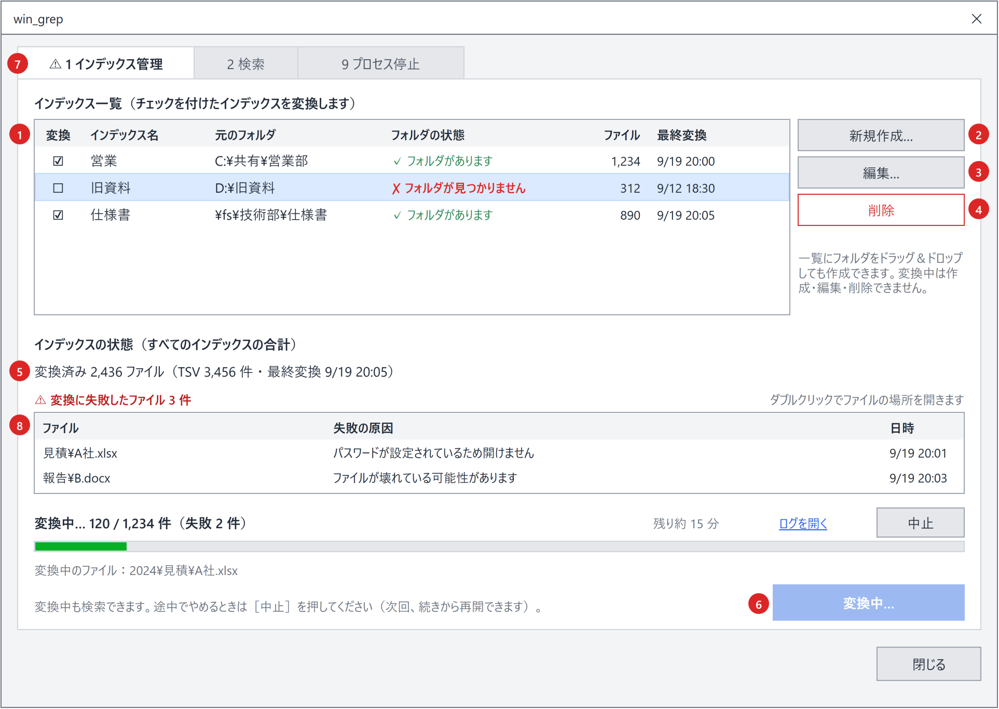
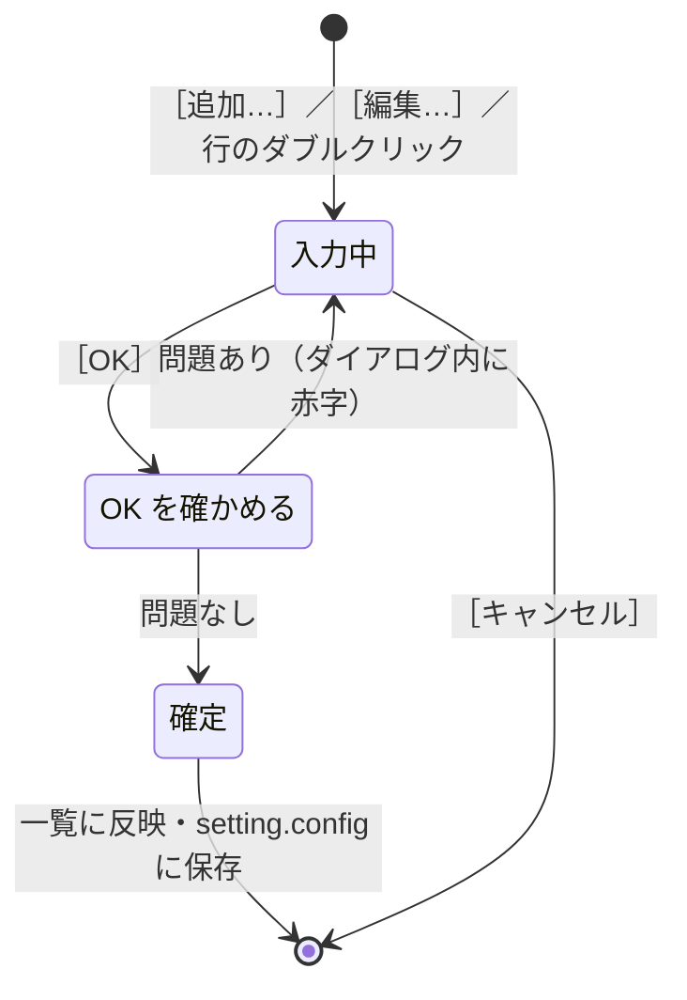
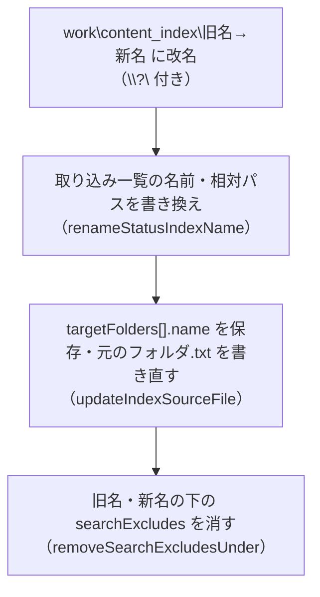
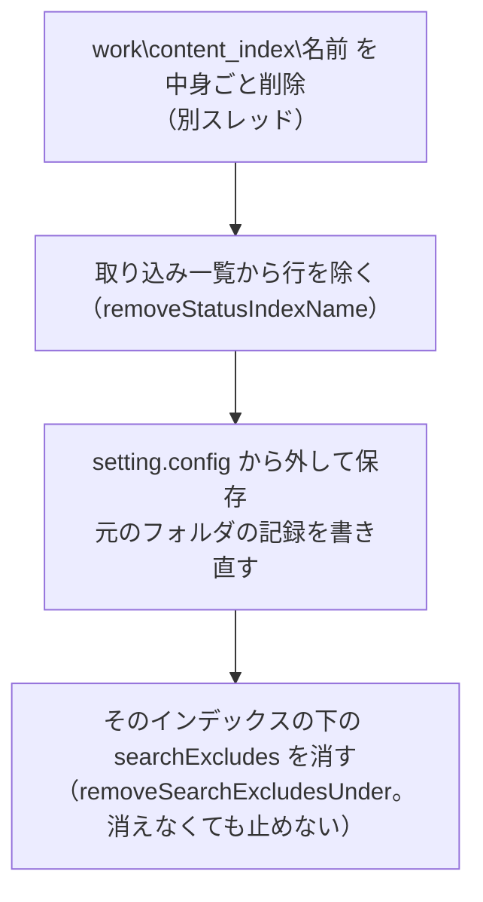

# インデックス一覧の管理

扱うこと: ［1 インデックス管理］タブでのインデックスの追加・一覧・編集・削除、名前を変えた・削除したときの処理。扱わないこと: インデックス作成の実行そのもの（[インデックス作成の実行](indexing-run.md)）。先に読むページ: [画面](index.md)。

インデックスを **追加・一覧・編集・削除** するタブ。インデックス作成の実行は [インデックス作成の実行](indexing-run.md) を参照。
図は「前回取り込みに失敗したファイルがあり、インデックス作成を実行中」の状態。

今の画面の写真は[画面設計（現行）](screens/index-tab.md)にある。

| No. | 部品 | 仕様 |
|---|---|---|
| 1 | インデックス一覧 | 見出しは `インデックス一覧`、その右に `チェックを付けたインデックスを取り込みます`。1 行 1 インデックス（1 フォルダ）。列は「作成」（チェック）・「インデックス名」・「元のフォルダ」・「フォルダの状態」・「ファイル」・「最終取り込み」（[一覧の列](#一覧の列)）。**チェックを付けたインデックスだけを取り込む**（チェックを外したインデックスは、一覧にも `work\content_index` にも残したまま取り込まない）。一覧が空なら `インデックスがありません。［追加…］で、Office ファイルのあるフォルダを指定してください。`。並びは `targetFolders` の順で、[検索対象のツリー](search-tree.md)もこの順に並ぶ |
| 2 | ［追加…］ | 追加のダイアログ（[追加・編集のダイアログ](#追加編集のダイアログ)）を開き、決めた内容でインデックスを 1 件追加する。一覧へのフォルダのドラッグ＆ドロップでも追加できる（このときインデックス名はフォルダ名から自動で決める）。追加するだけでインデックス作成はせず、ステータスに `インデックス [<名前>] を追加しました。［インデックス作成を開始］を押すと中身を取り込みます` と表示する（有無によらず同じ文言。有無は[一覧の列](#一覧の列)「フォルダの状態」で分かる。届かないネットワークのフォルダで画面のスレッドが止まらないよう、`Test-Path` を呼ばない）。同じフォルダ（書き方の違い・大文字小文字を含む）のインデックスは二重に追加しない |
| 3 | ［編集…］ | 選択中のインデックスの**名前**と**元のフォルダの場所**を変える（[追加・編集のダイアログ](#追加編集のダイアログ)。行のダブルクリックでも開く）。変えても**インデックスは作り直さない**。変更したらステータスに `インデックスを変更しました（名前 [<旧>] → [<新>] / 場所 <旧> → <新>）` と表示する |
| 4 | ［削除］ | 選択中のインデックスを削除する（Delete キーでも同じ）。確認ダイアログ（[確認ダイアログ](common.md#確認ダイアログshowconfirm)）で確認する。見出しは `インデックス「<名前>」を一覧から削除しますか？`、結果は `✗ tebunko が作ったインデックスが消えます`（`このフォルダは検索できなくなります（もう一度［インデックス作成を開始］すれば作り直せます）`）／ `✓ 元のフォルダと、その中のファイルはそのままです`（`<パス>`）、補足は `しばらく検索しないだけなら、削除せずに［作成］のチェックを外してください。インデックスは残ったままです。`、ボタンは赤い［削除する］（既定は［キャンセル］）。［削除する］で一覧からすぐ消し、`work\content_index\<名前>` と取り込み一覧の記録の削除（`removeIndex`）は**別スレッド**で行う（数万フォルダでは数十秒かかることがあり、画面のスレッドで行うと「応答なし」になるため）。削除の間はステータスに `インデックス [<名前>] を削除しています…（件数によっては少し時間がかかります）` と出し、インデックスの操作・インデックス作成の開始はできないようにする。終わったらステータスに `インデックス [<名前>] を削除しました` と表示する |
| 5 | インデックスの状態 | すべてのインデックスの合計。`取り込み済み N ファイル（集約ファイル M 件 ・ 最終取り込み M/d H:mm）`。インデックスが無いときは `まだインデックスがありません。`。中断があれば次の行に表示する（[インデックスとインデックス作成の状態](state-flow.md#インデックスとインデックス作成の状態)）。失敗は No.8 の一覧に表示する |
| 6 | 注意書き・実行ボタン | 注意書きは、押す前は「押すと何が起きるか」（`押すと、何件取り込むかを確認してから、新しいファイル・変わったファイルだけを取り込みます。`）、インデックス作成中は「やめるとどうなるか」（`インデックス作成中も検索できます。やめるときは［中止］を押してください（次に［インデックス作成を開始］を押すと続きから再開します）。`）を書く。ボタンは状態に応じて表示を変える（[実行ボタンの表示](indexing-run.md#実行ボタンの表示)）。押すと `tebunko/indexer.ps1` を画面のプロセスの中のスレッドで実行し、**取り込み対象を数え終えたところで確認のダイアログを出す**（[インデックス作成の確認ダイアログ](indexing-run.md#インデックス作成の確認ダイアログ)）。ダイアログで［インデックス作成を開始］を押すとインデックス作成が始まり、進み具合を表示する（[インデックス作成の進み具合](indexing-run.md#インデックス作成の進み具合)） |
| 7 | タブ見出し | 取り込みに失敗したファイルが残っているとき `⚠` を付ける |
| 8 | 取り込みに失敗したファイル | 取り込み一覧に状態が `失敗` の行があるときだけ表示する。見出しは `⚠ 取り込みに失敗したファイル N 件`。列は「ファイル」（相対パス）・「失敗の原因」（取り込み一覧のエラー列。[失敗の原因](../indexing/office-apps.md#失敗の原因describeingesterror)）・「日時」。取り込み日時の新しい順に並べ、高さを超えたらスクロールする。行をダブルクリックすると、元のファイルをエクスプローラーで選択した状態で開く（ファイルが無ければフォルダを開き、ステータスに表示する）。元のフォルダがネットワークにあれば裏のスレッドで確かめ、ステータスに `元のファイルを確かめています…：<パス>` を出す。接続できないときは `元のフォルダに接続できません：<パス>`（見つからないときの文言とは別。[元のフォルダ・元のファイルがネットワークにあるとき](network.md)）。インデックス作成中も、失敗が増えるたびに更新する。インデックス作成が終わったとき失敗があれば、進み具合の下に `失敗したファイルと原因は「取り込みに失敗したファイル」の一覧で確認できます。` と表示する |

- インデックスの追加・編集・削除・チェックの変更は、その場で `setting.config`（`targetFolders`）に保存する（`writeTargetFolders`。チェックなしは `enabled` が `false`）。保存の操作は無い。
- **インデックス作成中は追加・編集・削除をしない**。［追加…］［編集…］［削除］は無効にし、操作しようとした場合は `インデックス作成中はインデックスを<追加／編集／削除>できません。インデックス作成が終わるまでお待ちください（［中止］で止められます）。` と出す。インデクサがインデックスのフォルダと取り込み一覧を使っているため。
- ［編集…］［削除］は、一覧で 1 件選んでいるときだけ有効にする。
- **インデックスを一から作り直すボタンは置かない**。取り込み対象は毎回［インデックス作成を開始］の確認（[インデックス作成の確認ダイアログ](indexing-run.md#インデックス作成の確認ダイアログ)）で分かるため、ふだんは作り直す必要がない。更新日時が変わらないまま中身が変わった場合など、どうしても作り直したいときは［削除］してから追加し直す。

**インデックス名と場所は分けて持つ**（`targetFolders` の `name` と `path`）。`name` が `work\content_index` 直下のフォルダ名になり、インデックスの同一性を表す。`path` を書き換えても `name` は変わらないため、フォルダを移してもインデックスを作り直さない（[クロール対象フォルダと取り込み対象](../indexing/crawl.md#クロール対象フォルダとインデックス名)）。
画面では**追加した時点で名前を決めて保存する**（追加のダイアログの既定値は `newIndexName`）。名前の無い設定（設定ファイルを直接書き換えた場合など）を読み込んだときは、`assignIndexNames` で名前を割り当てて保存してから一覧に出す。

## 一覧の列

| 列 | 幅 | 内容 |
|---|---|---|
| 作成 | 52 | チェックボックス。**チェックを付けたインデックスだけを取り込む**。切り替えたその場で `setting.config` に保存する。ツールチップは `チェックを付けたインデックスだけを取り込みます（外してもインデックスは残ります）` |
| インデックス名 | 150 | `work\content_index` 直下のフォルダ名（`targetFolders[].name`）。検索対象のツリー・検索結果の表示にも使う |
| 元のフォルダ | 残り | Office ファイルのあるフォルダ（`targetFolders[].path`）。入りきらなければ `…` で省略し、ツールチップに全体を出す |
| フォルダの状態 | 140 | `✓ フォルダがあります`（緑）/ `✗ フォルダが見つかりません`（赤）/ 調べている間は `… フォルダを確認しています`（灰）。起動時とウィンドウがアクティブになるたびに、別スレッドで調べ直す（届かないネットワークのフォルダでは確認に十数秒かかり、画面のスレッドで調べると「応答なし」になるため） |
| ファイル | 76 | 取り込み一覧に記録されているこのインデックスのファイル数（`getIndexStats`。3 桁区切り）。まだ取り込んでいなければ `－`（ツールチップは `まだ取り込んでいません`）。ツールチップは `済 N 件 ・ 未取り込み M 件 ・ 失敗 K 件` |
| 最終取り込み | 100 | このインデックスの最も新しい取り込み日時（当日は `H:mm`、それ以外は `M/d H:mm`）。まだ取り込んでいなければ空 |

「ファイル」「最終取り込み」は取り込み一覧（`work/取り込み一覧.tsv`）の集計で、状態を読み直すたび（起動時・ウィンドウがアクティブになったとき・インデックス作成中は 1 秒ごと）に更新する。

## 追加・編集のダイアログ

`tebunko/xaml/dialog_index_edit.xaml`。追加と編集で同じダイアログを使い、表題と説明を変える。

```mermaid
stateDiagram-v2
    state "入力中" as Input
    state "OK を確かめる" as Check
    state "確定" as Ok

    [*] --> Input : ［追加…］／［編集…］／行のダブルクリック
    Input --> Check : ［OK］
    Check --> Input : 問題あり（ダイアログ内に赤字）
    Check --> Ok : 問題なし
    Ok --> [*] : 一覧に反映・setting.config に保存
    Input --> [*] : ［キャンセル］
```

| 部品 | 仕様 |
|---|---|
| 表題・説明 | 追加は `インデックスの追加` と `Office ファイル（Excel・Word・PowerPoint）の入っているフォルダを 1 つ選んでください。ここでは一覧に加えるだけです。中のファイルを読むのは［インデックス作成を開始］を押してからです。`。編集は `インデックスの編集` と `名前と、元のフォルダの場所を変えられます。` |
| 元のフォルダ | パスの入力・貼り付け・フォルダのドラッグ＆ドロップで指定する。前後の空白・`"`・末尾の `\` は取り除く（`normalizeFolderPath`。エクスプローラーの「パスのコピー」をそのまま貼れる）。［参照…］は Windows 標準のフォルダ選択ダイアログ（[フォルダ選択ダイアログ（［参照…］）](common.md#フォルダ選択ダイアログ参照)。初期位置は今の入力値） |
| インデックス名 | 画面では `インデックス名` とだけ書き、`work\content_index` 直下のフォルダ名になることは書かない（利用者が決めるのは検索対象の一覧と検索結果に出る名前のため）。入力欄の下は `検索対象の一覧と検索結果に、この名前が出ます。\ / : * ? " < > | は使えません。`。**追加では、フォルダを指定すると `newIndexName` の名前を自動で入れる**（利用者が名前を変えた後は上書きしない）。編集では今の名前を初期値にする |
| 注意書き（編集のみ） | `変えるのは名前と場所だけです。インデックスはそのまま使います（作り直しません）。フォルダを別のドライブや共有フォルダへ移したときは、ここで新しい場所を指定してください。` |
| ［OK］ | 入力を調べ、問題があればダイアログ内に赤字で出して閉じない（下表）。問題がなければ確定する |

［OK］で調べる内容（`checkIndexEditInput` / `testIndexName`）:

| 条件 | メッセージ |
|---|---|
| フォルダが空 | `元のフォルダを指定してください。` |
| ほかのインデックスと同じフォルダ | `「<パス>」のインデックス [<名前>] が既にあります。` |
| ほかのインデックスのフォルダの中（`testFolderUnder`） | `「<パス>」は、インデックス [<名前>]（<そのパス>）の中のフォルダです。同じファイルが二重に取り込まれるため、登録できません。検索する範囲を絞るときは［2 検索］の検索対象で外してください。` |
| 中にほかのインデックスのフォルダがある | `「<パス>」の中には、インデックス [<名前>]（<そのパス>）があります。同じファイルが二重に取り込まれるため、登録できません。まとめるときは、先に [<名前>] を削除してください。` |
| 名前が空 | `インデックス名を入力してください。` |
| 名前の前後に空白 | `インデックス名の前後に空白は使えません。` |
| 名前が 255 文字超 | `インデックス名が長すぎます（255 文字まで）。` |
| 名前にファイル名で使えない文字 | `インデックス名に使えない文字が含まれています（\ / : * ? " < > \| と制御文字）。` |
| 名前の末尾が `.` | `インデックス名の最後に . は使えません。` |
| 名前が Windows の予約語（`CON` `PRN` `AUX` `NUL` `COM1`〜`COM9` `LPT1`〜`LPT9`） | `「<名前>」は Windows で使えない名前です。` |
| ほかのインデックスと同じ名前（大文字・小文字を区別しない） | `「<名前>」は、ほかのインデックスが使っています。別の名前を付けてください。` |

フォルダが見つからない場合も追加・変更できる（一覧の「フォルダの状態」に `✗ フォルダが見つかりません` と出す）。ネットワークドライブが一時的に切れている場合に登録できなくなるのを避けるため。

### 名前を変えたときの処理（`renameIndex`）

```mermaid
flowchart TD
    A["work\content_index\旧名→新名 に改名<br>（\\?\ 付き）"] --> B["取り込み一覧の名前・相対パスを書き換え<br>（renameStatusIndexName）"]
    B --> C["targetFolders[].name を保存・元のフォルダ.txt を書き直す<br>（updateIndexSourceFile）"]
    C --> D["旧名・新名の下の searchExcludes を消す<br>（removeSearchExcludesUnder）"]
```

名前を変えても**インデックスは作り直さない**。次の順に、名前だけを付け替える。

1. `work\content_index\<旧名>` を `work\content_index\<新名>` に改名する（長いパスの本文インデックスのファイル・TSV があっても扱えるよう `\\?\` 付きで操作する）。移動先が既にあれば例外にして何もしない。大文字・小文字だけを変える場合は一時名を経由する
2. 取り込み一覧（`work/取り込み一覧.tsv`）の `クロール対象フォルダ` の行のインデックス名と、各行の相対パスの先頭（`<旧名>\…` → `<新名>\…`）を書き換える（`renameStatusIndexName`。行の順序と内容はそのまま保ち、一時ファイルに書いてから置き換える）
3. `setting.config` の `targetFolders[].name` を保存し、各インデックスの元のフォルダの記録（`元のフォルダ.txt`）を書き直す（`updateIndexSourceFile`）
4. 検索対象のツリーでチェックを外していたフォルダの記録（`searchExcludes`）のうち、旧名・新名の下のものを消す（`removeSearchExcludesUnder`）。付け替えないため、外していたフォルダは検索対象に戻る。消せなくても改名は止めず、画面にエラーも出さない

### 削除したときの処理（`removeIndex`）

```mermaid
flowchart TD
    A["work\content_index\名前 を中身ごと削除<br>（別スレッド）"] --> B["取り込み一覧から行を除く<br>（removeStatusIndexName）"]
    B --> C["setting.config から外して保存<br>元のフォルダの記録を書き直す"]
    C --> D["そのインデックスの下の searchExcludes を消す<br>（removeSearchExcludesUnder。消えなくても止めない）"]
```

1. `work\content_index\<名前>` を中身ごと削除する（`\\?\` 付き）
2. 取り込み一覧から、そのインデックスの `クロール対象フォルダ` の行と各ファイルの行を取り除く（`removeStatusIndexName`）
3. `setting.config` から外して保存し、元のフォルダの記録を書き直す
4. 検索対象のツリーでチェックを外していたフォルダの記録（`searchExcludes`）のうち、そのインデックスの下のものを消す（`removeSearchExcludesUnder`。手順 2 の直後に別スレッドの中で行う。消せなくても削除は止めず、画面にエラーも出さない）

インデクサの `removeDroppedFolders`（[クロール対象フォルダと取り込み対象](../indexing/crawl.md#クロール対象フォルダとインデックス名)）は、画面を通さずに設定を書き換えた場合の後始末として残す。画面から削除した場合は、その場で消えているため何もしない。

## エクスポート・インポート

インデックス一覧の右の操作ボタンに ［エクスポート…］［インポート…］を置く（画面はこの最小限の 2 ボタンにし、GUI の刷新のときに作り直す）。中身の zip の形式・`exportIndex`・`importIndex` の手順は [インデックスのエクスポート・インポート](../index-data/format.md#インデックスのエクスポートインポート) を参照。

| 部品 | 仕様 |
|---|---|
| ［エクスポート…］ | 一覧で 1 件選んでいるときだけ有効。押すと保存先のフォルダを選ぶダイアログを出し、`<インデックス名>_インデックス_<yyyyMMdd>.zip`（保存先フォルダに同名があれば `(2)` …）で書き出す（`getExportFileName`）。書き出しは別スレッド（`exportIndex`）で行い、終わるまでステータスに `エクスポートしています…` と出す。終わったら `インデックス [<名前>] を「<保存先>」に書き出しました（<件数> ファイル）`（`<名前>` は `exportIndex` の戻り値の `Name`。`tests/gui/index_archive.Tests.ps1` で名前まで確かめる） |
| ［インポート…］ | zip を選ぶダイアログ（Windows 標準のファイルを開くダイアログ）を出し、目録を読んで確かめる（`readIndexArchiveInfo`）。壊れている・別の版なら、その場でエラーを表示して終える。読めれば、追加・編集と同じ見た目のダイアログを「インデックスのインポート」の表題で開き、名前（既にあれば重ならない名前を提案）・元のフォルダ（目録の値）・ファイル数と大きさの説明を出す。名前を既にあるインデックスと同じにして［OK］を押すと、上書き・別名・取りやめの確認ダイアログを出す。決まったら別スレッド（`importIndex`）でインポートし、終わったら一覧を読み直し、ステータスに件数と `高速検索は次のインデックス作成の後に効きます。`、`Warnings`（同じ元のフォルダが別の名前で登録されているときなど）を出す（`getImportResultStatus`）。名前・元のフォルダのダイアログや上書きの確認を取りやめたときは、ステータスを `インポートを取りやめました` に書き換える |

**排他**: インデックス作成のロックで防げるのはインデクサだけで、一覧の名前の変更・削除・［8 設定］のワークスペースの切り替えは、このロックを取らずに `content_index\`・取り込み一覧・設定を書き換える。そこでエクスポート・インポートを別スレッドで行っている間と、次のものが動いている間は、互いに操作できないようにする。可否と押せなかったときの文言は、判断層の `getIndexJobBlocker`（動いているもの）・`getIndexJobBlockedMessage`（文言）・`getIndexTabButtonsEnabled`（表のボタン）だけで決め、画面の側（`testIndexOperable`・`testWorkspaceChangeable`・`updateIndexingButton`）は結果を使うだけにする（`index_view.Tests.ps1` の表のテスト）。

| 動いているもの | 無効にするもの |
|---|---|
| エクスポート・インポート | ［追加…］［編集…］［削除］［インデックス作成を開始］・もう一方の［エクスポート…］［インポート…］・［8 設定］のワークスペースの［変更…］ |
| インデックス作成・削除 | ［エクスポート…］［インポート…］ |

［8 設定］の［変更…］は、押した時点で `testWorkspaceChangeable` が `getIndexJobBlocker` でインデックス作成中・削除中・エクスポート・インポート中かどうかを確かめ、動いていれば `getIndexJobBlockedMessage`（`エクスポート・インポートが終わるまでお待ちください。` など）を出して何もしない。別のセッション（別のプロセスの画面・将来の CUI）の名前の変更・削除との排他は扱わない。

