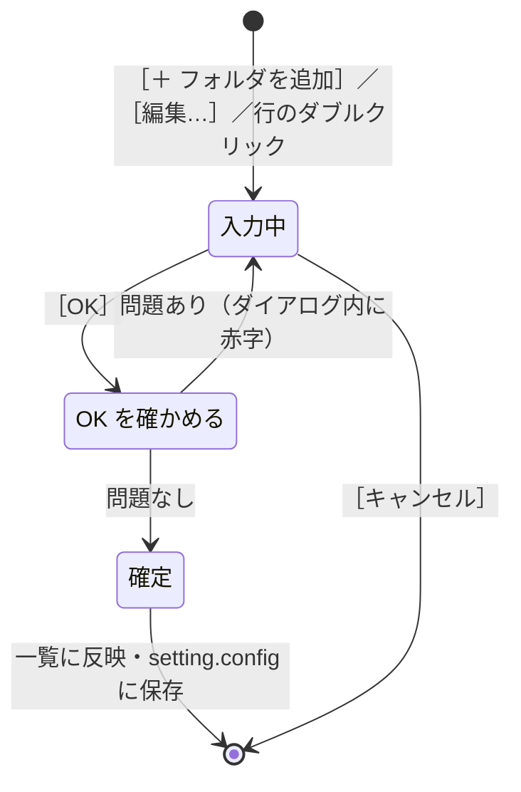
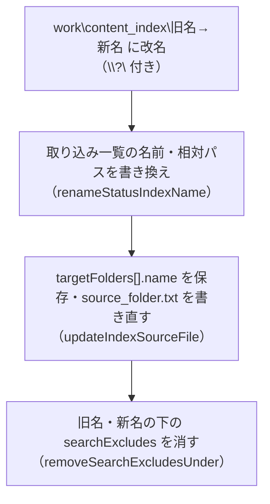
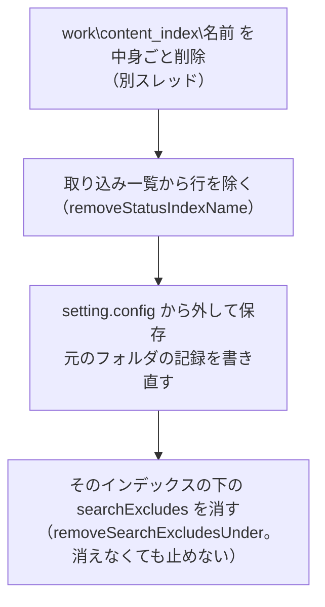

# インデックス一覧の管理

扱うこと: ［インデックス管理］タブでのインデックスの追加・一覧・編集・削除、名前を変えた・削除したときの処理。扱わないこと: インデックス作成の実行そのもの（[インデックス作成の実行](indexing-run.md)）。先に読むページ: [画面](index.md)。

インデックスを **追加・一覧・編集・削除** するタブ。インデックス作成の実行は [インデックス作成の実行](indexing-run.md) を参照。
図は「前回更新に失敗したファイルがあり、インデックス作成を実行中」の状態。

今の画面の写真は[画面設計（現行）](screens/index-tab.md)にある。

画面は上下に分ける。上が**一覧**（頭の操作の行（高さ 56。左に「N / M 件を選択中」、右に ⓘ・［すべて更新］［アクション ▾］［＋ フォルダを追加］。ボタンの高さは 32）と表。`xaml/index/index_list.xaml`）、下が**詳細**（インデックスの状態・更新の進み具合・更新に失敗したファイル。`xaml/index/index_detail.xaml`。表の行を 1 つ選ぶと、見出しが `<名前> - 詳細` になり、その行のインデックスの値を出す。左は「基本設定」（名前・フォルダパス）（フォルダパスの右の［...］を押すと、OS のフォルダ選択を出し、選んだ場所を右クリック・二重クリックの［編集…］で変えて［OK］したときと同じ判断（`testIndexEditInput`）・同じ保存（`applyIndexEdit`）で反映する。キャンセルや同じ場所では何も変えない。有効・無効は右クリック・二重クリックの［編集…］と同じで、`getIndexTabButtonsEnabled` の `ChangeFolder`）・「インデックス」の状態の箱（1 行目に見出し・バッジ・補足を並べる。元のフォルダが見つからないときは、バッジが `エラー`（赤）になり、箱の中に赤字の `フォルダが見つかりません。` と、折り返す説明 `フォルダが移動・削除されたか、ネットワークにつながっていない可能性があります。` `フォルダパスの［...］でフォルダを選び直してください。` を出す。更新中の行では更新の表示を優先して出さない。`getIndexDetailView` の `Error`・`ErrorHint`）・「高速検索」の箱（見出しを箱の 1 行目のバッジの横に置き、「状態」の文字は置かない。余白は「インデックス」の箱と同じ縦 8・横 10）、右は「インデックス情報」の表だけ（1 行 1 項目・長いものは `…` で省略）。更新中の行を選んでいるときは、「インデックス」の箱に、更新全体の進み（棒・`N / M 件・残り約 N 分`・更新中のファイル名 1 行）を出す（インデックスごとの件数は無い）。2 件以上にチェックを付けているときは、見出しが `N 件を選択中`、案内が `1 件だけ選ぶと、ここに詳細を表示します。` になる（`getIndexDetailMultiCount`・`getIndexDetailView`）。チェックが 1 件だけのときは、その行の詳細を出す（右クリック・二重クリックの［編集…］と［...］、右クリックの［削除］［エクスポート…］の可否と対象も同じ行。`getIndexDetailItem`。［アクション ▾］の項目の可否は `getIndexActionsEnabled`）。選んでいない間は見出しが `インデックスの状態` で、全インデックスの合計だけを出す。文言は判断層の `getIndexDetailView`。選んだ行の値が変わる所（行のチェック・フォルダの有無の結果・名前や場所の編集・更新の集計・高速検索の確かめ・追加・削除）は、どれも `updateIndexDetailPanel` で詳細を書き直す。`tests/meta/index_detail.Tests.ps1` が呼び出しを確かめる）で、枠は `xaml/index/index.xaml`。間の境目をドラッグすると詳細の高さが変わる（詳細は最大 397・最小 240。一覧は最小 225）。境目は窓の左右いっぱいの細い線で、中央に短くて濃い小さな棒（幅 32・太さ 3）を置く。詳細の見出しの帯は薄い灰色の地（`Bg.Hover`）に上下の細い線で、詳細は窓の下のステータスバーまで届く。「登録済み: N フォルダ」（左）と「合計: N ファイル」（右）は、この画面のときだけ窓の下のステータスバー（`xaml/shell/status_bar.xaml`）に出す（いつもの文・更新中の 1 行は、その間に出る。出し入れは `selectScreen`、文言は `updateIndexFooter`）。行の右端のボタンは［更新］［中止］だけにする（エラーの行は何も出さず、列の幅はそのまま）。［エクスポート…］［インポート…］［削除…］は一覧の右上の［アクション ▾］のメニューに置く。行の編集・エクスポート・削除は、行の右クリックのメニューと、ダブルクリック（編集）・Delete キー（削除）でも開く。

見た目は、一覧も詳細も囲み（カード）を使わず平らにする（頭は操作の行だけで、見出し・説明は置かない。詳細の上に細い線 1 本と薄い地の見出しの帯、詳細の左右の間は線 1 本）。主のボタンは［＋ フォルダを追加］（青）で、［すべて更新］［アクション ▾］は白地。状態の札（一覧の「ステータス」「高速検索」・詳細・更新の確認）は、どれも `StatusBadge`（角丸 8・枠つき）に色だけを重ねる。一覧のバッジは状態の名前だけを出し、数字（更新中の `45%`・途中で止まった行の `残り N 件`）はバッジの右に小さな補足（文字サイズ 10・`Ink.Muted`・バッジとの間 8）で添える。更新中の進み具合の棒（120×4）は、更新中の行だけに出す。インデックスが 1 件も無いときは、詳細と境目を出さず、案内（folder-search の絵・［＋ フォルダを追加］）を一覧の中央に出す（`updateIndexListView`）。

| No. | 部品 | 仕様 |
|---|---|---|
| 1 | インデックス一覧 | 見出し・説明は置かない。頭の操作の行の右の ⓘ のツールヒントに、この画面の説明（3 行。`getIndexScreenInfoText`）を出す。1 行 1 インデックス（1 フォルダ）。列は チェック（見出しは全選択。一部だけ選んでいるときは横棒）・「名前」（Lucide の folder の印付き）・「パス」・「ファイル数」・「最終更新」・「ステータス」・「高速検索」・「操作」（行の［更新］［中止］）（[一覧の列](#一覧の列)）。**チェックは、［アクション ▾］の項目で操作する対象を選ぶだけの一時の選びで、保存しない**（初めは全部外れている）。［すべて更新］はチェックと関係なく全部を更新する（ただし、設定の `enabled` が `false` のインデックスは更新しない）。行の［更新］とメニューの［更新］は、その行・チェックを付けた行だけを更新する。選んだ行は Select.Soft の地にする。一覧が空なら、表の中に Lucide の folder-search の絵・`フォルダを追加してください`・`検索したいフォルダを追加すると、ここに表示されます。`・［＋ フォルダを追加］を出す。並びは `targetFolders` の順で、[検索対象のツリー](search-tree.md)もこの順に並ぶ |
| 2 | ［＋ フォルダを追加］ | 追加のダイアログ（[追加・編集のダイアログ](#追加編集のダイアログ)）を開き、決めた内容でインデックスを 1 件追加する。一覧へのフォルダのドラッグ＆ドロップでも追加できる（このとき名前はフォルダ名から自動で決める）。追加するだけでインデックス作成はせず、ステータスに `インデックス [<名前>] を追加しました。［すべて更新］を押すと中身を更新します` と表示する（有無によらず同じ文言。有無は[一覧の列](#一覧の列)「フォルダの状態」で分かる。届かないネットワークのフォルダで画面のスレッドが止まらないよう、`Test-Path` を呼ばない）。同じフォルダ（書き方の違い・大文字小文字を含む）のインデックスは二重に追加しない |
| 3 | ［編集…］ | ［アクション ▾］のメニューの項目（［更新］の次）と、行の右クリックのメニューの項目（行のダブルクリックでも開く）。押したときの動きは同じ（`editIndex`）。［アクション ▾］の［編集…］の対象は、チェックが 1 件ならその行、チェックが無ければ押した行で、2 件以上チェックしているときは使えない（可否は判断層の `getIndexActionsEnabled` の `Edit`。［エクスポート…］［削除…］と同じくチェックの行を選んでから動く）。右クリック・二重クリックの［編集…］は、押した行に対して動く（`getIndexTargetItem`）。選択中のインデックスの**名前**と**元のフォルダの場所**を変える（[追加・編集のダイアログ](#追加編集のダイアログ)）。変えても**インデックスは作り直さない**。変更したらステータスに `インデックスを変更しました（名前 [<旧>] → [<新>] / 場所 <旧> → <新>）` と表示する |
| 4 | ［削除…］ | ［アクション ▾］のメニューの項目（行の右クリックのメニューの［削除］・Delete キーでも同じ）。チェックを付けた行に対して動く（1 件は下の確認、2 件以上は 1 回の確認でまとめて削除する）。確認ダイアログ（[確認ダイアログ](common.md#確認ダイアログshowconfirm)）で確認する。見出しは 1 件なら `「<名前>」のインデックスを削除しますか？`、2 件以上なら `選んだ N 件のインデックスを削除しますか？`。本文は 2 件以上なら `「A」「B」を削除します。元のファイルは削除されません。`（名前は 3 件まで。4 件以上は `「A」「B」「C」ほか N 件を削除します。…` と、残りの件数を添える。1 件は `元のファイルは削除されません。` だけ。`getIndexDeleteConfirmMessage`）、ボタンは赤い［削除する］（既定は［キャンセル］）。［削除する］で一覧からすぐ消し、`work\content_index\<名前>` と取り込み一覧の記録の削除（`removeIndex`）は**別スレッド**で行う（数万フォルダでは数十秒かかることがあり、画面のスレッドで行うと「応答なし」になるため）。削除の間はステータスに `インデックス [<名前>] を削除しています…（件数によっては少し時間がかかります）` と出し、インデックスの操作・インデックス作成の開始はできないようにする。終わったらステータスに `インデックス [<名前>] を削除しました` と表示する |
| 5 | インデックスの状態 | すべてのインデックスの合計。`更新済み N ファイル（集約ファイル M 件 ・ 最終更新 M/d H:mm）`。インデックスが無いときは `まだインデックスがありません。`。中断があれば次の行に表示する（[インデックスとインデックス作成の状態](state-flow.md#インデックスとインデックス作成の状態)）。失敗は No.8 の一覧に表示する |
| 6 | 注意書き・実行ボタン | 注意書きは、押す前は「押すと何が起きるか」（`押すと、何件更新するかを確認してから、新しいファイル・変わったファイルだけを更新します。`）、インデックス作成中は「やめるとどうなるか」（`インデックス作成中も検索できます。やめるときは［中止］を押してください（次に［すべて更新］を押すと続きから再開します）。`）を書く。ボタンは状態に応じて表示を変える（[実行ボタンの表示](indexing-run.md#実行ボタンの表示)）。押すと `tebunko/indexer.ps1` を画面のプロセスの中のスレッドで実行し、**更新の対象を数え終えたところで確認のダイアログを出す**（[インデックス作成の確認ダイアログ](indexing-run.md#インデックス更新の確認ダイアログ)）。ダイアログで［すべて更新］を押すとインデックス作成が始まり、進み具合を表示する（[インデックス作成の進み具合](indexing-run.md#更新の進み具合)） |
| 7 | ナビの［インデックス管理］の印 | 更新中は `● 66%`（割合が分からないうちは `●`）、中断中は `中断`、更新に失敗したファイルがあるだけなら `失敗` を付ける（`getIndexNavBadge`。更新中・中断・失敗の順に優先する）。ナビの枠は変えず、既存の印（`IndexTabBadge`）の文字・色・ToolTip を差し替える |
| 8 | 更新に失敗したファイル | 取り込み一覧に状態が `失敗` の行があるときだけ表示する。見出しは `更新に失敗したファイル N 件`（左に Lucide の triangle-alert の印）。列は「ファイル」（相対パス）・「失敗の原因」（取り込み一覧のエラー列。[失敗の原因](../indexing/office-apps.md#失敗の原因describeingesterror)）・「日時」。日時の新しい順に並べ、高さを超えたらスクロールする。行をダブルクリックすると、元のファイルをエクスプローラーで選択した状態で開く（ファイルが無ければフォルダを開き、ステータスに表示する）。元のフォルダがネットワークにあれば裏のスレッドで確かめ、ステータスに `元のファイルを確かめています…：<パス>` を出す。接続できないときは `元のフォルダに接続できません：<パス>`（見つからないときの文言とは別。[元のフォルダ・元のファイルがネットワークにあるとき](network.md)）。インデックス作成中も、失敗が増えるたびに更新する。インデックス作成が終わったとき失敗があれば、進み具合の下に `失敗したファイルと原因は「更新に失敗したファイル」の一覧で確認できます。` と表示する |

- インデックスの追加・編集・削除は、その場で `setting.config`（`targetFolders`）に保存する（`writeTargetFolders`）。保存の操作は無い。チェックは保存しない。`enabled` は設定ファイルの値だけで持ち、画面には出さない（行の［更新］・メニューの［更新］で名前を指して更新したインデックスは、`enabled` を `true` にしてから始める。確認で取りやめても戻さない）。
- **更新中は追加・編集・削除をしない**。［＋ フォルダを追加］と［アクション ▾］のメニューの項目（［編集…］［エクスポート…］［インポート…］［削除…］）は使えなくし、操作しようとした場合は `更新中はインデックスを<追加／編集／削除>できません。更新が終わるまでお待ちください（［中止］で止められます）。` と出す。インデクサがインデックスのフォルダと取り込み一覧を使っているため。
- ［更新］［エクスポート…］［削除…］は、**チェックを付けた行**に対して動く（1 件以上チェックしていると使える。一覧で選んでいるだけの行には効かない）。［インポート…］はチェックしなくても使える。更新中・削除中・エクスポート中は、行の［更新］・メニューの［更新］・［すべて更新］を含めて使えない。可否は判断層の `getIndexActionsEnabled`（表のテスト）。2 件以上のエクスポート・削除は、書き出し先の選択と削除の確認を 1 回だけ出し、1 つ失敗しても残りを続けて、終わりに失敗した名前と理由を出す（`getIndexBulkResultView`。ステータスバーの 1 行と、失敗があればメッセージ）。右クリックのメニューの［編集…］［エクスポート…］［削除］は、一覧で 1 件選んでいるときに使える（対象は `getIndexDetailItem` の行）。［アクション ▾］の［更新］［エクスポート…］［削除…］は、チェックを付けた行に対して動く。［編集…］は、チェックが 1 件ならその行、チェックが無ければ押した行に対して動く（2 件以上では使えない）。［インポート…］はチェックが要らない。可否は `getIndexActionsEnabled` が決める。［アクション ▾］の中の並びは［更新］［編集…］［エクスポート…］［インポート…］［削除…］（編集・エクスポート・削除の順は右クリックのメニューと同じ）。
- **インデックスを一から作り直すボタンは置かない**。更新の対象は毎回［すべて更新］の確認（[インデックス作成の確認ダイアログ](indexing-run.md#インデックス更新の確認ダイアログ)）で分かるため、ふだんは作り直す必要がない。更新日時が変わらないまま中身が変わった場合など、どうしても作り直したいときは［削除］してから追加し直す。

**インデックス名と場所は分けて持つ**（`targetFolders` の `name` と `path`）。`name` が `work\content_index` 直下のフォルダ名になり、インデックスの同一性を表す。`path` を書き換えても `name` は変わらないため、フォルダを移してもインデックスを作り直さない（[クロール対象フォルダと取り込み対象](../indexing/crawl.md#クロール対象フォルダとインデックス名)）。
画面では**追加した時点で名前を決めて保存する**（追加のダイアログの既定値は `newIndexName`）。名前の無い設定（設定ファイルを直接書き換えた場合など）を読み込んだときは、`assignIndexNames` で名前を割り当てて保存してから一覧に出す。

## 一覧の列

| 列 | 幅 | 内容 |
|---|---|---|
| チェック | 44 | チェックボックス（見出しは全選択）。［アクション ▾］の項目で操作する行を選ぶ一時の選びで、保存しない（初めは全部外れている。一覧を読み直しても名前で引き継ぐ） |
| 名前 | 150 | `work\content_index` 直下のフォルダ名（`targetFolders[].name`）。検索対象のツリー・検索結果の表示にも使う |
| 元のフォルダ | 残り | Office ファイルのあるフォルダ（`targetFolders[].path`）。入りきらなければ `…` で省略し、ツールチップに全体を出す |
| フォルダの状態 | 140 | `✓ フォルダがあります`（緑）/ `✗ フォルダが見つかりません`（赤）/ 調べている間は `… フォルダを確認しています`（灰）。起動時とウィンドウがアクティブになるたびに、別スレッドで調べ直す（届かないネットワークのフォルダでは確認に十数秒かかり、画面のスレッドで調べると「応答なし」になるため） |
| ファイル | 76 | 取り込み一覧に記録されているこのインデックスのファイル数（`getIndexStats`。3 桁区切り）。まだ更新していなければ `－`（ツールチップは `まだ更新していません`）。ツールチップは `済 N 件 ・ 未取り込み M 件 ・ 失敗 K 件` |
| 最終更新 | 100 | このインデックスの最も新しい更新日時（当日は `H:mm`、それ以外は `M/d H:mm`）。まだ更新していなければ空 |
| ステータス | 170 | 本文の更新の状態を丸いバッジで表す。バッジには状態の名前だけを出し、数字はバッジの右の補足に出す。`未作成`（灰）/ `更新中`（青。Select.Soft の地・Accent の文字。補足は `45%`（更新全体の進みで、分からないうちは補足なし）。下に File.Folder の色の細い進み具合の棒を更新中の行だけに出す）/ `要更新`（黄。補足は `残り N 件`）/ `エラー`（赤）/ `最新`（緑）。設定の `enabled` が `false` のときは、ツールヒントに［すべて更新］の対象から外れている旨を足す（`getIndexRowView`） |
| 高速検索 | 118 | システムインデックス（Windows Search 用）がどこまで反映されたかを丸いバッジで表す。`確認中…`（灰。まだ確かめていない）/ `－`（灰。未作成、または確かめられなかった）/ `不可`（赤。Windows Search に接続できない・対象外・高速検索用のデータが無い、のいずれか）/ `反映待ち`（黄）/ `反映中 N%`（黄）/ `可`（緑）。理由の文はツールヒントに出す（`getFastSearchRowView`。[高速検索](../search/fast-search.md)） |
| 操作 | 96 | 更新中の行は［中止］（今の更新全体を止める。［すべて更新］の［中止］と同じ）、エラーの行は何も出さず（場所は空ける）、ほかの行は［更新］。文言と可否は判断層の `getIndexRowActions` |

ツールヒントは、状態の札（ステータス・高速検索のバッジ）と、「ステータス」「高速検索」の列見出しにだけ付ける（文は「です・ます」で書く）。［＋ フォルダを追加］［アクション ▾］とそのメニューの項目・行の［更新］［中止］・全選択のチェックには付けない（見た目と名前で分かるため）。一覧の「名前」「パス」の列と、詳細の名前・フォルダパス・更新中のファイル名は、「…」で切れているときだけ全文をツールヒントで見せる（`shared/ui/trimmed_tooltip.ps1` の `addTrimmedToolTip`。一覧は行の Loaded で付ける）。切れていなければ出さない。「ステータス」の列見出しには、状態の名前と意味を並べた説明（`getIndexStatusHelpText`）を、「高速検索」の列見出しには、インデックス（高速検索用）が Windows Search にどこまで反映されたかの説明を出す。

「ファイル」「最終更新」は取り込み一覧（`work/ingest_status.tsv`）の集計で、状態を読み直すたび（起動時・ウィンドウがアクティブになったとき・インデックス作成中は 1 秒ごと）に更新する。「高速検索」は、一覧の読み込み時・ウィンドウがアクティブになったとき（前回の確認から 60 秒以上たっていれば）・インデックス作成が終わったとき・追加／編集／削除／インポートの後に確かめ直す。`反映待ち`・`反映中 N%` の行が 1 つでもある間は、5 分ごとのタイマーでも確かめ直す（インデックス作成中は確かめない）。

### 仮の部分

終わりの失敗の見せ方（`getIndexBulkResultView`）は仮で、文言を後で決める。

## 追加・編集のダイアログ

`tebunko/xaml/dialog_index_edit.xaml`。追加と編集で同じダイアログを使い、表題と説明を変える。表題（`DialogHeadingText`）は `インデックスを追加する`・`インデックスを編集する`。見た目は共通の部品（表題・ラベル・入力欄・ボタン）だけをそろえ、配置と部品の名前は変えない。

```mermaid
stateDiagram-v2
    state "入力中" as Input
    state "OK を確かめる" as Check
    state "確定" as Ok

    [*] --> Input : ［＋ フォルダを追加］／［編集…］／行のダブルクリック
    Input --> Check : ［OK］
    Check --> Input : 問題あり（ダイアログ内に赤字）
    Check --> Ok : 問題なし
    Ok --> [*] : 一覧に反映・setting.config に保存
    Input --> [*] : ［キャンセル］
```

| 部品 | 仕様 |
|---|---|
| 表題・説明 | 追加は `インデックスの追加` と `Office ファイル（Excel・Word・PowerPoint）の入っているフォルダを 1 つ選んでください。ここでは一覧に加えるだけです。中のファイルを読むのは［すべて更新］を押してからです。`。編集は `インデックスの編集` と `名前と、元のフォルダの場所を変えられます。` |
| 元のフォルダ | パスの入力・貼り付け・フォルダのドラッグ＆ドロップで指定する。前後の空白・`"`・末尾の `\` は取り除く（`normalizeFolderPath`。エクスプローラーの「パスのコピー」をそのまま貼れる）。［参照…］は Windows 標準のフォルダ選択ダイアログ（[フォルダ選択ダイアログ（［参照…］）](common.md#フォルダ選択ダイアログ参照)。初期位置は今の入力値） |
| 名前 | 画面では `名前` とだけ書き、`work\content_index` 直下のフォルダ名になることは書かない（利用者が決めるのは検索対象の一覧と検索結果に出る名前のため）。入力欄の下は `検索対象の一覧と検索結果に、この名前が出ます。\ / : * ? " < > | は使えません。`。**追加では、フォルダを指定すると `newIndexName` の名前を自動で入れる**（利用者が名前を変えた後は上書きしない）。編集では今の名前を初期値にする |
| 注意書き（編集のみ） | `変えるのは名前と場所だけです。インデックスはそのまま使います（作り直しません）。フォルダを別のドライブや共有フォルダへ移したときは、ここで新しい場所を指定してください。` |
| ［OK］ | 入力を調べ、問題があればダイアログ内に赤字で出して閉じない（下表）。問題がなければ確定する |

［OK］で調べる内容（`checkIndexEditInput` / `testIndexName`）:

| 条件 | メッセージ |
|---|---|
| フォルダが空 | `元のフォルダを指定してください。` |
| ほかのインデックスと同じフォルダ | `「<パス>」のインデックス [<名前>] が既にあります。` |
| ほかのインデックスのフォルダの中（`testFolderUnder`） | `「<パス>」は、インデックス [<名前>]（<そのパス>）の中のフォルダです。同じファイルが二重にインデックスに入るため、登録できません。検索する範囲を絞るときは［検索］の検索対象で外してください。` |
| 中にほかのインデックスのフォルダがある | `「<パス>」の中には、インデックス [<名前>]（<そのパス>）があります。同じファイルが二重にインデックスに入るため、登録できません。まとめるときは、先に [<名前>] を削除してください。` |
| 名前が空 | `名前を入力してください。` |
| 名前の前後に空白 | `名前の前後に空白は使えません。` |
| 名前が 255 文字超 | `名前が長すぎます（255 文字まで）。` |
| 名前にファイル名で使えない文字 | `名前に使えない文字が含まれています（\ / : * ? " < > \| と制御文字）。` |
| 名前の末尾が `.` | `名前の最後に . は使えません。` |
| 名前が Windows の予約語（`CON` `PRN` `AUX` `NUL` `COM1`〜`COM9` `LPT1`〜`LPT9`） | `「<名前>」は Windows で使えない名前です。` |
| ほかのインデックスと同じ名前（大文字・小文字を区別しない） | `「<名前>」は、ほかのインデックスが使っています。別の名前を付けてください。` |

フォルダが見つからない場合も追加・変更できる（一覧の「フォルダの状態」に `✗ フォルダが見つかりません` と出す）。ネットワークドライブが一時的に切れている場合に登録できなくなるのを避けるため。

### 名前を変えたときの処理（`renameIndex`）

```mermaid
flowchart TD
    A["work\content_index\旧名→新名 に改名<br>（\\?\ 付き）"] --> B["取り込み一覧の名前・相対パスを書き換え<br>（renameStatusIndexName）"]
    B --> C["targetFolders[].name を保存・source_folder.txt を書き直す<br>（updateIndexSourceFile）"]
    C --> D["旧名・新名の下の searchExcludes を消す<br>（removeSearchExcludesUnder）"]
```

名前を変えても**インデックスは作り直さない**。次の順に、名前だけを付け替える。

1. `work\content_index\<旧名>` を `work\content_index\<新名>` に改名する（長いパスの本文インデックスのファイル・TSV があっても扱えるよう `\\?\` 付きで操作する）。移動先が既にあれば例外にして何もしない。大文字・小文字だけを変える場合は一時名を経由する
2. 取り込み一覧（`work/ingest_status.tsv`）の `クロール対象フォルダ` の行のインデックス名と、各行の相対パスの先頭（`<旧名>\…` → `<新名>\…`）を書き換える（`renameStatusIndexName`。行の順序と内容はそのまま保ち、一時ファイルに書いてから置き換える）
3. `setting.config` の `targetFolders[].name` を保存し、各インデックスの元のフォルダの記録（`source_folder.txt`）を書き直す（`updateIndexSourceFile`）
4. 検索対象のツリーでチェックを外していたフォルダの記録（`searchExcludes`）のうち、旧名・新名の下のものを消す（`removeSearchExcludesUnder`）。付け替えないため、外していたフォルダは検索対象に戻る。消せなくても改名は止めず、画面にエラーも出さない

### 削除したときの処理（`removeIndex`）

```mermaid
flowchart TD
    A["work\content_index\名前 を中身ごと削除<br>（別スレッド）"] --> B["取り込み一覧から行を除く<br>（removeStatusIndexName）"]
    B --> C["setting.config から外して保存<br>元のフォルダの記録を書き直す"]
    C --> D["そのインデックスの下の searchExcludes を消す<br>（removeSearchExcludesUnder。消えなくても止めない）"]
```

1. `work\content_index\<名前>` を中身ごと削除する（`\\?\` 付き）
2. 取り込み一覧から、そのインデックスの `クロール対象フォルダ` の行と各ファイルの行を取り除く（`removeStatusIndexName`）
3. `setting.config` から外して保存し、元のフォルダの記録を書き直す
4. 検索対象のツリーでチェックを外していたフォルダの記録（`searchExcludes`）のうち、そのインデックスの下のものを消す（`removeSearchExcludesUnder`。手順 2 の直後に別スレッドの中で行う。消せなくても削除は止めず、画面にエラーも出さない）

インデクサの `removeDroppedFolders`（[クロール対象フォルダと取り込み対象](../indexing/crawl.md#クロール対象フォルダとインデックス名)）は、画面を通さずに設定を書き換えた場合の後始末として残す。画面から削除した場合は、その場で消えているため何もしない。

## エクスポート・インポート

［インポート…］［エクスポート…］は、一覧の右上の［アクション ▾］のメニューの項目に置く（［エクスポート…］は行の右クリックのメニューにも置く）。中身の zip の形式・`exportIndex`・`importIndex` の手順は [インデックスのエクスポート・インポート](../index-data/format.md#インデックスのエクスポートインポート) を参照。

| 部品 | 仕様 |
|---|---|
| ［エクスポート…］ | チェックを付けた行に対して動く（2 件以上は書き出し先を 1 回だけ選び、1 つずつ書き出す）。押すとエクスポートのダイアログ（`xaml/dialog_export.xaml`。見出しの代わりに、書き出す対象の枠（名前。2 件以上は `N 件のインデックス`。その下にファイル数。大きさは数えていないので出さない。`getIndexExportHeader`）を上に置き、書き出し先のフォルダの欄 `ExportPathBox`・［参照…］・［エクスポート］・［キャンセル］。欄の初めはワークスペースのフォルダ。フォルダのドラッグ＆ドロップでも指定できる。欄の下に `<名前>_インデックス_<yyyyMMdd>.zip として保存します`、ボタンの上に橙の枠で `このファイルには、元のファイルの本文と元のフォルダの場所が含まれます。元のファイルと同じように取り扱ってください。` を出す）を出す。［エクスポート］で、空なら `書き出し先のフォルダを指定してください。`（`testIndexExportInput`）と出し、決まれば `<名前>_インデックス_<yyyyMMdd>.zip`（書き出し先のフォルダに同名があれば `(2)` …）で書き出す（`getExportFileName`）。書き出しは別スレッド（`exportIndex`）で行い、終わるまでステータスに `エクスポートしています…` と出す。終わったら `インデックス [<名前>] を「<zip のパス>」に書き出しました（<件数> ファイル）`（`<名前>` は `exportIndex` の戻り値の `Name`。`tests/gui/index_archive.Tests.ps1` で名前まで確かめる） |
| ［インポート…］ | zip を選ぶダイアログ（Windows 標準のファイルを開くダイアログ）を出し、目録を読んで確かめる（`readIndexArchiveInfo`）。壊れている・別の版なら、その場でエラーを表示して終える。読めれば、インポートのダイアログ（`xaml/dialog_import.xaml`。表題は「インデックスのインポート」）を開く。上に zip の中身の枠（名前・`エクスポートした日時 2026/09/27 10:00`・`2,530 ファイル・56.6 MB・v0.3.0`。目録の `exportedAt` と大きさと版。`getIndexImportHeader`。注意の枠は置かない）を出し、その下に元のフォルダ（目録の値）と、欄の下の 1 行（`見つかりました`（緑）／`元のフォルダがこの PC に見つかりません。検索はできますが、元のフォルダを設定するまで更新できません。`（橙）／`「<名前>」の元のフォルダと重なっています`（赤）。有無は目録を読む別スレッドで調べ、入力を変えた後は［参照…］で選んだものだけ `見つかりました` にする。`getImportSourceCheckText`）、名前（ラベルは `名前`。既にあれば重ならない名前を提案）を出す。名前が今の一覧にあれば、橙で `同じ名前のインデックスがあります。［インポート］を押すと、上書きするか別の名前にするかを選べます。` を出す（`getImportNameNoticeText`）。名前を既にあるインデックスと同じにして［インポート］を押すと、上書き・別名・取りやめの確認ダイアログを出す。決まったら別スレッド（`importIndex`）でインポートし、終わったら一覧を読み直し、ステータスに件数と `高速検索は次の更新の後に効きます。`、`Warnings`（同じ元のフォルダが別の名前で登録されているときなど）を出す（`getImportResultStatus`）。名前・元のフォルダのダイアログや上書きの確認を取りやめたときは、ステータスを `インポートを取りやめました` に書き換える |

**排他**: インデックス作成のロックで防げるのはインデクサだけで、一覧の名前の変更・削除・［設定］のワークスペースの切り替えは、このロックを取らずに `content_index\`・取り込み一覧・設定を書き換える。そこでエクスポート・インポートを別スレッドで行っている間と、次のものが動いている間は、互いに操作できないようにする。可否と押せなかったときの文言は、判断層の `getIndexJobBlocker`（動いているもの）・`getIndexJobBlockedMessage`（文言）・`getIndexTabButtonsEnabled`（表のボタン）だけで決め、画面の側（`testIndexOperable`・`testWorkspaceChangeable`・`updateIndexingButton`）は結果を使うだけにする（`index_view.Tests.ps1` の表のテスト）。

| 動いているもの | 無効にするもの |
|---|---|
| エクスポート・インポート | ［＋ フォルダを追加］［編集…］［削除］［すべて更新］・行の［更新］・もう一方の［エクスポート…］［インポート…］・［設定］のワークスペースの［変更…］ |
| インデックス作成・削除 | ［エクスポート…］［インポート…］ |

［設定］の［変更…］は、押した時点で `testWorkspaceChangeable` が `getIndexJobBlocker` でインデックス作成中・削除中・エクスポート・インポート中かどうかを確かめ、動いていれば `getIndexJobBlockedMessage`（`エクスポート・インポートが終わるまでお待ちください。` など）を出して何もしない。別のセッション（別のプロセスの画面・将来の CUI）の名前の変更・削除との排他は扱わない。

