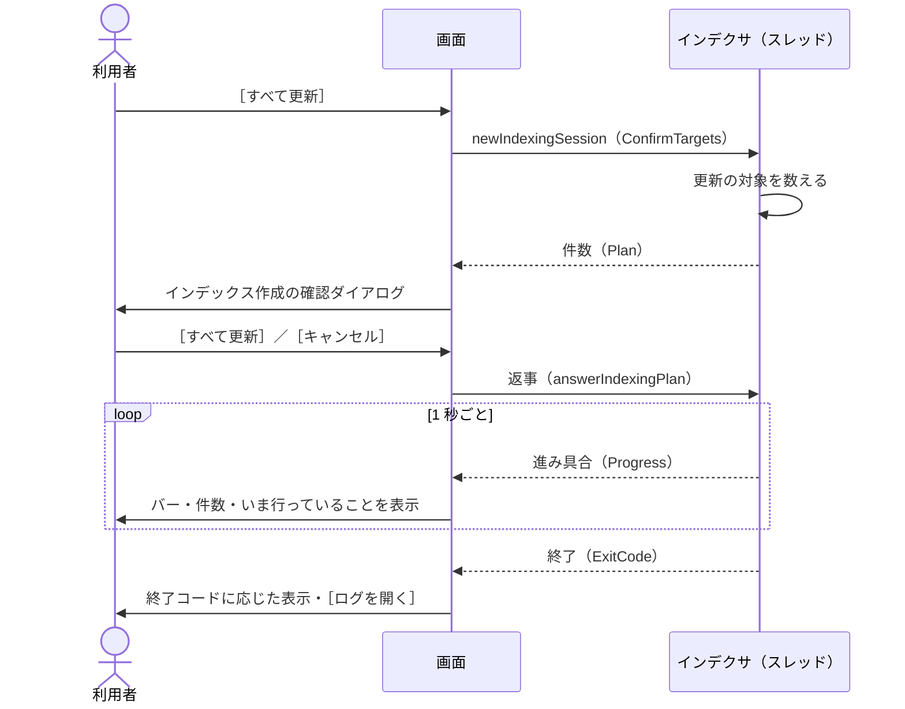
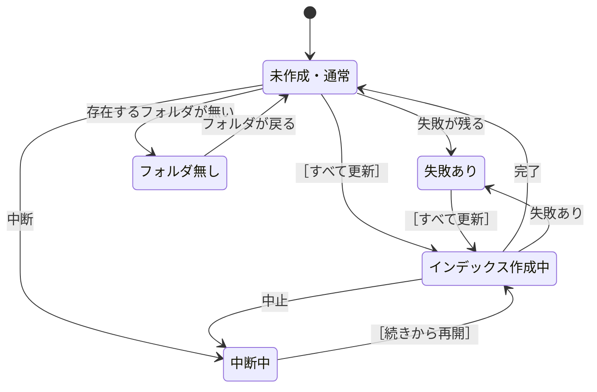

# インデックス作成の実行

扱うこと: ［インデックス管理］タブからインデックス作成を実行するボタンの表示、確認ダイアログ、進み具合の表示、中止・終了・ログ。扱わないこと: インデックスの追加・編集・削除（[インデックス一覧の管理](index-tab.md)）、インデックス作成そのものの流れ（[インデックス作成のメインフロー](../indexing/flow.md)）。先に読むページ: [インデックス一覧の管理](index-tab.md)。

## 実行ボタンの表示

| 状態（[インデックスとインデックス作成の状態](state-flow.md#インデックスとインデックス作成の状態)） | ボタン |
|---|---|
| 未作成・通常 | ［すべて更新］ |
| 中断中 | ［すべて更新］のまま。更新の帯（[更新の帯](#更新の帯)）に `更新を中断しました（残り N 件）` と［続きから再開］を出す |
| 失敗あり | ［すべて更新］。ボタンの下に `前回うまく更新できなかったファイルがあります（押したあとで、もう一度ためすか選べます）。` を出す。失敗分も更新し直すかは、更新の対象を数えた後の確認のダイアログ（[インデックス更新の確認ダイアログ](#インデックス更新の確認ダイアログ)）のチェックボックスで選ぶ |
| 更新中 | 無効。表示は `更新中…`。更新の帯に進み具合と［中止］を表示する（[更新の進み具合](#更新の進み具合)）。［＋ フォルダを追加］［編集…］［削除］も無効にする |
| チェックを付けた、存在するフォルダが無い | 無効。ボタンの下に理由を出す（インデックスが 1 件も無いときは `フォルダを追加すると更新できます`、チェックが 1 つも無いときは `更新するインデックスにチェックを付けてください。`）。ふだんの説明（押すと何が起きるか）はボタンの ToolTip に置き、ボタンの下には理由・失敗の知らせのときだけ出す |

- インデックス作成は、画面のプロセスの中のスレッドで実行する（`newIndexingSession`。インデクサの司令のスレッドが `scripts\tebunko\indexer.ps1 -Channel <受け渡しの口>` を実行する）。受け渡しの口（`newIndexerChannel -confirmTargets $true`）の `ConfirmTargets` で、更新の対象を数えたところでいったん止まって画面の確認（[インデックス更新の確認ダイアログ](#インデックス更新の確認ダイアログ)）を待つ。別の `powershell.exe` は起動しない（[プロセスとスレッド](../structure/threads.md)）。
- 「インデックス作成中」は、この画面で始めたインデックス作成のスレッドが終わるまでとする（`isIndexing`）。インデックス作成の二重起動を防ぐ。
  - 画面を使わずに起動した `indexer.ps1` と重なった場合は、インデクサがミューテックスで止め、`ほかのインデックス作成が実行中です。…` のエラーで終わる（[中止・終了・ログ](#中止終了ログ)）。

## 更新の帯

画面の上（一覧の上。`xaml/index/index.xaml` の `IndexingProgressPanel`）に、更新の状態を 1 枚の帯で出す。帯は更新を始めたとき・中断が残っているときに出て、種類で色を変える（`setIndexingBanner`。`ui/index/index_detail.ps1`）。

| 種類 | 色 | 文言 | 右側 |
|---|---|---|---|
| 更新中 | 青 | `インデックスを更新しています（N / M 件）`（失敗があれば `・失敗 K 件`）。下にバーと、更新中のファイル | `残り約 N 分`・［中止］ |
| 中断 | 黄 | `更新を中断しました（残り N 件）`。残りがあるまま画面を開いたときも出す | ［続きから再開］（［すべて更新］と同じく確認のダイアログから始める） |
| 終わった | 緑（失敗は赤、取りやめ・中止は黄） | 終了コードに応じた文言（[中止・終了・ログ](#中止終了ログ)） | ［ログを開く］ |

- 中断の帯は、残りが無くなったら消す。終わった帯は、次に更新を始めるまで残す。
- ナビの［インデックス管理］の横の印も更新に合わせて変える（更新中は `● 66%`、中断は `中断`、失敗があるだけなら `失敗`。`getIndexNavBadge`）。

## 更新し直しの確かめ

前の版のインデックス（`index\`。しるしあり）が見つかり、`content_index\` が空のまま［すべて更新］を押すと、更新の対象を数える前に確かめのダイアログを出す（`getReingestConfirm`。`tebunko/ui/indexing_view.ps1`）。

- 判定は `hasLegacyIndex`（前の版のしるしがある）と `contentEmpty`（`content_index\` が空）の 2 つの引数だけで決まる（判断層。画面には触らない）。両方が真のときだけ文言を返し、ほかの 3 通りでは確かめを出さない。
- 確かめは共通の確認ダイアログ（[確認ダイアログ](common.md#確認ダイアログshowconfirm)）を使う。見出しは `前の版のインデックスは使えないため、元のファイルをすべて更新し直します。ファイルが多いと時間がかかります。始めますか？`、選択肢は［更新し直す］の 1 つ（＋既定の［キャンセル］）。
- ［キャンセル］（または閉じる）を選ぶと、インデックス作成は始めない。［更新し直す］を選ぶと、通常の流れ（更新の対象を数え、[インデックス更新の確認ダイアログ](#インデックス更新の確認ダイアログ)を出す）に進む。
- 前の版のしるしが無い・`content_index\` が空でない（すでに更新し直した後など）のときは、この確かめを出さずに通常の流れに進む。

## インデックス更新の確認ダイアログ

`tebunko/xaml/dialog_indexing_confirm.xaml`。表題（`インデックス更新の確認`）の下に説明・一覧・合計・注意書き・ボタンを置く。［すべて更新］を押すと、インデクサはまず**更新の対象を数えるだけ**行って止まり（受け渡しの口の `ConfirmTargets`）、インデックスごとの件数を受け渡しの口の `Plan` に入れる（[取り込み対象の決定](../indexing/target-decision.md#取り込み対象の決定createtargetlist)）。
画面は進み具合の段階が `確認` になったらそれを読み、**このダイアログを 1 回だけ開く**。
何件更新するかは元のファイルの更新日時・サイズを調べないと分からないため、数えるのはインデクサで行う（画面は数えている間も固まらない）。

| 部品 | 仕様 |
|---|---|
| 表題・説明 | `インデックス更新の確認`。`元のファイルの更新日時とサイズを、前回更新したときの記録と比べました。［更新を開始］を押すと、更新するファイルだけを更新します。` |
| 一覧 | 1 行 1 インデックス（設定の順）。列は「フォルダ名」「対象ファイル数」（右寄せ）「ステータス」（`StatusBadge`）。ボタンは右下に［キャンセル］［更新を開始］の順（主は右）。フォルダ名に カーソルを置くと元のフォルダを、バッジに置くと内訳を ToolTip に出す |
| 「ステータス」の表示 | 更新するファイルがあれば `要更新`（黄）／無ければ `最新`（緑）／チェックが外れていれば `対象外`（灰）／元のフォルダが見つからなければ `フォルダなし`（赤）。チェックなし・フォルダなしのインデックスは数えないため、「対象ファイル数」は `－` |
| バッジの内訳 | `新規 N 件` `更新あり N 件` `前回未完了 N 件` `インデックスが無い・壊れている N 件` `前回失敗 N 件` のうち 1 件以上のものを ` / ` でつなぐ（`要更新` では `更新するファイル N 件（…）`）。どれも 0 件なら `すべて最新です` |
| 前回失敗の更新し直し | 前回失敗し、その後変わっていないファイルが 1 件以上あるときだけチェックボックスを出す。`前回更新に失敗し、その後変わっていないファイル N 件も更新し直す（パスワード付きなど）`。切り替えると合計の表示も変える（既定は外す） |
| 合計 | 表と同じ枠の最下行（薄い地・太字）に出す。更新するものがあれば `更新対象: N フォルダ / M ファイル（最新のフォルダは更新しません）`。無ければ `更新が必要なファイルはありません（すべて最新です）。` とし、注意書き `更新日時が変わらないまま中身が変わったファイルは、更新の対象になりません。そのインデックスを一から作り直すときは、［削除］してから追加し直してください。` を添える |
| 注意書き | 常に 2 行。`※ 更新には時間がかかることがあります。途中で中止しても、次回は続きから再開できます。` と（左に Lucide の info の印を付けた）`更新のとき、Office のファイルはいったんこの PC にコピーしてから読み込み、読み終えたらコピーを削除します。元のファイルは開いたままにしないため、更新中も編集・保存できます。` |
| ［更新を開始］ | 更新する返事（`answerIndexingPlan`。`@{RetryFailed}`）を受け渡しの口に入れ、インデクサの待ちを解く。失敗分も更新し直すかは、返事の `RetryFailed` で伝える。更新するものが無いときは表示を［閉じる］にし、［キャンセル］は出さない（押してもインデクサはそのまま終わるだけのため） |
| ［キャンセル］ | 取りやめの返事（`answerIndexingPlan` に `$null`）を受け渡しの口に入れる。インデクサは 1 件も更新せずに終了コード 2 で終わる。**取り込み一覧は前回のまま**にする（更新の対象にした行を「未取り込み」で記録すると、次回の表示が中断したように見えるため） |

- インデックスごとの件数を一覧で見せるため、共通の確認ダイアログ（[確認ダイアログ](common.md#確認ダイアログshowconfirm)）ではなく専用のダイアログにする。ボタンの文言を操作そのものにする点は同じ。
- ダイアログを開いている間も進み具合のタイマーは動くため、**開く前に「開いた」ことにして**二重に開かないようにする。
- 返事をしない場合、インデクサは 60 分で取りやめる（待ち続けないため）。確認を待っている間に画面を閉じると、更新を止めてから閉じる（[中止・終了・ログ](#中止終了ログ)）。

## インデックス一覧を変更したとき

確認は出さずにそのまま保存する。
取り込み一覧（`<ワークスペース>\ingest_status.tsv`）の行はインデックス名で元のフォルダと対応させるため、元のフォルダの場所を変えても取り込み一覧は作り直さない（[取り込み一覧](../indexing/ingest-list.md)）。
そのため、変更前のフォルダの相対パスのまま新しいフォルダを処理することはない。

## 更新の進み具合

インデックス作成は別のスレッドで動くため、画面は**インデクサが受け渡しの口に入れる進み具合**（`readIndexingProgress`）を 1 秒ごとに読んで表示する（ファイルは読まない）。

| 状況 | 判定（進み具合の段階） | 表示 |
|---|---|---|
| クロール中 | `クロール` | 動き続けるバー。`更新するファイルを調べています…`。下に、インデクサが今していること（`インデックス作成の準備をしています…`・`[<インデックス名>] の対象ファイルを探しています… <パス>`・`更新済みのインデックスを確認しています…`・`更新の記録を書き出しています…`） |
| インデックス作成の確認待ち | `確認` | 動き続けるバー（タスクバーは黄色）。`更新する内容を確認してください`、`更新するインデックスの一覧を表示しています。`。確認のダイアログを開く（[インデックス更新の確認ダイアログ](#インデックス更新の確認ダイアログ)） |
| 更新の開始前 | `取り込み` で処理済みが 0 | 動き続けるバー。`N 件のファイルを更新します`、`更新中のファイル：<相対パス>` |
| 更新中 | `取り込み` で処理済みが 1 件以上 | バー（処理済み ÷（処理済み＋残り））、`インデックスを更新しています（14 / 31 件・失敗 1 件）`、`残り約 N 分`（1 分未満は `残り 1 分未満`。最初の 1 件が終わってからの速さで計算）、`更新中のファイル：<相対パス>` |
| 後片付け中 | `仕上げ` | 動き続けるバー。`インデックス作成を終えています…`、`Officeアプリを終了しています…` / `更新の記録を書き直しています…` |
| 終わった | インデックス作成のスレッドが終わった | 終了コードに応じて表示する（[中止・終了・ログ](#中止終了ログ)）。状態・件数を読み直す |

- タスクバーのアイコンにも進み具合を表示する（失敗があれば黄色）。**インデックス作成が終わったとき、進み具合とステータスで知らせる**。前面には割り込まず、タスクバーのボタンも光らせない（光らせるには P/Invoke（`FlashWindowEx`）が要るため。[実行時コンパイル（csc.exe）を使わない](implementation.md#実行時コンパイルcscexeを使わない)）。
- **取り込み一覧（`work/ingest_status.tsv`）は毎秒読まない**。数万行になると 1 回の読み直しに数秒かかり（5 万行で約 5.8 秒）、1 秒ごとに読むと画面が固まる（「応答なし」になる）。進み具合はインデクサが数えて受け渡しの口に入れる（[インデックス作成のメインフロー](../indexing/flow.md)）。
- 「処理済み」はインデクサが数えた件数（今回の実行で更新したファイルと、更新に失敗したファイル）。前回失敗したファイルを更新し直す場合（確認のダイアログでチェックを付けた場合）も、その分は最初から件数に入る。

## 中止・終了・ログ

- 確認のダイアログを出している間の取りやめは、ダイアログの［キャンセル］で行う（[インデックス更新の確認ダイアログ](#インデックス更新の確認ダイアログ)）。
- インデックス作成中は、更新の帯の右に［中止］を表示する。押すと確認ダイアログ（[確認ダイアログ](common.md#確認ダイアログshowconfirm)）を出す。見出しは `インデックスの更新を中止しますか？`、補足は `更新したところまでは残ります。あとで続きから再開できます。`、ボタンは［中止する］（既定は［キャンセル］）。［中止する］で受け渡しの口の `Stop` を立てる（`requestIndexingStop`）。インデクサは更新中のファイルが終わったところで止まり、終了コード 2 で終わる。終わるまでは `中止しています…（更新中のファイルが終わるまでお待ちください）` と表示する。
- インデックス作成のスレッドが終わったら、終了コード（受け渡しの口の `ExitCode`。`IndexingSession.GetExitCode`）に応じて次のように表示する。

| 終了コード | 表示 |
|---|---|
| 0 | 判断層（`getIndexingEndText`。`indexing_view.ps1`）が、成功・失敗・後回しにした件数、終わりの案内（`IndexingSession.GetNotice`）から見出しと説明を決める（上から見て最初に当たるもの）。 ・更新した（成功＋失敗）が 1 件以上: `更新が終わりました（成功 N 件 / 失敗 M 件）`（後回しがあれば `/ 残り K 件` を加える）。失敗があれば `失敗したファイルと原因は「更新に失敗したファイル」の一覧で確認できます。`、後回しがあれば終わりの案内を続けて加える ・更新したのが 0 件で、後回しがある: `更新が終わりました（更新せずに残したファイル K 件）`、説明に終わりの案内 ・どちらも 0 件: `更新が必要なファイルはありませんでした` |
| 2（確認で取りやめた） | `更新を取りやめました`、`更新したファイルはありません。［すべて更新］を押すと、もう一度確認できます。` |
| 2（中止した） | `更新を中止しました（成功 N 件 / 失敗 M 件 / 残り K 件）`、`次回は続きから再開できます。` |
| 1（続けられないエラー。クロール対象フォルダが無い など） | 受け渡しの口の `Error`（`IndexingSession.GetError`。無ければスレッドが止まった理由）を読み、`インデックスを更新できませんでした` とそのメッセージを表示する。同じ内容をエラーのダイアログでも出す |

利用者の PowerPoint が起動していて更新できなかったファイルがあるときの終わりの案内（`Notice`）は `PowerPoint が起動していたため、K 件を更新せずに残しました。PowerPoint を閉じてから、もう一度インデックス作成を始めると更新します。`（[取り込み一覧](../indexing/ingest-list.md#強制終了時間切れからの再開)「PowerPoint が要るファイルの後回し（Postponed）」）。後回しにしたファイルは「未取り込み」のまま残るため、次に画面を開いたときの表示は [状態遷移](state-flow.md) の「中断中」と同じになる。

- インデックス作成が終わると［ログを開く］を表示する。インデックス作成のログ `work/indexing_log.txt`（`$workspace.IndexingLogFile`。インデクサの実行記録）を開く。
- インデックス作成中にウィンドウを閉じようとすると、確認ダイアログ（[確認ダイアログ](common.md#確認ダイアログshowconfirm)）を出す。見出しは `インデックスを更新中です。中止して閉じますか？`、補足は `更新したところまでは残ります。次に起動したときに続きから再開できます。`、ボタンは［中止して閉じる］、キャンセルのボタンは［閉じない］。インデックス作成は画面のプロセスの中で動くため、続けたまま閉じることはできない。［中止して閉じる］を押すと、閉じるのを保留して中止を求め、進み具合欄に `更新を止めています…` と出す。止まったら閉じる。60 秒たっても止まらなければ、インデックス作成が起動した Office だけを止め、さらに 15 秒たっても止まらなければそのまま閉じる（[閉じる](state-flow.md#閉じる)）。
