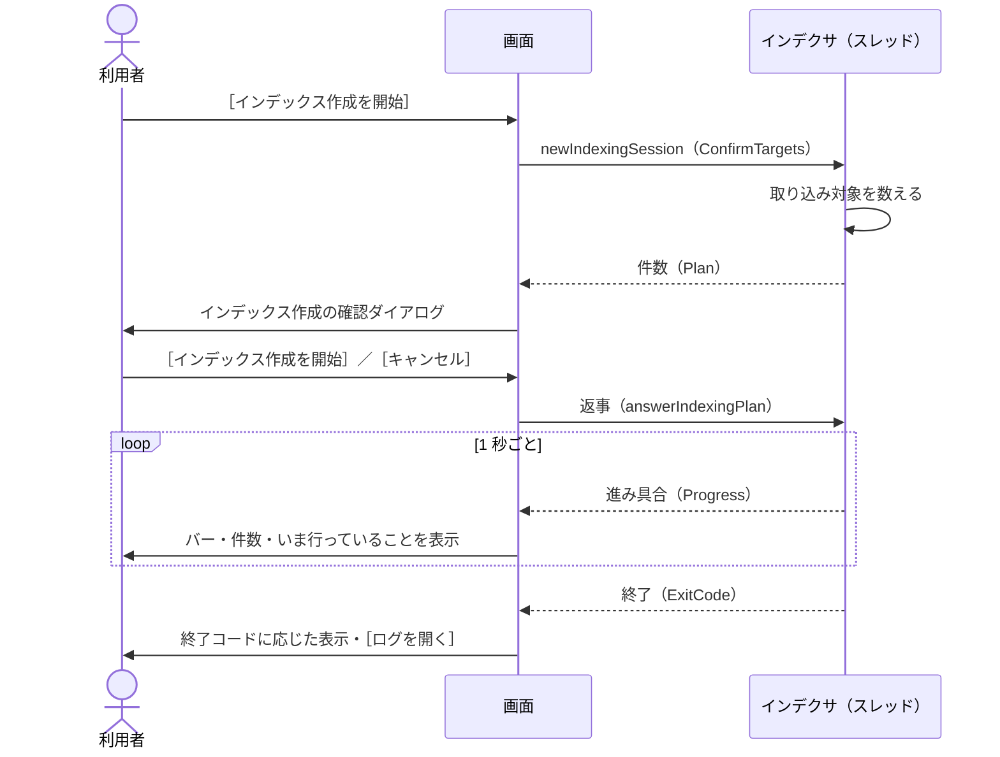

# インデックス作成の実行

扱うこと: ［1 インデックス管理］タブからインデックス作成を実行するボタンの表示、確認ダイアログ、進み具合の表示、中止・終了・ログ。扱わないこと: インデックスの追加・編集・削除（[インデックス一覧の管理](index-tab.md)）、インデックス作成そのものの流れ（[インデックス作成のメインフロー](../indexing/flow.md)）。先に読むページ: [インデックス一覧の管理](index-tab.md)。

## 実行ボタンの表示

| 状態（[インデックスとインデックス作成の状態](state-flow.md#インデックスとインデックス作成の状態)） | ボタン |
|---|---|
| 未作成・通常 | ［インデックス作成を開始］ |
| 中断中 | ［続きから再開（残り N 件）］ |
| 失敗あり | ［インデックス作成を開始］（中断中なら［続きから再開（残り N 件）］）。注意書きの前に `前回うまく取り込めなかったファイルがあります（押したあとで、もう一度ためすか選べます）。` を付ける。失敗分も再取り込みするかは、取り込み対象を数えた後の確認のダイアログ（[インデックス作成の確認ダイアログ](#インデックス作成の確認ダイアログ)）のチェックボックスで選ぶ |
| インデックス作成中 | 無効。表示は `インデックス作成中…`。進み具合と［中止］を表示する（[インデックス作成の進み具合](#インデックス作成の進み具合)）。［追加…］［編集…］［削除］も無効にする |
| チェックを付けた、存在するフォルダが無い | 無効。注意書きを `まずインデックスを追加して、［作成］にチェックを付けてください。` にする |

- インデックス作成は、画面のプロセスの中のスレッドで実行する（`newIndexingSession`。インデクサの司令のスレッドが `scripts\tebunko\indexer.ps1 -Channel <受け渡しの口>` を実行する）。受け渡しの口（`newIndexerChannel -confirmTargets $true`）の `ConfirmTargets` で、取り込み対象を数えたところでいったん止まって画面の確認（[インデックス作成の確認ダイアログ](#インデックス作成の確認ダイアログ)）を待つ。別の `powershell.exe` は起動しない（[プロセスとスレッド](../structure/threads.md)）。
- 「インデックス作成中」は、この画面で始めたインデックス作成のスレッドが終わるまでとする（`isIndexing`）。インデックス作成の二重起動を防ぐ。
  - 画面を使わずに起動した `indexer.ps1` と重なった場合は、インデクサがミューテックスで止め、`ほかのインデックス作成が実行中です。…` のエラーで終わる（[中止・終了・ログ](#中止終了ログ)）。

## 取り込み直しの確かめ

前の版のインデックス（`index\`。しるしあり）が見つかり、`content_index\` が空のまま［インデックス作成を開始］を押すと、取り込み対象を数える前に確かめのダイアログを出す（`getReingestConfirm`。`tebunko/ui/indexing_view.ps1`）。

- 判定は `hasLegacyIndex`（前の版のしるしがある）と `contentEmpty`（`content_index\` が空）の 2 つの引数だけで決まる（判断層。画面には触らない）。両方が真のときだけ文言を返し、ほかの 3 通りでは確かめを出さない。
- 確かめは共通の確認ダイアログ（[確認ダイアログ](common.md#確認ダイアログshowconfirm)）を使う。見出しは `前の版のインデックスは使えないため、元のファイルをすべて取り込み直します。ファイルが多いと時間がかかります。始めますか？`、選択肢は［取り込み直す］の 1 つ（＋既定の［キャンセル］）。
- ［キャンセル］（または閉じる）を選ぶと、インデックス作成は始めない。［取り込み直す］を選ぶと、通常の流れ（取り込み対象を数え、[インデックス作成の確認ダイアログ](#インデックス作成の確認ダイアログ)を出す）に進む。
- 前の版のしるしが無い・`content_index\` が空でない（すでに取り込み直した後など）のときは、この確かめを出さずに通常の流れに進む。

## インデックス作成の確認ダイアログ

`tebunko/xaml/dialog_indexing_confirm.xaml`。［インデックス作成を開始］を押すと、インデクサはまず**取り込み対象を数えるだけ**行って止まり（受け渡しの口の `ConfirmTargets`）、インデックスごとの件数を受け渡しの口の `Plan` に入れる（[取り込み対象の決定](../indexing/target-decision.md#取り込み対象の決定createtargetlist)）。
画面は進み具合の段階が `確認` になったらそれを読み、**このダイアログを 1 回だけ開く**。
何件取り込むかは元のファイルの更新日時・サイズを調べないと分からないため、数えるのはインデクサで行う（画面は数えている間も固まらない）。

| 部品 | 仕様 |
|---|---|
| 表題・説明 | `インデックス作成の確認`。`元のファイルの更新日時とサイズを、前回取り込んだときの記録と比べました。［インデックス作成を開始］を押すと、取り込み対象のファイルだけを取り込みます。` |
| 一覧 | 1 行 1 インデックス（設定の順）。列は「インデックス」「取り込み対象」「内訳」「Office ファイル」（見つかった数）「元のフォルダ」。入りきらない文字は `…` で省略し、ツールチップに全体を出す |
| 「取り込み対象」の表示 | 取り込むファイルがあれば `N 件`（青）／無ければ `更新不要`（緑）／［作成］のチェックが外れていれば `取り込みません`（灰）／元のフォルダが見つからなければ `取り込めません`（赤）。チェックなし・フォルダなしのインデックスは数えないため、「Office ファイル」は `－` |
| 「内訳」の表示 | `新規 N 件` `更新あり N 件` `前回未完了 N 件` `インデックスが無い・壊れている N 件` `前回失敗 N 件` のうち 1 件以上のものを ` / ` でつなぐ。どれも 0 件なら `すべて取り込み済みです` |
| 前回失敗の再取り込み | 前回失敗し、その後更新されていないファイルが 1 件以上あるときだけチェックボックスを出す。`前回取り込みに失敗し、その後更新されていないファイル N 件も再取り込みする（パスワード付きなど）`。切り替えると合計の表示も変える（既定は外す） |
| 合計 | 取り込むものがあれば `合計 N 件を取り込みます。`。無ければ `更新が必要なファイルはありません（すべて取り込み済みです）。` とし、注意書き `更新日時が変わらないまま中身が変わったファイルは、取り込み対象になりません。そのインデックスを一から作り直すときは、［削除］してから追加し直してください。` を添える |
| ［インデックス作成を開始］ | 取り込む返事（`answerIndexingPlan`。`@{RetryFailed}`）を受け渡しの口に入れ、インデクサの待ちを解く。失敗分も再取り込みするかは、返事の `RetryFailed` で伝える。取り込むものが無いときは表示を［閉じる］にし、［キャンセル］は出さない（押してもインデクサはそのまま終わるだけのため） |
| ［キャンセル］ | 取りやめの返事（`answerIndexingPlan` に `$null`）を受け渡しの口に入れる。インデクサは 1 件も取り込まずに終了コード 2 で終わる。**取り込み一覧は前回のまま**にする（取り込み対象にした行を「未取り込み」で記録すると、次回の表示が［続きから再開］になり、中断したように見えるため） |

- インデックスごとの件数を一覧で見せるため、共通の確認ダイアログ（[確認ダイアログ](common.md#確認ダイアログshowconfirm)）ではなく専用のダイアログにする。ボタンの文言を操作そのものにする点は同じ。
- ダイアログを開いている間も進み具合のタイマーは動くため、**開く前に「開いた」ことにして**二重に開かないようにする。
- 返事をしない場合、インデクサは 60 分で取りやめる（待ち続けないため）。確認を待っている間に画面を閉じると、インデックス作成を止めてから閉じる（[中止・終了・ログ](#中止終了ログ)）。

## インデックス一覧を変更したとき

確認は出さずにそのまま保存する。
取り込み一覧（`<ワークスペース>\取り込み一覧.tsv`）の行はインデックス名で元のフォルダと対応させるため、元のフォルダの場所を変えても取り込み一覧は作り直さない（[取り込み一覧](../indexing/ingest-list.md)）。
そのため、変更前のフォルダの相対パスのまま新しいフォルダを処理することはない。

## インデックス作成の進み具合

インデックス作成は別のスレッドで動くため、画面は**インデクサが受け渡しの口に入れる進み具合**（`readIndexingProgress`）を 1 秒ごとに読んで表示する（ファイルは読まない）。

| 状況 | 判定（進み具合の段階） | 表示 |
|---|---|---|
| クロール中 | `クロール` | 動き続けるバー。`クロールしています…`。下に、インデクサが今していること（`インデックス作成の準備をしています…`・`[<インデックス名>] のOfficeファイルを探しています… <パス>`・`取り込み済みのインデックスを確認しています…`・`取り込み一覧を書き出しています…`） |
| インデックス作成の確認待ち | `確認` | 動き続けるバー（タスクバーは黄色）。`取り込む内容を確認してください`、`取り込み対象の一覧を表示しています。`。確認のダイアログを開く（[インデックス作成の確認ダイアログ](#インデックス作成の確認ダイアログ)） |
| 取り込みの開始前 | `取り込み` で処理済みが 0 | 動き続けるバー。`N 件のファイルを取り込みます`、`取り込み中のファイル：<相対パス>` |
| 取り込み中 | `取り込み` で処理済みが 1 件以上 | バー（処理済み ÷（処理済み＋残り））、`インデックス作成中… 14 / 31 件（失敗 1 件）`、`残り約 N 分`（1 分未満は `残り 1 分未満`。最初の 1 件が終わってからの速さで計算）、`取り込み中のファイル：<相対パス>` |
| 後片付け中 | `仕上げ` | 動き続けるバー。`インデックス作成を終えています…`、`Officeアプリを終了しています…` / `取り込み一覧を書き直しています…` |
| 終わった | インデックス作成のスレッドが終わった | 終了コードに応じて表示する（[中止・終了・ログ](#中止終了ログ)）。状態・件数を読み直す |

- タスクバーのアイコンにも進み具合を表示する（失敗があれば黄色）。**インデックス作成が終わったとき、進み具合とステータスで知らせる**。前面には割り込まず、タスクバーのボタンも光らせない（光らせるには P/Invoke（`FlashWindowEx`）が要るため。[実行時コンパイル（csc.exe）を使わない](implementation.md#実行時コンパイルcscexeを使わない)）。
- **取り込み一覧（`work/取り込み一覧.tsv`）は毎秒読まない**。数万行になると 1 回の読み直しに数秒かかり（5 万行で約 5.8 秒）、1 秒ごとに読むと画面が固まる（「応答なし」になる）。進み具合はインデクサが数えて受け渡しの口に入れる（[インデックス作成のメインフロー](../indexing/flow.md)）。
- 「処理済み」はインデクサが数えた件数（今回の実行で取り込んだファイルと、取り込みに失敗したファイル）。前回失敗したファイルを再取り込みする場合（確認のダイアログでチェックを付けた場合）も、その分は最初から件数に入る。

## 中止・終了・ログ

- 確認のダイアログを出している間の取りやめは、ダイアログの［キャンセル］で行う（[インデックス作成の確認ダイアログ](#インデックス作成の確認ダイアログ)）。
- インデックス作成中は、進み具合の右に［中止］を表示する。押すと確認ダイアログ（[確認ダイアログ](common.md#確認ダイアログshowconfirm)）を出す。見出しは `インデックス作成を中止しますか？`、結果は `→ いま取り込んでいるファイルが終わったところで止まります` ／ `✓ ここまで取り込んだ分はそのまま残ります`（`次に［インデックス作成を開始］を押すと、続きから再開します`）、ボタンは［中止する］（既定は［キャンセル］）。［中止する］で受け渡しの口の `Stop` を立てる（`requestIndexingStop`）。インデクサは取り込み中のファイルが終わったところで止まり、終了コード 2 で終わる。終わるまでは `中止しています…（取り込み中のファイルが終わるまでお待ちください）` と表示する。
- インデックス作成のスレッドが終わったら、終了コード（受け渡しの口の `ExitCode`。`IndexingSession.GetExitCode`）に応じて次のように表示する。

| 終了コード | 表示 |
|---|---|
| 0 | `インデックス作成が終わりました（成功 N 件 / 失敗 M 件）`。失敗があれば `失敗したファイルと原因は「取り込みに失敗したファイル」の一覧で確認できます。` を加える。取り込んだファイルが無ければ `取り込みが必要なファイルはありませんでした` |
| 2（確認で取りやめた） | `インデックス作成を取りやめました`、`取り込んだファイルはありません。［インデックス作成を開始］を押すと、もう一度確認できます。` |
| 2（中止した） | `インデックス作成を中止しました（成功 N 件 / 失敗 M 件 / 残り K 件）`、`次回は続きから再開できます。` |
| 1（続けられないエラー。クロール対象フォルダが無い など） | 受け渡しの口の `Error`（`IndexingSession.GetError`。無ければスレッドが止まった理由）を読み、`インデックスを作成できませんでした` とそのメッセージを表示する。同じ内容をエラーのダイアログでも出す |

- インデックス作成が終わると［ログを開く］を表示する。インデックス作成のログ `work/インデックス作成ログ.txt`（`$workspace.IndexingLogFile`。インデクサの実行記録）を開く。
- インデックス作成中にウィンドウを閉じようとすると、確認ダイアログ（[確認ダイアログ](common.md#確認ダイアログshowconfirm)）を出す。見出しは `まだインデックス作成の途中です。止めてから閉じますか？`、結果は `→ いま取り込んでいるファイルが終わったところで止まり、画面を閉じます` ／ `✓ ここまで取り込んだ分はそのまま残ります`（`次に開いて［インデックス作成を開始］を押すと、続きから再開します`）、ボタンは［インデックス作成を止めて閉じる］、キャンセルのボタンは［閉じない］。インデックス作成は画面のプロセスの中で動くため、続けたまま閉じることはできない。［インデックス作成を止めて閉じる］を押すと、閉じるのを保留して中止を求め、進み具合欄に `インデックス作成を止めています…` と出す。止まったら閉じる。60 秒たっても止まらなければ、インデックス作成が起動した Office だけを止め、さらに 15 秒たっても止まらなければそのまま閉じる（[閉じる](state-flow.md#閉じる)）。
