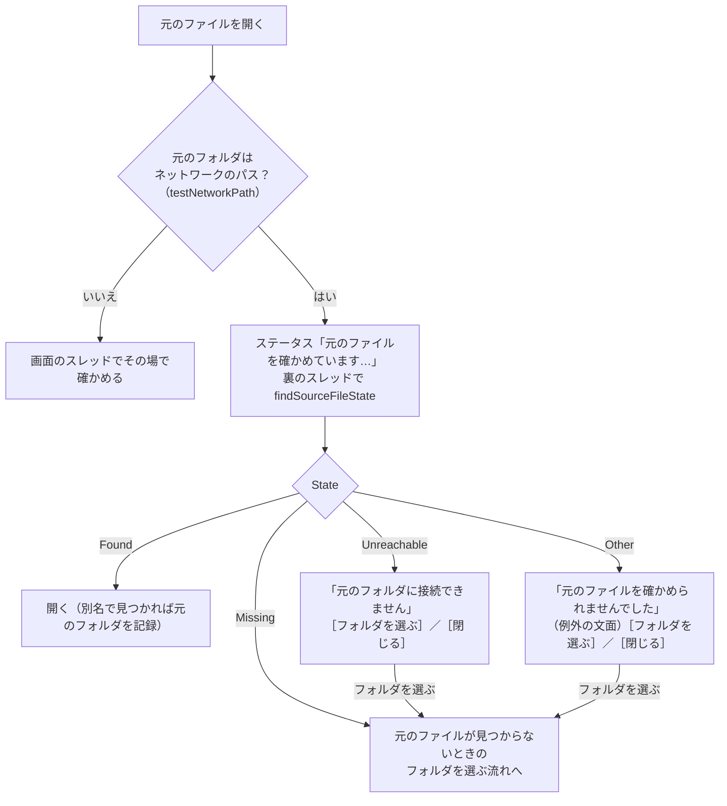

# 元のフォルダ・元のファイル・ワークスペースがネットワークにあるとき

扱うこと: 元のフォルダ・元のファイル・ワークスペースが UNC パス・ネットワークドライブにあるときに、画面が固まらないように確かめる仕組み。扱わないこと: 元のファイルを開く処理そのもの（[元のファイルを開く](open-file.md)）。先に読むページ: [元のファイルを開く](open-file.md)。

元のフォルダが UNC パス（`\\server\share\…`）・ネットワークドライブにあると、届かない共有（VPN の切断・サーバーの停止）では `Test-Path` などの OS の呼び出しが十数秒〜二十秒戻らず、画面のスレッドで確かめると「応答なし」になる（[スレッドの一覧](../structure/threads.md#スレッドの一覧)）。このため、ネットワークのパスかどうかを `testNetworkPath` で共有に接続せずに見分け、ネットワークのパスだけを裏のスレッド（`startJob -queue "network"`。[別スレッドとタイマーの扱い](responsiveness.md)）で `findSourceFileState` に確かめさせる。ローカルのパスは今までどおり画面のスレッドでその場で確かめ、速さは変わらない。

- **見つかった・見つからない・接続できない・その他の 4 つに分ける**（`getPathState`。`shared/core/fs.ps1`）。`Test-Path`・`File.Exists` は届かない共有でも例外を出さず `$false` を返すことがあり、「見つからない」と区別できないため、例外を投げる `[System.IO.File]::GetAttributes` で調べる。PowerShell からの呼び出しで包まれる `MethodInvocationException` は、中の例外の `HResult` の下位 16 ビット（Win32 のエラー番号）で分ける（`getPathErrorKind`）。
  - 接続できない: `ERROR_BAD_NETPATH`・`ERROR_BAD_NET_NAME`・`ERROR_NETNAME_DELETED`・`ERROR_SEM_TIMEOUT`・`ERROR_NETWORK_UNREACHABLE`・`ERROR_HOST_UNREACHABLE`・`ERROR_NO_NET_OR_BAD_PATH`
  - その他: アクセス拒否・ログオンの失敗など、上のどれにも当たらないもの
- **接続できない・その他のときは、上のフォルダも別名も調べない**（同じサーバーで待たされるか、同じ理由で失敗するだけのため）。見つからないときだけ、[元のファイルが見つからないとき（元のフォルダを設定する）](open-file.md#元のファイルが見つからないとき元のフォルダを設定する)の別名・フォルダを選ぶ流れに進む。
- **待っている間に別の行を開く・新しく検索する・ワークスペースを変えると、前の依頼の結果は捨てる**（依頼に番号を付け、最後の依頼だけを反映する。プレビューの `previewRequest` と同じ形）。同じ行をもう一度開いても、依頼は重ねない。
- **待っている間、ステータスに `元のファイルを確かめています…：<パス>（共有フォルダに接続できないときは、しばらくかかります）` を出し、マウスのカーソルを `AppStarting` にする。** 画面は操作できる（ほかの行を選ぶ・プレビューを見るなど）。
- **接続できないときのダイアログ**: 見出しは `<ファイル名> を開けません`。知らせは `✗ 元のフォルダに接続できません`（`<元のフォルダ>`）＋ `→ ネットワーク・VPN の接続を確かめてから、もう一度開いてください`。選択肢は［フォルダを選ぶ］（選べば見つからないときと同じ流れに進む）と［閉じる］。ステータスは `元のフォルダに接続できません：<元のフォルダ>`。
- **その他のときのダイアログ**: 知らせは `✗ 元のファイルを確かめられませんでした`（例外の文面）＋ `→ アクセスの権限・サインインを確かめてください`。ステータスは `元のファイルを確かめられませんでした：<例外の文面>`。
- **ローカルのパスには別名が無いため、ローカルのときは `getDriveTargets`（CIM）を呼ばない。** ネットワークのパスで別名（ネットワークドライブ⇔UNC）を調べるときだけ、ドライブの割り当てを照会する（キャッシュが空なら裏のスレッドで照会してよい）。
- **更新に失敗したファイルのダブルクリック**（[インデックス一覧の管理](index-tab.md)の一覧）も同じ形にする。ステータスは `元のファイルを確かめています…：<パス>`、接続できないときは `元のフォルダに接続できません：<パス>`（見つからないときの文言とは別にする）。

## ワークスペースがネットワークにあるとき

ワークスペース（インデックス・取り込み一覧・ログの置き場所）が UNC パス・ネットワークドライブにあるときも、届かない共有で画面が固まらないようにする。画面のスレッドは、ワークスペースの中のファイル・フォルダに触らない。判定は同じ `testNetworkPath`（共有に接続せず、文字列だけで見分ける）で、ローカルのワークスペースは今までどおり画面のスレッドでその場で行う。

- **列の選び方は `getWorkspaceJobQueue`**（`core/workspace.ps1`）の 1 つだけ。渡した場所（ワークスペース・インデックスのフォルダ・元のフォルダ・Office の記録の置き場所・書き出し先など。複数でもよい）に 1 つでもネットワークのパスがあれば `"network"`、無ければ `"default"` を返す。ワークスペースの中に触る仕事（取り込みの状態・件数の集計、削除・名前の変更、エクスポート・インポート、高速検索の確かめを含む）は `startJob` にこの列を渡し、元のフォルダの確かめと同じネットワークを調べる列で動かす。`"network"` の文字を直接書かない。
- **ネットワークのワークスペースで裏に出す操作**

  | 操作 | 裏で行うこと |
  |---|---|
  | 起動・ワークスペースの切り替え | 前の版のインデックスの有無を調べ、あれば分かったときにステータスへ出す（`refreshLegacyIndexMessage`）。起動時の画面は、中身を調べずに［検索］を開く（`testStartupIndexExists`） |
  | 検索対象のツリー（［検索］の左の欄） | インデックスの一覧・フォルダの子を読む（`loadIndexTree`・`expandIndexNode`）。読み込み中は検索できず、届かなければ「ワークスペースに接続できません」を見出しと欄に出す |
  | インデックス一覧の読み込み | 名前の決まっていないインデックスへの名前の割り当て（`loadTargets`） |
  | インデックスの名前の変更・削除 | 改名・削除と、取り込み一覧・設定の書き換え（`startIndexStoreJob`）。終わるまで他の操作を止める |
  | 元のフォルダの記録（`source_folder.txt`）の書き直し | `updateIndexSourceFile` |
  | 検索結果から元のファイルを開く | 元のファイルの場所の記録を読む（`getSourceLocation`） |
  | インデックス作成の開始 | 始める前にワークスペースが届くかと前の版のインデックスの有無を確かめる（`startIndexing`）。届かなければ始めない |

- **名前の変更・削除の進み方**: 改名の仕事は、インデックスのフォルダの改名・取り込み一覧の書き換え・元のフォルダの記録の書き直しをまとめて行い、結果を分けて返す。元のフォルダの記録だけが書けなかったときは、改名の失敗にせず、書けなかったことだけをステータスに出す。仕事の間にウィンドウを閉じようとしたら、1 回目は閉じずに終わりを待ち、終わってから閉じる（もう一度閉じようとしたときは待たずに閉じる）。インデックス名の割り当て（`loadTargets`）の間は、追加・削除・名前の変更・作成の開始を止める（設定の保存で、まだ一覧に出ていないインデックスが消えないように）。
- **記録の書き直しと画面の読み直しの順**: 追加・変更・削除で `updateIndexSourceFile`（裏）を出したあと、`refreshIndexViews` はその終わりを待たずに続ける。画面が読み直すのは一覧・件数・状態で、元のフォルダの記録は元のファイルを開くときに読み直す（`$script:sourceFolderMaps` を捨てて、次に開くときに読む）ため、順が前後しても結果は変わらない。
- **検索結果から開く・パスをコピーは、依頼の番号を別にする**（`openSourceRequest`・`copySourceRequest`）。一方の依頼が、もう一方の結果を黙って捨てない。検索し直し・ワークスペースの変更では両方を捨てる。
- **待っている間は、ステータスにその旨を出す**（例: `インデックス名を決めています…（共有フォルダに接続できないときは、しばらくかかります）`）。画面は操作できる。操作を止めるのは、書き込む仕事（名前の変更・削除・作成の開始）の間だけで、止めている間の表示は `getIndexJobBlocker` が決める（`削除・名前の変更中`）。
- **待っている間にワークスペースを切り替えたら、前の依頼の結果は捨てる**（依頼に番号を付け、最後の依頼だけを反映する）。
- **画面のスレッドに残すもの**: 利用者が今選んだフォルダ（［変更…］で選んだ先）への操作と、ワークスペースの中身を移す処理（`applyWorkspace`・`moveWorkspace`）、まれなエラーログの書き込み（`writeErrorLog`）。選んだ直後のフォルダは届くと分かっているため、また、落ちる前に確実に残す必要があるため。
- **見落としを防ぐ検査**: `tests/meta/ui_thread_io.Tests.ps1` が、状態層の関数・クラスのメソッドのうちファイル・フォルダに触るもの（それを呼ぶものも、たどって）を自動で見つけ、画面のスレッドで動く呼び出し（`startJob` の仕事のスクリプトブロックの外）を一覧にある理由付きのものだけに限る。状態層に新しく触る関数を足しても、画面から呼べば検査が落ちる（[スレッドの一覧](../structure/threads.md#スレッドの一覧)）。
