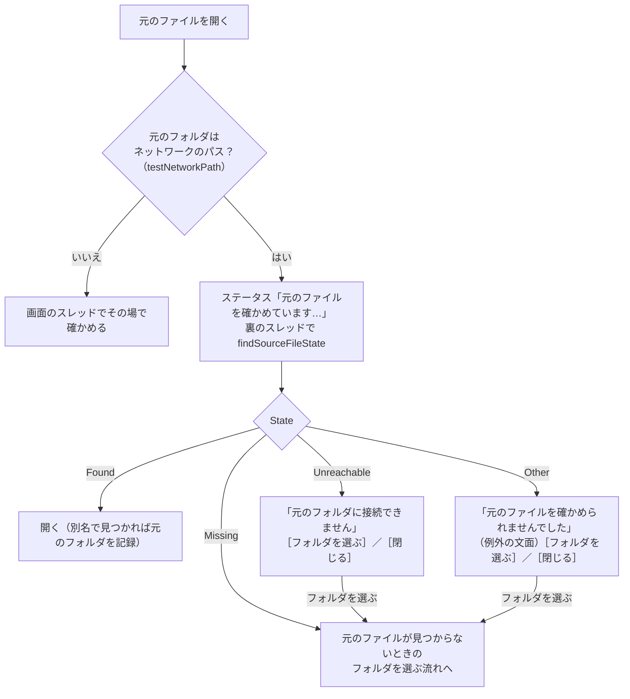

# 元のフォルダ・元のファイルがネットワークにあるとき

扱うこと: 元のフォルダ・元のファイルが UNC パス・ネットワークドライブにあるときに、画面が固まらないように確かめる仕組み。扱わないこと: 元のファイルを開く処理そのもの（[元のファイルを開く](open-file.md)）。先に読むページ: [元のファイルを開く](open-file.md)。

元のフォルダが UNC パス（`\\server\share\…`）・ネットワークドライブにあると、届かない共有（VPN の切断・サーバーの停止）では `Test-Path` などの OS の呼び出しが十数秒〜二十秒戻らず、画面のスレッドで確かめると「応答なし」になる（[スレッドの一覧](../structure/threads.md#スレッドの一覧)）。このため、ネットワークのパスかどうかを `testNetworkPath` で共有に接続せずに見分け、ネットワークのパスだけを裏のスレッド（`startJob -queue "network"`。[別スレッドとタイマーの扱い](responsiveness.md)）で `findSourceFileState` に確かめさせる。ローカルのパスは今までどおり画面のスレッドでその場で確かめ、速さは変わらない。

- **見つかった・見つからない・接続できない・その他の 4 つに分ける**（`getPathState`。`shared/core/fs.ps1`）。`Test-Path`・`File.Exists` は届かない共有でも例外を出さず `$false` を返すことがあり、「見つからない」と区別できないため、例外を投げる `[System.IO.File]::GetAttributes` で調べる。PowerShell からの呼び出しで包まれる `MethodInvocationException` は、中の例外の `HResult` の下位 16 ビット（Win32 のエラー番号）で分ける（`getPathErrorKind`）。
  - 接続できない: `ERROR_BAD_NETPATH`・`ERROR_BAD_NET_NAME`・`ERROR_NETNAME_DELETED`・`ERROR_SEM_TIMEOUT`・`ERROR_NETWORK_UNREACHABLE`・`ERROR_HOST_UNREACHABLE`・`ERROR_NO_NET_OR_BAD_PATH`
  - その他: アクセス拒否・ログオンの失敗など、上のどれにも当たらないもの
- **接続できない・その他のときは、上のフォルダも別名も調べない**（同じサーバーで待たされるか、同じ理由で失敗するだけのため）。見つからないときだけ、[元のファイルが見つからないとき（元のフォルダを設定する）](open-file.md#元のファイルが見つからないとき元のフォルダを設定する)の別名・フォルダを選ぶ流れに進む。
- **待っている間に別の行を開く・新しく検索する・ワークスペースを変えると、前の依頼の結果は捨てる**（依頼に番号を付け、最後の依頼だけを反映する。プレビューの `previewRequest` と同じ形）。同じ行をもう一度開いても、依頼は重ねない。
- **待っている間、ステータスに `元のファイルを確かめています…：<パス>（共有フォルダに接続できないときは、しばらくかかります）` を出し、マウスのカーソルを `AppStarting` にする。** 画面は操作できる（ほかの行を選ぶ・プレビューを見るなど）。
- **接続できないときのダイアログ**: 見出しは `<ファイル名> を開けません`。知らせは `✗ 元のフォルダに接続できません`（`<元のフォルダ>`）＋ `→ ネットワーク・VPN の接続を確かめてから、もう一度開いてください`。選択肢は［フォルダを選ぶ］（選べば見つからないときと同じ流れに進む）と［閉じる］。ステータスは `元のフォルダに接続できません：<元のフォルダ>`。
- **その他のときのダイアログ**: 知らせは `✗ 元のファイルを確かめられませんでした`（例外の文面）＋ `→ アクセスの権限・サインインを確かめてください`。ステータスは `元のファイルを確かめられませんでした：<例外の文面>`。
- **ローカルのパスには別名が無いため、ローカルのときは `getDriveTargets`（CIM）を呼ばない。** ネットワークのパスで別名（ネットワークドライブ⇔UNC）を調べるときだけ、ドライブの割り当てを照会する（キャッシュが空なら裏のスレッドで照会してよい）。
- **取り込みに失敗したファイルのダブルクリック**（[インデックス一覧の管理](index-tab.md)の一覧）も同じ形にする。ステータスは `元のファイルを確かめています…：<パス>`、接続できないときは `元のフォルダに接続できません：<パス>`（見つからないときの文言とは別にする）。
