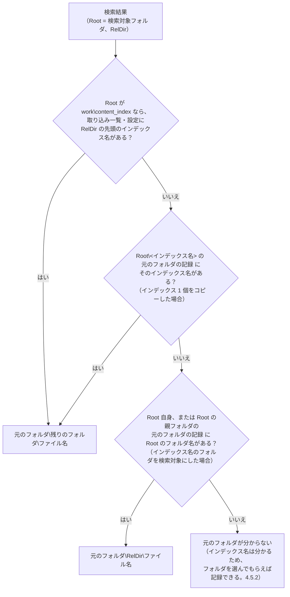
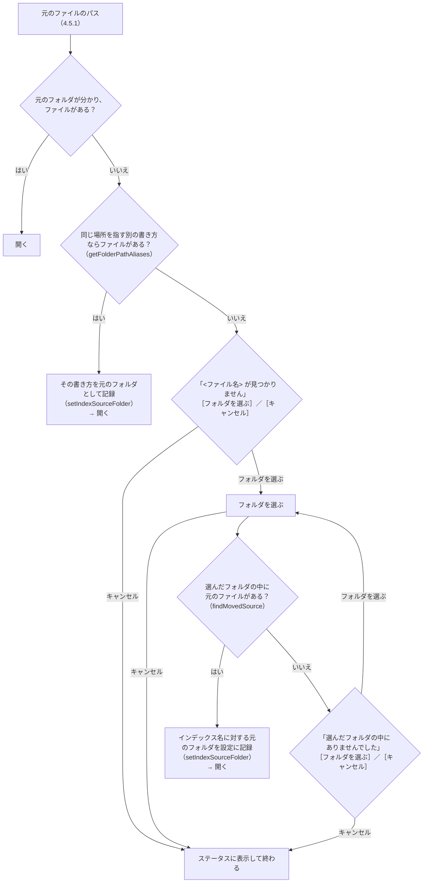

# 元のファイルを開く

扱うこと: 検索結果の行から元のファイルを開く方法（開き方の 3 種類・Excel の該当セルへの移動）、インデックスを別の PC・場所で使うときの元のフォルダの特定、元のファイルが見つからないときの扱い。扱わないこと: 検索結果の表そのもの（[検索タブ](search-tab.md)）。先に読むページ: [検索タブ](search-tab.md)。

検索結果の行から元の Office ファイルを開く方法（開き方の 3 種類・Excel の該当セルへの移動）と、インデックスを別の PC・場所で使うときに元のファイルを見つける仕組み（[元のフォルダの特定（インデックスを別の PC・場所で使う場合）](#元のフォルダの特定インデックスを別の-pc場所で使う場合)・[元のファイルが見つからないとき（元のフォルダを設定する）](#元のファイルが見つからないとき元のフォルダを設定する)）を定める。

ダブルクリック、Enter、選択行のプレビューの［Excel で開く］（Word・PowerPoint は［開く］。[選択行のプレビュー](preview.md)）、または右クリックメニュー［元のファイルを開く］で開く。

| 項目 | 仕様 |
|---|---|
| 元のファイルのパス | 結果のフォルダの先頭（インデックス名）からクロール対象フォルダを引き、`<クロール対象フォルダ>\<残りのフォルダ>\<ファイル名>` とする（`getSourceLocation` / `resolveSourcePath`、[元のフォルダの特定（インデックスを別の PC・場所で使う場合）](#元のフォルダの特定インデックスを別の-pc場所で使う場合)）。記録された置き換え（[元のファイルが見つからないとき（元のフォルダを設定する）](#元のファイルが見つからないとき元のフォルダを設定する)）があれば反映する |
| 開き方 | 選択行のプレビューの［開き方］で選ぶ（既定は「通常」）。選んだ開き方は `setting.config` の `openMode` に保存し、次回も引き継ぐ（[画面での読み書き](../structure/settings-file.md#画面での読み書き)）。右クリックメニューでは、その時だけ別の開き方も選べる ・**通常**（`normal`）: 元のファイルをそのまま開く（編集して上書き保存できる） ・**読み取り専用**（`readOnly`）: 元のファイルを読み取り専用で開く（誤って上書き保存しない） ・**新規**（`new`）: 元のファイルを基にした無題のブック・文書として開く（元のファイルを占有しない） |
| Excel | 起動中の Excel があればそれを使い、無ければ起動する（COM）。ブックを開き（「読み取り専用」は `Workbooks.Open(<元のファイル>, , ReadOnly:=True)`、「新規」は `Workbooks.Add(<元のファイル>)`。そのブックが既に開いていれば、開き方によらずそのブックを使う）、**該当シートを表示して、一致したセル（最初に一致したセル。[結果の表](search-tab.md#結果の表) の「場所」列に出るセル番地）を選択する**。該当シートは「場所」と名前が同じシートとし（図形・コメント・ヘッダー・フッターの場所 `<シート名>[図形]` `<シート名>[コメント]` `<シート名>[ヘッダー・フッター]` は、`[…]` を除いたシート名。`splitObjectPlace` の Base。選ぶセルは図形の左上・コメントのセルで、ヘッダー・フッターは行にセル番地が無いためセルを選ばない）、無ければ名前を `toSafeFileName` で全角に置き換えて一致するシートとする（以前の版のインデックスは、シート名の記号を全角に置き換えてあるため。`衝突"` と `衝突”` のように置き換えると重なるシートがあるので、名前が同じものを先に選ぶ）。**`Worksheets` に同じ名前のシートが無ければ、グラフシート（`Charts`）から同じ名前・全角に置き換えて一致するものを探して表示する（セルは選ばない）**。COM で失敗したら、ファイルを既定のアプリで開くだけにする（「新規」ならエクスプローラーの［新規］と同じ動作） |
| Word・PowerPoint | ファイルを既定のアプリで開く。エクスプローラーの右クリックメニューと同じシェルの動詞を使う（「読み取り専用」は `OpenAsReadOnly`、「新規」は `New`）。該当ページ・スライドへの移動はしない（[今後の検討](implementation.md#今後の検討)） |
| テキスト（`.txt` 等） | ファイルを既定のアプリで開く。動詞は試さず、常にそのまま開く（開き方の指定にかかわらない）。テキストの既定のアプリの多くには「読み取り専用」「新規」の動詞が無く、毎回「開けなかったため元のファイルを開きました」と出るのを避けるため。該当行への移動はしない |
| ファイルが無い・元の場所が分からない | 元のファイルのあるフォルダを選んでもらい、その中から探す（[元のファイルが見つからないとき（元のフォルダを設定する）](#元のファイルが見つからないとき元のフォルダを設定する)）。選ばなかった場合は、ステータスに `元のファイルが見つかりません：<パス>` と表示する |
| 元のフォルダがネットワークにある | 確かめている間・接続できないときの表示は [元のフォルダ・元のファイルがネットワークにあるとき](network.md) |

右クリックメニュー：

| メニュー | 動作 |
|---|---|
| 元のファイルを開く（編集する） | 「通常」で開く |
| 読み取り専用で開く | 「読み取り専用」で開く |
| 新規で開く | 「新規」で開く |
| フォルダを開く | 選択行のプレビューの［フォルダを開く］と同じ。エクスプローラーで元のファイルを選択した状態で開く（`explorer /select,`）。ファイルが無い・元の場所が分からない場合は、元のファイルを開くときと同じくフォルダを選んでもらう |
| 選択行をコピー（Ctrl+C） | 選択行を `work/検索結果.txt` と同じ形式（`toResultHeader` の見出し＋`toResultLine` の各行）でクリップボードに入れる。Excel に貼るとセルが元の列の位置に並ぶ。場所の文字は場所ごとの表記（`describePlace`。`[シート]売上` など。セル番地は付けない）で、ファイル名と行番号の列は残す |
| ファイルのパスをコピー | 元のファイルのフルパス（置き換えを反映。分からない場合は、インデックスの中の位置 `<相対フォルダ>\<元のファイル名>`）。ファイルがあるかは確かめず、フォルダも聞かない |

「読み取り専用」「新規」で開く：

| 開き方 | 開いた後 | 元のファイル |
|---|---|---|
| 通常 | 元のファイルを編集し、上書き保存できる | 編集できる状態で開く |
| 読み取り専用 | 上書き保存はできない（編集するときは名前を付けて保存する）。誤って元のファイルを変えてしまうことがない | 読み取り専用で開く（実測では、開いている間もほかのアプリ・利用者が書き込めた） |
| 新規 | 元のファイルを基にした新しい無題のブック・文書（例: `見積.xlsx` → `見積1`）。保存するときは名前を付けて保存になる | 読み込む間だけ読み、開いた後は占有しない。共有フォルダのファイルをほかの人が編集中でも開け、ほかの人の編集・上書き保存も妨げない |

- Word・PowerPoint はシェルの動詞で開く。その動詞が登録されていない種類のファイルは、元のファイルをそのまま開き、ステータスに `読み取り専用で開けなかったため、元のファイルを開きました：<パス>` / `新規で開けなかったため、元のファイルを開きました：<パス>` と表示する。`ProcessStartInfo.Verbs` は `New` を一覧に含めないため、事前に確かめず実行して例外（`Win32Exception`）で判断する（`openWithShell`）。
- `Start-Process` はパスの `[` `]` をワイルドカードとして扱うため、`ProcessStartInfo` で開く。
- ［開き方］は、起動時に設定から読み込むときは保存しない（設定していない利用者の `setting.config` を作らないため。[画面での読み書き](../structure/settings-file.md#画面での読み書き)）。

## 元のフォルダの特定（インデックスを別の PC・場所で使う場合）

インデクサは元のフォルダの記録（`元のフォルダ.txt`。インデックス名とクロール対象フォルダの対応。[クロール対象フォルダと取り込み対象](../indexing/crawl.md)）を、**各インデックスのフォルダ（`work\content_index\<インデックス名>`）に 1 件分ずつ**置く。このため、`work\content_index` ごとコピーしても、`<インデックス名>` のフォルダだけを別の PC の `work\content_index` 直下へコピーしても、元のファイルの場所が分かる。

対応は次の順に読み、後のもので上書きする（`getSourceFolderMap`）。**設定が最も優先される**ため、フォルダを移したときは設定の場所（インデックス名に対する 1 か所）を書き換えるだけで、元のファイルを開けるようになる。

| 順 | 情報 | 内容 |
|---|---|---|
| 1 | インデックスの元のフォルダの記録（`元のフォルダ.txt`。`<インデックス名>` のフォルダの中。検索対象フォルダにインデックス名のフォルダを直接指定した場合は、その直下） | インデックスを作ったときの場所。インデックスをコピーしても付いてくる |
| 2 | 取り込み一覧（`work\取り込み一覧.tsv`） | 既定の本文インデックスのフォルダ（`work\content_index`）のときだけ |
| 3 | 設定（`setting.config` の `targetFolders` / `indexSources`） | **インデックス名に対する今の置き場所**。利用者が指定した情報のため最優先 |

- 読んだ対応は、検索対象フォルダごとに画面でキャッシュする（インデックス作成が終わったとき・元のフォルダを設定したときに捨てる）。
- 元のフォルダの記録の無い古いインデックスは、インデックス作成を 1 回実行すると作られる（取り込みが必要なファイルが無くても作る）。
- どれにも無い場合は、元のフォルダが分からない（`Known` = `$false`）。インデックス名（相対フォルダの先頭）は分かるため、フォルダを選んでもらえば設定に記録できる（[元のファイルが見つからないとき（元のフォルダを設定する）](#元のファイルが見つからないとき元のフォルダを設定する)）。

## 元のファイルが見つからないとき（元のフォルダを設定する）

別の PC ではドライブ名・共有フォルダのパスが違う、フォルダを移した、といった場合は元のパスのままでは開けない。その場合は元のファイルのあるフォルダを選んでもらい、**そのインデックスの元のフォルダ（今の置き場所）として設定に記録する**（`setIndexSourceFolder`）。インデックス名に対して 1 か所を持つため、以後は同じインデックスのどのファイルも聞かずに開ける。

- 記録された場所にファイルが無い場合は、フォルダを聞く前に**同じ場所を指す別の書き方**でも探す（`getFolderPathAliases`）。
  ファイルサーバーのフォルダは、ネットワークドライブ（`Z:\見積`）と UNC パス（`\\server\share\見積`）のどちらでも書けるため、
  インデックスを作った PC と、この PC でドライブの割り当てが違っても、聞かずに開ける。見つかった書き方はそのまま元のフォルダとして記録する。
  この PC にそのドライブの割り当てが無い場合は別名が分からないため、フォルダを選んでもらう。
- 選ぶフォルダは、インデックスの元のフォルダに当たるフォルダでも、その下のどのフォルダ（ファイルのあるフォルダなど）に当たるフォルダでもよい。元の相対フォルダが `2024\見積` なら、`<選んだフォルダ>\2024\見積\<ファイル名>`、`<選んだフォルダ>\見積\<ファイル名>`、`<選んだフォルダ>\<ファイル名>` の順に探し、最初に見つかったものを使う。
- 記録するのは、選んだフォルダから相対フォルダの分だけ上に戻ったフォルダ（`findMovedSource` の `Root`）。どのフォルダを選んでも、インデックスの元のフォルダに当たる 1 か所が記録される。上に戻れない場合は記録せず、そのファイルを開くだけにする。
- 記録先（`setIndexSourceFolder`、[画面での読み書き](../structure/settings-file.md#画面での読み書き)）:
  - そのインデックス名がクロール対象フォルダ（`targetFolders`）にあれば、そのフォルダの `path` を書き換える（次のインデックス作成では、この新しいフォルダを取り込む）。
  - 無ければ `indexSources` に `{name, path}` として記録する（取り込まない、検索だけのインデックス）。
- フォルダ選択の初期位置は、元のパスの上のフォルダのうち存在する最も深いフォルダ。
- 記録したら、元のフォルダの対応のキャッシュ（[元のフォルダの特定（インデックスを別の PC・場所で使う場合）](#元のフォルダの特定インデックスを別の-pc場所で使う場合)）を捨てて読み直す。

確認は確認ダイアログ（[確認ダイアログ](common.md#確認ダイアログshowconfirm)）で行う。見出しは `<ファイル名> が見つかりません`、ボタンは［フォルダを選ぶ］。

メッセージ：

| 場面 | メッセージ |
|---|---|
| ファイルが無い | `✗ 記録されていた場所にありません`（`<パス>`）＋ `→ 今ある場所のフォルダを選べば開けます`（`選んだ場所はインデックス「<名前>」に覚えさせるので、同じインデックスのほかのファイルも次から開けます`） |
| 元のフォルダが分からない | `✗ このファイルが今どこにあるか、記録がありません`（`<相対パス>`）＋ 上と同じ `→` の行 |
| フォルダ選択の説明 | `「<元のフォルダ>」に当たるフォルダ（または <ファイル名> のあるフォルダ）を選んでください`（元のフォルダが分からない場合は `<ファイル名> のあるフォルダ（またはインデックス [<名前>] の元のフォルダ）を選んでください`） |
| 選んだフォルダに無い | `✗ 選んだフォルダの中にありませんでした`（`選んだフォルダ：<フォルダ>` / `探したファイル：<相対パス>`）＋ `→ 別のフォルダを選んで、もう一度探せます` |
| 記録した（ステータス） | `インデックス [<名前>] の元のフォルダを <フォルダ> に変えました`（続けて開いた結果で上書きされる） |

