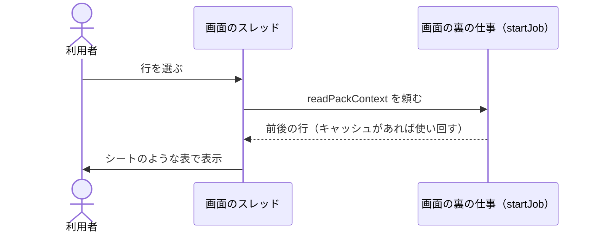
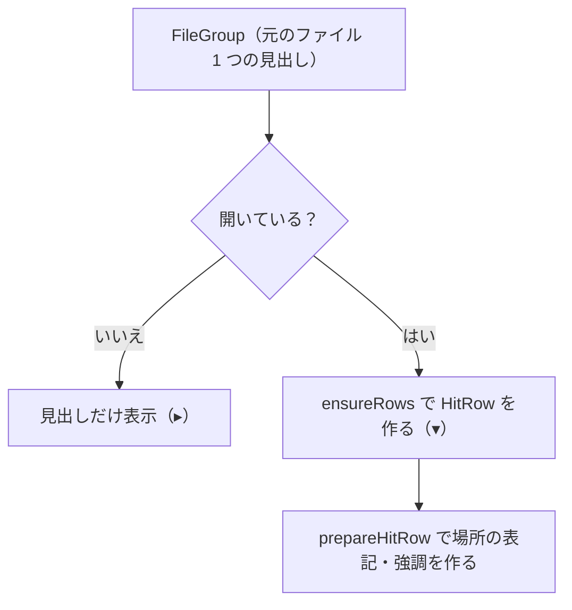

# 選択行のプレビュー

扱うこと: 結果の表で選択した行の前後をシートのような表で見せる選択行のプレビュー、結果の表を元のファイルごとの見出しでまとめる表示。扱わないこと: 検索そのもの（[検索タブ](search-tab.md)）、元のファイルを開く（[元のファイルを開く](open-file.md)）。先に読むページ: [検索タブ](search-tab.md)。

## 選択行のプレビュー

結果の表で行を選ぶと、表の下に**選択行とその前後の行**を表示する。元のファイルを開かなくても、一致した場所の周り（見出しの行・隣のセルなど）が分かる。

| 項目 | 仕様 |
|---|---|
| 表示・非表示 | **常に表示する**（行を選んでいなくても枠を出したままにする）。行を選ぶたびに表の高さが変わらず、次に選んだ行も同じ場所に出る。行を選んでいないときは、枠の中に `結果の表で行を選ぶと、ここにその前後の行を表示します。` と出し、［開く］［フォルダを開く］は押せない |
| 高さの変更 | 結果の表とプレビューの間の線を**上下にドラッグして高さを変えられる**（`GridSplitter`）。結果の表は 60px、プレビューは 100px（列見出し＋1 行が見える高さ）を下限とする。初めの高さは 200px。高さは画面を開いている間だけ保つ（設定には保存しない）。**高さを変えると、出す行数もそれに合わせて変わる**（下の「表示する行」） |
| 見出し | `<相対フォルダ\ファイル名> ・ <場所（行ごとの表記）> ・ <種別>`（例: `営業部\見積.xlsx ・ [シート]4月!B3 ・ セル`。Excel はセル番地が場所に含まれる）。右に［開く］（右の［▾］のメニューで開き方を選ぶ。[元のファイルを開く](open-file.md)）と［フォルダを開く］を置く。動作は [元のファイルを開く](open-file.md) の［元のファイルを開く］・［フォルダを開く］と同じ |
| 表示する行 | **プレビューの高さに収まるだけ**（`getPreviewContextLines`）。表示できる行数を「行の表示領域の高さ ÷ 1 行の高さの目安 22px（`previewRowHeight`）」で求め、選択行の前後に同数ずつ割り当てる（余りの 1 行は後ろに付ける）。下限の高さでは**選択行の 1 行だけ**、高くするとその分だけ前後の行が見える。上限は 101 行（`maxPreviewRows`）。 高さを変えると（`PreviewScroll` の `SizeChanged`）読み直すが、ドラッグ中は何度も起きるため、選択の変更と同じ 120 ms のタイマーでまとめて 1 回だけ読む。このとき横スクロールの位置は変えない（ドラッグのたびに左へ戻らないようにするため） 本文インデックスのファイルから、ヒットの元のファイル・場所（`Book`・`Location`）の中の該当の行だけを取り出す（`readPackContext`、[実装構成](implementation.md#実装構成)）。Excel は場所の N 行目がシートの N 行目なので、元のシートの前後の行になる。場所の先頭・末尾では、ある行だけを表示する |
| 読み込みの速さ | 大きな本文インデックスのファイルでも画面が固まらないよう、次の 3 つを行う。 ・読み込み（`readPackContext`）は画面のスレッドでは行わず、画面の裏の仕事のスレッド（`startJob`。`BackgroundQueue`）で行う。読み終わったら表を作る。読んでいる間に別の行を選んだら、古い行の結果（頼んだ番号が古いもの・今選んでいない行のもの）は捨てる ・検索で読んだ本文インデックスのファイルの内容と場所の一覧（`newTsvTextCache`。[検索を速くする仕組み](../search/speed.md)）があれば、ファイルを読み直さずに使う。本文インデックスのファイルが書き換わったら（大きさ・更新日時が変わったら）読み直す。キャッシュに無い（上限を超えた等）ときは、選ぶたびに本文インデックスのファイルを読む ・↑↓で続けて選択が変わったときは、最後の選択の 120 ms 後に 1 回だけ読む |
| 表示する列 | 横に長い行（2,000 列など）をそのまま並べると画面が重くなるため、**一度に表示する列は 200 列まで**にする（`MaxPreviewColumns`）。一致したセルが真ん中に来るように範囲を選び、行の端に近ければその端に寄せる。省略したときは、プレビューの下に `表示は <BQG〜BXX> の 200 列（全 2,000 列）` と出す（`PreviewNote`）。ほかの列は元のファイルを開いて確認する 実測（2,000 列の行）: 行を選んでからプレビューが出るまで、全列を並べると約 2.8 秒、200 列までにして約 0.6 秒 |
| 表の形 | 左端に行番号、上に列見出し（Excel は A, B, C…、Word・PowerPoint はタブで分けた順の 1, 2, 3…）。セルの分け方は `splitTsvCells` と同じ（`"` で囲まれたセルは 1 セル） |
| 強調 | 選択行は行全体を薄い青にし、行番号を太字にする。一致したセルは黄色の背景・太字（前後の行で一致したセルも同じ） |
| 列の幅 | 初めの幅は、見出しと各行のセルの文字数（セル内改行のあるセルは最も長い行）から決める（Excel は最大 260px、段落が 1 列になる Word・PowerPoint は最大 640px）。**列見出しの右端をドラッグすると幅を変えられる**（下限 24px）。変えた幅はその表示の間だけ有効で、ほかの行を選ぶと初めの幅に戻る |
| セルの表示 | セル内改行のあるセルは改行のまま折り返して表示する（3 行程度まで。入りきらない分は隠れる）。1 行のセルも幅に入りきらなければ折り返す **長いセルは先頭 300 文字＋`…` で表示**し（`MaxCellChars`）、ツールチップは先頭 1,000 文字まで（`MaxToolTipChars`）。コピー（下の「値のコピー」）は切り詰めずに元の値をそのまま使う。列の幅を決めるときも各行の先頭 100 文字までしか見ない（`MaxWidthChars`。幅には上限があるため結果は変わらない） 実測（32,767 文字のセル）: 切り詰めないと約 0.9 秒、切り詰めて約 0.4 秒 |
| 値のコピー | セルをクリックするとそのセルを選び（青い枠）、**Ctrl+C でその値をコピーする**。Shift＋クリック、またはドラッグで四角い範囲を選べる。右クリックメニューに、先頭に［元のファイルのこの場所を開く］（太字。ダブルクリックと同じ処理）、区切りのあとに［選んだセルをコピー］［この行をコピー］を置く（並び・文言は判断層の `getPreviewMenuItems`。プレビューが無いときは出さない） ・1 セル：値をそのまま（引用符・エスケープなし）入れるので、ほかのアプリの入力欄にそのまま貼れる ・複数セル：タブ区切り・行は改行で入れる。改行・タブ・`"` を含むセルは `"` で囲む（Excel に貼り付けると元の位置に並ぶ） ・ステータスに `セルの値をコピーしました：<値>` / `N 個のセルをコピーしました（Excel に貼り付けると、元の位置に並びます）` と表示する |
| 縦スクロール | 出す行数は高さに合わせるが、セル内改行のある行は 1 行の目安（22px）より高いため入りきらないことがある。そのときは縦にスクロールする。**列見出しは行とは別のスクロールに置いて固定**し、縦スクロールで隠れないようにする（横位置は行に合わせる） |
| 横スクロール | 選択行で最初に一致したセルが見えないときは、そのセルが見える位置まで横にスクロールする |
| 本文インデックスのファイルが読めない | インデックスが作り直された・削除されたなどで読めない・その場所が見つからないときは、選択行だけを表示する（読み込みのスレッドで失敗したときも同じ） |

## ファイルごとにまとめた表示

結果の表（No.7）は、**元のファイルごとの見出し**の下に、そのファイルでヒットした行を並べる。検索した直後は**すべて閉じた状態（見出しだけ）**にし、どのファイルに何件あるかを先に見せる。1 つのファイルに多くヒットしても一覧が長くならず、件数が多くても表に入れる項目がファイルの数だけで済むため速い。

| 項目 | 仕様 |
|---|---|
| 見出し | 元のファイル 1 つに 1 行。左から、開閉の印（閉じている `▸` / 開いている `▾`）、アプリのアイコン（Excel は緑の `X`、Word は青の `W`、PowerPoint は赤の `P`）、ファイル名（太字）、フォルダ（インデックスフォルダからの相対パス）。右端に、ヒットした場所と件数（`[シート]4月 ほか 2 か所` ・ `3 件`）。ツールチップは元のファイルのフルパス |
| 場所の表記 | 場所ごとの表記（`describePlace`。`[シート]4月`・`3 ページ（目安）`・`スライド 7` など。結果の表の「場所」列はこれにセル番地を足したもの）。2 か所以上なら、見つかった順の先頭と残りの数を `[シート]4月 ほか 2 か所` のように出す（`describeFileLocations`）。絞り込み中もすべてのヒットから作る |
| 件数 | 見出しの件数は、そのファイルで**絞り込みに合う行の数**。No.5 の件数は `該当 N 件（M ファイル）`（行の数と、ファイルの数） |
| 開く・閉じる | 見出しをクリック（または選んで Enter）すると、そのファイルの行を開く・閉じる。Shift・Ctrl を押しながらのクリックは複数選択なので切り替えない。No.14 の［すべて開く］［すべて折りたたむ］で、すべてのファイルを開く・閉じる。検索中に［すべて開く］を押すと、そのあと見つかったファイルも開いた状態で足す。新しく検索すると、すべて閉じた状態に戻る |
| 見出しを選んだとき | そのファイルの先頭の行（絞り込みに合うもの）を選んだものとして扱う。選択行のプレビュー（[選択行のプレビュー](#選択行のプレビュー)）はその行を出し、［開く］［フォルダを開く］、右クリックメニューの［元のファイルを開く］などはその行の場所を開く。ダブルクリックでは開かない（クリックで開閉するため）。Ctrl+C（［選択行をコピー］）は、そのファイルの行（絞り込みに合うもの）をすべてコピーする |
| 並び順 | ファイルは既定でパス順（見つかった順）。列見出し（場所・種別・該当行）をクリックすると、ファイルの中の行をその列で並べ替え、ファイルの順は並べ替えた後の先頭の行の順にする（もう一度で逆順。`sortFileGroups`）。「場所」は TSV の場所の名前 → 行番号 → 見つかった順の順にする（セル番地の文字の順では `A10` が `A9` の前に来るため、番地ではなく行番号で並べる）。同じシートでも `売上`（セル）・`売上[コメント]`・`売上[図形]` は別の場所の名前のため、「場所」で並べ替えるとセル → コメント → 図形の塊になる。ファイル名・フォルダでの並べ替えは無く、ファイルの順は見つかった順か、これらの列で並べ替えたときの先頭の行の順になる。検索中に並べ替えたときは、検索の終わりに、あとから来た行も含めて並べ直す |
| 絞り込み | 絞り込み（[絞り込み](search-tab.md#絞り込み)）はファイルの中の行に当て、合う行が 1 つも無いファイルは見出しも出さない（`selectShownRows`・`getResultItems`） |
| 結果をファイルに出力 | 閉じているファイルの行も含め、絞り込みに合うすべての行を表の順に出力する（`getShownHitRows`。形式は [結果をファイルに出力](search-tab.md#結果をファイルに出力) のまま） |

- 表（`ResultGrid`）には、見出し（`FileGroup`）と、開いているファイルの行（`HitRow`）だけを入れる（`result_list.ps1`）。見出しの行は、行の形（`DataGridRow` の `Template`）を `tab_search.xaml` の `FileHeaderRow` に替えて、列をまたいだ 1 行にする。
- **行は必要になるまで作らない（遅延表示）。** 検索中は、ヒットを見出しの `Hits` に生のまま足すだけにし、1 回の取り込み（`pumpSearch`）の最後に、新しいファイルの見出しをまとめて表に入れる（`flushResults`）。表の行（`HitRow`。場所の表示・強調の元になる）は、ファイルを開いたとき・見出しを選んだとき・絞り込み・並べ替え・出力・コピーのときに、必要なファイルの分だけ作る（`ensureRows`）。見出しの件数は、絞り込んでいなければヒットの数（行を作らずに分かる）、絞り込み中は合う行の数にする。一致箇所の強調などは、画面に出た行だけで作る（`HitRow.Prepare`）。
- 開閉・絞り込み・並べ替えで多くの行を出し入れするときは、1 件ずつではなく表の中身をまとめて入れ替える（`rebuildResults`）。
- WPF の DataGrid のグループ化（`GroupStyle`）は使わない。グループ化は 1 件ごとに振り分けるため遅く（実測: 10,000 件・504 ファイルで、行ごとの一覧 約 3 秒 → グループ化 約 8〜9 秒。最初に閉じておいても速くならない）、列の幅が決まらない不具合もあったため。
- 実測（10,000 件・504 ファイル。検索スレッドが結果を出し終えたあと、画面が取り込み終えるまでの待ちが検索時間の大半を占める）: 検索中に行を作ると 約 4.0 秒（うち待ち 約 2.4 秒）、行を後で作ると 約 2.6〜2.9 秒（うち待ち 約 1.1〜1.3 秒）。代わりに［すべて開く］は、そのとき 10,000 行を作るため 約 1.1〜1.5 秒かかる（1 ファイルを開くときは、そのファイルの分だけ）。
- 判断（アプリの種類 `getAppKind`・場所の要約 `describeFileLocations`・表に並べる項目 `getResultItems`・絞り込み `selectShownRows`・並べ替え `sortFileGroups`・行を画面に出す準備 `prepareHitRow`）は判断層の `search\result_list_view.ps1` に置き、テストする。
- 見出しのアイコン（`xaml/search/result_list.xaml` の `Badge`）は `AppKind`（`getAppKind`）で色と頭文字を変える。Excel（緑・`X`）・Word（青・`W`）・PowerPoint（オレンジ・`P`）に加え、テキストファイルは灰色の地に `T`。
