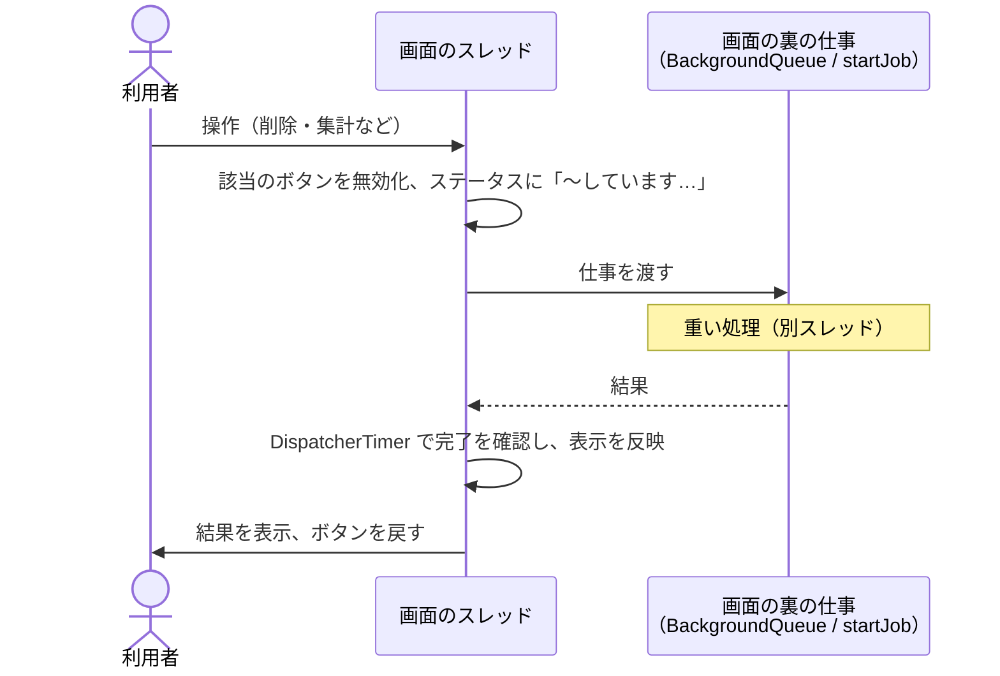

# 画面を固まらせない待たせ方

扱うこと: 画面のスレッドで重い処理をしない方針、繰り返し読むものを小さくする・無言の時間を作らない・止められるようにする・終わったことを知らせる具体策、実測、別スレッドとタイマーの扱い。扱わないこと: 画面の実装構成そのもの（[画面の実装構成](implementation.md)）。先に読むページ: [画面の実装構成](implementation.md)。

**画面が「応答なし」になることは、処理が長いこと自体よりも利用者を不安にさせる**（壊れたと思って強制終了され、インデックス作成が中断して Office のプロセスが残る）。そのため、次を守る。

| 方針 | 具体 |
|---|---|
| **画面のスレッドで 0.2 秒を超える可能性のある処理をしない** | ファイル数・行数に比例する処理（検索、取り込み一覧の集計、インデックスの削除、TSV の数え上げ）は別のスレッド（検索の司令・画面の裏の仕事。[スレッドの一覧](../structure/threads.md#スレッドの一覧)）で行い、終わったら画面のスレッドで結果を反映する。終わるまでは、その操作のボタンを無効にして何をしているかをステータスに出す |
| **繰り返し読むものは小さくする** | 1 秒ごとに読むものは、受け渡しの口の進み具合（`readIndexingProgress`。メモリ上の値）にする。数万行の取り込み一覧を毎秒読み直すと、その間ずっと画面が止まる（5 万行で 1 回約 1.4 秒）。書く側（インデクサ）が数えて進み具合に入れる |
| **無言の時間を作らない** | 待ちが数秒を超えうる場所では「何をしているか」を必ず出す（`クロールしています…` ＋ 今見ているフォルダ、`インデックス作成を終えています…` ＋ 今の後片付け、`検索対象のファイルを確認しています…（N 件）`、`インデックス […] の TSV を削除しています…`）。件数が増えるのが見えれば、止まっていないと分かる |
| **長い処理は止められるようにする** | インデックス作成は［中止］（ファイルの切れ目で止まる・続きから再開できる）、検索は［中止］（それまでの結果は残す） |
| **終わったことを知らせる** | インデックス作成が終わったとき、進み具合とステータスで知らせる（タスクバーのボタンを光らせる `FlashWindowEx` は P/Invoke が要るため使わない。[実行時コンパイル（csc.exe）を使わない](implementation.md#実行時コンパイルcscexeを使わない)） |

数万件規模での実測（この方針の根拠。Windows PowerShell 5.1・ローカルディスク。1 万 = 元ファイル 1 万件（取り込み一覧 1 万行・TSV 2 万件）、5 万 = 取り込み一覧 5 万行）:

| 処理 | 1 万 | 5 万 | 扱い |
|---|---|---|---|
| 取り込み一覧の読み込み（`readStatusFile`） | 0.32 秒 | 1.4 秒 | 1 行ごとに関数を呼ばない。毎秒は読まず、受け渡しの口の進み具合を読む |
| 取り込み一覧の書き出し（`writeStatusFile`） | 0.08 秒 | 0.22 秒 | 1 行ごとに関数・パイプラインを使わない（インデックス作成の開始・終了時の待ちに効く） |
| 状態の集計（`getIndexingState`） | 0.91 秒 | 5.3 秒 | 別スレッドで行う（`refreshIndexingState`）。日時の解析は必要なときだけ行う |
| 検索対象の数え上げ（本文インデックスに入れる前の TSV の列挙） | 2.2 秒（TSV 2 万件） | – | .NET で列挙する。検索スレッドで行い、途中の件数を表示する。今は本文インデックスのファイル（フォルダ・拡張子ごとに 1 つ）だけを列挙する（`getIndexPackFiles`） |
| インデックスの削除 | 6.7 秒（1 万フォルダ） | – | 別スレッドで行う（削除中は操作を止めてステータスに出す） |

> PowerShell 5.1 では**関数呼び出しが 1 回あたり約 50 マイクロ秒**かかる。5 万行で 1 行 1 回呼ぶと、それだけで約 2.7 秒になる。数万件を回すところでは、関数呼び出し・パイプライン（`ForEach-Object` / `Where-Object`）・`$obj.$名前` の動的アクセスを避ける（普通の場所では読みやすさを優先してよい）。

別スレッドとタイマーの扱い：

- スレッドの分け方・寿命・閉じる順番は [プロセスとスレッド](../structure/threads.md) にまとめる。画面のプロセスの中で、画面・検索・画面の裏の仕事・インデックス作成が別々のスレッドで動く。
- 検索は検索の司令のスレッド（`SearchService`。画面を開いている間 1 つ）が、要求（`newSearchRequest`）を 1 つずつ実行する。lib.ps1 の読み込みと照合のプールの用意は、スレッドを始めたときに 1 回だけ行う。結果は要求の中のキュー（`ConcurrentQueue`）に入れ、画面の `DispatcherTimer`（0.1 秒間隔）で取り出して表に加える（`pumpSearch`）。1 回に取り出す量は件数ではなく時間で区切る（件数で区切ると、ヒットが多いときに画面が止まる）。中止は要求の `Stop` で伝える。新しい要求を渡すと、前の要求の `Stop` を立てる。
- 本文インデックスのファイルの件数取得・取り込み一覧の集計・インデックスの削除・選択行のプレビューの読み込み・［9 プロセス停止］の定期的な一覧の取り直しとタブ見出しの ⚠ の判定は `startJob`（`shell.ps1`）で実行する。`startJob` は画面の裏の仕事のスレッド（`BackgroundQueue`。2 つ。長い仕事の間もプレビューが待たないため）に渡す。各スレッドは最初の仕事の前に lib.ps1 を 1 回だけ読み込む。終わったかは `DispatcherTimer`（`jobTimer`。仕事がある間だけ 0.05 秒間隔）で確かめ、画面のスレッドで `onDone` を呼ぶ。同じ集計が重ならないよう、実行中なら「もう一度」の印だけを立てて、終わってからやり直す。
- **`startJob` の 4 つ目の引数 `queue` で列を選ぶ**（既定は `"default"`。上の `BackgroundQueue`）。届かないネットワークのフォルダ（元のフォルダ・元のファイル。[元のファイルを開く](open-file.md)）に触る仕事は `"network"` を渡す。ネットワークを調べる専用の列は `ensureNetworkQueue` が初めて使うときに作り（`BackgroundQueue` をもう 1 つ）、両方のスレッドを空の仕事で温める。ネットワークのパスの無い利用者には、この列も lib.ps1 の追加の読み込みも増えない（[スレッドの一覧](../structure/threads.md#スレッドの一覧)）。
- **ネットワークのパス（UNC・ネットワークドライブ）は `testNetworkPath`（`shared/core/folder.ps1`）で、共有に接続せずに見分ける。** `\\server\share\…`・`\\?\UNC\…` は UNC。`\\?\C:\…`（`toLongPath` の形）・`\\.\…` はドライブ文字として扱い、`[System.IO.DriveInfo]` の `DriveType` を見る（`GetDriveType` は共有に接続しない）。ローカルとするのは `Fixed`・`Removable`・`CDRom`・`Ram` だけで、`Network` と、切断したドライブがそう見えることのある `NoRootDirectory`・`Unknown` は安全な側に倒してネットワークとする。ローカルのパスは今までどおり画面のスレッドでその場で確かめ、ネットワークのパスだけを `"network"` の列に出す。「見つからない」と「接続できない」は `Test-Path` では区別できない（届かない共有でも例外を出さず `$false` を返すことがある）ため、例外を投げる呼び出し（`[System.IO.File]::GetAttributes`）で調べる `getPathState`（`shared/core/fs.ps1`）を使う。
- インデックス作成は `newIndexingSession` で画面のプロセスの中のスレッド（MTA・BelowNormal）で実行し、`DispatcherTimer`（1 秒間隔）で `IsRunning` と受け渡しの口の進み具合（`readIndexingProgress`）を確認する（[インデックス作成の進み具合](indexing-run.md#インデックス作成の進み具合)）。終わったら受け渡しの口の終了コード（`GetExitCode`）で表示を分け（[中止・終了・ログ](indexing-run.md#中止終了ログ)）、`Close` でスレッドを片づける。
- 進み具合の段階が `確認` になったら、インデックス作成の確認ダイアログを開く（[インデックス作成の確認ダイアログ](indexing-run.md#インデックス作成の確認ダイアログ)）。**ダイアログを開いている間も `DispatcherTimer` は動く**（`ShowDialog` は入れ子のメッセージループのため）。開く前に「開いた」ことにして、二重に開かないようにする。
- 多重起動は、ツールの配置フォルダごとの名前付き Mutex で防ぐ。2 つ目のプロセスは、同じくフォルダごとの名前付きイベント（`Local\tebunko_gui_activate_<フォルダのハッシュ>`）を合図して終了し、すでに開いている画面が `DispatcherTimer`（0.3 秒間隔）でそれを確認して `Window.Activate()`（＋最小化なら復帰）で前面に出す。別アプリが前面のときはフォーカスを奪えないことがある（OS の制限。P/Invoke の `SetForegroundWindow` は使わない。[実行時コンパイル（csc.exe）を使わない](implementation.md#実行時コンパイルcscexeを使わない)）。

注意（PowerShell 5.1）：`[System.IO.Directory]::EnumerateFiles` などの列挙を `foreach` で回し、`break`・`return`・`throw` で途中で抜けると、列挙子が Dispose されず、GC されるまで調べていたフォルダを掴んだまま残る。その間、そのフォルダと上のフォルダを移動・削除できない（`Directory.Move` がアクセス拒否になる）。途中でやめる列挙は `testAnyEntry`・`selectFirstEntries`（`shared/core/fs.ps1`）を通すか、配列で受ける `GetFiles`・`GetDirectories` にする。`tests/meta/enumeration.Tests.ps1` が機械的に確かめる。

注意（PowerShell 5.1）：`System.Collections.Generic.List[object]` を `@()` で配列にする・`[object[]]` 引数に渡すと例外（Argument types do not match）になる。結果のリストは `List[psobject]` にするか `.ToArray()` で返す。また PS class のメソッド内では、クラスのプロパティと同じ名前（大文字小文字を区別しない）のローカル変数は使えない（`$this.` の付け忘れとみなされる）ため、別名にする。**`GetNewClosure()` したスクリプトブロックの中では関数を名前で呼ばない**（`${function:関数名}` で先に関数の実体を変数に取り込み、`& $その変数` で呼ぶ）。`tebunko.bat` の起動（`powershell -Command "...; & gui.ps1"`）のように呼び出しが入れ子になっている実機では、閉じ込めたスクリプトブロックから名前で関数を解決できないため（`continueImportIndex` で見つかった不具合が一例。`scripts\tebunko\ui\open_source.ps1`・`scripts\tebunko\ui\index_tab.ps1` に例がある）。
